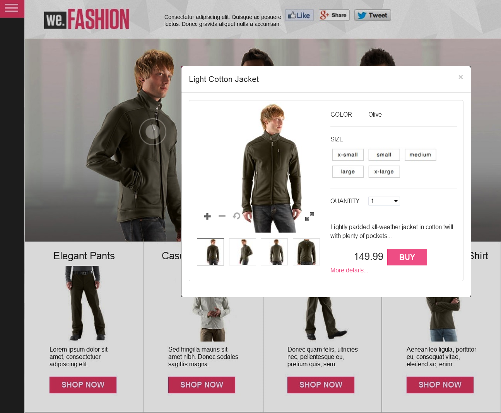

# Interaktiva bilder{#interactive-images}

Du kan enkelt skapa statiska bilder med engagerande upplevelser för kunderna genom att dra och släppa&quot;köpbara&quot; hotspot-områden på en bild. De köpbara hotspotten kombinerar ytterligare information om en produkt eller tjänst med en direktförsäljningsfunktion,&quot;Lägg i kundvagnen&quot; eller&quot;Köp&quot;. Kunderna kan välja dessa hotspot-områden som länkar direkt till produkten eller tjänsten, lägga till dem i en kundvagn eller länkas till en webbsida. Direktupplevelser som dessa ökar kundernas engagemang och konverteringar på er webbplats.

Här följer en köpbar banderoll med ett popup-fönster i snabbvyn. En användare aktiverar snabbvyn genom att trycka på cirkeln eller aktiveringspunkten på modellen.



Se [interaktiva bilder in action](https://experienceleague.adobe.com/tools/dynamic-media-demo/shoppable-banner/we-fashion-QVzoom/index2-shoppable.html) på webbsidan som visas ovan.

## Se hur interaktiva bildbanderoller skapas {#watch-how-interactive-image-banners-are-created}

Titta på en genomgång om [hur interaktiva bildbanderoller skapas](https://s7d5.scene7.com/s7viewers/html5/VideoViewer.html?videoserverurl=https://s7d5.scene7.com/is/content/&emailurl=https://s7d5.scene7.com/s7/emailFriend&serverUrl=https://s7d5.scene7.com/is/image/&config=Scene7SharedAssets/Universal_HTML5_Video_social&contenturl=https://s7d5.scene7.com/skins/&asset=S7tutorials/InteractiveCarouselBanner) (10 minuter och 33 sekunder). Du får också lära dig hur du förhandsgranskar, redigerar och levererar interaktiva bildbanderoller.

## Snabbstart: Interaktiva bilder {#quick-start-interactive-images}

Följande steg-för-steg-beskrivning av arbetsflödet hjälper dig att komma igång snabbt med interaktiva bilder i Adobe Experience Manager Assets.

Leta efter rubriken **Exempel** i några av snabbstartsaktiviteterna. Den innehåller en kort självstudiekurs som baseras på ett exempel från en [webbsida som ännu inte har Interactive Images tillagd.](https://experienceleague.adobe.com/tools/dynamic-media-demo/shoppable-banner/we-fashion/landing-0.html).


Självstudiekursen visar hur du integrerar interaktiva bilder på din egen webbplats.

Interactive Images:

1. **(Valfritt) Identifiera hotspot-variabler**. Om du använder fristående Adobe Experience Manager Assets och Dynamic Media ska du identifiera dynamiska variabler som används i den befintliga QuickView-implementeringen. Om du gör det kan du ange aktiveringspunktsdata när du skapar den interaktiva bilden. Se [(Valfritt) Identifiera hotspot-variabler](#optional-identifying-hotspot-variables).
Om du använder Experience Manager Sites, Experience Manager e-handel eller båda är det här steget inte nödvändigt.

1. **(Valfritt) Skapa en förinställning för Interactive Image Viewer**. Anpassa den grafiska bild som används för att representera aktiveringspunkter. Det är inte nödvändigt att skapa en egen förinställning för Interactive Image Viewer om du tänker använda den färdiga Interactive Image Viewer-förinställningen `Shoppable_Banner` i stället.
Se [&#x200B; (Valfritt) Skapa en förinställning för Interactive Image Viewer &#x200B;](/help/assets/dynamic-media/managing-viewer-presets.md#creating-a-new-viewer-preset).

1. **Överför en bildbanderoll**. Överför bildbanderoller som du vill göra interaktiva.
Se [Överföra en bildbanderoll](#uploading-an-image-banner).

1. **Lägg till aktiveringspunkter i en bildbanderoll**. Lägg till en eller flera hotspot-områden i en bildbanderoll. Associera vart och ett med en åtgärd som en hyperlänk, en snabbvy eller ett Experience Fragment. När du har lagt till aktiveringspunkter avslutar du den här uppgiften genom att publicera den interaktiva bilden.
Se [Lägga till aktiveringspunkter i en bildbanderoll](#adding-hotspots-to-an-image-banner).
Se [Förhandsvisa interaktiva bilder](#optional-previewing-interactive-images) - valfritt. Om du vill kan du visa en representation av din köpbara banner och testa dess interaktivitet.
Mer information om hur du publicerar interaktiva bildresurser finns i [Publicera Assets](/help/assets/dynamic-media/publishing-dynamicmedia-assets.md).

1. **Lägg till en interaktiv bild på webbplatsen eller på webbplatsen i Experience Manager**. Om du använder Webbplatser, e-handel eller båda kan du lägga till interaktiva bilder direkt på en webbsida i Experience Manager. Dra Interactive Media-komponenten till sidan. Se [Lägga till Assets för dynamiska media på sidor](/help/assets/dynamic-media/adding-dynamic-media-assets-to-pages.md).
Om du använder Experience Manager Assets och Dynamic Media fristående kopierar du inbäddningskoden på din webbplats. Integrera den sedan med en befintlig QuickView. Se [Integrera en interaktiv bild med webbplatsen](#integrating-an-interactive-image-with-your-website).
Om du använder en WCM-fil (Web Content Manager) från tredje part integrerar du den nya interaktiva videon med den befintliga snabbvyn som används på webbplatsen. Se [Integrera en interaktiv bild med en befintlig snabbvy](#integrating-an-interactive-image-with-an-existing-quickview).

## (Valfritt) Identifiera hotspot-variabler {#optional-identifying-hotspot-variables}

>[!NOTE]
>
>Den här aktiviteten krävs bara om följande är sant:
>
>* Du vill lägga till interaktivitet i bilden genom att aktivera snabbvyer.
>* Din implementering av Experience Manager använder *inte* ett ramverk för e-handelsintegrering för att hämta produktdata till Experience Manager från en e-handelslösning. Bland dessa lösningar finns IBM® WebSphere® Commerce, Elastic Path, SAP Hybris och Intershop.
>
>Om din implementering av Experience Manager använder e-handel kan du hoppa över den här uppgiften och fortsätta med nästa uppgift.

Börja med att identifiera dynamiska variabler som används i den befintliga QuickView-implementeringen så att du kan ange hotspot-data för att skapa den interaktiva bilden.

När du lägger till aktiveringspunkter i en banderollbild i Experience Manager Assets tilldelar du en SKU (Stock Keeping Unit). SKU:n är en unik identifierare för varje enskild produkt eller tjänst som du erbjuder. Och lägg till valfria variabler till varje hotspot. Sådana hotspot-variabler används senare för att matcha hotspot-områden med Quickview-innehåll.

Det är viktigt att kunna identifiera antalet och typen av variabler som ska kopplas till hotspot-data. Varje hotspot som läggs till i en banderollbild måste innehålla tillräckligt med information för att entydigt identifiera produkten i det befintliga backend-systemet.

Det finns olika sätt att identifiera en uppsättning variabler som ska användas för hotspot-data.

Ibland räcker det att rådfråga IT-specialister som är ansvariga för den befintliga Quickview-implementeringen. Sådana personer vet troligtvis vilken minimiuppsättning data som krävs för att identifiera Quickview i systemet. Det går dock även att analysera det befintliga beteendet för koden.

De flesta QuickView-implementeringar använder följande paradigm:

* Användaren aktiverar ett element i användargränssnittet på webbplatsen. Du kan till exempel välja en snabbvyknapp.
* Webbplatsen skickar en Ajax-begäran till serverdelen för att läsa in QuickView-data eller -innehåll vid behov.
* Quickview-data översätts till innehållet som förberedelse för återgivning på webbsidan.
* Slutligen återges sådant innehåll på skärmen visuellt i koden.

Då besöker man olika delar av den befintliga webbplatsen där QuickView-funktionen används. Starta sedan Quickview och hämta den Ajax-URL som skickats av webbsidan för att läsa in QuickView-data eller -innehåll.

Normalt behöver du inte använda några specialverktyg för felsökning. Moderna webbläsare har webbinspektörer som klarar ett bra jobb. Nedan följer några exempel på webbläsare som innehåller webbinspektörer:

* Om du vill visa alla utgående HTTP-begäranden i Google Chrome trycker du på F12 för att öppna panelen Utvecklarverktyg och väljer sedan fliken Nätverk.
Tryck på Command+Option+I på en Mac för att öppna panelen Utvecklarverktyg och välj sedan fliken Nätverk.

* I Firefox kan du aktivera plugin-programmet för Firebug genom att trycka på F12 och använda fliken Net. Du kan också använda det inbyggda verktyget Granska och fliken Nätverk.
Tryck på Command+Option+I på en Mac för att öppna panelen Utvecklarverktyg och välj sedan fliken Granska.

När nätverksövervakning är aktiverat i webbläsaren utlöser du snabbvyn på sidan.

Nu kan du hitta Quickview Ajax-URL:en i nätverksloggen och kopiera den inspelade URL:en för framtida analys. Vanligtvis skickas flera begäranden till servern när du utlöser snabbvyn. Vanligtvis är Quickview Ajax-URL en en av de första i listan. Den har antingen en komplex frågesträngsdel eller sökväg och dess MIME-svarstyp är antingen `text/html`, `text/xml` eller `text/javascript`.

Under den här processen är det viktigt att du besöker olika delar av webbplatsen, med olika produktkategorier och typer. Anledningen är att URL-adresser för snabbvyn kan ha delar som är gemensamma för en viss webbplatskategori. De ändras dock endast om du besöker ett annat område på webbplatsen.

I det enklaste fallet är den enda variabeldelen i snabbvyns URL produktens SKU. I det här fallet är SKU-värdet den enda datadel som du behöver för att lägga till aktiveringspunkter i banderollbilden.

I komplexa fall har dock QuickView-webbadressen olika element förutom SKU:n. Olika element kan till exempel innehålla kategori-ID, färgkod och storlekskod. I sådana fall är varje element en separat variabel i hotspot-datadefinitionen i den interaktiva bildfunktionen som kan köpas i Experience Manager Assets.

Titta på följande exempel på QuickView-URL:er och deras resulterande hotspot-variabler:

<table>
  <tbody>
  <tr>
    <td><p>En SKU, hittades i frågesträngen.</p> </td>
    <td><p>De inspelade URL:erna för snabbvyn är bland annat följande:</p>
    <ul>
      <li><p><code>https://server/json?productId=866558&source=100</code></p> </li>
      <li><p><code>https://server/json?productId=1196184&source=100</code></p> </li>
      <li><p><code>https://server/json?productId=1081492&source=100</code></p> </li>
      <li><p><code>https://server/json?productId=1898294&source=100</code></p> </li>
    </ul> <p>Den enda variabeldelen i URL:en är värdet på strängparametern productId= och det är tydligt ett SKU-värde. Därför behöver aktiveringspunkter bara SKU-fält med värden som <strong><code>866558</code></strong>, <strong><code>1196184</code></strong>, <strong><code>1081492</code></strong>, <strong><code>1898294</code></strong>.</p> </td>
  </tr>
  <tr>
    <td><p>En SKU, finns i URL-sökvägen.</p> </td>
    <td><p>De inspelade URL:erna för snabbvyn är bland annat följande:</p>
    <ul>
      <li><p><code>https://server/product/6422350843</code></p> </li>
      <li><p><code>https://server/product/1607745002</code></p> </li>
      <li><p><code>https://server/product/0086724882</code></p> </li>
    </ul> <p>Variabeldelen finns i den sista delen av sökvägen och blir SKU-värdet för aktiveringspunkter: <strong><code>6422350843</code></strong>, <strong><code>1607745002</code></strong>, <strong><code>0086724882</code></strong>.</p> </td>
  </tr>
  <tr>
    <td><p>SKU och kategori-ID i frågesträngen.</p> </td>
    <td><p>De inspelade URL:erna för snabbvyn är bland annat följande:</p>
    <ul>
      <li><p><code>https://server/quickView/product/?category=1100004&prodId=305466</code></p> </li>
      <li><p><code>https://server/quickView/product/?category=1100004&prodId=310181</code></p> </li>
      <li><p><code>https://server/quickView/product/?category=1740148&prodId=308706</code></p> </li>
    </ul> <p>I det här fallet finns det två olika delar i URL:en. SKU:n lagras i parametern <code>prodId</code> och kategori-ID:t <code></code> lagras i parametern <code>category=</code>.</p> <p>Därför är hotspot-definitionerna par. Det vill säga ett SKU-värde och en extra variabel som kallas <code>categoryId</code>. De resulterande paren är följande:</p>
    <ul>
      <li><p>SKU är <strong><code>305466</code></strong> och <code>categoryId</code> är <code>1100004</code>.</p> </li>
      <li><p>SKU är <strong><code>310181</code></strong> och <code>categoryId</code> är <strong><code>1100004</code></strong>.</p> </li>
      <li><p>SKU är <strong><code>308706</code></strong> och <code>categoryId</code> är <strong><code>1740148</code></strong>.</p> </li>
    </ul> <p> </p> </td>
  </tr>
  </tbody>
</table>

**Exempel**

Du kan använda samma metod som i de tre exemplen ovan för webbsidan [demo](https://experienceleague.adobe.com/tools/dynamic-media-demo/shoppable-banner/we-fashion/landing-0.html).

Demonstrationswebbsidan innehåller flera produktminiatyrbilder med en QuickView-knapp med etiketten&quot;See More&quot;. Med webbläsarens felsökningsverktyg fortfarande aktiverat markerar du varje knapp och noterar de inspelade URL:erna för snabbvyn. När du har aktiverat alla fyra snabbvyerna för produkten som finns på sidan, finns följande lista över snabbvybegäranden som har gjorts i serverdelen:

* `/datafeed/Male-Windbreaker.json`
* `/datafeed/Male-SimpleHenley.json`
* `/datafeed/Male-CamoPullover.json`
* `/datafeed/Female-QuiltedDownJacket.json`

Om du tittar på serveranropen kan du se att produktspecifik information bara finns i sökvägen för begäran. Du observerar också att frågesträngen inte används alls och att det finns två olika typer av datadelar:

* Den första typen är man eller kvinna. Du kan kalla den här&quot;produktkategorin&quot;.
* Den andra typen är produktnamn, till exempel CamoPullover, som troligen är produktens SKU.

Med hjälp av den här informationen har hela snabbvyns URL följande mönster:

`/datafeed/$categoryId$-$SKU$.json`

Baserat på en sådan analys använder du `categoryId` och `SKU` för aktiveringspunkter.

Du är nu redo att ladda upp en bildbanderoll och lägga till hotspot-områden i den med funktionen för interaktiv bild i Experience Manager Assets.

## (Valfritt) Skapa en förinställning för Interactive Image Viewer {#optional-creating-an-interactive-image-viewer-preset}

Du kan välja att använda den förinställda interaktiva bildvisningsinställningen `Shoppable_Banner` som medföljer Experience Manager Assets. Du kan också skapa en egen förinställning för visningsprogrammet som kan användas med interaktiva bilder.

När du skapar en anpassad förinställning för Interactive Image Viewer kan du bestämma utseendet på aktiveringspunkter i bildbanderollen. När du skapar visningsförinställningen kan du välja att använda en aktiveringspunktsbild från ett galleri med fördefinierade bilder.

När du har sparat visningsförinställningen aktiveras den automatiskt (aktiveras) på listsidan för visningsförinställningar i Experience Manager Assets. Den här funktionen innebär att den är synlig i komponenten Interactive Media och när du visar en resurs. Om du vill *leverera* en interaktiv banderoll med den här visningsförinställningen *publicerar* även din visningsförinställning. Den här regeln gäller för anpassade eller färdiga visningsprogramförinställningar.

**Så här skapar du en förinställning för Interactive Image Viewer:**

1. Gå till **[!UICONTROL Tools]** > **[!UICONTROL Assets]** > **[!UICONTROL Viewer Presets]** i den vänstra listen.
1. Välj **[!UICONTROL Create]** i sidans övre högra hörn.
1. I dialogrutan Ny visningsförinställning för visningsprogrammet skriver du ett namn som beskriver förinställningen för det interaktiva visningsprogrammet för banderollen.

   Titeln visas på listsidan för visningsförinställningar när du har sparat.

1. I listrutan Multimedietyp väljer du **[!UICONTROL Interactive Image]**.
1. Välj **[!UICONTROL Create]**.
1. Välj fliken **[!UICONTROL Appearance]** på sidan Redigera visningsförinställning.
1. Gör något av följande:

   * Om du vill överföra en egen hotspot-bild som du vill använda på bilder väljer du ikonen Resursväljaren. Gå till den hotspot-bild som du vill använda på sidan Välj innehåll och markera den. Markera bockmarkeringsikonen i det övre högra hörnet.
   * Om du vill välja en fördefinierad hotspot-bild väljer du ikonen för Hotspot-galleriet. Markera den hotspot-bild som du vill använda på paletten för aktivt punktgalleri.

1. Välj **[!UICONTROL Save]** i sidans övre högra hörn.

   Var noga med att publicera den nya visningsförinställningen.

   Se [Publicera visningsförinställningar](/help/assets/dynamic-media/managing-viewer-presets.md#publishing-viewer-presets).

   Du kan nu ladda upp en bildbanderoll.

## Överföra en bildbanderoll {#uploading-an-image-banner}

Om du redan har överfört de bilder du vill använda går du vidare till nästa steg, [Lägga till aktiveringspunkter i en bildbanderoll](#adding-hotspots-to-an-image-banner).

**Så här överför du en bildbanderoll:**

1. Överför bildbanderoller som du vill göra interaktiva.

   Se [Överför resurser](/help/assets/manage-digital-assets.md#uploading-assets).

   Nu kan du lägga till aktiveringspunkter i bildbanderollen. Se nästa uppgift nedan.

## Lägga till aktiveringspunkter i en bildbanderoll {#adding-hotspots-to-an-image-banner}

Du kan lägga till aktiveringspunkter i en bildbanderoll med redigeraren på sidan Hantering av aktiveringspunkter.

När du lägger till aktiveringspunkter kan du definiera dem som en snabbvypopup-visning, som en hyperlänk eller som en upplevelsefragment.

Se [Upplevelsefragment](/help/sites-cloud/authoring/fragments/content-fragments.md).

>[!NOTE]
>
>Delningsverktygen för sociala medier i Interactive Image stöds inte när du bäddar in visningsprogrammet i ett Experience Fragment. Använd eller skapa i stället visningsförinställningar som inte har verktyg för delning av sociala medier. Med sådana visningsförinställningar kan du bädda in dem i Experience Fragments.

Alternativen Ångra och Gör om, nära det övre högra hörnet på sidan, stöds under den aktuella skaps-/redigeringssessionen.

När du är klar med att skapa en interaktiv bild kan du använda Förhandsgranska för att se hur den interaktiva bilden ser ut för kunderna.

Se [&#x200B; (Valfritt) Förhandsvisa interaktiva bilder &#x200B;](#optional-previewing-interactive-images).

>[!NOTE]
>
>När du lägger till aktiveringspunkter i en bild i en interaktiv bild eller en Carousel-banderoll lagras hotspot-informationen på samma metadataplats. Platsen är relativ till bildens plats, oavsett om det är en interaktiv bild eller en Carousel Banner. Den här funktionen innebär att du enkelt kan återanvända samma bild tillsammans med dess definierade hotspot-data i båda visningsprogrammen.
>
>Observera dock att Carousel Banners stöder bildscheman på bilder som även kan innehålla hotspot-områden, vilket en interaktiv bild inte gör. Tänk på detta om du tänker skapa en interaktiv bild eller Carousel Banner som använder samma bild. Du kan i stället skapa interaktiva bilder och Carousel Banners med separata kopior av samma bild.
>
>Se även [Carousel Banners](/help/assets/dynamic-media/carousel-banners.md).

>[!NOTE]
>
>Om du redigerar interaktiva bilder med aktiveringspunkter och beskär bilden tas dina aktiveringspunkter bort.

**Så här lägger du till aktiveringspunkter i en bildbanderoll:**

1. I vyn Assets går du till den bildbanderoll som du vill göra interaktiv.
1. Gör något av följande:

   * Hovra över bilden och välj sedan **[!UICONTROL Select]** (bockmarkeringsikon). Välj **[!UICONTROL Edit]** i verktygsfältet.

   * Håll pekaren över bilden och välj sedan **[!UICONTROL More actions]** (ikonen med tre punkter) **[!UICONTROL > Edit]**.

   * Markera bilden om du vill öppna den på sidan Detaljvy. Välj **[!UICONTROL Edit]** i verktygsfältet.

1. I närheten av det övre vänstra hörnet av sidan väljer du **[!UICONTROL Add Hotspot]** (pekare för att välja ikon) för att öppna sidan för hantering av aktiveringspunkter.
1. Välj **[!UICONTROL Hotspot]** i sidans övre vänstra hörn.

   1. Välj **[!UICONTROL Hotspot]** i det övre vänstra hörnet på sidan Hantering av hotspot.
   1. På bilden väljer du en plats där du vill att hotspot-området ska visas. Dra hotspot-området om det behövs för att justera dess placering. Du kan också använda piltangenterna på tangentbordet för att styra positionen för en markerad aktiveringspunkt.
   1. Lägg till fler hotspot-områden efter behov genom att upprepa stegen a och b.
   1. (Valfritt) Om du vill ta bort en aktiveringspunkt markerar du den i bilden och väljer sedan **[!UICONTROL Delete]** (papperskorgsikon) under rubriken **[!UICONTROL Hotspots]**.

1. Skriv namnet på aktiveringspunkten i textfältet Namn. Det här namnet visas också i listrutan Markerad aktiveringspunkt.
1. Gör något av följande:

   * Välj **[!UICONTROL Quickview]**.

      * Om du är Experience Manager Sites- eller e-handelskund väljer du produktväljarikonen (förstoringsglas) för att öppna sidan Välj produkt. Markera den produkt som du vill använda och välj sedan **Välj** i det övre högra hörnet på sidan. Du återgår till sidan för hantering av hotspot.
      * Om du *inte* är en Experience Manager Sites- eller e-handelskund

         * Se [Identifiera hotspot-variabler](#optional-identifying-hotspot-variables). Du måste definiera dessa variabler.
         * Ange sedan SKU-värdet manuellt. Skriv produktens SKU i textfältet SKU-värde. Det angivna SKU-värdet fyller automatiskt i variabeldelen av QuickView-mallen. Det ser till att systemet känner till att koppla den aktiveringspunkt som användaren knackar på till en viss SKU:s snabbvy.
         * (Valfritt) Om det finns andra variabler i snabbvyn som används för att ytterligare identifiera en produkt väljer du **[!UICONTROL Add Generic Variable]**. Ange en extra variabel i textfältet. `category=Mens` är till exempel en tillagd variabel.

   * Välj **[!UICONTROL Hyperlink]**.

      * Om du är kund hos Experience Manager Sites väljer du ikonen Platsväljare (mapp). Navigera till en URL. Den URL-baserade länkningsmetoden är inte möjlig om det interaktiva innehållet har länkar till relativa URL-adresser, särskilt länkar till Experience Manager Sites-sidor.
      * Om du är en fristående kund anger du den fullständiga URL-sökvägen till en länkad webbsida i textfältet HREF.

   Var noga med att ange om länken ska öppnas på en ny webbläsarflik (rekommenderat standardvärde) eller på samma flik.

   Mer information finns i [Arbeta med väljare](/help/assets/dynamic-media/working-with-selectors.md).

   * Välj **[!UICONTROL Experience Fragment]**.

      * Om du är Experience Manager Sites-kund väljer du sökikonen (förstoringsglas) för att öppna sidan Experience Fragment. Välj det Experience Fragment som du vill använda. Välj sedan **[!UICONTROL Select]** i det övre högra hörnet på sidan. Du återgår till sidan för hantering av hotspot.
Se [Upplevelsefragment](/help/sites-cloud/authoring/fragments/content-fragments.md).

      * Ange bredden och höjden på Experience Fragment så som du vill att det ska visas på banderollen.

        >[!NOTE]
        >
        >Delningsverktygen för sociala medier i Interactive Image stöds inte när du bäddar in visningsprogrammet i ett Experience Fragment. Använd eller skapa i stället visningsförinställningar som inte har verktyg för delning av sociala medier. Med sådana visningsförinställningar kan du bädda in dem i Experience Fragments.

1. Välj **[!UICONTROL Save]** om du vill spara ditt arbete och gå tillbaka till sidan Bläddra.
1. Publicera den interaktiva bilden. Publicering levererar banderollen via molnet och genererar även inbäddningskod som gör att du kan integrera med en tredjepartswebbplats.

   Se [Publicera resurser](/help/assets/manage-digital-assets.md#publish-assets).

   När du har lagt till aktiveringspunkter och publicerat den interaktiva bilden kan du nu lägga till den på din befintliga webbplats.

   Se [Integrera en interaktiv bild med webbplatsen](#integrating-an-interactive-image-with-your-website).

   >[!NOTE]
   >
   >Om du redigerar interaktiva bilder med aktiveringspunkter och beskär bilden tas dina aktiveringspunkter bort.

### (Valfritt) Förhandsgranska interaktiva bilder {#optional-previewing-interactive-images}

Du kan använda Förhandsgranska för att se hur den interaktiva bilden ser ut för kunderna. Med Förhandsvisa kan du testa bildens aktiveringspunkter för att se om de fungerar som förväntat.

När du är nöjd med den interaktiva bilden kan du publicera den.
Se [Bädda in video- eller bildvisningsprogrammet på en webbsida](/help/assets/dynamic-media/embed-code.md).
Se [Länka URL:er till ditt webbprogram](/help/assets/dynamic-media/linking-urls-to-yourwebapplication.md). Den URL-baserade länkningsmetoden är inte möjlig om det interaktiva innehållet har länkar till relativa URL-adresser, särskilt länkar till Experience Manager Sites-sidor.
Se [Lägg till Assets för dynamiska media på sidor](/help/assets/dynamic-media/adding-dynamic-media-assets-to-pages.md).

**Så här förhandsvisar du interaktiva bilder:**

1. I Assets-vyn navigerar du till en befintlig interaktiv bild som du har skapat och väljer att öppna den i förhandsvisningen.
1. Välj **[!UICONTROL Viewers]** i den nedrullningsbara listan Innehåll i det övre vänstra hörnet på förhandsgranskningssidan.
1. Välj **[!UICONTROL Shoppable_Banner]** eller namnet på den förinställning för visningsprogrammet för den interaktiva bilden som du har skapat i visningslistan för visningsprogram.
1. Om du vill testa associerade åtgärder för aktiveringspunkter markerar du aktiveringspunkter i bilden.

## Publicera interaktiva bildresurser {#publishing-interactive-image-assets}

Mer information om hur du publicerar interaktiva bildresurser finns i [Publicera Assets](/help/assets/dynamic-media/publishing-dynamicmedia-assets.md).

## Integrera en interaktiv bild med webbplatsen {#integrating-an-interactive-image-with-your-website}

När du har överfört en banderollbild, lagt till aktiveringspunkter i den och publicerat den interaktiva bilden är du redo att lägga till den på din webbsida.

Om du är kund hos Experience Manager Sites kan du lägga till den interaktiva bilden genom att dra Interactive Media-komponenten till din sida. Se [Lägg till Assets för dynamiska media på sidor](/help/assets/dynamic-media/adding-dynamic-media-assets-to-pages.md).

Om du är en fristående Experience Manager Assets-kund kan du lägga till den interaktiva bilden manuellt på din webbplats enligt beskrivningen i det här avsnittet.

1. Kopiera den publicerade interaktiva bildens inbäddningskod.
Se [Bädda in video- eller bildvisningsprogrammet på en webbsida](/help/assets/dynamic-media/embed-code.md).

1. Lägg till den kopierade inbäddningskoden på önskad plats på webbsidan.
Den kopierade inbäddningskoden ställs in för en responsiv miljö så att den automatiskt passar det tilldelade området.

**Exempel**

Lägg märke till att bilden på de tre personerna är en statisk [-tagg med &#x200B;](https://experienceleague.adobe.com/tools/dynamic-media-demo/shoppable-banner/we-fashion/landing-0.html)demowebbplatsen som exempel`IMG`:

```xml {.line-numbers}

```

Integrationen är så enkel som att ta bort taggen `IMG` och ersätta den med den kopierade inbäddningskoden från Experience Manager Assets. Resultatet [visar den interaktiva bilden som kan köpas på sidan med tre cirkelaktiveringspunkter](https://experienceleague.adobe.com/tools/dynamic-media-demo/shoppable-banner/we-fashion/landing-1.html).

>[!NOTE]
>
>Så här långt är de hotspots som finns på den interaktiva bilden av demowebbplatsen endast avsedda för webben. De är ännu inte integrerade med de befintliga snabbvyerna.

Om du vill tillämpa en beskärning på en interaktiv bild som kan köpas i en responsiv miljö inkluderar du konfigurationsattributet `ZoomView.iscommand` för den interaktiva bilden i sökvägen. I det här fallet anropas komponenten `ZoomView` och `iscommand` är det kommando för att visa bilden som du använder.

Se konfigurationsattributet [ZoomView.iscommand](https://experienceleague.adobe.com/docs/dynamic-media-developer-resources/library/viewers-for-aem-assets-only/interactive-images/command-reference-configuration-attributes-interactive-images/r-html5-aem-interactive-image-config-attrib-zoomview-iscommand.html).

Se [kommandot för att beskära](https://experienceleague.adobe.com/docs/dynamic-media-developer-resources/image-serving-api/image-serving-api/http-protocol-reference/command-reference/r-crop.html) bilder.

Nu kan du integrera den interaktiva bilden med en befintlig Quickview på webbplatsen.

## Integrera en interaktiv bild med en befintlig snabbvy {#integrating-an-interactive-image-with-an-existing-quickview}

>[!NOTE]
>
>Detta gäller endast om du är en fristående Experience Manager Assets-kund.

Det sista steget i den här processen är att integrera den interaktiva bilden med en befintlig Quickview-implementering på din webbplats. Det finns ingen lösning på integreringen som fungerar i alla fall. Alla QuickView-implementeringar är unika och det krävs en särskild strategi. Det är därför till stor hjälp att hjälpa IT-avdelningen.

Den befintliga Quickview-implementeringen representerar normalt en kedja av interrelaterade åtgärder som inträffar på webbsidan i följande ordning:

1. En användare utlöser ett element i användargränssnittet för webbplatsen.
1. FrontEnd-koden hämtar en QuickView-URL som baseras på användargränssnittselementet som utlöstes i steg 1.
1. Front-end-koden skickar en Ajax-begäran med den URL som fås i steg 2.
1. Bakåtlogiken returnerar motsvarande QuickView-data eller -innehåll tillbaka till slutkoden.
1. Slutkoden läser in QuickView-data eller -innehåll.
1. Om du vill kan du använda koden i gränssnittet för att konvertera inlästa QuickView-data till en HTML-representation.
1. I slutkoden visas en modal dialogruta eller panel och HTML-innehållet återges på skärmen för användaren.

Dessa anrop representerar inte nödvändigtvis fristående offentliga API-anrop som anropas av webbsidans logik från ett godtyckligt steg. I stället är det ett kedjat anrop där varje steg döljs i den sista fasen (återanrop) av föregående steg.

När den interaktiva bilden som kan köpas ersätter steg 1 och delvis steg 2 trycker en användare på en hotspot i bilden som kan köpas. Sådan användarinteraktion hanteras av användaren. Visningsprogrammet returnerar en händelse till webbsidan som innehåller alla hotspot-data som tidigare lagts till i Experience Manager Assets.

I en sådan händelsehanterare gör koden längst fram följande:

* Lyssnar på en händelse som skickas av den interaktiva bilden som kan köpas.
* Skapar en URL för snabbvyn baserat på hotspot-data.
* Startar processen att läsa in snabbvyn från serverdelen och återge den på skärmen för visning.

Den inbäddningskod som returneras av Experience Manager Assets har en färdig händelsehanterare som kommenteras ut, vilket visas i följande markerade kodfragment:

```xml {.line-numbers}
        var s7interactiveimageviewer = new s7viewers.InteractiveImage({
            "containerId" : "s7interactiveimage_div",
            "params" : {
                "serverurl" : "https://aodmarketingna.assetsadobe.com/is/image",
                "contenturl" : "https://aodmarketingna.assetsadobe.com/",
                "config" : "/etc/dam/presets/viewer/Shoppable_Media",
                "asset" : "/content/dam/mac/aodmarketingna/shoppable-banner/shoppable-banner.jpg" }
        })
        /* // Example of interactive image event for Quickview.
             s7interactiveimageviewer.setHandlers({
                "quickViewActivate": function(inData) {
                    var sku=inData.sku; //SKU for product ID
                    //To pass other parameter from the hotspot, add custom parameter during the hotspot setup as parameterName=value
                    loadQuickView(sku); //Replace this call with your Quickview plugin
                    //See your Quickviewer plugin for the Quickview call
                 },
             });
        */
        s7interactiveimageviewer.init();
```

Därför är det bara nödvändigt att avkommentera koden och ersätta dummy-hanterarens brödtext med koden som är specifik för den aktuella webbsidan.

Processen med att skapa QuickView-URL:en är inte densamma som den process som användes för att identifiera hotspot-variabler som beskrivs tidigare.

Se [Identifiera hotspot-variabler](#optional-identifying-hotspot-variables).

Med hjälp av de tidigare exemplen på snabbvyns URL kan du i följande exempel se hur snabbvyns URL är uppbyggd i varje fall:

<table>
 <tbody>
  <tr>
   <td><p>En SKU, som finns i frågesträngen</p> </td>
   <td><code class="code">s7interactiveimageviewer.setHandlers(&lbrace;
      "quickViewActivate": function(inData) &lbrace;
      var quickViewUrl = "https://server/json?productId=" + inData.sku + "&amp;source=100";
      &rbrace;,
      &rbrace;);</code></td>
  </tr>
  <tr>
   <td><p>En SKU, finns i URL-sökvägen</p> </td>
   <td><code class="code">s7interactiveimageviewer.setHandlers(&lbrace;
      "quickViewActivate": function(inData) &lbrace;
      var quickViewUrl = "https://server/product/" + inData.sku;
      &rbrace;,
      &rbrace;);</code></td>
  </tr>
  <tr>
   <td><p>SKU och kategori-ID i frågesträngen</p> </td>
   <td><code class="code">s7interactiveimageviewer.setHandlers(&lbrace;
      "quickViewActivate": function(inData) &lbrace;
      var quickViewUrl = "https://server/quickView/product/?category=" + inData.categoryId + "&amp;prodId=" + inData.sku;
      &rbrace;,
      &rbrace;);</code></td>
  </tr>
 </tbody>
</table>

Det sista steget för att utlösa snabbvyns URL och aktivera snabbvypanelen kräver hjälp av en IT-handläggare i ditt arbete. De har kunskap om hur de bäst kan utlösa QuickView-implementeringen från rätt steg med en färdig QuickView-URL.

Du kan se hur dessa steg tillämpas på demowebbplatsen för att helt integrera en interaktiv bild som kan köpas med QuickView-koden. Tidigare identifierades strukturen för snabbvyns URL som följande:

```xml {.line-numbers}
/datafeed/$categoryId$-$SKU$.json
```

Om du vill rekonstruera den här URL:en i hanteraren `quickViewActivate` kan du använda fälten `categoryId` och `SKU`. Dessa fält är tillgängliga i objektet `inData` som skickas till hanteraren av användarens kod:

```xml {.line-numbers}
var sku=inData.sku;
var categoryId=inData.categoryId;
var quickViewUrl = "datafeed/" + categoryId + "-" + sku + ".json";
```

Demonstrationswebbplatsen utlöser dialogrutan Snabbvy med ett enkelt `loadQuickView()`-funktionsanrop. Den här funktionen har bara ett argument, vilket är snabbvydata-URL:en. Det sista steget för att integrera den interaktiva bilden i shoppingläge är att lägga till följande kodrad i hanteraren `quickViewActivate`:

```xml {.line-numbers}
loadQuickView(quickViewUrl);
```

Här följer den fullständiga källkoden:

```xml {.line-numbers}
 var s7interactiveimageviewer = new s7viewers.InteractiveImage({
  "containerId" : "s7interactiveimage_div",
  "params" : {
   "serverurl" : "https://aodmarketingna.assetsadobe.com/is/image",
   "contenturl" : "https://aodmarketingna.assetsadobe.com/",
   "config" : "/etc/dam/presets/viewer/Shoppable_Media",
   "asset" : "/content/dam/mac/aodmarketingna/shoppable-banner/shoppable-banner.jpg" }
 })
   s7interactiveimageviewer.setHandlers({
   "quickViewActivate": function(inData) {
     var sku=inData.sku;
     var categoryId=inData.categoryId;
    var quickViewUrl = "datafeed/" + categoryId + "-" + sku + ".json";
    loadQuickView(quickViewUrl);
    },
   });
 s7interactiveimageviewer.init();
```

Den [sista demowebbplatsen med den fullständigt integrerade interaktiva bilden](https://experienceleague.adobe.com/tools/dynamic-media-demo/shoppable-banner/we-fashion/landing-3.html).

## Skapa anpassade popup-fönster med snabbvyn {#using-quickviews-to-create-custom-pop-ups}

Se [Skapa anpassade popup-fönster® med QuickView](/help/assets/dynamic-media/custom-pop-ups.md).
