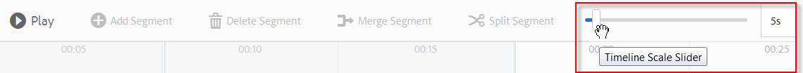
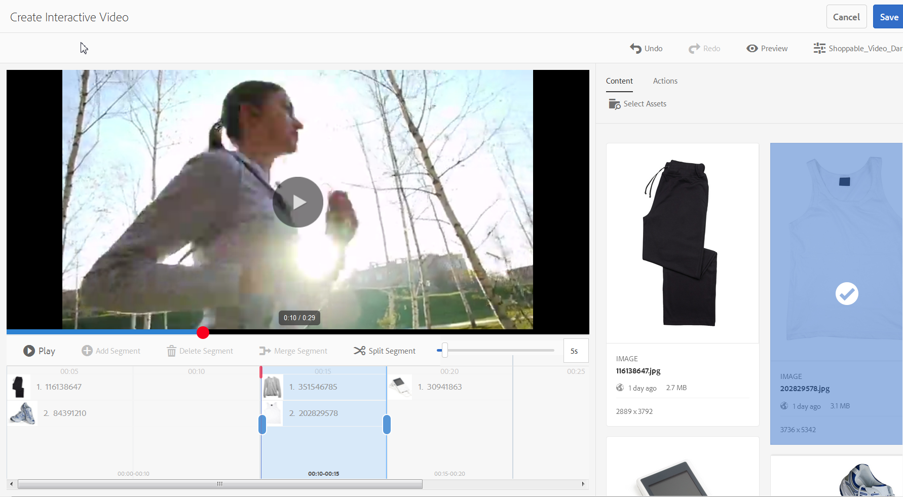

# Interaktiva videoklipp{#interactive-videos}


Du kan enkelt skapa interaktiva videor - även kallade videor som kan köpas - som genererar konverteringar direkt från videon. Kundens engagemang i videon äger rum i en panel bredvid videospelaren där relaterade tjänster, information eller produktminiatyrer rullas in i vyn baserat på vad som visas i videon. Kunderna kan trycka på miniatyrbilden och länkas direkt till tjänsten, lägga till artikeln i en kundvagn för direktköp eller länkas till en webbsida för mer information.

När videon är slut visas en visuell sammanfattning av alla erbjudanden för att skapa ett actionanrop. Kunderna har en annan möjlighet att trycka på det objekt de vill ha. Användbara och specifika upplevelser som dessa ökar kundernas engagemang och konverteringsgrad.

Se även [Interaktiva bilder](/help/assets/dynamic-media/interactive-images.md).

## Interaktiv video in action {#interactive-video-in-action}

Om du vill se en interaktiv, köpbar video klickar du på [Live Demos](https://landing.adobe.com/en/na/dynamic-media/ctir-2755/live-demos.html), rullar till rubriken **[!UICONTROL Shoppable Media]** på sidan och klickar sedan på videon för att påbörja uppspelningen.

* Under uppspelningen, när produkterna används i videon, visas den identiska produkten till höger som en miniatyrbild.

* Klicka på miniatyrbilden för att pausa videon och öppna snabbvyn för produkten. Du kan till exempel klicka på miniatyrbilden Kitchenaid i videon om du vill se en 360-graders snurvvy av blandaren, eller zooma in om du vill se blandningsinformationen.

Se även [Använda interaktiv video med dynamiska media](https://docs.adobe.com/content/help/en/experience-manager-learn/assets/dynamic-media/dynamic-media-interactive-video-feature-video-use.html)

<!-- 

There was a link here that showed the video frame of an interactive video and when the reader clicked the frame the video would play https://marketing.adobe.com/resources/help/en_US/dm/shoppable-video/AXIS/index.html. This now needs to call a new interactive video

-->

<!-- 

[A frame from an interactive, shoppable video](assets/chlimage_1-126.png) *A video frame capture from an interactive, shoppable video.*

-->

>[!NOTE]
>
>Om du skapar en interaktiv video som startar en webbsida när en användare klickar på en miniatyrbild kommer vissa enheter att blockera popup-webbsidan från att öppnas. I sådana fall måste du ändra inställningen för blockering av popup-fönster på enheten. På en Apple iPhone 6 trycker du på **[!UICONTROL Settings > Safari > Block Pop-ups]** och sedan drar du kontrollen till **[!UICONTROL Off]**. När du spelar upp en interaktiv video och klickar på en miniatyrbild blir du nu tillfrågad om du vill öppna popup-fönstret. Om du accepterar öppnas webbsidan.

### Se hur interaktiva videor skapas {#watch-how-interactive-videos-are-created}

Titta på en sju och en halv minuts genomgång om [hur interaktiva videofilmer skapas](https://s7d5.scene7.com/s7viewers/html5/VideoViewer.html?videoserverurl=https://s7d5.scene7.com/is/content/&amp;emailurl=https://s7d5.scene7.com/s7/emailFriend&amp;serverUrl=https://s7d5.scene7.com/is/image/&amp;config=Scene7SharedAssets/Universal_HTML5_Video_social&amp;contenturl=https://s7d5.scene7.com/skins/&amp;asset=S7tutorials/InteractiveVideo) [](https://outv.omniture.com?v=s4NHQ2dzqd7hIqWjeG2sIdyNWsTWyupA).
(Även om videogenomgången är märkt med Assets on Demand gäller fortfarande principerna och stegen för interaktiv video i AEM Assets.)

### Adobe Customer Success Webinar {#adobe-customer-success-webinar}

Delningen [Using Interactive Video, Link Sharing och YouTube i AEM Assets](https://adobecustomersuccess.adobeconnect.com/p1yxzdo4aec/) webbinarium visar hur du använder interaktiv video och andra funktioner för att knyta konverteringsdrivna händelser till ert videomarknadsföringsmaterial.

## Snabbstart: Interaktiva videoklipp {#quick-start-interactive-videos}

Följande steg-för-steg-beskrivning av arbetsflödet hjälper dig att komma igång snabbt med interaktiva videor i Dynamic Media.

Leta efter rubriken **Exempel** i några av snabbstartsåtgärderna. Den innehåller en kort självstudiekurs som baseras på den här [startsidan för en demo som *inte* har någon interaktivitet tillagd ännu](https://marketing.adobe.com/resources/help/en_US/dm/shoppable-video/john-lewis/landing-0.html).

**Exemplen** visar hur du integrerar interaktiva videofilmer på en webbplats.

När du är klar med självstudiekursen i det sista exempelavsnittet kommer [det att se ut som](https://marketing.adobe.com/resources/help/en_US/dm/shoppable-video/john-lewis/landing-3.html)din sista demowebbsida med den helintegrerade interaktiva videon.


Interaktiva videosteg:

1. **(Valfritt) Identifiera QuickView-variabler** - Börja med att identifiera dynamiska variabler som används i den befintliga QuickView-implementeringen. Du använder variablerna för att mappa produktminiatyrbilder till deras motsvarande produkt-snabbvyn när du skapar en interaktiv video. Se [(Valfritt) Identifiera QuickView-variabler](#optional-identifying-quickview-variables).
   **Det här steget är bara obligatoriskt om alla följande är uppfyllda**:
・ Du vill lägga till interaktivitet i videon genom att aktivera snabbvyer.
・ Er implementering av AEM använder *inte* ett ramverk för e-handelsintegrering för att hämta in produktdata AEM från någon e-handelslösning som IBM Websphere Commerce, Elastic Path, hybris eller Intershop.

1. **(Valfritt) Skapa en förinställning** för Interactive Video Viewer - Anpassa utseendet och beteendet för olika komponenter som utgör spelaren, t.ex. videobandspelaren och de interaktiva miniatyrbilderna.
Det är inte nödvändigt att skapa en egen förinställning för Interactive Video Viewer om du tänker använda förinställningarna för Interactive Video Viewer `Shoppable_Video_Light` eller `Shoppable_Video_Dark` istället.
Se [Skapa en ny visningsförinställning](/help/assets/dynamic-media/managing-viewer-presets.md#creating-a-new-viewer-preset) (valfritt) och [Specialöverväganden för att skapa en förinställning](/help/assets/dynamic-media/managing-viewer-presets.md#special-considerations-for-creating-an-interactive-viewer-preset)för interaktivt visningsprogram.

1. **Överföra en video och dess associerade bildresurser** - Överför en video och associerade bilder som du vill göra interaktiva.
Se [Överföra en video och dess tillhörande miniatyrbildsresurser](#uploading-a-video-and-its-associated-thumbnail-assets).

1. **Lägga till interaktivitet i videon** - Lägg till ett eller flera tidssegment i videon. Associera sedan bildminiatyrer inom dessa tidssegment. Tilldela varje miniatyrbild till en åtgärd som en hyperlänk, en snabbvy eller ett Experience Fragment.
(Observera att den URL-baserade länkningsmetoden inte är möjlig om ditt interaktiva innehåll har länkar till relativa URL-adresser, särskilt länkar till AEM Sites-sidor.)
Slutför genom att publicera det interaktiva videomaterialet. Publicering skapar den inbäddningskod eller URL som du så småningom kommer att kopiera och använda på webbplatsens landningssida.Se [Lägga till interaktivitet i videon](#adding-interactivity-to-your-video).
Se [Publicera resurser](/help/assets/dynamic-media/publishing-dynamicmedia-assets.md).

1. **Lägga till en interaktiv video på en webbplats eller på en webbplats i AEM** Om du använder AEM Sites eller AEM e-handel, eller båda, kan du lägga till den interaktiva videon direkt på en webbsida i AEM genom att dra komponenten Interactive Media till sidan. See [Adding Dynamic Media Assets to Pages.](/help/assets/dynamic-media/adding-dynamic-media-assets-to-pages.md)
Använd inbäddningskoden eller URL-adressen för att integrera interaktiv video med webbplatsupplevelserna. Se [Integrera en interaktiv video med din webbplats](#integrating-an-interactive-video-with-your-website).
Om du använder en WCM-fil (Web Content Manager) från tredje part måste du integrera den nya interaktiva videon med den befintliga QuickView-implementeringen som används på webbplatsen. Se [Integrera en interaktiv video med en befintlig snabbvy](#integrating-an-interactive-video-with-an-existing-quickview).
   [Lägga till dynamiska medieresurser på sidor](/help/assets/dynamic-media/adding-dynamic-media-assets-to-pages.md)

## (Valfritt) Identifiera Quickview-variabler {#optional-identifying-quickview-variables}

>[!NOTE]
Den här aktiviteten krävs bara om följande är sant:
* Du vill lägga till interaktivitet i videon genom att aktivera snabbvyer.
* Er implementering av AEM använder *inte* ett ramverk för e-handelsintegration för att hämta in produktdata till AEM från någon e-handelslösning som IBM Websphere Commerce, Elastic Path, hybris eller Intershop. <!-- See [eCommerce concepts in AEM Assets](/help/sites-administering/concepts.md).-->

Om din implementering av AEM använder e-handel kan du hoppa över den här uppgiften och fortsätta med nästa uppgift.

Börja med att identifiera dynamiska variabler som används i den befintliga QuickView-implementeringen, så att du kan mappa produktminiatyrbilder till deras motsvarande produkt i QuickView när du skapar interaktiva videofilmer.

När du lägger till tidssegment i en video tilldelar du en SKU och eventuella ytterligare variabler till varje miniatyrbild som du lägger till i ett segment. Sådana variabler används senare för att visa rätt Quickview-produkt.

Det är viktigt att kunna identifiera vilka variabler som krävs för att utlösa en produktsnabbvy på ett unikt sätt.

Ibland kan det räcka att rådfråga IT-specialister som är ansvariga för din befintliga QuickView-implementering. De känner troligen till den minimiuppsättning data som behövs för att identifiera Quickview i systemet. I de flesta fall går det dock även att bara analysera den befintliga beteendet för koden.

De flesta QuickView-implementeringar använder följande paradigm:

* Användaren aktiverar ett element i användargränssnittet på webbplatsen. Om du till exempel klickar på en snabbvyknapp.
* Webbplatsen skickar en Ajax-begäran till serverdelen för att läsa in QuickView-data eller -innehåll vid behov.
* Quickview-data översätts till innehållet som förberedelse för återgivning på webbsidan.
* Slutligen återges sådant innehåll på skärmen visuellt i koden.

Du bör därför besöka olika delar av webbplatsen där Quickview implementeras, aktivera snabbvyn och hämta den Ajax-URL som webbsidan skickar för att läsa in QuickView-data eller -innehåll.

Normalt behöver du inte använda några specialverktyg för felsökning. Moderna webbläsare har webbinspektörer som klarar ett bra jobb. Nedan följer några exempel på webbläsare som innehåller webbinspektörer:

* Om du vill visa alla utgående HTTP-begäranden i Google Chrome trycker du på **F12** (Windows) eller **Command+Options+I** (Mac) för att öppna panelen Utvecklarverktyg och klickar sedan på fliken **Nätverk** .

* In Firefox, you can either activate the Firebug plug-in by pressing **F12** (Windows) or **Command+Option+I** (Mac) and use its **[!UICONTROL Net]** tab, or you can use the built-in Inspector tool and its Network tab.

* Aktivera felsökningsverktyget i Internet Explorer genom att trycka på **F12**.

När nätverksövervakning är aktiverat i webbläsaren utlöser du snabbvyn på sidan.

Nu kan du hitta Quickview Ajax-URL:en i nätverksloggen och kopiera den inspelade URL:en för framtida analys. I de flesta fall när du utlöser snabbvyn skickas flera begäranden till servern. Vanligtvis är Quickview Ajax-URL en en av de första i listan. Den har antingen en komplex frågesträngsdel eller -sökväg och dess MIME-svarstyp är antingen `text/html`, `text/xml`eller `text/javascript`.

Under den här processen är det viktigt att du besöker olika delar av webbplatsen, med olika produktkategorier och typer. Anledningen är att URL:er för snabbvyn kan ha delar som är gemensamma för en viss webbplatskategori, men bara ändras om du besöker ett annat område på webbplatsen.

I det enklaste fallet är den enda variabeldelen i snabbvyns URL produktens SKU. I det här fallet är produktens SKU-värde den enda datadel som behövs för att lägga till miniatyrbilder i ett tidssegment i den interaktiva videon i AEM.

I komplexa fall har dock QuickView-URL:en olika element förutom produkt-SKU:n, som kategori-ID, färgkod osv. I sådana fall blir varje sådant element en separat variabel i miniatyrbildsdatadefinitionen i AEM.

Titta på följande exempel på QuickView-URL:er och deras resulterande miniatyrbildsvariabler:

<table>
  <tbody>
  <tr>
    <td><p>En SKU, hittades i frågesträngen.</p> </td>
    <td><p>De inspelade URL:erna för snabbvyn är bland annat följande:</p>
    <ul>
      <li><p><code>https://server/json?productId=866558&amp;source=100</code></p> </li>
      <li><p><code>https://server/json?productId=1196184&amp;source=100</code></p> </li>
      <li><p><code>https://server/json?productId=1081492&amp;source=100</code></p> </li>
      <li><p><code>https://server/json?productId=1898294&amp;source=100</code></p> </li>
    </ul> <p>Den enda variabeldelen i URL:en är värdet på <code>productId=</code> frågesträngsparametern, och det är helt klart ett SKU-värde. Därför behöver våra miniatyrbilder bara SKU-fält med värden som <strong><code>866558</code></strong>, <strong><code>1196184</code></strong>, <strong><code>1081492</code></strong>, <strong><code>1898294</code></strong>.</p> </td>
  </tr>
  <tr>
    <td><p>En SKU, finns i URL-sökvägen.</p> </td>
    <td><p>De inspelade URL:erna för snabbvyn är bland annat följande:</p>
    <ul>
      <li><p><code>https://server/product/6422350843</code></p> </li>
      <li><p><code>https://server/product/1607745002</code></p> </li>
      <li><p><code>https://server/product/0086724882</code></p> </li>
    </ul> <p>Variabeldelen finns i den sista delen av banan och blir SKU-värdet för AEM miniatyrbilder: <strong><code>6422350843</code></strong>, <strong><code>1607745002</code></strong>, <strong><code>0086724882</code></strong>.</p> </td>
  </tr>
  <tr>
    <td><p>SKU och kategori-ID i frågesträngen.</p> </td>
    <td><p>De inspelade URL:erna för snabbvyn är bland annat följande:</p>
    <ul>
      <li><p><code>https://server/quickView/product/?category=1100004&amp;prodId=305466</code></p> </li>
      <li><p><code>https://server/quickView/product/?category=1100004&amp;prodId=310181</code></p> </li>
      <li><p><code>https://server/quickView/product/?category=1740148&amp;prodId=308706</code></p> </li>
    </ul> <p>I det här fallet finns det två olika delar i URL:en. SKU:n lagras i <code>prodId</code> parametern och kategori-ID:t lagras i <code>category=</code> parametern.</p> <p>Miniatyrbildsdefinitionerna är par. Det vill säga ett SKU-värde och ytterligare en variabel som kallas <code>categoryId</code>. De resulterande paren är följande:</p>
    <ul>
      <li>SKU är <code>305466</code> och <code>categoryId</code> är <code>1100004</code></li>
      <li>SKU är <code>310181</code> och <code>categoryId</code> är <code>1100004</code></li>
      <li>SKU är <code>308706</code> och <code>categoryId</code> är <code>1740148</code></li>
    </ul> <p> </p> </td>
  </tr>
  </tbody>
</table>

**Exempel**

När ovanstående metod tillämpas på vår exempelwebbplats har vi en webbsida med ett antal produktminiatyrbilder, där var och en har knappen&quot;SE MER&quot;:

[https://marketing.adobe.com/resources/help/en_US/dm/shoppable-video/john-lewis/landing-0.html](https://marketing.adobe.com/resources/help/en_US/dm/shoppable-video/john-lewis/landing-0.html)

När du har aktiverat alla produktsnabbvyer som är tillgängliga på sidan får du följande lista över snabbvybegäranden som gjorts i serverdelen:

* datafeed/candles-233396346.json
* datafeed/candles-233978050.json
* datafeed/candles-234024346.json
* datafeed/candles-234024356.json
* datafeed/candles-234024359.json
* datafeed/cushions-233939848.json
* datafeed/cushions-234019477.json
* datafeed/cushions-234019483.json
* datafeed/furniture-231747479.json
* datafeed/furniture-232625621.json
* datafeed/furniture-232625626.json
* datafeed/furniture-233939810.json
* datafeed/furniture-233939825.json
* datafeed/furniture-233939828.json
* datafeed/furniture-233939853.json
* datafeed/furniture-233940334.json
* datafeed/glassware-000064007.json
* datafeed/glassware-230722193.json
* datafeed/glassware-233916550.json
* datafeed/glassware-233916597.json

Om du tittar på de här serversamtalen ser du att produktspecifik information bara finns i sökvägen för begäran. Du observerar också att frågesträngen inte används alls och att det finns två olika typer av datadelar:

* Den första typen är ljus, kuddar, möbler och glasvaror. Du kan kalla den här&quot;produktkategorin&quot;.
* Den andra typen är produktkod, till exempel 233916597. Du kan anta att det är&quot;produkt-SKU&quot;.

Med hjälp av den här informationen har hela snabbvyns URL följande mönster:

`/datafeed/$categoryId$-$SKU$.json`

Utifrån en sådan analys kan du dra slutsatsen att du kan använda följande två variabler för miniatyrbilderna: `categoryId` och `SKU`.

Du är nu redo att överföra en video och dess associerade miniatyrbildsresurser.

## (Valfritt) Skapa en förinställning för Interactive Video Viewer {#optional-creating-an-interactive-video-viewer-preset}

Du kan hoppa över den här uppgiften och fortsätta till nästa om du tänker använda någon av de förinställda typerna i det färdiga interaktiva visningsprogrammet `Shoppable_Video_dark` eller `Shoppable_Video_light`.

När du klickar på en miniatyrbild i redigeringsmiljön visas en förhandsvisning av dialogrutan Snabbvy.


Du kan också skapa en egen förinställning för Interactive Video Viewer. Du kan bland annat bestämma hur videospelaren, de interaktiva miniatyrbilderna och miniatyrbildsvyn som visas i slutet av videon ska se ut.

En förinställning för Interactive Video Viewer återger videon och alla tidslinjesegment som du har lagt till. En standardsnabbvy används också när du klickar på en miniatyrbild av en produkt i förhandsgranskningsläget, så att du kan testa dess interaktivitet före publicering.

När du har sparat visningsförinställningen ställs dess läge automatiskt in på **På ** på sidan Visningsförinställningar. Det här läget innebär att den är synlig i komponenten Dynamic Media och när du förhandsgranskar en video med den. Se också till att du publicerar den nya visningsförinställningen manuellt.

Se [Skapa en ny visningsförinställning](/help/assets/dynamic-media/managing-viewer-presets.md#creating-a-new-viewer-preset) för att skapa en egen förinställning för interaktivt visningsprogram för video.

## Överföra en video och dess tillhörande miniatyrbilder {#uploading-a-video-and-its-associated-thumbnail-assets}

Om du redan har överfört videoklipp och miniatyrbilder går du vidare till [Lägga till interaktivitet i videon](#adding-interactivity-to-your-video).

Om du har överfört fel videoklipp eller bilder, eller om du vill ta bort överförda videoklipp eller bilder som du inte längre behöver, se [Ta bort resurser](/help/assets/manage-digital-assets.md#delete-assets).

Så här överför du en video och dess associerade miniatyrbildsresurser:

1. Överför videon och tillhörande miniatyrbilder till den eller de mappar du vill använda.

   Se [Överföra resurser](/help/assets/manage-digital-assets.md).
Se [Överföra resurser med FTP-jobbplanering](/help/assets/manage-digital-assets.md).

   Nu kan du lägga till interaktivitet i videon.

## Lägga till interaktivitet i videon {#adding-interactivity-to-your-video}

Du lägger till tidslinjesegment i en video med den visuella redigeraren på sidan Skapa interaktiv video.

När du har lagt till tidslinjesegment lägger du till miniatyrbilder i varje segment. För varje miniatyrbild som du lägger till tillämpar du en åtgärd på den. Du kan t.ex. använda en snabbvy för miniatyrbilden eller tilldela en hyperlänk till den eller ett Experience Fragment.

Se [Upplevelsefragment](/help/sites-cloud/authoring/fundamentals/experience-fragments.md).

>[!NOTE]
Tänk på att verktygen för delning av sociala medier i interaktiv video inte stöds när du bäddar in visningsprogrammet i ett Experience Fragment. Du kan undvika detta genom att använda eller skapa visningsförinställningar som inte har verktyg för delning av sociala medier. Med sådana visningsförinställningar kan du bädda in dem i Experience Fragments.

>[!NOTE]
Den URL-baserade länkningsmetoden är inte möjlig om det interaktiva innehållet har länkar till relativa URL-adresser, särskilt länkar till AEM Sites-sidor.

Alternativen Ångra och Gör om, nära det övre högra hörnet på sidan, stöds under den aktuella skaps-/redigeringssessionen.

När du har sparat den interaktiva videon öppnas videon direkt i förhandsvisningen. Därifrån kan du välja en förinställning för Interactive Video Viewer och spela upp videon för att se hur den kommer att se ut för kunderna.

Så här lägger du till interaktivitet i videon:

1. I resursvyn navigerar du till videon som du överförde och vill göra interaktiv.
1. Gör något av följande:

   * Hover on the image, then tap **[!UICONTROL Select]** (checkmark icon). Tryck på i verktygsfältet **[!UICONTROL Edit]**.

   * Håll pekaren över bilden och tryck sedan på **[!UICONTROL More actions]** (ikonen med tre punkter) **[!UICONTROL > Edit]**.

   * Tryck på bilden för att öppna den på sidan Detaljvy. Tryck på i verktygsfältet **[!UICONTROL Edit]**.

1. Gör något av följande på sidan Skapa interaktiv video:

   * Tryck på **[!UICONTROL Play]** knappen för att börja spela upp videon. När en viss produkt, tjänst eller detalj som du vill markera visas trycker du **[!UICONTROL Add Segment]** på verktygsfältet. Upprepa tills du har nått slutet av videon.

      För varje tidssegment som du lägger till kan du tilldela en eller flera miniatyrbilder till det och sedan länka dessa miniatyrbilder till Quickview-produktsidor som kunderna kan köpa eller till webbsidor för mer information.

   * Tryck på **[!UICONTROL Play]** knappen för att börja spela upp videon. När en viss produkt, tjänst eller detalj som du vill markera visas trycker du **[!UICONTROL Pause]**. Tryck på **[!UICONTROL Add Segment]**.

      Fortsätt spela upp och pausa videon vid punkter längs tidslinjen där du vill lägga till ett segment tills du når slutet av videon.

1. (Valfritt) Dra fältet på **[!UICONTROL Timeline Scale Slider]** åt vänster om du vill zooma in och till höger om du vill zooma ut. På så sätt kan du styra hur mycket detaljer du ser i de segment som du har lagt till.

   

   Beroende på videons längd är standardvärdet för Segmentvaraktighet följande värden:

   <table>
      <tbody>
        <tr>
        <td><strong>Om videolängden är ...</strong></td>
        <td><strong>Inställningen för segmentvaraktighet är som standard..</strong></td>
        </tr>
        <tr>
        <td>3 minuter eller mer</td>
        <td>60 sekunder</td>
        </tr>
        <tr>
        <td>2-3 minuter</td>
        <td>30 sekunder</td>
        </tr>
        <tr>
        <td>1-2 minuter</td>
        <td>20 sekunder<br /> </td>
        </tr>
        <tr>
        <td>30-60 sekunder</td>
        <td>10 sekunder</td>
        </tr>
        <tr>
        <td>30 sekunder eller mindre</td>
        <td>5 sekunder</td>
        </tr>
      </tbody>
    </table>

   Videons tidslinje använder så mycket skärmutrymme som det som finns tillgängligt för den. När du ändrar storlek på webbläsaren behåller segmenten som du har lagt till sin korrekta bredd.

   Följande tre skärmbilder använder samma video. Observera att bredden på varje segment ändras beroende på inställningen för tidslinjens skala.

   

   Skärmbild A

   Skärmbild A ovan visar standardvyn för en 29-sekunders produktvideo. Tidslinjens skala är inställd på 5 sekunder som standard.

   

   Skärmbild B

   I skärmbild B ovan har reglaget för tidslinjeskala dragits från standardvärdet 5 sekunder till 3 sekunder. Observera att tidstämplarna för den enskilda tidslinjens skala nu är inställda med 3 sekunders intervall.

   

   Skärmbild C

   I skärmbild C ovan flyttades inställningen för tidslinjeskala till 8 sekunder. Lägg märke till hur segmenten som innehåller produktminiatyrer har krympt. Det är praktiskt att zooma ut på det här sättet om du har en lång video och vill kunna se en översikt över fler segment som normalt passar in på sidbredden.

1. (Valfritt) Gör något av följande:

   * Justera ett segments starttid och sluttid.

      Markera ett segment och dra sedan den inledande eller avslutande blå ovalen för att justera start- respektive sluttiden. Den videobildruta som visas flyttas till lämplig tid i videon, baserat på dina justeringar. Tidslinjesegmentets rörelse begränsas baserat på intilliggande segment i tidslinjen. Den minsta tillåtna segmenttiden är en sekund.

      Använd följande kortkommandon för att snabbt kontrollera och finjustera videosegmenten:

      * Tryck på den blå inledande ovalen för att söka efter videon direkt till början av det segmentet.
      * Tryck på den efterföljande blå ovalen för att söka efter videon direkt till slutet av det segmentet.
      * Tryck på hela segmentet för att återställa videouppspelningen till början av segmentet

   

   Flytta slutet av ett tidslinjesegment

   * Ta bort ett segment

      Markera det sista segmentet på tidslinjen och tryck sedan på **[!UICONTROL Delete Segment]** i verktygsfältet. Om två eller flera segment är markerade är funktionen Ta bort segment inaktiverad.

      Du kan bara ta bort det sista segmentet. Om du till exempel vill ta bort alla segment på tidslinjen måste du alltid markera det sista segmentet och sedan trycka **[!UICONTROL Delete Segment]**.


1. Markera ett tidssegment som du vill associera en eller flera miniatyrbilder till.
1. Tryck på **[!UICONTROL Content]** fliken till höger om videon.
1. Tryck på **[!UICONTROL Select Assets]** och bläddra sedan bland alla bildresurser som du vill använda med videon på fliken Innehåll. De markerade resurserna läggs till på panelen Resursväljare på fliken Innehåll.

1. Gör något av följande i resursväljaren under fliken Innehåll:

   <table>
      <tbody>
        <tr>
        <td>Associera en miniatyrbild med det markerade tidslinjesegmentet</td>
        <td><p>Tryck på bilden på resurssväljarpanelen till höger.</p> <p>Du kan lägga till så många miniatyrbilder du vill i ett tidslinjesegment. För varje bild som du väljer visas en bock över bilden i resursväljaren.</p> </td>
        </tr>
        <tr>
        <td>Ta bort en miniatyrbild från det markerade tidslinjesegmentet</td>
        <td><p>Gör något av följande:</p>
          <ul>
          <li>Avmarkera en bild genom att trycka på den på panelen Resursväljaren med en bockmarkering. Bildresursen tas bort från tidslinjesegmentet.<br /> </li>
          <li>Tryck på en bild i det markerade tidslinjesegmentet och tryck sedan på <strong>Ta bort produkt</strong>i verktygsfältet.</li>
          </ul> </td>
        </tr>
      </tbody>
    </table>

   

   Om du trycker på en bild på resurssväljarpanelen läggs den till i det valda tidslinjesegmentet.

1. Markera en miniatyrbild i ett av tidslinjesegmenten och tryck sedan på **[!UICONTROL Actions]** fliken.
1. Gör något av följande:
   <table> 
    <tbody> 
      <tr> 
      <td>Associera den markerade miniatyrbilden med en snabbvy</td> 
      <td><p>Tryck på <strong>Snabbvy</strong>under Åtgärdstyp.</p> <p>Om du är kund inom AEM Sites och e-handel:</p> 
       <ul> 
       <li>Observera att textfältet SKU-värde är förifyllt med den valda produktens SKU (Stock Keeping Unit), som är en unik identifierare för varje separat produkt eller tjänst som du erbjuder. Detta fylls i automatiskt när bilden associeras med en produkt i AEM Commerce.</li> 
       <li>Om den i förväg ifyllda SKU:n är felaktig trycker eller klickar du på produktväljarens ikon (förstoringsglas) för att öppna sidan Välj produkt. Tryck eller klicka på den produkt du vill använda och tryck sedan på bockmarkeringen i det övre högra hörnet av sidan för att gå tillbaka till Interactive Video Editor.</li> 
       </ul> <p> Om du <em>inte</em> är AEM Sites- eller e-handelskund</p> 
       <ul> 
       <li>Se <a href="/help/assets/dynamic-media/carousel-banners.md#identifying-hotspot-and-image-map-variables">Identifiera hotspot-variabler</a>. Du måste definiera dessa variabler. </li> 
       <li>Som standard använder det här SKU-fältet bildresursens filnamn utan tillägget. Om du använder en standardnamnkonvention för dina filer som baseras på SKU, behöver du vanligtvis inte göra några ytterligare redigeringar. </li> 
       <li>I annat fall redigerar du standardvärdet och anger rätt SKU-värde. I textfältet SKU-värde skriver du produktens SKU (Stock Keeping Unit), som är en unik identifierare för varje separat produkt eller tjänst som du erbjuder. Det angivna SKU-värdet fyller automatiskt i variabeldelen av QuickView-mallen så att systemet vet att den avbrutna bilden associeras med en viss SKU:s snabbvy.</li> 
       </ul> <p>(Valfritt) Om det finns andra variabler i snabbvyn som du behöver för att kunna identifiera en produkt ytterligare trycker du på <strong>Lägg till allmän variabel</strong>. Ange ytterligare en variabel i textfältet. Till exempel <code>category=Womens</code> är en tillagd variabel.</p> <p> </p> </td> 
      </tr> 
      <tr> 
      <td>Associera den markerade miniatyrbilden med en hyperlänk</td> 
      <td><p>Tryck på <strong>Hyperlänk</strong>under Åtgärdstyp och gör sedan något av följande:</p> 
       <ul> 
       <li>Om du är AEM Sites-kund går du till en webbsida genom att trycka på ikonen Platsväljare (mapp). Observera att den URL-baserade länkningsmetoden inte är möjlig om det interaktiva innehållet har länkar till relativa URL-adresser, särskilt länkar till AEM Sites-sidor.</li> 
       <li>Om du är en fristående kund av Dynamic Media anger du den fullständiga URL-sökvägen till en länkad webbsida i textfältet HREF.</li> 
       </ul> <p>Var noga med att ange om länken ska öppnas på en ny flik i webbläsaren eller på den aktuella fliken.</p> </td> 
      </tr> 
      <tr> 
      <td>Associera den markerade miniatyrbilden med ett Experience Fragment</td> 
      <td><p>Under Åtgärdstyp trycker du på <strong>Experience Fragment</strong>och gör sedan följande:<p> 
       <ul> 
       <li>Om du är AEM Sites-kund trycker eller klickar du på ikonen Sök (förstoringsglas) för att öppna sidan Experience Fragment. Tryck eller klicka på det Experience Fragment som du vill använda och tryck sedan på <strong>Select (Välj) </strong>i det övre högra hörnet av sidan för att gå tillbaka till åtgärdspanelen på föregående sida.<br /> Se <a href="/help/sites-cloud/authoring/fundamentals/experience-fragments.md">Upplevelsefragment</a>.</li> 
      </ul> 
       <ul> 
       <li>Ange bredd och höjd för Experience Fragment så som det kommer att visas på videon.</li>
       </ul><strong>Obs</strong>: Tänk på att verktygen för delning av sociala medier i interaktiv video inte stöds när du bäddar in visningsprogrammet i ett Experience Fragment. Du kan undvika detta genom att använda eller skapa visningsförinställningar som inte har verktyg för delning av sociala medier. Med sådana visningsförinställningar kan du bädda in dem i Experience Fragments.</p></tr>&lt; 
      <tr> 
      <td>Redigera en åtgärd som redan har tilldelats en miniatyrbild</td> 
      <td>Tryck på en miniatyrbild med en kedjelänk till höger om textetiketten i ett tidslinjesegment. Länken kedja anger att en åtgärd har tilldelats den. Tryck på fliken <strong>Åtgärder</strong> för att göra ändringarna.</td> 
      </tr> 
      <tr> 
      <td>Ändra textetiketten för en miniatyrbild</td> 
      <td><p>Som standard använder textetiketten miniatyrbildens <code>Title</code> metadatafält. Om det inte <code>Title</code> finns någon används miniatyrbildens filnamn i stället, men utan filnamnstillägget.</p> <p>Om du vill ändra textetiketten för en miniatyrbild anger du önskad text under <strong>fliken </strong>Åtgärder, direkt under bildresursen som visas. Se bilden nedan.</p> <p>Observera att den nya textetiketten endast används av själva videospelaren och av miniatyrtexten som visas i tidslinjesegmentet. Etikettändringen påverkar inte miniatyrbildens metadatafält Titel eller dess filnamn.</p> </td> 
      </tr> 
      <tr> 
      <td>Så här återställer du en ändring som du har gjort</td> 
      <td>I det övre högra hörnet av sidan trycker du på <strong>Ångra</strong> eller <strong>Gör om</strong>.</td> 
      </tr> 
    </tbody> 
   </table>

   

   En ny textetikett läggs till i miniatyrbilden.

1. Gör något av följande:

   * Upprepa steg 6-11 om du vill lägga till fler miniatyrbilder i tidslinjesegment i videon.
   * Fortsätt till det valfria steget 13.

1. (Valfritt) Gör något av följande:

   * **[!UICONTROL Merge Segment]** - Du kan kombinera två intilliggande segment (med eller utan produktminiatyrer tilldelade till dem) till ett segment.

      Tryck på två eller flera intilliggande segment på tidslinjen som du vill sammanfoga till ett. Observera att det inte finns några blåa ovala draghandtag för de två markerade segmenten i bilden nedan.

      Tap **[!UICONTROL Merge Segment]** on the toolbar.
   

   Sammanfoga två valda segment på fem sekunder till ett segment på tio sekunder.

   * **[!UICONTROL Split Segment]** - Du kan dela upp ett enskilt segment i två segment med samma tidsindelning. Om det redan finns produktminiatyrer för segmentet kombineras miniatyrbilderna till det vänstra segmentet.

      På tidslinjen trycker du på ett segment som du vill dela i halva och sedan på **[!UICONTROL Split Segment]** verktygsfältet.

      Om du markerar två eller flera segment inaktiveras **[!UICONTROL Split Segment]** funktionen.
   

   Dela upp ett markerat segment på tio sekunder i två segment på fem sekunder vardera.

1. I närheten av det övre högra hörnet på **[!UICONTROL Create Interactive Video]** sidan visas namnet på den visningsförinställning som för tillfället används med videon. Tryck på namnet för att välja en annan visningsförinställning.

   Med `Shoppable_Video_light` visningsförinställningen kan du till exempel spela upp videon med ett vitt visningsområde intill videon. Visningsområdet är där de klickbara miniatyrbilderna visas under uppspelningen. Med `Shoppable_Video_dark` visningsförinställningen kan du spela upp videon med ett svart visningsområde intill videon.

   Om du har skapat en egen förinställning för Interactive Video Viewer visas den också i listan med förinställningar som du kan välja mellan.

   När du är klar trycker du **[!UICONTROL Save]**.

   >[!NOTE]
   När du sparar den interaktiva videon sparas en associerad `.vtt`-fil automatiskt med den. `.vtt`-filen sparas i den `_VTT`-mapp som finns i roten för **[!UICONTROL Assets]**. Filen och mappen är nödvändiga för att den interaktiva videon ska kunna spelas upp korrekt på webbplatsen. Därför ska du inte flytta, redigera eller ta bort mappen `_VTT` eller dess innehåll.

1. Publicera den interaktiva videon. Publicering skapar den inbäddningskod eller URL som du så småningom kommer att kopiera och klistra in på webbplatsupplevelserna.

   Om du har lagt till interaktivitet med snabbvyer ska du bara använda inbäddningskoden; om du har lagt till interaktivitet med hyperlänkade webbsidor kan du även använda den publicerade URL:en. Observera dock att den URL-baserade länkningsmetoden inte är möjlig om ditt interaktiva innehåll har länkar till relativa URL-adresser, särskilt länkar till AEM Sites-sidor.

   Se [Publicera resurser](publishing-dynamicmedia-assets.md).

   >[!NOTE]
   Om du vill publicera en videoklipp som kan köpas med snabbvyer måste du även publicera videons relaterade bildresurser separat från din e-handelsplats.

   När du har lagt till tidslinjesegment och publicerat den interaktiva videon kan du lägga till den på din befintliga startsida för webbplatsen. Se [Integrera en interaktiv video med din webbplats.](#integrating-an-interactive-video-with-your-website)

## Publicera interaktivt videomaterial {#publishing-interactive-video-assets}

Mer information om hur du publicerar interaktiva videoresurser finns i [Publicera resurser](/help/assets/dynamic-media/publishing-dynamicmedia-assets.md) .

## Integrera en interaktiv video med webbplatsen {#integrating-an-interactive-video-with-your-website}

När du har överfört en video, lagt till tidslinjesegment i den och publicerat den interaktiva videon är du nu redo att lägga till den på din befintliga webbplats.

Om du är kund hos AEM Sites kan du lägga till den interaktiva videon genom att dra Interactive Media-komponenten till din sida. See [Adding Dynamic Media Assets to Pages.](/help/assets/dynamic-media/adding-dynamic-media-assets-to-pages.md)

Om du är en fristående AEM Assets-kund kan du lägga till den interaktiva videon manuellt på din webbplats enligt beskrivningen i det här avsnittet.

1. Kopiera den publicerade interaktiva videons inbäddningskod eller URL.
See [Embedding the Video or Image Viewer on a Web Page](/help/assets/dynamic-media/embed-code.md).
Om du har lagt till interaktivitet med snabbvyer ska du bara använda inbäddningskoden; om du har lagt till interaktivitet med hyperlänkade webbsidor kan du även använda den publicerade URL:en. Observera dock att den URL-baserade länkningsmetoden inte är möjlig om ditt interaktiva innehåll har länkar till relativa URL-adresser, särskilt länkar till AEM Sites-sidor.

1. Identifiera var den statiska videon finns i målets webbsideskod.
1. Ta bort den statiska videon och ersätt koden med den inbäddade koden eller URL-adressen som du kopierade från AEM Assets, som den är.
Den kopierade inbäddningskoden ställs in för en responsiv miljö så att den automatiskt ska passa in på det område som den statiska videon tidigare tog upp.

>[!NOTE]
Nu är du klar om du har lagt till interaktivitet med endast hyperlänkade webbsidor.
Om du har lagt till någon interaktivitet för att aktivera en snabbvy är miniatyrbilderna som ligger intill den interaktiva videon endast avsedda för visning. de är ännu inte integrerade med dina befintliga snabbvyer. I så fall måste du nu integrera den interaktiva videon med befintliga snabbvyer på webbplatsen.

**Exempel**

Använda demowebbplatsen som exempel:

[https://marketing.adobe.com/resources/help/en_US/dm/shoppable-video/john-lewis/landing-0.html](https://marketing.adobe.com/resources/help/en_US/dm/shoppable-video/john-lewis/landing-0.html)

Observera att det är standardkod för videoinbäddning:

```xml
<style type="text/css">
 #s7video_div.s7videoviewer{
   width:100%;
   height:auto;
 }
</style>

<script type="text/javascript" src="https://demos-pub.assetsadobe.com/etc/dam/viewers/s7viewers/html5/js/VideoViewer.js"></script>
<div id="s7video_div"></div>
<script type="text/javascript">
 var s7videoviewer = new s7viewers.VideoViewer({
  "containerId" : "s7video_div",
  "params" : {
   "serverurl" : "https://adobedemo62-h.assetsadobe.com/is/image",
   "contenturl" : "https://demos-pub.assetsadobe.com/",
   "config" : "/etc/dam/presets/viewer/Video",
   "config2": "/etc/dam/presets/analytics",
   "videoserverurl": "https://gateway-na.assetsadobe.com/DMGateway/public/demoCo",
   "posterimage": "/content/dam/marketing/shoppable-video/john-lewis/shoppable-video-john-lewis-2014.mp4",
   "asset" : "/content/dam/marketing/shoppable-video/john-lewis/shoppable-video-john-lewis-2014.mp4" }
 }).init();
</script>
```

Integrationen är lika enkel som att ta bort inbäddningskoden för video och ersätta den med den interaktiva inbäddningskoden för video från AEM. Resultatet visas på följande URL. Även om det visar en interaktiv video på sidan är den ännu inte integrerad med de befintliga snabbvyerna:

[https://marketing.adobe.com/resources/help/en_US/dm/shoppable-video/john-lewis/landing-1.html](https://marketing.adobe.com/resources/help/en_US/dm/shoppable-video/john-lewis/landing-1.html)

## Integrera en interaktiv video med en befintlig snabbvy {#integrating-an-interactive-video-with-an-existing-quickview}

>[!NOTE]
Detta gäller endast om du är en fristående AEM Assets-kund.

Det sista steget i den här processen är att integrera din interaktiva video med en befintlig QuickView-implementering som används på din webbplats. Det finns ingen lösning på integreringen som fungerar i alla fall. Alla QuickView-implementeringar är unika. Därför behövs ett specifikt tillvägagångssätt som sannolikt inbegriper hjälp av en IT-handläggare på frontend.

Den befintliga Quickview-implementeringen representerar normalt en kedja av interrelaterade åtgärder som inträffar på webbsidan i följande ordning:

1. En användare utlöser ett element i användargränssnittet för webbplatsen.
1. FrontEnd-koden hämtar en QuickView-URL som baseras på användargränssnittselementet som utlöstes i steg 1.
1. Slutkoden skickar en AJAX med den URL som du får i steg 2.
1. Bakåtlogiken returnerar motsvarande QuickView-data eller -innehåll tillbaka till slutkoden.
1. Slutkoden läser in QuickView-data eller -innehåll.
1. Om du vill kan du konvertera den inlästa QuickView-informationen till en HTML-representation med hjälp av koden längst fram.
1. I koden visas en modal dialogruta eller panel och HTML-innehållet återges på skärmen för slutanvändaren.

Dessa anrop kanske inte representerar oberoende offentliga API-anrop som kan anropas av webbsidans logik från ett godtyckligt steg. I stället är det ett kedjat anrop där varje steg döljs i den sista fasen (återanrop) av föregående steg.

Samtidigt som den interaktiva videon ersätter steg 1, och delvis steg 2, när en användare klickar på en miniatyrbild i den interaktiva videon, hanteras denna användarinteraktion av användaren av användaren. Visningsprogrammet returnerar en händelse till webbsidan som innehåller alla miniatyrbildsdata som tidigare lagts till i AEM.

I en sådan händelsehanterare gör koden för den främre änden följande:

* Lyssnar på en händelse som skickas av den interaktiva videon.
* Skapar en QuickView-URL som baseras på miniatyrbildsdata.
* Startar processen att läsa in snabbvyn från serverdelen och återge den på skärmen för visning.

Dessutom har Interactive Video Viewer stöd för helskärmsläge. Slutanvändaren aktiverar snabbvyer genom att klicka på en miniatyrbild utan att lämna helskärmsläget. För att uppnå den här funktionen ändrar du frontdelskoden så att den modala dialogrutan för snabbvyn bifogas till visningsprogrammets behållare. Lägg inte till dokument-BODY eller något annat webbsideselement som inte är tillgängligt när visningsprogrammet är i helskärmsläge. Koden som utför det här jobbet måste lyssnas på ett till återanrop till visningsprogrammet som skickas när visningsprogrammet har lästs in på sidan.

Den inbäddningskod som returneras av AEM har redan en färdig händelsehanterare på plats. Den kommenteras ut enligt följande markerade kodfragment:

```xml
<style type="text/css">
 #s7interactivevideo_div.s7interactivevideoviewer{
   width:100%;
   height:auto;
 }
</style>
<script type="text/javascript" src="https://demos-pub.assetsadobe.com/etc/dam/viewers/s7viewers/html5/js/InteractiveVideoViewer.js"></script>

<div id="s7interactivevideo_div"></div>
<script type="text/javascript">
 var s7interactivevideoviewer = new s7viewers.InteractiveVideoViewer({
  "containerId" : "s7interactivevideo_div",
  "params" : {
   "serverurl" : "https://adobedemo62-h.assetsadobe.com/is/image",
   "contenturl" : "https://demos-pub.assetsadobe.com/",
   "config" : "/etc/dam/presets/viewer/Shoppable_Video_light",
   "config2": "/etc/dam/presets/analytics",
   "videoserverurl": "https://gateway-na.assetsadobe.com/DMGateway/public/demoCo",
   "interactivedata": "content/dam/_VTT/marketing/shoppable-video/john-lewis/shoppable-video-john-lewis-2014.mp4.svideo.vtt",
   "VideoPlayer.contenturl": "https://adobedemo62-h.assetsadobe.com/is/content",
   "asset" : "/content/dam/marketing/shoppable-video/john-lewis/shoppable-video-john-lewis-2014.mp4" }
 })
 /* // Example of interactive video event for quickview.
   s7interactivevideoviewer.setHandlers({
   "quickViewActivate": function(inData) {
     var sku=inData.sku; //SKU for product ID
    //To pass other parameter from the hotspot, you need to add custom parameter during the hotspot setup as parameterName=value
    loadQuickView(sku); //Replace this call with your quickview plugin
    //Please refer to your quickviewer plugin for the quickview call
    },
"initComplete":function() {
    //--- Attach quickview popup to viewer container so popup will work in fullscreen mode ---
    var popup = document.getElementById('quickview_div'); // get custom quickview container
    popup.parentNode.removeChild(popup); // remove it from current DOM
    var sdkContainerId = s7interactivevideoviewer.getComponent("container").getInnerContainerId(); // get viewer container component
    var inner_container = document.getElementById(sdkContainerId);
    inner_container.appendChild(popup); //Attach custom quickview container to viewer
    }
   });
 */
 s7interactivevideoviewer.init();
</script>
```

Därför är det bara nödvändigt att avkommentera det markerade kodfragmentet ovan och ersätta dummy-hanterarbrödtexten med kod som är specifik för den aktuella webbsidan.

Det finns två standardhanterare för återanrop i standardkoden för inbäddning: `quickViewActivate` och `initComplete`. Hanteraren aktiveras när användaren klickar på en miniatyrbild i visningsprogrammet. `quickViewActivate` Integrera visningsprogrammet med QuickView-aktiveringslogiken. Hanteraren `initComplete` aktiveras endast en gång när visningsprogrammet läses in på sidan. Den här hanteraren används för att justera platsen för dialogrutan Snabbvy i webbsidans DOM.

Processen med att skapa en URL för snabbvyn är motsatt till processen att identifiera miniatyrbildsvariabler som beskrivs tidigare i det här avsnittet. Med hjälp av våra tidigare identifierade QuickView URL-exempel kan du se hur QuickView-webbadressen är konstruerad i varje fall:

<table>
  <tbody>
  <tr>
    <td><p>En SKU, som finns i frågesträngen</p> </td>
    <td><code class="code">s7interactivevideoviewer.setHandlers({
      "quickViewActivate": function(inData) {
      var quickViewUrl = "https://server/json?productId=" + inData.sku + "&amp;source=100";
      },
      });</code></td>
  </tr>
  <tr>
    <td>En SKU, finns i URL-sökvägen</td>
    <td><code class="code">s7interactivevideoviewer.setHandlers({
      "quickViewActivate": function(inData) {
      var quickViewUrl = "https://server/product/" + inData.sku;
      },
      });</code></td>
  </tr>
  <tr>
    <td><p>SKU och kategori-ID i frågesträngen</p> </td>
    <td><code class="code">s7interactivevideoviewer.setHandlers({
      "quickViewActivate": function(inData) {
      var quickViewUrl = "https://server/quickView/product/?category=" + inData.categoryId + "&amp;prodId=" + inData.sku;
      },
      });</code></td>
  </tr>
  </tbody>
</table>

Det sista steget för att utlösa snabbgransknings-URL:en och aktivera snabbvypanelen kräver troligen hjälp av en IT-handläggare på IT-avdelningen. De har kunskap om hur de bäst kan utlösa QuickView-implementeringen från rätt steg med en färdig QuickView-URL.

Du kan se hur dessa steg tillämpas på demowebbplatsen för att helt integrera en interaktiv video med QuickView-koden. Tidigare i det här avsnittet identifierades strukturen för snabbvyns URL som följande:

```xml
/datafeed/$CategoryId$-$SKU$.json
```

Det är enkelt att rekonstruera den här URL:en inuti `quickViewActivate` hanteraren med hjälp av `categoryId` - och `sku` -fält som är tillgängliga i det `inData` objekt som skickas till hanteraren via visningsprogrammets kod enligt följande:

```xml
var sku=inData.sku;
var categoryId=inData.categoryId;
var quickViewUrl = "datafeed/" + categoryId + "-" + sku + ".json";
```

Demonstrationswebbplatsen utlöser dialogrutan Snabbvisning med ett enkelt `loadQuickView()` funktionsanrop. Den här funktionen har bara ett argument, vilket är snabbvydata-URL:en. Så det sista steget som krävs för att integrera den interaktiva videon är att lägga till följande kodrad i `quickViewActivate` hanteraren:

```xml
loadQuickView(quickViewUrl);
```

Kontrollera slutligen att dialogrutan Snabbvy är kopplad till visningsprogrammets behållarelement. Standardkoden för inbäddning innehåller exempelsteg för att uppnå den här funktionen. Om du vill få en referens till visningsprogrammets behållarelement kan du använda följande kodrader:

```xml
var sdkContainerId = s7interactivevideoviewer.getComponent("container").getInnerContainerId(); // get viewer container component
var inner_container = document.getElementById(sdkContainerId);
```

Var `inner_container` är en referens till ett `DIV` element som hanteras av visningsprogrammet. Du vill att dialogrutan ska vara underordnad den `DIV`.

Stegen för att hitta det modala dialogruteelementet och bifoga det till behållaren ovan är skiftlägeskänsliga. Återigen kan du få hjälp av den som är bekant med den QuickView-implementering som behövs.

När det gäller exempelwebbplatsen implementeras den modala dialogrutan för snabbvyn som en `DIV` med det spärra/modala ID som bifogas direkt till dokumentet `BODY`. Koden som flyttar dialogrutan till visningsprogrammets behållare är därför så enkel som följande:

```xml
var sdkContainerId = s7interactivevideoviewer.getComponent("container").getInnerContainerId(); // get viewer container component
var inner_container = document.getElementById(sdkContainerId);
inner_container.appendChild(document.getElementById("quickview-modal"));
```

Den fullständiga källkoden är följande:

```xml
<style type="text/css">
 #s7interactivevideo_div.s7interactivevideoviewer{
   width:100%;
   height:auto;
 }
</style>
<script type="text/javascript" src="https://demos-pub.assetsadobe.com/etc/dam/viewers/s7viewers/html5/js/InteractiveVideoViewer.js"></script>

<div id="s7interactivevideo_div"></div>
<script type="text/javascript">
 var s7interactivevideoviewer = new s7viewers.InteractiveVideoViewer({
  "containerId" : "s7interactivevideo_div",
  "params" : {
   "serverurl" : "https://adobedemo62-h.assetsadobe.com/is/image",
   "contenturl" : "https://demos-pub.assetsadobe.com/",
   "config" : "/etc/dam/presets/viewer/Shoppable_Video_light",
   "videoserverurl": "https://gateway-na.assetsadobe.com/DMGateway/public/demoCo",
   "interactivedata": "content/dam/_VTT/marketing/shoppable-video/john-lewis/shoppable-video-john-lewis-2014.mp4.svideo.vtt",
   "VideoPlayer.contenturl": "https://adobedemo62-h.assetsadobe.com/is/content",
   "asset" : "/content/dam/marketing/shoppable-video/john-lewis/shoppable-video-john-lewis-2014.mp4" }
 })
 // Example of interactive video event for quickview.
   s7interactivevideoviewer.setHandlers({
   "quickViewActivate": function(inData) {
     var sku=inData.sku; //SKU for product ID
     var categoryId=inData.categoryId; //categoryId
    var quickViewUrl = "datafeed/" + categoryId + "-" + sku + ".json";
    loadQuickView(quickViewUrl);
    },
   "initComplete":function() {
    //--- Attach quickview popup to viewer container so popup will work in fullscreen mode ---
    var sdkContainerId = s7interactivevideoviewer.getComponent("container").getInnerContainerId(); // get viewer container component
    var inner_container = document.getElementById(sdkContainerId);
    inner_container.appendChild(document.getElementById("quickview-modal"));
    }
   });
 s7interactivevideoviewer.init();
</script>
```

Den färdiga demowebbplatsen med den helt integrerade interaktiva videon ser ut så här:

[https://marketing.adobe.com/resources/help/en_US/dm/shoppable-video/john-lewis/landing-3.html](https://marketing.adobe.com/resources/help/en_US/dm/shoppable-video/john-lewis/landing-3.html)

## Använda snabbvyer för att skapa anpassade popup-fönster {#using-quickviews-to-create-custom-pop-ups}

See [Using Quickviews to create custom pop-ups](/help/assets/dynamic-media/custom-pop-ups.md).
-->