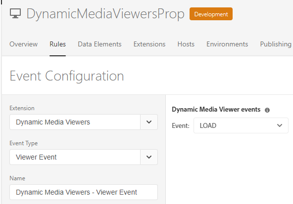
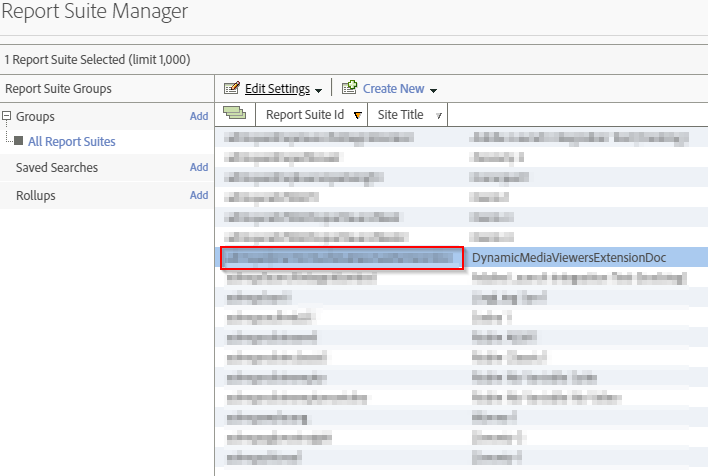
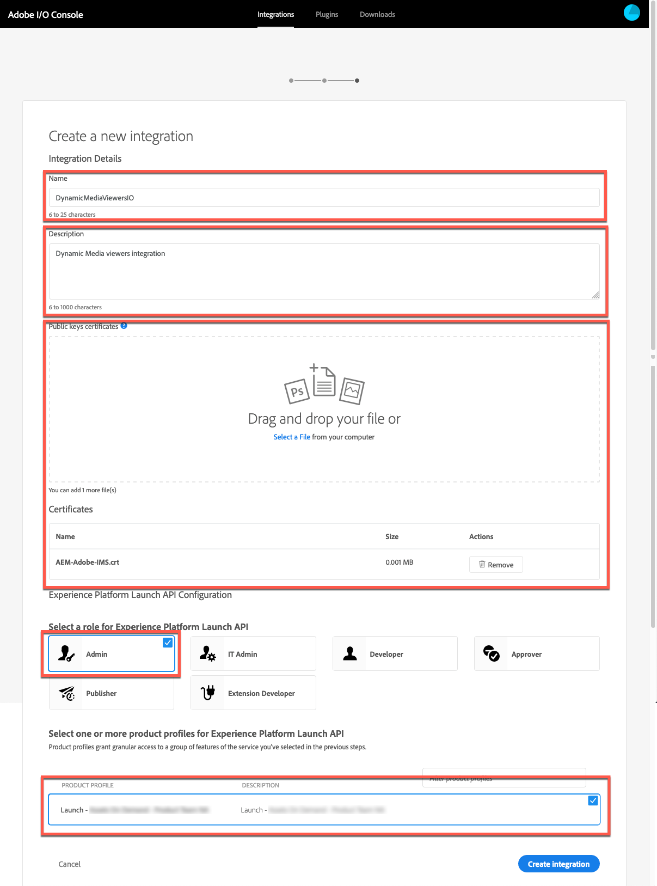
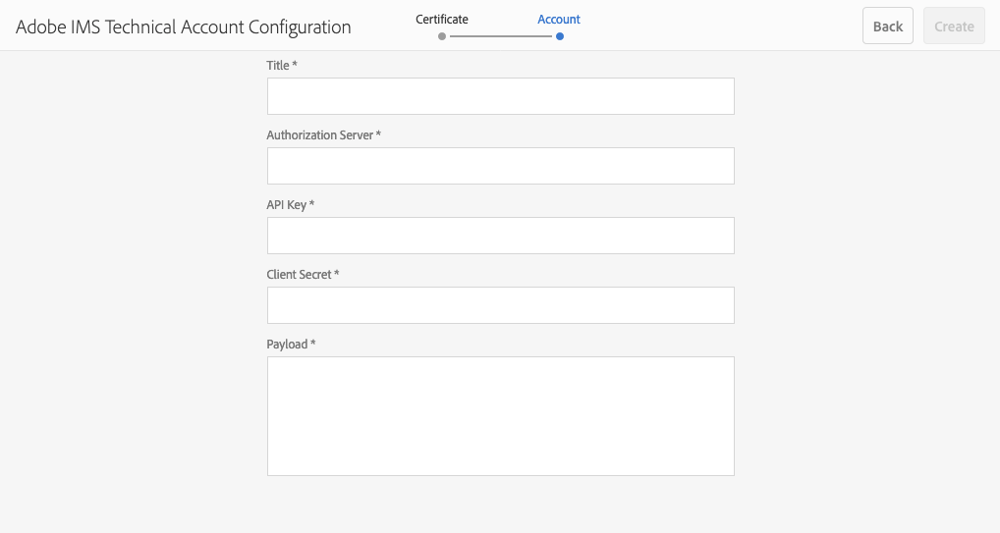
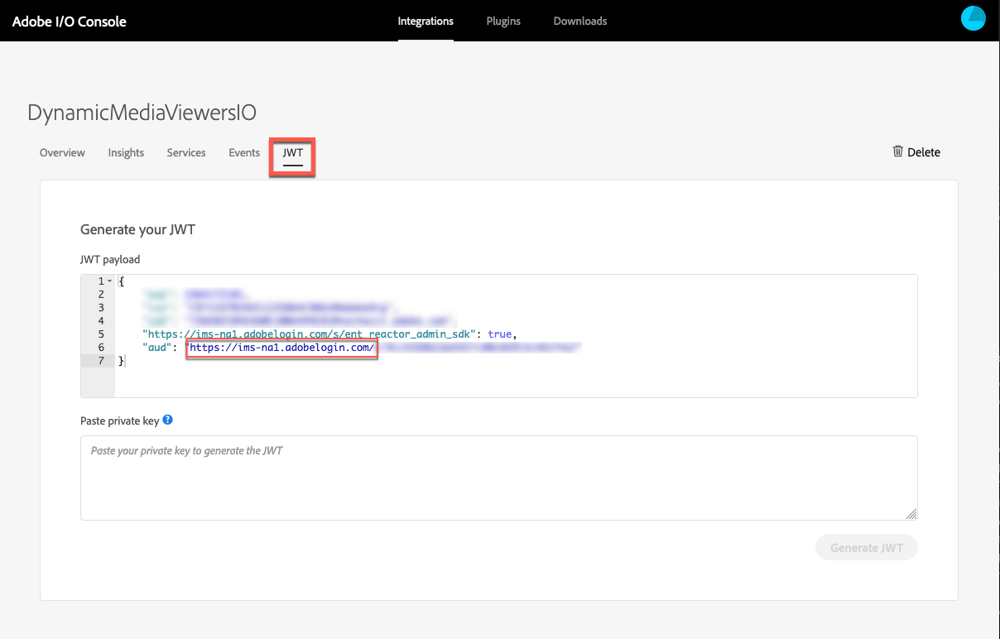
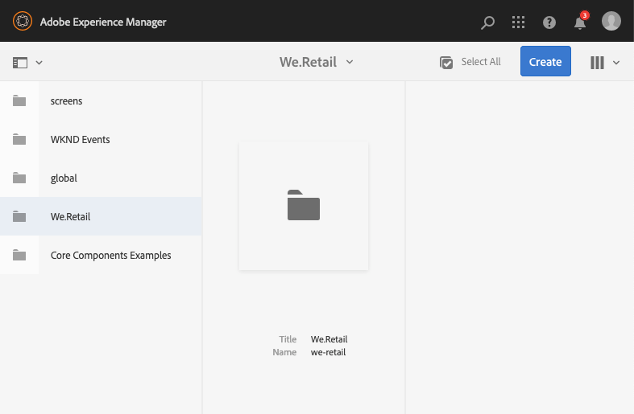
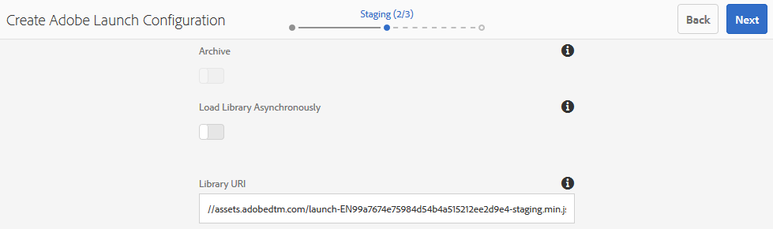

# Integrera Dynamic Media-visningsprogram med Adobe Analytics och Experience Platform Launch {#integrating-dynamic-media-viewers-with-adobe-analytics-and-adobe-launch}

## Vad är Dynamic Media Viewer integrerat med Adobe Analytics och Experience Platform Launch? {#what-is-dynamic-media-viewers-integration-with-adobe-analytics-and-adobe-launch}

<!-- Leave this hidden path here; it points to the topic source from Sasha https://wiki.corp.adobe.com/pages/viewpage.action?spaceKey=~oufimtse&title=Dynamic+Media+Viewers+integration+with+Adobe+Launch -->

Med det nya tillägget *Dynamic Media Viewer* för Platform launch och Dynamic Media Viewer 5.13 kan kunder med Adobe Analytics och Platform launch använda händelser och data som är specifika för visningsprogrammen i sin Platform launch.

Integrationen innebär att du kan spåra användningen av Dynamic Media Viewer på din webbplats med Adobe Analytics. Samtidigt kan du använda händelser och data som visas av visningsprogrammen tillsammans med andra Platforma launcher som kommer från Adobe eller en tredje part.

Mer information om tillägg finns i [Adobe-tillägg](https://experienceleague.adobe.com/docs/launch/using/extensions-ref/overview.html#adobe-extension) i användarhandboken för Experience Platform Launch.

**Det här avsnittet är avsett för följande:** Webbplatsadministratörer, utvecklare på Adobe Experience Manager-plattformen samt personer i Operations.

### Begränsningar för integreringen {#limitations-of-the-integration}

* Integrering med Experience Platform Launch för Dynamic Media-visningsprogram fungerar inte i noden Experience Manager författare. Du kan inte se någon spårning från en WCM-sida förrän den har publicerats.
* Experience Platform Launch-integrering för Dynamic Media-visningsprogram stöds inte för åtgärdsläget&quot;popup&quot;, där visningsprogrammets URL hämtas med knappen&quot;URL&quot; på sidan Resursinformation.
* Integrering med Experience Platform Launch kan inte användas samtidigt med integrering med äldre visningsprogram Analytics (via parametern `config2=`).
* Stödet för videospårning är begränsat till enbart huvudspårning av uppspelning, vilket beskrivs i [Spårningsöversikt](https://experienceleague.adobe.com/docs/media-analytics/using/sdk-implement/track-av-playback/track-core-overview.html#player-events). Speciellt stöds inte QoS, Ads, Chapter/Segments eller Errors tracking.
* Konfiguration av lagringstid för dataelement stöds inte för dataelement med tillägget *Dynamic Media Viewer*. Lagringsvaraktighet måste anges till **[!UICONTROL None]**.

### Användningsexempel för integreringen {#use-cases-for-the-integration}

Det främsta användningsområdet för integreringen med Experience Platform Launch är kunder som använder både Experience Manager Assets och Experience Manager Sites. I sådana fall kan du konfigurera en standardintegrering mellan författarnoden i Experience Manager och Experience Platform Launch och sedan associera din Sites-instans med egenskapen Experience Platform Launch. Efter det kommer alla Dynamic Media WCM-komponenter som läggs till på en Sites-sida att spåra data och händelser från tittarna.

Se [Spåra Dynamic Media-visningsprogram i Experience Manager Sites](#tracking-dynamic-media-viewers-in-aem-sites).

Ett sekundärt användningsfall som integreringen stöder är de kunder som bara använder Experience Manager Assets eller Dynamic Media Classic. I så fall får du inbäddningskoden för ditt visningsprogram och lägger till den på webbplatssidan. Hämta sedan Experience Platform Launch URL:en för biblioteksproduktion från Experience Platform Launch och lägg till den manuellt i webbsideskoden.

Se [Spåra Dynamic Media-visningsprogram med hjälp av inbäddningskod](#tracking-dynamic-media-viewers-using-embed-code).

## Hur data- och händelsespårning fungerar i integreringen {#how-data-and-event-tracking-works-in-the-integration}

Integreringen utnyttjar två separata och oberoende typer av spårning av Dynamic Media Viewers: *Adobe Analytics* och *Adobe Analytics for Audio and Video*.

### Om spårning med Adobe Analytics {#about-tracking-using-adobe-analytics}

Med Adobe Analytics kan du spåra åtgärder som slutanvändaren utför när de interagerar med Dynamic Media-visningsprogram på webbplatsen. Med Adobe Analytics kan du också spåra visningsprogramspecifika data. Du kan till exempel spåra och spela in inläsningshändelser tillsammans med resursnamnet, eventuella zoomåtgärder som har utförts och videouppspelningsåtgärder.

I Experience Platform Launch fungerar begreppen i *Dataelement* och *Regler* tillsammans för att aktivera Adobe Analytics-spårning.

#### Om dataelement i Experience Platform Launch {#about-data-elements-in-adobe-launch}

Ett dataelement i Experience Platform Launch är en namngiven egenskap vars värde antingen är statiskt definierat eller dynamiskt beräknat baserat på en webbsidas eller Dynamic Media Viewer-data.

Vilka alternativ som är tillgängliga för en dataelementsdefinition beror på listan med tillägg som är installerade i Experience Platform Launch-egenskapen. Tillägget &quot;Core&quot; är förinstallerat och finns tillgängligt direkt i alla konfigurationer. Med det här tillägget Core kan du definiera ett dataelement som kommer från cookie, JavaScript-kod, frågesträng och många andra källor.

För Adobe Analytics tracking måste flera andra tillägg vara installerade, vilket beskrivs i [Installation och installation av tillägg](#installing-and-setup-of-extensions). Tillägget Dynamic Media Viewer ger möjlighet att definiera ett dataelement som är ett argument i Dynamic Viewer-händelsen. Det är till exempel möjligt att referera till visningsprogramtypen, eller resursnamnet som rapporteras av visningsprogrammet vid inläsning, den zoomnivå som rapporteras när slutanvändaren zoomar och mycket annat.

Dynamic Media Viewer-tillägget håller automatiskt värdena för dataelementen uppdaterade.

När du har definierat det kan ett dataelement användas på andra platser i användargränssnittet för Experience Platform Launch med hjälp av widgeten för dataelementväljare. Dataelement som definieras för spårning av Dynamic Media-visningsprogram refereras särskilt av tillägget Ange variabelåtgärd för Adobe Analytics (se nedan).

Se [Dataelement](https://experienceleague.adobe.com/docs/launch/using/reference/manage-resources/data-elements.html#reference) i användarhandboken för Experience Platform Launch.

#### Om regler i Experience Platform Launch {#about-rules-in-adobe-launch}

En regel i Experience Platform Launch är en agnostisk konfiguration som definierar tre områden som utgör en regel: *Händelser*, *Villkor* och *Åtgärder*:

* *Händelser* (if) anger för Experience Platform Launch när en regel ska utlösas.
* *Condition* (if) anger för Experience Platform Launch vilka andra begränsningar som ska tillåtas eller inte när en regel aktiveras.
* *Åtgärder* (sedan) anger för Experience Platform Launch vad som ska göras när en regel aktiveras.

Vilka alternativ som är tillgängliga i avsnittet Händelser, Villkor och Åtgärder beror på vilka tillägg som är installerade i Experience Platform Launch-egenskapen. Tillägget *Core* är förinstallerat och finns tillgängligt direkt i alla konfigurationer. Tillägget innehåller flera alternativ för Händelser, t.ex. grundläggande åtgärder på webbläsarnivå som inkluderar fokusändringar, tangenttryckningar och formulärskickningar. Den innehåller även alternativ för Villkor, som cookie-värde, webbläsartyp och mycket annat. För Åtgärder är endast alternativet Anpassad kod tillgängligt.

För Adobe Analytics tracking måste flera andra tillägg installeras, vilket beskrivs i [Installation och konfiguration av tillägg](#installing-and-setup-of-extensions). Särskilt:

* Tillägget Dynamic Media Viewer utökar listan med händelser som stöds till händelser som är specifika för Dynamic Media-visningsprogram, t.ex. visning, byte av resurser, inzoomning och videouppspelning.
* Adobe Analytics-tillägget utökar listan över åtgärder som stöds med två åtgärder som krävs för att skicka data till spårningsservrar: *Ange variabler* och *Skicka fyr*.

Om du vill spåra Dynamic Media-visningsprogram kan du använda någon av följande typer:

* Händelser från Dynamic Media Viewer-tillägget, Core-tillägget eller andra tillägg.
* Villkor i regeldefinitionen. Du kan också lämna villkorsområdet tomt.

I avsnittet Åtgärder måste du ha en *Set Variables*-åtgärd. Den här åtgärden anger för Adobe Analytics hur spårningsvariabler ska fyllas i med data. Samtidigt skickar inte åtgärden *Ange variabler* något till spårningsservern.

Åtgärden *Ange variabler* måste följas av en *Skicka Beacon*-åtgärd. Åtgärden *Skicka Beacon* skickar data till analysspårningsservern. Båda åtgärderna, *Ange variabler* och *Skicka Beacon*, kommer från Adobe Analytics-tillägget.

Se [Regler](https://experienceleague.adobe.com/docs/launch/using/reference/manage-resources/rules.html#reference) i användarhandboken för Experience Platform Launch.

#### Exempelkonfiguration {#sample-configuration}

I följande exempelkonfiguration i Experience Platform Launch visas hur du spårar ett resursnamn när visningsprogrammet läses in.

1. På fliken **[!UICONTROL Data Elements]** definierar du ett dataelement `AssetName` som refererar till parametern `asset` för händelsen `LOAD` från tillägget Dynamic Media Viewer.

   

1. Definiera en regel *TrackAssetOnLoad* på fliken **[!UICONTROL Rules]**.

   I den här regeln använder fältet **[!UICONTROL Event]** händelsen **[!UICONTROL LOAD]** från tillägget Dynamic Media Viewer.

   

1. Åtgärdskonfigurationen har två åtgärdstyper från Adobe Analytics-tillägget:

   *Ange variabler*, som mappar en analysvariabel som du väljer till värdet för  `AssetName` dataelementet.

   *Skicka Beacon* som skickar spårningsinformation till Adobe Analytics.

   

1. Den resulterande regelkonfigurationen ser ut så här:

   

### Om Adobe Analytics för ljud och video {#about-adobe-analytics-for-audio-and-video}

När ett Experience Cloud-konto prenumererar på Adobe Analytics för ljud och video räcker det att aktivera videospårning i tillägginställningarna *Dynamic Media Viewer*. Videomått blir tillgängligt i Adobe Analytics. Videospårning beror på om det finns Adobe Media Analytics för ljud- och videotillägg.

Se [Installation och konfiguration av tillägg](#installing-and-setup-of-extensions).

Stödet för videospårning är för närvarande begränsat till enbart huvuduppspelningsspårning, vilket beskrivs i [Spårningsöversikt](https://experienceleague.adobe.com/docs/media-analytics/using/sdk-implement/track-av-playback/track-core-overview.html#player-events). Speciellt stöds inte QoS, Ads, Chapter/Segments eller Errors tracking.

## Använda tillägget Dynamic Media Viewer {#using-the-dynamic-media-viewers-extension}

Som nämndes i [Användningsexempel för integrering](#use-cases-for-the-integration) är det möjligt att spåra Dynamic Media-visningsprogram med den nya Experience Platform Launch-integreringen i Experience Manager Sites och genom att använda inbäddningskod.

### Spåra Dynamic Media-visningsprogram i Experience Manager Sites {#tracking-dynamic-media-viewers-in-aem-sites}

Om du vill spåra Dynamic Media-visningsprogram i Experience Manager Sites måste du utföra alla steg som listas under [Konfigurera alla integrationsdelar](#configuring-all-the-integration-pieces)-avsnittet. Du måste skapa IMS-konfigurationen och konfigurationen för Experience Platform Launch Cloud.

När konfigurationen är korrekt spåras data automatiskt i Adobe Analytics, Adobe Analytics for Video eller båda när du lägger till ett visningsprogram från Dynamic Media på en webbplats med en WCM-komponent som stöds av Dynamic Media.

Se [Lägga till Dynamic Media-resurser på sidor med hjälp av Adobe Sites](/help/assets/dynamic-media/adding-dynamic-media-assets-to-pages.md).

### Spåra Dynamic Media-visningsprogram med hjälp av inbäddningskoden {#tracking-dynamic-media-viewers-using-embed-code}

Kunder som inte använder Experience Manager Sites eller bäddar in Dynamic Media-visningsprogram på webbsidor utanför Experience Manager Sites, eller båda, kan fortfarande använda Experience Platform Launch-integreringen.

Slutför konfigurationsstegen i [Konfigurera Adobe Analytics](#configuring-adobe-analytics-for-the-integration) och [Konfigurera Experience Platform Launch](#configuring-adobe-launch-for-the-integration)-avsnitten. Konfigurationssteg som rör Experience Manager behövs dock inte.

Om konfigurationen är korrekt kan du lägga till stöd för Experience Platform Launch på en webbsida med ett Dynamic Media-visningsprogram.

Mer information om hur du använder inbäddningskod för Experience Platform Launch-bibliotek finns i [Lägg till koden för Experience Platform Launch-inbäddning](https://experienceleague.adobe.com/docs/launch-learn/implementing-in-websites-with-launch/configure-launch/launch-add-embed.html#configure-launch).

Mer information om hur du använder funktionen för att bädda in kod i Experience Manager Dynamic Media finns i [Bädda in video- eller bildvisningsprogrammet på en webbsida](/help/assets/dynamic-media/embed-code.md).

**Så här spårar du Dynamic Media-visningsprogram med hjälp av inbäddningskod**:

1. Ha en webbsida redo för inbäddning av ett Dynamic Media-visningsprogram.
1. Hämta inbäddningskoden för Experience Platform Launch-biblioteket genom att först logga in på Experience Platform Launch (se [Konfigurera Experience Platform Launch](#configuring-adobe-launch-for-the-integration)).
1. Klicka på **[!UICONTROL Property]** och sedan på fliken **[!UICONTROL Environments]**.
1. Plocka upp den miljönivå som är relevant för webbsidans miljö. Klicka sedan på ruteikonen i kolumnen **[!UICONTROL Install]**.
1. **[!UICONTROL In the Web Install Instructions]** kopierar den fullständiga inbäddningskoden för Experience Platform Launch-biblioteket tillsammans med de omgivande  `<script/>` taggarna.

## Referenshandbok för tillägget Dynamic Media Viewer {#reference-guide-for-the-dynamic-media-viewers-extension}

### Om konfigurationen för Dynamic Media Viewer {#about-the-dynamic-media-viewers-configuration}

Dynamic Media Viewer-tillägget integreras automatiskt med Experience Platform Launch-biblioteket om följande villkor är uppfyllda:

* Det finns ett globalt objekt ( `_satellite`) för Experience Platform Launch-biblioteket på sidan.
* Tilläggsfunktionen `_dmviewers_v001()` för Dynamic Media Viewer har definierats i `_satellite`.

* `config2=` Ingen visningsprogramparameter har angetts, vilket innebär att visningsprogrammet inte använder äldre Analytics-integrering.

Det finns också ett alternativ för att uttryckligen inaktivera Experience Platform Launch-integrering i visningsprogrammet genom att ange parametern `launch=0` i visningsprogrammets konfiguration. Standardvärdet för den här parametern är `1`.

### Konfigurera tillägget Dynamic Media Viewer {#configuring-the-dynamic-media-viewers-extension}

Det enda konfigurationsalternativet för tillägget Dynamic Media Viewer är **[!UICONTROL Enable Adobe Media Analytics for Audio and Video]**.

När du markerar (aktiverar) det här alternativet och Adobe Media Analytics för ljud och video har installerats och konfigurerats skickas videouppspelningsstatistik till Adobe Analytics för ljud och video. Om du inaktiverar det här alternativet inaktiveras videospårning.

Om du aktiverar det här alternativet *utan att ha Adobe Media Analytics for Audio och Video installerat, har alternativet ingen effekt.*

### Om dataelement i Dynamic Media Viewer-tillägget {#about-data-elements-in-the-dynamic-media-viewers-extension}

Den enda dataelementtypen som tillägget Dynamic Media-visningsprogram tillhandahåller är **[!UICONTROL Viewer Event]** i listrutan **[!UICONTROL Data Element Type]**.

När du väljer det här alternativet återges ett formulär med två fält i dataelementsredigeraren:

* **[!UICONTROL DM viewers event data type]** – en listruta som identifierar alla visningsprogramhändelser som stöds av tillägget Dynamic Media-visningsprogrammet och som har argument, plus ett särskilt **[!UICONTROL COMMON]**-objekt. Objektet **[!UICONTROL COMMON]** representerar en lista med händelseparametrar som är gemensamma för alla typer av händelser som skickas av visningsprogrammen.
* **[!UICONTROL Tracking parameter]** - ett argument för den valda Dynamic Media Viewer-händelsen.

Se [referenshandboken för Dynamic Media Viewer](https://experienceleague.adobe.com/docs/dynamic-media-developer-resources/library/viewers-aem-assets-dmc/c-html5-s7-aem-asset-viewers.html) för en lista över händelser som stöds av varje visningsprogramtyp. Gå till ett specifikt visningsprogramavsnitt och klicka sedan på Support för underavsnittet Adobe Analytics tracking. Referenshandboken för Dynamic Media Viewer dokumenterar för närvarande inte händelseargument.

Nu ska vi titta på livscykeln för Dynamic Media Viewer *Data Element*. Värdet för det dataelementet fylls i efter att motsvarande Dynamic Media-visningsprogramhändelse inträffar på sidan. Anta att dataelementet pekar på händelsen **[!UICONTROL LOAD]** och dess &quot;asset&quot;-argument. Värdet för det dataelementet tar emot giltiga data när visningsprogrammet kör LOAD-händelsen för första gången. Om dataelementet pekar på händelsen **[!UICONTROL ZOOM]** och dess &quot;scale&quot;-argument, är värdet för dataelementet tomt tills användaren skickar en **[!UICONTROL ZOOM]**-händelse för första gången.

På samma sätt uppdateras värdena för dataelement automatiskt när visningsprogrammet skickar en motsvarande händelse på sidan. Värdeuppdateringen sker även om den särskilda händelsen inte har angetts i regelkonfigurationen. Anta till exempel att dataelementet **[!UICONTROL ZoomScale]** är definierat för parametern &quot;scale&quot; i ZOOM-händelsen. Den enda regel som finns i regelkonfigurationen aktiveras emellertid av händelsen **[!UICONTROL LOAD]**. Värdet **[!UICONTROL ZoomScale]** uppdateras fortfarande varje gång en användare zoomar in i visningsprogrammet.

Alla Dynamic Media-visningsprogram har en unik identifierare på webbsidan. Dataelementet spårar själva värdet och det visningsprogram som har fyllt i värdet. Anta till exempel att det finns flera visningsprogram på samma sida och ett **[!UICONTROL AssetName]**-dataelement som pekar på händelsen **[!UICONTROL LOAD]** och dess &quot;asset&quot;-argument. Dataelementet **[!UICONTROL AssetName]** underhåller en samling resursnamn som är associerade med varje visningsprogram som har lästs in på sidan.

Det exakta värdet som returneras av dataelementet beror på sammanhanget. Om dataelementet begärs i en regel som utlöstes av en Dynamic Media-visningshändelse, returneras dataelementvärdet för det visningsprogram som initierade regeln. Och dataelementet begärs i en regel som utlöstes av en händelse från någon annan Platform launch. I det skedet kommer dataelementets värde från det visningsprogram som senast uppdaterade det här dataelementet.

**Tänk på följande exempelinställningar**:

* En webbsida med två zoomningsvisningsprogram från Dynamic Media: *visningsprogram1* och *visningsprogram2*.

* **[!UICONTROL ZoomScale]** Dataelementet pekar på  **[!UICONTROL ZOOM]** händelsen och dess &quot;scale&quot;-argument.
* **[!UICONTROL TrackPan]** Regel med följande:

   * Använder Dynamic Media Viewer **[!UICONTROL PAN]**-händelsen som utlösare.
   * Skickar värdet för **[!UICONTROL ZoomScale]**-dataelement till Adobe Analytics.

* **[!UICONTROL TrackKey]** Regel med följande:

   * Använder tangenttryckningshändelsen från Core Experience Platform Launch-tillägget som utlösare.
   * Skickar värdet för **[!UICONTROL ZoomScale]**-dataelement till Adobe Analytics.

Anta nu att slutanvändaren läser in webbsidan med de två visningsprogrammen. I *visningsprogram1* zoomar de in till 50 % skala; sedan zoomar de in i *visningsprogram2* till 25 % skala. I *visningsprogram1* panorerar de bilden runt bilden och trycker slutligen på en tangent på tangentbordet.

Slutanvändarens aktivitet resulterar i följande två spårningsanrop till Adobe Analytics:

* Det första anropet sker eftersom regeln **[!UICONTROL TrackPan]** aktiveras när användaren panorerar i *visningsprogram1*. Anropet skickar 50 % som ett värde på **[!UICONTROL ZoomScale]** dataelement eftersom dataelementet vet att regeln aktiveras av *visningsprogram1* och hämtar motsvarande skalvärde.
* Det andra anropet sker eftersom regeln **[!UICONTROL TrackKey]** aktiveras när användaren trycker på en tangent på tangentbordet. Det anropet skickar 25 % som ett värde på **[!UICONTROL ZoomScale]** dataelement eftersom regeln inte utlöstes av användaren. Därför returnerar dataelementet det senaste värdet.

Samplingsuppsättningen ovan påverkar också dataelementvärdets livslängd. Värdet på dataelementet som hanteras av Dynamic Media Viewer lagras i Experience Platform Launch-bibliotekskoden även efter att själva visningsprogrammet har tagits bort från webbsidan. Den här funktionen innebär att om det finns en regel som aktiveras av ett icke-Dynamic Media Viewer-tillägg och refererar till ett sådant dataelement, returnerar dataelementet det senast kända värdet. Även om visningsprogrammet inte längre finns på webbsidan.

Värdena för dataelement som drivs av Dynamic Media-visningsprogram lagras inte i den lokala lagringen eller på servern. i stället finns de bara i klientbiblioteket Experience Platform Launch. Värdena för sådana dataelement försvinner när webbsidan läses in igen.

I allmänhet har dataelementsredigeraren stöd för [val av lagringstid](https://experienceleague.adobe.com/docs/launch/using/reference/manage-resources/data-elements.html?lang=en#create-a-data-element). Dataelement som använder tillägget Dynamic Media Viewer stöder dock endast alternativet för lagringstid på **[!UICONTROL None]**. Det går att ange andra värden i användargränssnittet, men i det här fallet är dataelementets beteende inte definierat. Tillägget hanterar värdet för dataelementet separat: Data-elementet som behåller värdet för visningsprogrammets händelseargument under hela visningsprogrammets livscykel.

### Om regler i tillägget Dynamic Media Viewer {#about-rules-in-the-dynamic-media-viewers-extension}

I regelredigeraren lägger tillägget till nya konfigurationsalternativ för händelseredigeraren. Redigeraren har också ett alternativ för att manuellt referera till händelseparametrar i redigeraren som ett kortvarigt alternativ i stället för att använda förkonfigurerade dataelement.

#### Om händelseredigeraren {#about-the-events-editor}

I händelseredigeraren lägger tillägget Dynamic Media Viewer till **[!UICONTROL Event Type]** till **[!UICONTROL Viewer Event]**.

När du väljer det här alternativet återges listrutan **[!UICONTROL Dynamic Media Viewer events]** med alla tillgängliga händelser som stöds av visningsprogram i Dynamic Media.

#### Om åtgärdsredigeraren {#about-the-actions-editor}

Med Dynamic Media Viewer-tillägget kan du använda händelseparametrar för Dynamic Media-visningsprogram för att mappa till analysvariabler i Adobe Analytics-tilläggets Set Variables-redigerare.

Det enklaste sättet att göra detta är att slutföra följande tvåstegsprocess:

* Börja med att definiera ett eller flera dataelement, där varje dataelement representerar en parameter för en Dynamic Media Viewer-händelse.
* I redigeraren Ange variabler för Adobe Analytics-tillägget klickar du slutligen på väljarikonen för dataelement (tre skiktade skivor) för att öppna dialogrutan Markera dataelement och väljer sedan ett dataelement.

Det är dock möjligt att använda en alternativ metod och åsidosätta skapande av dataelement. Du kan referera direkt till ett argument från en Dynamic Media Viewer-händelse. Ange det fullständiga, kvalificerade namnet på händelseargumentet i **[!UICONTROL value]**-indatafältet i variabeltilldelningen för Analytics. Försäkra dig om att du omger med procenttecken (%). Till exempel,

`%event.detail.dm.LOAD.asset%`

Det finns en viktig skillnad mellan att använda dataelement och argumentreferens för direkt händelse. För dataelement spelar det ingen roll vilken händelse som utlöser åtgärden Ange variabler. Händelsen som utlöser regeln kan vara orelaterad till Dynamic Viewer (som att klicka på webbsidan från Core-tillägget). Men när du använder en referens för ett direkt argument är det viktigt att se till att händelsen som utlöser regeln motsvarar händelseargumentet som den refererar till.

Om du till exempel refererar till `%event.detail.dm.LOAD.asset%` returneras rätt resursnamn om regeln aktiveras av händelsen **[!UICONTROL LOAD]** för tillägget Dynamic Media-visningsprogrammet. Det returnerar dock ett tomt värde för alla andra händelser.

I följande tabell visas Dynamic Media Viewer-händelser och deras argument som stöds:

<table>
 <tbody>
  <tr>
   <td>Namn på visningsprogramhändelse</td>
   <td>Argumentreferens</td>
  </tr>
  <tr>
   <td><code>COMMON</code></td>
   <td><code>%event.detail.dm.objID%</code></td>
  </tr>
  <tr>
   <td> </td>
   <td><code>%event.detail.dm.compClass%</code></td>
  </tr>
  <tr>
   <td> </td>
   <td><code>%event.detail.dm.instName%</code></td>
  </tr>
  <tr>
   <td> </td>
   <td><code>%event.detail.dm.timeStamp%</code></td>
  </tr>
  <tr>
   <td><code>BANNER</code> </td>
   <td><code>%event.detail.dm.BANNER.asset%</code></td>
  </tr>
  <tr>
   <td> </td>
   <td><code>%event.detail.dm.BANNER.frame%</code></td>
  </tr>
  <tr>
   <td> </td>
   <td><code>%event.detail.dm.BANNER.label%</code></td>
  </tr>
  <tr>
   <td><code>HREF</code></td>
   <td><code>%event.detail.dm.HREF.rollover%</code></td>
  </tr>
  <tr>
   <td><code>ITEM</code></td>
   <td><code>%event.detail.dm.ITEM.rollover%</code></td>
  </tr>
  <tr>
   <td><code>LOAD</code></td>
   <td><code>%event.detail.dm.LOAD.applicationname%</code></td>
  </tr>
  <tr>
   <td><strong> </strong></td>
   <td><code>%event.detail.dm.LOAD.asset%</code></td>
  </tr>
  <tr>
   <td><strong> </strong></td>
   <td><code>%event.detail.dm.LOAD.company%</code></td>
  </tr>
  <tr>
   <td><strong> </strong></td>
   <td><code>%event.detail.dm.LOAD.sdkversion%</code></td>
  </tr>
  <tr>
   <td><strong> </strong></td>
   <td><code>%event.detail.dm.LOAD.viewertype%</code></td>
  </tr>
  <tr>
   <td><strong> </strong></td>
   <td><code>%event.detail.dm.LOAD.viewerversion%</code></td>
  </tr>
  <tr>
   <td><code>METADATA</code></td>
   <td><code>%event.detail.dm.METADATA.length%</code></td>
  </tr>
  <tr>
   <td> </td>
   <td><code>%event.detail.dm.METADATA.type%</code></td>
  </tr>
  <tr>
   <td><code>MILESTONE</code></td>
   <td><code>%event.detail.dm.MILESTONE.milestone%</code></td>
  </tr>
  <tr>
   <td><code>PAGE</code></td>
   <td><code>%event.detail.dm.PAGE.frame%</code></td>
  </tr>
  <tr>
   <td> </td>
   <td><code>%event.detail.dm.PAGE.label%</code></td>
  </tr>
  <tr>
   <td><code>PAUSE</code></td>
   <td><code>%event.detail.dm.PAUSE.timestamp%</code></td>
  </tr>
  <tr>
   <td><code>PLAY</code></td>
   <td><code>%event.detail.dm.PLAY.timestamp%</code></td>
  </tr>
  <tr>
   <td><code>SPIN</code></td>
   <td><code>%event.detail.dm.SPIN.framenumber%</code></td>
  </tr>
  <tr>
   <td><code>STOP</code></td>
   <td><code>%event.detail.dm.STOP.timestamp%</code></td>
  </tr>
  <tr>
   <td><code>SWAP</code></td>
   <td><code>%event.detail.dm.SWAP.asset%</code></td>
  </tr>
  <tr>
   <td><code>SWATCH</code></td>
   <td><code>%event.detail.dm.SWATCH.frame%</code></td>
  </tr>
  <tr>
   <td> </td>
   <td><code>%event.detail.dm.SWATCH.label%</code></td>
  </tr>
  <tr>
   <td><code>TARG</code></td>
   <td><code>%event.detail.dm.TARG.frame%</code></td>
  </tr>
  <tr>
   <td> </td>
   <td><code>%event.detail.dm.TARG.label%</code></td>
  </tr>
  <tr>
   <td><code>ZOOM</code></td>
   <td><code>%event.detail.dm.ZOOM.scale%</code></td>
  </tr>
 </tbody>
</table>

## Konfigurerar alla integreringsdelar {#configuring-all-the-integration-pieces}

**INNAN DU BÖRJAR**

Adobe rekommenderar att du granskar all dokumentation innan det här avsnittet så att du förstår den fullständiga integreringen.

I det här avsnittet beskrivs de konfigurationssteg som krävs för att integrera Dynamic Media-visningsprogram med Adobe Analytics och Adobe Analytics för ljud och video. Även om det går att använda Dynamic Media Viewer-tillägget för andra syften i Experience Platform Launch, omfattas sådana scenarier inte av den här dokumentationen.

Du kommer att använda följande Adobe-produkter för att konfigurera din integrering:

* Adobe Analytics - används för att konfigurera spårningsvariabler och rapporter.
* Experience Platform Launch - används för att definiera en egenskap, en eller flera regler och ett eller flera dataelement för att aktivera spårning av visningsprogram.

Om den här integrationslösningen används med Experience Manager Sites måste dessutom följande konfiguration göras:

* Adobe I/O Console - integrering skapas för Experience Platform Launch.
* nod för författare i Experience Manager - IMS-konfiguration och Experience Platform Launch molnkonfiguration.

Som en del av konfigurationen måste du se till att du har tillgång till ett företag i Adobe Experience Cloud som redan har Adobe Analytics och Experience Platform Launch aktiverat.

## Konfigurera Adobe Analytics för integreringen {#configuring-adobe-analytics-for-the-integration}

När du har konfigurerat Adobe Analytics kommer följande att konfigureras för integreringen:

* En rapportsvit finns på plats och har valts.
* Analysvariabler är tillgängliga för att ta emot spårningsdata.
* Det finns rapporter för att visa insamlade data i Adobe Analytics.

Se även [Implementeringshandbok för analys](https://experienceleague.adobe.com/docs/analytics/implementation/home.html).

**Så här konfigurerar du Adobe Analytics för integreringen**:

1. Börja med att gå till Adobe Analytics från Experience Cloud [startsidan](https://exc-home.experiencecloud.adobe.com/exc-home/home.html#/). På menyraden klickar du på ikonen Lösningar (en tabell med tre punkter) i det övre högra hörnet av sidan och sedan på **[!UICONTROL Analytics]**.

   

   Välj en rapportsvit.

### Välja en rapportsvit {#selecting-a-report-suite}

1. I det övre högra hörnet av Adobe Analytics-sidan, till höger om fältet **[!UICONTROL Search Reports]**, väljer du rätt rapportsvit i listrutan. Om det finns flera rapportsviter och du är osäker på vilken du ska använda kontaktar du Adobe Analytics-administratören, som kan hjälpa dig att välja rätt rapportsvit.

   I bilden nedan skapade en användare en rapportsvit med namnet *DynamicMediaViewersExtensionDoc* och markerade den i listrutan. Rapportsvitens namn är endast för illustrationsändamål. Namnet på den rapportsvit du väljer är upp till dig.

   Om ingen rapportsvit är tillgänglig måste du eller Adobe Analytics-administratören skapa en innan du kan fortsätta med konfigurationen.

   Se [Rapporter och rapportsviter](https://experienceleague.adobe.com/docs/analytics/admin/manage-report-suites/report-suites-admin.html#manage-report-suites) och [Skapa en rapportsvit](https://experienceleague.adobe.com/docs/analytics/admin/admin-console/create-report-suite.html#admin-console).

   I Adobe Analytics hanteras rapportsviter under **[!UICONTROL Admin > Report Suites]**.

   

   Konfigurera Adobe Analytics-variabler.

### Konfigurera Adobe Analytics-variabler {#setting-up-adobe-analytics-variables}

1. Ange en eller flera Adobe Analytics-variabler som du vill använda för att spåra Dynamic Media Viewer-beteendet på webbsidan.

   Det går att använda alla typer av variabler som stöds av Adobe Analytics. Beslutet om variabeltypen (som Custom Traffic [props], Conversion [eVar]) styrs av specifika behov i Analytics-implementeringen.

   Se [Översikt över utkast och eVars](https://experienceleague.adobe.com/docs/analytics/implementation/vars/page-vars/evar.html#vars).

   I den här dokumentationen kommer endast en anpassad trafikvariabel (props) att användas eftersom de blir tillgängliga i en analysrapport inom några minuter efter att en åtgärd har utförts på en webbsida.

   Om du vill aktivera en ny anpassad trafikvariabel klickar du på **[!UICONTROL Admin > Report Suites]** i verktygsfältet i Adobe Analytics.

1. Markera rätt rapport på sidan **[!UICONTROL Report Suite Manager]** och klicka sedan på **[!UICONTROL Edit Settings > Traffic > Traffic Variables]** i verktygsfältet.
1. Där väljer du en oanvänd variabel, ger den ett beskrivande namn ( **[!UICONTROL Viewer asset (prop 30)]**) och ändrar kombinationsrutan till &quot;Aktiverad&quot; i kolumnen Aktiverad.

   Följande skärmbild är ett exempel på en anpassad trafikvariabel ( **[!UICONTROL prop30]**) för att spåra ett resursnamn som används av visningsprogrammet:

   

1. Klicka på **[!UICONTROL Save]** längst ned i variabellistan.

### Konfigurera en rapport {#setting-up-a-report}

1. Vanligtvis styrs skapandet av en rapport i Adobe Analytics av specifika projektbehov. Därför ligger detaljerad rapportkonfiguration utanför den här integreringens räckvidd.

   Det räcker dock att känna till att rapporterna om anpassad trafik automatiskt blir tillgängliga i Adobe Analytics när du har konfigurerat anpassade trafikvariabler i **[Konfigurera Adobe Analytics-variabler](#setting-up-adobe-analytics-variables)**.

   Till exempel finns rapporten för variabeln **[!UICONTROL Viewer asset (prop 30)]** på menyn Rapporter under **[!UICONTROL Custom Traffic > Custom Traffic 21-30 > Viewer asset (prop 30)]**.

   Inga data visas när du besöker den här rapporten direkt efter att **[!UICONTROL Viewer asset (prop 30)]** har skapats, vilket är som väntat vid den här tidpunkten i integreringen.

   

## Konfigurerar Experience Platform Launch för integreringen {#configuring-adobe-launch-for-the-integration}

När du har konfigurerat Experience Platform Launch kommer följande att konfigureras för integreringen:

* Skapandet av en ny egenskap som håller ihop alla dina konfigurationer.
* Installation och installation av tillägg. Klientkoden för alla tillägg som är installerade i egenskapen kompileras tillsammans till ett bibliotek. Det här biblioteket används av webbsidan senare.
* Konfiguration av dataelement och regler. Den här konfigurationen definierar vilka data som ska hämtas från Dynamic Media-visningsprogram, när spårningslogiken ska aktiveras och var visningsprogrammets data ska skickas i Adobe Analytics.
* Publicering av biblioteket.

**Så här konfigurerar du Experience Platform Launch för integreringen**:

1. Börja med att gå till Experience Platform Launch från Experience Cloud [startsidan](https://exc-home.experiencecloud.adobe.com/exc-home/home.html#/). På menyraden klickar du på ikonen Lösningar (tre gånger tre prickar) i det övre högra hörnet av sidan och sedan på **[!UICONTROL Launch]**.

   Du kan även [öppna Experience Platform Launch direkt](https://launch.adobe.com/).

   

### Skapa en egenskap i Experience Platform Launch {#creating-a-property-in-adobe-launch}

En egenskap i Experience Platform Launch är en namngiven konfiguration som håller ihop alla inställningar. Ett bibliotek med konfigurationsinställningarna genereras och publiceras på olika miljönivåer (utveckling, mellanlagring och produktion).

Se även [Skapa en startegenskap](https://experienceleague.adobe.com/docs/launch-learn/implementing-in-mobile-android-apps-with-launch/configure-launch/launch-create-a-property.html#configure-launch).

1. Klicka på **[!UICONTROL New Property]** i Experience Platform Launch.
1. I dialogrutan **[!UICONTROL Create Property]** anger du ett beskrivande namn, till exempel webbplatsens titel, i fältet **[!UICONTROL Name]**. Till exempel, `DynamicMediaViewersProp.`
1. Ange webbplatsens domän i fältet **[!UICONTROL Domains]**.
1. Aktivera **[!UICONTROL Configure for extension development (cannot be modified later)]** i listrutan **[!UICONTROL Advanced Options]** om det tillägg som du vill använda – i det här fallet *Dynamic Media-visningsprogram* – inte släppts än.

   

1. Klicka på **[!UICONTROL Save]**.

   Klicka på den nya egenskapen och fortsätt sedan till *Installation och konfiguration av tillägg*.

### Installera och konfigurera tillägg {#installing-and-setup-of-extensions}

Alla tillgängliga tillägg i Experience Platform Launch visas under **[!UICONTROL Extensions > Catalog]**.

Klicka på **[!UICONTROL Install]** om du vill installera ett tillägg. Utför vid behov en engångskonfiguration och klicka sedan på **[!UICONTROL Save]**.

Om det behövs måste följande tillägg installeras och konfigureras:

* (Obligatoriskt) *Experience Cloud ID-tjänsttillägg*

Ingen ytterligare konfiguration behövs. Godkänn för föreslagna värden. När du är klar ska du klicka på **[!UICONTROL Save]**.

Se [Experience Cloud ID-tjänsttillägg](https://experienceleague.adobe.com/docs/launch/using/extensions-ref/adobe-extension/id-service-extension/overview.html#extensions-ref).

* (Obligatoriskt) *Adobe Analytics*-tillägg

Om du vill konfigurera det här tillägget måste du ha det Report Suite-ID som finns i Adobe Analytics, under **[!UICONTROL Admin > Report Suite]**, under kolumnrubriken **[!UICONTROL Report Suite ID]**.

(Endast i demonstrationssyfte används Report Suite-ID:t för **[!UICONTROL DynamicMediaViewersExtensionDoc]** Report Suite i följande skärmbilder. Detta ID skapades och användes tidigare när du [valde en rapportsvit](#selecting-a-report-suite).)

På sidan Installera tillägg anger du rapportsvits-ID:t i fälten **[!UICONTROL Development Report Suites]**, **[!UICONTROL Staging Report Suites]** och **[!UICONTROL Production Report Suites]**.

*Konfigurera endast följande objekt om du tänker använda videospårning:*

Expandera **[!UICONTROL General]** på sidan **[!UICONTROL Install Extension]** och ange sedan spårningsservern. Spårningsservern följer mallen `<trackingNamespace>.sc.omtrdc.net`, där `<trackingNamespace>` är den information som hämtas i e-postmeddelandet om etablering.

Klicka på **[!UICONTROL Save]**.

Se [Adobe Analytics Extension](https://experienceleague.adobe.com/docs/launch/using/extensions-ref/adobe-extension/analytics-extension/overview.html#extensions-ref).

* (Valfritt. Krävs endast om videospårning behövs) *Adobe Media Analytics för ljud och video*-tillägg

Fyll i spårningsserverfältet. Spårningsservern för tillägget *Adobe Media Analytics for Audio och Video* skiljer sig från spårningsservern som används för Adobe Analytics. Den följer mallen `<trackingNamespace>.hb.omtrdc.net`, där `<trackingNamespace>` är informationen från e-postmeddelandet om etablering.

Alla andra fält är valfria.

Se [Adobe Media Analytics for Audio and Video Extension](https://experienceleague.adobe.com/docs/launch/using/extensions-ref/adobe-extension/media-analytics-extension/overview.html#extensions-ref).

* (Obligatoriskt) *Dynamic Media Viewer*-tillägg

Välj **[!UICONTROL enable Adobe Analytics for Video]** om du vill aktivera (starta) spårning av pulsslag för video.

Från och med den här skrivningen är tillägget *Dynamic Media Viewer* bara tillgängligt om Experience Platform Launch-egenskapen har skapats för utveckling.

Se [Skapa en egenskap i Experience Platform Launch](#creating-a-property-in-adobe-launch).

När tilläggen har installerats och konfigurerats visas minst följande fem tillägg (fyra om du inte spårar video) under Tillägg > Installerat.

### Konfigurera dataelement och regler {#setting-up-data-elements-and-rules}

I Experience Platform Launch skapar du dataelement och regler som behövs för att spåra Dynamic Media-visningsprogram.

Se [Hur data- och händelsespårning fungerar i integreringen](#how-data-and-event-tracking-works-in-the-integration) för en översikt över spårning med Experience Platform Launch.

Se [Exempelkonfiguration](#sample-configuration) för en exempelkonfiguration i Experience Platform Launch som visar hur du spårar ett resursnamn när visningsprogrammet läses in.

Se [Konfigurera tillägget Dynamic Media Viewer](#configuring-the-dynamic-media-viewers-extension) för detaljerad information om tilläggets funktioner.

### Publicera ett bibliotek {#publishing-a-library}

Om du vill ändra konfigurationen för Experience Platform Launch (inklusive Egenskap, Tillägg, Regler och Dataelement) måste du *publicera* sådana ändringar. Publicering i Experience Platform Launch utförs från fliken Publicering under egenskapskonfigurationen.

platforma launchen kan ha flera utvecklingsmiljöer, en mellanlagringsmiljö och en produktionsmiljö. Som standard pekar Platform launch Cloud Configuration i Experience Manager på Experience Manager författarnoden mot scenmiljön i Platform launch. Publiceringsnoden Experience Manager pekar på Platforma launchens produktionsmiljö. Detta innebär att med standardinställningarna för Experience Manager måste du publicera Platform launch-biblioteket till mellanlagringsmiljön. Om du gör det kan du använda det i författaren till Experience Manager. Du kan sedan publicera den i produktionsmiljön så att den kan användas i Experience Manager.

Mer information om Experience Platform Launch-miljöer finns i [Miljöer](https://experienceleague.adobe.com/docs/launch/using/reference/publish/environments/environments.html#environment-types).

Publicering av ett bibliotek omfattar följande två steg:

* Lägga till och skapa ett nytt bibliotek genom att inkludera alla nödvändiga ändringar (nya och uppdateringar) i biblioteket.
* Flytta upp biblioteket genom de olika miljönivåerna (från utveckling till mellanlagring och produktion).

#### Lägga till och skapa ett nytt bibliotek {#adding-and-building-a-new-library}

1. Första gången du öppnar fliken Publicering i Experience Platform Launch är bibliotekslistan tom.

   Klicka på **[!UICONTROL Add New Library]** i den vänstra kolumnen.

   

1. På sidan Skapa nytt bibliotek anger du ett beskrivande namn för det nya biblioteket i fältet **[!UICONTROL Name]**. Till exempel,

   *DynamicMediaViewersLib*

   Välj miljönivå i listrutan Miljö. Till att börja med är bara utvecklingsnivån tillgänglig för val. Klicka på **[!UICONTROL Add All Changed Resources]** längst ned till vänster på sidan.

   

1. Klicka på **[!UICONTROL Save & Build for Development]** i det övre högra hörnet på sidan.

   Om några minuter är biblioteket klart att användas.

   

   >[!NOTE]
   >
   >Nästa gång du ändrar konfigurationen för Experience Platform Launch går du till fliken **[!UICONTROL Publishing]** under konfigurationen **[!UICONTROL Property]** och klickar sedan på det bibliotek du skapat tidigare.
   >
   >
   >Klicka på **[!UICONTROL Add All Changed Resources]** på bibliotekets publiceringsskärm och klicka sedan på **[!UICONTROL Save & Build for Development]**.

#### Flytta upp ett bibliotek genom miljönivåer {#moving-a-library-up-through-environment-levels}

1. När ett nytt bibliotek har lagts till finns det i utvecklingsmiljön. Om du vill flytta den till nivån Mellanlagringsmiljö (som motsvarar kolumnen Skickat) går du till listrutan i biblioteket och klickar på **[!UICONTROL Submit for Approval]**.

   

1. Klicka på **[!UICONTROL Submit]** i bekräftelsedialogrutan.

   När biblioteket har flyttats till kolumnen Skickat går du till listrutan för biblioteket och klickar på **[!UICONTROL Build for Staging]**.

   

1. Om du vill flytta biblioteket från mellanlagringsmiljön till produktionsmiljön (kolumnen Publicerad) följer du en liknande process.

   Klicka först på **[!UICONTROL Approve for Publishing]** i listrutan.

   

1. Klicka på **[!UICONTROL Build & Publish to Production]** i listrutan.

   

   Mer information om publiceringsprocessen i Experience Platform Launch finns i [Publicera](https://experienceleague.adobe.com/docs/launch/using/reference/publish/overview.html#reference).

## Konfigurera Adobe Experience Manager för integreringen {#configuring-adobe-experience-manager-for-the-integration}

<!-- Prerequisites list below should be verified by Sasha -->

Förutsättningar:

* Experience Manager kör både författarinstansen och publiceringsinstansen.
* Skribentnoden för Experience Manager har konfigurerats i Dynamic Media. <!-- Scene7 run mode (dynamicmedia_s7) -->
* Dynamic Media WCM-komponenter är aktiverade i Experience Manager Sites.

Konfigurationen av Experience Manager består av följande två stora steg:

* Konfiguration av Experience Manager IMS.
* Konfiguration av Experience Platform Launch Cloud.

### Konfigurerar Experience Manager IMS {#configuring-aem-ims}

1. Klicka på verktygsikonen (hammer) i författaren till Experience Manager och klicka sedan på **[!UICONTROL Security > Adobe IMS Configurations]**.

   

1. Klicka på **[!UICONTROL Create]** i det övre vänstra hörnet på konfigurationssidan för Adobe IMC.
1. På sidan **[!UICONTROL Adobe IMS Technical Account Configuration]** går du till listrutan **[!UICONTROL Cloud Solution]** och klickar på **[!UICONTROL Experience Platform Launch]**.
1. Aktivera **[!UICONTROL Create new certificate]** och ange sedan ett meningsfullt värde för certifikatet i textfältet. Exempel: *AdobeLaunchIMSCert*. Klicka på **[!UICONTROL Create certificate]**.

   Följande informationsmeddelande visas:

   *Om du vill hämta en giltig åtkomsttoken måste det nya certifikatets offentliga nyckel läggas till i det tekniska kontot på Adobe I/O!*

   Om du vill stänga dialogrutan Info klickar du på **[!UICONTROL OK]**.

   

1. Klicka på **[!UICONTROL Download Public Key]** om du vill hämta en offentlig nyckelfil (`*.crt`) till ditt lokala system.

   >[!NOTE]
   >
   >Nu: ***låt*** sidan **[!UICONTROL Adobe IMS Technical Account Configuration]** vara öppen; stäng ***inte*** sidan och klicka ***inte*** på Nästa. Du kommer att gå tillbaka till den här sidan senare i stegen.

   

1. Navigera till [Adobe I/O-konsolen](https://console.adobe.io/integrations) på en ny flik i webbläsaren.

1. På sidan **[!UICONTROL Adobe I/O Console Integrations]**, nära det övre högra hörnet, klickar du på **[!UICONTROL New integration]**.
1. I dialogrutan **[!UICONTROL Create a new integration]** kontrollerar du att alternativknappen **[!UICONTROL Access an API]** är markerad och sedan klickar du på **[!UICONTROL Continue]**.

   

1. På den andra **[!UICONTROL Create a new integration]**-sidan aktiverar du (sätter på) alternativknappen **[!UICONTROL Experience Platform Launch API]**. I sidans nedre högra hörn klickar du på **[!UICONTROL Continue]**.

   

1. Gör följande på den tredje **[!UICONTROL Create a new integration]**-sidan:

   * Ange ett beskrivande namn i fältet **[!UICONTROL Name]**. Exempel: *DynamicMediaViewersIO*.

   * I fältet **[!UICONTROL Description]** anger du en beskrivning för integreringen.

   * I **[!UICONTROL Public key certificates]**-området överför du filen med den offentliga nyckeln (`*.crt`) som du laddade ned tidigare i dessa steg.

   * Välj **[!UICONTROL Admin]** under rubriken **[!UICONTROL Select a role for Experience Platform Launch API]**.

   * Under rubriken **[!UICONTROL Select one or more product profiles for Experience Platform Launch API]** väljer du produktprofilen **[!UICONTROL Launch - <your_company_name>]**.

   

1. Klicka på **[!UICONTROL Create integration]**.
1. På sidan **[!UICONTROL Integration created]** klickar du på **[!UICONTROL Continue to integration details]**.

   

1. En integreringsinformationssida visas, som i följande exempel:

   >[!NOTE]
   >
   >***Låt den här sidan med integreringsinformation vara öppen.*** Du behöver olika informationsdelar från flikarna **[!UICONTROL Overview]** och **[!UICONTROL JWT]** på bara ett ögonblick.

   
   _Sidan med integreringsinformation_

1. Gå tillbaka till sidan **[!UICONTROL Adobe IMS Technical Account Configuration]** som du öppnade tidigare. Klicka på **[!UICONTROL Next]** i det övre högra hörnet av sidan för att öppna sidan **[!UICONTROL Account]** i fönstret **[!UICONTROL Adobe IMS Technical Account Configuration]**.

   (Om du stängde sidan tidigare går du tillbaka till författaren av Experience Manager och klickar sedan på **[!UICONTROL Tools > Security > Adobe IMS Configurations]**. Klicka på **[!UICONTROL Create]**. I listrutan **[!UICONTROL Cloud Solution]** väljer du **[!UICONTROL Experience Platform Launch]**. I listrutan **[!UICONTROL Certificate]** markerar du namnet på det tidigare skapade certifikatet.

   
   _Adobe IMS Technical Account Configuration - certifikatsida_

1. Sidan **[!UICONTROL Account]** innehåller fem fält som kräver att du fyller i med information från sidan Integreringsinformation från föregående steg.

   
   _Adobe IMS Technical Account Configuration - kontosida_

1. På sidan **[!UICONTROL Account]** fyller du i följande fält:

   * **[!UICONTROL Title]** - Ange en beskrivande kontotitel.
   * **[!UICONTROL Authorization Server]** - Gå tillbaka till sidan Integreringsinformation som du öppnade tidigare. Klicka på fliken **[!UICONTROL JWT]**. Kopiera servernamnet - utan sökvägen - enligt markeringen nedan.

(exempelservernamnet är endast för illustrationsändamål)   Gå tillbaka till sidan **[!UICONTROL Account]** och klistra sedan in namnet i respektive fält.
Till exempel `https://ims-na1.adobelogin.com/`
(exempelservernamnet är endast för illustrationsändamål)

   
   _Detaljsida för integrering - fliken JWT_

1. **[!UICONTROL API Key]** – Gå tillbaka till sidan med integreringsinformation. Klicka på fliken **[!UICONTROL Overview]** och sedan till höger om fältet **[!UICONTROL API Key (Client ID)]** klickar du på **[!UICONTROL Copy]**.

   Gå tillbaka till sidan **[!UICONTROL Account]** och klistra sedan in nyckeln i respektive fält.

   
   _Sidan med integreringsinformation_

1. **[!UICONTROL Client Secret]**– Gå tillbaka till sidan med integreringsinformation. Klicka på **[!UICONTROL Retrieve Client Secret]** på fliken **[!UICONTROL Overview]**. Till höger om fältet **[!UICONTROL Client secret]** klickar du på **[!UICONTROL Copy]**.

   Gå tillbaka till sidan **[!UICONTROL Account]** och klistra sedan in nyckeln i respektive fält.

1. **[!UICONTROL Payload]** – Gå tillbaka till sidan med integreringsinformation. Kopiera hela JSON-objektkoden från fliken **[!UICONTROL JWT]** i fältet JWT-nyttolast.

   Gå tillbaka till sidan **[!UICONTROL Account]** och klistra sedan in koden i respektive fält.

   
   _Integrationsinformationssida - JWT-flik_

   Kontosidan, med alla fält ifyllda, ser ut ungefär så här:

   

1. Klicka på **[!UICONTROL Create]** i det övre högra hörnet på sidan **[!UICONTROL Account]**.

   När Experience Manager IMS är konfigurerat har du nu ett nytt IMSA-konto som listas under **[!UICONTROL Adobe IMS Configurations]**.

   

## Konfigurera Experience Platform Launch Cloud för integrering {#configuring-adobe-launch-cloud-for-the-integration}

1. Klicka på verktygsikonen (hammer) i Experience Manager-författaren, nära det övre vänstra hörnet, och klicka sedan på **[!UICONTROL Cloud Services > Experience Platform Launch Configurations]**.

   

1. På sidan **[!UICONTROL Experience Platform Launch Configurations]** i den vänstra panelen väljer du en Experience Manager-plats som du vill använda Experience Platform Launch-konfigurationen för.

   Endast i illustrationssyfte är **[!UICONTROL We.Retail]**-platsen vald i skärmbilden nedan.

   

1. Klicka på **[!UICONTROL Create]** i det övre vänstra hörnet av sidan.
1. På sidan **[!UICONTROL General]** (sida 1/3) i fönstret **[!UICONTROL Create Experience Platform Launch Configuration]** fyller du i följande fält:

   * **[!UICONTROL Title]** - Ange en beskrivande konfigurationstitel. Till exempel, `We.Retail Launch cloud configuration`.

   * **[!UICONTROL Associated Adobe IMS Configuration]** - Välj den IMS-konfiguration som du skapade tidigare i  [Konfigurera Experience Manager IMS](#configuring-aem-ims).

   * **[!UICONTROL Company]** - I  **[!UICONTROL Company]** listrutan väljer du Experience Cloud. Listan fylls i automatiskt.

   * **[!UICONTROL Property]** - I listrutan Egenskaper väljer du den Experience Platform Launch-egenskap som du skapade tidigare. Listan fylls i automatiskt.
   När du har fyllt i alla fält ser din **[!UICONTROL General]**-sida ut ungefär så här:

   

1. Klicka på **[!UICONTROL Next]** i det övre vänstra hörnet.
1. På sidan **[!UICONTROL Staging]** (sida 2/3) i fönstret **[!UICONTROL Create Experience Platform Launch Configuration]** fyller du i följande fält:

   I fältet **[!UICONTROL Library URI]** kontrollerar du platsen för mellanlagringsversionen av ditt Experience Platform Launch-bibliotek. Experience Manager fyller i det här fältet automatiskt.

   I det här steget används Experience Platform Launch-bibliotek som distribueras till Adobe CDN endast i illustrationssyfte.

   >[!NOTE]
   >
   >Kontrollera att den automatiskt ifyllda biblioteks-URI:n (Uniform Resource Identifier) inte har fel format. Om det behövs kan du åtgärda det så att URI:n representerar en protokollrelativ URI. Det vill säga, det börjar med ett dubbelt snedstreck.
   >
   >
   >Till exempel: `//assets.adobetm.com/launch-xxxx`.

   Sidan **[!UICONTROL Staging]** ser förmodligen ut ungefär så här. Alternativen **[!UICONTROL Archive]** och **[!UICONTROL Load Library Asynchronously]** är ***inte*** angivna:

   

1. Klicka på **[!UICONTROL Next]** i det övre högra hörnet.
1. På sidan **[!UICONTROL Production]** (sida 3/3) i fönstret **[!UICONTROL Create Experience Platform Launch Configuration]** korrigerar du (vid behov) den automatiskt ifyllda produktions-URI:n på samma sätt som på föregående **[!UICONTROL Staging]**-sida.
1. Klicka på **[!UICONTROL Create]** i det övre högra hörnet.

   Din nya konfiguration för Experience Platform Launch Cloud skapas och visas bredvid din webbplats.

1. Markera din nya Experience Platform Launch Cloud-konfiguration (en bockmarkering visas till vänster om konfigurationstiteln när den är markerad). Klicka på **[!UICONTROL Publish]** i verktygsfältet.

   

Experience Manager saknar för närvarande stöd för integrering av Dynamic Media Viewer med Experience Platform Launch.

Det stöds dock i Experience Manager-publiceringsnoden. Med standardinställningarna i Experience Platform Launch Cloud Configuration används produktionsmiljön i Experience Platform Launch i Experience Manager. Därför är det nödvändigt att varje gång under testet föra över Experience Platform Launch biblioteksuppdateringar från Development till produktionsmiljön.

Det är möjligt att kringgå denna begränsning. Ange utvecklings- eller mellanlagrings-URL för Experience Platform Launch-biblioteket i Experience Platform Launch Cloud-konfigurationen för Experience Manager-publicering ovan. På så sätt använder publiceringsnoden i Experience Manager utvecklings- eller mellanlagringsversionen av Experience Platform Launch-biblioteket.

Mer information om hur du konfigurerar Experience Platform Launch Cloud finns i [Integrera Experience Platform Launch och Experience Manager](https://experienceleague.adobe.com/docs/experience-manager-learn/sites/integrations/experience-platform-launch/overview.html#integrations).
