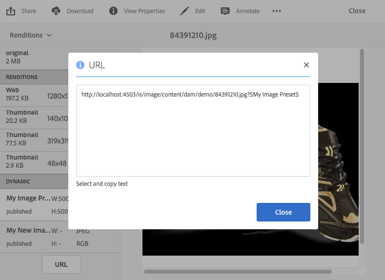
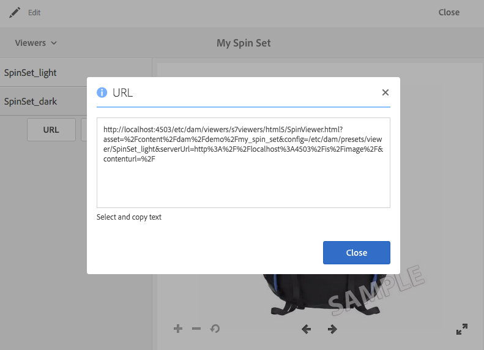

# Länka URL:er till ditt webbprogram {#linking-urls-to-your-web-application}

Dina webbplatser och tillämpningar har åtkomst till Dynamic Media-tjänster via URL-samtal. När du har publicerat en resurs aktiveras en URL-sträng som refererar till resursen. Du kan klistra in dessa URL:er i en webbläsare för testning.

Du länkar bara till URL:er om du *inte* använder Adobe Experience Manager som WCM-fil. Länkning - och inte inbäddning - används när du vill leverera en videospelare som ett popup-fönster eller modalt fönster. Om du använder Experience Manager som WCM-fil [lägger du till resurserna direkt på sidan](adding-dynamic-media-assets-to-pages.md).

Om du vill placera dessa URL-strängar på dina webbsidor och i dina program kopierar du dem från Dynamic Media.

>[!NOTE]
>
>URL-strängar är bara tillgängliga för dynamiska återgivningar av resurser. De är för närvarande inte tillgängliga för statiska resurser som finns i DAM och inte på Dynamic Media-servern. URL-knappen visas inte för återgivningar som är statiska.

Se även [Bädda in video- eller bildvisningsprogrammet på en webbsida](embed-code.md).

Se även [Länka YouTube-URL:er till ditt webbprogram](video.md).

Se även [Leverera optimerade bilder för en responsiv webbplats](responsive-site.md).

Se även [Överför Assets](/help/assets/manage-digital-assets.md#uploading-assets).

## Hämta en URL för en resurs {#obtaining-a-url-for-an-asset}

Du kan hämta en URL-sträng som genereras av en bildförinställning eller en visningsförinställning. När du har kopierat URL:en markeras den i Urklipp så att du kan klistra in den på sidorna på webbplatsen eller i programmet.

>[!NOTE]
>
>URL:en är inte tillgänglig för kopiering förrän du har publicerat den valda resursen. Dessutom måste du även publicera visningsförinställningen eller bildförinställningen.
>
>Se [Publicera Assets](publishing-dynamicmedia-assets.md).
>
>Se [Publicera visningsförinställningar](managing-viewer-presets.md#publishing-viewer-presets).
>
>Se [Publicera bildförinställningar](managing-image-presets.md#publishing-image-presets).

Du kan hämta en URL-sträng på flera olika sätt. Stegen nedan visar dock bara en metod som du kan använda.

**Så här hämtar du en URL för en resurs:**

1. Navigera till den *publicerade*-resurs vars bildförinställnings-URL eller URL för visningsförinställning som du vill kopiera och markera resursen för att öppna den.

   Kom ihåg att URL:er endast går att kopiera *efter* att du har *publicerat* resurserna. Dessutom måste visningsförinställningen eller bildförinställningen också publiceras.

   Se [Publicera Assets](publishing-dynamicmedia-assets.md).

   Se [Publicera visningsförinställningar](managing-viewer-presets.md#publishing-viewer-presets).

   Se [Publicera bildförinställningar](managing-image-presets.md#publishing-image-presets).

1. Gör något av följande beroende på vilken resurs du har valt:

   * Om du markerade en bild väljer du **[!UICONTROL Renditions]** i listrutan.

     Under rubriken **[!UICONTROL Dynamic]** väljer du ett förinställningsnamn för att visa återgivningen i den högra bildrutan. Om det behövs bläddrar du i listan Återgivningar för att se den dynamiska rubriken.

     Välj **[!UICONTROL URL]** längst ned i den vänstra listen.

     

   * Om du har valt en snurruppsättning, en bilduppsättning, en Carousel-uppsättning eller en video väljer du **[!UICONTROL Viewers]** i listrutan.

     Välj ett namn på visningsförinställningen i den vänstra listen. En förhandsgranskning av uppsättningen eller videon öppnas på en separat sida.

     Välj **[!UICONTROL URL]** längst ned i den vänstra listen.

     

1. Om du vill förhandsgranska resursen eller lägga till den på webbinnehållssidan markerar och kopierar du texten till webbläsaren.

   Om du vill avsluta URL-fönstret väljer du **[!UICONTROL X]** eller **[!UICONTROL Close]**.

## Hämta en URL för en statisk resurs {#obtaining-a-url-for-a-static-asset}

Dynamic Media har stöd för leverans av statiska resurser, vilket är andra resurser än bara bilder och video. Statiska medieformat som stöds för leverans är bland annat följande:

* 3D-filer
* Animerad GIF
* Ljudfiler
* CSS
* JavaScript (när ditt företag är konfigurerat med sin egen domän)
* PDF
* SVG
* XML
* ZIP

**Så här hämtar du en URL för en statisk resurs:**

1. Navigera till den *publicerade* statiska resursen vars URL du vill kopiera och markera resursen för att öppna den.

   Kom ihåg att URL-adresser endast är tillgängliga för kopiering av *efter* att du först *har publicerat* den statiska resursen.

   Se [Publicera Assets](publishing-dynamicmedia-assets.md).

1. Använd någon av följande metoder för att hämta URL:en för den publicerade statiska resursen:

   * `The URL of the published static is the following:`

      * `https://*<server_name>*/is/content/*<company_name>*/*<static_asset_filename>*.*<extension>*`

        Exempel: `https://aem.com/is/content/adobe/image.gif`.

   * Välj **[!UICONTROL Asset]** > **[!UICONTROL Dynamic Renditions]**, markera sedan en dynamisk återgivning av den statiska resursen och kopiera URL:en.

     Ändra den kopierade URL:en så att `is/content` används i sökvägen i stället för `is/image/`.

## Hämta en video-URL för en publicerad videoåtergivning {#obtaining-a-video-url-for-a-published-video-rendition}

1. I Experience Manager går du till **[!UICONTROL Tools]** > **[!UICONTROL Deployment]** > **[!UICONTROL Cloud]** > **[!UICONTROL Cloud Services]**.
1. Bläddra nedåt till rubriken **[!UICONTROL Cloud Services]** på sidan **[!UICONTROL Dynamic Media Cloud Services]** och välj sedan **[!UICONTROL Show Configurations]**.
1. Under **[!UICONTROL Available Configurations]** markerar du namnet på konfigurationen som du vill använda.

1. På sidan **[!UICONTROL Dynamic Media Cloud Settings]**, under **[!UICONTROL Video Service URL]**, kopierar du ned hela URL-sökvägen. Du behöver den kopierade URL-sökvägen senare i stegen.

   URL-sökvägen kan till exempel se ut ungefär så här:

   `https://s7athens.macromedia.com:9090/DMGateway/`

   (Sökvägen ovan är bara till för att förklara. Det är inte den verkliga sökvägen som du kopierar.)

1. Under **[!UICONTROL Registration ID]** kopierar du det kundnamn som finns i den sista delen av ID:t.

   Om registrerings-ID till exempel är `87654321|MyCompany` blir kundnamnet `MyCompany`.

1. I närheten av sidans övre vänstra hörn väljer du **[!UICONTROL Cloud Services]**, sedan Experience Manager-ikonen och går till **[!UICONTROL General]** > **[!UICONTROL CRXDE Lite]**.
1. Kopiera ned hela videouppdateringssökvägen från JCR (Java™ Content Repository).

   Videons återgivningssökväg kan till exempel se ut ungefär så här:

   `/_renditions_/0bd/0bd28743-a616-4fe6-92aa-6eae7c2112f/avs/Momentum_1080-0x720-2600k.mp4`

   (Sökvägen ovan är bara till för att förklara. Det är inte den verkliga sökvägen som du kopierar.)

1. Om du vill skapa en fullständig URL-sökväg ordnar du den kopierade informationen i följande ordning:

   `<Video_Service_URL>/public/<Customer_name_from_Registration_ID>/<Video_rendition_path>`

   Om du till exempel använder exempelsökvägarna och exempelkundnamnet från stegen ovan, visas den fullständiga sökvägen enligt följande:

   `https://s7athens.macromedia.com:9090/DMGateway/public/MyCompany/_renditions_/0bd/0bd28743-a616-4fe6-92aa-6eae7c2112ff/avs/Momentum_1080-0x720-2600k.mp4`

   Den här sökvägen är den fullständiga video-URL:en för en publicerad videoåtergivning.

## Hämta en video-URL för strömning med adaptiv bithastighet (HLS) {#obtaining-a-video-url-for-adaptive-streaming-hls}

1. I Experience Manager går du till **[!UICONTROL Tools]** > **[!UICONTROL Deployment]** > **[!UICONTROL Cloud]** > **[!UICONTROL Cloud Services]**.
1. Bläddra nedåt till rubriken **[!UICONTROL Cloud Services]** på sidan **[!UICONTROL Dynamic Media Cloud Services]** och välj sedan **[!UICONTROL Show Configurations]**.
1. Under **[!UICONTROL Available Configurations]** markerar du namnet på konfigurationen som du vill använda.
1. Gör följande på sidan **[!UICONTROL Dynamic Media Cloud Services Settings]**:

   * Under **[!UICONTROL Video Service URL]** kopierar du hela URL-sökvägen. Du behöver den kopierade URL-sökvägen senare i dessa steg. URL-sökvägen kan till exempel se ut ungefär så här:

   `https://gateway-na.assetsadobe.com/DMGateway/`

   (Sökvägen ovan är bara till för att förklara. Det är inte den verkliga sökvägen som du kopierar.)

   * Under **[!UICONTROL Registration ID]** kopierar du det kundnamn som finns i den sista delen av ID:t. Du behöver det kopierade kundnamnet senare i dessa steg.

     Om registrerings-ID till exempel är `87654321|demoCo` blir kundnamnet som du kopierar `demoCo`.

1. Kopiera respektive protokollväljare baserat på vilket videoleveransprotokoll du använder. Du behöver den kopierade protokollväljaren senare i dessa steg.

   <table>
    <tbody>
      <tr>
      <td><strong>Videoleveransprotokoll som du använder</strong></td>
      <td><strong>Protokollväljare som ska användas</strong></td>
      </tr>
      <tr>
      <td>
HTTP
 
Om du använder HTTP (osäker videoleverans) måste du ändra <code>https</code> till <code>http</code> i URL-värdet för videotjänsten som du kopierade tidigare.
 </td>
      <td><code>public/</code></td>
      </tr>
      <tr>
      <td>HTTPS</td>
      <td><code>public-ssl/</code></td>
      </tr>
    </tbody>
   </table>

1. Kopiera den fullständiga sökvägen för videoresurser i Experience Manager, som bearbetats av Dynamic Media. Du behöver den här kopierade videoresurssökvägen senare i dessa steg.

   Till exempel:

   `/content/dam/marketing/MyVideo.mp4`

1. Kombinera alla delar du kopierat tidigare och skapa en sträng i följande ordning:

   &lt; `video service URL`>&lt; `protocol selector`>&lt; `customer name`>&lt; `video asset path`>

   Om du till exempel använder den kopierade informationen från exemplen i de här stegen ser strängen ut så här:

   `https://gateway-na.assetsadobe.com/DMGateway/public-ssl/demoCo/content/dam/marketing/MyVideo.mp4`

1. Slutför URL-adressen genom att lägga till `.m3u8` i slutet av strängen. Om till exempel `.m3u8` läggs till i strängen från föregående steg ser den fullständiga URL-sökvägen ut så här:

   `https://gateway-na.assetsadobe.com/DMGateway/public-ssl/demoCo/content/dam/marketing/MyVideo.mp4.m3u8`

## Använd HTTP/2 för att leverera dina dynamiska medieresurser {#using-http-to-deliver-your-dynamic-media-assets}

HTTP/2 är det nya, uppdaterade webbprotokollet som förbättrar kommunikationen mellan webbläsare och servrar. Det ger snabbare överföring av information och minskar mängden processorkraft som behövs. Dynamic Media-material kan nu levereras via HTTP/2 vilket ger bättre respons och laddningstider.

Mer information om hur du kommer igång med HTTP/2 med ditt Dynamic Media-konto finns i [HTTP2 Delivery of Content](http2faq.md).
