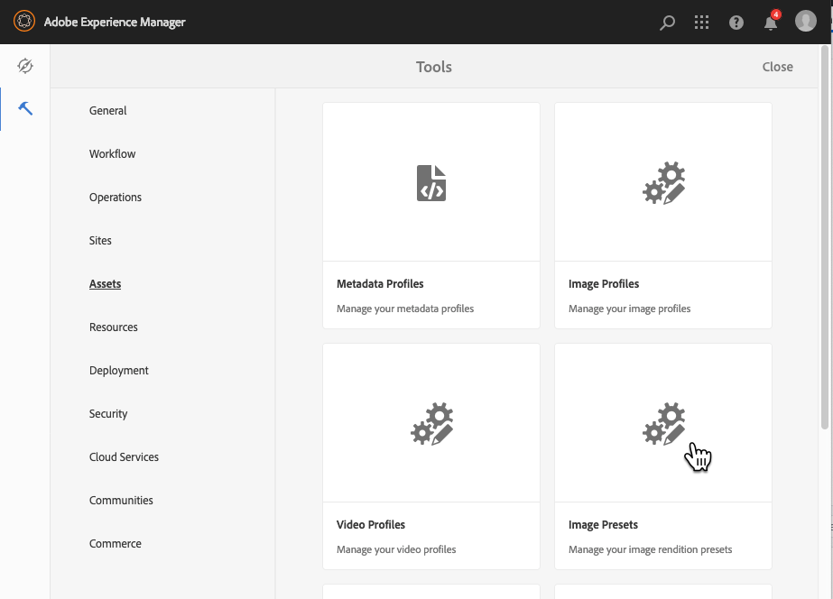
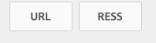

# Hantera bildförinställningar{#managing-image-presets}

Med bildförinställningar kan AEM Assets dynamiskt leverera bilder i olika storlekar, i olika format eller med andra bildegenskaper som genereras dynamiskt. Varje bildförinställning representerar en fördefinierad samling kommandon för storleksändring och formatering för visning av bilder. När du skapar en bildförinställning väljer du en storlek för bildleverans. Du kan också välja formateringskommandon så att bildens utseende optimeras när bilden levereras för visning.

Administratörer kan skapa förinställningar för att exportera resurser. Användarna kan välja en förinställning när de exporterar bilder, vilket även innebär att bilderna formateras om till de specifikationer som administratören anger.

Du kan också skapa bildförinställningar som är responsiva. Om du använder en responsiv bildförinställning på dina resurser ändras de beroende på vilken enhet eller skärmstorlek de visas på. Du kan konfigurera bildförinställningar så att de använder CMYK i färgrymden förutom RGB och Grå.

I det här avsnittet beskrivs hur du skapar, ändrar och i allmänhet hanterar bildförinställningar. Du kan använda en bildförinställning på en bild när du vill förhandsvisa den. Se [Använda bildförinställningar](/help/assets/dynamic-media/image-presets.md).

>[!NOTE]
>
>Smart bildbehandling fungerar med befintliga bildförinställningar och använder intelligens under de sista millisekunderna i leveransen för att ytterligare minska bildfilens storlek baserat på webbläsarens eller nätverkets anslutningshastighet. Mer information finns i [Smart](/help/assets/dynamic-media/imaging-faq.md) Imaging.

## Bildförinställningar {#understanding-image-presets}

Precis som ett makro är en bildförinställning en fördefinierad samling kommandon för storleksändring och formatering som sparats under ett namn. Om du vill förstå hur bildförinställningar fungerar antar du att webbplatsen kräver att varje produktbild visas i olika storlekar, olika format och komprimeringsgrader för datorer och mobila enheter.

Du kan skapa två bildförinställningar: en med 500 x 500 pixlar för skrivbordsversionen och 150 x 150 pixlar för den mobila versionen. Du skapar två bildförinställningar, en som kallas `Enlarge` för att visa bilder med 500 x 500 pixlar och en som kallas `Thumbnail` för att visa bilder med 150 x 150 pixlar. Om du vill leverera bilder i rätt `Enlarge` storlek och `Thumbnail` storlek läser AEM upp definitionen av förinställningen Förstora bild och miniatyrbildsförinställningen. AEM sedan dynamiskt en bild med samma storlek och formateringsspecifikationer som varje bildförinställning.

Bilder som minskar i storlek när de levereras dynamiskt kan förlora i skärpa och detaljer. Därför innehåller varje bildförinställning formateringskontroller för optimering av en bild när den levereras i en viss storlek. Med dessa kontroller kan du vara säker på att dina bilder är skarpa och tydliga när de levereras till din webbplats eller ditt program.

Administratörer kan skapa bildförinställningar. Om du vill skapa en bildförinställning kan du börja från början eller så kan du börja från en befintlig förinställning och spara den under ett nytt namn.

## Hantera bildförinställningar {#managing-image-presets-1}

Du hanterar dina bildförinställningar i AEM genom att trycka på eller klicka på AEM logotyp för att komma åt den globala navigeringskonsolen och sedan trycka eller klicka på verktygsikonen och navigera till **[!UICONTROL Assets > Image Presets]**.



>[!NOTE]
>
>Alla bildförinställningar som du skapar är också tillgängliga som dynamiska återgivningar när du förhandsvisar eller levererar resurser.
>
>Du behöver *inte* publicera bildförinställningar eftersom bildförinställningar publiceras automatiskt.
>
>Se [Publicera bildförinställningar.](#publishing-image-presets)

>[!NOTE]
>
>Systemet visar en mängd olika återgivningar när du väljer **[!UICONTROL Renditions]** i en tillgångs detaljvy. Du kan öka eller minska antalet bildförinställningar som visas. See [Increasing the number of image presets that display](#increasing-or-decreasing-the-number-of-image-presets-that-display).

### Adobe Illustrator (AI), PostScript (EPS) och PDF {#adobe-illustrator-ai-postscript-eps-and-pdf-file-formats}

Om du tänker ge stöd för att lägga in AI-, EPS- och PDF-filer så att du kan generera dynamiska återgivningar av dessa filformat, bör du granska följande information innan du skapar bildförinställningar.

Adobe Illustrator filformat är en variant av PDF. De största skillnaderna när det gäller AEM Assets är följande:

* Adobe Illustrator-dokument består av en sida med flera lager. Varje lager extraheras som en PNG-underresurs under Illustrator huvudresurs.
* PDF-dokument består av en eller flera sidor. Varje sida extraheras som en enda PDF-delresurs under det huvudsakliga flersidiga PDF-dokumentet.

Delresurserna skapas av `Create Sub Asset process` komponenten i det övergripande `DAM Update Asset` arbetsflödet. Tryck på **[!UICONTROL Tools > Workflow > Models > DAM Update Asset > Edit]** om du vill se den här processkomponenten i arbetsflödet.

<!-- See also [Viewing pages of a multi-page file](/help/assets/manage-linked-subassets.md#view-pages-of-a-multi-page-file). -->

Du kan visa underresurserna eller sidorna när du öppnar resursen, trycka på menyn Innehåll och välja **[!UICONTROL Subassets]** eller **[!UICONTROL Pages]**. Undertillgångarna är verkliga tillgångar. Det vill säga, PDF-sidor extraheras av `Create Sub Asset` arbetsflödeskomponenten. De lagras sedan som `page1.pdf`, `page2.pdf`och så vidare nedanför huvudresursen. När de har lagrats bearbetas de av arbetsflödet `DAM Update Asset` .

Om du vill använda Dynamic Media för att förhandsgranska och generera dynamiska renderingar för AI-, EPS- eller PDF-filer måste du utföra följande steg:

1. I `DAM Update Asset` arbetsflödet rastrerar `Rasterize PDF/AI Image Preview Rendition` processkomponenten den första sidan i den ursprungliga resursen - med den konfigurerade upplösningen - till en `cqdam.preview.png` rendering.

1. Återgivningen `cqdam.preview.png` optimeras sedan till en PTIFF av `Dynamic Media Process Image Assets` processkomponenten i arbetsflödet.

>[!NOTE]
>
>I arbetsflödet för DAM-uppdatering av resurser genererar steget **[!UICONTROL EPS thumbnails]** miniatyrer för EPS-filer.

#### Metadataegenskaper för PDF/AI/EPS-resurs {#pdf-ai-eps-asset-metadata-properties}

| **Metadataegenskap** | **Beskrivning** |
|---|---|
| dam:Physicalwiddinins | Dokumentets bredd i tum. |
| dam:Physicalheightininches | Dokumenthöjd i tum. |

Du kommer åt alternativen för `Rasterize PDF/AI Image Preview Rendition` processkomponenter via `DAM Update Asset` arbetsflödet.

Tryck på Adobe Experience Manager längst upp till vänster och navigera till **[!UICONTROL Tools > Workflow > Models]**. På sidan Arbetsflödesmodeller väljer du **[!UICONTROL DAM Update Asset]** och sedan trycker du på i verktygsfältet **[!UICONTROL Edit]**. Dubbeltryck på processkomponenten på arbetsflödessidan för DAM-uppdatering av resurser för att öppna dialogrutan Stegegenskaper för den `Rasterize PDF/AI Image Preview Rendition` .

#### Rastrera alternativ för PDF/AI-förhandsvisning av återgivning {#rasterize-pdf-ai-image-preview-rendition-options}


Argument för att rastrera PDF- eller AI-arbetsflödet

<table>
 <tbody>
  <tr>
   <td><strong>Processargument</strong></td>
   <td><strong>Standardinställning</strong></td>
   <td><strong>Beskrivning</strong></td>
  </tr>
  <tr>
   <td>Mime-typer</td>
   <td><p>application/pdf</p> <p>application/postscript</p> <p>program/illustrator<br /> </p> </td>
   <td>Lista över dokumentMIME-typer som anses vara PDF- eller Illustrator-dokument.<br /> </td>
  </tr>
  <tr>
   <td>Maxbredd</td>
   <td>2048</td>
   <td>Maximal bredd i pixlar för den genererade förhandsvisningsåtergivningen.<br /> </td>
  </tr>
  <tr>
   <td>Maxhöjd</td>
   <td>2048</td>
   <td>Maximal höjd för den genererade förhandsvisningsåtergivningen, i pixlar.<br /> </td>
  </tr>
  <tr>
   <td>Upplösning</td>
   <td>72</td>
   <td>Upplösning för att rastrera den första sidan, i ppi (pixlar per tum).</td>
  </tr>
 </tbody>
</table>

Med standardprocessargumenten rastreras den första sidan i ett PDF/AI-dokument med 72 ppi och den genererade förhandsvisningsbilden med storleken 2 048 x 2 048 pixlar. För en typisk driftsättning kanske du vill öka upplösningen till minst 150 ppi. Ett dokument med US-teckenstorlek på 300 ppi kräver t.ex. en maximal bredd och höjd på 2 550 x 3 300 pixlar.

Maximal bredd och Maximal höjd begränsar upplösningen som rastreras. Om maxvärdena t.ex. är oförändrade och upplösningen är 300 ppi rastreras ett US Letter-dokument med 186 ppi. Dokumentet är alltså 1 581 x 2 046 pixlar.

Processkomponenten har en definierad maxgräns för att säkerställa att den inte skapar för stora bilder i minnet. `Rasterize PDF/AI Image Preview Rendition` Sådana stora bilder kan flöda över det minne som JVM (Java Virtual Machine) har fått. Man måste se till att JVM får tillräckligt med minne för att hantera det konfigurerade antalet parallella arbetsflöden, där var och en har möjlighet att skapa en bild med den högsta konfigurerade storleken.

### InDesign (INDD), filformat {#indesign-indd-file-format}

Om du tänker ge stöd för inmatning av INDD-filer så att du kan generera en dynamisk återgivning av det här filformatet, kanske du vill granska följande information innan du skapar bildförinställningar.

För InDesign-filer extraheras underresurser endast om Adobe InDesign-servern är integrerad med AEM. Refererade resurser länkas baserat på deras metadata. InDesign Server krävs inte för länkning. De refererade resurserna måste dock finnas i AEM innan InDesign-filerna bearbetas för de länkar som ska skapas mellan InDesign-filerna och de refererade resurserna.

<!-- See [Integrating AEM Assets with InDesign Server](/help/assets/indesign.md). -->

Processkomponenten för medieextrahering i arbetsflödet kör flera förkonfigurerade Extend Scripts för att bearbeta InDesign-filer. `DAM Update Asset`


ExtendScript-sökvägarna i argumenten för processkomponenten Medieextrahering i arbetsflödet för DAM-uppdatering.

Följande skript används av integreringen med Dynamic Media:

<table>
 <tbody>
  <tr>
   <td><strong>Utöka skriptnamn</strong></td>
   <td><strong>Standard</strong></td>
   <td><strong>Beskrivning</strong></td>
  </tr>
  <tr>
   <td>ThumbnailExport.jsx</td>
   <td>Ja</td>
   <td>Genererar en 300 ppi- <code>thumbnail.jpg</code> rendering som är optimerad och omvandlad till en PTIFF-rendering efter <code>Dynamic Media Process Image Assets</code> processens komponent.<br /> </td>
  </tr>
  <tr>
   <td>JPEGPagesExport.jsx</td>
   <td>Ja</td>
   <td>Skapar en JPEG-underresurs på 300 ppi för varje sida. JPEG-underresursen är en verklig tillgång som lagras under InDesign-resursen. Den är också optimerad och omvandlad till en PTIFF-fil i <code>DAM Update Asset</code> arbetsflödet.<br /> </td>
  </tr>
  <tr>
   <td>PDFPagesExport.jsx</td>
   <td>Nej</td>
   <td>Skapar en PDF-underresurs för varje sida. PDF-underresursen bearbetas enligt beskrivningen ovan. Eftersom PDF-filen endast innehåller en sida genereras inga underresurser.<br /> </td>
  </tr>
 </tbody>
</table>

### Konfigurera miniatyrstorlek för bild {#configuring-image-thumbnail-size}

Du kan konfigurera storleken på miniatyrbilder genom att konfigurera inställningarna i **[!UICONTROL DAM Update Asset]** arbetsflödet. I arbetsflödet finns två steg där du kan konfigurera miniatyrstorlek för bildresurser. Även om det ena (**[!UICONTROL Dynamic Media Process Image Assets]**) används för dynamiska bildresurser och det andra (**[!UICONTROL Process Thumbnails]**) för att generera statiska miniatyrbilder eller när alla andra processer inte kan generera miniatyrbilder, bör *båda* ha samma inställningar.

I steget **[!UICONTROL Dynamic Media Process Image Assets]** genereras miniatyrbilder av bildservern och den här konfigurationen är oberoende av den konfiguration som används i steget **[!UICONTROL Process Thumbnails]**. Att skapa miniatyrbilder med steget **[!UICONTROL Process Thumbnails]** är det långsammaste och mest minneskrävande sättet att skapa miniatyrbilder.

Storleksändring för miniatyrbilder definieras i följande format: **[!UICONTROL width:height:center]**, till exempel *80:80:false*. Bredden och höjden avgör miniatyrbildens storlek i pixlar. värdet center är antingen false eller true och om värdet är true betyder det att miniatyrbilden har exakt den storlek som anges i konfigurationen. Om den storleksändrade bilden är mindre centreras den i miniatyrbilden.

>[!NOTE]
>
>* Miniatyrbildsstorleken för EPS-filer konfigureras i steget **[!UICONTROL EPS thumbnails]** på fliken **[!UICONTROL Arguments]** under Miniatyrbilder.
   >
   >
* Miniatyrbildsstorleken för videoklipp konfigureras i steget **[!UICONTROL FFmpeg thumbnails]** på fliken **[!UICONTROL Process]** under **[!UICONTROL Arguments]**.

>


**Så här konfigurerar du miniatyrbildens storlek**

1. Tryck på **[!UICONTROL Tools > Workflow > Models > DAM Update Asset > Edit]**.
1. Tap the **[!UICONTROL Dynamic Media Process Image Assets]** step and tap the **[!UICONTROL Thumbnails]** tab. Ändra miniatyrstorleken efter behov och tryck sedan på **[!UICONTROL OK]**.

   

1. Tryck på steget **[!UICONTROL Process Thumbnails]** och sedan på fliken **[!UICONTROL Thumbnails]**. Ändra miniatyrstorleken efter behov och tryck sedan på **[!UICONTROL OK]**.

   >[!NOTE]
   >
   >Värdena i thumbnails-argumentet i steget **[!UICONTROL Process Thumbnails]** måste matcha thumbnails-argumentet i steget **[!UICONTROL Dynamic Media Process Image Assets]**.

1. Tryck **[!UICONTROL Save]** för att spara ändringarna i arbetsflödet.

### Öka eller minska antalet bildförinställningar som visas {#increasing-or-decreasing-the-number-of-image-presets-that-display}

De bildförinställningar du skapar är tillgängliga som dynamiska återgivningar när du förhandsgranskar resurser. AEM visar en mängd olika dynamiska återgivningar när du visar resurser från **[!UICONTROL Detail View > Renditions]**. Du kan öka eller minska gränsen för de återgivningar som visas.

**Öka eller minska antalet bildförinställningar som visas**

1. Navigera till CRXDE Lite ([https://localhost:4502/crx/de](https://localhost:4502/crx/de)).
1. Navigera till noden med bildförinställningar på `/libs/dam/gui/coral/content/commons/sidepanels/imagepresetsdetail/imgagepresetslist`

   

1. I egenskapen **[!UICONTROL limit]** ändrar du **[!UICONTROL Value]**, som är inställt på 15 som standard, till önskat tal.
1. Navigera till bildförinställningens datakälla på `/libs/dam/gui/coral/content/commons/sidepanels/imagepresetsdetail/imgagepresetslist/datasource`

   

1. I egenskapen limit ändrar du talet till önskat tal, till exempel `{empty requestPathInfo.selectors[1] ? "20" : requestPathInfo.selectors[1]}`
1. Tryck på **[!UICONTROL Save All]**.

### Skapa en bildförinställning {#creating-image-presets}

När du skapar en bildförinställning kan du använda de inställningarna på alla bilder när du förhandsgranskar eller publicerar.

>[!NOTE]
>
>Om du använder Internet Explorer 9 visas inte den förinställning du har skapat i förinställningslistan direkt när du har sparat. Du kan lösa problemet genom att inaktivera cacheminnet för IE9.

Om du tänker ge stöd för att lägga in AI-, PDF- och EPS-filer så att du kan generera en dynamisk återgivning av dessa filformat, kanske du vill granska följande information innan du skapar bildförinställningar.
Se [Adobe Illustrator (AI), Postscript (EPS) och PDF-filformat](#adobe-illustrator-ai-postscript-eps-and-pdf-file-formats).

Om du tänker ge stöd för inmatning av INDD-filer så att du kan generera en dynamisk återgivning av det här filformatet, kanske du vill granska följande information innan du skapar bildförinställningar.
Se [Filformatet](#indesign-indd-file-format)InDesign (INDD).

**Skapa en bildförinställning**

1. I AEM trycker du på AEM-logotypen för att komma åt den globala navigeringskonsolen och sedan trycker du på **[!UICONTROL Tools > Assets > Image Presets]**.
1. Klicka på **[!UICONTROL Create]**. Fönstret **[!UICONTROL Edit Image Preset]** öppnas.

   

   >[!NOTE]
   >
   >Om du vill att den här bildförinställningen ska vara responsiv raderar du värdena i fälten **[!UICONTROL width]** och **[!UICONTROL height]** och lämnar dem tomma.

1. Ange önskade värden på flikarna **[!UICONTROL Basic]** och **[!UICONTROL Advanced]**, inklusive ett namn. Alternativen beskrivs i [Alternativ för bildförinställningar](#image-preset-options). Förinställningarna visas i den vänstra rutan och kan användas direkt tillsammans med andra resurser.

   

1. Klicka på **[!UICONTROL Save**.

### Creating a responsive Image Preset {#creating-a-responsive-image-preset}

Om du vill skapa en responsiv bildförinställning utför du stegen i [Skapa bildförinställningar](#creating-image-presets). När du anger höjd och bredd i **[!UICONTROL Edit Image Preset]** fönstret raderar du värdena och låter dem vara tomma.

Om du lämnar dem tomma visas AEM att den här bildförinställningen är responsiv. Du kan justera de andra värdena efter behov.

>[!NOTE]
>
>Om du vill visa knapparna **[!UICONTROL URL]** och **[!UICONTROL RESS]** när du använder en bildförinställning på en resurs måste resursen publiceras.
>
>
>
>Observera att bildförinställningar och bildresurser publiceras automatiskt.

### Alternativ för bildförinställning {#image-preset-options}

När du skapar eller redigerar bildförinställningar finns alternativen som beskrivs i det här avsnittet. Adobe rekommenderar dessutom att du börjar med följande alternativ:

* **[!UICONTROL Format]** (**[!UICONTROL Basic]** flik) - Välj **[!UICONTROL JPEG]** eller något annat format som uppfyller dina krav. Alla webbläsare har stöd för JPEG-bildformatet. Det ger en bra balans mellan små filstorlekar och bildkvalitet. I bilder med JPEG-format används dock förstörande komprimering, som kan ge upphov till oönskade bildartefakter om komprimeringsinställningen är för låg. Därför rekommenderar Adobe att du ställer in komprimeringskvaliteten på 75. Den här inställningen ger en bra balans mellan bildkvalitet och liten filstorlek.

* **[!UICONTROL Enable Simple Sharpening]** – Markera inte **[!UICONTROL Enable Simple Sharpening]** (det här skärpefiltret ger mindre kontroll än inställningarna för Oskarp mask).

* **[!UICONTROL Sharpening: Resampling Mode]** - Välj **[!UICONTROL Bi-Cubic]**.

#### Alternativ på fliken Grundläggande {#basic-tab-options}

<table>
 <tbody>
  <tr>
   <td><strong>Fält</strong></td>
   <td><strong>Beskrivning</strong></td>
  </tr>
  <tr>
   <td><strong>Namn</strong></td>
   <td>Ange ett beskrivande namn utan blanksteg. Inkludera bildstorleksspecifikationen i namnet så att användarna lättare kan identifiera den här bildförinställningen.</td>
  </tr>
  <tr>
   <td><strong>Bredd och höjd</strong></td>
   <td>Ange bildstorleken i pixlar. Bredd och höjd måste vara större än 0 pixlar. Om något av värdena är 0 skapas ingen förinställning. Om båda värdena är tomma skapas en responsiv bildförinställning.</td>
  </tr>
  <tr>
   <td><strong>Format</strong></td>
   <td><p>Välj ett format på menyn.</p> <p>Om du väljer <strong>JPEG</strong> finns följande alternativ:</p>
    <ul>
     <li><strong>Kvalitet</strong> - Styr JPEG-komprimeringsnivån. Den här inställningen påverkar både filstorlek och bildkvalitet. JPEG-kvalitetsskalan är 1-100. Skalan visas när du drar i skjutreglaget.</li>
     <li><strong>Aktivera JPG-krominansnedsampling</strong> - Eftersom ögat är mindre känsligt för högfrekvent färginformation än högfrekvent luminans delar JPEG-bilder in bildinformation i luminans och färgkomponenter. När en JPEG-bild komprimeras lämnas luminanskomponenten i full upplösning, medan färgkomponenterna nedsamplas genom att medelvärdet av grupper av pixlar ökas. Nedsampling minskar datavolymen med en halv eller en tredjedel utan att det påverkar den upplevda kvaliteten. Nedsampling kan inte användas för gråskalebilder. Den här tekniken minskar mängden komprimering som är användbar för bilder med hög kontrast (till exempel bilder med överlagrad text).</li>
    </ul>
    <div>
      Om du väljer <strong>GIF</strong> eller <strong>GIF med alfa</strong> finns följande alternativ för <strong>GIF-färgkvantifiering</strong> :
    </div>
    <ul>
     <li><strong>Typ </strong>- Välj <strong>Adaptiv</strong> (standard), <strong>Webb</strong>eller <strong>Macintosh</strong>. If you select <strong>GIF with Alpha</strong>, the Macintosh option is not available.</li>
     <li><strong>Gitter</strong> - Välj <strong>Diffusera</strong> eller <strong>Av</strong>.</li>
     <li><strong>Antal färger </strong>- Ange ett tal mellan 2 och 256.</li>
     <li><strong>Färglista</strong> - Ange en kommaavgränsad lista. För vitt, grått och svart anger du 00000,888888,ffff.</li>
    </ul>
    <div>
      Om du väljer <strong>PDF</strong>, <strong>TIFF</strong>eller <strong>TIFF med alfa</strong> får du följande alternativ:
    </div>
    <ul>
     <li><strong>Komprimering</strong> - Välj en komprimeringsalgoritm. Algoritmalternativen för PDF är <strong>Ingen</strong>, <strong>Zip</strong>och <strong>JPEG</strong>. för TIFF är <strong>None</strong>, <strong>LZW</strong>, <strong>Jpeg</strong>och <strong>Zip</strong>, och för TIFF med alfa är <strong>Ingen</strong>, <strong>LZW</strong>och <strong>Zip</strong>.</li>
    </ul> <p>Om du väljer <strong>PNG</strong>, <strong>PNG med alfa,</strong> eller <strong>EPS</strong> finns inga ytterligare alternativ.</p> </td>
  </tr>
  <tr>
   <td><strong>Skärpa</strong></td>
   <td>Markera alternativet <strong>Aktivera enkel skärpa</strong> om du vill använda ett grundläggande skärpefilter på bilden när all skalning har gjorts. Skärpa kan kompensera för oskärpa som kan uppstå när du visar en bild i en annan storlek. </td>
  </tr>
 </tbody>
</table>

#### Avancerade flikalternativ {#advanced-tab-options}

<table>
 <tbody>
  <tr>
   <td><strong>Fält</strong></td>
   <td><strong>Beskrivning</strong></td>
  </tr>
  <tr>
   <td><strong>Färgmodell</strong></td>
   <td>Välj <strong>RGB,</strong> CMYK eller <strong>Gråskala</strong> för färgrymden.</td>
  </tr>
  <tr>
   <td><strong>Färgprofil</strong></td>
   <td>Välj den utdatafärgrymdsprofil som resursen ska konverteras till om den är en annan än arbetsprofilen.</td>
  </tr>
  <tr>
   <td><strong>Återgivningsmetod</strong></td>
   <td>Du kan åsidosätta standardåtergivningsmetoden. Återgivningsmetoden avgör vad som händer med färger som inte kan återges i målfärgprofilen (ej tryckbart). Återgivningsmetoden ignoreras om den inte är kompatibel med ICC-profilen.
    <ul>
     <li>Välj <strong>Perceptuell</strong> om du vill komprimera det totala färgomfånget från en färgrymd till en annan om en eller flera färger i den ursprungliga bilden ligger utanför färgomfånget för målfärgrymden.</li>
     <li>Välj <strong>Relativa färgvärden</strong> när en färg i den aktuella färgrymden ligger utanför färgomfånget i målfärgrymden och du vill mappa den till den närmaste möjliga färgen inom färgomfånget för målfärgrymden utan att påverka några andra färger. </li>
     <li>Välj <strong>Mättnad</strong> om du vill återge bildens ursprungliga färgmättnad när du konverterar bilden till målfärgrymden. </li>
     <li>Välj <strong>Absolut färgvärde</strong> om du vill matcha färgerna exakt utan justering för vitpunkt eller svartpunkt som skulle ändra bildens intensitet.</li>
    </ul> </td>
  </tr>
  <tr>
   <td><strong>Svartpunktskompensation</strong></td>
   <td>Välj det här alternativet om utdataprofilen har stöd för den här funktionen. Svartpunktskompensation ignoreras om den inte är kompatibel med den angivna ICC-profilen.</td>
  </tr>
  <tr>
   <td><strong>Gitter</strong></td>
   <td>Välj det här alternativet om du vill undvika eller minska färgränder. </td>
  </tr>
  <tr>
   <td><strong>Skärpetyp</strong></td>
   <td><p>Välj <strong>Ingen</strong>, <strong>Skärpa</strong>eller <strong>Oskarp mask</strong>. </p>
    <ul>
     <li>Välj <strong>Ingen</strong> om du vill inaktivera skärpan.</li>
     <li>Välj <strong>Skärpa </strong>om du vill använda ett grundläggande skärpefilter på bilden när all skalning har gjorts. Skärpa kan kompensera för oskärpa som kan uppstå när du visar en bild i en annan storlek. </li>
     <li>Select<strong> Unsharp mask</strong> to fine-tune a sharpening filter effect on the final downsampled image. Du kan styra effektens intensitet, radie (mätt i pixlar) och ett kontrasttröskelvärde som ska ignoreras. Effekten har samma alternativ som filtret Oskarp mask i Photoshop.</li>
    </ul> <p>I <strong>Oskarp mask</strong>finns följande alternativ:</p>
    <ul>
     <li><strong>Mängd</strong> - Styr mängden kontrast som används på kantpixlar. Standardvärdet för reella tal är 1,0. För högupplösta bilder kan du öka den till upp till 5.0. Tänk på Mängd som ett mått på filterintensiteten.</li>
     <li><strong>Radie</strong> - Anger antalet pixlar runt kantpixlarna som påverkar skärpan. För högupplösta bilder anger du ett reellt tal mellan 1 och 2. Med ett lågt värde ökas endast kantpixlarna skärpan. ett högt värde ökar skärpan i ett större antal pixlar. Vilket värde som är korrekt beror på bildens storlek.</li>
     <li><strong>Tröskelvärde</strong> - Anger vilket kontrastintervall som ska ignoreras när filtret för oskarp mask används. Med andra ord, det här alternativet avgör hur olika de pixlar som ska göras skarpare måste vara från det omgivande området innan de betraktas som kantpixlar och blir skarpare. Experimentera med heltalsvärden mellan 2 och 20 för att undvika brus. </li>
     <li><strong>Gäller för</strong> - Avgör om den oskarpa inställningen gäller för varje färg eller intensitet.</li>
    </ul>
    <div>
      Skärpa beskrivs i <a href="https://docs.adobe.com/content/help/en/dynamic-media-classic/using/assets/s7_sharpening_images.pdf">Skärpa bilder</a>.
    </div> </td>
  </tr>
  <tr>
   <td><strong>Omsamplingsläge</strong></td>
   <td>Välj ett <strong>alternativ för</strong> omsamplingsläge. Dessa alternativ gör bilden skarpare när den nedsamplas:
    <ul>
     <li><strong>Dubbellinjär</strong> - den snabbaste omsamplingsmetoden. Vissa aliaseringsartefakter är märkbara.</li>
     <li><strong>Bi-Cubic</strong> - Ökar processoranvändningen men ger skarpare bilder med mindre framträdande aliasing-artefakter.</li>
     <li><strong>Sharp2</strong> - Kan ge något skarpare resultat än bikubik, men till en ännu högre CPU-kostnad.</li>
     <li><strong>Bi-Sharp</strong> - Väljer Photoshop standardomsampling för att minska bildstorleken, som kallas <strong>bikubisk skarpare</strong> i Adobe Photoshop.</li>
     <li><strong>Varje färg</strong> och <strong>intensitet</strong> - varje metod kan baseras på färg eller intensitet. Som standard är <strong>Varje färg</strong> markerad.</li>
    </ul> </td>
  </tr>
  <tr>
   <td><strong>Utskriftsupplösning</strong></td>
   <td>Välj en upplösning för utskrift av den här bilden; 72 pixlar är standard.</td>
  </tr>
  <tr>
   <td><strong>Bildmodifierare</strong></td>
   <td><p>Förutom de vanliga bildinställningarna i användargränssnittet har Dynamic Media stöd för många avancerade bildändringar som du kan ange i fältet <strong>Bildmodifierare</strong> . Dessa parametrar definieras i kommandoreferensen <a href="https://docs.adobe.com/content/help/en/dynamic-media-developer-resources/image-serving-api/image-serving-api/http-protocol-reference/command-reference/c-command-reference.html">för</a>Image Server Protocol.</p> <p>Viktigt: Följande funktioner i API:t stöds inte:</p>
    <ul>
     <li>Grundläggande kommandon för mallar och textåtergivning: <code>text= textAngle= textAttr= textFlowPath= textFlowXPath= textPath=</code> och <code>textPs=</code></li>
     <li>Lokaliseringskommandon: <code>locale=</code> och <code>req=xlate</code></li>
     <li><code>req=set</code> är inte tillgängligt för allmän användning.</li>
     <li><code>req=mbrset</code></li>
     <li><code>req=saveToFile</code></li>
     <li><code>req=targets</code></li>
     <li><code>template=</code></li>
     <li>Dynamiska medietjänster utan kärna: SVG, bildåtergivning och webb-till-tryck</li>
    </ul> </td>
  </tr>
 </tbody>
</table>

### Definiera bildförinställningsalternativ med bildmodifierare {#defining-image-preset-options-with-image-modifiers}

Förutom alternativen på flikarna Grundläggande och Avancerat kan du definiera bildmodifierare som ger dig fler alternativ när du definierar bildförinställningar. Bildåtergivning bygger på Scene7 API för bildåtergivning och definieras i detalj i [HTTP-protokollreferensen](https://microsite.omniture.com/t2/help/en_US/s7/is_ir_api/is_api/http_ref/c_http_protocol_reference.html).

Nedan följer några grundläggande exempel på vad du kan göra med bildmodifierare.

>[!NOTE]
>
>Vissa bildmodifierare [kan inte användas i AEM](#advanced-tab-options).

* [op_invert](https://microsite.omniture.com/t2/help/en_US/s7/is_ir_api/is_api/http_ref/r_op_invert.html) - Inverterar varje färgkomponent för en negativ bildeffekt.

   ```xml
   &op_invert=1
   ```

   

* [op_blur](https://microsite.omniture.com/t2/help/en_US/s7/is_ir_api/is_api/http_ref/r_op_blur.html) - Använder ett oskärpefilter på bilden.

   ```xml
   &op_blur=7
   ```

   

* Kombinerade kommandon - op_blur och op-invert

   ```xml
   &op_invert=1&op_blur=7
   ```

   

* [op_brightness](https://microsite.omniture.com/t2/help/en_US/s7/is_ir_api/is_api/http_ref/r_op_brightness.html) - minskar eller ökar intensiteten.

   ```xml
   &op_brightness=58
   ```

   

* [opac](https://microsite.omniture.com/t2/help/en_US/s7/is_ir_api/is_api/http_ref/r_opac.html) - Justerar bildens opacitet. Du kan minska förgrundens opacitet.

   ```xml
   opac=29
   ```

   

### Redigera bildförinställningar {#modifying-image-presets}

1. I AEM trycker du på AEM-logotypen för att komma åt den globala navigeringskonsolen och sedan trycker du på **[!UICONTROL Tools > Assets > Image Presets]**.

   

1. Markera en förinställning och klicka sedan på **[!UICONTROL Edit]**. Fönstret **[!UICONTROL Edit Image Preset]** öppnas.
1. Gör ändringar och klicka på **[!UICONTROL Save]** för att spara ändringarna eller **[!UICONTROL Cancel]** för att avbryta ändringarna.

### Förinställningar för publicering {#publishing-image-presets}

Bildförinställningar publiceras automatiskt åt dig.

### Ta bort bildförinställningar {#deleting-image-presets}

1. I AEM trycker du på den AEM logotypen för att komma åt den globala navigeringskonsolen och trycker eller klickar på verktygsikonen och navigerar till **[!UICONTROL Assets > Image Presets]**.
1. Markera en förinställning och klicka sedan på **[!UICONTROL Delete]**. Dynamic Media bekräftar att du vill ta bort det. Tryck för **[!UICONTROL Delete]** att ta bort eller tryck för **[!UICONTROL Cancel]** att avbryta.
