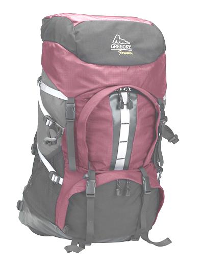

# Hantera bildförinställningar{#managing-image-presets}

Med bildförinställningar kan Adobe Experience Manager Assets dynamiskt leverera bilder i olika storlekar, i olika format eller med andra bildegenskaper som genereras dynamiskt. Varje bildförinställning representerar en fördefinierad samling kommandon för storleksändring och formatering för visning av bilder. När du skapar en bildförinställning väljer du en storlek för bildleverans. Du kan också välja formateringskommandon så att bildens utseende optimeras när bilden levereras för visning.

Administratörer kan skapa förinställningar för att exportera resurser. Användarna kan välja en förinställning när de exporterar bilder, vilket även innebär att bilderna formateras om enligt de specifikationer som administratören anger.

Du kan också skapa bildförinställningar som är responsiva. Om du använder en responsiv bildförinställning på dina resurser ändras de beroende på vilken enhet eller skärmstorlek de visas på. Du kan konfigurera bildförinställningar så att de använder CMYK i färgrymden förutom RGB och Grå.

I det här avsnittet beskrivs hur du skapar, ändrar och i allmänhet hanterar bildförinställningar. Du kan använda en bildförinställning på en bild när du vill förhandsvisa den. Se [Använda bildförinställningar](/help/assets/dynamic-media/image-presets.md).

>[!NOTE]
>
>Smart bildbehandling fungerar med befintliga bildförinställningar och använder intelligens under de sista millisekunderna i leveransen för att ytterligare minska bildfilens storlek baserat på webbläsarens eller nätverkets anslutningshastighet. Mer information finns i [Smart bildbehandling](/help/assets/dynamic-media/imaging-faq.md).

## Bildförinställningar {#understanding-image-presets}

Precis som ett makro är en bildförinställning en fördefinierad samling kommandon för storleksändring och formatering som sparats under ett namn. Anta att webbplatsen kräver att varje produktbild visas i olika storlekar, olika format och komprimeringsgrader för datorer och mobila enheter för att du ska förstå hur bildförinställningar fungerar.

Du kan skapa två bildförinställningar: en med 500 x 500 pixlar för skrivbordsversionen och 150 x 150 pixlar för den mobila versionen. Du skapar två bildförinställningar, en med namnet `Enlarge` om du vill visa bilder med 500 x 500 pixlar och en med namnet `Thumbnail` om du vill visa bilder med 150 x 150 pixlar. Om du vill leverera bilder i storleken `Enlarge` och `Thumbnail` hittar Experience Manager definitionen för Förstora bildförinställning och Förinställning för miniatyrbild. Sedan genererar Experience Manager dynamiskt en bild med samma storlek och formateringsspecifikationer som varje bildförinställning.

Bilder som minskar i storlek när de levereras dynamiskt kan förlora i skärpa och detaljer. Därför innehåller varje bildförinställning formateringskontroller för optimering av en bild när den levereras i en viss storlek. Med dessa kontroller kan du vara säker på att dina bilder är skarpa och tydliga när de levereras till din webbplats eller ditt program.

Administratörer kan skapa bildförinställningar. Om du vill skapa en bildförinställning kan du börja från början eller så kan du börja från en befintlig förinställning och spara den under ett nytt namn.

## Hantera bildförinställningar {#managing-image-presets-1}

Du hanterar dina bildförinställningar i Experience Manager genom att trycka på eller klicka på Experience Manager-logotypen för att komma åt den globala navigeringskonsolen och sedan trycka eller klicka på verktygsikonen och navigera till **[!UICONTROL Assets]** > **[!UICONTROL Image Presets]**.


>[!NOTE]
>
>Alla bildförinställningar som du skapar är också tillgängliga som dynamiska återgivningar när du förhandsvisar eller levererar resurser.
>
>Du behöver *inte* publicera bildförinställningar när bildförinställningar publiceras automatiskt.
>
>Se [Publicera bildförinställningar](#publishing-image-presets).

>[!NOTE]
>
>I systemet visas olika återgivningar när du väljer **[!UICONTROL Renditions]** i en tillgångs detaljvy. Du kan öka eller minska antalet bildförinställningar som visas. Se [Öka antalet bildförinställningar som visas](#increasing-or-decreasing-the-number-of-image-presets-that-display).

### Adobe Illustrator (AI), PostScript® (EPS) och PDF-filformat {#adobe-illustrator-ai-postscript-eps-and-pdf-file-formats}

Om du tänker ge stöd för att lägga in AI-, EPS- och PDF-filer så att du kan generera dynamiska återgivningar av dessa filformat bör du granska följande information innan du skapar bildförinställningar.

Adobe Illustrator filformat är en variant av PDF. De största skillnaderna i Experience Manager Assets är följande:

* Adobe Illustrator-dokument består av en sida med flera lager. Varje lager extraheras som en PNG-delresurs under Illustrator huvudresurs.
* PDF-dokument består av en eller flera sidor. Varje sida extraheras som en enda PDF-delresurs under det huvudsakliga flersidiga PDF-dokumentet.

Delresurserna skapas av `Create Sub Asset process`-komponenten i det övergripande `DAM Update Asset`-arbetsflödet. Om du vill visa den här processkomponenten i arbetsflödet trycker du på **[!UICONTROL Tools]** > **[!UICONTROL Workflow]** > **[!UICONTROL Models]** > **[!UICONTROL DAM Update Asset]** > **[!UICONTROL Edit]**.

<!-- See also [Viewing pages of a multi-page file](/help/assets/manage-linked-subassets.md#view-pages-of-a-multi-page-file). -->

Du kan visa delresurserna eller sidorna när du öppnar resursen, trycka på menyn Innehåll och välja **[!UICONTROL Subassets]** eller **[!UICONTROL Pages]**. Deltillgångarna är verkliga tillgångar. Det innebär att PDF-sidor extraheras av arbetsflödeskomponenten `Create Sub Asset`. De lagras sedan som `page1.pdf`, `page2.pdf` och så vidare, under huvudresursen. När de har lagrats bearbetar arbetsflödet `DAM Update Asset` dem.

Om du vill använda Dynamic Media för att förhandsgranska och generera dynamiska renderingar för AI-, EPS- eller PDF-filer måste du utföra följande steg:

1. I `DAM Update Asset`-arbetsflödet rastrerar processkomponenten `Rasterize PDF/AI Image Preview Rendition` den första sidan i den ursprungliga resursen (med den konfigurerade upplösningen) till en `cqdam.preview.png`-rendering.

1. Återgivningen `cqdam.preview.png` optimeras sedan till en PTIFF-fil av processkomponenten `Dynamic Media Process Image Assets` i arbetsflödet.

>[!NOTE]
>
>I arbetsflödet för DAM-uppdatering av resurser genererar steget **[!UICONTROL EPS thumbnails]** miniatyrer för EPS-filer.

#### Metadataegenskaper för PDF/AI/EPS-resurs {#pdf-ai-eps-asset-metadata-properties}

| **Metadataegenskap** | **Beskrivning** |
|---|---|
| dam:Physicalwiddinins | Dokumentets bredd i tum. |
| dam:Physicalheightininches | Dokumenthöjd i tum. |

Du kommer åt alternativen för processkomponenter i `Rasterize PDF/AI Image Preview Rendition` via arbetsflödet i `DAM Update Asset`.

Tryck på Adobe Experience Manager i det övre vänstra hörnet, navigera till **[!UICONTROL Tools]** > **[!UICONTROL Workflow]** > **[!UICONTROL Models]**. Välj **[!UICONTROL DAM Update Asset]** på sidan Arbetsflödesmodeller och tryck sedan på **[!UICONTROL Edit]** i verktygsfältet. Dubbeltryck på processkomponenten `Rasterize PDF/AI Image Preview Rendition` på arbetsflödessidan för DAM-uppdatering av resurser för att öppna dialogrutan Stegegenskaper.

#### Rastrera renderingsalternativen PDF/AI Image Preview {#rasterize-pdf-ai-image-preview-rendition-options}


Argument för att rastrera PDF- eller AI-arbetsflödet

| Processargument | Standardinställning | Beskrivning |
|---|---|---|
| Mime-typer | application/pdf<br>application/postscript<br>application/illustrator | Lista över dokumentMIME-typer som anses vara PDF- eller Illustrator-dokument. |
| Maxbredd | 2048 | Maximal bredd i pixlar för den genererade förhandsvisningsåtergivningen. |
| Maxhöjd | 2048 | Maximal höjd för den genererade förhandsvisningsåtergivningen, i pixlar. |
| Upplösning | 72 | Upplösning för att rastrera den första sidan, i ppi (pixlar per tum). |

Med standardprocessargumenten rastreras den första sidan i ett PDF/AI-dokument med 72 ppi och den genererade förhandsvisningsbilden med storleken 2 048 x 2 048 pixlar. För en vanlig driftsättning kan du öka upplösningen till minst 150 ppi. Ett dokument med US-teckenstorlek på 300 ppi kräver t.ex. en maximal bredd och höjd på 2 550 x 3 300 pixlar.

Maximal bredd och Maximal höjd begränsar upplösningen som rastreras. Om maxvärdena t.ex. är oförändrade och upplösningen är 300 ppi rastreras ett US Letter-dokument med 186 ppi. Dokumentet är alltså 1 581 x 2 046 pixlar.

Processkomponenten `Rasterize PDF/AI Image Preview Rendition` har en definierad maxgräns för att säkerställa att den inte skapar för stora bilder i minnet. Sådana stora bilder kan flöda över minnet som Java™ Virtual Machine (Java™ Virtual Machine) har fått. Man måste se till att JVM får tillräckligt med minne för att hantera det konfigurerade antalet parallella arbetsflöden, där var och en har möjlighet att skapa en bild med den högsta konfigurerade storleken.

### InDesign (INDD), filformat {#indesign-indd-file-format}

Om du tänker ge stöd för inmatning av INDD-filer så att du kan generera en dynamisk återgivning av det här filformatet bör du granska följande information innan du skapar bildförinställningar.

För InDesign-filer extraheras underresurser endast om Adobe InDesign Server är integrerat med Experience Manager. Refererade resurser länkas baserat på deras metadata. InDesign Server krävs inte för länkning. De refererade resurserna måste dock finnas i Experience Manager innan InDesign-filerna bearbetas för de länkar som ska skapas mellan InDesign-filerna och de refererade resurserna.

<!-- See [Integrating Experience Manager Assets with InDesign Server](/help/assets/indesign.md). -->

Processkomponenten för medieextrahering i `DAM Update Asset`-arbetsflödet kör flera förkonfigurerade Extend Scripts för att bearbeta InDesign-filer.


ExtendScript-sökvägarna i argumenten för processkomponenten Medieextrahering i arbetsflödet för DAM-uppdatering.

Följande skript används av Dynamic Media-integrering:


| ExtendScript name | Standard | Beskrivning |
|---|---|---|
| ThumbnailExport.jsx | Ja | Skapar en 300 ppi `thumbnail.jpg`-rendering som är optimerad och omvandlad till en PTIFF-rendering av processkomponenten `Dynamic Media Process Image Assets`. |
| JPEGPagesExport.jsx | Ja | Skapar en JPEG-underresurs på 300 ppi för varje sida. JPEG-underresursen är en verklig resurs som lagras under InDesign-resursen. Den är också optimerad och omvandlad till en PTIFF genom `DAM Update Asset`-arbetsflödet. |
| PDFPagesExport.jsx | Nej | Skapar en PDF-delresurs för varje sida. PDF-underresursen bearbetas enligt beskrivningen ovan. Eftersom PDF-filen endast innehåller en sida genereras inga delresurser. |

### Konfigurerar bildens miniatyrstorlek {#configuring-image-thumbnail-size}

Du kan konfigurera storleken på miniatyrbilder genom att konfigurera de inställningarna i **[!UICONTROL DAM Update Asset]**-arbetsflödet. I arbetsflödet finns två steg där du kan konfigurera miniatyrstorlek för bildresurser. Ett (**[!UICONTROL Dynamic Media Process Image Assets]**) används för dynamiska bildresurser. Den andra (**[!UICONTROL Process Thumbnails]**) används för att generera statiska miniatyrbilder eller när inga andra processer kan generera miniatyrbilder. Oavsett vilket måste *båda* ha samma inställningar.

I steget **[!UICONTROL Dynamic Media Process Image Assets]** genereras miniatyrbilder av bildservern och den här konfigurationen är oberoende av den konfiguration som används i steget **[!UICONTROL Process Thumbnails]**. Att skapa miniatyrbilder med steget **[!UICONTROL Process Thumbnails]** är det långsammaste och mest minneskrävande sättet att skapa miniatyrbilder.

Storleksändring för miniatyrbilder definieras i följande format: **[!UICONTROL width:height:center]**, till exempel *80:80:false*. Bredden och höjden bestämmer storleken i pixlar på miniatyrbilden. Mittvärdet är antingen false eller true. Om värdet är true innebär det att miniatyrbilden har exakt den storlek som anges i konfigurationen. Om den storleksändrade bilden är mindre centreras den i miniatyrbilden.

>[!NOTE]
>
>* Miniatyrstorlekar för EPS-filer konfigureras i **[!UICONTROL EPS thumbnails]**-steget på fliken **[!UICONTROL Arguments]** under Miniatyrbilder.
   >
   >
* Miniatyrstorlekar för videoklipp konfigureras i steget **[!UICONTROL FFmpeg thumbnails]** på fliken **[!UICONTROL Process]** under **[!UICONTROL Arguments]**.

>


**Så här konfigurerar du miniatyrbildens storlek**

1. Tryck på **[!UICONTROL Tools]** > **[!UICONTROL Workflow]** > **[!UICONTROL Models]** > **[!UICONTROL DAM Update Asset]** > **[!UICONTROL Edit]**.
1. Tryck på steget **[!UICONTROL Dynamic Media Process Image Assets]** och tryck på fliken **[!UICONTROL Thumbnails]**. Ändra miniatyrstorleken efter behov och tryck sedan på **[!UICONTROL OK]**.

   

1. Tryck på steget **[!UICONTROL Process Thumbnails]** och sedan på fliken **[!UICONTROL Thumbnails]**. Ändra miniatyrstorleken efter behov och tryck sedan på **[!UICONTROL OK]**.

   >[!NOTE]
   >
   >Värdena i thumbnails-argumentet i steget **[!UICONTROL Process Thumbnails]** måste matcha thumbnails-argumentet i steget **[!UICONTROL Dynamic Media Process Image Assets]**.

1. Tryck på **[!UICONTROL Save]** för att spara ändringarna i arbetsflödet.

### Öka eller minska antalet förinställda bilder som visas {#increasing-or-decreasing-the-number-of-image-presets-that-display}

De bildförinställningar du skapar är tillgängliga som dynamiska återgivningar när du förhandsgranskar resurser. Experience Manager visar olika dynamiska återgivningar när en resurs från **[!UICONTROL Detail View > Renditions]** visas. Du kan öka eller minska gränsen för de återgivningar som visas.

**Så här ökar eller minskar du antalet bildförinställningar som visas:**

1. Gå till CRXDE Lite ([https://localhost:4502/crx/de](https://localhost:4502/crx/de)).
1. Navigera till noden med bildförinställningar på `/libs/dam/gui/coral/content/commons/sidepanels/imagepresetsdetail/imgagepresetslist`

   

1. I egenskapen **[!UICONTROL limit]** ändrar du **[!UICONTROL Value]**, som är inställt på 15 som standard, till önskat tal.
1. Navigera till bildförinställningens datakälla på `/libs/dam/gui/coral/content/commons/sidepanels/imagepresetsdetail/imgagepresetslist/datasource`

   

1. I egenskapen limit ändrar du talet till önskat tal, till exempel `{empty requestPathInfo.selectors[1] ? "20" : requestPathInfo.selectors[1]}`
1. Tryck på **[!UICONTROL Save All]**.

### Skapa en bildförinställning {#creating-image-presets}

När du skapar en bildförinställning kan du använda de inställningarna på alla bilder när du förhandsgranskar eller publicerar.

>[!NOTE]
>
>Om du använder Internet Explorer 9 visas inte den förinställning du har skapat i förinställningslistan direkt när du har sparat. Du kan lösa problemet genom att inaktivera cacheminnet för IE9.

Om du tänker ge stöd för att lägga in AI-, PDF- och EPS-filer så att du kan generera dynamisk återgivning av dessa filformat bör du granska följande information innan du skapar bildförinställningar.

Se [Adobe Illustrator (AI), PostScript® (EPS) och PDF-filformat](#adobe-illustrator-ai-postscript-eps-and-pdf-file-formats).

Om du tänker ge stöd för inmatning av INDD-filer så att du kan generera en dynamisk återgivning av det här filformatet bör du granska följande information innan du skapar bildförinställningar.

Se [InDesign (INDD)-filformat](#indesign-indd-file-format).

**Så här skapar du en bildförinställning:**

1. I Experience Manager trycker du på Experience Manager-logotypen för att komma åt den globala navigeringskonsolen och sedan på **[!UICONTROL Tools]** > **[!UICONTROL Assets]** > **[!UICONTROL Image Presets]**.
1. Klicka på **[!UICONTROL Create]**. Fönstret **[!UICONTROL Edit Image Preset]** öppnas.

   

   >[!NOTE]
   >
   >Om du vill att den här bildförinställningen ska vara responsiv raderar du värdena i fälten **[!UICONTROL width]** och **[!UICONTROL height]** och lämnar dem tomma.

1. Ange önskade värden på flikarna **[!UICONTROL Basic]** och **[!UICONTROL Advanced]**, inklusive ett namn. Alternativen beskrivs i [Alternativ för bildförinställningar](#image-preset-options). Förinställningarna visas i den vänstra rutan och kan användas direkt tillsammans med andra resurser.

   

1. Klicka på **[!UICONTROL Save]**.

### Skapa en responsiv bildförinställning {#creating-a-responsive-image-preset}

Om du vill skapa en responsiv bildförinställning följer du stegen i [Skapa bildförinställningar](#creating-image-presets). När du anger höjd och bredd i fönstret **[!UICONTROL Edit Image Preset]** raderar du värdena och låter dem vara tomma.

Om du lämnar dem tomma visas information för Experience Manager om att den här bildförinställningen är responsiv. Du kan justera de andra värdena efter behov.

>[!NOTE]
>
>Om du vill visa knapparna **[!UICONTROL URL]** och **[!UICONTROL RESS]** när du använder en bildförinställning på en resurs måste resursen publiceras.
>
>
>
>Bildförinställningar och bildresurser publiceras automatiskt.

### Alternativ för bildförinställning {#image-preset-options}

När du skapar eller redigerar bildförinställningar finns alternativen som beskrivs i det här avsnittet. Adobe rekommenderar dessutom att du börjar med följande alternativ:

* **[!UICONTROL Format]** (**[!UICONTROL Basic]** flik) - Välj  **[!UICONTROL JPEG]** eller något annat format som passar dina behov. Alla webbläsare har stöd för JPEG-bildformatet. Det ger en bra balans mellan små filstorlekar och bildkvalitet. I bilder med JPEG-format används dock förstörande komprimering, som kan ge upphov till oönskade bildartefakter om komprimeringsinställningen är för låg. Därför rekommenderar Adobe att du ställer in komprimeringskvaliteten på 75. Den här inställningen ger en bra balans mellan bildkvalitet och liten filstorlek.

* **[!UICONTROL Enable Simple Sharpening]** – Markera inte **[!UICONTROL Enable Simple Sharpening]** (det här skärpefiltret ger mindre kontroll än inställningarna för Oskarp mask).

* **[!UICONTROL Sharpening: Resampling Mode]** - Välj **[!UICONTROL Bi-Cubic]**.

#### Alternativ på fliken Grundläggande {#basic-tab-options}

<table>
 <tbody>
  <tr>
   <td><strong>Fält</strong></td>
   <td><strong>Beskrivning</strong></td>
  </tr>
  <tr>
   <td><strong>Namn</strong></td>
   <td>Ange ett beskrivande namn utan blanksteg. Om du vill hjälpa användare att identifiera den här bildförinställningen tar du med bildstorleksspecifikationen i namnet.</td>
  </tr>
  <tr>
   <td><strong>Bredd och höjd</strong></td>
   <td>Ange bildstorleken i pixlar. Bredd och höjd måste vara större än 0 pixlar. Om något av värdena är 0 skapas ingen förinställning. Om båda värdena är tomma skapas en responsiv bildförinställning.</td>
  </tr>
  <tr>
   <td><strong>Format</strong></td>
   <td><p>Välj ett format på menyn.</p> <p>Om du väljer <strong>JPEG</strong> finns följande andra alternativ:</p>
    <ul>
     <li><strong>Kvalitet</strong>  - Styr JPEG-komprimeringsnivån. Den här inställningen påverkar både filstorlek och bildkvalitet. JPEG-kvalitetsskalan är 1-100. Skalan visas när du drar i skjutreglaget.</li>
     <li><strong>Aktivera JPG-krominansnedsampling</strong>  - Eftersom ögat är mindre känsligt för högfrekvent färginformation än högfrekvent luminans delar JPEG-bilder in bildinformation i luminans och färgkomponenter. När en JPEG-bild komprimeras lämnas luminanskomponenten i full upplösning, medan färgkomponenterna nedsamplas genom att medelvärdet av grupper av pixlar ökas. Nedsampling minskar datavolymen med en halv eller en tredjedel utan att det påverkar den upplevda kvaliteten. Nedsampling kan inte användas för gråskalebilder. Den här tekniken minskar mängden komprimering som är användbar för bilder med hög kontrast (till exempel bilder med överlagrad text).</li>
    </ul>
    <div>
      Välja
     <strong>GIF</strong> eller
     <strong>GIF med alfa</strong> innehåller dessa ytterligare
     <strong>Alternativ för GIF-färgkvantifiering</strong>:
    </div>
    <ul>
     <li><strong>Typ  </strong>- Välj  <strong>Adaptiv</strong>  (standard),  <strong>Webb</strong> eller  <strong>Macintosh</strong>. Om du väljer <strong>GIF med alfa</strong> är Macintosh-alternativet inte tillgängligt.</li>
     <li><strong>Gitter</strong>  - Välj  <strong></strong> Diffusera eller  <strong>Av</strong>.</li>
     <li><strong>Antal färger  </strong>- Ange ett tal mellan 2 och 256.</li>
     <li><strong>Färglista</strong>  - Ange en kommaavgränsad lista. För vitt, grått och svart anger du 00000,888888,ffff.</li>
    </ul>
    <div>
      Välja
     <strong>PDF</strong>,
     <strong>TIFF</strong>, eller
     <strong>I TIFF med alfa</strong> finns ytterligare ett alternativ:
    </div>
    <ul>
     <li><strong>Komprimering</strong>  - Välj en komprimeringsalgoritm. Algoritmalternativen för PDF är <strong>Ingen</strong>, <strong>Zip</strong> och <strong>Jpeg</strong>; för TIFF är de <strong>Ingen</strong>, <strong>LZW</strong>, <strong>Jpeg</strong> och <strong>Zip</strong>; och för TIFF med alfa är <strong>None</strong>, <strong>LZW</strong> och <strong>Zip</strong>.</li>
    </ul> <p>Om du väljer <strong>PNG</strong>, <strong>PNG med Alpha,</strong> eller <strong>EPS</strong> saknar du ytterligare alternativ.</p> </td>
  </tr>
  <tr>
   <td><strong>Skärpa</strong></td>
   <td>Välj alternativet <strong>Aktivera enkel skärpa</strong> om du vill använda ett grundläggande skärpefilter på bilden när all skalning har gjorts. Skärpa kan kompensera för oskärpa som kan uppstå när du visar en bild i en annan storlek. </td>
  </tr>
 </tbody>
</table>

#### Avancerade flikalternativ {#advanced-tab-options}

<table>
 <tbody>
  <tr>
   <td><strong>Fält</strong></td>
   <td><strong>Beskrivning</strong></td>
  </tr>
  <tr>
   <td><strong>Färgmodell</strong></td>
   <td>Välj <strong>RGB, CMYK,</strong> eller <strong>Gråskala</strong> för färgrymden.</td>
  </tr>
  <tr>
   <td><strong>Färgprofil</strong></td>
   <td>Välj den utdatafärgrymdsprofil som du vill att resursen ska konverteras till om den inte är densamma som arbetsprofilen.</td>
  </tr>
  <tr>
   <td><strong>Återgivningsmetod</strong></td>
   <td>Du kan åsidosätta standardåtergivningsmetoden. Återgivningsmetoden avgör vad som händer med färger som inte kan återges i målfärgprofilen (ej tryckbart). Återgivningsmetoden ignoreras om den inte är kompatibel med ICC-profilen.
    <ul>
     <li>Välj <strong>Perceptuell</strong> om du vill komprimera det totala färgomfånget från en färgrymd till en annan när en eller flera färger i den ursprungliga bilden är utanför färgomfånget för målfärgrymden.</li>
     <li>Välj <strong>Relativa färgvärden</strong> när en färg i den aktuella färgrymden inte är tryckbar i målfärgrymden. Och du vill mappa den till närmaste möjliga färg inom färgomfånget för målfärgrymden utan att påverka några andra färger. </li>
     <li>Välj <strong>Mättnad</strong> om du vill återge den ursprungliga bildens färgmättnad vid konvertering till målfärgrymden. </li>
     <li>Välj <strong>Absoluta färgvärden</strong> om du vill matcha färgerna exakt utan justering för vitpunkt eller svartpunkt som skulle ändra bildens intensitet.</li>
    </ul> </td>
  </tr>
  <tr>
   <td><strong>Svartpunktskompensation</strong></td>
   <td>Välj det här alternativet om utdataprofilen har stöd för den här funktionen. Svartpunktskompensation ignoreras om den inte är kompatibel med den angivna ICC-profilen.</td>
  </tr>
  <tr>
   <td><strong>Gitter</strong></td>
   <td>Välj det här alternativet om du vill undvika eller minska färgränder. </td>
  </tr>
  <tr>
   <td><strong>Skärpetyp</strong></td>
   <td><p>Välj <strong>Ingen</strong>, <strong>Skärpa</strong> eller <strong>Oskarp mask</strong>. </p>
    <ul>
     <li>Välj <strong>Ingen</strong> om du vill inaktivera skärpa.</li>
     <li>Välj <strong>Öka skärpan </strong>om du vill använda ett grundläggande skärpefilter på bilden när all skalförändring har gjorts. Skärpa kan kompensera för oskärpa som kan uppstå när du visar en bild i en annan storlek. </li>
     <li>Välj<strong> Oskarp mask</strong> om du vill finjustera en skärpefiltereffekt på den slutliga nedsamplade bilden. Du kan styra intensiteten för effekten, radien för effekten (mätt i pixlar) och ett kontrasttröskelvärde som ignoreras. Effekten har samma alternativ som filtret Oskarp mask i Photoshop.</li>
    </ul> <p>I <strong>Oskarp mask</strong> har du följande alternativ:</p>
    <ul>
     <li><strong>Mängd</strong> - Anger mängden kontrast som används på kantpixlar. Standardvärdet för reella tal är 1,0. För högupplösta bilder kan du öka den till upp till 5.0. Tänk på Mängd som ett mått på filterintensiteten.</li>
     <li><strong>Radie</strong>  - Anger antalet pixlar runt kantpixlarna som påverkar skärpan. För högupplösta bilder anger du ett reellt tal mellan 1 och 2. Med ett lågt värde ökas endast kantpixlarna skärpan. ett högt värde ökar skärpan i ett större antal pixlar. Vilket värde som är korrekt beror på bildens storlek.</li>
     <li><strong>Tröskelvärde</strong>  - Anger vilket kontrastintervall som ska ignoreras när filtret för oskarp mask används. Med andra ord, det här alternativet avgör hur olika de pixlar som ska göras skarpare måste vara från det omgivande området innan de betraktas som kantpixlar och blir skarpare. Experimentera med heltalsvärden mellan 2 och 20 för att undvika brus. </li>
     <li><strong>Använd på</strong>  - Anger om den oskarpa inställningen gäller för varje färg eller intensitet.</li>
    </ul>
    <div>
      Skärpa beskrivs i
     <a href="https://experienceleague.adobe.com/docs/experience-manager-learn/assets/dynamic-media/dynamic-media-image-sharpening-feature-video-use.html#dynamic-media">Använda bildskärpa med Experience Manager Dynamic Media</a>-video, i <a href="https://experienceleague.adobe.com/docs/dynamic-media-classic/using/master-files/sharpening-image.html#master-files">Skärpa en bild</a> onlinehjälpavsnitt och i <a href="https://experienceleague.adobe.com/docs/dynamic-media-classic/assets/s7_sharpening_images.pdf">Bästa tillvägagångssätt för skärpa i bilder i Dynamic Media Classic</a> hämtningsbar PDF-fil.
    </div> </td>
  </tr>
  <tr>
   <td><strong>Omsamplingsläge</strong></td>
   <td>Välj ett <strong>omsamplingsläge</strong>-alternativ. Dessa alternativ gör bilden skarpare när den nedsamplas:
    <ul>
     <li><strong>Dubbellinjär</strong>  - Den snabbaste omsamplingsmetoden. Vissa aliaseringsartefakter är märkbara.</li>
     <li><strong>Bikubisk</strong>  - Ökar CPU-användningen men ger skarpare bilder med mindre framträdande aliasartefakter.</li>
     <li><strong>Sharp2</strong> - Kan ge något skarpare resultat än bikubiska, men till en ännu högre CPU-kostnad.</li>
     <li><strong>Bi-Sharp</strong>  - Väljer Photoshop standardomsampling för att minska bildstorleken, som kallas  <strong>bikubisk </strong> skärpa i Adobe Photoshop.</li>
     <li><strong>Varje </strong> färg och  <strong>intensitet</strong>  - varje metod kan baseras på färg eller intensitet. Som standard är <strong>Varje färg</strong> markerad.</li>
    </ul> </td>
  </tr>
  <tr>
   <td><strong>Utskriftsupplösning</strong></td>
   <td>Välj en upplösning för utskrift av den här bilden; 72 pixlar är standard.</td>
  </tr>
  <tr>
   <td><strong>Bildmodifierare</strong></td>
   <td><p>Förutom de vanliga bildinställningarna i användargränssnittet stöder Dynamic Media många avancerade bildändringar som du kan ange i fältet <strong>Bildmodifierare</strong>. Dessa parametrar definieras i <a href="https://experienceleague.adobe.com/docs/dynamic-media-developer-resources/image-serving-api/image-serving-api/http-protocol-reference/syntax-and-features/image-serving-http/c-command-overview.html">Image Server Protocol-kommandoreferensen</a>.</p> <p>Viktigt: Följande funktioner i API:t stöds inte:</p>
    <ul>
     <li>Grundläggande kommandon för mallar och textåtergivning: <code>text= textAngle= textAttr= textFlowPath= textFlowXPath= textPath=</code> och <code>textPs=</code></li>
     <li>Lokaliseringskommandon: <code>locale=</code> och <code>req=xlate</code></li>
     <li><code>req=set</code> är inte tillgängligt för allmän användning.</li>
     <li><code>req=mbrset</code></li>
     <li><code>req=saveToFile</code></li>
     <li><code>req=targets</code></li>
     <li><code>template=</code></li>
     <li>Icke-kärntjänster från Dynamic Media: SVG, bildåtergivning och webb-till-tryck</li>
    </ul> </td>
  </tr>
 </tbody>
</table>

### Definiera bildförinställningsalternativ med bildmodifierare {#defining-image-preset-options-with-image-modifiers}

Förutom alternativen på flikarna Grundläggande och Avancerat kan du definiera bildmodifierare som ger dig fler alternativ när du definierar bildförinställningar. Bildåtergivning är beroende av Dynamic Media API för bildåtergivning och definieras i detalj i [HTTP Protocol Reference](https://experienceleague.adobe.com/docs/dynamic-media-developer-resources/image-serving-api/image-rendering-api/http-protocol-reference/c-ir-introduction.html#image-rendering-api).

Nedan följer några grundläggande exempel på vad du kan göra med bildmodifierare.

>[!NOTE]
>
>Vissa bildmodifierare [kan inte användas i Experience Manager](#advanced-tab-options).

* [op_invert](https://experienceleague.adobe.com/docs/dynamic-media-developer-resources/image-serving-api/image-serving-api/http-protocol-reference/command-reference/r-op-invert.html) - Inverterar varje färgkomponent för en negativ bildeffekt.

   ```xml
   &op_invert=1
   ```

   

* [op_blur](https://experienceleague.adobe.com/docs/dynamic-media-developer-resources/image-serving-api/image-serving-api/http-protocol-reference/command-reference/r-op-blur.html)  - Använder ett oskärpefilter på bilden.

   ```xml
   &op_blur=7
   ```

   

* Kombinerade kommandon - op_blur och op-invert

   ```xml
   &op_invert=1&op_blur=7
   ```

   

* [op_brightness](https://experienceleague.adobe.com/docs/dynamic-media-developer-resources/image-serving-api/image-serving-api/http-protocol-reference/command-reference/r-op-brightness.html)  - Minskar eller ökar intensiteten.

   ```xml
   &op_brightness=58
   ```

   

* [opac](https://experienceleague.adobe.com/docs/dynamic-media-developer-resources/image-serving-api/image-serving-api/http-protocol-reference/command-reference/r-opac.html)  - Justerar bildens opacitet. Du kan minska förgrundens opacitet.

   ```xml
   opac=29
   ```

   

### Redigera bildförinställningar {#modifying-image-presets}

1. I Experience Manager trycker du på Experience Manager-logotypen för att komma åt den globala navigeringskonsolen och sedan på **[!UICONTROL Tools]** > **[!UICONTROL Assets]** > **[!UICONTROL Image Presets]**.

   

1. Välj en förinställning och klicka sedan på **[!UICONTROL Edit]**. Fönstret **[!UICONTROL Edit Image Preset]** öppnas.
1. Gör ändringarna och klicka på **[!UICONTROL Save]** för att spara ändringarna eller **[!UICONTROL Cancel]** för att avbryta ändringarna.

### Publicerar bildförinställningar {#publishing-image-presets}

Bildförinställningar publiceras automatiskt åt dig.

### Tar bort bildförinställningar {#deleting-image-presets}

1. I Experience Manager trycker du på Experience Manager-logotypen för att komma åt den globala navigeringskonsolen och trycker eller klickar på verktygsikonen och navigerar till **[!UICONTROL Assets]** > **[!UICONTROL Image Presets]**.
1. Välj en förinställning och klicka sedan på **[!UICONTROL Delete]**. Dynamic Media bekräftar att du vill ta bort den. Tryck på **[!UICONTROL Delete]** för att ta bort eller tryck på **[!UICONTROL Cancel]** för att avbryta.
