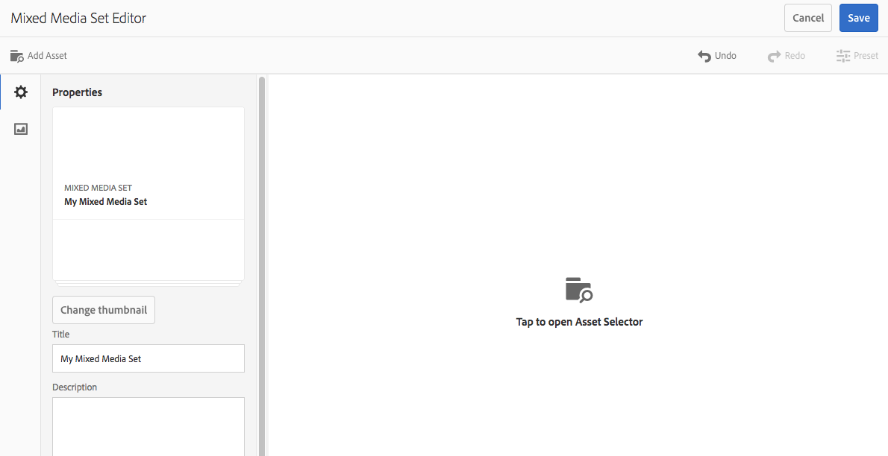

# Blandade medieuppsättningar{#mixed-media-sets}

Med blandade medieuppsättningar kan du kombinera bilder, bilduppsättningar, snurruppsättningar och videoklipp i en presentation.

Blandade medieuppsättningar definieras av en banderoll med ordet **[!UICONTROL MixedMediaSet]**. Om den blandade medieuppsättningen dessutom publiceras visas det publiceringsdatum som anges av **[!UICONTROL World]** -ikonen på banderollen tillsammans med det senaste ändringsdatumet, vilket anges av **[!UICONTROL pennikonen]** .

>[!NOTE]
>
>Mer information om användargränssnittet Resurser finns i [Hantera resurser med Touch-gränssnittet](/help/assets/manage-digital-assets.md).

## Snabbstart: Blandade medieuppsättningar {#quick-start-mixed-media-sets}

Följ de här stegen för att komma igång snabbt med blandade medieuppsättningar:

1. [Överför dina resurser](#uploading-assets).

   Börja med att ladda upp bilder och videoklipp för dina blandade medieuppsättningar. Om det behövs kan du skapa [bilduppsättningar](/help/assets/dynamic-media/image-sets.md) och [snurruppsättningar](/help/assets/dynamic-media/spin-sets.md). Eftersom användare kan zooma in bilder i visningsprogrammet för den blandade medieuppsättningen bör du ta hänsyn till zoomningen när du väljer bilder. Se till att bilderna har minst 2 000 pixlar i den största dimensionen.

1. [Skapa blandade medieuppsättningar.](#creating-mixed-media-sets)

   Om du vill skapa en uppsättning med blandade media går du till sidan Resurser och trycker på **[!UICONTROL Skapa > Medieuppsättning]** med blandade media, namnger uppsättningen, väljer resurserna och väljer i vilken ordning bilderna ska visas.

   Se [Arbeta med väljare.](/help/assets/dynamic-media/working-with-selectors.md)

1. Ställ in förinställningar [för](/help/assets/dynamic-media/managing-viewer-presets.md)blandad Media Viewer efter behov.

   Administratörer kan skapa eller ändra visningsförinställningar för blandad medieuppsättning. Om du vill visa de blandade medierna med en visningsförinställning väljer du den blandade medieuppsättningen och väljer **[!UICONTROL Visare]** i den vänstra listrutan.

   Se **[!UICONTROL Verktyg > Resurser > Visningsförinställningar]** för att skapa eller redigera visningsprogramförinställningar.

   Se [Lägga till och redigera visningsförinställningar.](/help/assets/dynamic-media/managing-viewer-presets.md)

1. [Förhandsgranska blandade medieuppsättningar.](#previewing-mixed-media-sets)

   Markera den blandade medieuppsättningen och du kan förhandsgranska den. Klicka på miniatyrbildikonerna för att undersöka den blandade medieuppsättningen i det valda visningsprogrammet. Du kan välja olika visningsprogram på menyn **[!UICONTROL Visare]** , som finns i listrutan till vänster.

1. [Publicera blandade medieuppsättningar.](#publishing-mixed-media-sets)

   När du publicerar en blandad medieuppsättning aktiveras URL-adressen och strängen Embed. Dessutom måste du [publicera visningsförinställningen](/help/assets/dynamic-media/managing-viewer-presets.md#publishing-viewer-presets).

1. [Länka URL:er till webbprogrammet](/help/assets/dynamic-media/linking-urls-to-yourwebapplication.md) eller [bädda in video- eller bildvisningsprogrammet](/help/assets/dynamic-media/embed-code.md).

   AEM Resurser skapar URL-anrop för blandade medieuppsättningar och aktiverar dem när du har publicerat de blandade medieuppsättningarna. Du kan kopiera dessa URL:er när du förhandsgranskar resurser. Du kan även bädda in dem på din webbplats.

   Välj den blandade medieuppsättningen och välj sedan **[!UICONTROL Visare]** i den vänstra listrutan.

   Se [Länka en uppsättning med blandade media till en webbsida](/help/assets/dynamic-media/linking-urls-to-yourwebapplication.md) och [Bädda in video- eller bildvisningsprogrammet](/help/assets/dynamic-media/embed-code.md).

Om du behöver kan du redigera [blandade medieuppsättningar](#editing-mixed-media-sets). Dessutom kan du visa och ändra egenskaperna [för](/help/assets/manage-digital-assets.md#editing-properties)den blandade medieuppsättningen.

>[!NOTE]
>
>Om du har problem med att skapa uppsättningar kan du läsa [Felsöka dynamiska media](/help/assets/dynamic-media/troubleshoot-dm.md).

## Överför resurser {#uploading-assets}

Börja med att ladda upp bilder och videoklipp för dina blandade medieuppsättningar. Eftersom användare kan zooma in bilder i visningsprogrammet för den blandade medieuppsättningen måste du ta hänsyn till zoomningen när du väljer bilder. Se till att bilderna har minst 2 000 pixlar i den största dimensionen.

Om du dessutom vill lägga till snurrsuppsättningar eller bilduppsättningar i den blandade medieuppsättningen skapar du även dem.

## Skapa blandade medieuppsättningar {#creating-mixed-media-sets}

Du kan lägga till bilder, bilduppsättningar, snurruppsättningar och videoklipp i din uppsättning med blandade media. Se till att dina filer, bilduppsättningar och snurruppsättningar är klara att publiceras innan du lägger till dem i den blandade medieuppsättningen.

När du lägger till resurser i uppsättningen läggs de automatiskt till i alfanumerisk ordning. Du kan ändra ordning på eller sortera resurser manuellt när de har lagts till.

**Skapa en blandad medieuppsättning**

1. Navigera till den plats där du vill skapa en blandad medieuppsättning i Resurser, klicka på **[!UICONTROL Skapa]** och välj **[!UICONTROL Blandad medieuppsättning]**. Du kan också skapa uppsättningen inifrån en mapp som innehåller dina resurser. Redigeraren för den blandade medieuppsättningen visas.

   

1. I redigeraren för den blandade medieuppsättningen anger du ett namn för den blandade medieuppsättningen i **[!UICONTROL Titel]**. Namnet visas i banderollen över den blandade medieuppsättningen. Du kan också ange en beskrivning.

   

   >[!NOTE]
   >
   >När du skapar den blandade medieuppsättningen kan du ändra miniatyrbilden för den blandade medieuppsättningen eller tillåta att AEM väljer miniatyrbilden automatiskt baserat på resurserna i den blandade medieuppsättningen. Om du vill välja en miniatyrbild klickar du på **[!UICONTROL Ändra miniatyrbild]** och väljer en bild (du kan navigera till andra mappar för att söka efter bilder också). Om du har valt en miniatyrbild och sedan vill att AEM ska generera en från den blandade medieuppsättningen väljer du **[!UICONTROL Växla till automatisk miniatyrbild]**.

1. Tryck på resursväljaren för att välja resurser som du vill inkludera i den blandade medieuppsättningen. Markera dem och klicka på **[!UICONTROL Välj]**.

   Med resursväljaren kan du söka efter resurser genom att skriva ett nyckelord och trycka på **[!UICONTROL Retur]**. Du kan också använda filter för att förfina sökresultaten. Du kan filtrera efter sökväg, samling, filtyp och tagg. Markera filtret och tryck sedan på **[!UICONTROL Filtrera]** -ikonen i verktygsfältet. Ändra vyn genom att markera **[!UICONTROL ikonen Visa]** och välja **[!UICONTROL Listvy]**, **[!UICONTROL Kolumnvy]** eller **[!UICONTROL Kortvy]**.

   Se [Arbeta med väljare](/help/assets/dynamic-media/working-with-selectors.md).

   

1. Ändra ordning på resurserna genom att dra dem uppåt eller nedåt i listan (du måste välja ikonen **[!UICONTROL Ändra ordning]** ), om det behövs.

   

   Om du vill lägga till miniatyrbilder klickar du på **+** - **[!UICONTROL miniatyrbildikonen]** bredvid bilden och går till miniatyrbilden som du vill ha. När du är klar med markeringen av alla miniatyrbilder klickar du på **[!UICONTROL Spara]**.

   >[!NOTE]
   >
   >Om du vill lägga till resurser trycker du på **[!UICONTROL Lägg till resurs]**.

1. Om du vill ta bort en resurs markerar du motsvarande kryssruta och trycker på **[!UICONTROL Ta bort resurs]**.
1. Om du vill använda en förinställning trycker du på **[!UICONTROL Förinställning]** i det övre högra hörnet och väljer en förinställning som ska användas för resurserna.
1. Click **[!UICONTROL Save]**. Den nya blandade medieuppsättningen visas i den mapp du skapade den i.

## Redigera blandade medieuppsättningar {#editing-mixed-media-sets}

Du kan utföra en mängd redigeringsåtgärder för resurser i blandade medieuppsättningar direkt i användargränssnittet, [precis som för andra resurser i Resurser](/help/assets/manage-digital-assets.md). Du kan även utföra följande åtgärder i Blandade medieuppsättningar:

* Lägg till resurser i den blandade medieuppsättningen.
* Ändra ordning på resurser i den blandade medieuppsättningen.
* Ta bort resurser i den blandade medieuppsättningen.
* Använd förinställningar för visningsprogram.
* Ändra standardminiatyrbilden.

**Redigera en blandad medieuppsättning**

1. Gör något av följande:

   * Håll pekaren över en resurs i en blandad medieuppsättning och tryck sedan på **[!UICONTROL Redigera]** (pennikon).
   * Håll muspekaren över en resurs i en blandad medieuppsättning, tryck på **[!UICONTROL Markera]** (bockmarkeringsikon) och sedan på **[!UICONTROL Redigera]** i verktygsfältet.

   * Tryck på en resurs i en blandad medieuppsättning och tryck sedan på **[!UICONTROL Redigera]** (pennikon) i verktygsfältet.

1. Gör något av följande i redigeraren för den blandade medieuppsättningen:

   * Om du vill ordna om resurser trycker du på **[!UICONTROL Resurser]** (bildikon) i den vänstra panelen och drar en resurs till en ny plats.
   * Om du vill lägga till resurser trycker du på **[!UICONTROL Lägg till resurs]** i verktygsfältet. Navigera till resurserna. För varje resurs som du vill lägga till håller du pekaren över resursens bild (inte resursens namn) och trycker sedan på bockmarkeringsikonen. Tryck på **[!UICONTROL Välj]** i det övre högra hörnet.

   * Om du vill ta bort en resurs trycker du på **[!UICONTROL Resurser]** (bildikon) i den vänstra panelen och markerar sedan resursen. Tryck på **[!UICONTROL Ta bort resurs]** i verktygsfältet.

   * Om du vill sortera resurser efter namn i stigande eller fallande ordning trycker du på **[!UICONTROL Resurser]** (bildikon) i den vänstra panelen. Till höger om rubriken **[!UICONTROL Resurser]** : tryck på cirkonerna uppåt eller nedåt.

      >[!NOTE]
      >
      >    * Om du vill ta bort en hel uppsättning med blandade media går du till **[!UICONTROL kortvyn]** eller **[!UICONTROL kolumnvyn]** i valfritt visningsläge. Håll pekaren över resursen och tryck på bockmarkeringsikonen för att markera den. Tryck på **[!UICONTROL Backsteg]** på tangentbordet eller klicka på **[!UICONTROL Mer]** (tre punkter) i verktygsfältet och tryck sedan på **[!UICONTROL Delete]**.
         >
         >    
      * Du kan redigera resurserna i en uppsättning med blandade media genom att navigera till uppsättningen, klicka på **Ange medlemmar** i den vänstra listen och sedan trycka på ikonen **[!UICONTROL Penna]** på en enskild resurs för att öppna redigeringsfönstret.

1. Tryck på **[!UICONTROL Spara]** när du är klar med redigeringen.

   >[!NOTE]
   >
   >* Om du vill redigera resurserna i en uppsättning med blandade media navigerar du till den blandade medieuppsättningen. Tryck på (markera inte) uppsättningen för att öppna den på sidan AEM Set Preview. Klicka på nedåtpilen i den vänstra listen för att öppna listrutan och tryck sedan på **[!UICONTROL Ange medlemmar]**. Håll markören över en resurs på sidan Ange medlemmar och tryck sedan på **[!UICONTROL Redigera]** (pennikonen) för att öppna redigeringssidan.
      >
      >
   * Om du vill ta bort en hel uppsättning med blandade media - I valfritt visningsläge (som kortvyn eller kolumnvyn) går du till den blandade medieuppsättningen. Håll muspekaren på scenen och tryck sedan på **Välj]** (bockmarkeringsikon). Tryck på **[!UICONTROL Backsteg]** på tangentbordet eller tryck på **[!UICONTROL Mer]** (rad om tre punkter) och sedan på **[!UICONTROL Delete]**.

## Förhandsgranska blandade medieuppsättningar {#previewing-mixed-media-sets}

Mer information om hur du förhandsgranskar blandade medieuppsättningar finns i [Förhandsgranska resurser](/help/assets/dynamic-media/previewing-assets.md) .

## Publicera blandade medieuppsättningar {#publishing-mixed-media-sets}

Mer information om hur du publicerar blandade medieuppsättningar finns i [Publicera resurser](/help/assets/dynamic-media/publishing-dynamicmedia-assets.md) .

>[!NOTE]
>
>Om den blandade medieuppsättningen inte hamnar helt i leveranstjänsten första gången du publicerar den kanske du måste publicera den blandade medieuppsättningen en andra gång.

