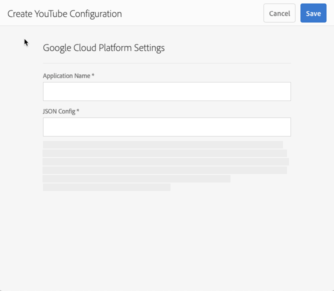

# Video {#video}

I det här avsnittet beskrivs hur du arbetar med video i Dynamic Media.

## Snabbstart: Videor {#quick-start-videos}

Följande steg-för-steg-beskrivning av arbetsflödet hjälper dig att komma igång snabbt med anpassningsbara videouppsättningar i Dynamic Media. Efter varje steg finns det korsreferenser till ämnesrubriker där du kan hitta mer information.

>[!NOTE]
>
>Innan du arbetar med video i Dynamic Media måste du kontrollera att Adobe Experience Manager-administratören redan har aktiverat och konfigurerat Dynamic Media-Cloud Services.
>
>* Se [Konfigurera Dynamic Media-Cloud Services](/help/assets/dynamic-media/config-dm.md#configuring-dynamic-media-cloud-services) i Konfigurera Dynamic Media och [Felsöka Dynamic Media](/help/assets/dynamic-media/troubleshoot-dm.md).
>


1. **Ladda upp dina Dynamic Media-filmer** genom att göra följande:

   * Skapa en egen videokodningsprofil. Du kan också helt enkelt använda den fördefinierade _Adaptiv videokodning_ profil som medföljer Dynamic Media.

      * [Skapa en videokodningsprofil](/help/assets/dynamic-media/video-profiles.md#creating-a-video-encoding-profile-for-adaptive-streaming).
      * Läs mer om [Bästa tillvägagångssätt för videokodning](#best-practices-for-encoding-videos).
   * Koppla videobearbetningsprofilen till en eller flera mappar där du ska överföra dina primära källvideor.

      * [Använda en videoprofil på mappar](/help/assets/dynamic-media/video-profiles.md#applying-a-video-profile-to-folders).
      * Läs mer om [Ordna digitala resurser](/help/assets/organize-assets.md).
   * Överför dina primära källvideor till mapparna. När du lägger till videofilmer i mappen kodas de enligt den videobearbetningsprofil som du tilldelade mappen.

      * Dynamic Media har främst stöd för videoklipp i kort form med en maxlängd på 30 minuter och en minimiupplösning på mer än 25 x 25.
      * Du kan överföra videofiler som är upp till 15 GB vardera.
      * [Ladda upp videor](/help/assets/manage-video-assets.md#upload-and-preview-video-assets).
      * Läs mer om [Indatafilformat som stöds](/help/assets/file-format-support.md).
   * Övervaka hur [videokodning pågår](#monitoring-video-encoding-and-youtube-publishing-progress) antingen från resursen eller arbetsflödesvyn.


1. **Hantera dina Dynamic Media-filmer** genom att göra något av följande:

   * Ordna, bläddra bland och söka efter videomaterial

      * [Ordna digitala resurser](/help/assets/organize-assets.md)
      * [Sök videoresurser](/help/assets/search-assets.md#custompredicates) eller [Söka efter resurser](/help/assets/manage-digital-assets.md#search-assets)
   * Förhandsgranska och publicera videomaterial

      * Visa källvideon och de kodade återgivningarna av videon tillsammans med tillhörande miniatyrer:
         [Förhandsgranska videoklipp](/help/assets/manage-video-assets.md#upload-and-preview-video-assets) eller [Förhandsgranska resurser](/help/assets/dynamic-media/previewing-assets.md)
         [Hantera videoåtergivningar](/help/assets/manage-digital-assets.md#managing-renditions)

      * [Hantera förinställningar för visningsprogram](/help/assets/dynamic-media/managing-viewer-presets.md)
      * [Publicera resurser](/help/assets/dynamic-media/publishing-dynamicmedia-assets.md)
   * Arbeta med videometadata

      * Redigera egenskaperna för video, till exempel titel, beskrivning och taggar, anpassade metadatafält:
         [Redigera videoegenskaper](/help/assets/manage-digital-assets.md#editing-properties)

      * [Hantera metadata för digitala resurser](/help/assets/manage-metadata.md)
      * [Metadata-scheman](/help/assets/metadata-schemas.md)
   * Granska, godkänn och kommentera videoklipp och behåll fullständig versionskontroll

      * [Kommentera videoklipp](/help/assets/manage-video-assets.md#annotate-video-assets) eller [Anteckna resurser](/help/assets/manage-digital-assets.md#annotating)

      * [Skapa en version](/help/assets/manage-digital-assets.md#asset-versioning)
      * [Starta ett arbetsflöde för en resurs](/help/assets/manage-digital-assets.md#starting-a-workflow-on-an-asset)

      * [Granska mappresurser](/help/assets/bulk-approval.md)
      * [Projekt](/help/sites-cloud/authoring/projects/overview.md)


1. **Publicera dina Dynamic Media-filmer** genom att göra något av följande:

   * Om du använder Experience Manager som WCM-system (Web Content Management) kan du lägga till videofilmer direkt på dina webbsidor.

      * [Lägga till videoklipp på webbsidor](/help/assets/dynamic-media/adding-dynamic-media-assets-to-pages.md).
   * Om du använder ett webbinnehållshanteringssystem från en annan leverantör kan du länka eller bädda in videor på dina webbsidor.

      * Integrera video med URL:
         [Länka URL:er till ditt webbprogram](/help/assets/dynamic-media/linking-urls-to-yourwebapplication.md).

      * Integrera video med inbäddad kod på webbsidan:
         [Bädda in videovisningsprogrammet på en webbsida](/help/assets/dynamic-media/embed-code.md).
   * [Publicera videor på YouTube](#publishing-videos-to-youtube).
   * [Generera videorapporter](#viewing-video-reports).

   * [Lägga till bildtexter i video](#adding-captions-to-video).


## Arbeta med video i Dynamic Media {#working-with-video-in-dynamic-media}

Video i Dynamic Media är en totallösning som gör det enkelt att publicera högkvalitativ adaptiv video för direktuppspelning på flera skärmar, inklusive stationära datorer, surfplattor och mobila enheter. En adaptiv videouppsättning grupperar versioner av samma video som är kodade med olika bithastigheter och format som 400 kbit/s, 800 kbit/s och 1 000 kbit/s. Den stationära datorn eller mobila enheten känner av den tillgängliga bandbredden.

På en mobilenhet från iOS identifieras t.ex. en bandbredd som 3G, 4G eller Wi-Fi. Sedan väljs automatiskt rätt kodad video bland de olika videobithastigheterna i den adaptiva videouppsättningen. Videon strömmas till datorer, mobila enheter eller surfplattor.

Dessutom ändras videokvaliteten dynamiskt automatiskt om nätverksförhållandena ändras på datorn eller den mobila enheten. Om en kund går över till helskärmsläge på en stationär dator svarar den adaptiva videouppsättningen med en bättre upplösning, vilket förbättrar kundens tittarupplevelse. Med adaptiva videouppsättningar får du bästa möjliga uppspelning för kunder som spelar upp Dynamic Media-video på flera skärmar och enheter.

Den logik som en videospelare använder för att avgöra vilken kodad video som ska spelas upp eller väljas under uppspelningen baseras på följande algoritm:

1. Videospelaren läser in det inledande videofragmentet baserat på den bithastighet som ligger närmast värdet som är inställt för&quot;inledande bithastighet&quot; i spelaren.
1. Videospelaren växlar baserat på ändringar av bandbreddshastigheten med följande kriterier:

   1. Spelaren väljer den högsta bandbreddsströmmen under eller lika med den beräknade bandbredden.
   1. Spelaren hanterar bara 80 % av den tillgängliga bandbredden. Men om den byter upp sig är det mer försiktigt med bara 70 % för att undvika överskattning och omedelbart gå tillbaka.

Detaljerad teknisk information om algoritmen finns i [https://android.googlesource.com/platform/frameworks/av/+/master/media/libstagefright/httplive/LiveSession.cpp](https://android.googlesource.com/platform/frameworks/av/+/master/media/libstagefright/httplive/LiveSession.cpp)

Följande stöds för hantering av enstaka video och adaptiva videouppsättningar:

* Ladda upp video från ett antal videoformat och ljudformat som stöds och koda video till MP4 H.264-format för uppspelning på flera skärmar. Du kan använda fördefinierade adaptiva videoförinställningar, enskilda videokodningsförinställningar eller anpassa din egen kodning för att styra videons kvalitet och storlek.

   * När en adaptiv videouppsättning genereras innehåller den MP4-videor.
   * **Anteckning**: Primära videor/källvideor läggs inte till i en adaptiv videouppsättning.

* Videobildtext i alla HTML5-videovisningsprogram.
* Ordna, bläddra bland och sök videoklipp med fullt stöd för metadata för effektiv hantering av videomaterial.
* Leverera adaptiva videouppsättningar till webben, datorer, surfplattor och mobila enheter.

Adaptiv videoströmning stöds på olika iOS-plattformar. Se [Referenshandbok för Dynamic Media Viewer](https://experienceleague.adobe.com/docs/dynamic-media-developer-resources/library/viewers-aem-assets-dmc/video/c-html5-video-reference.html).

<!-- OUTDATED 2/28/22 BASED ON CQDOC-18692 Dynamic Media supports mobile video playback for MP4 H.264 video. You can find BlackBerry&reg; devices that support this video format at the following: [Supported video formats on BlackBerry&reg;](https://support.blackberry.com/kb/articleDetail?ArticleNumber=000005482).

OUTDATED 2/28/22 BASED ON CQDOC-18692 You can find Windows&reg; devices that support this video format at the following [Supported video formats on Windows&reg; Phone](https://docs.microsoft.com/en-us/windows/uwp/audio-video-camera/supported-codecs). -->

* Spela upp videon med Dynamic Media Video Viewer Presets, inklusive följande:

   * Enstaka videovisningsprogram.
   * Visningsprogram för blandade media som kombinerar både video- och bildinnehåll.

* Konfigurera videospelare för att tillgodose era varumärkesbehov.
* Integrera video på webbplatsen, mobilsajten eller mobilapplikationen med en enkel URL eller inbäddningskod.

Se [Dynamisk videouppspelning](https://s7d9.scene7.com/s7/uvideo.jsp?asset=GeoRetail/Mop_AVS&amp;config=GeoRetail/Universal_Video1&amp;stageSize=640,480) exempel.

Se även [Tittare för Experience Manager Assets och Dynamic Media Classic](https://experienceleague.adobe.com/docs/dynamic-media-developer-resources/library/viewers-aem-assets-dmc/c-html5-s7-aem-asset-viewers.html#viewers-aem-assets-dmc) och [Endast visningsprogram för Experience Manager Assets](https://experienceleague.adobe.com/docs/dynamic-media-developer-resources/library/viewers-for-aem-assets-only/c-html5-aem-asset-viewers.html#viewers-for-aem-assets-only) i [Referenshandbok för Dynamic Media Viewer](https://experienceleague.adobe.com/docs/dynamic-media-developer-resources.html).

## Bästa praxis: Använda videovisningsprogrammet för HTML5 {#best-practice-using-the-html-video-viewer}

Förinställningarna för videovisningsprogrammet i Dynamic Media HTML 5 är robusta videospelare. Du kan använda dem för att undvika många vanliga problem som är kopplade till HTML5-videouppspelning och problem som är kopplade till mobila enheter. Exempel: brist på adaptiv strömning och begränsad webbläsarräckvidd.

På designsidan av spelaren kan du utforma videospelarens funktioner med standardverktyg för webbutveckling. Du kan till exempel utforma knapparna, kontrollerna och den anpassade bakgrunden för förhandsvisningsbilder med HTML5 och CSS så att du kan nå dina kunder med ett anpassat utseende.

På visningsprogrammets uppspelningssida identifieras webbläsarens videokapacitet automatiskt. Sedan visas videon med HLS eller DASH, som också kallas adaptiv videoströmning. Om leveransmetoderna inte finns används HTML5 progressiv i stället.

>[!NOTE]
>
>Om du vill använda DASH för dina videor måste det först aktiveras av Adobe tekniska support på ditt konto. Se [Aktivera DASH på ditt konto](#enable-dash).)

Du kan kombinera möjligheten att utforma uppspelningskomponenterna med HTML 5 och CSS till en enda spelare. Den kan ha inbäddad uppspelning och använda adaptiv och progressiv strömning beroende på webbläsarens kapacitet. Alla dessa funktioner innebär att du kan utöka räckvidden för ditt multimedieinnehåll till både dator- och mobilanvändare och få en smidig videoupplevelse.

Se även [Endast visningsprogram för Experience Manager Assets](https://experienceleague.adobe.com/docs/dynamic-media-developer-resources/library/viewers-for-aem-assets-only/c-html5-aem-asset-viewers.html#viewers-for-aem-assets-only) i [Referenshandbok för Dynamic Media Viewer](https://experienceleague.adobe.com/docs/dynamic-media-developer-resources.html).


### Uppspelning av video på stationära datorer och mobila enheter med videovisningsprogrammet HTML5 {#playback-of-video-on-desktop-computers-and-mobile-devices-using-the-html-video-viewer}

För strömning av anpassningsbara video för datorer och mobilenheter baseras de videor som används för växling av bithastighet på alla MP4-videor i den adaptiva videouppsättningen.

Videouppspelning sker med HLS eller DASH, eller progressiv videohämtning. I tidigare versioner av Experience Manager, som 6.0, 6.1 och 6.2, strömmades videofilmer via HTTP.

I Experience Manager 6.3 och senare direktuppspelas videor nu via HTTPS (dvs. HLS eller DASH) eftersom DM-gatewaytjänstens URL alltid använder HTTPS. Det här standardbeteendet påverkar inte kunderna. Det innebär att direktuppspelning av video alltid sker via HTTPS, såvida det inte stöds av webbläsaren. (se följande tabell).

>[!NOTE]
>
>Om du vill använda DASH för dina videor måste det först aktiveras av Adobe tekniska support på ditt konto. Se [Aktivera DASH på ditt konto](#enable-dash).)

Därför returnerar

* Om du har en HTTPS-webbplats med HTTPS-videoströmning går det bra att strömma.
* Om du har en HTTP-webbplats med HTTPS-videoströmning går det bra att strömma och det finns inga blandade innehållsproblem i webbläsaren.

HLS är en Apple-standard för adaptiv videoströmning som automatiskt anpassar uppspelningen baserat på nätverkets bandbreddskapacitet. Man kan också &quot;söka&quot; till valfri punkt i videon utan att behöva vänta på att resten av videon ska laddas ned.

Progressiv video levereras genom att videon hämtas och lagras lokalt på en användares dator eller mobila enhet.

I följande tabell beskrivs enheten, webbläsaren och uppspelningsmetoden för videoklipp på stationära datorer och mobila enheter med hjälp av [Dynamic Media HTML5 Video Viewer](https://experienceleague.adobe.com/docs/dynamic-media-developer-resources/library/viewers-for-aem-assets-only/interactive-video/c-html5-aem-int-video.html#interactive-video).

<table>
 <tbody>
  <tr>
   <td><strong>Enhet</strong></td>
   <td><strong>Webbläsare</strong></td>
   <td><strong>Videouppspelningsläge</strong></td>
  </tr>
  <tr>
   <td>Skrivbord</td>
   <td>Internet Explorer 9 och 10</td>
   <td>Progressiv nedladdning.</td>
  </tr>
  <tr>
   <td>Skrivbord</td>
   <td>Internet Explorer 11+</td>
   <td>I Windows® 8 och Windows® 10 - Tvinga användning av HTTPS när DASH eller HLS begärs. Känd begränsning: HTTP på DASH eller HLS fungerar inte i den här kombinationen av webbläsare/operativsystem<br /> <br /> I Windows® 7 - progressiv nedladdning. Använder standardlogik för att välja HTTP- eller HTTPS-protokoll.</td>
  </tr>
  <tr>
   <td>Skrivbord</td>
   <td>Firefox 23-44</td>
   <td>Progressiv nedladdning.</td>
  </tr>
  <tr>
   <td>Skrivbord</td>
   <td>Firefox 45 eller senare</td>
   <td>HLS- eller DASH*-adaptiv strömning</td>
  </tr>
  <tr>
   <td>Skrivbord</td>
   <td>Krom</td>
   <td>HLS- eller DASH*-adaptiv strömning</td>
  </tr>
  <tr>
   <td>Skrivbord</td>
   <td>Safari (Mac)</td>
   <td>HLS- eller DASH*-adaptiv strömning</td>
  </tr>
  <tr>
   <td>Mobil</td>
   <td>Chrome (Android™ 6 eller tidigare)</td>
   <td>Progressiv nedladdning.</td>
  </tr>
  <tr>
   <td>Mobil</td>
   <td>Chrome (Android™ 7 eller senare)</td>
   <td>HLS eller DASH* adaptiv strömning/td&gt;
  </tr>
  <tr>
   <td>Mobil</td>
   <td>Android™ (standardwebbläsare)</td>
   <td>Progressiv nedladdning.</td>
  </tr>
  <tr>
   <td>Mobil</td>
   <td>Safari (iOS)</td>
   <td>HLS- eller DASH*-adaptiv strömning</td>
  </tr>
  <tr>
   <td>Mobil</td>
   <td>Chrome (iOS)</td>
   <td>HLS- eller DASH*-adaptiv strömning</td>
  </tr>
 </tbody>
</table>

>[!IMPORTANT]
>
>*Om du vill använda DASH för dina videor måste det först aktiveras av Adobe tekniska support på ditt konto. Se [Aktivera DASH på ditt konto](#enable-dash).)

<!--  THIS LINE WAS REMOVED FROM THE TABLE ABOVE ON FEB 28, 2022 BASED ON CQDOC 18692 -RSB <tr>
   <td>Mobile</td>
   <td>BlackBerry&reg;</td>
   <td>HLS or DASH</td>
  </tr>
 -->

## Arkitektur för Dynamic Media videolösning {#architecture-of-dynamic-media-video-solution}

Följande bild visar det övergripande arbetsflödet för redigering av videoklipp som har överförts och kodats med hjälp av DMGGateway (i Dynamic Media Hybrid-läge) och som har gjorts tillgängliga för offentlig användning.


## Hybrid publiceringsarkitektur för videor {#hybrid-publishing-architecture-for-videos}


## Bästa tillvägagångssätt för att koda videofilmer {#best-practices-for-encoding-videos}

The **Dynamic Media Encode Video** arbetsflödet kodar video om du har aktiverat Dynamic Media och konfigurerat videoCloud Services. Det här arbetsflödet innehåller information om arbetsflödets processhistorik och fel. Se [Övervaka videokodning och YouTube publiceringsförlopp](#monitoring-video-encoding-and-youtube-publishing-progress). Om du har aktiverat Dynamic Media och konfigurerat Cloud Services för video, **[!UICONTROL Dynamic Media Encode Video]** arbetsflödet aktiveras automatiskt när du överför en video. (Om du inte använder Dynamic Media **[!UICONTROL DAM Update Asset]** arbetsflödet börjar gälla.)

Nedan följer några tips om hur du kodar källvideofiler.

<!-- For advice about video encoding, see the following:

* [Streaming 101: The Basics — Codecs, Bandwidth, Data Rate, and Resolution](https://www.adobe.com/go/learn_s7_streaming101_en).
* [Video Encoding Basics](https://www.adobe.com/go/learn_s7_encoding_en). -->

### Källvideofiler {#source-video-files}

När du kodar en videofil ska du använda en källvideofil med högsta möjliga kvalitet. Undvik att använda tidigare kodade videofiler eftersom dessa filer redan är komprimerade, och ytterligare kodning skapar en video med delkvalitet.

* Dynamic Media har främst stöd för videoklipp i kort form med en maxlängd på 30 minuter och en minimiupplösning på mer än 25 x 25.
* Du kan överföra primära källvideofiler på upp till 15 GB vardera.

I följande tabell beskrivs rekommenderad storlek, proportioner och lägsta bithastighet som källvideofilerna måste ha innan du kodar dem:

| Storlek | Proportioner | Minsta bithastighet |
|--- |--- |--- |
| 1024 x 768 | 4:3 | 4 500 kbit/s för de flesta videoklipp. |
| 1280 x 720 | 16:9 | 3 000 - 6 000 kbit/s, beroende på mängden rörelse i videon. |
| 1920 x 1080 | 16:9 | 6000 - 8 000 kbit/s, beroende på mängden rörelse i videon. |

### Hämta metadata för en fil {#obtaining-a-file-s-metadata}

Du kan hämta metadata för en fil genom att visa dess metadata med ett redigeringsverktyg för videoklipp eller med ett program som utformats för att hämta metadata. Nedan följer instruktioner om hur du använder MediaInfo, ett tredjepartsprogram, för att hämta videofilens metadata:

1. Gå till [MediaInfo-hämtning](https://mediaarea.net/en/MediaInfo/Download).
1. Välj och hämta installationsprogrammet för den grafiska användargränssnittsversionen och följ installationsanvisningarna.
1. Efter installationen högerklickar du på videofilen (endast Windows®) och väljer MediaInfo, eller så öppnar du MediaInfo och drar videofilen till programmet. Alla metadata som är associerade med videofilen, inklusive bredd, höjd och fps, visas.

### Proportioner {#aspect-ratio}

När du väljer eller skapar en förinställning för videokodning för den primära källvideofilen måste du se till att förinställningen har samma proportioner som den primära källvideofilen. Proportionerna är proportionerna mellan videons bredd och höjd.

Om du vill ta reda på videofilens proportioner hämtar du filens metadata och noterar filens bredd och höjd (se Hämta filens metadata ovan). Använd sedan den här formeln för att bestämma proportionerna:

width/height = aspect ratio

I följande tabell beskrivs hur formelresultaten översätts till vanliga alternativ för proportioner:

| Formelresultat | Proportioner |
|--- |--- |
| 1.33 | 4:3 |
| 0.75 | 3:4 |
| 1.78 | 16:9 |
| 0.56 | 9:16 |

En video som till exempel är 1440 bredd x 1080 höjd har proportionerna 1440/1080 eller 1,33. I det här fallet väljer du en förinställning för videokodning med 4:3-proportioner för att koda videofilen.

### Bithastighet {#bitrate}

Bithastighet är den mängd data som kodas för att skapa en enda sekund av videouppspelning. Bithastigheten mäts i kilobit per sekund (kbit/s).

>[!NOTE]
>
>Eftersom förlustgivande komprimering används för alla kodekar är bithastigheten den viktigaste faktorn i videokvaliteten. Ju mer du komprimerar en videofil desto sämre blir kvaliteten. Därför är alla andra egenskaper lika (upplösning, bildrutehastighet och kodek), ju lägre bithastighet, desto lägre kvalitet får den komprimerade filen.

När du väljer en bithastighetskodning kan du välja mellan två typer:

* **[!UICONTROL Constant Bitrate Encoding]** (CBR) - Under CBR-kodning är bithastigheten eller antalet bitar per sekund densamma under hela kodningsprocessen. CBR-kodning bevarar den angivna datahastigheten enligt inställningen för hela videon. CBR-kodning optimerar inte heller mediefiler för kvalitet utan sparar på lagringsutrymmet.
Använd CBR om videon innehåller en liknande rörelsenivå i hela videon. CBR används oftast för direktuppspelat videoinnehåll. Se även [Använda egna parametrar för videokodning](/help/assets/dynamic-media/video-profiles.md#using-custom-added-video-encoding-parameters).

* **[!UICONTROL Variable Bitrate Encoding]** (VBR) - VBR-kodning justerar datahastigheten nedåt och till den övre gräns som du anger, baserat på de data som krävs av kompressorn. Den här funktionen innebär att under en VBR-kodningsprocess ökar eller minskar bithastigheten för mediefilen dynamiskt beroende på mediafilens behov av bithastighet.
VBR tar längre tid att koda men ger det mest fördelaktiga resultatet. mediefilens kvalitet är överlägsen. VBR används oftast för http-progressiv leverans av videoinnehåll.

När använder du VBR jämfört med CRB?
När du väljer VBR jämfört med CBR rekommenderar vi nästan alltid att du använder VBR för dina mediefiler. VBR ger filer av högre kvalitet med konkurrenskraftiga bithastigheter. När du använder VBR måste du vara säker på att du använder kodning i två omgångar och ställa in den maximala bithastigheten till 1,5 gånger målvideobithastigheten.

När du väljer en förinställning för videokodning måste du ta hänsyn till målanvändarens anslutningshastighet. Välj en förinställning med en datahastighet som är 80 % av den hastigheten. Om målanvändarens anslutningshastighet till exempel är 1000 kbit/s är den bästa förinställningen en med en videodatahastighet på 800 kbit/s.

I den här tabellen beskrivs datahastigheten för typiska anslutningshastigheter.

| Hastighet (kbit/s) | Anslutningstyp |
|--- |--- |
| 256 | Uppringd anslutning. |
| 800 | Vanlig mobilanslutning. För den här anslutningen anger du en datahastighet mellan 400 och maximalt 800 för 3G-upplevelser som mål. |
| 2000 | Vanlig anslutning till stationär bredbandsuppkoppling. För den här anslutningen anger du en datahastighet i intervallet 800-2000 kbit/s med de flesta mål som är i genomsnitt 1200-1500 kbit/s. |
| 5000 | Vanlig bredbandsanslutning. Kodning i det här övre intervallet rekommenderas inte eftersom videoleverans i den här hastigheten inte är tillgänglig för de flesta konsumenter. |

### Upplösning {#resolution}

**Upplösning** beskriver en videofils höjd och bredd i pixlar. Den mesta källvideon lagras med hög upplösning (till exempel 1 920 x 1 080). Vid direktuppspelning komprimeras källvideo till en lägre upplösning (640 x 480 eller lägre).

Upplösning och datahastighet är två sammankopplade faktorer som avgör videokvaliteten. Om du vill behålla samma videokvalitet måste datahastigheten vara högre ju fler pixlar en videofil har (ju högre upplösning). Ta till exempel antalet pixlar per bildruta i en 320 x 240-upplösning och en 640 x 480-upplösningsvideofil:

| Upplösning | Pixlar per bildruta |
|--- |--- |
| 320 x 240 | 76,800 |
| 640 x 480 | 307,200 |

Filen på 640 x 480 har fyra gånger fler pixlar per bildruta. För att uppnå samma datahastighet för dessa två exempelupplösningar tillämpar du fyra gånger komprimeringen på 640 x 480-filen, vilket kan minska videons kvalitet. En videodatahastighet på 250 kbit/s ger därför en högkvalitativ bild med upplösningen 320 x 240, men inte med upplösningen 640 x 480.

I allmänhet gäller att ju högre datahastighet du använder, desto bättre visas videon och ju högre upplösning du använder, desto högre datahastighet måste du behålla visningskvaliteten (jämfört med lägre upplösningar).

Eftersom upplösning och datahastighet är länkade finns det två alternativ när du kodar video:

* Välj en datahastighet och koda sedan med den högsta upplösningen som ser bra ut med den datahastighet du väljer.
* Välj en upplösning och koda sedan med den datahastighet som krävs för att få en video med hög kvalitet med den upplösning du väljer.

När du väljer (eller skapar) en förinställning för videokodning för den primära källvideofilen använder du den här tabellen för att ange rätt upplösning:

| Upplösning | Höjd (pixlar) | Skärmstorlek |
|--- |--- |--- |
| 240p | 240 | Liten skärm |
| 300p | 300 | Liten skärm för mobila enheter |
| 360p | 360 | Liten skärm |
| 480p | 480 | Medelstor skärm |
| 720p | 720 | Stor skärm |
| 1080p | 1080 | Stor HD-skärm |

### Fps (bildrutor per sekund) {#fps-frames-per-second}

I USA och Japan spelas de flesta videoklipp in med 29,97 bildrutor per sekund (fps). i Europa spelas de flesta videoklipp in med 25 bildrutor per sekund. Film filmas med 24 fps.

Välj en förinställning för videokodning som matchar fps-hastigheten för den primära källvideofilen. Om den primära källvideon till exempel är 25 fps väljer du en kodningsförinställning med 25 fps. Som standard används den primära källvideofilens fps för all anpassad kodning. Därför behöver du inte uttryckligen ange fps-inställningen när du skapar en förinställning för videokodning.

### Videokodningsdimensioner {#video-encoding-dimensions}

För bästa resultat väljer du kodningsdimensioner så att källvideon är en hel multipel av alla dina kodade videor.

Om du vill beräkna förhållandet dividerar du källbredden med den kodade bredden för att få breddförhållandet. Sedan dividerar du källhöjden med kodad höjd för att få höjdförhållandet.

Om förhållandet är ett heltal betyder det att videon är optimalt skalad. Om den resulterande kvoten inte är ett heltal påverkas videokvaliteten genom att kvarvarande pixelartefakter lämnas kvar på skärmen. Effekten märks mest när videon innehåller text.

Anta till exempel att källvideon är 1 920 x 1 080. I följande tabell ger de tre kodade videoklippen de optimala kodningsinställningarna som kan användas.

| Videotyp | Bredd x höjd | Breddförhållande | Höjdförhållande |
|--- |--- |--- |--- |
| Källa | 1920 x 1080 | 1 | 1 |
| Kodad | 960 x 540 | 2 | 2 |
| Kodad | 640 x 360 | 3 | 3 |
| Kodad | 480 x 270 | 4 | 4 |

### Kodat videofilformat {#encoded-video-file-format}

Dynamic Media rekommenderar att du använder MP4 H.264-videokodningsförinställningar. Eftersom MP4-filer använder H.264-videokodeken ger den video med hög kvalitet men i en komprimerad filstorlek.

### Aktivera DASH på ditt konto {#enable-dash}

DASH (Digital Adaptive Streaming over HTTP) är den internationella standarden för direktuppspelad video och används i stor utsträckning av olika videovisningsprogram. När du aktiverar DASH kan du välja mellan HLS och DASH för adaptiv videoströmning. Du kan också välja båda med automatisk växling mellan spelare.

Några viktiga fördelar med att aktivera DASH på ditt konto är följande:

* Paketera DASH-strömvideo för adaptiv strömning. Den här metoden leder till ökad effektivitet vid leverans. Adaptiv strömning ger bästa möjliga tittarupplevelse för dina kunder.
* Webbläsaroptimerad direktuppspelning med Dynamic Media-spelare växlar mellan HLS- och DASH-strömning för att säkerställa bästa möjliga servicekvalitet. Videospelaren växlar automatiskt till HLS när en Safari-webbläsare används.
* Du kan konfigurera den direktuppspelningsmetod (HLS eller DASH) som du föredrar genom att redigera visningsförinställningen för videon.
* Optimerad videokodning säkerställer att ingen ytterligare lagring används samtidigt som DASH-funktionen aktiveras. En enda uppsättning videokodningar skapas för både HLS och DASH för att optimera lagringskostnaderna för video.
* Gör videomaterialet mer tillgängligt för kunderna.
* Hämta URL:en för direktuppspelning via API:er också.

Du startar en begäran om att använda DASH; det aktiveras inte automatiskt på ditt konto.

>[!IMPORTANT]
>
>Det går för närvarande bara att aktivera DASH på ditt konto i Nordamerika.

Skapa ett supportärende enligt beskrivningen nedan. I ditt supportärende ska du ange att du vill att DASH ska aktiveras för ditt konto.

**Så här aktiverar du DASH på ditt konto:**

1. [Använd Admin Console för att börja skapa ett nytt supportärende](https://helpx.adobe.com/enterprise/using/support-for-experience-cloud.html).
1. Följ instruktionerna för att skapa ett supportärende och försäkra dig om att du anger följande information:

   * Primärt kontaktnamn, e-postadress, telefon.
   * Du vill aktivera DASH på ditt Dynamic Media-konto.

1. Adobe kundsupport lägger till dig i DASH-kundens väntelista baserat på i vilken ordning begäranden skickas.
1. När Adobe är redo att hantera din begäran kontaktar kundsupporten dig för att koordinera och ange ett måldatum för aktivering av DASH.
1. Du meddelas när du är klar av kundsupporten.
1. Skapa [videovisningsförinställning](/help/assets/dynamic-media/managing-viewer-presets.md#creating-a-new-viewer-preset) som vanligt.

## Publicera videor på YouTube {#publishing-videos-to-youtube}

Du kan publicera videoresurser som hanteras i Experience Manager Assets direkt till en YouTube-kanal som du tidigare har skapat.

Om du vill publicera videoresurser på YouTube taggar du videoresurser i Experience Manager Assets med taggar. Du kopplar dessa taggar till en YouTube-kanal. Om videoresursens tagg matchar taggen för en YouTube-kanal publiceras videon till YouTube. Publicera till YouTube sker tillsammans med en normal publicering av videon så länge en associerad tagg används.

YouTube gör sin egen kodning. Det innebär att den ursprungliga videofilen som överfördes till Experience Manager publiceras till YouTube i stället för någon videoåtergivning som har skapats med Dynamic Medias kodning. Även om det inte krävs för att bearbeta videofilmer med Dynamic Media förväntas de göra det om en visningsförinställning behövs för uppspelning.

När du åsidosätter videobearbetningsprofilen och publicerar direkt till YouTube innebär det helt enkelt att videomaterialet i Experience Manager Asset inte får någon miniatyrbild som kan visas. Det innebär också att videoklipp som inte är kodade inte fungerar med någon av Dynamic Media resurstyper.

När du publicerar videomaterial till YouTube-servrar utför du följande uppgifter för att säkerställa säker server-till-server-verifiering med YouTube:

1. [Konfigurera inställningar för Google Cloud](#configuring-google-cloud-settings)
1. [Skapa en YouTube-kanal](#creating-a-youtube-channel)
1. [Lägga till taggar för publicering](#adding-tags-for-publishing)
1. [Konfigurera YouTube i Experience Manager](#setting-up-youtube-in-aem)
1. [(Valfritt) Automatisera inställningen av YouTube standardegenskaper för överförda videofilmer](#optional-automating-the-setting-of-default-youtube-properties-for-your-uploaded-videos)
1. [Publicera videor i din YouTube-kanal](#publishing-videos-to-your-youtube-channel)
1. [(Valfritt) Verifiera den publicerade videon på YouTube](/help/assets/dynamic-media/video.md#optional-verifying-the-published-video-on-youtube)
1. [Länka YouTube URL:er till ditt webbprogram](#linking-youtube-urls-to-your-web-application)

Du kan också [avpublicera videoklipp för att ta bort dem från YouTube](#unpublishing-videos-to-remove-them-from-youtube).

### Konfigurera inställningar för Google Cloud {#configuring-google-cloud-settings}

Du behöver ett Google-konto för att kunna publicera till YouTube. Om du har ett GMAIL-konto har du redan ett Google-konto; Om du inte har något Google-konto kan du enkelt skapa ett. Du behöver kontot eftersom du behöver inloggningsuppgifter för att publicera videoresurser på YouTube. <!-- hidden March 3 2022 If you have an account already created, then skip this task and proceed directly to [Create a YouTube channel](#creating-a-youtube-channel). -->

Kontot som används med Google Cloud och Google-kontot som används för YouTube behöver inte vara samma.

Google ändrar regelbundet användargränssnittet. Stegen för att publicera videofilmer till YouTube kan därför variera något från vad som beskrivs nedan. Denna caveat gäller även YouTube när du försöker kontrollera om videoklipp har överförts till det.

>[!NOTE]
>
>Följande steg var korrekta vid skrivandet. Google uppdaterar dock regelbundet sina webbsidor i molnet utan föregående meddelande. Därför kan vissa konfigurationsalternativ namnges något annorlunda i Google användargränssnitt jämfört med det namn som används i stegen.

**Så här konfigurerar du inställningarna för Google Cloud:**

1. Skapa ett Google-konto.
   [https://accounts.google.com/signup/v2?service=mail&amp;flowName=GlifWebSignIn&amp;flowEntry=SignUp](https://accounts.google.com/signup/v2?service=mail&amp;flowName=GlifWebSignIn&amp;flowEntry=SignUp)

   Om du redan har ett Google-konto kan du gå vidare till nästa steg.

1. Gå till [https://cloud.google.com/](https://cloud.google.com/).
1. På **[!UICONTROL Google Cloud]** sida, nära det övre högra hörnet, markera **[!UICONTROL Console]**.

   Vid behov **[!UICONTROL Sign in]** med inloggningsuppgifterna för ditt Google-konto för att se **[!UICONTROL Console]** alternativ.

1. På **[!UICONTROL Dashboard]** sida, till höger om **[!UICONTROL Google Cloud Platform]** väljer du **[!UICONTROL Project]** nedrullningsbar lista för att öppna **[!UICONTROL Select a project]** -dialogrutan.
1. I **[!UICONTROL Select a project]** väljer **[!UICONTROL New Project]**.
1. I **[!UICONTROL New Project]** i **[!UICONTROL Project name]** anger du namnet på det nya projektet.

   Ditt projekt-ID baseras på ditt projektnamn. Välj projektnamnet noggrant. den kan inte ändras efter att den har skapats. Du måste även ange samma projekt-ID igen när du konfigurerar YouTube i Experience Manager senare. Skriv därför ned den.

1. Välj **[!UICONTROL Create]**.

1. Gör något av följande:

   * På Dashboard-panelen i ditt projekt finns **[!UICONTROL Getting Started]** kort, välj **[!UICONTROL Explore and enable APIs]**.
   * På Dashboard-panelen i ditt projekt finns **[!UICONTROL APIs]** kort, välj **[!UICONTROL Go to APIs overview]**.

1. Nära överkanten i mitten av **[!UICONTROL APIs & Services]** sida, markera **[!UICONTROL ENABLE APIS AND SERVICES]**.<!-- NEXT STEP BELOW IS STEP 10 -->
1. På **[!UICONTROL API Library]** sida, till vänster, under **[!UICONTROL Category]**, markera **[!UICONTROL YouTube]**. Till höger på sidan väljer du **[!UICONTROL YouTube]**.
1. På **[!UICONTROL YouTube]** sida, markera **[!UICONTROL YouTube Data API v3]**.
1. På **[!UICONTROL YouTube Data API v3]** sida, markera **[!UICONTROL MANAGE]**.

   

1. Om du vill använda API:t måste du ha autentiseringsuppgifter. Vid behov, till vänster på sidan av **[!UICONTROL APIs & Services]** sida, markera **[!UICONTROL Credentials]**.
1. På **[!UICONTROL Credentials]** sida, intill överkanten, markera **[!UICONTROL CREATE CREDENTIALS]** väljer **[!UICONTROL OAuth client ID]**.
1. På **[!UICONTROL Create OAuth client ID]** sida, på **[!UICONTROL Application type]** nedrullningsbar lista, välja **[!UICONTROL Web application]**.

   

1. Gör något av följande:

   * I **[!UICONTROL Name]** anger du ett unikt namn för OAuth 2.0-klienten.
   * Använd det standardnamn som Google redan angett i **[!UICONTROL Name]** fält.

1. Under **[!UICONTROL Authorized JavaScript origins]** rubrik, markera **[!UICONTROL ADD URI]**.

   

1. I **[!UICONTROL URIs]** textfält, ange följande sökväg och ersätt din egen domän och portnummer i sökvägen och tryck sedan på **[!UICONTROL Enter]** så här lägger du till sökvägen i listan:

   `https://<servername.domain>:<port_number>`

   Till exempel, `https://1a2b3c.mycompany.com:4321`

   >[!NOTE]
   >
   >URI-sökvägsexemplet ovan är hypotetiskt och endast i förklaringssyfte.

1. Under **[!UICONTROL Authorized redirect URIs]** välj ADD URI.
1. I **[!UICONTROL URIs]** textfält, ange följande sökväg och ersätt din egen domän och portnummer i sökvägen och tryck sedan på **[!UICONTROL Enter]** så här lägger du till sökvägen i listan:

   `https://<servername.domain>:<port_number>/etc/cloudservices/youtube.youtubecredentialcallback.json`

   Till exempel, `https://1a2b3c.mycompany.com:4321/etc/cloudservices/youtube.youtubecredentialcallback.json`

   >[!NOTE]
   >
   >URI-sökvägsexemplet ovan är hypotetiskt och endast i förklaringssyfte.

1. Nära nederdelen av **[!UICONTROL Create OAuth client ID]** sida, markera **[!UICONTROL Create]**.
1. På **[!UICONTROL OAuth client created]** gör du följande:

   * (Valfritt) Kopiera värdena i **[!UICONTROL Your Client ID]** och **[!UICONTROL Your Client Secret]** fält och spara.
   * Välj **[!UICONTROL DOWNLOAD JSON]** sparar du sedan JSON-filen.

   Du behöver den här hämtade JSON-filen när du konfigurerar YouTube i Adobe Experience Manager senare.

   

1. På **[!UICONTROL OAuth client created]** väljer **[!UICONTROL OK]**.
1. Logga ut från ditt Google-konto. Skapa nu en YouTube-kanal.

### Skapa en YouTube-kanal {#creating-a-youtube-channel}

Du måste ha en eller flera kanaler för att kunna publicera videofilmer på YouTube. Om du redan har skapat en YouTube-kanal kan du hoppa över den här uppgiften och gå till [Lägga till taggar för publicering](/help/assets/dynamic-media/video.md#adding-tags-for-publishing).

>[!CAUTION]
>
>Kontrollera att du redan har konfigurerat en eller flera kanaler i YouTube *före* du lägger till kanaler under YouTube-inställningar i Experience Manager (se [Konfigurera YouTube i Experience Manager](#setting-up-youtube-in-aem) nedan). Om du inte gör kanalinställningarna får du ingen varning om att det inte finns några befintliga kanaler. Google-verifiering sker dock fortfarande när du lägger till en kanal, men det finns inget alternativ för att välja vilken kanal videon ska skickas till.

**Så här skapar du en YouTube-kanal:**

1. Gå till [https://www.youtube.com](https://www.youtube.com/) och logga in med dina Google-kontouppgifter.
1. I det övre högra hörnet på YouTube-sidan väljer du din profilbild (den kan också visas som en bokstav i en enfärgad cirkel) och väljer sedan **[!UICONTROL YouTube settings]** (rund kugghjulsikon).
1. På sidan Översikt, under rubriken Ytterligare funktioner, väljer du **[!UICONTROL See all my channels or create a channel]**.
1. På sidan Kanaler väljer du **[!UICONTROL Create a new channel]**.
1. På sidan Varumärkeskonto anger du ett företagsnamn eller ett annat kanalnamn som du väljer var du vill publicera videoresurserna. Välj sedan **[!UICONTROL Create]**.

   Kom ihåg namnet som du anger här; Du måste ange det igen när du måste konfigurera YouTube i Experience Manager.

1. (Valfritt) Lägg till fler kanaler om det behövs.

   Nu lägger du till taggar för publicering.

### Lägga till taggar för publicering {#adding-tags-for-publishing}

Om du vill publicera till dina videofilmer på YouTube associerar Experience Manager taggar till en eller flera YouTube-kanaler. Information om hur du lägger till taggar för publicering finns i [Administrera taggar](/help/sites-cloud/authoring/features/tags.md).

Om du tänker använda standardtaggarna i Experience Manager kan du hoppa över den här uppgiften och gå till [Konfigurera YouTube i Experience Manager](#setting-up-youtube-in-aem).

>[!NOTE]
>
>När Cloud Servicen har konfigurerats krävs ingen annan konfiguration för att aktivera YouTube Publish-replikeringsagenten. Orsaken är att den aktiverades när Cloud Servicens konfiguration sparades.

<!-- ### Enabling the YouTube Publish replication agent {#enabling-the-youtube-publish-replication-agent}

After you enable the YouTube Publish replication agent, if you want to test the connection to the Google Cloud account, select **[!UICONTROL Test Connection]**. A browser tab displays the connection results. If you have added YouTube Channels, then a listing of those is displayed as part of the test.

1. In the upper-left corner of Experience Manager, select the Experience Manager logo, then in the left rail, navigate to **[!UICONTROL Tools]** > **[!UICONTROL Deployment]** > **[!UICONTROL Replication]** > **[!UICONTROL Agents on Author]**.
1. On the Agents of Author page, select **[!UICONTROL YouTube Publish (youtube)]**.
1. On the toolbar, to the right of Settings, select **[!UICONTROL Edit]**.
1. Select the **[!UICONTROL Enabled]** checkbox to turn on the replication agent.
1. Select **[!UICONTROL OK]**. -->

### Konfigurera YouTube i Experience Manager {#setting-up-youtube-in-aem}

Från och med Experience Manager 6.4 introducerades en ny pekgränssnittsmetod för att konfigurera YouTube-publicering i Experience Manager. Baserat på den installerade instansen av Experience Manager som du använder gör du något av följande:

* Information om hur du konfigurerar YouTube i Experience Manager före 6.4 finns i [Konfigurera YouTube i Experience Manager före 6.4](/help/assets/dynamic-media/video.md#setting-up-youtube-in-aem-before).
* Information om hur du konfigurerar YouTube i Experience Manager 6.4 eller senare finns i [Konfigurera YouTube i Experience Manager 6.4 och senare](#setting-up-youtube-in-aem-and-later).

#### Konfigurera YouTube i Experience Manager 6.4 och senare {#setting-up-youtube-in-aem-and-later}

1. Se till att du loggar in på din instans av Dynamic Media som administratör.
1. I det övre vänstra hörnet av Experience Manager väljer du logotypen Experience Manager och navigerar sedan till **[!UICONTROL Tools]**(hammarikon) > **[!UICONTROL Cloud Services]** > **[!UICONTROL YouTube Publishing Configuration]**.
1. Välj **[!UICONTROL global]** (markera det inte).

1. I det övre högra hörnet av den globala sidan väljer du **[!UICONTROL Create]**.
1. På sidan Skapa YouTube-konfiguration anger du Googles projekt-ID under Inställningar för Google Cloud-plattform i fältet **[!UICONTROL Application Name]**.

   Du angav projekt-ID:t när du konfigurerade Google Cloud-inställningarna tidigare.
Lämna sidan Skapa YouTube-konfiguration öppen; du återgår till det om en stund.

   

1. Öppna JSON-filen som du hämtade och sparade tidigare i uppgiften med en vanlig textredigerare [Konfigurera inställningar för Google Cloud](/help/assets/dynamic-media/video.md#configuring-google-cloud-settings).
1. Markera och kopiera hela JSON-texten.
1. Återgå till dialogrutan YouTube-kontoinställningar Klistra in JSON-texten i fältet **[!UICONTROL JSON Config]**.
1. I sidans övre högra hörn väljer du **[!UICONTROL Save]**.

   Konfigurera nu YouTube-kanaler i Experience Manager.

1. Välj **[!UICONTROL Add Channel]**.
1. I fältet Kanalnamn anger du namnet på kanalen som du skapade i uppgiften **[!UICONTROL Adding one or more channels to YouTube]** tidigare.

   Om du vill kan du lägga till en beskrivning.

1. Välj **[!UICONTROL Add]**.
1. YouTube/Google-verifiering visas. Om du inte redan är inloggad på Google Cloud-kontot hoppar du över det här steget.

   * Ange det användarnamn och lösenord för Google som är kopplat till Google projekt-ID och JSON-texten ovan.
   * Beroende på hur många kanaler ditt konto har visas två eller flera objekt. Välj en kanal. Ange inte e-postadressen. det är inte en kanal.
   * På nästa sida väljer du **[!UICONTROL Accept]** för att ge åtkomst till den här kanalen.

1. Välj **[!UICONTROL Allow]**.

   Konfigurera taggar för publicering.

1. **[!UICONTROL Setting up tags for publishing]** - På sidan Cloud Services > YouTube väljer du pennikonen för att redigera listan med taggar som du vill använda.
1. Om du vill visa en lista med tillgängliga taggar i Experience Manager väljer du listruteikonen (cirkumflex upp och ned).
1. Om du vill lägga till dem markerar du en eller flera taggar.

   Om du vill ta bort en tagg som du har lagt till markerar du den och väljer **[!UICONTROL X]**.

1. När du är klar med att lägga till de taggar du vill ha väljer du **[!UICONTROL Save]**.

   Nu kan du publicera videor i din YouTube-kanal.

#### Konfigurera YouTube i Experience Manager före 6.4 {#setting-up-youtube-in-aem-before}

1. Se till att du loggar in på din instans av Dynamic Media som administratör.

1. I det övre vänstra hörnet av Experience Manager väljer du logotypen Experience Manager och navigerar sedan till **[!UICONTROL Tools]** (hammarikon) > **[!UICONTROL Deployment]** > **[!UICONTROL Cloud Services]**.
1. Under rubriken Tredjepartstjänster, under YouTube, väljer du **[!UICONTROL Configure now]**.
1. I dialogrutan Skapa konfiguration anger du en rubrik (obligatoriskt) och ett namn (valfritt) i respektive fält.
1. Välj **[!UICONTROL Create]**.
1. I dialogrutan YouTube-kontoinställningar anger du Googles projekt-ID i fältet **[!UICONTROL Application Name]**.

   Du angav projekt-ID:t när du först angav [konfigurerade inställningar för Google Cloud](/help/assets/dynamic-media/video.md#configuring-google-cloud-settings) tidigare.
Lämna dialogrutan YouTube Kontoinställning öppen; du återgår till det om en stund.

1. Använd en vanlig textredigerare för att öppna JSON-filen som du hämtade och sparade tidigare i uppgiften Konfigurera inställningar för Google Cloud.
1. Markera och kopiera hela JSON-texten.
1. Återgå till dialogrutan YouTube-kontoinställningar Klistra in JSON-texten i fältet **[!UICONTROL JSON Config]**.
1. Välj **[!UICONTROL OK]**.

   Konfigurera nu YouTube-kanaler i Experience Manager.

1. Till höger om **[!UICONTROL Available Channels]**, markera **+** (plusteckenikon).
1. I dialogrutan YouTube-kanalinställningar, i fältet Titel, anger du namnet på kanalen som du skapade i uppgiften **[!UICONTROL Adding one or more channels to YouTube]** tidigare.

   Om du vill kan du lägga till en beskrivning.

1. Välj **[!UICONTROL OK]**.
1. YouTube/Google-verifiering visas. Om du inte redan är inloggad på Google Cloud-kontot hoppar du över det här steget.

   * Ange det användarnamn och lösenord för Google som är kopplat till Google projekt-ID och JSON-texten ovan.
   * Beroende på hur många kanaler ditt konto har visas två eller flera objekt. Välj en kanal. Ange inte e-postadressen. det är inte en kanal.
   * På nästa sida väljer du **[!UICONTROL Accept]** för att ge åtkomst till den här kanalen.

1. Välj **[!UICONTROL Allow]**.

   Konfigurera taggar för publicering.

1. **[!UICONTROL Setting up tags for publishing]** - På sidan Cloud Services > YouTube väljer du pennikonen för att redigera listan med taggar som du vill använda.
1. Om du vill visa en lista med tillgängliga taggar i Experience Manager väljer du listruteikonen (cirkumflex upp och ned).
1. Om du vill lägga till dem markerar du en eller flera taggar.

   Om du vill ta bort en tagg som du har lagt till markerar du den och väljer **X**.

1. När du är klar med att lägga till de taggar du vill ha väljer du **[!UICONTROL OK]**.

   Nu kan du publicera videor i din YouTube-kanal.

### (Valfritt) Automatisera inställningen av YouTube standardegenskaper för överförda videofilmer {#optional-automating-the-setting-of-default-youtube-properties-for-your-uploaded-videos}

Du kan även automatisera inställningen av YouTube-egenskaper när du överför videoklipp. Skapa en metadatabearbetningsprofil i Experience Manager.

Om du vill skapa en profil för metadatabearbetning kopierar du först värden från fälten **[!UICONTROL Field Label]**, **[!UICONTROL Map to property]** och **[!UICONTROL Choices]**, som alla finns i metadatascheman för video. Sedan skapar du en YouTube-metadatabearbetningsprofil för video genom att lägga till dessa värden.

**Så här automatiserar du inställningen av YouTube standardegenskaper för överförda videofilmer:**

1. I det övre vänstra hörnet av Experience Manager väljer du logotypen Experience Manager och navigerar sedan till **[!UICONTROL Tools]** (hammarikon) > **[!UICONTROL Assets]** > **[!UICONTROL Metadata Schemas]**.
1. Välj **[!UICONTROL default]**. (Lägg inte till en bockmarkering i markeringsrutan till vänster om &quot;standard&quot;.)
1. På **[!UICONTROL default]** markerar du kryssrutan till vänster om **[!UICONTROL video]** väljer **[!UICONTROL Edit]**.
1. På sidan för redigering av metadataschema väljer du **[!UICONTROL Advanced]** -fliken.
1. Under rubriken YouTube Publishing väljer du **[!UICONTROL YouTube Category]**.
1. Till höger på sidan, under **[!UICONTROL Settings]** gör du så här:

   * I **[!UICONTROL Map to property]** markerar och kopierar värdet i textfältet.
Klistra in det kopierade värdet i den öppna textredigeraren. Du kommer att behöva det här värdet senare när du skapar din metadatabearbetningsprofil. Låt textredigeraren vara öppen.

   * Under **[!UICONTROL Choices]**, markerar och kopierar det standardvärde som du vill använda (till exempel Folk &amp; bloggar eller Vetenskap och teknik).
Klistra in det kopierade värdet i den öppna textredigeraren. Du kommer att behöva det här värdet senare när du skapar din metadatabearbetningsprofil. Låt textredigeraren vara öppen.

1. Under rubriken YouTube Publishing väljer du **[!UICONTROL YouTube Privacy]**.
1. Till höger på sidan, under **[!UICONTROL Settings]** gör du så här:

   * I **[!UICONTROL Map to property]** markerar och kopierar värdet i textfältet.
Klistra in det kopierade värdet i den öppna textredigeraren. Du kommer att behöva det här värdet senare när du skapar din metadatabearbetningsprofil. Låt textredigeraren vara öppen.

   * Under **[!UICONTROL Choices]**markerar och kopierar standardvärdet som du vill använda. Observera att alternativen grupperas i par om två. Det undre fältet i paret är standardvärdet som du vill kopiera, till exempel public, unlisted eller private.
Klistra in det kopierade värdet i den öppna textredigeraren. Du kommer att behöva det här värdet senare när du skapar din metadatabearbetningsprofil. Låt textredigeraren vara öppen.

1. I det övre högra hörnet av sidan för redigeringsprogram för metadataschning väljer du **[!UICONTROL Cancel]**.
1. I det övre vänstra hörnet av Experience Manager väljer du logotypen Experience Manager och sedan i den vänstra listen väljer du **[!UICONTROL Tools]** (hammarikon) > **[!UICONTROL Assets]** > **[!UICONTROL Metadata Profiles]**.

1. På sidan Metadataprofiler, i det övre högra hörnet av sidan, väljer du **[!UICONTROL Create]**.
1. I dialogrutan Lägg till metadataprofil finns följande i dialogrutan **[!UICONTROL Profile title]** textfält, ange namnet `YouTube Video` välj **[!UICONTROL Create]**.
1. På sidan Metadataprofilredigeraren väljer du **[!UICONTROL Advance]** -fliken.
1. Lägg till de kopierade YouTube Publishing-värdena i profilen genom att göra följande:

   * Till höger på sidan väljer du **[!UICONTROL Build Form]** -fliken.
   * (Valfritt) Dra komponenten med etiketten **[!UICONTROL Section Header]** till vänster och släpp det i formulärområdet.
   * (Valfritt) Välj **[!UICONTROL Field Label]** för att markera komponenten.
   * (Valfritt) Till höger på sidan, under fliken Inställningar, i textfältet Fältetikett, anger du `YouTube Publishing`.
   * Välj **[!UICONTROL Build Form]** och sedan dra komponenten med etiketten **[!UICONTROL Multi Value Text]** och släpp det nedanför **[!UICONTROL YouTube Publishing]** rubrik som du har skapat.

   * Markera komponenten genom att markera **[!UICONTROL Field Label]**.
   * Till höger på sidan, under fliken Inställningar, klistrar du in de YouTube Publishing-värden (Field Label-värde och Map to property-värde) som du kopierade tidigare i deras respektive fält i formuläret. Klistra in alternativvärdet i fältet Standardvärde.

1. Lägg till de kopierade sekretessvärdena för YouTube till profilen genom att göra följande:

   * Till höger på sidan väljer du **[!UICONTROL Build Form]** -fliken.
   * (Valfritt) Dra komponenten med etiketten **[!UICONTROL Section Header]** till vänster och släpp det i formulärområdet.
   * (Valfritt) Välj **[!UICONTROL Field Label]** för att markera komponenten.
   * (Valfritt) Till höger på sidan, under fliken Inställningar, i textfältet Fältetikett, anger du `YouTube Privacy`.
   * Välj **[!UICONTROL Build Form]** och sedan dra komponenten med etiketten **[!UICONTROL Multi Value Text]** och släpp det nedanför **[!UICONTROL YouTube Privacy]** rubrik som du skapade.

   * Markera komponenten genom att markera **[!UICONTROL Field Label]**.
   * Till höger på sidan, under fliken Inställningar, klistrar du in de YouTube Publishing-värden (Field Label-värde och Map to property-värde) som du kopierade tidigare i deras respektive fält i formuläret. Klistra in alternativvärdet i fältet Standardvärde.

1. I sidans övre högra hörn väljer du **[!UICONTROL Save]**.
1. Använd metadataprofilen för YouTube Publishing på de mappar där du ska överföra videoklipp. Du måste ha angett både Metadataprofil och Videoprofil.

   Se [Metadataprofiler](/help/assets/metadata-profiles.md) och [Videoprofiler](/help/assets/dynamic-media/video-profiles.md).

### Publicera videor i din YouTube-kanal {#publishing-videos-to-your-youtube-channel}

Nu kopplar du taggarna som du lade till tidigare till videoresurser. På så sätt kan Experience Manager veta vilka mediefiler som ska publiceras i din YouTube-kanal.

>[!NOTE]
>
>Publicera direkt publicerar inte automatiskt till YouTube. När Dynamic Media har konfigurerats finns det två publiceringsalternativ att välja mellan, **[!UICONTROL Immediately]** och **[!UICONTROL Upon Activation]**.
>
>**[!UICONTROL Publish Immediately]** betyder att den överförda resursen - efter att den har synkroniserats med IPS - automatiskt publiceras till leveranssystemet. Det gäller Dynamic Media, men inte YouTube. Om du vill publicera till YouTube måste du publicera via Experience Manager Author.

>[!NOTE]
För att publicera innehåll från YouTube använder Experience Manager **[!UICONTROL Publish to YouTube]** arbetsflöde där du kan övervaka förloppet och visa felinformation.
Se [Övervaka videokodning och YouTube publiceringsförlopp](#monitoring-video-encoding-and-youtube-publishing-progress).
Mer detaljerad förloppsinformation finns i YouTube-loggen som replikeras. Tänk dock på att sådan övervakning kräver administratörsåtkomst.

**Så här publicerar du videor i din YouTube-kanal:**

1. I Experience Manager navigerar du till en videoresurs som du vill publicera i din YouTube-kanal.
1. Välj videoresurs (den adaptiva videouppsättningen).
1. I verktygsfältet väljer du **[!UICONTROL Properties]**.
1. På fliken Grundläggande, under rubriken Metadata, väljer du **[!UICONTROL Open Selection Dialog]** till höger om fältet Taggar.
1. På sidan Välj taggar navigerar du till de taggar du vill använda och markerar sedan en eller flera taggar.

   Kom ihåg att taggarna måste kopplas till YouTube-kanalen.

1. I det övre högra hörnet på sidan väljer du **[!UICONTROL Select]**.
1. I det övre högra hörnet på egenskapssidan för videon väljer du **[!UICONTROL Save and Close]**.
1. I verktygsfältet väljer du **[!UICONTROL Quick Publish]**.

   Se även [Använd Publication Management med Experience Manager Sites](https://experienceleague.adobe.com/docs/experience-manager-learn/sites/page-authoring/publication-management-feature-video-use.html#page-authoring).

   Du kan även verifiera den publicerade videon på din YouTube-kanal.

### (Valfritt) Verifiera den publicerade videon på YouTube {#optional-verifying-the-published-video-on-youtube}

Du kan också övervaka förloppet för din YouTube-publicering (eller avpublicering).

Se [Övervaka videokodning och YouTube publiceringsförlopp](#monitoring-video-encoding-and-youtube-publishing-progress).

Publiceringstiderna kan variera avsevärt beroende på olika faktorer, bland annat formatet för den primära källvideon, filstorleken och överföringstrafiken. Publiceringsprocessen kan ta från några minuter till flera timmar. Högre upplösningsformat återges dessutom mycket långsammare. 720p och 1080p tar till exempel längre tid att visa än 480p.

Efter åtta timmar, om du fortfarande ser ett statusmeddelande som säger **[!UICONTROL Uploaded (processing, please wait)]** kan du försöka ta bort videon från webbplatsen och överföra den igen.

### Länka YouTube URL:er till ditt webbprogram {#linking-youtube-urls-to-your-web-application}

Du kan hämta en YouTube URL-sträng som genereras av Dynamic Media när du har publicerat videon. När du kopierar YouTube-URL:en markeras den i Urklipp så att du kan klistra in den på sidor på webbplatsen eller i programmet.

>[!NOTE]
YouTube-URL:en kan inte kopieras förrän du har publicerat videoresursen till YouTube.

Så här länkar du YouTube URL:er till ditt webbprogram:

1. Navigera till *YouTube* videoresurs vars URL du vill kopiera och markera den.

   Kom ihåg att YouTube URL:er endast är tillgängliga för kopiering *efter* du har först *publicerad* videomaterialet till YouTube.

1. I verktygsfältet väljer du **[!UICONTROL Properties]**.
1. Välj **[!UICONTROL Advanced]** -fliken.
1. Under rubriken YouTube Publishing (Publicering), i YouTube URL List, markerar och kopierar du URL-texten till webbläsaren för att förhandsgranska resursen eller lägga till den på webbinnehållssidan.

### Avpublicera videoklipp så att du kan ta bort dem från YouTube {#unpublishing-videos-to-remove-them-from-youtube}

När du avpublicerar en videoresurs i Experience Manager tas videon bort från YouTube.

>[!CAUTION]
Om du tar bort en video direkt från YouTube är Experience Manager inte medveten om det och fortsätter att bete sig som om videon fortfarande publiceras till YouTube. Avpublicera alltid en videoresurs från YouTube via Experience Manager.

>[!NOTE]
För att ta bort innehåll från YouTube använder Experience Manager **[!UICONTROL Unpublish from YouTube]** arbetsflöde där du kan övervaka förloppet och visa felinformation.
Se [Övervaka videokodning och YouTube publiceringsförlopp](#monitoring-video-encoding-and-youtube-publishing-progress).

**Så här avpublicerar du videoklipp för att ta bort dem från YouTube:**

1. Navigera till de videoresurser som du vill avpublicera från din YouTube-kanal.
1. Välj en eller flera publicerade videoresurser i ett resursurvalsläge.
1. I verktygsfältet väljer du **[!UICONTROL Manage Publication]**. Välj vid behov ikonen med tre punkter (`. . .`) i verktygsfältet för att se **[!UICONTROL Manage Publication]**.
1. På sidan Hantera publikation väljer du **[!UICONTROL Unpublish]**.
1. I det övre högra hörnet på sidan väljer du **[!UICONTROL Next]**.
1. I det övre högra hörnet på sidan väljer du **[!UICONTROL Unpublish]**.

## Övervaka videokodning och YouTube publiceringsförlopp {#monitoring-video-encoding-and-youtube-publishing-progress}

När du överför en ny video till en mapp där videokodning används eller publicerar videon till YouTube, ska du övervaka hur videokodningen/YouTube-publiceringen fortskrider (eller misslyckas). Publiceringsförloppet för YouTube är endast tillgängligt via loggarna. Oavsett om det misslyckas eller lyckas visas det på andra sätt som beskrivs i följande procedur. Dessutom får du e-postmeddelanden när en YouTube-publiceringsarbetsgång eller videokodning har slutförts eller avbrutits.

### Övervaka förlopp {#monitoring-progress}

Du kan övervaka förloppet, inklusive misslyckad kodning/YouTube-publicering.

1. Visa videokodningsförloppet i resursmappen:

   * I kortvyn visas videokodningsförloppet för resursen i procent. Om ett fel uppstår visas även den här informationen på resursen.

   

   * I listvyn visas förloppet för videokodning i **[!UICONTROL Processing Status]** kolumn. Om ett fel uppstår visas det här meddelandet i samma kolumn.

   

   Den här kolumnen visas inte som standard. Om du vill aktivera kolumnen väljer du **[!UICONTROL View Settings]** från listrutan Vyer och lägg till **[!UICONTROL Processing Status]** kolumn och markera **[!UICONTROL Update]**.

   

1. Visa förloppet i tillgångsinformationen. När du väljer en resurs öppnar du den nedrullningsbara menyn och väljer **[!UICONTROL Timeline]**. Om du vill begränsa det till arbetsflödesaktiviteter som kodning eller YouTube-publicering väljer du **[!UICONTROL Workflows]**.

   

   All arbetsflödesinformation, till exempel kodning, visas på tidslinjen. För YouTube-publicering innehåller tidslinjen för arbetsflödet även namnet på YouTube-kanalen och YouTube video-URL:en. Dessutom visas felmeddelanden på tidslinjen i arbetsflödet när publiceringen är klar.

   >[!NOTE]
   Det kan ta lång tid innan felmeddelanden/felmeddelanden slutligen registreras på grund av flera arbetsflödeskonfigurationer på **[!UICONTROL retries]**, **[!UICONTROL retry delay]** och **[!UICONTROL timeout]** från [https://localhost:4502/system/console/configMgr](https://localhost:4502/system/console/configMgr), till exempel:
   * Konfiguration av Apache Sling-jobbkö
   * Adobe Granite Workflow External Process Job Handler
   * Timeoutkö för Granite-arbetsflöde

   Du kan justera **[!UICONTROL retries]**, **[!UICONTROL retry delay]** och **[!UICONTROL timeout]** i dessa konfigurationer.

1. Information om pågående arbetsflöden finns i Arbetsflödesinstanser som är tillgängliga i **[!UICONTROL Tools]** > **[!UICONTROL Workflow]** > **[!UICONTROL Instances]**.

   >[!NOTE]
   Du behöver administratörsbehörighet för att få åtkomst till **[!UICONTROL Tools]** -menyn.

   

   Markera instansen och markera **[!UICONTROL Open History]**.

   

   I området Arbetsflödesinstanser kan du även göra uppehåll i, avsluta eller byta namn på arbetsflöden. Se [Administrera arbetsflöden](/help/sites-cloud/authoring/workflows/overview.md) för mer information.

1. Information om misslyckade jobb finns i Arbetsflödesfel i **[!UICONTROL Tools]** > **[!UICONTROL Workflow]** > **[!UICONTROL Failures]**. I listan **[!UICONTROL Workflow Failure]** visas alla misslyckade arbetsflödesaktiviteter.

   >[!NOTE]
   Du behöver administratörsbehörighet för att få åtkomst till **[!UICONTROL Tools]** -menyn.

   

   >[!NOTE]
   Det kan ta lång tid innan felmeddelandet slutligen spelas in på grund av flera arbetsflödeskonfigurationer på **[!UICONTROL retries]**, **[!UICONTROL retry delay]** och **[!UICONTROL timeout]** från [https://localhost:4502/system/console/configMgr](https://localhost:4502/system/console/configMgr), till exempel:
   * Konfiguration av Apache Sling-jobbkö
   * Adobe Granite Workflow External Process Job Handler
   * Timeoutkö för Granite-arbetsflöde

   Du kan justera **[!UICONTROL retries]**, **[!UICONTROL retry delay]** och **[!UICONTROL timeout]** i dessa konfigurationer.

1. Information om slutförda arbetsflöden finns i Arbetsflödesarkiv som är tillgängligt från **[!UICONTROL Tools]** > **[!UICONTROL Workflow]** > **[!UICONTROL Archive]**. **[!UICONTROL Workflow Archive]** visar alla slutförda arbetsflödesaktiviteter.

   >[!NOTE]
   Du behöver administratörsbehörighet för att få åtkomst till **[!UICONTROL Tools]** -menyn.

   

1. Du får e-postmeddelanden om avbrutna eller misslyckade arbetsflödesjobb. Dessa e-postmeddelanden kan konfigureras av en administratör. Se [Konfigurera e-postmeddelanden](#configuring-e-mail-notifications).

<!-- EMAIL NOT AVAILABLE IN SKYLINE

#### Configuring e-mail notifications {#configuring-e-mail-notifications}

>[!NOTE]
>
>You may need administrative rights to access the **[!UICONTROL Tools]** menu.

How you configure notification depends on whether you want notifications for YouTube publishing jobs.

* For encoding jobs, you can access the configuration page for all Experience Manager workflow email notifications at **[!UICONTROL Tools]** > **[!UICONTROL Operations]** > **[!UICONTROL Web Console]** and by searching for **[!UICONTROL Day CQ Workflow Email Notification Service]**. You can select or clear the check boxes for **[!UICONTROL Notify on Abort]** or **[!UICONTROL Notify on Complete]** accordingly.

For YouTube publishing jobs, do the following:

1. In Experience Manager, navigate to **[!UICONTROL Tools]** > **[!UICONTROL Workflow]** > **[!UICONTROL Models]**.
1. On the Workflow Models page, select **[!UICONTROL Publish to YouTube]**, then select **[!UICONTROL Edit]** on the toolbar.
1. Near the upper-right corner of the Publish to YouTube workflow page, select **[!UICONTROL Edit]**.
1. Hover the mouse pointer on the YouTube Upload component, then select once to display the inline toolbar.

   

1. On the inline toolbar, select the Configuration icon (wrench). Select the **[!UICONTROL Arguments]** tab.

   

1. In the YouTube Upload Process - Step Properties dialog box, select the **[!UICONTROL Arguments]** tab.

   

1. You can select or clear the following check boxes:

    * Publish Start
    * Publish Failure
    * Publish Completion - includes information on channels and URLs

   Clearing a check box means that you will not receive the specified email notification from the YouTube Publish workflow.

   >[!NOTE]
   >
   >These emails are specific to YouTube and are in addition to the generic workflow email notifications. As a result, you may receive two sets of email notification - the generic notification available in the **[!UICONTROL Day CQ Workflow Email Notification Service]** and one specific to YouTube depending on your configuration settings.

1. When you are finished, near the upper-right corner of the dialog box, select the **[!UICONTROL Done]** icon (check mark).
1. On the Publish to YouTube workflow page, near the upper-right corner, select **[!UICONTROL Sync]**.

-->

## Visa videorapporter {#viewing-video-reports}

>[!NOTE]
Videorapporter är bara tillgängliga när du kör Dynamic Media - hybrid-läge.

Videorapporter visar flera sammanställda värden under en angiven period, så att du kan övervaka att *publicerad* individuella och aggregerade videor fungerar som förväntat. Följande viktigaste mätdata samlas in för alla publicerade videor på hela webbplatsen:

* Video börjar
* Slutförandefrekvens
* Genomsnittlig tid för video
* Total tid för video
* Videor per besök

En tabell med alla *publicerad* videofilmer visas också i en lista så att du kan spåra de mest visade videofilmerna på webbplatsen baserat på hur många videostarter som har gjorts.

När du väljer ett videonamn i listan visas videons rapport om målgruppsinnehållande (bortfall) i form av ett linjediagram. Diagrammet visar antalet vyer för en given tidpunkt under videouppspelning. När du spelar upp videon synkroniseras det lodräta strecket med tidsindikatorn i spelaren. Släppningar i linjediagramdata indikerar var publiken slutar intressera sig.

Om videon kodades utanför Adobe Experience Manager Dynamic Media är inte data för målgruppsinnehållande (bortfall) och uppspelningsprocent tillgängliga i tabellen.

>[!NOTE]
Spårnings- och rapportdata baseras uteslutande på användningen av Dynamic Medias egen videospelare och tillhörande videospelarförinställning. Därför kan du inte spåra och rapportera om videofilmer som spelas upp med andra videospelare.

Första gången du anger Videorapporter visas som standard videodata från och med den första i den aktuella månaden och till och med den aktuella månadens datum. Du kan dock åsidosätta standarddatumintervallet genom att ange ett eget datumintervall. Nästa gång du anger Videorapporter används det datumintervall du har angett.

För att videorapporter ska fungera på rätt sätt skapas ett Report Suite-ID automatiskt när Dynamic Media-Cloud Services konfigureras. Samtidigt skickas Report Suite-ID:t till publiceringsservern så att det är tillgängligt för funktionen Kopiera URL när du förhandsgranskar resurser. Den här funktionen kräver dock att publiceringsservern redan har konfigurerats. Om publiceringsservern inte är konfigurerad kan du fortfarande publicera för att se videorapporten. Du måste dock gå tillbaka till Dynamic Media Cloud-konfigurationen och välja **[!UICONTROL OK]**.

**Så här visar du videorapporter:**

1. I det övre vänstra hörnet av Experience Manager väljer du logotypen Experience Manager och navigerar sedan till **[!UICONTROL Tools]** (hammarikon) > **[!UICONTROL Assets]** > **[!UICONTROL Video Reports]**.
1. Gör något av följande på sidan Videorapporter:

   * I närheten av det övre högra hörnet väljer du **[!UICONTROL Refresh Video Report]** ikon.
Använd bara Uppdatera om rapportens slutdatum är den aktuella dagen. Med den här funktionen ser du till att du ser videospårningen som har utförts sedan du senast körde rapporten.

   * I närheten av det övre högra hörnet väljer du **[!UICONTROL Date Picker]** ikon.
Ange start- och slutdatumintervallet som du vill ha videodata för och välj sedan **[!UICONTROL Run Report]**.

   Grupprutan Övre mått identifierar olika aggregerade mått för alla *publicerad* videor på hela webbplatsen.

1. I tabellen som listar de publicerade videoklippen väljer du ett videonamn för att spela upp videon och ser även videons rapport om hur många tittare som stannar kvar (lämnar videon).

<!-- OBSOLETE CONTENT OBSOLETE CONTENT - SDK ONLY AVAILABLE INTERNALLY NOW 
### Viewing video reports based on a video viewer that you created using the Dynamic Media HTML5 Viewer SDK {#viewing-video-reports-based-on-a-video-viewer-that-you-created-using-the-scene-hmtl-viewer-sdk}

If you are using an out-of-box video viewer provided by Dynamic Media, or if you created a custom viewer preset based off of an out-of-box video viewer, then no additional steps are required to view video reports. However, if you have created your own video viewer based off the Dynamic Media HTML5 Viewer SDK, then use the following steps to ensure the your video viewer is sending tracking events to Dynamic Media Video Reports.

Use the Dynamic Media Viewers Reference and the Dynamic Media HTML5 Viewers SDK to create your own video viewers.

See [Dynamic Media Viewers Reference Guide](https://experienceleague.adobe.com/docs/dynamic-media-developer-resources/library/home.html).

Download the Scene7 HTML Viewer SDK from Adobe Developer Connection.

See [Adobe Developer Connection](https://help.adobe.com/en_US/scene7/using/WSef8d5860223939e2-43dedf7012b792fc1d5-8000.html).

**To view Video Reports based on a video viewer that you created using the Dynamic Media HTML5 Viewer SDK:**

1. Navigate to any published video asset.
1. Near the upper-left corner of the asset's page, from the drop-down list, select **[!UICONTROL Viewers]**.
1. Select any video viewer preset and copy the embed code.
1. In the embed code, find the line with the following:

   `videoViewer.setParam("config2", "<value>");`

   The `config2` parameter enables tracking in HTML5 Viewers. It is also a company-specific preset that contains the configuration information for Video Reporting, and for customer-specific Adobe Analytics configurations.

   The correct value for the config2 parameter is found in both the **[!UICONTROL Embed Code]** and in the copy **[!UICONTROL URL]** function. In the URL from the copy **[!UICONTROL URL]** command, the parameter to look for is `&config2=<value>` . The value is almost always `companypreset`, but in some instances it can also be `companypreset-1`, `companypreset-2`, and so forth.

1. In your custom video viewer code, add AppMeasurementBridge .jsp to the viewer page by doing the following:

    * First, determine if you need the `&preset` parameter.
      If the `config2` parameter is `companypreset`, you do *not *need `&preset=parameter`.
      If `config2` is anything else, set the preset parameter the same as the `config2` parameter. For example, if `config2=companypreset-2`, add `&param2=companypreset-2` to the AppMeasurmentBridge.jsp URL.

    * Then, add the AppMeasurementBridge.jsp script:
      `<script language="javascript" type="text/javascript" src="https://s7d1.scene7.com/s7viewers/AppMeasurementBridge.jsp?company=robindallas&preset=companypreset-2"></script>`

1. Create the TrackingManager component by doing the following:

    * After calling `s7sdk.Utils.init();` create a TrackingManager instance to track events by adding the following:
      `var trackingManager = new s7sdk.TrackingManager();`

    * Connect components to TrackingManager by doing the following:
      In the `s7sdk.Event.SDK_READY` event handler, attach the component you want to track to the TrackingManager.
      For example, if the component is `videoPlayer`, add
      `trackingManager.attach(videoPlayer);`
      to attach the component to the trackingManager. To track multiple viewers on a page, use multiple tracking mangaer components.

    * Create the AppMeasurementBridge object by adding the following:

      ```
      var appMeasurementBridge = new AppMeasurementBridge(); appMeasurementBridge.setVideoPlayer(videoPlayer);
      ```

    * Add the tracking function by adding the following:

      ```
      trackingManager.setCallback(appMeasurementBridge.track,
       appMeasurementBridge);
      ```

   The appMeasurementBridge object has a built-in track function. OBSOLETE However, you can provide your own to support multiple tracking systems or other functionality.

   For more information, see *Using the TrackingManager Component* in the *Scene7 HTML5 Viewer SDK User Guide* available for download from [Adobe Developer Connection](https://help.adobe.com/en_US/scene7/using/WSef8d5860223939e2-43dedf7012b792fc1d5-8000.html).
 -->

## Lägga till undertexter till video {#adding-captions-to-video}

Du kan utöka räckvidden för dina videor till globala marknader genom att lägga till undertexter till enskilda videor eller till adaptiva videouppsättningar. Genom att lägga till undertextning slipper du att duplicera ljudet eller att du behöver använda inbyggda högtalare för att spela in ljudet igen för varje språk. Videon spelas upp på det språk den spelades in på. Undertexter på främmande språk visas så att personer på olika språk fortfarande kan förstå ljuddelen.

Undertexter ger också bättre tillgänglighet för personer som är döva eller hörselskadade.

>[!NOTE]
Den videospelare som du använder måste ha stöd för visning av undertexter.

Se även [Tillgänglighet i Dynamic Media](/help/assets/dynamic-media/accessibility-dm.md).

Dynamic Media kan konvertera bildtextfiler till JSON-format (JavaScript Object Notation). Den här konverteringen innebär att du kan bädda in JSON-texten på en webbsida som en dold men fullständig utskrift av videon. Sökmotorer kan sedan crawla/indexera innehållet för att göra videoklippen lättare att hitta och ge kunderna mer information om videoinnehållet.

Se [Hantera statiskt innehåll (inte bildinnehåll)](https://experienceleague.adobe.com/docs/dynamic-media-developer-resources/image-serving-api/image-serving-api/c-serving-static-nonimage-contents.html#image-serving-api) om du vill ha mer information om hur du använder JSON-funktionen i en URL.

**Så här lägger du till bildtexter eller undertexter till video:**

1. Använd ett program eller en tjänst från tredje part för att skapa en undertextningsfil för video.

   Kontrollera att filen du skapar följer standarden WebVTT (Web Video Text Tracks). Bildtextens filnamnstillägg är .VTT. Du kan läsa mer om bildtextstandarden WebVTT.

   Se [WebVTT: Textspår för webbvideo](https://w3c.github.io/webvtt/).

   Det finns både kostnadsfria och premiumverktyg och tjänster som du kan använda för att skapa bildtexter/undertexter utanför Dynamic Media. Om du till exempel vill skapa en enkel videobeskrivningsfil utan formatering kan du använda följande kostnadsfria redigerings- och redigeringsverktyg för bildtexter online:

   [WebVTT Caption Maker](https://testdrive-archive.azurewebsites.net/Graphics/CaptionMaker/Default.html)

   Du får bäst resultat om du använder verktyget i Internet Explorer 9 eller senare, Google Chrome eller Safari.

   I verktyget **[!UICONTROL Enter URL of video file]** -fält, klistra in den kopierade URL-adressen för videofilen och markera sedan **[!UICONTROL Load]**. Se [Hämta en URL för en resurs](/help/assets/dynamic-media/linking-urls-to-yourwebapplication.md#obtaining-a-url-for-an-asset) för att hämta URL:en till själva videofilen som du sedan kan klistra in i **[!UICONTROL Enter URL of video file field]**. Internet Explorer, Chrome och Safari kan sedan spela upp videon direkt.

   Följ nu instruktionerna på skärmen för att skapa och spara WebVTT-filen. När du är klar kopierar du bildtextfilens innehåll och klistrar in det i en vanlig textredigerare och sparar det med filnamnstillägget VTT.

   >[!NOTE]
   För globalt stöd för videoundertexter på flera språk kräver WebVTT-standarden att du skapar separata VTT-filer och anropar varje språk som du vill ha stöd för.

   Vanligtvis vill du ge bildtexten VTT ett namn som är detsamma som videofilen och bifoga den med språkinställningen -EN, -FR eller -DE. Genom att göra det kan det hjälpa dig att automatisera genereringen av video-URL:er med ditt befintliga system för hantering av webbinnehåll.

1. I Experience Manager överför du WebVTT-bildtextfilen till DAM.
1. Navigera till *publicerad* videoresurs som du vill associera med bildtextfilen som du överförde.

   Kom ihåg att URL:er endast går att kopiera *efter* att du har *publicerat* resurserna.

   Se [Publicera resurser](/help/assets/dynamic-media/publishing-dynamicmedia-assets.md).

1. Gör något av följande:

   * Om du vill visa en popup-video väljer du **[!UICONTROL URL]**. I dialogrutan URL-adress markerar och kopierar du URL-adressen till Urklipp och sedan förbi URL-adressen till en enkel textredigerare. Lägg till den kopierade URL:en för videon med följande syntax:

      `&caption=<server_path>/is/content/<path_to_caption.vtt_file,1>`

      Anteckna `,1` i slutet av bildtextbanan. Omedelbart efter filnamnstillägget VTT i sökvägen kan du aktivera (aktivera) eller inaktivera (inaktivera) den stängda bildtextsknappen i videospelarfältet genom att ställa in på `,1` eller `,0`, respektive.

   * Om du vill visa en inbäddad video väljer du **[!UICONTROL Embed Code]**. I dialogrutan Bädda in kod markerar och kopierar du den inbäddade koden till Urklipp och klistrar sedan in koden i en enkel textredigerare. Lägg till den kopierade inbäddningskoden med följande syntax:

      `videoViewer.setParam("caption","<path_to_caption.vtt_file,1>");`

      Anteckna `,1` i slutet av bildtextbanan. Omedelbart efter filnamnstillägget VTT i sökvägen kan du aktivera (aktivera) eller inaktivera (inaktivera) den stängda bildtextsknappen i videospelarfältet genom att ställa in på `,1` eller `,0`, respektive.

## Lägga till kapitelmarkörer i video {#adding-chapter-markers-to-video}

Du kan göra det enklare att titta på och navigera i videoklipp med långa formulär genom att lägga till kapitelmarkörer i enstaka videor eller i adaptiva videouppsättningar. När en användare spelar upp videon kan han/hon välja kapitelmarkörer på tidslinjen (kallas även videobandskrubber). De kan enkelt navigera till sin intressepunkt eller direkt gå över till nytt innehåll, ny utbildning och nya demonstrationer.

>[!NOTE]
Den videospelare som används måste ha stöd för kapitelmarkörer. Dynamic Media videospelare har stöd för kapitelmarkörer, men det är inte säkert att tredjepartsvideospelare används.

<!-- OBSOLETE CONTENT OBSOLETE CONTENT If desired, you can create and brand your own custom video viewer with chapters instead of using a video viewer preset. For instructions on creating your own HTML5 viewer with chapter navigation, in the Adobe Scene7 Viewer SDK for HTML5 guide, reference the heading "Customizing Behavior Using Modifiers" under the classes `s7sdk.video.VideoPlayer` and `s7sdk.video.VideoScrubber`. The Adobe Scene7 Viewer SDK is available as a download from [Adobe Developer Connection](https://help.adobe.com/en_US/scene7/using/WSef8d5860223939e2-43dedf7012b792fc1d5-8000.html). -->

Du skapar en kapitellista för videon på ungefär samma sätt som du skapar bildtexter. Det innebär att du skapar en WebVTT-fil. Observera dock att den här filen måste vara separat från alla WebVTT-beskrivningsfiler. Du kan inte kombinera bildtexter och kapitel i en WebVTT-fil.

Du kan använda följande exempel som exempel på det format du använder för att skapa en WebVTT-fil med kapitelnavigering:

### WebVTT-fil med videokapitelnavigering {#webvtt-file-with-video-chapter-navigation}

```xml {.line-numbers}
WEBVTT
Chapter 1
00:00.000 --> 01:04.364
The bicycle store behind it all.
Chapter 2
01:04.364 --> 02:00.944
Creative Cloud.
Chapter 3
02:00.944 --> 03:02.937
Ease of management for a working solution.
Chapter 4
03:02.937 --> 03:35.000
Cost-efficient access to rapidly evolving technology.
```

I exemplet ovan `Chapter 1` är referensidentifieraren och är valfri. Referenstiden för `00:00:000 --> 01:04:364` anger kapitlets starttid och sluttid, i `00:00:000` format. De tre sista siffrorna är millisekunder och kan lämnas som `000`, om så önskas. Kapiteltiteln för `The bicycle store behind it all` är den faktiska beskrivningen av kapitlets innehåll. Referensidentifieraren, startreferenstiden och kapiteltiteln visas alla i ett popup-fönster i videospelaren när en användare håller muspekaren över en visuell referenspunkt i tidslinjen.

Eftersom du använder ett HTML5-videovisningsprogram bör du kontrollera att den kapitelfil du skapar följer standarden WebVTT (Web Video Text Tracks). Kapitelfilnamnstillägget är .VTT. Du kan läsa mer om bildtextstandarden WebVTT.

Se [WebVTT: Textspår för webbvideo](https://w3c.github.io/webvtt/).

**Så här lägger du till kapitelmarkörer i video:**

1. Spara VTT-filen i UTF8-kodning så att du slipper problem med teckenåtergivning i kapiteltiteltexten.

   Vanligtvis vill du ge kapitlet VTT-filen samma namn som videofilen och bifoga den med kapitel. Genom att göra det kan det hjälpa dig att automatisera genereringen av video-URL:er med ditt befintliga system för hantering av webbinnehåll.
1. Ladda upp din WebVTT-kapitelfil i Experience Manager.

   Se [Överför resurser](/help/assets/manage-digital-assets.md#uploading-assets).

1. Gör något av följande:

   <table>
     <tbody>
      <tr>
       <td>För en popup-video</td>
       <td>
       <ol>
       <li>Navigera till <i>publicerad </i>videoresurs som du vill associera med den kapitelfil som du har överfört. Kom ihåg att URL:er endast går att kopiera <i>efter</i> att du har <i>publicerat</i> resurserna. Se <a href="/help/assets/dynamic-media/publishing-dynamicmedia-assets.md">Publicera resurser.</a></li>
       <li>I listrutan väljer du <strong>Tittare</strong>.</li>
       <li>Markera namnet på visningsförinställningen för videon i den vänstra listen. En förhandsgranskning av videon öppnas på en separat sida.</li>
       <li>I den vänstra listen längst ned väljer du <strong>URL</strong>.</li>
       <li>I dialogrutan URL-adress markerar och kopierar du URL-adressen till Urklipp och sedan förbi URL-adressen till en enkel textredigerare.</li>
       <li>Lägg till den kopierade URL:en för videon med följande syntax så att du kan koppla den till den kopierade URL:en till din kapitelfil:<br /> <br /> <code>&navigation=<<i>full_copied_URL_path_to_chapter_file</i>.vtt></code><br /> </li>
       </ol> </td>
      </tr>
      <tr>
       <td>För en inbäddad videoupplevelse<br /> </td>
       <td>
       <ol>
       <li>Navigera till <i>publicerad </i>videoresurs som du vill associera med den kapitelfil som du har överfört. Kom ihåg att URL:er endast går att kopiera <i>efter</i> att du har <i>publicerat</i> resurserna. Se <a href="/help/assets/dynamic-media/publishing-dynamicmedia-assets.md">Publicera resurser.</a></li>
       <li>I listrutan väljer du <strong>Tittare</strong>.</li>
       <li>Markera namnet på visningsförinställningen för videon i den vänstra listen. En förhandsgranskning av videon öppnas på en separat sida.</li>
       <li>I den vänstra listen längst ned väljer du <strong>Bädda in</strong>.</li>
       <li>I dialogrutan Bädda in kod markerar och kopierar du hela koden till Urklipp och klistrar sedan in den i en enkel textredigerare.</li>
       <li>Lägg till videofilens inbäddningskod med följande syntax så att du kan koppla den till den kopierade URL:en till din kapitelfil:<br /> <br /> <code>videoViewer.setParam("navigation","&lt;<i>full_copied_URL_path_to_chapter_file</i>.vtt>"</code></li>
       </ol> </td>
      </tr>
     </tbody>
   </table>

<!--

## About video thumbnails {#about-video-thumbnails}

A video thumbnail is a reduced-size version of a video frame or an image asset representing the video to the customer. The thumbnail should serve to encourage a customer to select the video.

All videos in Experience Manager must have an associated thumbnail; you cannot delete a thumbnail without replacing it. By default, when you upload a video to Experience Manager, the first frame is used as the thumbnail. However, you can customize the thumbnail for branding purposes or visual search, for example. When you customize a video thumbnail, you can either play the video and pause on the frame you want to use, or you can select an image asset that you have already uploaded and *published* in your digital asset manager.

Note that a custom video thumbnail image that you select from a video is not extracted and saved in the DAM as a separate and distinct asset. However, a custom video thumbnail that you select from an existing image asset is saved to the JCR. The path of the selected asset gets stored under the video asset's node as in the following example path:

`/content/dam/*<folder_name*>/<*video_name*>/jcr:content/manualThumbnail`

The ability to customize a video thumbnail is only available after you have applied a video profile to the folder where the video is located.

### Adding a custom video thumbnail {#adding-a-custom-video-thumbnail}

1. Be sure you have already done the following:

    * Created a folder for your video assets.
    * [Applied a video profile to the folder](/help/assets/dynamic-media/video-profiles.md#applying-a-video-profile-to-folders).

    * [Uploaded your videos to the folder](/help/assets/manage-video-assets.md#upload-and-preview-video-assets).

1. Navigate to an uploaded video asset whose thumbnail image you want to change.
1. In asset selection mode either from **[!UICONTROL List View]** or **[!UICONTROL Card View]**, select the video asset.
1. On the toolbar, select the **[!UICONTROL Properties** icon (a circle with an "i" in it).
1. On the video's Properties page, select **[!UICONTROL Change Thumbnail]**.
1. On the Change Thumbnail page, do one of the following:

    * To use a frame from the video as the new thumbnail:

        * On the toolbar, select **[!UICONTROL Select Frame from video]**.
        * Select the Play button, then select the Pause button on the frame you want to capture as the video's new thumbnail.

    * To use an image asset as the new thumbnail:

        * On the toolbar, select **[!UICONTROL Select Thumbnail from Assets]**.
        * Select **[!UICONTROL Select Thumbnail]**.
        * Navigate to a previously uploaded and published image asset you want to use. Note that the asset will automatically be resized to serve as a thumbnail image for the video.
        * Select the image asset, then select **[!UICONTROL Select]**.

1. On the Change Thumbnail page, select **[!UICONTROL Save Change]**.
1. On the video's Properties page, in the upper-right corner, select **[!UICONTROL Save & Close]**.

-->

<!--

## About video thumbnails in Dynamic Media Hybrid mode{#about-video-thumbnails-in-dynamic-media-hybrid-mode}

You can choose from one of ten thumbnail images automatically generated by Dynamic Media to add to your video. The video player displays your selected thumbnail when a video asset is used with the Dynamic Media component in the authoring environment of Experience Manager Sites, Experience Manager Mobile, or Experience Manager Screens. The thumbnail serves as a static picture that best represents the contents of your entire video and further encourages users to select the Play button.

Based on the total time of the video, Dynamic Media captures ten (default) thumbnail images at 1%, 11%, 21%, 31%, 41%, 51%, 61%, 71%, 81%, and 91% into the video. The ten thumbnails persist meaning that if you decide to choose a different thumbnail later on, you do not need to regenerate the series. You preview the ten thumbnail images and then select the one you want to use with your video. If you want to change to default you can use CRXDE Lite to configure the time interval that thumbnail images are generated. For example, if you only wanted to generate a series of four evenly spaced thumbnail images from your video, you can configure the interval time at 24%, 49%, 74%, and 99%.

Ideally, you can add a video thumbnail anytime after you upload your video but before you publish the video on your website.

If you prefer, you can choose to upload a custom thumbnail to represent your video instead of using a thumbnail generated by Dynamic Media. For example, you could create a custom thumbnail image that has the title of your video, an eye-catching opening image, or a very specific image captured from your video. The custom video thumbnail image that you upload should have a maximum resolution of 1280 x 720 pixels (minimum width of 640 pixels) and be no larger than 2MB.

See also [About video thumbnails](/help/assets/dynamic-media/video.md#about-video-thumbnails-in-dynamic-media-scene-mode).

-->

<!--

### Adding a video thumbnail {#adding-a-video-thumbnail}

1. Navigate to an uploaded video asset that you want to add a video thumbnail.
1. In asset selection mode either from the List View or the Card View, select the video asset.
1. On the toolbar, select the **[!UICONTROL View Properties]** icon (a circle with an "i" in it).
1. On the video's Properties page, select **[!UICONTROL Change Thumbnail]**.
1. On the Change Thumbnail page, on the toolbar, select **[!UICONTROL Select Frame]**.

   Dynamic Media generates a series thumbnail images from your video, based on the default time interval or time interval you customized.

1. Preview the generated thumbnail images, then select the one you want to add to your video.
1. Select **[!UICONTROL Save Change]**.

   The video's thumbnail image is updated to use the thumbnail you selected. If you later decide to change the thumbnail image, you can return to the **[!UICONTROL Change Thumbnail]** page and select a new one.

   If you configured new default time intervals, or you uploaded a new video to replace the existing video, you will need to have Dynamic Media regenerate the thumbnails.

   See [Configuring the default time interval that video thumbnails are generated](#configuring-the-default-time-interval-that-video-thumbnails-are-generated).

-->

<!--

#### Configuring the default time interval that video thumbnails are generated {#configuring-the-default-time-interval-that-video-thumbnails-are-generated}

When you configure and save the new default time interval, your change automatically applies only to videos that you upload in the future. It does not automatically apply the new default to videos that you previously uploaded. For existing videos, you must regenerate the thumbnails.

See [Adding a video thumbnail](#adding-a-video-thumbnail).

**To configure the default time interval that video thumbnails are generated,**

1. In Experience Manager, navigate to **[!UICONTROL Tools]** > **[!UICONTROL General]** > **[!UICONTROL CRXDE Lite]**.

1. In the CRXDE Lite page, in the directory panel on the left, navigate t `o etc/dam/imageserver/configuration/jcr:content/settings.`

   if the directory panel is not visible, you may need to select the >> icon to the left of the Home tab.

1. On the lower-right panel, in the Properties tab, double-tap `thumbnailtime`.
1. In the Edit thumbnailtime dialog box, use the text fields to enter interval values as percentages.

    * Select the plus sign (+) icon to add one or more interval value fields. You may need to scroll to the bottom of the dialog box to see the icon.
    * Select the minus sign (-) icon to the right of an interval value field to delete it from the list.
    * Select the up arrow icon and the down arrow icon to reorder the interval values.

1. Select **[!UICONTROL OK]** to return to the Properties tab.
1. Near the upper-left corner of the CRXDE Lite page, select **[!UICONTROL Save All]**, then select the Back Home icon in the upper-left corner to return to Experience Manager.

   See [Adding a video thumbnail](#adding-a-video-thumbnail).

-->

<!--

### Adding a custom video thumbnail {#adding-a-custom-video-thumbnail-1}

These steps apply only to Dynamic Media running in Hybrid mode.

T**o add a custom video thumbnail**,

1. Navigate to an uploaded video asset that you want to add a custom video thumbnail.
1. In asset selection mode either from the List View or the Card View, select the video asset.
1. On the toolbar, select the **[!UICONTROL View Properties]** icon (a circle with an "i" in it).
1. On the video's Properties page, select **[!UICONTROL Change Thumbnail]**.
1. On the Change Thumbnail page, on the toolbar, select **[!UICONTROL Upload New Thumbnail]**.
1. Navigate to a thumbnail image you want to use, select it, then select **[!UICONTROL Open]** to begin uploading the image into Experience Manager. Following the upload, be sure you publish the image.
1. After you have successfully uploaded and published the image, in the Change Thumbnail page, select **[!UICONTROL Save Changes]**.

   The custom thumbnail is added to your video.

-->

## Ändra Dynamic Media URL för Dynamic Media-resurser

Videor som bearbetas till Dynamic Media kan användas i färdiga visningsprogram och även genom direktåtkomst till manifest-URL:er och uppspelning via egna visningsprogram. Nedan följer API:t för hämtning av manifest-URL:er för en video.

### Om API:t getVideoManifestURI

The `getVideoManifestURI`API exponeras via c`q-scene7-api:com.day.cq.dam.scene7.api` och kan användas för att generera följande manifest-URL:er:

```java
/**   
* Returns the manifest url for videos 
* @param resource video resource 
* @param manifestType type of video streaming manifest being requested 
* @param onlyIfPublished return a manifest only if the video is published 
* @return the manifest url for videos 
* 
* @throws Exception 
*/
@Nullable 
String getVideoManifestURI(Resource resource, ManifestType manifestType, boolean onlyIfPublished) throws Exception;
```

#### getVideoManifestURI API-parametrar

Detta API har följande tre parametrar:

| Parameter | Beskrivning |
| --- | --- |
| `resource` | Resursen som motsvarar videon som Dynamic Media har inhämtat. |
| `manifestType` | Kan vara antingen `ManifestType.DASH` eller `ManifestType.HLS` |
| `onlyIfPublished` | Ange som true om manifest-URI bara genereras om den är publicerad och tillgänglig på leveransnivån. |

Om du vill hämta manifest-URL:er för videofilmer med metoden ovan lägger du till en [videokodningsprofil](/help/assets/dynamic-media/video-profiles.md#creating-a-video-encoding-profile-for-adaptive-streaming) till mappen&quot;upload videos&quot;. Dynamic Media bearbetar dessa videofilmer baserat på kodningarna i den videokodningsfil som tilldelats mappen. Nu kan du anropa ovanstående API för att hämta manifest-URL:er för de överförda videoklippen.

### Felscenarier

API:t returnerar null om det finns fel. Undantag loggas i felloggarna i Experience Manager. Alla sådana loggade fel börjar med `Could not generate Video Manifest URI`. Följande scenarier kan orsaka sådana fel:

* An `IllegalArgumentException` loggas för något av följande:

   * The `resource` parametern som skickades är null.
   * The `resource` Den skickade parametern är inte en video.
   * The `manifestType` parametern som skickades är null.
   * The `onlyIfPublished` -parametern skickas som true, men videon publiceras inte.
   * Videon har inte importerats med en adaptiv videouppsättning från Dynamic Media.

* `IOException` loggas när det uppstår ett problem med att ansluta till Dynamic Media.
* `UnsupportedOperationException` loggas när en `manifestType` parametern som skickas är `ManifestType.DASH`, medan videon inte har bearbetats i DASH-format.

Nedan följer ett exempel på ovanstående API med hjälp av servrar skrivna i *HTTPWhiteBoard* -specifikation. Välj varje flik för kodsyntaxen.

>[!BEGINTABS]

>[!TAB Lägg till beroende i pom.xml]

+++**Lägg till beroende i pom.xml**

```java
dependency> 
     <groupId>com.day.cq.dam</groupId> 
     <artifactId>cq-scene7-api</artifactId> 
     <version>5.12.64</version> 
     <scope>provided</scope> 
</dependency> 
```

+++

>[!TAB Exempel på serverlet]

+++**Exempel på serverlet**

```java
@Component
        service = Servlet.class 
) 
@HttpWhiteboardServletPattern(value = ManifestServlet.SERVLET_PATTERN) 
@HttpWhiteboardContextSelect(value = Constants.SERVLET_CONTEXT_SELECTOR) 
public class ManifestServlet extends HttpServlet { 

   private static final Logger LOGGER = LoggerFactory.getLogger(ManifestServlet.class); 

   private final ObjectMapper objectMapper; 

    @Reference 
    private Scene7Service scene7Service; 

   public static final String SERVLET_PATTERN = Constants.VIDEO_API_PREFIX + "/manifestUrl"; 

   public ManifestServlet() {
         this.objectMapper = new ObjectMapper(); 
         objectMapper.setSerializationInclusion(JsonInclude.Include.NON_NULL); 
   }

   @Override 

   protected void doGet(HttpServletRequest request, HttpServletResponse response) throws IOException {
        final ResourceResolver resolver = getResourceResolver(request); 
        String assetPath = request.getParameter("assetPath"); 
        String manifest = request.getParameter("manifestType"); 
        String onlyIfPublished = request.getParameter("onlyIfPublished"); 
        Resource resource = resolver.getResource(assetPath); 
        response.setCharacterEncoding(StandardCharsets.UTF_8.toString()); 
        response.setContentType("application/json"); 
        if(resource == null) { 
            LOGGER.info("could not retrieve the resource from JCR"); 
            error("could not retrieve the resource from JCR", response); 
            return; 
        }

        String manifestUri = null; 

        try{ 
            ManifestType manifestType =  ManifestType.DASH; 
            if(manifest != null) { 
                manifestType = ManifestType.valueOf(manifest); 
            } 
            manifestUri = scene7Service.getVideoManifestURI(resource, manifestType, onlyIfPublished != null); 
            objectMapper.writeValue(response.getWriter(), new ManifestUrl(manifestUri)); 
            response.setContentType("application/json"); 
        } catch (Exception e) { 
            LOGGER.error(e.getMessage(), e); 
            error(String.format("Unable to get the manifest url for %s. %s", assetPath, e.getMessage()), response); 
        } 
    } 

    private ResourceResolver getResourceResolver(HttpServletRequest request) { 
        Object rr = request.getAttribute(AuthenticationSupport.REQUEST_ATTRIBUTE_RESOLVER); 
        if (!(rr instanceof ResourceResolver)) { 
            throw new IllegalStateException( 
                    "The request does not seem to have been created via Apache Sling's authentication mechanism."); 
        } else { 
            return (ResourceResolver) rr; 
        } 
    } 

    private void error(String errorMessage, HttpServletResponse response) throws IOException { 
        ManifestUrl errorManifest = new ManifestUrl(null); 
        errorManifest.setErrorMessage(errorMessage); 
        response.setStatus(HttpServletResponse.SC_INTERNAL_SERVER_ERROR); 
        objectMapper.writeValue(response.getWriter(), errorManifest); 
    } 
} 
```

+++

>[!TAB Svarsklass för serverlet]

+++**Svarsklass för serverlet**

```java
public class ManifestUrl extends VideoResponse { 
     String manifestUrl; 
     public ManifestUrl(String manifestUrl) { 
         this.manifestUrl = manifestUrl; 
     } 
     public String getManifestUrl() { 
         return manifestUrl; 
     } 
} 

public abstract class VideoResponse { 
     String errorString; 

     public String getErrorString() { 
         return errorString; 
     } 

     public void setErrorMessage(String errorString) { 
         this.errorString = errorString; 
     } 
} 
```

+++

>[!TAB Konstanter som serverleten refererar till]

+++**Konstanter som serverleten refererar till**

```java
public final class Constants { 

     private Constants() { 
     } 

     public static final String VIDEO_API_PREFIX = "/dynamicmedia/video"; 
     public static final String SERVLET_CONTEXT_SELECTOR = "(" + HttpWhiteboardConstants.HTTP_WHITEBOARD_CONTEXT_NAME + "=" + 
             DMSampleApiHttpContext.CONTEXT_NAME + ")"; 

 } 
```

+++

>[!TAB ServletContext]

+++**ServletContext**

Montera ovanstående servett med en `servletContext`. Följande är ett exempel på `servletContext`.

```java
public class DMSampleApiHttpContext extends ServletContextHelper { 

 public static final String CONTEXT_NAME = "com.adobe.dmSample"; 
 public static final String CONTEXT_PATH = "/dmSample"; 

 private final MimeTypeService mimeTypeService; 

 private final AuthenticationSupport authenticationSupport; 

 /** 
  * Constructs a new context that will use the given dependencies. 
  * 
  * @param mimeTypeService Used when providing mime type of requests. 
  * @param authenticationSupport Used to authenticate requests with sling. 
  */ 
 @Activate 
 public DMSampleApiHttpContext(@Reference final MimeTypeService mimeTypeService, 
                               @Reference final AuthenticationSupport authenticationSupport) { 
     this.mimeTypeService = mimeTypeService; 
     this.authenticationSupport = authenticationSupport; 
 } 

 // ---------- HttpContext interface ---------------------------------------- 
 /** 
  * Returns the MIME type as resolved by the <code>MimeTypeService</code> or 
  * <code>null</code> if the service is not available. 
  */ 
 @Override 
 public String getMimeType(String name) { 
     MimeTypeService mtservice = mimeTypeService; 
     if (mtservice != null) { 
         return mtservice.getMimeType(name); 
     } 
     return null; 
 } 

 /** 
  * Returns the real context path that is used to mount this context. 
  * @param req servlet request 
  * @return the context path 
  */ 
 public static String getRealContextPath(HttpServletRequest req) { 
     final String path = req.getContextPath(); 
     if (path.equals(CONTEXT_PATH)) { 
         return ""; 
     } 
     return path.substring(CONTEXT_PATH.length()); 
 } 

 /** 
  * Returns a request wrapper that transforms the context path back to the original one 
  * @param req request 
  * @return the request wrapper 
  */ 
 public static HttpServletRequest createContextPathAdapterRequest(HttpServletRequest req) { 
     return new HttpServletRequestWrapper(req) { 

         @Override 
         public String getContextPath() { 
             return getRealContextPath((HttpServletRequest) getRequest()); 
         } 

     }; 

 } 

 /** 
  * Always returns <code>null</code> because resources are all provided 
  * through individual endpoint implementations. 
  */ 
 @Override 
 public URL getResource(String name) { 
     return null; 
 } 

 /** 
  * Tries to authenticate the request using the 
  * <code>SlingAuthenticator</code>. If the authenticator or the Repository 
  * is missing this method returns <code>false</code> and sends a 503/SERVICE 
  * UNAVAILABLE status back to the client. 
  */ 
 @Override 
 public boolean handleSecurity(HttpServletRequest request, 
                               HttpServletResponse response) throws IOException { 

     final AuthenticationSupport authenticator = this.authenticationSupport; 
     if (authenticator != null) { 
         return authenticator.handleSecurity(createContextPathAdapterRequest(request), response); 
     } 

     // send 503/SERVICE UNAVAILABLE, flush to ensure delivery 
     response.sendError(HttpServletResponse.SC_SERVICE_UNAVAILABLE, 
             "AuthenticationSupport service missing. Cannot authenticate request."); 
     response.flushBuffer(); 

     // terminate this request now 
     return false; 
 } 
}
```

+++

>[!ENDTABS]

+++**Lägg till beroende i pom.xml**

```java
dependency> 
     <groupId>com.day.cq.dam</groupId> 
     <artifactId>cq-scene7-api</artifactId> 
     <version>5.12.64</version> 
     <scope>provided</scope> 
</dependency> 
```

+++

+++**Exempel på serverlet**

```java
@Component
        service = Servlet.class 
) 
@HttpWhiteboardServletPattern(value = ManifestServlet.SERVLET_PATTERN) 
@HttpWhiteboardContextSelect(value = Constants.SERVLET_CONTEXT_SELECTOR) 
public class ManifestServlet extends HttpServlet { 

   private static final Logger LOGGER = LoggerFactory.getLogger(ManifestServlet.class); 

   private final ObjectMapper objectMapper; 

    @Reference 
    private Scene7Service scene7Service; 

   public static final String SERVLET_PATTERN = Constants.VIDEO_API_PREFIX + "/manifestUrl"; 

   public ManifestServlet() {
         this.objectMapper = new ObjectMapper(); 
         objectMapper.setSerializationInclusion(JsonInclude.Include.NON_NULL); 
   }

   @Override 

   protected void doGet(HttpServletRequest request, HttpServletResponse response) throws IOException {
        final ResourceResolver resolver = getResourceResolver(request); 
        String assetPath = request.getParameter("assetPath"); 
        String manifest = request.getParameter("manifestType"); 
        String onlyIfPublished = request.getParameter("onlyIfPublished"); 
        Resource resource = resolver.getResource(assetPath); 
        response.setCharacterEncoding(StandardCharsets.UTF_8.toString()); 
        response.setContentType("application/json"); 
        if(resource == null) { 
            LOGGER.info("could not retrieve the resource from JCR"); 
            error("could not retrieve the resource from JCR", response); 
            return; 
        }

        String manifestUri = null; 

        try{ 
            ManifestType manifestType =  ManifestType.DASH; 
            if(manifest != null) { 
                manifestType = ManifestType.valueOf(manifest); 
            } 
            manifestUri = scene7Service.getVideoManifestURI(resource, manifestType, onlyIfPublished != null); 
            objectMapper.writeValue(response.getWriter(), new ManifestUrl(manifestUri)); 
            response.setContentType("application/json"); 
        } catch (Exception e) { 
            LOGGER.error(e.getMessage(), e); 
            error(String.format("Unable to get the manifest url for %s. %s", assetPath, e.getMessage()), response); 
        } 
    } 

    private ResourceResolver getResourceResolver(HttpServletRequest request) { 
        Object rr = request.getAttribute(AuthenticationSupport.REQUEST_ATTRIBUTE_RESOLVER); 
        if (!(rr instanceof ResourceResolver)) { 
            throw new IllegalStateException( 
                    "The request does not seem to have been created via Apache Sling's authentication mechanism."); 
        } else { 
            return (ResourceResolver) rr; 
        } 
    } 

    private void error(String errorMessage, HttpServletResponse response) throws IOException { 
        ManifestUrl errorManifest = new ManifestUrl(null); 
        errorManifest.setErrorMessage(errorMessage); 
        response.setStatus(HttpServletResponse.SC_INTERNAL_SERVER_ERROR); 
        objectMapper.writeValue(response.getWriter(), errorManifest); 
    } 
} 
```

+++

+++**Svarsklass för serverlet**

```java
public class ManifestUrl extends VideoResponse { 
     String manifestUrl; 
     public ManifestUrl(String manifestUrl) { 
         this.manifestUrl = manifestUrl; 
     } 
     public String getManifestUrl() { 
         return manifestUrl; 
     } 
} 

public abstract class VideoResponse { 
     String errorString; 

     public String getErrorString() { 
         return errorString; 
     } 

     public void setErrorMessage(String errorString) { 
         this.errorString = errorString; 
     } 
} 
```

+++

+++**Konstanter som serverleten refererar till**

```java
public final class Constants { 

     private Constants() { 
     } 

     public static final String VIDEO_API_PREFIX = "/dynamicmedia/video"; 
     public static final String SERVLET_CONTEXT_SELECTOR = "(" + HttpWhiteboardConstants.HTTP_WHITEBOARD_CONTEXT_NAME + "=" + 
             DMSampleApiHttpContext.CONTEXT_NAME + ")"; 

 } 
```

+++

+++**ServletContext**

Montera ovanstående servett med en `servletContext`. Följande är ett exempel på `servletContext`.

```java
public class DMSampleApiHttpContext extends ServletContextHelper { 

 public static final String CONTEXT_NAME = "com.adobe.dmSample"; 
 public static final String CONTEXT_PATH = "/dmSample"; 

 private final MimeTypeService mimeTypeService; 

 private final AuthenticationSupport authenticationSupport; 

 /** 
  * Constructs a new context that will use the given dependencies. 
  * 
  * @param mimeTypeService Used when providing mime type of requests. 
  * @param authenticationSupport Used to authenticate requests with sling. 
  */ 
 @Activate 
 public DMSampleApiHttpContext(@Reference final MimeTypeService mimeTypeService, 
                               @Reference final AuthenticationSupport authenticationSupport) { 
     this.mimeTypeService = mimeTypeService; 
     this.authenticationSupport = authenticationSupport; 
 } 

 // ---------- HttpContext interface ---------------------------------------- 
 /** 
  * Returns the MIME type as resolved by the <code>MimeTypeService</code> or 
  * <code>null</code> if the service is not available. 
  */ 
 @Override 
 public String getMimeType(String name) { 
     MimeTypeService mtservice = mimeTypeService; 
     if (mtservice != null) { 
         return mtservice.getMimeType(name); 
     } 
     return null; 
 } 

 /** 
  * Returns the real context path that is used to mount this context. 
  * @param req servlet request 
  * @return the context path 
  */ 
 public static String getRealContextPath(HttpServletRequest req) { 
     final String path = req.getContextPath(); 
     if (path.equals(CONTEXT_PATH)) { 
         return ""; 
     } 
     return path.substring(CONTEXT_PATH.length()); 
 } 

 /** 
  * Returns a request wrapper that transforms the context path back to the original one 
  * @param req request 
  * @return the request wrapper 
  */ 
 public static HttpServletRequest createContextPathAdapterRequest(HttpServletRequest req) { 
     return new HttpServletRequestWrapper(req) { 

         @Override 
         public String getContextPath() { 
             return getRealContextPath((HttpServletRequest) getRequest()); 
         } 

     }; 

 } 

 /** 
  * Always returns <code>null</code> because resources are all provided 
  * through individual endpoint implementations. 
  */ 
 @Override 
 public URL getResource(String name) { 
     return null; 
 } 

 /** 
  * Tries to authenticate the request using the 
  * <code>SlingAuthenticator</code>. If the authenticator or the Repository 
  * is missing this method returns <code>false</code> and sends a 503/SERVICE 
  * UNAVAILABLE status back to the client. 
  */ 
 @Override 
 public boolean handleSecurity(HttpServletRequest request, 
                               HttpServletResponse response) throws IOException { 

     final AuthenticationSupport authenticator = this.authenticationSupport; 
     if (authenticator != null) { 
         return authenticator.handleSecurity(createContextPathAdapterRequest(request), response); 
     } 

     // send 503/SERVICE UNAVAILABLE, flush to ensure delivery 
     response.sendError(HttpServletResponse.SC_SERVICE_UNAVAILABLE, 
             "AuthenticationSupport service missing. Cannot authenticate request."); 
     response.flushBuffer(); 

     // terminate this request now 
     return false; 
 } 
}
```

+++

### Använda exempelservleten

Du anropar servern genom att utföra en `GET` operation at `/dmSample/dynamicmedia/video/manifestUrl`. Följande frågeparametrar skickas:

| Frågeparameter | Beskrivning |
| --- | --- |
| `assetPath` | Obligatorisk. Sökvägen till videon som `manifestUrl` genereras. |
| `manifestType` | Valfritt. Parametern kan vara DASH eller HLS. Om det inte skickas blir standardvärdet DASH. |
| `onlyIfPublished` | Valfritt. Om det skickas `manifestUrl` returneras bara om videon publiceras. |

I det här exemplet antar vi följande inställningar:

* Företaget är `samplecompany`.
* Redigeringsinstansen är `http://sample-aem-author.com`.
* Mappen `/content/dam/video-example` har en videokodningsprofil tillämpad på den.
* Videon `scenery.mp4` överförs till mappen `/content/dam/video-example`.

Du kan anropa servleten på följande sätt:

| Typ | Beskrivning |
| :--- | --- |
| HLS | `http://sample-aem-author.com/dmSample/dynamicmedia/video/manifestUrl?manifestType=HLS&assetPath=/content/dam/video-example/scenery.mp4`<br><br>Om DASH-leverans är aktiverad:<br>`{"manifestUrl":"https://s7d1.scene7.com/is/content/samplecompany/scenery-AVS.m3u8?packagedStreaming=true"}`<br><br>Om DASH-leverans är inaktiverad:<br>`{"manifestUrl":"https://s7d1.scene7.com/is/content/samplecompany/scenery-AVS.m3u8"}` |
| DASH | `http://sample-aem-author.com/dmSample/dynamicmedia/video/manifestUrl?manifestType=DASH&assetPath=/content/dam/video-example/scenery.mp4`<br><br>Om DASH-leverans är aktiverad:<br>`{"manifestUrl":"https://s7d1.scene7.com/is/content/samplecompany/scenery-AVS.mpd"}`<br><br>Om DASH-leverans är inaktiverad:<br>`{}` |
| Fel: resurssökvägen är felaktig | `http://sample-aem-author.com/dmSample/dynamicmedia/video/manifestUrl?manifestType=DASH&assetPath=/content/dam/video-example/scennnnnnery.mp4`<br><br>`{"errorString":"could not retrieve the resource from JCR"}` |


