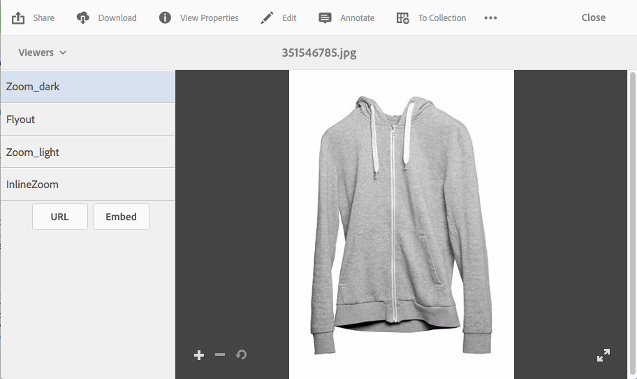

# Använda förinställningar för Dynamic Media Viewer {#applying-viewer-presets}

En visningsförinställning är en samling inställningar som bestämmer hur användare visar mediefiler på datorskärmar och mobila enheter. Du kan använda alla förinställningar för visningsprogram som du har skapat av administratören på en resurs.

Om du är administratör och måste hantera, skapa, sortera och ta bort visningsförinställningar kan du läsa [Hantera visningsförinställningar](managing-viewer-presets.md).

Se även [Publicera visningsförinställningar](managing-viewer-presets.md#publishing-viewer-presets).

Du behöver inte publicera förinställningar för visningsprogrammet beroende på vilket publiceringsläge du använder.

Problem med visningsförinställningar finns i [Felsöka dynamiska media](troubleshoot-dm.md#viewers).

## Använda en förinställning för Dynamic Media Viewer på en mediefil {#applying-a-viewer-preset-to-an-asset}

1. Öppna resursen och i den vänstra listen och välj **[!UICONTROL Viewers]**.

   

   * Knapparna **[!UICONTROL URL]** och **[!UICONTROL Embed]** visas när du har valt en visningsförinställning.
   * Systemet visar flera visningsförinställningar när du väljer visningsprogram för en resurs **[!UICONTROL Detail View]**. Du kan öka antalet förinställningar som visas. Se [Öka antalet visningsförinställningar som visas](managing-viewer-presets.md).

1. Välj ett visningsprogram i den vänstra rutan så att du kan använda det på resursen så som den visas i den högra rutan. Du kan också [kopiera URL:en för att dela](linking-urls-to-yourwebapplication.md) med andra användare.

## Hämta förinställda URL:er för visningsprogram {#obtaining-viewer-preset-urls}

Mer information om hur du hämtar URL:er för visningsförinställningar finns i [Länka URL:er till ditt webbprogram](linking-urls-to-yourwebapplication.md).
