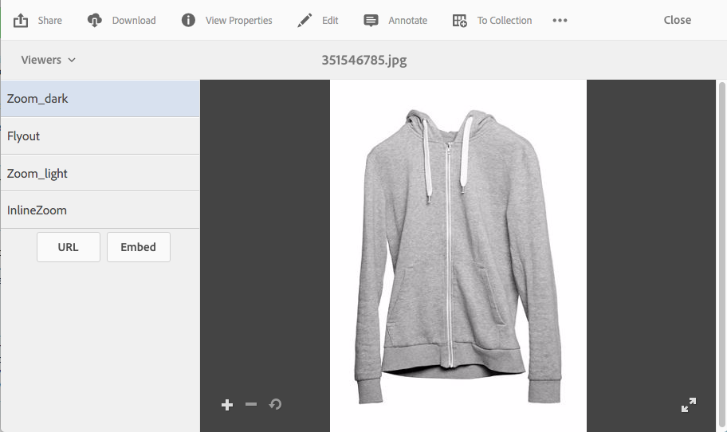

# Applying Dynamic Media viewer presets {#applying-viewer-presets}

En visningsförinställning är en samling inställningar som bestämmer hur användare visar mediefiler på datorskärmar och mobila enheter. Du kan använda alla förinställningar för visningsprogram som du har skapat av administratören på en resurs.

Om du är administratör och behöver hantera, skapa, sortera och ta bort visningsförinställningar läser du [Hantera visningsförinställningar](managing-viewer-presets.md).

Se även [Publicera förinställningar](managing-viewer-presets.md#publishing-viewer-presets)för visningsprogram.

Du kanske inte behöver publicera förinställningar för visningsprogrammet beroende på vilket publiceringsläge du använder.
Om du har problem med visningsförinställningarna läser du [Felsökning av dynamiska media - Scene7](troubleshoot-dm.md#viewers).

## Använda en förinställning för Dynamic Media Viewer på en mediefil {#applying-a-viewer-preset-to-an-asset}

1. Öppna resursen och tryck på **[!UICONTROL Viewers]** i den vänstra rutan.

   

   * Knapparna **[!UICONTROL URL]** och **[!UICONTROL Embed]** visas när du har valt en visningsförinställning.
   * Systemet visar flera visningsförinställningar när du väljer visningsprogram för en resurs **[!UICONTROL Detail View]**. Du kan öka antalet förinställningar som visas. Se [Öka antalet visningsförinställningar som visas](managing-viewer-presets.md).

1. Välj ett visningsprogram i den vänstra rutan för att använda det på resursen så som den visas i den högra rutan. Du kan också [kopiera URL-adressen för att dela](linking-urls-to-yourwebapplication.md) den med andra användare.

## Hämta förinställda URL:er för visningsprogram {#obtaining-viewer-preset-urls}

Mer information om hur du hämtar URL:er för visningsförinställningar finns i [Länka URL:er till webbprogrammet](linking-urls-to-yourwebapplication.md).
