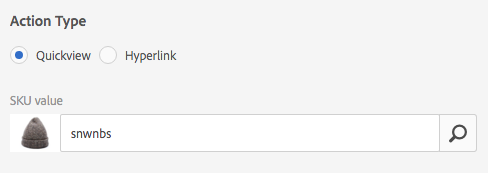

# Arbeta med väljare i Dynamic Media {#working-with-selectors}

När du arbetar med en interaktiv bild, interaktiv video eller Carousel Banner väljer du resurser och väljer webbplatser och produkter för aktiveringspunkter och bildscheman att länka till. När du arbetar med bilduppsättningar, snurruppsättningar och multimedieuppsättningar väljer du också resurser med resursväljaren.

Det här avsnittet handlar om hur du använder väljarna Produkt, Plats och Resurser, inklusive möjligheten att bläddra, filtrera och sortera i väljarna.

Du kommer åt väljarna när du skapar karuselluppsättningar, lägger till aktiveringspunkter och bildscheman, skapar interaktiva videor och bilder.

I den här Carousel-banderollen använder du produktväljaren om du länkar en hotspot eller bildschema till en snabbvysida. Använd webbplatsväljaren om du länkar en hotspot eller ett bildschema till en hyperlänk. använder du resursväljaren när du skapar en bildruta.

När du väljer (i stället för att ange manuellt) vart hotspot-områden eller bildscheman ska gå, använder du väljaren. Webbplatsväljaren fungerar bara om du är Adobe Experience Manager Sites-kund. Produktväljaren kräver också Experience Manager Commerce.

## Välja produkter i Dynamic Media {#selecting-products}

Använd produktväljaren för att välja en produkt när du vill ha en aktiveringspunkt eller bildschema för att få en snabbvy till en viss produkt i produktkatalogen.

1. Navigera till karuselluppsättningen, den interaktiva bilden eller den interaktiva videon och tryck på fliken **[!UICONTROL Actions]** (endast tillgänglig om du har definierat ett hotspot-område eller bildschema).

   Produktväljaren finns i området **[!UICONTROL Action Type]**.

   

1. Tryck på ikonen **[!UICONTROL Product Selector]** (förstoringsglas) och navigera till en produkt i katalogen.

   

   Du kan filtrera efter nyckelord eller tagg genom att trycka på **[!UICONTROL Filter]** och ange nyckelord, markera taggar eller båda.

   

   Du kan ändra var Experience Manager bläddrar efter produktdata genom att trycka på **[!UICONTROL Browse]** och navigera till en annan mapp.

   

   Tryck på **[!UICONTROL Sort by]** för att ändra om Experience Manager ska sortera efter senaste till äldsta eller äldsta till nyaste.

   

   Tryck på **[!UICONTROL View as]** för att ändra hur produkter visas, antingen i **[!UICONTROL List View]** eller **[!UICONTROL Card View]**.

   

1. När produkten har valts fylls fältet i med produktminiatyrbilden och namnet.

   

1. I **[!UICONTROL Preview]**-läget kan du trycka på aktiveringspunkten eller bildschemat och se hur snabbvyn visas.

   

## Välja platser i Dynamic Media {#selecting-sites}

Använd webbplatsväljaren för att välja en webbsida när du vill att ett hotspot- eller bildschema ska länka till en webbsida som hanteras i Experience Manager.

1. Navigera till karuselluppsättningen, den interaktiva bilden eller den interaktiva videon och tryck på fliken **[!UICONTROL Actions]** (endast tillgänglig om du har definierat ett hotspot-område eller bildschema).

   Platsväljaren finns i avsnittet **[!UICONTROL Action Type]**.

   

1. Tryck på ikonen **[!UICONTROL Site Selector]** (mapp med förstoringsglas) och navigera till en sida på dina Experience Manager-platser som du vill länka hotspot eller bildschema till.

   

1. När platsen har valts fylls fältet i med sökvägen.

   

1. Om du trycker på hotspot eller bildschema i **[!UICONTROL Preview]**-läget navigerar du till den angivna Experience Manager-webbplatssidan.

## Välja resurser i Dynamic Media {#selecting-assets}

Använd den här väljaren för att välja bilder som ska användas i en Carousel Banner, en interaktiv video, bilduppsättningar, blandade medieuppsättningar och snurruppsättningar. I interaktiv video är resursväljaren tillgänglig när du trycker på **[!UICONTROL Select Assets]** på fliken **[!UICONTROL Content]**. I Carousel Sets är resursväljaren tillgänglig när du skapar en bildruta. I Bilduppsättningar, Blandade medieuppsättningar och Snurra uppsättningar är resursväljaren tillgänglig när du skapar en bilduppsättning, blandad medieuppsättning eller snurra uppsättning.

Mer information finns även i [Resursväljaren](/help/assets/search-assets.md#asset-selector).

1. Navigera till Carousel Set och skapa en bild. Du kan också navigera till den interaktiva videon, gå till fliken **[!UICONTROL Content]** och sedan välja resurser. Du kan också skapa en uppsättning med blandade media, bilduppsättning eller snurra.
1. Tryck på ikonen **[!UICONTROL Asset Selector]** (mapp med förstoringsglas) och navigera till en resurs.

   

   Filtrera efter nyckelord eller tagg genom att trycka på **[!UICONTROL Filter]** och ange nyckelord, lägga till villkor eller båda.

   

   Du kan ändra var Experience Manager ska bläddra efter resurser genom att navigera till en annan mapp i fältet **[!UICONTROL Path]**.

   Tryck på **[!UICONTROL Collection]** om du bara vill söka efter resurser i samlingar.

   

   Tryck på **[!UICONTROL View as]** för att ändra hur produkter visas, antingen i **[!UICONTROL List View]**, **[!UICONTROL Column View]** eller **[!UICONTROL Card View]**.

   

1. Markera resursen genom att trycka på bockmarkeringen. Resursen visas.

   
-->
