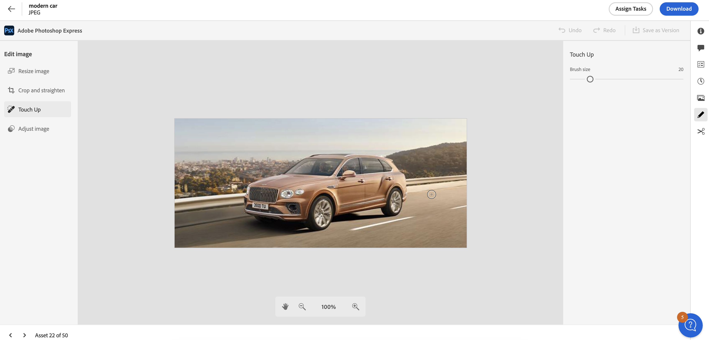
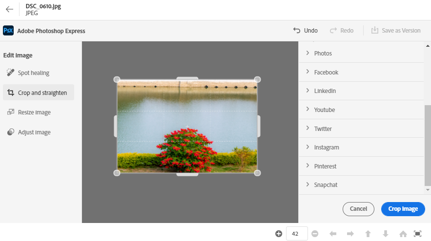
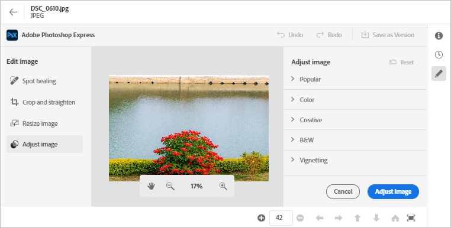

# Redigera bilder i [!DNL Assets view] {#edit-images}

[!DNL Assets view] innehåller användarvänliga redigeringsalternativ som bygger på [!DNL Adobe Photoshop Express]. De redigeringsåtgärder som är tillgängliga är Punktlagning, Beskär och räta upp, Ändra storlek på bild och Justera bild.

När du har redigerat en bild kan du spara den nya bilden som en ny version. Versionshantering hjälper dig att vid behov återställa den ursprungliga resursen senare. Om du vill redigera en bild [öppna förhandsgranskningen](/help/assets/navigate-assets-view.md#preview-assets) och klicka **[!UICONTROL Edit Image]**  från järnvägen till höger.

*Bild: Alternativen för att redigera bilder är [!DNL Adobe Photoshop Express].*

## Dekorlagningsbilder {#spot-heal-images}

Om det finns små fläckar eller små objekt på en bild kan du redigera och ta bort fläckar med hjälp av funktionen för punktlagning i Adobe Photoshop.

Penseln samplar det retuscherade området och gör att de reparerade pixlarna blandas smidigt i resten av bilden. Använd en penselstorlek som bara är något större än den punkt du vill korrigera.

<!-- 
TBD: See if we should give backlinks to PS docs for these concepts.
For more information about how Spot Healing works in Photoshop, see [retouching and repairing photos](https://helpx.adobe.com/photoshop/using/retouching-repairing-images.html). 
-->

## Beskära och räta upp bilder {#crop-straighten-images}

Med alternativet Beskär och räta upp kan du göra grundläggande beskärning, rotera bilden, vända den horisontellt eller vertikalt och beskära den till dimensioner som passar för populära webbplatser för sociala medier.

Klicka på **[!UICONTROL Crop Image]**. När du har redigerat kan du spara den nya bilden som en version.

Med många standardalternativ kan du beskära bilden till de bästa proportioner som passar olika profiler och inlägg på sociala medier.

## Ändra bildstorlek {#resize-image}

Att ändra storlek på en bild till en viss storlek är ett vanligt användningsexempel. [!DNL Assets view] Med kan du snabbt ändra storlek på bilden så att den passar de vanliga fotostorlekarna genom att tillhandahålla förberäknade nya upplösningar för specifika fotostorlekar. Du kan visa de vanliga fotostorlekarna i centimeter eller tum för att ta reda på måtten. Som standard behåller metoden för storleksändring proportionerna. Om du vill åsidosätta proportionerna manuellt klickar du på .

Ange måtten och klicka på **[!UICONTROL Resize Image]** för att ändra storlek på bilden. Innan du sparar ändringarna som en version kan du antingen ångra alla ändringar som gjorts innan du sparar genom att klicka på [!UICONTROL Undo] Du kan också ändra det specifika steget i redigeringsprocessen genom att klicka på [!UICONTROL Revert].

## Justera bild {#adjust-image}

[!DNL Assets view] Med kan du justera färg, ton, kontrast med mera med bara några klick. Klicka **[!UICONTROL Adjust image]** i redigeringsfönstret. Följande alternativ är tillgängliga på den högra sidopanelen:

* **Populärt**: [!UICONTROL High Contrast & Detail], [!UICONTROL Desaturated Contrast], [!UICONTROL Aged Photo], [!UICONTROL B&W Soft]och [!UICONTROL B&W Sepia Tone].
* **Färg**: [!UICONTROL Natural], [!UICONTROL Bright], [!UICONTROL High Contrast], [!UICONTROL High Contrast & Detail], [!UICONTROL Vivid]och [!UICONTROL Matte].
* **Kreativ**: [!UICONTROL Desaturated Contrast], [!UICONTROL Cool Light], [!UICONTROL Turquoise & Red], [!UICONTROL Soft Mist], [!UICONTROL Vintage Instant], [!UICONTROL Warm Contrast], [!UICONTROL Flat & Green], [!UICONTROL Red Lift Matte], [!UICONTROL Warm Shadows]och [!UICONTROL Aged Photo].
* **Svartvitt**: [!UICONTROL B&W Landscape], [!UICONTROL B&W High Contrast], [!UICONTROL B&W Punch], [!UICONTROL B&W Low Contrast], [!UICONTROL B&W Flat], [!UICONTROL B&W Soft], [!UICONTROL B&W Infrared], [!UICONTROL B&W Selenium Tone], [!UICONTROL B&W Sepia Tone]och [!UICONTROL B&W Split Tone].
* **Vinjettering**: [!UICONTROL None], [!UICONTROL Light], [!UICONTROL Medium]och [!UICONTROL Heavy].

<!--
TBD: Insert a video of the available social media options.
-->

## Nästa steg {#next-steps}

* Ge produktfeedback med [!UICONTROL Feedback] alternativ som finns i användargränssnittet i resursvyn

* Ge feedback på dokumentationen med [!UICONTROL Edit this page]  eller [!UICONTROL Log an issue]  som finns till höger

* Kontakt [Kundtjänst](https://experienceleague.adobe.com/?support-solution=General#support)

>[!MORELIKETHIS]
>
>* [Visa versionshistorik för en resurs](/help/assets/navigate-assets-view.md)
