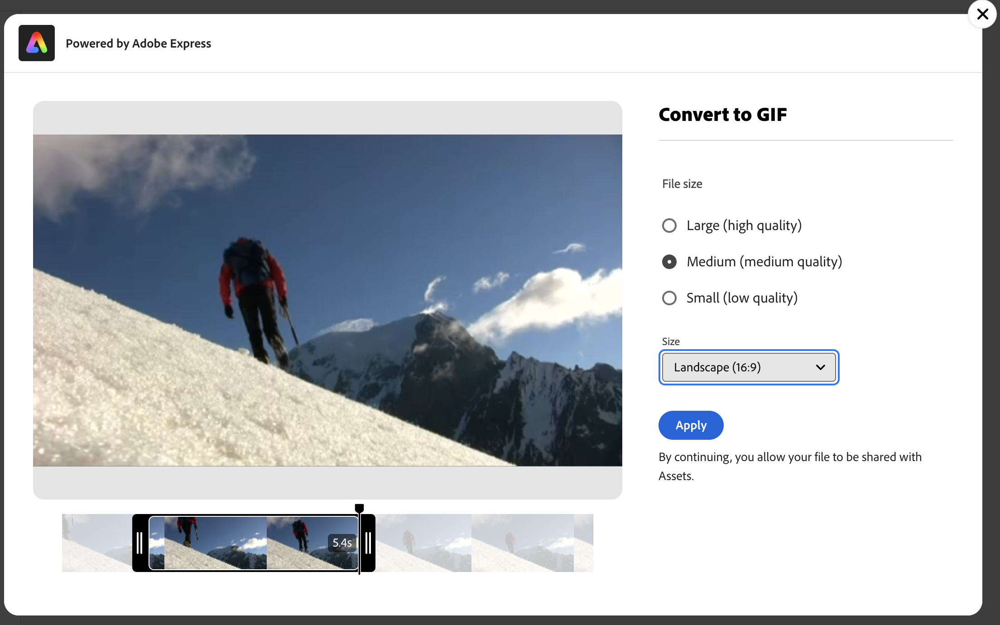

# Redigera videofilmer i [!DNL Assets view] {#edit-videos}

Det är enkelt för Assets-användare att skapa varianter av videoinnehåll med de inbäddade [!DNL Adobe Express] snabbåtgärderna för video. Snabbåtgärder i [!DNL Assets view] som drivs av [!DNL Adobe Express] innehåller användarvänliga videoredigeringsalternativ som beskärningsvideo, storleksändra video, trimma video och konvertera video till GIF.

Om du vill redigera en video går du till informationen för videon och klickar på [!UICONTROL Edit Video]. Du kan också markera resursen och klicka på detaljer och sedan klicka på ikonen  som finns i den högra rutan. När du har redigerat en video kan du spara den nya videon som en ny version eller som en ny resurs.

## Förutsättningar {#prerequisites}

Tillstånd att komma åt [!DNL Adobe Express] och minst en miljö i AEM Assets. Miljön kan vara någon av databaserna i [!DNL Assets as a Cloud Service] eller [!DNL Assets view].

## Redigera videofilmer med Adobe Express {#edit-video-using-express}

Det är enkelt att omvandla en video till en perfekt storlek och orientering med hjälp av inbäddade [!DNL Adobe Express] snabbåtgärder.

### Beskära video {#crop-video-using-express}

Du kan ta bort oönskade delar från videon med hjälp av inbäddade [!DNL Adobe Express] snabbåtgärder. Gör så här:

1. Markera en video och klicka på **[!UICONTROL Edit]**.
2. Klicka på **[!UICONTROL Crop Video]** bland de snabbåtgärder som är tillgängliga i den vänstra rutan.
3. Dra handtagen i hörnen av videon för att skapa önskad beskärning eller välj önskad skärmstorlek.
4. Du kan välja att stänga av eller slå på ljudet i videon.
5. Klicka på **[!UICONTROL Apply]**.
   

   Den beskurna videon är tillgänglig för hämtning. Du kan antingen spara den redigerade resursen som en ny version av samma resurs eller spara den som en ny resurs. 

### Ändra storlek på video {#resize-video-using-express}

Slutligt videoinnehåll i DAM behöver ofta storleksändras för distribution till specifika kanaler. Med [!DNL Assets view] kan du enkelt ändra storlek på video så att den passar de dimensioner som krävs i vanliga sociala kanaler, och du kan även ändra storlek till anpassade upplösningar. Om du vill ändra storlek på videon med [!DNL Assets view] ska du utföra stegen nedan:

1. Markera en video och klicka på **[!UICONTROL Edit]**.
2. Klicka på **[!UICONTROL Resize Video]** bland de snabbåtgärder som är tillgängliga i den vänstra rutan.
3. Välj lämpliga dimensioner från plattformen för sociala medier i listrutan **[!UICONTROL Resize for the]**. Du kan också dra handtagen i hörnen av videon för att skapa önskad beskärning.
4. Skala videon, om det behövs, med fältet **[!UICONTROL Video Scale]**.
5. Du kan välja att stänga av eller slå på ljudet i videon.
6. Klicka på **[!UICONTROL Apply]** för att tillämpa ändringarna.
   

Den storleksändrade videon kan laddas ned. Du kan antingen spara den redigerade resursen som en ny version av samma resurs eller spara den som en ny resurs.

### Trimma video {#trim-video-using-express}

Om du behöver använda ett klipp av en större video kan du använda funktionen **[!UICONTROL Trim Video]** för att markera och trimma ett avsnitt i videon. Utför stegen nedan:

1. Markera en video och klicka på **[!UICONTROL Edit]**.
2. Klicka på **[!UICONTROL Trim Video]** bland de snabbåtgärder som är tillgängliga i den vänstra rutan.
3. Ange start- och sluttid för videon för att trimma en viss del av den. Du kan också dra handtagen i hörnen av videon för att skapa önskad trimning.
4. Välj lämpliga dimensioner i listrutan **[!UICONTROL Size]**.
5. Du kan välja att stänga av eller slå på ljudet i videon.
6. Klicka på **[!UICONTROL Apply]** för att tillämpa ändringarna.
   

Din trimmade video är tillgänglig för hämtning. Du kan antingen spara den redigerade resursen som en ny version av samma resurs eller spara den som en ny resurs.

### Konvertera video till GIF {#convert-mp4-to-gif-using-express}

Du kan snabbt konvertera en MP4-video till ett GIF-format med Adobe Express. Utför följande steg:

1. Markera en video och klicka på **[!UICONTROL Edit]**.
2. Klicka på **[!UICONTROL Convert to GIF]** bland de snabbåtgärder som är tillgängliga i den vänstra rutan.
3. Välj lämplig filstorlek baserat på önskad kvalitet. Välj dessutom orientering för liggande, stående eller fyrkant.
4. Dra handtagen på hörnen av videon för att skapa önskad beskärning.
5. Klicka på **[!UICONTROL Apply]**.

   

Din video finns i GIF-format för nedladdning. Du kan antingen spara den redigerade resursen som en ny version av samma resurs eller spara den som en ny resurs.

## Begränsningar {#limitations-video-adobe-express}

* Det går bara att redigera videoklipp i MP4-format.

* Den maximala källfilsstorlek som stöds är 1 GB.

* Videor som stöds är större än 46 pixlar och mindre än 3 840 pixlar på alla sidor.

* De webbläsare som stöds är Google Chrome, Firefox, Safari och Edge.

* Funktionen kan inte öppnas i inkodade lägen i en webbläsare.

### Nästa steg {#next-steps}

* Ge produktfeedback med alternativet [!UICONTROL Feedback] som finns i användargränssnittet i Assets-vyn.

* Ge feedback genom att [!UICONTROL Edit this page]  eller [!UICONTROL Log an issue]  som är tillgängligt på den högra sidopanelen.

* Kontakta [kundtjänst](https://experienceleague.adobe.com/sv?support-solution=General#support).

>[!MORELIKETHIS]
>
>* [Redigera bilder i Assets-vyn](edit-images-assets-view.md)
>* [Förhandsvisning av en resurs](navigate-assets-view.md)
