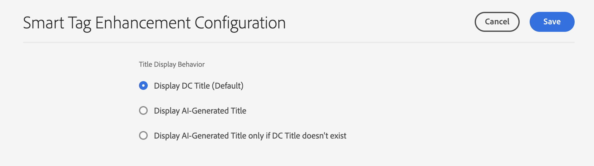

# Förbättra innehållsidentifiering med AI-genererade metadata {#ai-smart-tags}

| Gränssnitt | Artikellänk |
| -------- | ---------------------------- |
| Assets View | [Klicka här](/help/assets/ai-generated-metadata-assets-view.md) |
| Administratörsvy | Den här artikeln |

I stället för att förlita sig på manuell inmatning tilldelar AI automatiskt beskrivande taggar till digitala resurser. Dessa AI-genererade taggar förbättrar metadatakvaliteten och gör materialet enklare att söka, kategorisera och rekommendera. Detta tillvägagångssätt förbättrar inte bara effektiviteten genom att eliminera manuell taggning, utan garanterar också enhetlighet och skalbarhet för stora volymer digitalt innehåll. Om resursen till exempel är en bild kan AI identifiera objekt, scener, känslor eller till och med varumärkeslogotyper i den och generera relevanta taggar som&quot;solnedgång&quot;,&quot;strand&quot;,&quot;semester&quot; eller&quot;leende&quot;. AI-genererat innehåll kan förbättra sökningen efter resurser genom att använda både semantiska och lexikala söktekniker. Se mer [Sök i Assets](search-assets.md). <!--If the asset is a document, AI reads and interprets the text to assign meaningful keywords that summarize its content—such as "climate change," "policy," or "renewable energy.-->

## Hur aktiverar jag AI-genererade metadata? {#enable-ai-generated-metadata}

Så här aktiverar du AI-genererade metadata:

* Den lägsta version av AEM som krävs är `20626`.

## Konfigurera AI-genererade titlar {#configure-ai-generated-titles}

Med AEM kan du konfigurera visningen av resursrubriker i kortvyn eller listvyn på sidan Resursbläddring. Du kan välja att visa resurstiteln som du har definierat, titeln som har genererats med AI, eller använda AI-genererad titel endast om det inte finns någon befintlig titel för resursen.

Så här konfigurerar du AI-genererade titlar:

1. Navigera till **[!UICONTROL Tools > Assets > Assets Configurations > Smart Tag Enhancement Configuration]**.

1. Välj något av följande alternativ:

   * **Visa DC-titel (standard)**: Ange den titel i fältet **[!UICONTROL Title]** som är tillgänglig i resursegenskaperna för att visa den i kortvyn eller listvyn. Om objektets titel inte är definierad visas filnamnet i AEM Assets.

   * **Visa AI-genererad titel**: Visar den AI-genererade titeln och ignorerar den titel som anges i resursegenskaperna. Om AI-genererad titel inte är tillgänglig för en resurs visar AEM Assets standardresursens titel som är tillgänglig i dess egenskaper.

   * **Visa endast AI-genererad titel om det inte finns någon DC-titel**: AEM Assets visar endast den AI-genererade titeln om resurstiteln inte har definierats för en resurs.

     

## Använda AI-genererade metadata {#using-ai-generated-smart-tags}

<!--[!NOTE]
>
>The enhanced smart tags capability is available only for the newly uploaded assets.
-->

Utför följande steg om du vill använda den förbättrade funktionen för smarta taggar:

1. Gå till önskad mapp i gränssnittet [!DNL Experience Manager] och klicka på **[!UICONTROL Add Assets]**. <!--Alternatively, to update enhanced smart tags in an existing content, click **[!UICONTROL reprocess]**.--> De kompatibla bildfilformaten är `png`, `jpg`, `jpeg`,`psd`, `tiff`, `gif`, `webp`, `crw`, `cr2`, `3fr`, `nef`, `arw` och `bmp`.

1. Vänta tills den nyligen överförda resursen bearbetas. Gå till resursegenskaper när du är klar.

1. Gå till fliken **[!UICONTROL AI-Generated]**. Om versionen [!DNL Experience Manager] är inkompatibel eller inte uppdaterad visas inte den här fliken. Följande fält finns där:

   * **[!UICONTROL Generated title]:** Titeln innehåller en tydlig och kortfattad rubrik som beskriver kärnidén för en överförd resurs, vilket gör det enkelt att förstå direkt. När du lägger till en resurs visas den i resursvyn om du anger en titel (i `dc:title`). Om inget anges tilldelas en AI-genererad titel automatiskt.
   * **[!UICONTROL Generated description]:** Beskrivningen ger en kort men informativ sammanfattning av vad resursen handlar om, vilket hjälper användare och sökmoduler att snabbt förstå dess relevans.
   * **[!UICONTROL Generated keywords]:** Nyckelorden är måltermer som representerar huvudteman för en resurs, vilket underlättar taggning och innehållsfiltrering.

1. [Valfritt] Du kan lägga till ytterligare taggar eller skapa egna om du tror att relevanta taggar saknas. Det gör du genom att skriva dina taggar i fältet **[!UICONTROL Generated keywords]** och klicka på **[!UICONTROL Save]**.

## Inaktivera AI-genererade metadata {#disable-ai-generated-metadata}

Du kan inaktivera AI-genererade metadata för din AEM as a Cloud Service-miljö eller så kan du inaktivera dem på mappnivå.

Så här inaktiverar du AI-genererade metadata för AEM as a Cloud Service-miljön:

1. Navigera till **[!UICONTROL Tools > Assets > Assets Configurations > Smart Tag Enhancement Configuration]**.

1. Välj **[!UICONTROL Disable Smart Tag Enhancements]**.

1. Klicka på **[!UICONTROL Save]** .

De AI-genererade metadata inaktiveras för nya resurser eller mappar som du överför till AEM Assets. De befintliga resurserna eller mapparna som har AI-genererade metadatafält som redan genererats fortsätter att visa dessa fält.

### Inaktivera AI-genererade metadata för mappar {#disable-ai-generated-metadata-folder-level}

Så här inaktiverar du AI-genererade metadata på mappnivå:

1. Markera mappen och klicka på **[!UICONTROL Properties]**.

1. Välj fliken **[!UICONTROL Asset Processing]**.

1. I avsnittet **[!UICONTROL Smart Tags Enhancements for images]** väljer du **[!UICONTROL Disable]** i listrutan.

1. Klicka på **[!UICONTROL Save & Close]** om du vill inaktivera AI-genererade metadata för den valda mappen.