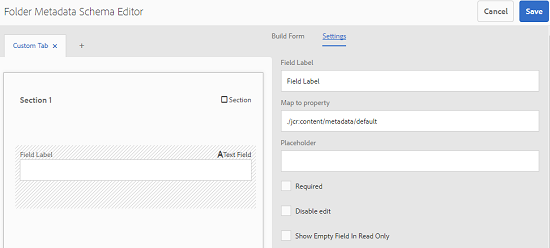

# Folder Metadata Schema {#folder-metadata-schema}

Med Adobe Experience Manager (AEM) Assets kan du skapa metadatamappar för resursmappar, som definierar layouten och metadata som visas på mappegenskapssidor.

## Lägga till ett schemaformulär för mappmetadata {#add-a-folder-metadata-schema-form}

Använd schemaredigeraren för mappmetadata i Forms för att skapa och redigera metadatascheman för mappar.

1. Tryck/klicka på AEM-logotypen och gå till **[!UICONTROL Tools]** > **[!UICONTROL Assets]** > **[!UICONTROL Folder Metadata Schemas]**.
1. På Forms-sidan för mappmetadataschema trycker/klickar du på **[!UICONTROL Create]**.
1. Ange ett namn för formuläret och tryck/klicka på **[!UICONTROL Create]**. Det nya schemaformuläret visas på Forms-sidan Schema.

## Redigera schemaformulär för mappmetadata {#edit-folder-metadata-schema-forms}

Du kan redigera ett nyligen tillagt eller befintligt metadatchemaformulär, som innehåller följande:

* Tabbar
* Formulärobjekt på flikar.

Du kan mappa/konfigurera dessa formulärobjekt till ett fält i en metadatanod i CRX-databasen. Du kan lägga till nya flikar eller formulärobjekt i metadatchemaformuläret.

1. På Forms-sidan Schema väljer du det formulär du skapade och trycker/klickar sedan på **[!UICONTROL Edit]** -ikonen i verktygsfältet.
1. Tryck/klicka på ikonen på sidan Schemaredigerare för mappmetadata för att lägga till en flik i formuläret. **[!UICONTROL +]** Om du vill byta namn på fliken trycker/klickar du på standardnamnet och anger det nya namnet under **[!UICONTROL Settings]**.

   

   Om du vill lägga till fler flikar trycker/klickar du på **[!UICONTROL +]** -ikonen. Tryck/klicka **[!UICONTROL X]** för att ta bort en flik.

1. Lägg till en eller flera komponenter från **[!UICONTROL Build Form]** fliken på den aktiva fliken.

   

   Om du skapar flera flikar trycker/klickar du på en viss flik för att lägga till komponenter.

1. Om du vill konfigurera en komponent markerar du den och ändrar dess egenskaper på **[!UICONTROL Settings]** fliken.

   Om det behövs tar du bort en komponent från **[!UICONTROL Settings]** fliken.

   

1. Tryck/klicka **[!UICONTROL Save]** i verktygsfältet för att spara ändringarna.

### Komponenter för att skapa formulär {#components-to-build-forms}

På **[!UICONTROL Build Form]** fliken visas formulärobjekt som du använder i schemaformuläret för mappmetadata. På fliken **[!UICONTROL Settings]** visas attributen för varje objekt som du väljer på **[!UICONTROL Build Form]** fliken. Här är en lista över tillgängliga formulärobjekt på **[!UICONTROL Build Form]** fliken:

<table>
 <tbody>
  <tr>
   <td>
<strong>Komponentnamn</strong>
 </td>
   <td>
<strong>Beskrivning</strong>
 </td>
  </tr>
  <tr>
   <td>
Avsnittshuvud
 </td>
   <td>
 Lägg till en avsnittsrubrik för en lista med gemensamma komponenter.
 </td>
  </tr>
  <tr>
   <td>
Enkelradstext
 </td>
   <td>
 Lägg till en enkelradig textegenskap. Den lagras som en sträng.
 </td>
  </tr>
  <tr>
   <td>
Flervärdestext
 </td>
   <td>
 Lägg till en textegenskap med flera värden. Den lagras som en strängarray.
 </td>
  </tr>
  <tr>
   <td>
Siffra
 </td>
   <td>
 Lägg till en sifferkomponent.
 </td>
  </tr>
  <tr>
   <td>
Date
 </td>
   <td>
 Lägg till en datumkomponent.
 </td>
  </tr>
  <tr>
   <td>
Listruta
 </td>
   <td>
 Lägg till en nedrullningsbar lista.
 </td>
  </tr>
  <tr>
   <td>
Standardtaggar
 </td>
   <td>
 Lägg till en tagg. 
 </td>
  </tr>
  <tr>
   <td>
Dolt fält
 </td>
   <td>
 Lägg till ett dolt fält. Den skickas som en POST-parameter när resursen sparas.
 </td>
  </tr>
 </tbody>
</table>

### Redigera formulärobjekt {#editing-form-items}

Om du vill redigera egenskaperna för formulärobjekt trycker/klickar du på komponenten och redigerar alla eller en delmängd av följande egenskaper på **[!UICONTROL Settings]** fliken.

**[!UICONTROL Field Label]**: Namnet på metadataegenskapen som visas på egenskapssidan för mappen.

**[!UICONTROL Map to Property]**: This property specifies the relative path of the folder node in the CRX database where it is saved. Det börjar med &quot;**./**&quot;, vilket anger att sökvägen finns under mappens nod.

Följande är giltiga värden för den här egenskapen:

* `./jcr:content/metadata/dc:title`: Lagrar värdet i mappens metadatanod som egenskap `dc:title`.

* `./jcr:created`: Lagrar datum och tid för när en resurs skapades. Det är en skyddad egenskap. Om du konfigurerar de här egenskaperna bör du markera dem som [!UICONTROL Disable Edit].

För att komponenten ska visas på rätt sätt i schemaformuläret för metadata ska du inte ta med något utrymme i egenskapssökvägen.

**[!UICONTROL JSON Path]**: Använd den för att ange sökvägen till JSON-filen där du anger nyckelvärdepar för alternativ.

**[!UICONTROL Placeholder]**: Använd den här egenskapen för att ange relevant platshållartext för metadataegenskapen.

**[!UICONTROL Choices]**: Använd den här egenskapen för att ange alternativ i en lista.

**[!UICONTROL Description]**: Använd den här egenskapen om du vill lägga till en kort beskrivning för metadatakomponenten.

**[!UICONTROL Class]**: Den objektklass som egenskapen är associerad med.

## Ta bort schemaformulär för mappmetadata {#delete-folder-metadata-schema-forms}

Du kan ta bort schemaformulär för mappmetadata från Forms-sidan för mappmetadataschema. Om du vill ta bort ett formulär markerar du det och trycker/klickar på ikonen Ta bort i verktygsfältet.

## Tilldela ett mappmetadatchema {#assign-a-folder-metadata-schema}

Du kan tilldela ett mappmetadatchema till en mapp från Forms-sidan för mappmetadataschema eller när du skapar en mapp.

Om du konfigurerar ett metadataschema för en mapp lagras sökvägen till schemaformuläret i mappnodens egenskap under `folderMetadataSchema` .*/jcr:content*.

### Tilldela till ett schema från sidan Mappmetadatamatchema {#assign-to-a-schema-from-the-folder-metadata-schema-page}

1. Tryck/klicka på AEM-logotypen och gå till **[!UICONTROL Tools]** > **[!UICONTROL Assets]** > **[!UICONTROL Folder Metadata Schemas]**.
1. På Forms-sidan för mappmetadataschema väljer du det schemaformulär som du vill tillämpa på en mapp.
1. From the toolbar, tap/click **[!UICONTROL Apply to Folder(s)]**.

1. Välj den mapp som du vill använda schemat på och klicka/tryck sedan på **[!UICONTROL Apply]**. Om ett metadatamatchema redan används för mappen visas ett varningsmeddelande om att du håller på att skriva över det befintliga metadatamodemet. Tryck/klicka på **[!UICONTROL Overwrite]**.
1. Öppna metadataegenskaperna för den mapp som du tillämpade metadataschemat på.

   

   Om du vill visa fälten för mappmetadata trycker/klickar du på fliken **[!UICONTROL Folder Metadata]**.

   

### Tilldela ett schema när du skapar en mapp {#assign-a-schema-when-creating-a-folder}

Du kan tilldela ett mappmetadatchema när du skapar en mapp. Om det finns minst ett mappmetadatchema i systemet visas en extra lista i **[!UICONTROL Create Folder]** dialogrutan. Du kan välja önskat schema. Som standard är inget schema valt.

1. I AEM Assets-användargränssnittet: tryck/klicka **[!UICONTROL Create]** i verktygsfältet.
1. Ange en rubrik och ett namn för mappen.
1. Välj önskat schema i listan Mappmetadatamatchema. Tryck/klicka sedan på **[!UICONTROL Create]**.

   

1. Öppna metadataegenskaperna för den mapp som du tillämpade metadataschemat på.
1. Om du vill visa fälten för mappmetadata trycker/klickar du på fliken **[!UICONTROL Folder Metadata]**.

## Använd mappens metadatamatchema {#use-the-folder-metadata-schema}

Öppna egenskaperna för en mapp som har konfigurerats med ett schema för mappmetadata. En flik för **[!UICONTROL Folder Metadata]** visas på sidan med mappegenskaper. Om du vill visa formuläret för schemat med mappmetadata väljer du den här fliken.

Ange metadatavärden i de olika fälten och tryck/klicka för **[!UICONTROL Save]** att lagra värdena. De värden du anger lagras i mappnoden i CRX-databasen.

