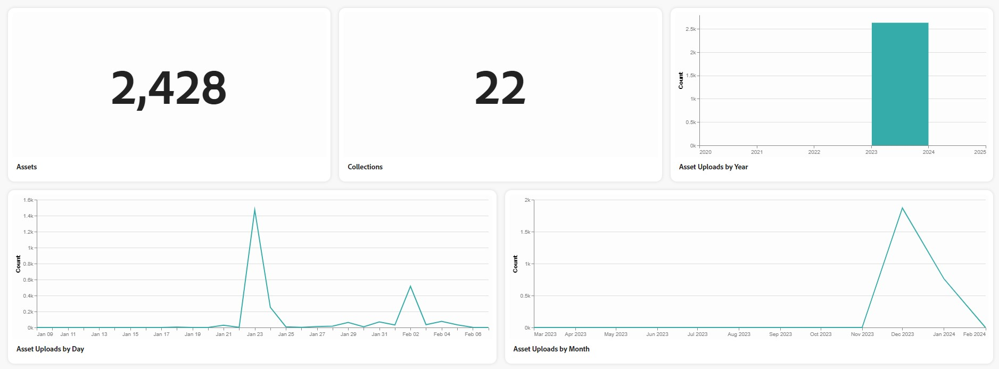

# Assets Insikter i [!DNL Content Hub] {#assets-insights}

[!DNL Content Hub] ger värdefulla insikter om resurser, och tar itu med en vanlig utmaning som marknadsföringsintressenter ofta stöter på - statistik om resursanvändning som används i marknadsföringskampanjer, kanaler och olika regioner. Genom att få en tydlig förståelse för resursernas prestanda och popularitet kan ni få användbara insikter som är viktiga för att förbättra användarupplevelsen.

## Visa statistik för överförda tillgångar{#view-statistics-for-uploaded-assets}

Du kan visa statistik för överförda resurser och samlingar genom att navigera till **[!UICONTROL Insights]** -fliken. Spåra överföringshistoriken för dina resurser med den årliga, månatliga och dagliga resursuppladdningsvyn.

<!-- You can track the upload history of your assets over the past 30 days or gain a more comprehensive view with data spanning the last 12 months. This feature enables you to evaluate the upload count of assets.  -->

<!-- Go to the **[!UICONTROL [!DNL Insights]]** tab.

2. Select the desired time frame to view the statistics; you can opt for either last 30 days or last 12 months.

Data for the selected time frame is displayed, including the upload count for the specified duration. -->

## Visa detaljerad statistisk analys{#view-detailed-statistical-analysis}

Med Content Hub kan ni visa statistik över antalet mediefiler baserat på deras filformat, kampanjer, kanaler och regioner. Ni kan få värdefulla insikter om tillgångsdistribution, vilket underlättar välgrundat beslutsfattande och strategisk planering.

I tabellen visas en detaljerad översikt över olika resurser, inklusive antal och respektive procentandel i databasen. Du kan justera kolumnstorlekar och sortera resurser efter resursnamn, antal och procent.

Cirkeldiagrammet visar det totala antalet mediefiler per filformat, vilket ger en tydlig bild av antalet enskilda mediefiler och deras motsvarande procentandelar.

Du kan även visa:

* **Aktiva användare per dag och månad**: Antal aktiva användare per dag eller månad som representeras med ett linjediagram.
* **[!UICONTROL Assets by Campaigns]**: Antal tillgångar och respektive procentandel baserat på kampanjer.
* **[!UICONTROL Assets by Channels]**: Antal tillgångar och respektive procentandel baserat på vilka kanaler som används.
* **[!UICONTROL Assets by Regions]**: Antal tillgångar och respektive procentandel baserat på områden där tillgångarna används.

