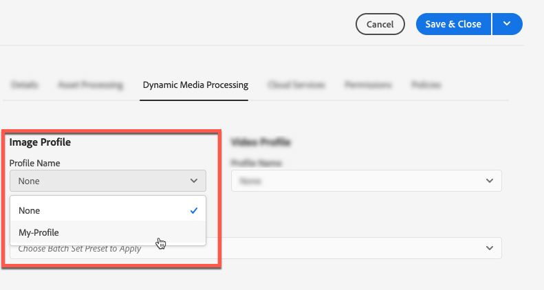

# Hantera resurser {#manage-assets}

I den här artikeln beskrivs hur du hanterar och redigerar resurser i Adobe Experience Manager (AEM) Assets. Mer information om hur du hanterar innehållsfragment finns i [Innehållsfragmentresurser](content-fragments/content-fragments.md) .

## Skapa mappar {#creating-folders}

När du organiserar en samling resurser, till exempel alla `Nature` bilder, kan du skapa mappar som håller ihop dem. Du kan använda mappar för att kategorisera och ordna dina resurser. AEM Resurser kräver inte att du ordnar resurser i mappar för att de ska fungera bättre.

>[!NOTE]
>
>Delning av en resursmapp av den typen `sling:OrderedFolder`stöds inte när den delas till Marketing Cloud. Om du vill dela en mapp ska du inte välja [!UICONTROL Ordnad] när du skapar en mapp.

1. Navigera till den plats i mappen med digitala resurser där du vill skapa en ny mapp. Klicka på **[!UICONTROL Skapa]** på menyn. Välj **[!UICONTROL Ny mapp]**.
1. Ange ett mappnamn i fältet **[!UICONTROL Titel]** . Som standard använder DAM den titel som du angav som mappnamn. När mappen har skapats kan du åsidosätta standardmappen och ange ett annat mappnamn.
1. Klicka på **[!UICONTROL Skapa]**. Mappen visas i mappen med digitala resurser.

Följande (blankstegsavgränsad lista med) tecken stöds inte:

* Namnet på en resursfil får inte innehålla något av följande tecken: `* / : [ \\ ] | # % { } ? &`
* Namnet på en resursmapp får inte innehålla något av följande tecken: `* / : [ \\ ] | # % { } ? \" . ^ ; + & \t`

## Överför resurser {#uploading-assets}

Mer information finns i [Lägga till digitala resurser i Experience Manager](add-assets.md).

## Förhandsgranska resurser {#previewing-assets}

Följ de här stegen för att förhandsgranska en resurs.

1. Navigera från användargränssnittet Resurser till platsen för den resurs som du vill förhandsgranska.
1. Tryck på önskad resurs för att öppna den.

1. I förhandsgranskningsläget är zoomalternativ tillgängliga för bildtyper [som](/help/assets/file-format-support.md) stöds (med interaktiv redigering).

   Om du vill zooma in på en resurs trycker/klickar du `+` (eller trycker/klickar på förstoringsglaset på resursen). Om du vill zooma ut trycker/klickar du `-`. När du zoomar in kan du titta närmare på alla delar av bilden genom att panorera. Med den återställda zoompilen återgår du till den ursprungliga vyn.

   Tryck på **[!UICONTROL Återställ]** om du vill återställa vyn till den ursprungliga storleken.

## Redigera egenskaper {#editing-properties}

1. Navigera till platsen för resursen vars metadata du vill redigera.

1. Markera resursen och visa resursegenskaperna genom att trycka/klicka på **[!UICONTROL Egenskaper]** i verktygsfältet. Du kan också välja snabbåtgärden **[!UICONTROL Egenskaper]** på resurskortet.

   

1. Redigera metadataegenskaperna under olika flikar på sidan [!UICONTROL Egenskaper] . Du kan till exempel redigera titeln, beskrivningen och så vidare på fliken **[!UICONTROL Grundläggande]** .

   >[!NOTE]
   >
   >Layouten på sidan [!UICONTROL Egenskaper] och de metadataegenskaper som är tillgängliga beror på det underliggande metadataschemat. Mer information om hur du ändrar layouten på sidan [!UICONTROL Egenskaper] finns i [Metadatamcheman](/help/assets/metadata-schemas.md).

1. Om du vill schemalägga ett visst datum/tid för aktiveringen av tillgången använder du datumväljaren bredvid fältet **[!UICONTROL I tid]** .

   

1. Om du vill inaktivera tillgången efter en viss tid väljer du datum/tid för inaktiveringen i datumväljaren bredvid fältet **[!UICONTROL Av tid]** . Inaktiveringsdatumet ska vara senare än aktiveringsdatumet för en tillgång. Efter [!UICONTROL Av-tid]är en resurs och dess återgivningar inte tillgängliga vare sig via webbgränssnittet Resurser eller via HTTP-API:t.

   

1. Markera en eller flera taggar i fältet **[!UICONTROL Taggar]** . Om du vill lägga till en egen tagg skriver du namnet på taggen i rutan och trycker på Retur. Den nya taggen sparas i AEM.

   YouTube kräver att taggar ska publiceras och har en länk till YouTube (om en lämplig länk finns).

   >[!NOTE]
   >
   >Om du vill skapa taggar måste du ha skrivbehörighet på `/content/cq:tags/default` sökvägen i CRX-databasen.

1. Om du vill visa användningsstatistik för resursen klickar du på/trycker på fliken **[!UICONTROL Insikter]** .

   Användningsstatistik omfattar följande:

   * Antal gånger som resursen visats eller hämtats
   * Kanaler/enheter som resursen användes via
   * Kreativa lösningar där resursen nyligen användes
   Mer information finns i [Resursinsikter](assets-insights.md).

1. Tryck/klicka på **[!UICONTROL Spara och stäng]**.

1. Navigera till användargränssnittet Resurser. De redigerade metadataegenskaperna, inklusive rubrik, beskrivning och taggar, visas på resurskortet i kortvyn och under relevanta kolumner i listvyn.

## Kopiera resurser {#copying-assets}

När du kopierar en resurs eller en mapp kopieras hela resursen eller mappen tillsammans med dess innehållsstruktur. En kopierad resurs eller en mapp dupliceras på målplatsen. Resursen på källplatsen ändras inte.

Några attribut som är unika för en viss kopia av en tillgång överförs inte. Några exempel är:

* Relativ sökväg, resurs-ID, datum och tid när de skapades samt versioner och versionshistorik. Vissa av dessa egenskaper indikeras av egenskaperna `dam:relativePath`, `jcr:uuid`, `jcr:created`och `cq:name`.

* Skapandetid och refererade sökvägar är unika för varje resurs och för varje återgivning.

Övriga egenskaper och metadatainformation behålls. Ingen del av kopian skapas när en resurs kopieras.

1. Välj en eller flera resurser i resursgränssnittet och tryck/klicka sedan på ikonen **[!UICONTROL Kopiera]** i verktygsfältet. Du kan också välja snabbåtgärden **[!UICONTROL Kopiera]**  från resurskortet.

   >[!NOTE]
   >
   >Om du använder snabbåtgärden [!UICONTROL Kopiera] kan du bara kopiera en resurs åt gången.

1. Navigera till den plats där du vill kopiera resurserna.

   >[!NOTE]
   >
   >Om du kopierar en resurs på samma plats, genererar AEM automatiskt en variant av namnet. Om du till exempel kopierar en resurs med namnet `Square`genererar AEM automatiskt titeln för kopian som `Square1`.

1. Klicka på ikonen **[!UICONTROL Klistra in]** resurs i verktygsfältet. Resurser kopieras till den här platsen.

   

   >[!NOTE]
   >
   >Ikonen **[!UICONTROL Klistra in]** är tillgänglig i verktygsfältet tills inklistringen är klar.

### Flytta eller byta namn på resurser {#moving-or-renaming-assets}

1. Navigera till platsen för resursen som du vill flytta.

1. Markera resursen och tryck/klicka på ikonen **[!UICONTROL Move]**  i verktygsfältet.

1. Gör något av följande i guiden Flytta resurser:

   * Ange namnet på resursen när den har flyttats. Tryck/klicka sedan på **[!UICONTROL Nästa]** för att fortsätta.

   * Tryck/klicka på **[!UICONTROL Avbryt]** för att avbryta processen.
   >[!NOTE]
   >
   >* Du kan ange samma namn för resursen om det inte finns någon resurs med det namnet på den nya platsen. Du bör emellertid använda ett annat namn om du flyttar resursen till en plats där det finns en resurs med samma namn. Om du använder samma namn genereras automatiskt en variant av namnet. Om resursen till exempel har namnet Fyrkant, genereras namnet Fyrkant1 för kopian.
   >* När namnet ändras tillåts inte tomt utrymme i filnamnet.

1. Gör något av följande i dialogrutan **[!UICONTROL Välj mål]** :

   * Navigera till den nya platsen för resurserna och fortsätt sedan genom att trycka/klicka på **[!UICONTROL Nästa]** .

   * Tryck/klicka på **[!UICONTROL Bakåt]** för att gå tillbaka till skärmen **[!UICONTROL Byt namn]** .

1. Om de resurser som flyttas har referenssidor, resurser eller samlingar visas fliken **[!UICONTROL Justera referenser]** bredvid fliken **[!UICONTROL Välj mål]** .

   Gör något av följande på skärmen **[!UICONTROL Justera referenser]** :

   * Ange vilka referenser som ska justeras baserat på de nya detaljerna och tryck/klicka sedan på **[!UICONTROL Flytta]** för att fortsätta.

   * Markera/avmarkera referenser till resurserna i kolumnen **[!UICONTROL Justera]** .
   * Tryck/klicka på **[!UICONTROL Bakåt]** för att gå tillbaka till skärmen **[!UICONTROL Välj mål]** .

   * Tryck/klicka på **[!UICONTROL Avbryt]** om du vill avbryta flyttningen.
   Om du inte uppdaterar referenser fortsätter de att peka på resursens tidigare sökväg. Om du justerar referenserna uppdateras de till den nya resurssökvägen.

### Hantera återgivningar {#managing-renditions}

1. Du kan lägga till eller ta bort återgivningar för en resurs, förutom originalet. Navigera till platsen för resursen som du vill lägga till eller ta bort återgivningar för.

1. Tryck/klicka på resursen för att öppna sidan för resursen.

   

1. Tryck/klicka på ikonen GlobalNav och välj **[!UICONTROL Återgivningar]** i listan.

   

1. På panelen **[!UICONTROL Återgivningar]** visas en lista över återgivningar som genererats för resursen.

   

   >[!NOTE]
   >
   >Som standard visas inte den ursprungliga återgivningen av resursen i förhandsgranskningsläget i AEM Resurser. Om du är administratör kan du använda övertäckningar för att konfigurera AEM Resurser så att de ursprungliga återgivningarna visas i förhandsgranskningsläget.

1. Välj en återgivning om du vill visa eller ta bort återgivningen.

   **Ta bort en återgivning**

   Välj en återgivning på panelen **[!UICONTROL Återgivningar]** och tryck/klicka sedan på ikonen **[!UICONTROL Ta bort återgivning]** i verktygsfältet.

   

   **Överföra en ny återgivning**

   Navigera till resursinformationssidan för resursen och tryck/klicka på ikonen **[!UICONTROL Lägg till återgivning]** i verktygsfältet för att överföra en ny återgivning för resursen.

   

   >[!NOTE]
   >
   >Om du väljer en återgivning på panelen **[!UICONTROL Återgivningar]** ändras sammanhanget i verktygsfältet och endast de åtgärder som är relevanta för återgivningen visas. Alternativ som ikonen Överför återgivning visas inte. Om du vill visa de här alternativen i verktygsfältet går du till informationssidan för resursen.

   Du kan konfigurera dimensionerna för den återgivning som du vill ska visas på informationssidan för en bild- eller videoresurs. Baserat på de dimensioner du anger visar AEM Resurser återgivningen med de exakta eller närmaste dimensionerna.

   Om du vill konfigurera återgivningsdimensionerna för en bild på resursdetaljnivån ska du täcka över `renditionpicker` noden (`libs/dam/gui/content/assets/assetpage/jcr:content/body/content/content/items/assetdetail/items/col1/items/assetview/renditionpicker`) och konfigurera värdet för egenskapen width. Konfigurera egenskapsstorleken ( **[!UICONTROL Lång) i KB]** i stället för bredd för att anpassa återgivningen på resursdetaljsidan baserat på bildstorleken. För storleksbaserad anpassning `preferOriginal` tilldelar egenskapen inställningar till originalet om storleken på den matchade återgivningen är större än originalet.

   På samma sätt kan du anpassa anteckningssidans bild genom att lägga över `libs/dam/gui/content/assets/annotate/jcr:content/body/content/content/items/content/renditionpicker`.

   

   Om du vill konfigurera återgivningsdimensioner för en videoresurs navigerar du till `videopicker` noden i CRX-databasen på platsen `/libs/dam/gui/content/assets/assetpage/jcr:content/body/content/content/items/assetdetail/items/col1/items/assetview/videopicker`, täcker över noden och redigerar sedan lämplig egenskap.

   >[!NOTE]
   >
   >Videoanteckningar stöds bara i webbläsare med HTML5-kompatibla videoformat. Beroende på webbläsaren stöds dessutom olika videoformat.

## Ta bort resurser {#delete-assets}

Om du vill lösa eller ta bort inkommande referenser från andra sidor uppdaterar du de relevanta referenserna innan du tar bort en resurs.

Du kan även inaktivera Tvinga borttagningsknappen med hjälp av en övertäckning, så att användare inte kan ta bort refererade resurser och lämna brutna länkar.

1. Navigera till platsen för de resurser som du vill ta bort.

1. Markera resursen och tryck/klicka på ikonen **[!UICONTROL Ta bort]** i verktygsfältet.

   

1. I bekräftelsedialogrutan klickar du på:

   * **[!UICONTROL Avbryt]** om du vill avbryta åtgärden
   * **[!UICONTROL Ta bort]** för att bekräfta åtgärden:

      * Om resursen inte har några referenser tas resursen bort.
      * Om resursen har referenser visas ett felmeddelande om att det finns referenser till **en eller flera resurser.** Du kan välja **[!UICONTROL Tvinga borttagning]** eller **[!UICONTROL Avbryt]**.
   >[!NOTE]
   >
   >Du måste ha behörighet att ta bort en resurs för att den ska kunna tas bort. Om du bara har ändringsbehörighet kan du bara redigera metadata för resursen och lägga till anteckningar till resursen. Du kan dock inte ta bort resursen eller dess metadata.

   >[!NOTE]
   >
   >Om du vill lösa eller ta bort inkommande referenser från andra sidor uppdaterar du de relevanta referenserna innan du tar bort en resurs.
   >
   >
   >Du kan även inaktivera Tvinga borttagningsknappen med hjälp av en övertäckning, så att användare inte kan ta bort refererade resurser och lämna brutna länkar.

## Hämta resurser {#download-assets}

See [Download assets from AEM](/help/assets/download-assets-from-aem.md).

## Publicera resurser {#publish-assets}

<!--
>[!NOTE]
>
>For more information specific to Dynamic Media, see [Publishing Dynamic Media Assets.](/help/assets/dynamic-media/publishing-dynamicmedia-assets.md)
-->

1. Navigera till platsen för resurserna/mappen som du vill publicera.

1. Välj snabbåtgärden **[!UICONTROL Publicera]** från resurskortet eller markera resursen och tryck/klicka på ikonen **[!UICONTROL Snabbpublicering]** i verktygsfältet.
1. Om resursen refererar till andra resurser visas dess referenser i guiden. Endast referenser som antingen är opublicerade eller ändrade sedan de senast publicerades/avpublicerades visas. Välj de referenser som du vill publicera.

   

   >[!NOTE]
   >
   >Om mappen som du vill publicera innehåller en tom mapp publiceras inte den tomma mappen.

1. Tryck/klicka på **[!UICONTROL Publicera]** för att bekräfta aktiveringen för resurserna.

>[!CAUTION]
>
>Om du publicerar ett material som bearbetas publiceras bara det ursprungliga innehållet. Återgivningarna saknas. Antingen väntar du på att bearbetningen ska slutföras och publicerar eller publicerar om resursen när bearbetningen är klar.

## Avpublicera resurser {#unpublishing-assets}

1. Navigera till platsen för resursmappen/resursmappen som du vill ta bort från publiceringsmiljön (avpublicera).

1. Markera den resurs/mapp som ska avpubliceras och tryck/klicka på ikonen **[!UICONTROL Hantera publikation]** i verktygsfältet.

   

1. Välj åtgärden **[!UICONTROL Avpublicera]** i listan.

   

1. Om du vill avpublicera resursen senare väljer du **[!UICONTROL Avpublicera senare]** och väljer sedan ett datum för att avpublicera resursen.
1. Schemalägg ett datum då resursen inte ska vara tillgänglig från publiceringsmiljön.
1. Om resursen refererar till andra resurser väljer du de referenser du vill avpublicera. Tryck/klicka på **[!UICONTROL Avpublicera]**.
1. I bekräftelsedialogrutan: tryck/klicka:

   * **[!UICONTROL Avbryt]** om du vill avbryta åtgärden
   * **[!UICONTROL Avpublicera]** för att bekräfta att resurserna är opublicerade (inte längre tillgängliga i publiceringsmiljön) vid det angivna datumet.
   >[!NOTE]
   >
   >När du avpublicerar en komplex resurs avpublicerar du bara resursen. Undvik att avpublicera referenserna eftersom andra publicerade resurser kan referera till dem.

## Stängd användargrupp {#closed-user-group}

En stängd användargrupp (CUG) används för att begränsa åtkomsten till specifika resursmappar som publiceras från AEM. Om du skapar en CUG-fil för en mapp är åtkomsten till mappen (inklusive mappresurser och undermappar) begränsad till endast tilldelade medlemmar eller grupper. För att få åtkomst till mappen måste de logga in med sina inloggningsuppgifter.

CUG är ett extra sätt att begränsa åtkomsten till dina resurser. Du kan också konfigurera en inloggningssida för mappen.

1. Välj en mapp i resursgränssnittet och visa egenskapssidan genom att trycka/klicka på egenskapsikonen i verktygsfältet.
1. På fliken **[!UICONTROL Behörigheter]** lägger du till medlemmar eller grupper under **[!UICONTROL Stängd användargrupp]**.

   

1. Om du vill visa en inloggningsskärm när användare öppnar mappen väljer du alternativet **[!UICONTROL Aktivera]** . Välj sedan sökvägen till en inloggningssida i AEM och spara ändringarna.

   

   >[!NOTE]
   >
   >Om du inte anger sökvägen till en inloggningssida visar AEM standardinloggningssidan i publiceringsinstansen.

1. Publicera mappen och försök sedan komma åt den från publiceringsinstansen. En inloggningsskärm visas.
1. Om du är CUG-medlem anger du dina säkerhetsuppgifter. Mappen visas när du har autentiserats av AEM.

## Söka efter material {#search-assets}

Att söka resurser är centralt för användningen av ett digitalt resurshanteringssystem - oavsett om det är avsett för kreativa användare, för robust hantering av resurser av företagsanvändare och marknadsförare eller för administration av DAM-administratörer.

Mer information om enkla, avancerade och anpassade sökningar för att identifiera och använda de lämpligaste resurserna finns i [Sök efter resurser i AEM](/help/assets/search-assets.md).

## Snabbåtgärder {#quick-actions}

Snabbåtgärdsikoner är tillgängliga för en enskild resurs i taget. Beroende på vilken enhet du använder utför du följande åtgärder för att visa snabbåtgärdsikonerna:

* Pekskärmar: Peka och håll. På en iPad kan du till exempel trycka och hålla ned en resurs så att snabbåtgärderna visas.
* Ej pekskärmar: Hovringspekare. På en stationär enhet visas t.ex. snabbåtgärdsfältet om du håller pekaren över miniatyrbilden för resursen.

## Redigera bilder {#editing-images}

Med redigeringsverktygen i AEM Resurser-gränssnittet kan du utföra små redigeringsjobb på bildresurser. Du kan beskära, rotera, vända och utföra andra redigeringsjobb på bilder. Du kan också lägga till bildscheman till resurser.

>[!NOTE]
>
>För vissa komponenter finns det ytterligare alternativ i helskärmsläget.

1. Gör något av följande om du vill öppna en resurs i redigeringsläge:

   * Markera resursen och klicka/tryck sedan på ikonen **[!UICONTROL Redigera]** i verktygsfältet.
   * Tryck/klicka på ikonen **[!UICONTROL Redigera]** som visas på en resurs i kortvyn.
   * Tryck/klicka på ikonen **[!UICONTROL Redigera]** i verktygsfältet på resurssidan.
   

1. Om du vill beskära bilden trycker/klickar du på ikonen **Beskär** .

   

1. Välj önskat alternativ i listan. Beskärningsområdet visas på bilden baserat på det alternativ du väljer. Med alternativet **Free Hand** kan du beskära bilden utan begränsningar för proportioner.

   

1. Markera området som ska beskäras och ändra storlek på det eller flytta det på bilden.
1. Använd ikonen **Slutför** (det övre högra hörnet) för att beskära bilden. När du klickar på ikonen **Slutför** aktiveras även en omgenerering av återgivningarna.

   

1. Använd ikonerna **Ångra** och **Gör om** i det övre högra hörnet om du vill återgå till den obeskurna bilden eller behålla den beskurna bilden.

   

1. Tryck/klicka på lämplig roteringsikon för att rotera bilden medsols eller motsols.

   

1. Tryck/klicka på motsvarande flip-ikon för att vända bilden vågrätt eller lodrätt.

   

1. Tryck/klicka på ikonen **Slutför** för att spara ändringarna.

   

>[!NOTE]
>
>Bildredigering stöds för filformaten BMP, GIF, PNG och JPEG.

<!-- You can also add image maps using the image editor. For details, see [Adding Image Maps](/help/assets/image-maps.md). -->

>[!NOTE]
>
>Om du vill redigera en TXT-fil anger du CQ Link Externalizer **Day** i Configuration Manager.

## Tidslinje {#timeline}

På tidslinjen kan du visa olika händelser för ett markerat objekt, t.ex. aktiva arbetsflöden för en resurs, kommentarer/anteckningar, aktivitetsloggar och versioner.

*Bild: Sortera tidslinjeposter för en resurs*

>[!NOTE]
>
>I konsolen Samlingar innehåller listan **[!UICONTROL Visa alla]** alternativ som du bara kan använda för att visa kommentarer och arbetsflöden. Dessutom visas tidslinjen bara för samlingar på den översta nivån som visas i konsolen. Den visas inte om du navigerar i någon av samlingarna.

>[!NOTE]
>
>Tidslinjen innehåller flera [alternativ som är specifika för innehållsfragment](content-fragments/content-fragments.md).

## Anteckningar {#annotating}

Anteckningar är kommentarer eller förklarande kommentarer som läggs till i bilder eller videoklipp. Anteckningar ger marknadsförarna möjlighet att samarbeta och lämna feedback om resurser.

Videoanteckningar stöds bara i webbläsare med HTML5-kompatibla videoformat. Videoformat som AEM Assets stöder beror på webbläsaren.

>[!NOTE]
>
>För innehållsfragment skapas [anteckningar i fragmentredigeraren](content-fragments/content-fragments.md).

1. Navigera till platsen för resursen som du vill lägga till anteckningar i.
1. Tryck/klicka på ikonen **[!UICONTROL Anteckna]** från något av följande:

   * [Snabbåtgärder](#quick-actions)
   * Från verktygsfältet när du har valt resursen eller navigerat till resurssidan
   

1. Lägg till en kommentar i rutan **[!UICONTROL Kommentar]** längst ned på tidslinjen. Du kan också markera ett område i bilden och lägga till en anteckning i dialogrutan **[!UICONTROL Lägg till anteckning]** .

   

1. Om du vill meddela en användare om en anteckning anger du användarens e-postadress och lägger till kommentaren. Om du till exempel vill meddela Aaron MacDonald om en anteckning anger du @aa. Tips för alla matchande användare visas i en lista. Välj Aaron e-postadress i listan för att tagga henne med kommentaren. På samma sätt kan du tagga fler användare var som helst i anteckningen eller före eller efter den.

   >[!NOTE]
   >
   >För användare som inte är administratörer visas endast förslag om användaren har läsbehörighet på */hemma* i Crx-de.

   

1. När du har lagt till anteckningen klickar du på **[!UICONTROL Lägg till]** för att spara den. Ett meddelande om anteckningen skickas till Aaron.

   

   >[!NOTE]
   >
   >Du kan lägga till flera anteckningar innan du sparar dem.

1. Tryck/klicka på **[!UICONTROL Stäng]** för att avsluta anteckningsläget.
1. Om du vill visa meddelandet loggar du in på AEM Assets med Aaron MacDonald&#39;s credentials och klickar på **[!UICONTROL Notifications]** -ikonen för att visa meddelandet.

   >[!NOTE]
   >
   >Anteckningar kan också läggas till i videomaterialet. När du kommenterar videoklipp pausas spelaren så att du kan anteckna i en bildruta. Mer information finns i [Hantera videomaterial](manage-video-assets.md).

1. Om du vill välja en annan färg så att du kan skilja på användarna klickar/trycker du på profilikonen och klickar/trycker på **[!UICONTROL Mina inställningar]**.

   

   Ange önskad färg i rutan **[!UICONTROL Anteckningsfärg]** och klicka/tryck sedan på **[!UICONTROL Acceptera]**.

   

>[!NOTE]
>
>Du kan också lägga till anteckningar i en samling. Men om en samling innehåller underordnade samlingar kan du bara lägga till anteckningar/kommentarer i den överordnade samlingen. Alternativet Anteckning är inte tillgängligt för underordnade samlingar.

### Visa sparade anteckningar {#viewing-saved-annotations}

1. Om du vill visa sparade anteckningar för en resurs går du till resursens plats och öppnar resurssidan för resursen.

1. Tryck/klicka på ikonen GlobalNav och välj **[!UICONTROL Tidslinje]** i listan.

   

1. I listan **[!UICONTROL Visa alla]** på tidslinjen väljer du **[!UICONTROL Kommentarer]** för att filtrera resultatet baserat på kommentarer.

   

   Tryck/klicka på en kommentar på panelen **[!UICONTROL Tidslinje]** för att visa motsvarande anteckning i bilden.

   

   Tryck/klicka på **[!UICONTROL Ta bort]** om du vill ta bort en viss kommentar.

### Skriv ut anteckningar {#printing-annotations}

Om en resurs har anteckningar eller har genomgått ett granskningsarbetsflöde kan du skriva ut resursen tillsammans med anteckningar och granskningsstatus som en PDF-fil för offlinegranskning.

Du kan också välja att bara skriva ut anteckningarna eller granskningsstatusen.

Om du vill skriva ut anteckningarna och granskningsstatusen trycker/klickar du på ikonen **[!UICONTROL Skriv ut]** och följer instruktionerna i guiden. Ikonen **[!UICONTROL Skriv ut]** visas bara i verktygsfältet när resursen har minst en antecknings- eller granskningsstatus tilldelad.

1. Öppna förhandsgranskningssidan för en resurs i resursgränssnittet.
1. Gör något av följande:

   * Om du vill skriva ut alla anteckningar och granskningsstatus hoppar du över steg 3 och går direkt till steg 4.
   * Om du vill skriva ut specifika anteckningar och granskningsstatus öppnar du [tidslinjen](/help/assets/manage-digital-assets.md#timeline) och går sedan till steg 3.

1. Om du vill skriva ut särskilda anteckningar väljer du anteckningarna på tidslinjen.

   

   Om du bara vill skriva ut granskningsstatusen markerar du den på tidslinjen.

   

1. Tryck/klicka på ikonen **[!UICONTROL Skriv ut]** i verktygsfältet.

   

1. I dialogrutan Skriv ut väljer du den position du vill att anteckningarna/granskningsstatusen ska visas i PDF-filen. Om du till exempel vill att anteckningarna/statusen ska skrivas ut längst upp till höger på sidan som innehåller den utskrivna bilden använder du inställningen **Uppifrån vänster** . Det är markerat som standard.

   

   Du kan välja andra inställningar beroende på var du vill att anteckningarna/statusen ska visas i den utskrivna PDF-filen. Om du vill att anteckningarna/statusen ska visas på en sida som är skild från den utskrivna resursen väljer du **[!UICONTROL Nästa sida]**.

   >[!NOTE]
   >
   >Långa anteckningar kanske inte återges korrekt i PDF-filen. För optimal återgivning rekommenderar Adobe att du begränsar anteckningarna till 50 ord.

1. Tryck/klicka på **[!UICONTROL Skriv ut]**. Beroende på vilket alternativ du väljer i steg 2, visar den genererade PDF-filen anteckningarna/statusen vid den angivna positionen. Om du t.ex. väljer att skriva ut både anteckningar och granskningsstatus med inställningen **Överst till vänster** , liknar de genererade utdata PDF-filen som återges här.

   

1. Hämta eller skriv ut PDF-filen med alternativen längst upp till höger.

   

   Om du vill ändra utseendet på den återgivna PDF-filen, t.ex. teckensnittsfärg, storlek och format, bakgrundsfärg för kommentarer och statusvärden, öppnar du PDF-konfigurationen **[!UICONTROL för]** anteckningar i Configuration Manager och ändrar önskade alternativ. Om du till exempel vill ändra visningsfärgen för den godkända statusen ändrar du färgkoden i motsvarande fält. Mer information om hur du ändrar teckenfärg i anteckningar finns i [Anteckningar](/help/assets/manage-digital-assets.md#annotating).

   

   Återgå till den återgivna PDF-filen och uppdatera den. Den uppdaterade PDF-filen återspeglar de ändringar du har gjort.

## Resursversionshantering {#asset-versioning}

Versionshantering skapar en ögonblicksbild av digitala resurser vid en viss tidpunkt. Versionshantering hjälper till att återställa resurser till ett tidigare läge vid ett senare tillfälle. Om du till exempel vill ångra en ändring som du har gjort i en resurs återställer du den oredigerade versionen av resursen.

Här följer exempel där du skapar versioner:

* Du ändrar en bild i ett annat program och överför den till AEM Resurser. En version av bilden skapas så att originalbilden inte skrivs över.
* Du redigerar metadata för en resurs.
* Du använder AEM-datorprogrammet för att checka ut en befintlig resurs och spara ändringarna. En ny version skapas varje gång resursen sparas.

Du kan även aktivera automatisk versionshantering via ett arbetsflöde. När du skapar en version för en resurs sparas metadata och återgivningar tillsammans med versionen. Återgivningar är renderingsalternativ för samma bilder, till exempel en PNG-återgivning av en överförd JPEG-fil.

Versionsfunktionen gör följande:

* Skapa en version av en resurs.
* Visa aktuell revision för en tillgång.
* Återställ resursen till en tidigare version.

1. Navigera till platsen för resursen som du vill skapa en version för och öppna resursens sida genom att trycka/klicka på den.

1. Tryck/klicka på ikonen GlobalNav och välj **[!UICONTROL Tidslinje]** på menyn.

   

1. Tryck/klicka på ikonen **[!UICONTROL Åtgärder]** (pil) längst ned för att visa tillgängliga åtgärder som du kan utföra på resursen.

   

1. Tryck/klicka på **[!UICONTROL Spara som version]** för att skapa en version för resursen.

   

1. Lägg till en etikett och kommentar och klicka sedan på **[!UICONTROL Skapa]** för att skapa en version. Du kan också trycka/klicka på **Avbryt** för att avsluta åtgärden.

   

1. Om du vill visa den nya versionen öppnar du listan **[!UICONTROL Visa alla]** på tidslinjen från sidan med tillgångsinformation eller gränssnittet Resurser och väljer **[!UICONTROL Versioner]**. Alla versioner som skapas för en resurs visas på fliken Tidslinje. Du kan filtrera listan så att versioner visas genom att klicka på listrutepilen och välja **[!UICONTROL Versioner]** i listan.

   

1. Välj en specifik version för resursen om du vill förhandsgranska den eller aktivera den för visning i resursgränssnittet.

   

1. Lägg till en etikett och kommentar för versionen som ska återställas till den aktuella versionen i resursgränssnittet.

   

1. Om du vill generera en förhandsgranskning för versionen trycker/klickar du på **[!UICONTROL Förhandsgranska version]**.
1. Om du vill visa den här versionen i resursgränssnittet väljer du **[!UICONTROL Återställ till den här versionen]**.
1. Om du vill jämföra två versioner går du till resursens tillgångssida och trycker/klickar på den version som ska jämföras med den aktuella versionen.

   

1. Välj den version du vill jämföra på tidslinjen och dra reglaget åt vänster för att lägga den här versionen ovanpå den aktuella versionen och jämföra.

   

### Starta ett arbetsflöde för en resurs {#starting-a-workflow-on-an-asset}

1. Navigera till platsen för resursen som du vill starta ett arbetsflöde för och tryck/klicka på resursen för att öppna resurssidan.
1. Tryck/klicka på ikonen GlobalNav och välj **[!UICONTROL Tidslinje]** på menyn för att visa tidslinjen.

   

1. Tryck/klicka på ikonen **[!UICONTROL Åtgärder]** (pil) längst ned för att öppna listan med tillgängliga åtgärder för resursen.

   

1. Tryck/klicka på **[!UICONTROL Starta arbetsflöde]** i listan.

   

1. Välj en arbetsflödesmodell i listan i dialogrutan **[!UICONTROL Starta arbetsflöde]** .

   

1. (Valfritt) Ange en rubrik för arbetsflödet som kan användas som referens för arbetsflödesinstansen.

   

1. Tryck/klicka på **[!UICONTROL Start]** och sedan på/klicka på **[!UICONTROL Fortsätt]** i dialogrutan för att bekräfta. Varje steg i arbetsflödet visas på tidslinjen som en händelse.

   

## Samlingar {#collections}

En samling är en ordnad uppsättning med resurser. Använd samlingar för att dela resurser mellan användare.

* En samling kan innehålla resurser från olika platser eftersom de bara innehåller referenser till dessa resurser. Varje samling bevarar materialens referensintegritet.
* Du kan dela samlingar med flera användare med olika behörighetsnivåer, inklusive redigering, visning och så vidare.

Mer information om hur du hanterar samlingar finns i [Hantera samlingar](/help/assets/manage-collections.md) .
