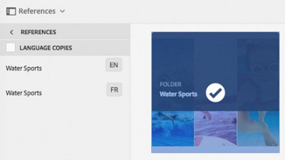

# Hantera sammansatta resurser {#managing-compound-assets}

Adobe Experience Manager Assets (AEM) Assets kan identifiera om en överförd fil innehåller referenser till resurser som redan finns i databasen. Den här funktionen är endast tillgänglig för filformat som stöds. Om den överförda resursen innehåller referenser till AEM-resurser skapas en dubbelriktad länk mellan de överförda och refererade resurserna.

Förutom att eliminera redundans förbättrar referensen till AEM-resurser i Adobe Creative Cloud-program samarbetet och ökar användarnas effektivitet och produktivitet.

AEM Resurser stöder **dubbelriktade referenser**. Du kan hitta refererade resurser på sidan med tillgångsinformation i den överförda filen. Dessutom kan du visa de refererande filerna för AEM-resurser på sidan med resursinformation för den refererade resursen.

Referenser tolkas utifrån sökväg, dokument-ID och instans-ID för de refererade resurserna.

## Lägga till AEM-resurser som referenser i Adobe Illustrator {#refai}

Du kan referera till befintliga AEM-resurser inifrån en Adobe Illustrator-fil.

1. Använd [AEM-skrivbordsappen](https://docs.adobe.com/content/help/en/experience-manager-desktop-app/using/using.html)och montera AEM Resurser-databasen som en enhet på den lokala datorn. Navigera till platsen för resursen som du vill referera till i den monterade enheten.
1. Dra resursen från den monterade enheten till Illustrator-filen.
1. Spara Illustrator-filen på den monterade enheten eller [överför](/help/assets/manage-digital-assets.md#uploading-assets) den till AEM-databasen.
1. När arbetsflödet är klart går du till sidan med resursinformation för resursen. Referenser till befintliga AEM-resurser visas under **Beroenden** i kolumnen **Referenser** .

   

1. De refererade resurserna som visas under **Beroenden** kan också refereras av andra filer än den aktuella. Om du vill visa en lista med referensfiler för en resurs klickar du på resursen under **Beroenden**.

   

1. Klicka på ikonen **Visa egenskaper** i verktygsfältet. På egenskapssidan visas listan med filer som refererar till den aktuella resursen under kolumnen **Referenser** på fliken **Grundläggande** .

   

## Lägga till AEM-resurser som referenser i Adobe InDesign {#add-aem-assets-as-references-in-adobe-indesign}

Om du vill referera till AEM-resurser från en InDesign-fil drar du AEM-resurserna till InDesign-filen eller exporterar InDesign-filen som en ZIP-fil.

Refererade resurser finns redan i AEM Resurser. <!-- You can extract subassets by [configuring InDesign server](/help/assets/indesign.md). Embedded assets in an InDesign file are extracted as subassets. -->

>[!NOTE]
>
>Om InDesign-servern är proxibel bäddas förhandsvisningen in i InDesign-filernas XMP-metadata. I det här fallet krävs inte extrahering av miniatyrer uttryckligen. Om InDesign-servern inte är proxyserver måste dock miniatyrer extraheras explicit för InDesign-filer.

### Skapa referenser genom att dra AEM-resurser {#create-references-by-dragging-aem-assets}

Den här proceduren liknar [Lägga till AEM-resurser som referenser i Adobe Illustrator](#refai).

### Skapa referenser till AEM-resurser genom att exportera en ZIP-fil {#create-references-to-aem-assets-by-exporting-a-zip-file}

1. Skapa en ny arbetsflödesmodell.
1. Använd packningsfunktionen i Adobe InDesign för att exportera dokumentet.
I Adobe InDesign kan du exportera ett dokument och de länkade resurserna som ett paket. I det här fallet innehåller den exporterade mappen en länkmapp som innehåller underresurser i InDesign-filen.
1. Skapa en ZIP-fil och överför den till AEM-databasen.
1. Starta arbetsflödet för Unarchiver.
1. När arbetsflödet är klart refereras referenserna i mappen Länkar automatiskt till underresurser. Om du vill visa en lista med refererade resurser går du till sidan med resursinformation för InDesign-resursen och stänger [Rail](/help/sites-cloud/authoring/getting-started/basic-handling.md#rail-selector).

## Lägga till AEM-resurser som referenser i Adobe Photoshop {#refps}

1. Montera AEM Resurser som en enhet med en WebDav-klient.
1. Om du vill skapa referenser till AEM-resurser i en Photoshop-fil navigerar du till motsvarande resurser på den monterade enheten med hjälp av funktionen Montera länkad i Photoshop.

   

1. Spara som Photoshop-fil på den monterade enheten eller [överför](/help/assets/manage-digital-assets.md#uploading-assets) till AEM-databasen.
1. När arbetsflödet är klart visas referenserna till befintliga AEM-resurser på sidan med tillgångsinformation.

   Om du vill visa de refererade resurserna stänger du [Rail](/help/sites-cloud/authoring/getting-started/basic-handling.md#rail-selector) på sidan med tillgångsinformation.

1. De refererade resurserna innehåller även en lista med resurser som de refereras till från. Om du vill visa en lista med refererade resurser går du till sidan med tillgångsinformation och stänger [Rail](/help/sites-cloud/authoring/getting-started/basic-handling.md#rail-selector).

>[!NOTE]
>
>Resurserna i sammansatta resurser kan också refereras baserat på deras dokument-ID och instans-ID. Den här funktionen är endast tillgänglig i Adobe Illustrator- och Adobe Photoshop-versioner. För andra görs en referens på grundval av den relativa sökvägen för länkade tillgångar i den huvudsakliga sammansatta tillgången, som i tidigare versioner av AEM.

## Visa sidor i en flersidig fil {#view-pages-of-a-multi-page-file}

Med funktionen för sidvisningsprogram i AEM Resurser kan du visa enskilda sidor med flersidiga filer, inklusive PDF-, INDD-, PPT-, PPTX- och Ai-filer. För InDesign kan du extrahera sidor med InDesign-servern. Om förhandsgranskningarna av sidorna sparas när InDesign-filer skapas behövs inte InDesign Server för sidextrahering.

Du kan bläddra igenom enskilda sidor i en fil från resurssidan. Du kan använda alternativ från verktygsfältet för att kommentera enskilda sidor i filen. Du kan också använda alternativet **Sidöversikt** om du vill visa alla sidor samtidigt.

1. Navigera till mappen i AEM Resurser som innehåller den flersidiga filen.
1. Klicka på resursen för att visa resurssidan.

   

1. Klicka på ikonen Global navigering och välj sedan **Sidor** på menyn.

   

1. Klicka på vänster- eller högerpilarna under bilden för att navigera till enskilda sidor i filen.

   

1. Om du vill kommentera en sida klickar du på ikonen **Anteckna** i verktygsfältet och lägger till en kommentar.

   

1. Om du vill hämta filen klickar du på **hämtningsikonen** .

   

1. Om du vill visa alla sidor i filen samtidigt klickar du på ikonen **Sidöversikt** .

   

1. Om du vill visa filens aktivitetsström, inklusive anteckningar och hämtningar, klickar du på ikonen Global Nav och väljer sedan **Tidslinje** på menyn.

   

1. Om du vill visa och redigera metadataegenskaperna för sidan klickar du på ikonen **Visa egenskaper** i verktygsfältet.

   
