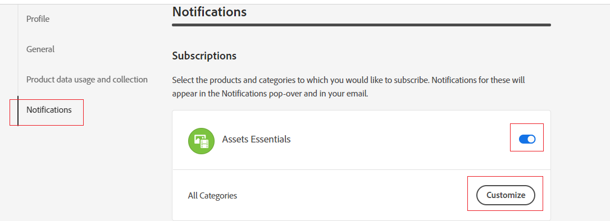

# Titta på resurser, mappar och samlingar {#watch-assets-folders}

| [Sök efter bästa praxis](/help/assets/search-best-practices.md) | [Metadata - bästa praxis](/help/assets/metadata-best-practices.md) | [Content Hub](/help/assets/product-overview.md) | [Dynamic Media med OpenAPI-funktioner](/help/assets/dynamic-media-open-apis-overview.md) | [AEM Assets-dokumentation för utvecklare](https://developer.adobe.com/experience-cloud/experience-manager-apis/) |
| ------------- | --------------------------- |---------|----|-----|

Med Assets-vymeddelanden kan du övervaka åtgärder som utförs på de resurser, mappar eller samlingar som är tillgängliga i databasen. Du måste välja och prenumerera på det innehåll som meddelandena skickas till dig för. Du kan också konfigurera de kategorier som meddelanden skickas till dig för.

## Prenumerera på meddelandekategorier {#subscribe-to-notification-categories}

Du kan välja och prenumerera från en lista med kategorier för att få meddelanden. I vyn Assets skickas endast meddelanden till dig för de kategorier som du väljer bland de tillgängliga alternativen:

<table>
    <tbody>
     <tr>
      <th><strong>Meddelandekategori</strong></th>
      <th><strong>Beskrivning</strong></th>
     </tr>
     <tr>
      <td>Begäranden</td>
      <td>När du tilldelar en uppgift till en användare får du meddelanden om när användaren har utfört åtgärder i den uppgiften.</td>
     </tr>
     <tr>
      <td>Tilldelad till mig</td>
      <td>Du får ett meddelande när en uppgift har tilldelats dig från en annan användare.</td>
     </tr>
     <tr>
      <td>Kommentera prenumererat innehåll</td>
      <td>Du får ett meddelande när en användare kommenterar din prenumerationsresurs.</td>
     </tr>
     <tr>
      <td>Borttagning av prenumererat innehåll</td>
      <td>Du får ett meddelande när en användare tar bort din prenumererade resurs, mapp eller samling.</td>
     </tr>
     <tr>
      <td>Extern andel av prenumererat innehåll</td>
      <td>Du får ett meddelande när en användare genererar en offentlig länk för din prenumererade resurs, mapp eller samling.</td>
     </tr>
     <tr>
      <td>Ändring av prenumererat innehåll</td>
      <td>Du får ett meddelande när en användare skapar en ny version för den prenumererade resursen.</td>
     </tr>
     <tr>
      <td>Flytta/byt namn på innehåll som prenumererar</td>
      <td>Du får ett meddelande när en användare flyttar eller byter namn på den prenumererade resursen eller mappen.</td>
     </tr>
     <tr>
      <td>Uppdateringar av prenumerationsmappar och samlingar</td>
      <td>Du får ett meddelande när en användare lägger till eller tar bort en resurs från en prenumerationsmapp eller samling.</td>
     </tr>    
    </tbody>
   </table>

Så här prenumererar du på meddelandekategorierna:

1. Klicka på  till höger i menyraden i användargränssnittet för vyn i Assets.

1. Klicka på  för att visa sidan [!UICONTROL Experience Cloud preferences].

1. Klicka på alternativet **[!UICONTROL Notifications]** i den vänstra rutan.

1. I avsnittet **[!UICONTROL Notifications]** går du till avsnittet [!UICONTROL Assets view] och ser till att växlingsalternativet är aktiverat.

   

1. Klicka på **[!UICONTROL Customize]** om du vill visa meddelandekategorierna.
   

1. Välj de meddelandekategorier för vilka du måste få meddelanden.

## Titta på och ta bort bevakade mappar, resurser och samlingar {#watch-unwatch-assets}

När [du har prenumererat på meddelandekategorierna](#subscribe-to-notification-categories) måste du prenumerera på innehållet för att få meddelanden.

>[!NOTE]
>
>* För meddelandekategorierna **[!UICONTROL Requests]** och **[!UICONTROL Assigned to me]** behöver du inte prenumerera på innehållet efter att du har prenumererat på meddelandekategorierna. Meddelanden skickas automatiskt till dig för förfrågningar som du har skapat och när en uppgift har tilldelats dig.
>* I Assets-vyn skickas meddelanden endast när andra användare utför åtgärder på det prenumererade innehållet. Du får inga meddelanden om vilka åtgärder du utför på det prenumererade innehållet.

Om du vill prenumerera på innehållet väljer du den mapp, resurs eller samling som du vill prenumerera på och klickar på **[!UICONTROL Watch]**.

Assets-vyn visar ett meddelande om att åtgärden lyckades. Du kan klicka på **[!UICONTROL Go to notification preferences]** som finns i meddelandet om att åtgärden lyckades om du vill redigera din [prenumeration till meddelandekategorier](#subscribe-to-notification-categories).

Assets-vyn skickar nu meddelanden om de prenumererade kategorierna. Du kan också markera flera resurser, mappar eller samlingar och klicka på **[!UICONTROL Watch]** för att spara tid. Om du väljer flera enheter av vilka vissa av dem redan har prenumererats visas emellertid inte alternativet **[!UICONTROL Watch]**.

Om du vill avbryta prenumerationen markerar du resursen, mappen eller samlingen som du prenumererar på och klickar på **[!UICONTROL Unwatch]**.

## Visa meddelanden {#view-notifications}

Meddelandena visas i den högra änden av menyraden i användargränssnittet i Assets-vyn.

När du klickar på ett meddelande navigerar Assets-vyn till rätt resurs eller mapp som det hänvisas till i meddelandet.
