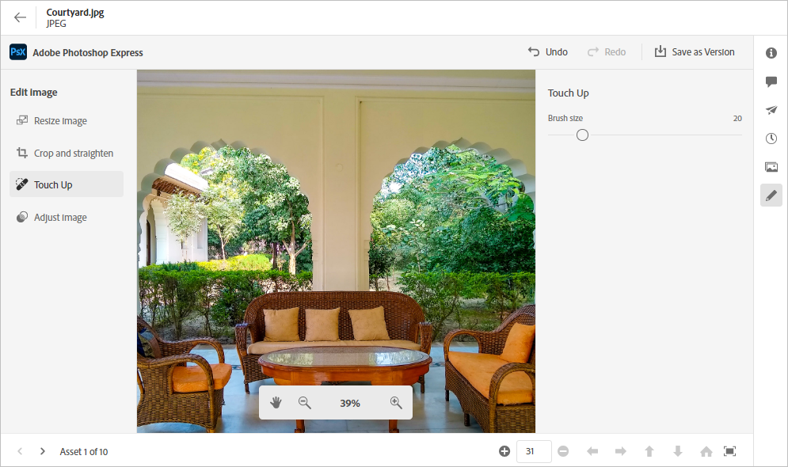

# Hantera resurser {#manage-assets}

| [Sök efter bästa praxis](/help/assets/search-best-practices.md) | [Metadata - bästa praxis](/help/assets/metadata-best-practices.md) | [Content Hub](/help/assets/product-overview.md) | [Dynamic Media med OpenAPI-funktioner](/help/assets/dynamic-media-open-apis-overview.md) | [AEM Assets-dokumentation för utvecklare](https://developer.adobe.com/experience-cloud/experience-manager-apis/) |
| ------------- | --------------------------- |---------|----|-----|

Du kan enkelt utföra olika DAM-åtgärder (Digital Asset Management) med det användarvänliga gränssnittet i [!DNL Assets view]. När du har lagt till resurserna kan du söka efter, hämta, flytta, kopiera, byta namn på, ta bort, uppdatera och redigera dina resurser.

Använd [!DNL Assets view] för att utföra följande resurshanteringsåtgärder. När du markerar en resurs visas följande alternativ i verktygsfältet högst upp.

*Bild: Alternativ i verktygsfältet för en markerad bild.*

*  Avmarkera markeringen.

*  Hitta liknande bildresurs i Assets-gränssnittet baserat på metadata och smarta taggar.

*  Klicka för att förhandsgranska en resurs och visa detaljerade metadata. När du förhandsgranskar kan du visa versionerna och redigera en bild.

*  Hämta den valda resursen till det lokala filsystemet.

*  Lägg till den valda resursen i en samling.

*  Fäst en resurs för snabbare åtkomst när du behöver den senare. Alla fästa objekt visas i avsnittet **Snabbåtkomst** i Min Workspace.

*  Redigera en bild i den integrerade Adobe Expressen i Adobe Experience Manager Assets.

*  Redigera bilden med Adobe Express.

*  för en resurs med andra användare så att de kan komma åt och hämta den.

*  Ta bort den markerade resursen eller mappen.

*  Kopiera den markerade filen eller mappen.

*  Flytta den markerade resursen eller mappen till en annan plats i databashierarkin.

*  Byt namn på den markerade resursen eller mappen. Använd ett unikt namn, annars misslyckas namnbytet med en varning. Försök igen med ett nytt namn.
Du kan också klicka på titeln för en resurs eller en mapp för att byta namn på den. Ange den nya texten i textrutan **Byt namn på resurs** och klicka på **Spara**. Den här funktionen är tillgänglig i stödraster-, galleri-, vattenfalls- och listvyerna.

*  [!UICONTROL Waterfall View].

*  Lägg till en resurs i biblioteket.

*  Tilldela uppgifter till andra användare för samarbete i en resurs.

*  Övervaka åtgärder som utförs på en resurs.

Du kan visa samma alternativ för miniatyrbilder av resurser.

[!DNL Assets view] visar bara de relevanta alternativen i verktygsfältet som är beroende av den valda resursens typ.

*Bild: Alternativ i verktygsfältet för en markerad mapp.*

*Bild: Alternativ i verktygsfältet för en markerad PDF-fil.*

## Hämta och distribuera resurser {#download}

Du kan välja en eller flera resurser eller mappar eller en kombination av båda och hämta urvalet till det lokala filsystemet. Du kan redigera resurserna och överföra dem igen eller distribuera resurserna utanför [!DNL Assets view]. Du kan även [hämta återgivningarna](/help/assets/add-delete-assets-view.md#renditions) för en resurs.

## Resursversionshantering {#versions-of-assets}

<!-- 
TBD: query for engineering: How many versions are maintained. What happens when we reach that limit? Are old versions automatically removed? -->

[!DNL Assets view] versioner av resurserna när resurserna överförs igen som uppdateras eller redigeras. Du kan visa versionshistorik, tidigare versioner och återställa en tidigare version av resurser som den senaste versionen, som återställs till en tidigare version om det behövs. Resursversioner skapas i följande scenarier:

* Överför en ny resurs med samma filnamn som en befintlig resurs och i samma mapp som den befintliga resursen. [!DNL Assets view] uppmanar dig att antingen skriva över den tidigare resursen eller spara den nya resursen som en version. Se [Överför duplicerade resurser](/help/assets/add-delete-assets-view.md).

  

  *Bild: När du överför en resurs med namnet same as an existing asset, kan du skapa en version av resursen.*

* Redigera en bild och klicka på **[!UICONTROL Save as Version]**. Se [redigera bilder](/help/assets/edit-images-assets-view.md).

  

  *Figur: Spara redigerad bild som en version.*

* Öppna versionerna av en befintlig resurs. Klicka på **[!UICONTROL New Version]** och överför en nyare version av resursen i databasen.

  

### Visa versioner av en resurs {#view-versions}

När du överför en duplicerad kopia eller en modifierad kopia av en resurs kan du skapa dess versioner. Med versionshantering kan du granska historiska resurser och återgå till en tidigare version om det behövs.

Om du vill visa versioner öppnar du förhandsgranskningen av en resurs och klickar på **[!UICONTROL Versions]**  i den högra sidofältet. Om du vill förhandsgranska en viss version markerar du den. Klicka på **[!UICONTROL Make Latest]** om du vill återgå till den.

Du kan också skapa versioner från tidslinjen för versionerna. Välj den senaste versionen, klicka på **[!UICONTROL New Version]** och överför en ny kopia av resursen från det lokala filsystemet.

*Figur: Visa versioner av en resurs, återgå till en tidigare version eller överför en annan ny version.*

## Hantera resursstatus {#manage-asset-status}

**Behörigheter krävs:** `Can Edit`, `Owner` eller administratörsbehörighet för en resurs.

I Assets-vyn kan du ange status för resurser som är tillgängliga i databasen. Ange en resursstatus som bättre styr och hanterar nedströmsanvändningen av digitala resurser.

Du kan ange följande status för resurser:

* Godkänd

* Avvisad

* Ingen status

### Ange resursstatus {#set-asset-status}

Så här anger du resursstatus:

1. Markera resursen och klicka på **[!UICONTROL Details]** i verktygsfältet.

1. Välj resursstatus i listrutan **[!UICONTROL Status]** på fliken **[!UICONTROL Basic]**. Möjliga värden är Godkänd, Avvisat och Ingen status (standard).
Om du har Dynamic Media med OpenAPI-funktioner tilldelade för din miljö, genererar Experience Manager Assets en offentlig URL så fort du markerar resursen som `Approved`.

   >[!VIDEO](https://video.tv.adobe.com/v/342495)

### Ange förfallodatum för tillgång {#set-asset-expiration-date}

I Assets-vyn kan du även ange förfallodatum för resurser som finns i databasen. Du kan sedan [filtrera sökresultaten](search-assets-view.md#refine-search-results) baserat på en `Expired`-resursstatus. Du kan dessutom ange ett förfallodatumintervall för resurser för att ytterligare filtrera sökresultaten.

Så här anger du förfallodatum för tillgång:

1. Markera resursen och klicka på **[!UICONTROL Details]** i verktygsfältet.

1. Ange förfallodatumet för resursen med fältet **[!UICONTROL Expiration date]** på fliken **[!UICONTROL Basic]**.

Indikatorn för `Expired`-resurskortet åsidosätter indikatorn `Approved` eller `Rejected` som angetts för en resurs.

Du kan också filtrera resurser baserat på en resursstatus. Mer information finns i [Söka efter resurser i Assets-vyn](search-assets-view.md).

## Anpassa metadataformulär för att inkludera resursstatusfält {#customize-asset-status-metadata-form}

**Behörigheter krävs:** Administratör

I Assets-vyn finns många standardmetadatafält som standard. Organisationer har ytterligare metadatabehov och behöver fler metadatafält för att kunna lägga till företagsspecifika metadata. Med metadataformulär kan företag lägga till anpassade metadatafält på sidan [!UICONTROL Details] för en resurs. De företagsspecifika metadata förbättrar styrningen och identifieringen av dess resurser.

Mer information om hur du lägger till ytterligare metadatafält i metadataformuläret finns i [Metadata Forms](metadata-assets-view.md#metadata-forms).

**Lägg till metadatafält för resursstatus i formuläret**

Om du vill lägga till metadatafältet för resursstatus i formuläret drar du **[!UICONTROL Asset Status]**-komponenten från den vänstra listen till formuläret. Mappningsegenskapen fylls i automatiskt. Spara formuläret för att bekräfta ändringarna.

**Lägg till metadatafältet Förfallodatum i formuläret**

Om du vill lägga till metadatafältet Förfallodatum i formuläret drar du **[!UICONTROL Date]**-komponenten från den vänstra listen till formuläret. Ange **Förfallodatum** som etikett och `pur:expirationDate` som mappningsegenskap. Spara formuläret för att bekräfta ändringarna.

## Nästa steg {#next-steps}

* [Titta på en video för att hantera resurser i Assets-vyn](https://experienceleague.adobe.com/docs/experience-manager-learn/assets-essentials/basics/managing.html)

* Ge produktfeedback med alternativet [!UICONTROL Feedback] som finns i användargränssnittet i Assets-vyn

* Ge feedback om dokumentationen med [!UICONTROL Edit this page]  eller [!UICONTROL Log an issue]  som är tillgängligt på den högra sidopanelen

* Kontakta [kundtjänst](https://experienceleague.adobe.com/?support-solution=General#support)

