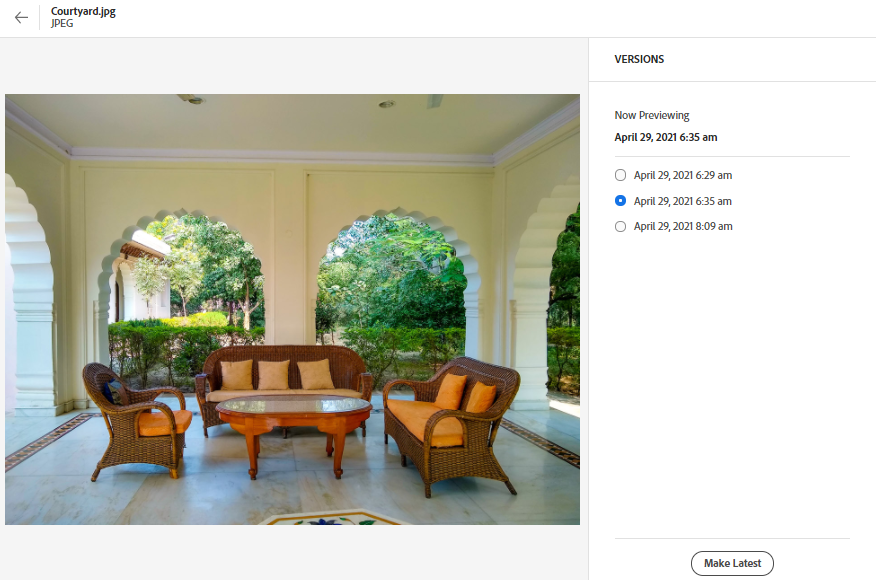

# Hantera resurser {#manage-assets}

Du kan enkelt utföra olika DAM-åtgärder (Digital Asset Management) med det användarvänliga gränssnittet i [!DNL Assets view]. När du har lagt till resurserna kan du söka efter, hämta, flytta, kopiera, byta namn på, ta bort, uppdatera och redigera dina resurser.

Använd [!DNL Assets view] för att utföra följande resurshanteringsåtgärder. När du markerar en resurs visas följande alternativ i verktygsfältet högst upp.

*Bild: Alternativ i verktygsfältet för en markerad bild.*

*  Avmarkera markeringen.
*  Klicka för att förhandsgranska en resurs och visa detaljerade metadata. När du förhandsgranskar kan du visa versionerna och redigera en bild.
*  Hämta den valda resursen till ditt lokala filsystem.
*  Ta bort den markerade resursen eller mappen.
*  Checka ut den valda resursen.
*  Kopiera den markerade filen eller mappen.
*  Flytta den markerade resursen eller mappen till en annan plats i databashierarkin.
*  Byt namn på den markerade resursen eller mappen. Använd ett unikt namn, annars misslyckas namnbytet med en varning. Försök igen med ett nytt namn.
*  Tilldela uppgifter till andra användare för att samarbeta med en resurs.

Du kan visa samma alternativ för miniatyrbilder av resurser.

[!DNL Assets view] visar endast de relevanta alternativen i verktygsfältet som beror på vilken typ av resurs som har valts.

*Bild: Alternativ i verktygsfältet för en vald mapp.*

*Bild: Alternativ i verktygsfältet för en markerad PDF-fil.*

## Hämta och distribuera resurser {#download}

Du kan välja en eller flera resurser eller mappar eller en kombination av båda och hämta urvalet till det lokala filsystemet. Du kan redigera resurserna och överföra dem igen eller distribuera resurserna utanför [!DNL Assets view]. Du kan också [ladda ned renderingarna](/help/assets/add-delete-assets-view.md#renditions) av en tillgång.

## Resursversionshantering {#versions-of-assets}

<!-- 
TBD: query for engineering: How many versions are maintained. What happens when we reach that limit? Are old versions automatically removed? -->

[!DNL Assets view] versionerar resurserna när resurserna överförs igen som uppdateras eller redigeras. Du kan visa versionshistorik, tidigare versioner och återställa en tidigare version av resurser som den senaste versionen, som återställs till en tidigare version om det behövs. Resursversioner skapas i följande scenarier:

* Överför en ny resurs med samma filnamn som en befintlig resurs och i samma mapp som den befintliga resursen. [!DNL Assets view] uppmanas att antingen skriva över den tidigare resursen eller spara den nya resursen som en version. Se [överföra duplicerade resurser](/help/assets/add-delete-assets-view.md).

  

  *Bild: När du överför en resurs som heter samma som en befintlig resurs kan du skapa en version av resursen.*

* Redigera en bild och klicka på **[!UICONTROL Save as Version]**. Se [redigera bilder](/help/assets/edit-images-assets-view.md).

  

  *Bild: Spara redigerad bild som en version.*

* Öppna versionerna av en befintlig resurs. Klicka **[!UICONTROL New Version]** och ladda upp en nyare version av resursen i databasen.

  

### Visa versioner av en resurs {#view-versions}

När du överför en duplicerad kopia eller en modifierad kopia av en resurs kan du skapa dess versioner. Med versionshantering kan du granska historiska resurser och återgå till en tidigare version om det behövs.

Om du vill visa versioner öppnar du en resurses förhandsgranskning och klickar på **[!UICONTROL Versions]**  från höger sidospalt. Om du vill förhandsgranska en viss version markerar du den. Om du vill återgå till den klickar du på **[!UICONTROL Make Latest]**.

Du kan också skapa versioner från tidslinjen för versionerna. Välj den senaste versionen, klicka på **[!UICONTROL New Version]** och överför en ny kopia av resursen från det lokala filsystemet.

*Bild: Visa versioner av en resurs, återgå till en tidigare version eller överför en annan ny version.*

## Hantera resursstatus {#manage-asset-status}

**Behörigheter krävs:**  `Can Edit`, `Owner`eller administratörsbehörigheter för en resurs.

I resursvyn kan du ange status för resurser som är tillgängliga i databasen. Ange en resursstatus som bättre styr och hanterar nedströmsanvändningen av digitala resurser.

Du kan ange följande status för resurser:

* Godkänd

* Avvisad

* Ingen status

### Ange resursstatus {#set-asset-status}

Så här anger du resursstatus:

1. Markera resursen och klicka på **[!UICONTROL Details]** i verktygsfältet.

1. I **[!UICONTROL Basic]** väljer du resursstatus på fliken **[!UICONTROL Status]** listruta. Möjliga värden är Godkänd, Avvisat och Ingen status (standard).

   >[!VIDEO](https://video.tv.adobe.com/v/342495)

### Ange förfallodatum för tillgång {#set-asset-expiration-date}

I resursvyn kan du även ange förfallodatum för resurser som är tillgängliga i databasen. Då kan du [filtrera sökresultaten](search-assets-view.md#refine-search-results) baserat på en `Expired` status. Du kan dessutom ange ett förfallodatumintervall för resurser för att ytterligare filtrera sökresultaten.

Så här anger du förfallodatum för tillgång:

1. Markera resursen och klicka på **[!UICONTROL Details]** i verktygsfältet.

1. I **[!UICONTROL Basic]** anger du förfallodatum för resursen med hjälp av  **[!UICONTROL Expiration date]** fält.

The `Expired` tillgångskortsindikatorn åsidosätter `Approved` eller `Rejected` indikatoruppsättning för en tillgång.

Du kan även filtrera resurser baserat på en resursstatus. Mer information finns i [Söka efter resurser i resursvyn](search-assets-view.md).

## Anpassa metadataformulär för att inkludera resursstatusfält {#customize-asset-status-metadata-form}

**Behörigheter krävs:** Administratör

Resursvyn innehåller många standardmetadatafält som standard. Organisationer har ytterligare metadatabehov och behöver fler metadatafält för att kunna lägga till företagsspecifika metadata. Med metadataformulär kan företag lägga till anpassade metadatafält i en resurs [!UICONTROL Details] sida. De företagsspecifika metadata förbättrar styrningen och identifieringen av dess resurser.

Mer information om hur du lägger till ytterligare metadatafält i metadataformuläret finns i [Metadata Forms](metadata-assets-view.md#metadata-forms).

**Lägg till metadatafält för resursstatus i formuläret**

Om du vill lägga till metadatafältet Resursstatus i formuläret drar du **[!UICONTROL Asset Status]** från den vänstra listen till formuläret. Mappningsegenskapen fylls i automatiskt. Spara formuläret för att bekräfta ändringarna.

**Lägg till metadatafältet Förfallodatum i formuläret**

Om du vill lägga till metadatafältet Förfallodatum i formuläret drar du **[!UICONTROL Date]** från den vänstra listen till formuläret. Ange **Förfallodatum** som etikett och `pur:expirationDate` som mappningsegenskapen. Spara formuläret för att bekräfta ändringarna.

## Nästa steg {#next-steps}

* [Titta på en video om hur du hanterar resurser i resursvyn](https://experienceleague.adobe.com/docs/experience-manager-learn/assets-essentials/basics/managing.html)

* Ge produktfeedback med [!UICONTROL Feedback] alternativ som finns i användargränssnittet i resursvyn

* Ge feedback på dokumentationen med [!UICONTROL Edit this page]  eller [!UICONTROL Log an issue]  som finns till höger

* Kontakt [Kundtjänst](https://experienceleague.adobe.com/?support-solution=General#support)
