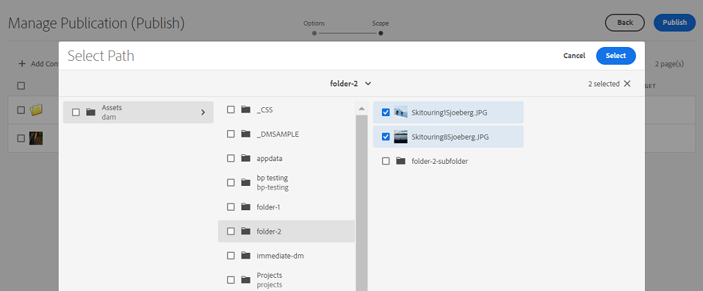
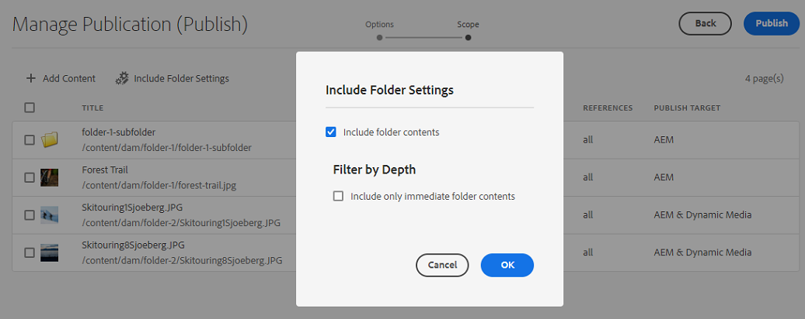

# Hantera publicering i Experience Manager Assets {#manage-publication-in-aem}

Som en [!DNL Adobe Experience Manager Assets] kan du publicera resurser och mappar som innehåller resurser från författarinstansen till [!DNL Experience Manager Assets], [!DNL Dynamic Media]och [!DNL Brand Portal]. Du kan även schemalägga publicering av en resurs eller mapp vid ett senare datum eller tid. När de har publicerats kan användarna komma åt och distribuera resurserna vidare till andra användare. Som standard kan du publicera resurser och mappar till [!DNL Experience Manager Assets]. Du kan dock konfigurera [!DNL Experience Manager Assets] för att aktivera publicering till [[!DNL Dynamic Media]](https://experienceleague.adobe.com/docs/experience-manager-cloud-service/content/assets/dynamicmedia/config-dm.html) och [[!DNL Brand Portal]](https://experienceleague.adobe.com/docs/experience-manager-cloud-service/content/assets/brand-portal/configure-aem-assets-with-brand-portal.html).

Du kan publicera eller avpublicera resurser på resurs- eller mappnivå med antingen **[!UICONTROL Quick Publish]** eller **[!UICONTROL Manage Publication]** som finns i [!DNL Experience Manager Assets] gränssnitt. Om du gör senare ändringar i den ursprungliga resursen eller mappen i [!DNL Experience Manager Assets]återspeglas inte ändringarna i publiceringsinstansen förrän du publicerar om från [!DNL Experience Manager Assets]. Det ser till att ändringar som pågår inte är tillgängliga i publiceringsinstansen. Endast godkända ändringar som publiceras av en administratör är tillgängliga i publiceringsinstansen.

* [Publicera resurser med Snabbpublicering](#quick-publish)
* [Publicera resurser med Hantera publikation](#manage-publication)
* [Publicera resurser senare](#publish-assets-later)
* [Publicera material i Dynamic Media](#publish-assets-to-dynamic-media)
* [Publicera resurser på varumärkesportalen](#publish-assets-to-brand-portal)
* [Begär publikation](#request-publication)
* [Begränsningar och tips](#limitations-and-tips)

## Publicera resurser med Snabbpublicering {#quick-publish}

Med Snabb publicering kan du publicera innehåll direkt på det valda målet. Från [!DNL Experience Manager Assets] navigera till den överordnade mappen och markera alla resurser eller mappar som du vill publicera. Klicka **[!UICONTROL Quick Publish]** i verktygsfältet och välj mål i listrutan där du vill publicera resurserna.

## Publicera resurser med Hantera publikation {#manage-publication}

Med Hantera publikation kan du publicera eller avpublicera innehåll till och från det valda målet, [lägg till innehåll](#add-content) till publiceringslistan från DAM-databasen, [inkludera mappinställningar](#include-folder-settings) för att publicera innehållet i de valda mapparna och tillämpa filter, och [schemaläggning](#publish-assets-later) till ett senare datum eller en senare tid.

Från [!DNL Experience Manager Assets] navigera till den överordnade mappen och markera alla resurser eller mappar som du vill publicera. Klicka **[!UICONTROL Manage Publication]** i verktygsfältet. Om du inte har [!DNL Dynamic Media] och [!DNL Brand Portal] konfigurerad i [!DNL Experience Manager Assets] du kan till exempel publicera resurser och mappar endast till [!DNL Experience Manager Assets].

Följande alternativ är tillgängliga i [!UICONTROL Manage Publication] gränssnitt:

* [!UICONTROL Actions]
   * `Publish`: Publicera resurser och mappar till det valda målet
   * `Unpublish`: Avpublicera resurser och mappar från målet

* [!UICONTROL Destination]
   * `Publish`: Publicera resurser och mappar till [!DNL Experience Manager Assets] (`AEM`)
   * `Dynamic Media`: Publicera resurser på [!DNL Dynamic Media]
   * `Brand Portal`: Publicera resurser och mappar till [!DNL Brand Portal]

* [!UICONTROL Scheduling]
   * `Now`: Publicera resurser direkt
   * `Later`: Publicera resurser baserat på `Activation` datum eller tid

Klicka på **[!UICONTROL Next]**. Baserat på urvalet **[!UICONTROL Scope]** -fliken visar olika alternativ. Alternativen för **[!UICONTROL Add Content]** och **[!UICONTROL Include Folder Settings]** är bara tillgängliga för publicering av resurser och mappar till [!DNL Experience Manager Assets] (`Destination: Publish`).

### Lägg till innehåll {#add-content}

Publicera till [!DNL Experience Manager Assets] Med kan du lägga till mer innehåll (resurser och mappar) i publiceringslistan. Du kan lägga till fler resurser eller mappar i listan i alla databaser. Klicka **[!UICONTROL Add Content]** för att lägga till mer innehåll.

Du kan lägga till flera resurser från en mapp eller lägga till flera mappar samtidigt. Men du kan inte lägga till resurser från flera mappar samtidigt.

### Inkludera mappinställningar {#include-folder-settings}

Som standard publicerar du en mapp till [!DNL Experience Manager Assets] publicerar alla resurser, undermappar och referenser till dem.

Om du vill filtrera mappinnehållet som du vill publicera klickar du på **[!UICONTROL Include Folder Settings]**:

* `Include folder contents`

   * Aktiverat: Alla resurser i den valda mappen, undermappar (inklusive alla resurser i undermapparna) och referenser publiceras.
   * Inaktiverad: Endast den markerade mappen (tom) och referenser publiceras. Resurserna i den valda mappen publiceras inte.

* `Include folder contents` och `Include only immediate folder contents`

  Om båda alternativen är markerade publiceras alla resurser i den markerade mappen, undermapparna (tomma) och referenserna. Undermapparnas resurser publiceras inte.

<!--
* [!UICONTROL Include only immediate folder contents]: Only the subfolders content and references are published. 

Only the selected folder content and references are published.
-->

När du har använt filtren klickar du på **[!UICONTROL OK]** och klicka sedan på **[!UICONTROL Publish]**. När du klickar på knappen Publicera visas ett bekräftelsemeddelande `Resource(s) have been scheduled for publication` visas. De markerade resurserna och (eller) mapparna publiceras till det definierade målet baserat på schemaläggaren (`Now` eller `Later`). Logga in på din publiceringsinstans för att verifiera att resurserna och (eller) mapparna har publicerats.

I bilden ovan kan du se olika värden för **[!UICONTROL Publish Target]** -attribut. Låt oss komma ihåg att du har valt att publicera till [!DNL Experience Manager Assets] (`Destination: Publish`). Varför visar det då att bara en mapp och en resurs publiceras till `AEM`, och de andra två resurserna publiceras till båda `AEM` och `Dynamic Media`?

Här måste du känna till mappegenskapernas roll. En mapps **[!UICONTROL Dynamic Media Publishing mode]** egenskapen spelar en viktig roll när det gäller publicering. Om du vill visa en mapps egenskaper markerar du en mapp och klickar på **[!UICONTROL Properties]** i verktygsfältet. Information om en resurs finns i egenskaperna för dess överordnade mapp.

I följande tabell förklaras hur publiceringen sker beroende på den definierade **[!UICONTROL Destination]** och **[!UICONTROL Dynamic Media Publish mode]**:

| [!UICONTROL Destination] | [!UICONTROL Dynamic Media Publish mode] | [!UICONTROL Publish Target] | Tillåtet innehåll |
| --- | --- | --- | --- |
| Publicera | Selektiv publicering | `AEM` | Resurser och(eller) mappar |
| Publicera | Omedelbar | `AEM` och `Dynamic Media` | Resurser och(eller) mappar |
| Publicera | Vid aktivering | `AEM` och `Dynamic Media` | Resurser och(eller) mappar |
| Dynamic Media | Selektiv publicering | `Dynamic Media` | Assets |
| Dynamic Media | Omedelbar | `None` | Det går inte att publicera resurserna |
| Dynamic Media | Vid aktivering | `None` | Det går inte att publicera resurserna |

>[!NOTE]
>
>Endast resurser publiceras till [!DNL Dynamic Media].
>
>Publicera en mapp till [!DNL Dynamic Media] stöds inte.
>
>Om du väljer en mapp (`Selective Publish`) och väljer [!DNL Dynamic Media] mål, [!UICONTROL Publish Target] attribut reflekterar `None`.

Låt oss nu ändra **[!UICONTROL Destination]** i ovanstående fall till **[!UICONTROL Dynamic Media]** och verifiera resultatet. Genom att göra det är det bara `Selective Publish` mappen publiceras i [!DNL Dynamic Media]. Resurserna för `Immediate` och `Upon Activation` mappar publiceras inte och speglar `None`.

>[!NOTE]
>
>If [!DNL Dynamic Media] är inte konfigurerad på din [!DNL Experience Manager Assets] -instans och **[!UICONTROL Destination]** är **[!UICONTROL Publish]**, publiceras resurser och mappar alltid till `AEM`.
>
>Publicera till [!DNL Brand Portal] är oberoende av mappegenskaperna. Alla resurser, mappar och samlingar kan publiceras till Brand Portal. Se [publicera resurser på Brand Portal](#publish-assets-to-brand-portal).

>[!NOTE]
>
>Om du har anpassat [!DNL Manage Publication] fortsätter anpassningen att fungera med de befintliga funktionerna.
>
>Du kan dock ta bort den befintliga anpassningen och använda den nya [!DNL Manager Publication] funktioner.

## Publicera resurser senare {#publish-assets-later}

Så här schemalägger du publiceringsarbetsflödet för resurser till ett senare datum eller en senare tid:

1. Från [!UICONTROL Experience Manager Assets] navigera till den överordnade mappen och markera alla resurser eller mappar som du vill schemalägga för publicering.
1. Klicka **[!UICONTROL Manage Publication]** i verktygsfältet.
1. Klicka **[!UICONTROL Publish]** från **[!UICONTROL Action]** och sedan väljer **[!UICONTROL Destination]** där du vill publicera innehållet.
1. Välj **[!UICONTROL Later]** från **[!UICONTROL Scheduling]**.
1. Välj en **[!UICONTROL Activation date]** och ange datum och tid. Klicka på **[!UICONTROL Next]**.

   

1. I **[!UICONTROL Scope]** tab, **[!UICONTROL Add Content]** (vid behov). Klicka på **[!UICONTROL Next]**.
1. I **[!UICONTROL Workflows]** anger du en arbetsflödesrubrik. Klicka på **[!UICONTROL Publish Later]**.

   

   Logga in på målinstansen för att verifiera de publicerade resurserna (beroende på schemalagt datum eller tid).

## Publicera material i Dynamic Media {#publish-assets-to-dynamic-media}

Endast resurser publiceras till [!DNL Dynamic Media]. Publiceringsbeteendet skiljer sig dock åt beroende på mappegenskaperna. En mapp kan ha **[!UICONTROL Dynamic Media Publish mode]** konfigurerad för selektiv publicering som kan vara något av följande:

* `Selective Publish`
* `Immediate`
* `Upon Activation`

Publiceringsprocessen för **[!UICONTROL Immediate]** och **[!UICONTROL Upon Activation]** är dock konsekvent i olika lägen för **[!UICONTROL Selective Publish]**. Se [konfigurera selektiv publicering på mappnivå i Dynamic Media](https://experienceleague.adobe.com/docs/experience-manager-cloud-service/content/assets/dynamicmedia/selective-publishing.html). När du har konfigurerat selektiv publicering i en mapp kan du göra något av följande:

* [Publicera valfritt material till Dynamic Media eller Experience Manager med Hantera publikation](https://experienceleague.adobe.com/docs/experience-manager-cloud-service/content/assets/dynamicmedia/selective-publishing.html?lang=en#selective-publish-manage-publication)
* [Avpublicera valfritt material från Dynamic Media eller Experience Manager med Hantera publikation](https://experienceleague.adobe.com/docs/experience-manager-cloud-service/content/assets/dynamicmedia/selective-publishing.html?lang=en#selective-unpublish-manage-publication)
* [Publicera material på Dynamic Media eller Experience Manager med Snabbpublicering](https://experienceleague.adobe.com/docs/experience-manager-cloud-service/content/assets/dynamicmedia/selective-publishing.html?lang=en#quick-publish-aem-dm)
* [Publicera eller avpublicera resurser selektivt via sökresultat](https://experienceleague.adobe.com/docs/experience-manager-cloud-service/content/assets/dynamicmedia/selective-publishing.html?lang=en#selective-publish-unpublish-search-results)

## Publicera resurser på varumärkesportalen {#publish-assets-to-brand-portal}

Du kan publicera resurser, mappar och samlingar i [!DNL Experience Manager Assets Brand Portal] -instans.

* [Publicera resurser på varumärkesportalen](https://experienceleague.adobe.com/docs/experience-manager-cloud-service/content/assets/brand-portal/publish-to-brand-portal.html?lang=en#publish-assets-to-bp)
* [Publicera mappar på varumärkesportalen](https://experienceleague.adobe.com/docs/experience-manager-cloud-service/content/assets/brand-portal/publish-to-brand-portal.html?lang=en#publish-folders-to-brand-portal)
* [Publicera samlingar på varumärkesportalen](https://experienceleague.adobe.com/docs/experience-manager-cloud-service/content/assets/brand-portal/publish-to-brand-portal.html?lang=en#publish-collections-to-brand-portal)

## Begär publikation {#request-publication}

The `Request Publication` hjälper till att autentisera resursarbetsflöden innan de publiceras på [!DNL AEM] Resursmiljö. [!DNL AEM] ger olika behörighetsnivåer för olika användare. Du kan vara en *medverkande* som överför resurser men inte kan publicera dem förrän överföringarna har verifierats. Dessutom är *Administratör* kan du hantera arbetsflöden för att läsa och skriva resurser.

Publiceringsalternativet för begäran är tillgängligt för följande användare:
* **Medarbetare:** Om du är en användare som kan bidra till [!DNL AEM] Resurser, sedan har du begränsad tillgång till [!DNL AEM] Arbetsflöde för resurser. `Manage publication` knappen är dold för dig. Som deltagare kan du bara bidra genom att lägga till resurser, men du kan inte publicera dem eller ha läsåtkomst till arbetsflödet.

* **Arbetsflödesanvändare:** Den här användaren kan inte publicera resurser men har läsåtkomst till arbetsflödet. Som arbetsflödesanvändare kan du:
   * begära publicering
   * visa `Manage publication` knapp
   * schemalägga arbetsflödet och se alternativen `schedule now` och `schedule later`

* **Administratör:** Som en administratörstyp kan du hantera övergripande arbetsflödessteg för resurserna. `Manage publication` knappen visas för dig. Om målet `publish` är markerat kan du schemalägga en resurs senare för arbetsflödessteget.

>[!NOTE]
>
>If [!DNL Dynamic Media] är markerat som mål och arbetsflödessteget är inaktiverat för **arbetsflödesanvändare** och **admin** -användare.
>

## Begränsningar och tips {#limitations-and-tips}

* `Manage publication` är tillgängligt för användare som har minst läsbehörighet till arbetsflödet.
* Tomma mappar publiceras inte.
* Om du publicerar en resurs som bearbetas publiceras bara det ursprungliga innehållet. Återgivningarna saknas. Vänta tills bearbetningen är klar och publicera eller publicera om resursen när bearbetningen är klar.
* När du avpublicerar en komplex resurs avpublicerar du bara resursen. Undvik att avpublicera referenserna eftersom de kan refereras av andra publicerade resurser.
