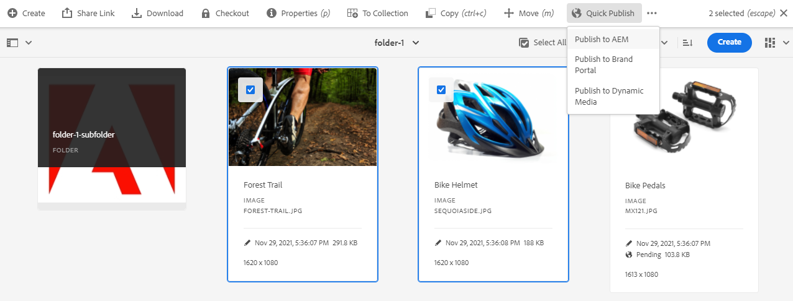

# Hantera publicering i Experience Manager Assets {#manage-publication-in-aem}

Som [!DNL Adobe Experience Manager Assets]-administratör kan du publicera resurser och mappar som innehåller resurser från författarinstansen till [!DNL Experience Manager Assets], [!DNL Dynamic Media] och [!DNL Brand Portal]. Du kan även schemalägga publicering av en resurs eller mapp vid ett senare datum eller tid. När de har publicerats kan användarna komma åt och distribuera resurserna vidare till andra användare. Som standard kan du publicera resurser och mappar till [!DNL Experience Manager Assets]. Du kan dock konfigurera [!DNL Experience Manager Assets] så att publicering till [[!DNL Dynamic Media]](https://experienceleague.adobe.com/docs/experience-manager-cloud-service/content/assets/dynamicmedia/config-dm.html) och [[!DNL Brand Portal]](https://experienceleague.adobe.com/docs/experience-manager-cloud-service/content/assets/brand-portal/configure-aem-assets-with-brand-portal.html) aktiveras.

Du kan publicera eller avpublicera resurser på resurs- eller mappnivå med något av alternativen **[!UICONTROL Quick Publish]** eller **[!UICONTROL Manage Publication]** i [!DNL Experience Manager Assets]-gränssnittet. Om du gör senare ändringar i den ursprungliga resursen eller mappen i [!DNL Experience Manager Assets] återspeglas inte ändringarna i publiceringsinstansen förrän du publicerar om från [!DNL Experience Manager Assets]. Det ser till att ändringar som pågår inte är tillgängliga i publiceringsinstansen. Endast godkända ändringar som publiceras av en administratör är tillgängliga i publiceringsinstansen.

* [Publicera resurser med Snabbpublicering](#quick-publish)
* [Publicera resurser med Hantera publikation](#manage-publication)
* [Publicera resurser senare](#publish-assets-later)
* [Publicera material till Dynamic Media](#publish-assets-to-dynamic-media)
* [Publicera material i Brand Portal](#publish-assets-to-brand-portal)
* [Begär publikation](#request-publication)
* [Begränsningar och tips](#limitations-and-tips)

## Publicera resurser med Snabbpublicering {#quick-publish}

Med Snabb publicering kan du publicera innehåll direkt på det valda målet. Navigera från konsolen [!DNL Experience Manager Assets] till den överordnade mappen och markera alla resurser eller mappar som du vill publicera. Klicka på alternativet **[!UICONTROL Quick Publish]** i verktygsfältet och välj mål i listrutan där du vill publicera resurserna.

## Publicera resurser med Hantera publikation {#manage-publication}

Med Hantera publicering kan du publicera eller avpublicera innehåll till och från det valda målet, [lägga till innehåll](#add-content) i publiceringslistan från hela DAM-databasen, [inkludera mappinställningar](#include-folder-settings) för att publicera innehåll från de valda mapparna och använda filter samt [schemalägga publicering](#publish-assets-later) för ett senare datum eller en senare tidpunkt.

Navigera från konsolen [!DNL Experience Manager Assets] till den överordnade mappen och markera alla resurser eller mappar som du vill publicera. Klicka på alternativet **[!UICONTROL Manage Publication]** i verktygsfältet. Om du inte har konfigurerat [!DNL Dynamic Media] och [!DNL Brand Portal] i din [!DNL Experience Manager Assets]-instans kan du bara publicera resurser och mappar till [!DNL Experience Manager Assets].

Följande alternativ är tillgängliga i gränssnittet [!UICONTROL Manage Publication]:

* [!UICONTROL Actions]
   * `Publish`: Publicera resurser och mappar till det valda målet
   * `Unpublish`: Avpublicera resurser och mappar från målet

* [!UICONTROL Destination]
   * `Publish`: Publicera resurser och mappar till [!DNL Experience Manager Assets] (`AEM`)
   * `Dynamic Media`: Publicera resurser på [!DNL Dynamic Media]
   * `Brand Portal`: Publicera resurser och mappar till [!DNL Brand Portal]

* [!UICONTROL Scheduling]
   * `Now`: Publicera resurser omedelbart
   * `Later`: Publicera resurser baserat på `Activation`-datum eller -tid

Klicka på **[!UICONTROL Next]** om du vill fortsätta. Baserat på markeringen visar fliken **[!UICONTROL Scope]** olika alternativ. Alternativen för **[!UICONTROL Add Content]** och **[!UICONTROL Include Folder Settings]** är bara tillgängliga för publicering av resurser och mappar till [!DNL Experience Manager Assets] (`Destination: Publish`).

### Lägg till innehåll {#add-content}

Om du publicerar till [!DNL Experience Manager Assets] kan du lägga till mer innehåll (resurser och mappar) i publiceringslistan. Du kan lägga till fler resurser eller mappar i listan i alla databaser. Klicka på knappen **[!UICONTROL Add Content]** om du vill lägga till mer innehåll.

Du kan lägga till flera resurser från en mapp eller lägga till flera mappar samtidigt. Men du kan inte lägga till resurser från flera mappar samtidigt.

### Inkludera mappinställningar {#include-folder-settings}

Som standard publiceras alla resurser, undermappar och referenser när en mapp publiceras på [!DNL Experience Manager Assets].

Om du vill filtrera mappinnehållet som du vill publicera klickar du på **[!UICONTROL Include Folder Settings]**:

* `Include folder contents`

   * Aktiverat: Alla resurser i den valda mappen, undermappar (inklusive alla resurser i undermapparna) och referenser publiceras.
   * Inaktiverad: Endast den markerade mappen (tom) och referenser publiceras. Resurserna i den valda mappen publiceras inte.

* `Include folder contents` och `Include only immediate folder contents`

  Om båda alternativen är markerade publiceras alla resurser i den markerade mappen, undermapparna (tomma) och referenserna. Undermapparnas resurser publiceras inte.

<!--
* [!UICONTROL Include only immediate folder contents]: Only the subfolders content and references are published. 

Only the selected folder content and references are published.
-->

När du har använt filtren klickar du på **[!UICONTROL OK]** och sedan på **[!UICONTROL Publish]**. När du klickar på knappen Publicera visas ett bekräftelsemeddelande `Resource(s) have been scheduled for publication`. De markerade resurserna och (eller) mapparna publiceras till det definierade målet baserat på schemaläggaren (`Now` eller `Later`). Logga in på din publiceringsinstans för att verifiera att resurserna och (eller) mapparna har publicerats.

I bilden ovan kan du se olika värden för attributet **[!UICONTROL Publish Target]**. Låt oss komma ihåg att du har valt att publicera till [!DNL Experience Manager Assets] (`Destination: Publish`). Varför visas då bara en mapp och en resurs som publiceras till `AEM` och de andra två resurserna publiceras till både `AEM` och `Dynamic Media`?

Här måste du känna till mappegenskapernas roll. En mapps **[!UICONTROL Dynamic Media Publishing mode]**-egenskap spelar en viktig roll i publikationen. Om du vill visa egenskaperna för en mapp markerar du en mapp och klickar på **[!UICONTROL Properties]** i verktygsfältet. Information om en resurs finns i egenskaperna för dess överordnade mapp.

I följande tabell förklaras hur publikationen publiceras beroende på definierade **[!UICONTROL Destination]** och **[!UICONTROL Dynamic Media Publish mode]**:

| [!UICONTROL Destination] | [!UICONTROL Dynamic Media Publish mode] | [!UICONTROL Publish Target] | Tillåtet innehåll |
| --- | --- | --- | --- |
| Publicera | Selektiv publicering | `AEM` | Assets och(eller) mappar |
| Publicera | Omedelbar | `AEM` och `Dynamic Media` | Assets och(eller) mappar |
| Publicera | Vid aktivering | `AEM` och `Dynamic Media` | Assets och(eller) mappar |
| Dynamiska medier | Selektiv publicering | `Dynamic Media` | Assets |
| Dynamiska medier | Omedelbar | `None` | Det går inte att publicera resurserna |
| Dynamiska medier | Vid aktivering | `None` | Det går inte att publicera resurserna |

>[!NOTE]
>
>Endast resurser publiceras till [!DNL Dynamic Media].
>
>Publicering av en mapp till [!DNL Dynamic Media] stöds inte.
>
>Om du väljer en mapp (`Selective Publish`) och väljer [!DNL Dynamic Media]-målet, återspeglas [!UICONTROL Publish Target]-attributet `None`.

Låt oss nu ändra **[!UICONTROL Destination]** i användningsfallet ovan till **[!UICONTROL Dynamic Media]** och verifiera resultatet. På så sätt publiceras bara resursen i mappen `Selective Publish` till [!DNL Dynamic Media]. Resurserna i mapparna `Immediate` och `Upon Activation` publiceras inte, utan återspeglas i `None`.

>[!NOTE]
>
>Om [!DNL Dynamic Media] inte har konfigurerats på din [!DNL Experience Manager Assets]-instans och **[!UICONTROL Destination]** är **[!UICONTROL Publish]** publiceras resurserna och mapparna alltid på `AEM`.
>
>Publicering till [!DNL Brand Portal] är oberoende av mappegenskaperna. Alla resurser, mappar och samlingar kan publiceras till Brand Portal. Se [publicera resurser på Brand Portal](#publish-assets-to-brand-portal).

>[!NOTE]
>
>Om du har anpassat guiden [!DNL Manage Publication] fortsätter anpassningen att fungera med de befintliga funktionerna.
>
>Du kan dock ta bort den befintliga anpassningen och använda de nya [!DNL Manager Publication]-funktionerna.

## Publicera resurser senare {#publish-assets-later}

Så här schemalägger du publiceringsarbetsflödet för resurser till ett senare datum eller en senare tid:

1. Navigera från konsolen [!UICONTROL Experience Manager Assets] till den överordnade mappen och markera alla resurser och mappar som du vill schemalägga för publicering.
1. Klicka på alternativet **[!UICONTROL Manage Publication]** i verktygsfältet.
1. Klicka på **[!UICONTROL Publish]** från **[!UICONTROL Action]** och välj sedan den **[!UICONTROL Destination]** där du vill publicera innehållet.
1. Välj **[!UICONTROL Later]** från **[!UICONTROL Scheduling]**.
1. Välj en **[!UICONTROL Activation date]** och ange datum och tid. Klicka på **[!UICONTROL Next]**.

   

1. **[!UICONTROL Scope]** (om det behövs) på fliken **[!UICONTROL Add Content]**. Klicka på **[!UICONTROL Next]**.
1. Ange en arbetsflödesrubrik på fliken **[!UICONTROL Workflows]**. Klicka på **[!UICONTROL Publish Later]**.

   

   Logga in på målinstansen för att verifiera de publicerade resurserna (beroende på schemalagt datum eller tid).

## Publicera material till Dynamic Media {#publish-assets-to-dynamic-media}

Endast resurser publiceras till [!DNL Dynamic Media]. Publiceringsbeteendet skiljer sig dock åt beroende på mappegenskaperna. En mapp kan ha **[!UICONTROL Dynamic Media Publish mode]** konfigurerad för selektiv publicering, vilket kan vara något av följande:

* `Selective Publish`
* `Immediate`
* `Upon Activation`

Publiceringsprocessen för läget **[!UICONTROL Immediate]** och **[!UICONTROL Upon Activation]** är konsekvent, men skiljer sig åt för **[!UICONTROL Selective Publish]**. Se [Konfigurera selektiv publicering på mappnivå i Dynamic Media](https://experienceleague.adobe.com/docs/experience-manager-cloud-service/content/assets/dynamicmedia/selective-publishing.html). När du har konfigurerat selektiv publicering i en mapp kan du göra något av följande:

* [Publicera utvalda resurser på Dynamic Media eller Experience Manager med Hantera publikation](https://experienceleague.adobe.com/docs/experience-manager-cloud-service/content/assets/dynamicmedia/selective-publishing.html?lang=en#selective-publish-manage-publication)
* [Avpublicera selektivt resurser från Dynamic Media eller Experience Manager med Hantera publikation](https://experienceleague.adobe.com/docs/experience-manager-cloud-service/content/assets/dynamicmedia/selective-publishing.html?lang=en#selective-unpublish-manage-publication)
* [Publicera resurser på Dynamic Media eller Experience Manager med Snabbpublicering](https://experienceleague.adobe.com/docs/experience-manager-cloud-service/content/assets/dynamicmedia/selective-publishing.html?lang=en#quick-publish-aem-dm)
* [Publicera eller avpublicera resurser selektivt via sökresultat](https://experienceleague.adobe.com/docs/experience-manager-cloud-service/content/assets/dynamicmedia/selective-publishing.html?lang=en#selective-publish-unpublish-search-results)

## Publicera material i Brand Portal {#publish-assets-to-brand-portal}

Du kan publicera resurser, mappar och samlingar till instansen [!DNL Experience Manager Assets Brand Portal].

* [Publicera resurser på varumärkesportalen](https://experienceleague.adobe.com/docs/experience-manager-cloud-service/content/assets/brand-portal/publish-to-brand-portal.html?lang=en#publish-assets-to-bp)
* [Publicera mappar på varumärkesportalen](https://experienceleague.adobe.com/docs/experience-manager-cloud-service/content/assets/brand-portal/publish-to-brand-portal.html?lang=en#publish-folders-to-brand-portal)
* [Publicera samlingar på varumärkesportalen](https://experienceleague.adobe.com/docs/experience-manager-cloud-service/content/assets/brand-portal/publish-to-brand-portal.html?lang=en#publish-collections-to-brand-portal)

## Begär publikation {#request-publication}

Alternativet `Request Publication` hjälper till att autentisera arbetsflödet för Assets innan de publiceras i [!DNL AEM] Assets-miljön. [!DNL AEM] ger olika behörighetsnivåer för olika användare. Du kan vara en *medverkande* som överför resurser, men du kan inte publicera dem förrän överföringarna har verifierats. Som *administratör* kan du även läsa och skriva arbetsflöden i Assets.

Publiceringsalternativet för begäran är tillgängligt för följande användare:

* **Medarbetare:** Om du är en användare som kan bidra till [!DNL AEM] Assets har du begränsad åtkomst till arbetsflödet i [!DNL AEM] Assets. Knappen `Manage publication` är dold för dig. Som deltagare kan du bara bidra genom att lägga till Assets, men du kan inte publicera dem eller ha läsåtkomst till arbetsflödet.

* **Arbetsflödesanvändare:** Den här användaren kan inte publicera resurser, men har läsåtkomst till arbetsflödet. Som arbetsflödesanvändare kan du:
   * begära publicering
   * visa knappen `Manage publication`
   * schemalägg arbetsflödet och se alternativen `schedule now` och `schedule later`

* **Admin:** Som en administratörstyp kan du hantera övergripande arbetsflödessteg för Assets. `Manage publication`-knappen visas för dig. Om målet `publish` har valts kan du schemalägga en resurs senare för arbetsflödessteget.

>[!NOTE]
>
>Om [!DNL Dynamic Media] väljs som mål inaktiveras arbetsflödessteget för **arbetsflödesanvändare**- och **admin**-användare.
>

## Begränsningar och tips {#limitations-and-tips}

* `Manage publication` är tillgängligt för användare som har minst läsbehörighet till arbetsflödet.
* Tomma mappar publiceras inte.
* Om du publicerar en resurs som bearbetas publiceras bara det ursprungliga innehållet. Återgivningarna saknas. Vänta tills bearbetningen är klar och publicera eller publicera om resursen när bearbetningen är klar.
* När du avpublicerar en komplex resurs avpublicerar du bara resursen. Undvik att avpublicera referenserna eftersom de kan refereras av andra publicerade resurser.
