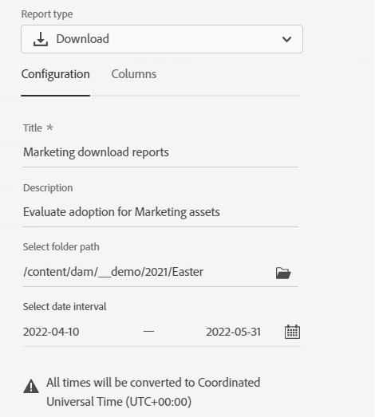

# Hantera rapporter {#manage-reports}

>[!CONTEXTUALHELP]
>id="assets_reports"
>title="Rapporter"
>abstract="Resursrapportering ger administratörer insyn i aktiviteten i visningsmiljön för Adobe Experience Manager Resurser. Dessa data ger användbar information om hur användarna interagerar med innehållet och produkten. Alla användare som har tilldelats administratörens produktprofil kan komma åt Insikter-instrumentpanelen eller skapa användardefinierade rapporter."

Resursrapportering ger administratörer insyn i aktiviteten i visningsmiljön för Adobe Experience Manager Resurser. Dessa data ger användbar information om hur användarna interagerar med innehållet och produkten.

## Åtkomstrapporter {#access-reports}

Alla användare som är tilldelade till resursvyn: Administratörens produktprofil kan komma åt instrumentpanelen för insikter eller skapa användardefinierade rapporter i resursvyn.

## Visa insikter {#view-live-statistics}

I resursvyn kan du visa realtidsdata för din resursvymiljö med Insikter-instrumentpanelen. Du kan visa händelsemått i realtid under de senaste 30 dagarna eller under de senaste 12 månaderna.

Klicka **[!UICONTROL Insights]** som finns i det vänstra navigeringsfönstret för att visa följande automatiskt genererade diagram:

* **Nedladdningar**: Antalet resurser som hämtats från resursvyn under de senaste 30 dagarna eller 12 månaderna representeras av ett linjediagram.

* **Överföringar**: Antalet resurser som har överförts till resursvymiljön under de senaste 30 dagarna eller 12 månaderna visas i ett linjediagram.

* **Vanliga sökningar**: Visa de mest sökbara termerna tillsammans med det antal gånger som de har sökts igenom i resursvyn under de senaste 30 dagarna eller 12 månaderna i tabellformat.

<!--

* **Storage usage**: The storage usage, in gigabytes (GB), for the Assets view environment, for the last 30 days or 12 months represented using a bar chart.

-->

## Skapa en nedladdningsrapport {#create-download-report}

Så här skapar du en hämtningsrapport:

1. Navigera till **[!UICONTROL Settings]** > **[!UICONTROL Reports]** och klicka **[!UICONTROL Create Report]**.

1. I [!UICONTROL Configuration] -flik anger du rapporttypen som **[!UICONTROL Download]**.

1. Ange en rubrik och en valfri beskrivning för rapporten.

1. Välj mappsökvägen, som omfattar de resurser som rapporten ska köras på, med hjälp av **[!UICONTROL Select Folder Path]** fält.

1. Välj datumintervall för rapporten.

   >[!NOTE]
   >
   > Resursvyn konverterar alla lokala tidszoner till UTC (Coordinated Universal Time).

1. I [!UICONTROL Columns] markerar du de kolumnnamn du vill visa i rapporten.

1. Klicka på **[!UICONTROL Create]**.

   

I följande tabell förklaras användningen av alla kolumner som du kan lägga till i rapporten:

<table>
    <tbody>
     <tr>
      <th><strong>Kolumnnamn</strong></th>
      <th><strong>Beskrivning</strong></th>
     </tr>
     <tr>
      <td>Titel</td>
      <td>Namnet på resursen.</td>
     </tr>
     <tr>
      <td>Bana</td>
      <td>Mappsökvägen där resursen är tillgänglig i resursvyn.</td>
     </tr>
     <tr>
      <td>MIME-typ</td>
      <td>MIME-typen för resursen.</td>
     </tr>
     <tr>
      <td>Storlek</td>
      <td>Resursens storlek i byte.</td>
     </tr>
     <tr>
      <td>Hämtat av</td>
      <td>E-post-ID för den användare som hämtade resursen.</td>
     </tr>
     <tr>
      <td>Hämtningsdatum</td>
      <td>Datumet då hämtningsåtgärden för resursen utförs.</td>
     </tr>
     <tr>
      <td>Författare</td>
      <td>Resursens författare.</td>
     </tr>
     <tr>
      <td>Skapad den</td>
      <td>Det datum då resursen överförs till resursvyn.</td>
     </tr>
     <tr>
      <td>Ändringsdatum</td>
      <td>Datumet då tillgången senast ändrades.</td>
     </tr>
     <tr>
      <td>Utgånget</td>
      <td>Tillgångens förfallostatus.</td>
     </tr>
     <tr>
      <td>Hämtat efter användarnamn</td>
      <td>Namnet på den användare som hämtade resursen.</td>
     </tr>           
    </tbody>
   </table>

## Skapa en överföringsrapport {#create-upload-report}

Så här skapar du en överföringsrapport:

1. Navigera till **[!UICONTROL Settings]** > **[!UICONTROL Reports]** och klicka **[!UICONTROL Create Report]**.

1. I [!UICONTROL Configuration] -flik anger du rapporttypen som **[!UICONTROL Upload]**.

1. Ange en rubrik och en valfri beskrivning för rapporten.

1. Välj mappsökvägen, som omfattar de resurser som rapporten ska köras på, med hjälp av **[!UICONTROL Select Folder Path]** fält.

1. Välj datumintervall för rapporten.

1. I [!UICONTROL Columns] markerar du de kolumnnamn du vill visa i rapporten.

1. Klicka på **[!UICONTROL Create]**.

   

I följande tabell förklaras användningen av alla kolumner som du kan lägga till i rapporten:

<table>
    <tbody>
     <tr>
      <th><strong>Kolumnnamn</strong></th>
      <th><strong>Beskrivning</strong></th>
     </tr>
     <tr>
      <td>Titel</td>
      <td>Namnet på resursen.</td>
     </tr>
     <tr>
      <td>Bana</td>
      <td>Mappsökvägen där resursen är tillgänglig i resursvyn.</td>
     </tr>
     <tr>
      <td>MIME-typ</td>
      <td>MIME-typen för resursen.</td>
     </tr>
     <tr>
      <td>Storlek</td>
      <td>Resursens storlek.</td>
     </tr>
     <tr>
      <td>Författare</td>
      <td>Resursens författare.</td>
     </tr>
     <tr>
      <td>Skapad den</td>
      <td>Det datum då resursen överförs till resursvyn.</td>
     </tr>
     <tr>
      <td>Ändringsdatum</td>
      <td>Datumet då tillgången senast ändrades.</td>
     </tr>
     <tr>
      <td>Utgånget</td>
      <td>Tillgångens förfallostatus.</td>
     </tr>              
    </tbody>
   </table>

## Visa befintliga rapporter {#view-report-list}

Efter [skapa rapporten](#create-download-report)kan du visa listan över befintliga rapporter och välja att hämta dem i CSV-format eller ta bort dem.

Om du vill visa en lista med rapporter går du till **[!UICONTROL Settings]** > **[!UICONTROL Reports]**.

För varje rapport kan du visa rapportrubrik, rapporttyp, beskrivning som anges när rapporten skapas, rapportens status, e-post-ID för den som skapade rapporten och rapportens skapandedatum.

`Completed ` rapportens status visar att rapporten är klar för hämtning.

## Hämta en CSV-rapport {#download-csv-report}

Så här hämtar du en rapport i CSV-format:

1. Navigera till **[!UICONTROL Settings]** > **[!UICONTROL Reports]**.

1. Välj en rapport och klicka på **[!UICONTROL Download CSV]**.

Den valda rapporten hämtas i CSV-format. Kolumnerna som visas i CSV-rapporten beror på vilka kolumner som du markerar när [skapa rapporten](#create-download-report).

## Ta bort en rapport {#delete-report}

Ta bort en rapport:

1. Navigera till **[!UICONTROL Settings]** > **[!UICONTROL Reports]**.

1. Välj en rapport och klicka på **[!UICONTROL Delete]**.

1. Klicka **[!UICONTROL Delete]** igen för att bekräfta.
