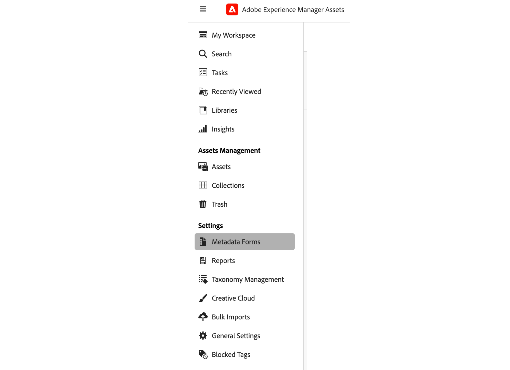
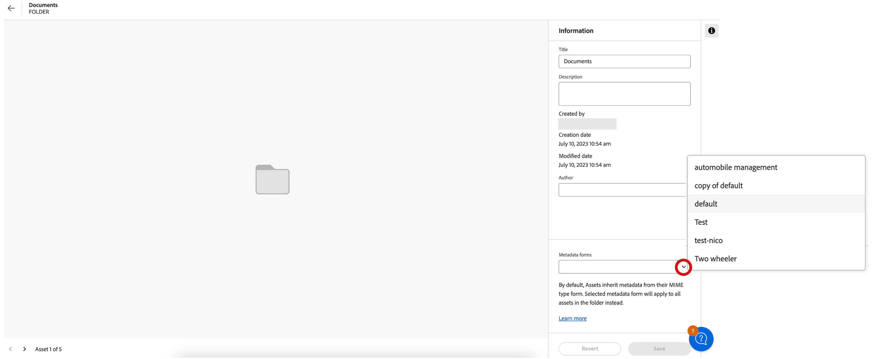

# Metadata i resursvyn {#metadata}

Metadata innebär data eller beskrivning av data. Dina bilder som en resurs kan t.ex. innehålla information om kameran som användaren klickade på eller copyright-information. Den här informationen är bildens metadata. Metadata är avgörande för effektiv resurshantering. Metadata är en samling av alla data som är tillgängliga för en tillgång, men de kanske inte nödvändigtvis finns i den tillgången.

Metadata hjälper er att kategorisera resurser ytterligare och är till hjälp när mängden digital information växer. Det går att hantera några hundra filer baserat på bara filnamn, miniatyrbilder och minne. Den här metoden är dock inte skalbar. Den blir kort när antalet inblandade personer och antalet hanterade resurser ökar.

Med hjälp av metadata ökar värdet på en digital resurs eftersom resursen blir

* Mer åtkomligt - system och användare hittar det enkelt.
* Enklare att hantera - du kan hitta resurser med samma uppsättning egenskaper enklare och använda ändringarna på dem.
* Fullständigt - materialet innehåller mer information och sammanhang med fler metadata.

Av dessa anledningar ger Assets dig rätt sätt att skapa, hantera och utbyta metadata för dina digitala resurser.

## Visa metadata {#view-metadata}

Om du vill visa metadata för en resurs bläddrar du till resursen eller söker efter resursen, markerar resursen och klickar på **[!UICONTROL Details]** i verktygsfältet.

*Bild: Om du vill visa en resurs och dess metadata klickar du på&#x200B;**[!UICONTROL Details]**i verktygsfältet eller dubbelklicka på resursen.*

Grundläggande metadata som titel, beskrivning och överföringsdatum finns i [!UICONTROL Basic] -fliken. The [!UICONTROL Advanced] -fliken innehåller mer avancerade metadata som kameramodell, objektivinformation och geotaggar. The [!UICONTROL Tags] -fliken innehåller automatiskt tillämpade taggar baserat på bildens innehåll.

## Uppdatera metadata {#update-metadata}

När administratören har konfigurerat metadataformuläret kan andra fält uppdateras manuellt. Du kanske vill ändra detta eftersom det bara läses baserat på metadataformuläret som finns i rutan.

## Smarta taggar {#smart-tags}

[!DNL Experience Manager Assets] använder artificiell intelligens från [Adobe Sensei](https://www.adobe.com/sensei.html) för att automatiskt lägga till relevanta taggar i alla dina överförda resurser. Dessa taggar, som kallas smarta taggar, ökar innehållshastigheten i dina projekt genom att hjälpa dig att snabbt hitta relevanta resurser. De smarta taggarna är ett exempel på metadata som inte finns i bilden.

De smarta taggarna används nästan i realtid och genereras baserat på bildens innehåll. När du överför en resurs visas användargränssnittet [!UICONTROL Processing] på miniatyrbilden av resursen ett tag. När bearbetningen är klar kan du [visa metadata](#view-metadata) och smarta taggar.

*Bild: Om du vill visa smarta taggar för en resurs klickar du på&#x200B;**[!UICONTROL Details]**i verktygsfältet eller dubbelklicka på resursen.*

Smarta taggar innehåller också ett konfidensintervall som ett procenttal. Det anger förtroendet som är kopplat till den tillämpade taggen. Du kan moderera de automatiskt tillämpade smarta taggarna.

## Lägga till eller uppdatera nyckelord {#manually-tag}

Du kan lägga till fler taggar i dina resurser, utöver de smarta taggar som läggs till automatiskt med [!DNL Adobe Sensei] smarta tjänster. Öppna en resurs för förhandsgranskning och klicka på [!UICONTROL Tags]och skriv önskade nyckelord i [!UICONTROL Keywords] fält. Om du vill lägga till taggen trycker du på Retur. [!DNL Assets view] indexerar nyckelordet i nära realtid och ditt team kan snart söka efter uppdaterade resurser med de nya nyckelorden.

Du kan även ta bort taggar från [!UICONTROL Smart Tags] avsnitt som automatiskt läggs till av [!DNL Assets view] till alla överförda resurser.

## Taxonomihantering {#taxonomy-management}

Taggar kan också kapslas i en hierarki för att stödja relationer som kategori och underkategori. Om du behöver infoga hierarkiska taggar hanteras de enkelt av administratören i [!UICONTROL Taxonomy Management] avsnitt i [!UICONTROL Settings]. Du kan skapa en styrd uppsättning namnutrymmen och taggar som alla användare kan använda när de beskriver innehållet. Det är bara administratörer som kan konfigurera tagghierarkier i [!UICONTROL Taxonomy Manager] säkerställa att värdena kontrolleras och används på ett konsekvent sätt.

## Konfigurera metadata-Forms {#metadata-forms}

>[!CONTEXTUALHELP]
>id="assets_metadata_forms"
>title="Metadata Forms"
>abstract="[!DNL Experience Manager Assets] innehåller många standardmetadatafält som standard. Organisationer har ytterligare metadatabehov och behöver fler metadatafält för att kunna lägga till företagsspecifika metadata. Med metadataformulär kan företag lägga till anpassade metadatafält på sidan Detaljer för en resurs. De företagsspecifika metadata förbättrar styrningen och identifieringen av dess resurser."

Resursvyn innehåller många standardmetadatafält som standard. Organisationer har ytterligare metadatabehov och behöver fler metadatafält för att kunna lägga till företagsspecifika metadata. Med metadataformulär kan företag lägga till anpassade metadatafält i en resurs [!UICONTROL Details] sida. De företagsspecifika metadata förbättrar styrningen och identifieringen av dess resurser. Du kan skapa formulär från grunden eller återanvända ett befintligt formulär.

Du kan konfigurera metadataformulär för olika typer av resurser (olika MIME-typer). Använd samma formulärnamn som filens MIME-typ. Resursvyn matchar automatiskt den överförda resursens MIME-typ med namnet på formuläret och uppdaterar metadata för de överförda resurserna baserat på formulärfälten.
<!--
For example, if a metadata form by the name `PDF` or `pdf` exists, then the uploaded PDF documents contain metadata fields as defined in the form.
-->
Resursvyn använder följande sekvens för att söka efter befintliga metadataformulärnamn för att tillämpa metadatafälten på de överförda resurserna av en viss typ:

MIME-undertyp > MIME-typ > `default` form > Out-of-box form

Om ett metadataformulär till exempel har namnet `PDF` eller `pdf` finns, innehåller de överförda PDF-dokumenten metadatafält som definierats i formuläret. Om ett metadataformulär har namnet `PDF` eller `pdf` finns inte, resursvyn matchar om det finns ett metadataformulär med namnet `application`. Om det finns ett metadataformulär med namnet `application`innehåller de överförda PDF-dokumenten metadatafält som definierats i formuläret. Om resursvyn fortfarande inte hittar något matchande metadataformulär söker den efter `default` metadataformulär för att använda metadatafält som definieras i formuläret på de överförda PDF-dokumenten. Om inget av dessa steg fungerar, används metadatafält som är definierade i det färdiga formuläret i resursvyn för alla överförda PDF-dokument.
Om du vill tilldela ett metadataformulär till en mapp [se](#assign-metadata-form-folder).

>[!IMPORTANT]
>
>Det nya metadataformuläret för en viss filtyp ersätter helt standardmetadataformuläret som [!DNL Assets view] tillhandahåller. Om du tar bort eller byter namn på ett metadataformulär är standardmetadatafälten igen tillgängliga för nya resurser.

Så här skapar du ett metadataformulär:

1. Klicka på **[!UICONTROL Settings]** > **[!UICONTROL Metadata Forms]**.

   

1. Klicka **[!UICONTROL Create]**, i det övre högra hörnet av användargränssnittet.
1. Ange ett namn för formuläret och klicka på **[!UICONTROL Create]**.
1. Ange ett namn för fliken i **[!UICONTROL Settings]** i rätt spår.
1. Från **[!UICONTROL Components]** som finns till vänster drar du de nödvändiga komponenterna på en flik i formuläret. Dra komponenterna i önskad sekvens.

   

   *Bild: Gränssnitt för att skapa metadataformulär med alternativ för att lägga till komponenter och möjlighet att förhandsgranska formuläret.*

1. Ange ett namn i **[!UICONTROL Settings]** Ange en mappning med de egenskaper som stöds i den högra listen.
1. Om du vill kan du markera **[!UICONTROL Required]** för att göra metadatafältet obligatoriskt och markera **[!UICONTROL Read-Only]** för att göra fältet icke-redigerbart i resursen [!UICONTROL Details] sida.
1. Om du vill kan du klicka **[!UICONTROL Preview]** om du vill förhandsgranska formuläret som du skapar.
1. Du kan också lägga till fler flikar och de nödvändiga komponenterna på varje flik.
1. Klicka **[!UICONTROL Save]** när formuläret har fyllts i.

I den här videon visas stegsekvensen:

>[!VIDEO](https://video.tv.adobe.com/v/341275)

När ett formulär har skapats används det automatiskt när användare överför en resurs av den matchande MIME-typen.

Om du vill återanvända ett befintligt formulär och skapa ett nytt, markerar du ett metadataformulär, klickar på **[!UICONTROL Copy]** ange ett namn i verktygsfältet och klicka på **[!UICONTROL Confirm]**. Du kan redigera ett metadataformulär om du vill ändra det. När du ändrar ett formulär används det för resurser som överförts efter ändringen. De befintliga resurserna ändras inte.

### Egenskapskomponenter {#property-components}

Du kan anpassa metadataformuläret med någon av följande egenskapskomponenter. Dra och släpp komponenttypen i formuläret där du vill ha den och ändra komponentinställningarna.
Nedan visas en översikt över varje egenskapstyp och hur de lagras.

| Komponentnamn | Beskrivning |
|---|---|
| Dragspelsbehållare | Lägg till en rubrik för en lista med gemensamma komponenter och egenskaper. Den kan expanderas eller komprimeras som standard. |
| Enkelradig text | Lägg till en enkelradig textegenskap. |
| Flerradstext | Lägg till flera textrader eller ett stycke. Den utökas som en användartyp och innehåller allt innehåll. |
| Text med flera värden | Lägg till en textegenskap med flera värden. |
| Nummer | Lägg till en sifferkomponent. |
| Kryssruta | Lägg till ett booleskt värde. Lagras som TRUE eller FALSE när ett värde har sparats. |
| Datum | Lägg till en datumkomponent. |
| Nedrullningsbar meny | Lägg till en listruta. |
| Läge | Lägg till egenskapen för databastillstånd (mappas till repo:state) |
| Resursstatus | Lägg till standardegenskapen för tillgångsstatus (mappas till dam:assetStatus) |
| Taggar | Lägg till en tagg från värden som lagras i taxonomihantering (mappas till xcm:tags). |
| Nyckelord | Lägg till nyckelord med valfri form (mappas till dc:subject). |
| Smarta taggar | Förbättra sökfunktionerna genom att automatiskt lägga till metadatataggar. |

### Tilldela metadataformulär till en mapp {#assign-metadata-form-folder}

Du kan också tilldela ett metadataformulär till en mapp i resursvydistributionen. Metadataformuläret som tilldelats en mapp enligt MIME-typen skrivs över när du tillämpar ett metadataformulär manuellt på en mapp. Alla resurser i mappen, inklusive resurser i undermapparna, visar sedan egenskaper som definierats i metadataformuläret.

Så här tilldelar du ett metadataformulär till en mapp:

1. Navigera till **[!UICONTROL Settings]** > **[!UICONTROL Metadata Forms]** och välj ett metadataformulär.

2. Klicka på **[!UICONTROL Assign to Folder]**.

3. Markera mappen och klicka på **[!UICONTROL Assign]**.

   

   Du kan också navigera till mappinformationssidan och välja ett metadataformulär från mappegenskaperna som är tillgängliga i den högra rutan för att tilldela metadataformuläret till mappen.

   

## Nästa steg {#next-steps}

* [Titta på en video om hur du hanterar metadataformulär i resursvyn](https://experienceleague.adobe.com/docs/experience-manager-learn/assets-essentials/configuring/metadata-forms.html)

* Ge produktfeedback med [!UICONTROL Feedback] alternativ som finns i användargränssnittet i resursvyn

* Ge feedback på dokumentationen med [!UICONTROL Edit this page]  eller [!UICONTROL Log an issue]  som finns till höger

* Kontakt [Kundtjänst](https://experienceleague.adobe.com/?support-solution=General#support)

<!-- TBD: Cannot create a form using the second option. Documenting only the first option for now.
To reuse an existing form to create a form, do one of these:

* Select a metadata form and click **[!UICONTROL Copy]** from the toolbar, provide a name, and click **[!UICONTROL Confirm]**.

* Click **[!UICONTROL Create]**, select **[!UICONTROL Use existing form structure as template]** option, and select an existing form. 
-->

<!-- TBD: Queries for PM and engg.

Can we edit the existing metadata in any form?

How to moderate smart tags?

Allow or deny list for smart tags?

What about Tags displayed just above Smart Tags in the UI?

Is there a detailed metadata tab. Where do the other details of an asset go?

How can one search based strictly on the metadata. Similar to AEM Assets GQL queries.
-->

<!-- TBD: Link to related articles if any.

>[!MORELIKETHIS]
>
>* [Search assets](search.md).
-->
