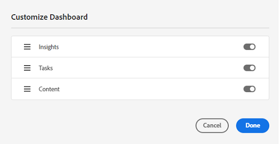

# My Workspace for Assets {#my-workspace}

>[!CONTEXTUALHELP]
>id="assets_my_workspace"
>title="Mina Workspace"
>abstract="Assets har nu en anpassningsbar arbetsyta med widgetar som du kan använda för att enkelt komma åt viktiga delar av Assets användargränssnitt och information som är relevant för dig. Den här sidan är en helhetslösning som ger en översikt över dina arbetsobjekt och ger snabb åtkomst till viktiga arbetsflöden."

Assets har nu en anpassningsbar arbetsyta med widgetar som du kan använda för att enkelt komma åt viktiga delar av Assets användargränssnitt och information som är relevant för dig. Den här sidan är en helhetslösning som ger en översikt över dina arbetsobjekt och ger snabb åtkomst till viktiga arbetsflöden. Mer lättåtkomlig åtkomst till dessa alternativ ökar effektiviteten och ökar innehållets hastighet.

Du kommer åt My Workspace genom att klicka **[!UICONTROL My Workspace]** från de objekt som är tillgängliga i den vänstra navigeringsrutan. Mitt Workspace innehåller en mängd widgetar som visar widgetar för snabbåtkomst, insikter, uppgifter och innehåll. Du kan konfigurera hur dessa widgetar visas i din Workspace utifrån dina inställningar.

>[!NOTE]
>
>Widgeten Insights visas bara för administratörer.

<!--

**New features coming soon**

Highlights upcoming features for Assets.

-->

**Snabb åtkomst**

Fäst filer, mappar och samlingar för snabbare åtkomst till dessa objekt när du behöver dem senare. Alla fästa objekt visas i **Snabb åtkomst** i My Workspace. Du kan komma åt dem med Mitt Workspace i stället för att navigera till den plats där de sparas i databasen.

Så här fäster du en resurs, en mapp eller en samling:

1. Markera objektet och klicka på **[!UICONTROL Pin to Quick Access]**.

1. Välj om du behöver fästa objektet bara för dig, för hela organisationen eller för valda grupper. Om du väljer **[!UICONTROL For groups]** väljer du ett befintligt gruppnamn i **[!UICONTROL Pin for groups]** fält.

   
1. Klicka på **[!UICONTROL Pin]**.

   Det markerade objektet visas i **[!UICONTROL Quick Access]** i My Workspace.
   

**Insikter**

Administratörer kan se en sammanfattning av antalet nedladdningar och uppladdningar som gjorts i Assets under de senaste 30 dagarna. Klicka **[!UICONTROL View all]** för att snabbt navigera till Insights-sidan för mer detaljerade instrumentpaneler.

Du kan även visa de mest sökbara termerna tillsammans med det antal gånger som termerna söks igenom i din Assets-vydistribution med **Insikter** i My Workspace. Du kan även navigera till detaljerade insikter för att visa de vanligaste sökningarna under de senaste 30 dagarna eller 12 månaderna.

**Uppgifter**

Visar en lista över uppgifter som för närvarande är tilldelade dig i **[!UICONTROL My Tasks]** -fliken, som du har skapat i **[!UICONTROL Assigned tasks]** och de uppgifter som du redan har slutfört i **[!UICONTROL Completed tasks]** -fliken. Du kan välja en uppgift och klicka på **[!UICONTROL Complete ask]** för att godkänna eller avvisa en uppgift. Du kan också välja en uppgift och klicka på **[!UICONTROL Open Task Details]** om du vill visa uppgiften och godkänna, avvisa, redigera eller ta bort den.

>[!NOTE]
>
> The **[!UICONTROL Assign Tasks]** kan du tilldela en uppgift för en resurs till en annan användare när du markerar en resurs eller när du öppnar vyn med resursinformation.

**Innehåll**

Visar utvalda vyer av resurser, inklusive en lista över resurser som du nyligen har visat. Du kan välja att visa resurser i widgeten i en listvy, stödrastervy, gallerivy eller vattenfallsvy och sortera resurserna efter namn, storlek och ändringsdatum. Du kan också välja en resurs om du vill visa resursinformationen eller ta bort den från listan över nyligen visade resurser.

The **[!UICONTROL Top Downloads]** På -fliken visas de tio mest hämtade resurserna i din Assets-visningsmiljö. Du kan välja att visa resurser i listvyn eller stödrastervyn. Båda vyerna visar formattyp och antal hämtningar för varje resurs. Du kan också välja en resurs och klicka på **[!UICONTROL Details]** för att visa dess egenskaper.

## Anpassa min Workspace {#configure-widgets}

Alla widgetar visas som standard, men du kan aktivera eller inaktivera widgetar som visas i Min Workspace. Inställningarna är specifika för varje användare.

1. Klicka **[!UICONTROL My Workspace]** finns i den vänstra navigeringsrutan och klickar på **[!UICONTROL Customize]**.

1. Stäng av växlingsknappen för widgeten som du inte behöver visa i Workspace. Du kan också dra en widget till en lämplig plats för att uppdatera dess visningsordning i Workspace.

1. Klicka **[!UICONTROL Done]** för att spara ändringarna.

   
