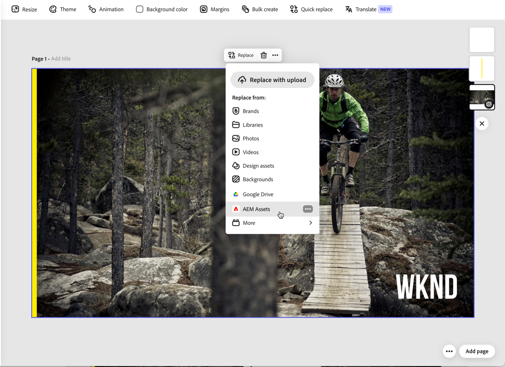

# Använd Content Advisor för att få åtkomst till AEM Assets i Adobe Express {#native-integration-adobe-express-using-content-advisor}

Adobe Experience Manager (AEM) Assets kan integreras med Adobe Express så att du kan hitta, få tillgång till och använda resurser från AEM Assets direkt i Express-gränssnittet med hjälp av Content Advisor.

Content Advisor förändrar hur du identifierar och använder resurser i Adobe Express genom att göra en smart, kontextmedveten resursidentifiering direkt i ditt kreativa arbetsflöde. I stället för att söka efter resurser genom att skriva nyckelord, kan Content Advisor hitta relevanta, godkända resurser baserat på innehållet på arbetsytan, kampanjöversikten och avsikten, vilket hjälper dig att hitta rätt resurs snabbare.

Med smarta förslag, tillgång till dynamiska medierenderingar och full insyn i metadata för materialet kan du med Content Advisor effektivt hitta, utvärdera och använda material från AEM Assets utan att behöva lämna Adobe Express. Detta garanterar snabbare innehållsskapande, förbättrad återanvändning av resurser och konsekvent användning av godkända varumärkeskompatibla resurser.


Du kan också placera resurser på Express Canvas och spara nytt eller redigerat innehåll tillbaka till AEM Assets, vilket garanterar centraliserad resurshantering och styrning. Integrering med Adobe Express ger följande fördelar:

* Snabbare framtagning av innehåll med sammanhangsberoende tillgångsidentifiering och rekommendationer.

* Större återanvändning av innehåll genom att redigera befintligt material och spara nytt material i AEM Assets.

* Snabbare åtkomst till godkända, kanaloptimerade dynamiska mediaåtergivningar.

* Minskad tid och arbete med att skapa nya resurser eller nya versioner samtidigt som varumärkets enhetlighet bevaras.

## Förutsättningar {#prerequisites}

Tillstånd att få tillgång till Adobe Express och minst en miljö i AEM Assets. Miljön kan vara någon av Assets as a Cloud Service-databaserna.

## Använda AEM Assets i Adobe Express Editor {#use-aem-assets-in-express}

Så här börjar du använda AEM Assets i Adobe Express Editor:

1. Öppna Adobe Express webbprogram.

2. Öppna en ny tom arbetsyta genom att läsa in en ny mall eller ett projekt, eller genom att skapa en resurs.

3. Klicka på **[!UICONTROL Assets]** i den vänstra navigeringsrutan. Adobe Express visar [Content Advisor](#intelligent-asset-discovery-content-advisor), som listar de databaser som du har behörighet att komma åt tillsammans med en lista över resurser och mappar som är tillgängliga på rotnivå.

4. Bläddra eller sök efter resurser i databasen med [Content Advisor](#intelligent-asset-discovery-content-advisor) och dra och släpp dem sedan på arbetsytan. Du kan också klicka på resurserna för att placera dem på arbetsytan. Du kan också filtrera  resurser efter olika villkor, till exempel godkännandestatus, filtyp, MIME-typ och dimensioner.

   >[!NOTE]
   >
   >Filtrera efter dimension gäller inte videoklipp.

   

## Intelligent resursidentifiering med Content Advisor {#intelligent-asset-discovery-content-advisor}

Content Advisor hjälper er att identifiera relevanta resurser med hjälp av intelligenta, kontextmedvetna rekommendationer som baseras på ert innehåll på arbetsytan eller i en kampanjöversikt. Du kan också välja kanalklara dynamiska medierenderingar som är optimerade för ditt användningssätt.


Content Advisor visar listan över filer, mappar och samlingar i list- och stödrastervyn. Du kan lägga till resurser i PNG-, JPEG-, PSD-, MP4-, SVG- och PDF-format på arbetsytan med Express. Du kan även förhandsgranska de rullningsbara PDF-filerna eller andra formattyper genom att klicka på ikonen  som finns på resurskortet.

Klicka på ikonen  om du även vill visa metadata för resursen på fliken **[!UICONTROL Basic]** eller visa de dynamiska medieåtergivningarna som finns på fliken [Dynamiska media](#dynamic-media-renditions-content-advisor) . Dra och släpp det föreslagna innehållet på arbetsytan. Du kan också klicka på resursen för att placera dem automatiskt på arbetsytan.


>[!IMPORTANT]
> 
>Se till att du väljer en **författardatabas** i listrutan **Databas** . En **leveransdatabas** visar inte Content Advisor-funktioner.
>
> Dessutom har databasen **delivery** inga resurser ordnade i mappar och samlingar. Alla resurser visas på rotnivån i en platt struktur.

Content Advisor innehåller följande viktiga funktioner:

* [AI-sökning för smartare tillgångsidentifiering](#content-advisor-ai-search)

* [Smarta förslag baserade på sammanhang och avsikter](#smart-suggestions-content-advisor)

* [Kampanjgenomgångar för att identifiera relevanta resurser](#campaign-briefs-content-advisor)

* [Dynamiska medierenderingar finns tillgängliga för användning](#dynamic-media-renditions-content-advisor)

* [Få åtkomst till metadata för resurser i enlighet med Assets-vyn](#asset-metadata-content-advisor)

* [Åtkomstfilter som överensstämmer med Assets-vyn](#filters-content-advisor)

* [Få åtkomst till och återanvända senaste och sparade sökningar](#saved-searches-content-advisor)

* [Sök efter resurser i och mellan samlingar](#search-collections-content-advisor)

### AI-sökning för smartare tillgångsidentifiering {#content-advisor-ai-search}

Content Advisor använder en avancerad sökfunktion som förstår innebörden och avsikten bakom en användarfråga i stället för att förlita sig på exakta nyckelordsmatchningar. Det använder artificiell intelligens (AI) och maskininlärning för att leverera mer korrekta och kontextmedvetna resultat.

Till skillnad från traditionell nyckelordsbaserad sökning, som söker efter exakta termer, tolkas relationerna mellan ord, begrepp och användarmetod i AI Search. Detta gör att användarna hittar det de söker efter, även om deras fråga är formulerad på ett annat sätt, innehåller stavfel eller är på ett annat språk.


Några av fördelarna med den:

* Flerspråksstöd: Sök på flera språk utan exakta översättningar. Användarna kan hitta relevant innehåll oavsett frågespråk.

* Hantera felstavningar: Tolkar stavfel och stavfel, vilket ger korrekta resultat även om de inte är perfekta.

* Förstå synonymer: Ger resultat för relaterade termer och fraser, så användarna behöver inte gissa rätt nyckelord.

* Kontextmedveten sökning: Identifierar avsikten bakom en fråga, inte bara de exakta orden.

>[!IMPORTANT]
> 
>* Den lägsta version av AEM som krävs för att få åtkomst till AI-sökning i Content Advisor är `21994`.


### Smarta förslag baserade på sammanhang och avsikter {#smart-suggestions-content-advisor}

Content Advisor visar smarta förslag baserat på kontexten och avsikten med innehållet på Express Canvas. Detta hjälper er att snabbt identifiera och använda resurser som är anpassade till era innehållsbehov utan den tidskrävande manuella sökningen.


>[!IMPORTANT]
> 
>* Content Advisor visar smarta förslag baserat på kontexten och avsikten med det innehåll som är tillgängligt i textlagren eller titeln på arbetsytan Express. Resultatet visas inte baserat på de bilder som är tillgängliga på arbetsytan.
>* Du måste signera en GenAI-version för att komma åt den här funktionen i Content Advisor. Kontakta din Adobe-representant om du vill signera GenAI-version.
>* Den lägsta version av AEM som krävs för att få tillgång till den här funktionen är `21994`.
>* Smarta förslag uppdateras inte automatiskt när du uppdaterar arbetsytan. Klicka på uppdateringsikonen på panelen **Föreslaget innehåll** för att visa den uppdaterade listan med förslag,

### Kampanjgenomgångar för att identifiera relevanta resurser {#campaign-briefs-content-advisor}

Med Content Advisor kan du ladda upp ett kampanjdokument för att upptäcka relevanta resurser utan att behöva ange söknyckelord manuellt. Content Advisor analyserar informationen i kampanjöversikten för att förstå kampanjens avsikt och rekommenderar relevanta resurser som är tillgängliga i AEM Assets.


>[!IMPORTANT]
>
>* Content Advisor analyserar informationen som är tillgänglig som text i kampanjöversikten för att rekommendera relevanta resurser. Den analyserar inte den information som finns som bilder i kampanjöversikten.
>* De filtyper som stöds och som du kan överföra som en kampanjrapport är bland annat PDF-, DOCX- och TXT-dokument.
>* Du måste signera en GenAI-version för att komma åt den här funktionen i Content Advisor. Kontakta din Adobe-representant om du vill signera GenAI-version.
>* Den lägsta version av AEM som krävs för att få tillgång till den här funktionen är `21994`.

### Dynamiska medierenderingar finns tillgängliga för användning {#dynamic-media-renditions-content-advisor}

Dynamiska mediaåtergivningar innehåller färdiga, kanaloptimerade versioner av resurser, inklusive [bildförinställningar](/help/assets/dynamic-media/managing-image-presets.md), [smarta beskärningar](/help/assets/dynamic-media/image-profiles.md), formattyper och färgprofiler. Dessa renderingar säkerställer att den valda resursen uppfyller kraven på kanaler och design utan manuell redigering eller duplicering av resurser.

Du kan också använda dynamiska mediamodifierare för att förhandsgranska justeringar i realtid innan du placerar återgivningen på Express-arbetsytan, vilket ger ett snabbare val av den lämpligaste återgivningen samtidigt som enhetlighet och kvalitet bevaras.

Klicka på ikonen  på resurskortet och välj fliken **[!UICONTROL Dynamic Media]** för att visa tillgängliga återgivningar för en resurs. Du kan välja att visa [Dynamic Media Scene7](/help/assets/dynamic-media/dynamic-media.md)-renderingar eller [Dynamic Media med OpenAPI](/help/assets/dynamic-media-open-apis-overview.md)-renderingar. När du väljer **[!UICONTROL OpenAPI]** för en resurs visas endast tillgängliga återgivningar om resursen har godkänts och är tillgänglig för Dynamic Media med OpenAPI.

Du måste ha en giltig licens för AEM Dynamic Media för att kunna visa fliken Dynamic Media.


Klicka på ikonen  om du vill förhandsgranska återgivningen eller klicka på återgivningsnamnet om du vill placera dem automatiskt på arbetsytan. Du kan också förhandsgranska återgivningen och sedan dra och släppa den för att placera bilden på arbetsytan.


Klicka på **[!UICONTROL Add Modifiers]**, ange en modifierare i textrutan och tryck på Retur för att använda omvandlingen på återgivningarna i realtid. På samma sätt kan du lägga till flera modifierare i en återgivning och förhandsgranska dessa omvandlingar. Dra och släpp resursen från förhandsgranskningen på arbetsytan. Återgivningen efter att dessa modifierare har använts sparas inte. Se listan över modifierare som stöds för [Dynamic Media Scene7](https://experienceleague.adobe.com/en/docs/dynamic-media-developer-resources/image-serving-api/image-serving-api/http-protocol-reference/command-reference/c-command-reference) och [Dynamic Media med OpenAPI](https://developer.adobe.com/experience-cloud/experience-manager-apis/api/stable/assets/delivery/#operation/getAssetSeoFormat).

>[!IMPORTANT]
> 
>Dynamic Media övervinner storleksbegränsningen på 80 MB för överföring av filer i Adobe Express (webb) genom att tillhandahålla optimerade återgivningar av stora resurser. Dynamic Media-renderingar minskar filstorleken avsevärt samtidigt som den visuella kvaliteten bevaras. En TIFF-resurs på 300 MB kan till exempel levereras som en 2,5 MB-rendering utan att kompromissa med kvaliteten, vilket möjliggör effektiv användning av högupplösta mediefiler i Adobe Express.

### Få åtkomst till metadata för resurser i enlighet med Assets-vyn {#asset-metadata-content-advisor}

Content Advisor ger åtkomst till resursegenskaper som definieras i AEM Assets, inklusive metadata som är tillgängliga i Assets-vyn. Content Advisor använder samma metadatakonfiguration som i Assets View, vilket replikerar listan med metadataflikar och innehåll på sidan med information om Assets-resurser. På så sätt kan du granska viktig resursinformation som titel, beskrivning, format, storlek och andra metadata innan du väljer en resurs. Åtkomst till resursegenskaper hjälper dig att välja rätt och godkänd resurs för ditt innehåll.


Klicka på ikonen  på resurskortet och välj fliken **[!UICONTROL Basic]** för att visa metadata för resursen. Du kan även visa andra metadata för resurser, till exempel Produkt, Kampanj och Taggar, i enlighet med metadata för resursen som finns i Assets-vyn.

Content Advisor visar egenskaper (metadata) för filer i en skrivskyddad vy. Egenskaperna visas inte för samlingar och mappar.

### Åtkomstfilter som överensstämmer med Assets-vyn {#filters-content-advisor}

Content Advisor har samma filtreringsfunktioner i Express som finns i Assets-vyn, vilket gör att du kan förfina resurser med fördefinierade filter. Samma filtreringsfunktioner som finns i Assets-vyn gäller också för filter som är specifika för innehållstyper som filer, mappar och samlingar. Detta ger en konsekvent upplevelse av tillgångsidentifiering och hjälper er att effektivt hitta relevanta resurser i Adobe Express.

Om du inte har ställt in filter i Assets-vyn via filterschema, visar Content Advisor färdiga filter som filtyp, Filformat, Resursstatus, Filstorlek, Bildbredd, Bildhöjd, Ändringsdatum och Skapat den.

### Få åtkomst till och återanvända senaste och sparade sökningar {#saved-searches-content-advisor}

Sparade sökningar som har skapats i Assets-vyn är också tillgängliga, vilket gör att du kan återanvända fördefinierade sökvillkor. Sparade sökningar fungerar på samma sätt i Assets-vyn och Content Advisor i olika webbläsare. På så sätt kan du effektivt hitta resurser med hjälp av enhetliga sökmönster i AEM Assets och Adobe Express.

Så här sparar du ofta använda sökningar med hjälp av Content Advisor:

1. Ange en sökterm (valfri), klicka på filterikonen och välj alternativ baserat på dina krav för att skapa en sökfråga.

1. Klicka på **[!UICONTROL Apply]** för att visa resultatet.

1. Klicka på filterikonen > **Hantera sparade sökningar** > **Skapa ny sparad sökning**.

1. Ange namnet på sökningen och klicka på  för att spara den. Sökningen visas i listan med objekt.

   

Om du vill använda något av de sparade sökobjekten klickar du på filterikonen, markerar sökobjektet i listrutan **[!UICONTROL Saved Searches]** och klickar på **[!UICONTROL Apply]**.

Content Advisor sparar dina senaste sökningar och gör det även möjligt att spara sökningar som du använder ofta för snabb åtkomst senare. Listan över de senaste sökningarna är inte konsekvent mellan Assets-vyn och Content Advisor. Samma användare kan ha olika uppsättningar av senaste sökningar i Assets-vyn och Content Advisor. Om du använder Incognito-läget för att komma åt Content Advisor är listan med senaste sökningar inte tillgänglig. Dessutom delas inte de senaste sökningarna mellan olika webbläsare för samma användare, utan sökningen är miljöspecifik för AEM.


Standardfunktionen för sparad sökning, som är tillgänglig i Assets-vyn, är inte tillgänglig än i Content Advisor.

### Sök efter resurser i och mellan samlingar {#search-collections-content-advisor}

Med Content Advisor kan du söka efter resurser eller samlingar i alla samlingar eller begränsa sökningen till en viss samling. På så sätt kan du snabbt hitta och använda resurser från välstrukturerade samlingar samtidigt som du bevarar deras avsedda organisationssammanhang.

## Ersätta bild med AEM-överföring {#replace-image-using-aem-upload}

Dessutom kan du ersätta de tillagda bilderna med **[!UICONTROL AEM Upload]**. Gör så här:

1. Bläddra bland eller sök resurser och dra och släpp dem på arbetsytan.

1. Markera den bild som du vill ersätta. Klicka på **[!UICONTROL Replace]** och välj **[!UICONTROL AEM Assets]** bland andra alternativ.

   

1. [Content Advisor](#intelligent-asset-discovery-content-advisor) öppnas i den vänstra navigeringsrutan. Adobe Express visar en lista över databaser som du har behörighet att komma åt tillsammans med en lista över resurser och mappar som är tillgängliga på rotnivå. Välj en resurs där för att förhandsvisa ersättningen på arbetsytan och klicka sedan på **[!UICONTROL Replace]** för att bekräfta.

   >[!NOTE]
   >
   > SVG-filtyper stöds inte.

## Spara Adobe Express-projekt i AEM Assets {#save-express-projects-in-assets}

När du har infogat lämpliga ändringar på arbetsytan Express kan du spara den i AEM Assets.

1. Klicka på **[!UICONTROL Share]** för att öppna dialogrutan **[!UICONTROL Share]**.

   

2. Välj **AEM Assets**. Adobe Express visar dialogrutan för överföring.

3. Välj antingen **Aktuell sida** eller **Alla sidor**. Ange ett namn och format för de resurser som ska exporteras. Du kan exportera arbetsytans innehåll i PNG-, JPEG-, PDF-, MP4-, MP4+PNG- eller MP4+JPEG-format. Formatet justeras automatiskt baserat på resursen/resurserna på arbetsytans sida/sidor.
Om du väljer **Aktuell sida** sparas resursen på den aktuella sidan i målmappen. Om du väljer **Alla sidor** och exportformatet inte är PDF, sparas alla sidor på arbetsytan som separata filer i en ny mapp i målmappen. Om exportformatet är PDF sparas alla arbetsytesidor som en enda PDF-fil i målmappen.

4. Klicka på mappikonen under **Målmapp** för att välja en plats och spara resurserna.

   

5. Valfritt: Du kan lägga till kampanjmetadata för överföringen med fältet **Projekt eller kampanjnamn**. Du kan använda ett befintligt namn eller skapa ett nytt. Du kan definiera flera projekt- eller kampanjnamn för överföringen. Registrera namnet genom att skriva namnet och trycka på Retur.
Adobe rekommenderar att du anger värden i resten av fälten och skapar en förbättrad sökupplevelse för dina överförda resurser.

6. Definiera värden för fälten **[!UICONTROL Keywords]** och **[!UICONTROL Channels]**.

7. Klicka på **[!UICONTROL Upload]** för att överföra resurserna till AEM Assets.

   <table> 
    <tbody>
     <tr>
      <th><strong>Format som stöds</strong></th>
      <th><strong>Storlek</strong></th>
     </tr>
    </tr>
    <tr>
        <td>[!UICONTROL JPEG]</td>
        <td> 65 MP (t.ex. 8K x 8K eller 16 K x 4K) </td>
    </tr>
    <tr>
        <td>[!UICONTROL PNG]</td>
        <td> 65 MP (t.ex. 8K x 8K eller 16 K x 4K) </td>
    </tr>
    <tr>
        <td>[!UICONTROL SVG]</td>
        <td> Högst 250 kB</td>
    </tr>
    <tr>
        <td>[!UICONTROL MP4]</td>
        <td> 3 840 × 3 840 pixlar, maximalt 200 MB</td>
    </tr>
    <tr>
      <td colspan="2"> <i> Resursens storlek måste vara mindre än 80 MB för skrivbordsenheter och 40 MB för mobila enheter. </i></td>
   </tr>
    </tbody>
   </table>

## Begränsningar {#limitations}

1. För import och export är den videofiltyp som stöds MP4.

2. För **MP4-videoimport** stöds inte videofilmer med genomskinliga bakgrunder (alfakanal).
   <!--
   1. The maximum file size supported is 200 MB. If this limit exceeds, an alert message displays.
   2. The maximum supported resolution is 3840 X 3840 pixels.
   3. Videos with transparent backgrounds (alpha channel) are not supported.
   -->

3. För **MP4-videoexport** är den största filstorlek som stöds 200 MB. Om gränsen överskrids föreslår en varning att videon trimmas till 200 MB eller mindre, eller att den överförs manuellt till AEM Assets målmapp när den har laddats ned.

<!--
## Content Advisor Properties {#content-advisor-props}

You can configure following properties for the content advisor:

* `featureSet` : This property enables the Content Advisor MFE.

    ```
    featureSet: [
        ...defaultFeatures, /* to include all default features */
        'advisor', /* enables Content Advisor features */
        'content-fragments', /* enables Content Fragments */
    ],
    ```

* `rail:true/false` : If marked true, Content Advisor is rendered in a left rail view. If it is marked false, the Content Advisor is rendered in modal view.

## Browse assets using Content Advisor {#browse-assets-content-advisor}

<!--In the Modal View of Content Advisor, you can access both [Assets](#using-assets-tab) and [Content Fragments](#using-content-fragments) within a unified interface.

### Assets tab{#assets-tab}

The **[!UICONTROL Assets]** tab allows you to browse or filter available assets, preview them before selection, and choose appropriate **[!UICONTROL Dynamic Media]** [renditions](renditions.md) or [smart crops](/help/assets/dynamic-media/image-profiles.md#creating-image-profiles) as needed. Assets, folders, and collections are presented together in a single, streamlined experience. The interface also provides contextual recommendations based on the integrated application context, helping you quickly identify relevant content.

Within assets tab, you can access content by browsing [Files and folders](#content-advisor-files-and-folders) or viewing [Collections](#content-advisor-collections).

### Files and Folders tab{#content-advisor-files-and-folders}

Browsing content using Files and Folders allows you navigate your assets in a familiar hierarchical structure, making it easy to locate assets within the repository. To browse assets within files and folders, navigate to the **[!UICONTROL Assets]** tab and select **[!UICONTROL Files & Folders]**. A hierarchical structure is then displayed, allowing you to easily locate and select the desired assets.


### Collections tab{#content-advisor-collections}

Browsing content using Collections allows you to access curated groups of assets within Collections. To browse assets within Collections, navigate to the **[!UICONTROL Assets]** tab and select **[!UICONTROL Collections]**. The interface then displays curated groups of assets, enabling you to browse the content you need.


<!--
### Content Fragments tab{#content-fragments}

The [Content Fragments](/help/assets/content-fragments/content-fragments.md) tab displays structured assets, allowing you to browse, search, and filter fragments efficiently within the same interface. To browse assets using Content Fragments, navigate to the **[!UICONTROL Content Fragments]** tab to access and explore the fragments available in the repository.


-->


