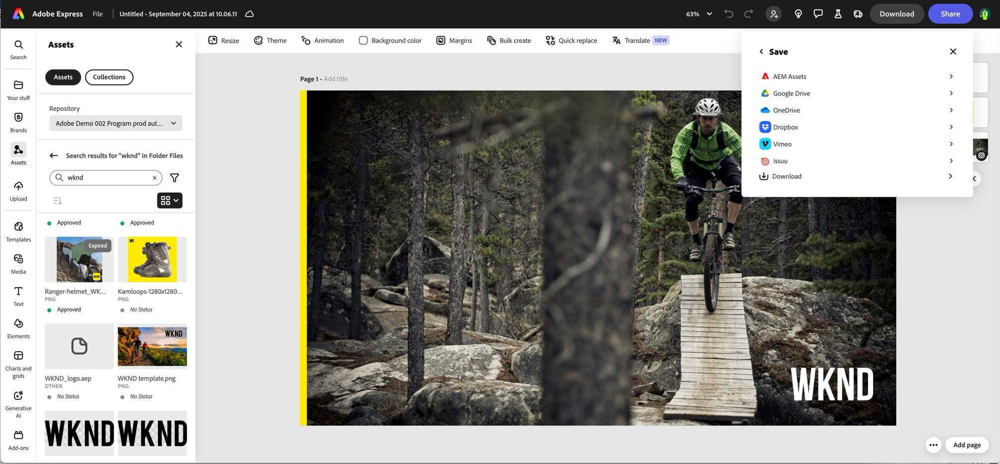

# Inbyggd integrering med Adobe Express {#native-integration-adobe-express}

AEM Assets är integrerat med Adobe Express, som gör att du kan komma åt material som lagras i AEM Assets direkt inifrån Adobe Express användargränssnitt. Du kan placera innehåll som hanteras i AEM Assets på arbetsytan Express och sedan spara nytt eller redigerat innehåll i en AEM Assets-databas. Integreringen ger följande viktiga fördelar:

* Ökad återanvändning av innehåll genom att redigera och spara nya resurser i AEM.

* Minskar den totala tiden och arbetet med att skapa nya resurser eller skapa nya versioner av befintliga resurser.

## Förutsättningar {#prerequisites}

Tillstånd att få tillgång till Adobe Express och minst en miljö i AEM Assets. Miljön kan vara någon av databaserna i Assets as a Cloud Service eller Assets Essentials.

## Använda AEM Assets i Adobe Express Editor {#use-aem-assets-in-express}

Så här börjar du använda AEM Assets i Adobe Express Editor:

1. Öppna Adobe Express webbprogram.

2. Öppna en ny tom arbetsyta genom att läsa in en ny mall eller ett projekt, eller genom att skapa en resurs.

3. Klicka på **[!UICONTROL Assets]** i den vänstra navigeringsrutan. Adobe Express visar en lista över databaser som du har behörighet att komma åt tillsammans med en lista över resurser och mappar som är tillgängliga på rotnivå.

4. Bläddra bland eller sök resurser i databasen för att dra och släppa dem på arbetsytan. Du kan filtrera resurser med hjälp av olika tillgängliga filter, till exempel filtyp, MIME-typ och dimensioner.

   >[!NOTE]
   >
   >Filtrera efter dimension gäller inte videoklipp.

   

## Spara Adobe Express-projekt i AEM Assets {#save-express-projects-in-assets}

När du har infogat lämpliga ändringar på arbetsytan Express kan du spara dem i AEM Assets-databasen.

1. Klicka på **[!UICONTROL Share]** för att öppna dialogrutan **[!UICONTROL Share]**.

   

2. Välj **[!UICONTROL Recommended]** AEM Assets **i avsnittet** i den högra rutan. Adobe Express visar dialogrutan för överföring.

   

3. Välj antingen **Aktuell sida** eller **Alla sidor**. Ange ett namn och format för de resurser som ska exporteras. Du kan exportera arbetsytans innehåll i PNG-, JPEG-, PDF-, MP4-, MP4+PNG- eller MP4+JPEG-format. Formatet justeras automatiskt baserat på resursen/resurserna på arbetsytans sida/sidor.
Om du väljer **Aktuell sida** sparas resursen på den aktuella sidan i målmappen. Om du väljer **Alla sidor** och exportformatet inte är PDF, sparas alla sidor på arbetsytan som separata filer i en ny mapp i målmappen. Om exportformatet är PDF sparas alla arbetsytesidor som en enda PDF-fil i målmappen.

4. Klicka på mappikonen under **Målmapp** för att välja en plats och spara resurserna.

   

5. Valfritt: Du kan lägga till kampanjmetadata för överföringen med fältet **Projekt eller kampanjnamn**. Du kan använda ett befintligt namn eller skapa ett nytt. Du kan definiera flera projekt- eller kampanjnamn för överföringen. Registrera namnet genom att skriva namnet och trycka på Retur.
Adobe rekommenderar att du anger värden i resten av fälten och skapar en förbättrad sökupplevelse för dina överförda resurser.

6. Definiera värden för fälten **[!UICONTROL Keywords]** och **[!UICONTROL Channels]**.

7. Klicka på **[!UICONTROL Upload]** för att överföra resurserna till AEM Assets.

<table> 
    <tbody>
     <tr>
      <th><strong>Format som stöds</strong></th>
      <th><strong>Storlek</strong></th>
     </tr>
    </tr>
    <tr>
        <td>[!UICONTROL JPEG]</td>
        <td> 8 000 × 8 000 pixlar, maximalt 40 MB</td>
    </tr>
    <tr>
        <td>[!UICONTROL PNG]</td>
        <td> 8 000 × 8 000 pixlar, maximalt 40 MB</td>
    </tr>
    <tr>
        <td>[!UICONTROL SVG]</td>
        <td> Högst 250 kB</td>
    </tr>
    <tr>
    </tr>
    </tr>
    <tr>
        <td>[!UICONTROL MP4]</td>
        <td> 3 840 × 3 840 pixlar, maximalt 200 MB</td>
    </tr>
    </tbody>
</table>

## Begränsningar {#limitations}

1. För import och export är den videofiltyp som stöds MP4.

2. För **MP4-videoimport** stöds inte videofilmer med genomskinliga bakgrunder (alfakanal).
   <!--
   1. The maximum file size supported is 200 MB. If this limit exceeds, an alert message displays.
   2. The maximum supported resolution is 3840 X 3840 pixels.
   3. Videos with transparent backgrounds (alpha channel) are not supported.
   -->

3. För **MP4-videoexport** är den största filstorlek som stöds 200 MB. Om gränsen överskrids föreslår en varning att videon trimmas till 200 MB eller mindre, eller att den överförs manuellt till AEM Assets målmapp när den har laddats ned.

