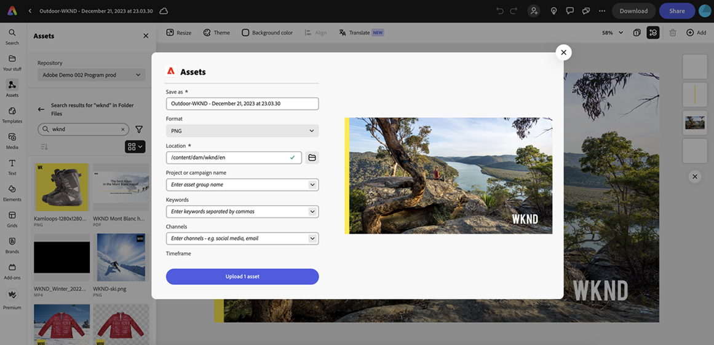

# Inbyggd integrering med Adobe Express {#native-integration-adobe-express}

AEM Assets kan integreras direkt med Adobe Express, vilket gör att du kan komma åt material som lagras i AEM Assets direkt inifrån användargränssnittet i Adobe Expressen. Du kan placera innehåll som hanteras i AEM Assets på arbetsytan Express och sedan spara nytt eller redigerat innehåll i en AEM Assets-databas. Integreringen ger följande viktiga fördelar:

* Större återanvändning av innehåll genom att redigera och spara nya resurser i AEM.

* Minskar den totala tiden och arbetet med att skapa nya resurser eller skapa nya versioner av befintliga resurser.

## Förutsättningar {#prerequisites}

Tillstånd att få tillgång till Adobe Express och minst en miljö i AEM Assets. Miljön kan vara någon av databaserna i Assets as a Cloud Service eller Assets Essentials.

## Använda AEM Assets i Adobe Express Editor {#use-aem-assets-in-express}

Så här börjar du använda AEM Assets i redigeraren:

1. Öppna Adobe Expressens webbprogram.

1. Öppna en ny tom arbetsyta genom att läsa in en ny mall eller ett projekt, eller genom att skapa en resurs.

1. Klicka **[!UICONTROL Assets]** finns i den vänstra navigeringsrutan. Adobe Express visar en lista över databaser som du har behörighet att komma åt tillsammans med en lista över resurser och mappar som är tillgängliga på rotnivå.

1. Bläddra bland eller sök resurser i databasen för att dra och släppa dem på arbetsytan. Du kan filtrera resurser med hjälp av olika tillgängliga filter, till exempel filtyp, MIME-typ och dimensioner.

   

## Spara Adobe Expresser i AEM Assets {#save-express-projects-in-assets}

När du har infogat lämpliga ändringar på arbetsytan Express kan du spara den i AEM Assets-databasen.

1. Klicka **[!UICONTROL Share]** för att öppna **[!UICONTROL Share]** -dialogrutan.

   

1. Välj **[!UICONTROL AEM Assets]** från **[!UICONTROL Storage]** som finns i den högra rutan. Adobe Expressen visar dialogrutan för överföring.
1. Ange ett namn och format för resursen. Du kan spara innehållet på arbetsytan i PNG- eller JPEG-format.

1. Klicka på mappikonen intill **[!UICONTROL Location]** navigera till den plats där du behöver spara resursen och klicka på **[!UICONTROL Select]**. Namnet på mappen visas i **[!UICONTROL Location]** fält.

   

1. Valfritt: Du kan lägga till kampanjmetadata för överföringen med **[!UICONTROL Project or campaign name]** fält. Du kan använda ett befintligt namn eller skapa ett nytt. Du kan definiera flera projekt- eller kampanjnamn för överföringen. När du skriver ett namn kan du antingen klicka någon annanstans i dialogrutan eller trycka på `,` (Komma) för att registrera namnet.

   Som en god praxis rekommenderar Adobe att du anger värden i resten av fälten, liksom att du får en förbättrad sökupplevelse för dina överförda resurser.
1. Definiera på liknande sätt värden för **[!UICONTROL Keywords]** och **[!UICONTROL Channels]** fält.

1. Klicka **[!UICONTROL Upload]** för att överföra resursen till AEM Assets.

## Begränsningar {#limitations}

Det finns ett känt fel som vissa användare upplever när de sparar ett dokument med resurser från flera databaser.
