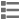
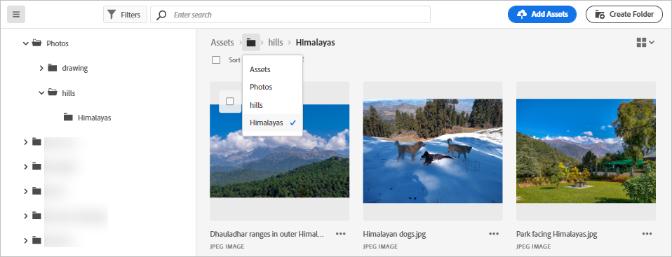
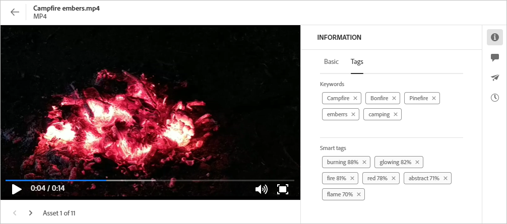

# Navigera till filer och mappar och visa resurser {#view-assets-and-details}

<!-- TBD: Give screenshots of all views with many assets. Zoom out to showcase how the thumbnails/tiles flow on the UI in different views. -->

<!-- TBD: The options in left sidebar may change. Shared with me and Shared by me are missing for now. Update this section as UI is updated. -->

## Förstå användargränssnittet för [!DNL Assets view] {#understand-interface-navigation}

[!DNL Assets view] har ett intuitivt och användarvänligt användargränssnitt. Det rena gränssnittet gör det enkelt att hitta och komma ihåg resurser och relaterad information.

När du loggar in på [!DNL Assets view] visas följande gränssnitt.

![[!DNL Assets view]-användargränssnitt](assets/assets-view-interface.png)

**A**: Vänster sidofält för att bläddra i databasen och ger åtkomst till några andra alternativ **B**: Visa eller dölj vänster sidofält för att öka resursens visningsområde **C**: Filtrera sökresultat **D**: Markera allt innehåll i den markerade mappen **E**: Alternativ för att sortera resurser **F**: sökruta **G**: Överför eller dra och släpp filer med knappen `Add Assets` **H**: Skapa en ny mapp **I**: Växla mellan olika vyer

<!-- TBD: Need an embedded video here with narration. It has to be hosted on MPC to be embeddable. -->

## Bläddra bland och visa resurser och mappar {#browse-repository}

Du kan bläddra bland mapparna från huvudanvändargränssnittet eller från vänster sidofält. I Experience Manager Assets visas förhandsvisningar av mappinnehåll i mappminiatyren när du bläddrar efter innehåll eller söker efter innehåll. Detta gör det lättare att hitta resurser som är tillgängliga i AEM Assets-databasen. Med den här mappminiatyrbilden sparar du tid på att söka efter specifika resurser i en mapp i AEM Assets-databasen.
När du bläddrar bland resurser i en mapp kan du använda gränssnittet för att visa miniatyrbilder av resurser för att visuellt bläddra i databasen eller visa resursinformation för att snabbt hitta den resurs du vill ha. De alternativ som är tillgängliga i den vänstra sidlisten är:

* [Min Workspace](/help/assets/my-workspace-assets-view.md): Assets innehåller nu en anpassningsbar arbetsyta med widgetar för smidig åtkomst till viktiga delar av Assets användargränssnitt och den information som är mest relevant för dig. Den här sidan är en helhetslösning som ger en översikt över dina arbetsobjekt och ger snabb åtkomst till viktiga arbetsflöden. Mer lättåtkomlig åtkomst till dessa alternativ ökar effektiviteten och ökar innehållets hastighet.
* [Uppgifter](/help/assets/my-workspace-assets-view.md): Du kan visa de uppgifter som du har tilldelats på fliken **Mina uppgifter**. De uppgifter du har skapat kan visas på fliken **Tilldelade uppgifter**. Dessutom finns de uppgifter du har slutfört på fliken **Slutförda uppgifter**.
* [Assets](/help/assets/manage-organize-assets-view.md): Lista över alla mappar i en trädvy som du har åtkomst till.
* **Senast visade**: Lista över resurser som du nyligen har förhandsvisat. [!DNL Assets view] visar bara de resurser som du förhandsgranskar. Det visar inte de resurser som du bläddrar förbi när du bläddrar bland databasfilerna eller databasmapparna.
* [Samlingar](/help/assets/manage-collections-assets-view.md): En samling är en uppsättning resurser, mappar eller andra samlingar i vyn Adobe Experience Manager Assets. Använd samlingar för att dela resurser mellan användare. Till skillnad från mappar kan en samling innehålla resurser från olika platser. Du kan dela flera samlingar med en användare. Varje samling innehåller referenser till resurser. Resursernas referensintegritet bevaras i alla samlingar.

* [Insikter](/help/assets/manage-reports-assets-view.md#view-live-statistics): I [!DNL Assets view] kan du visa realtidsinsikter på din instrumentpanel. I Assets-vyn kan du visa realtidsdata för din Assets-visningsmiljö med Insikter-kontrollpanelen. Du kan visa händelsemått i realtid under de senaste 30 dagarna eller under de senaste 12 månaderna.

* **Papperskorgen**: Visa en lista över de resurser som tagits bort från rotmappen **[!UICONTROL Assets]**. Du kan markera en resurs i papperskorgen om du vill återställa den till dess ursprungliga plats eller ta bort den permanent. Du kan ange ett nyckelord eller använda filter som resursstatus, filtyp, MIME-typ, bildstorlek, datum när resursen skapades, ändrades och förfallodatum samt filtrera efter resurser som kasserats av den aktuella användaren. Du kan också använda anpassade filter för att söka efter lämpliga resurser i papperskorgen. Mer information om hur du använder standardfilter och anpassade filter finns i [Söka efter resurser i Assets-vyn](/help/assets/search-assets-view.md).
* **Inställningar**: Du kan konfigurera olika alternativ för Assets-vyn med **Inställningar**, till exempel Metadataformulär, Rapporter och Taxonomihantering.

<!-- TBD: Not sure if we want to publish these right now. CC Libs are beta as per Greg.
* **Libraries**: Access to [!DNL Adobe Creative Cloud Team] (CCT) Libraries view. This view is visible only if the user is entitled to CCT Libraries.
-->

<!-- TBD: My Work Space shows task inbox and it is not visible on AEM Cloud Demos as of now. It is the source of truth server hence not documenting My Work Space option for now.
-->

Du kan öppna eller komprimera det vänstra sidofältet om du vill öka det tillgängliga området för visning av resurser.

I [!DNL Assets view] kan du visa resurser, mappar och sökresultat i fyra olika typer av layouter.

*  [!UICONTROL List View]
*  [!UICONTROL Grid View]
*  [!UICONTROL Gallery View]
*  [!UICONTROL Waterfall View]

Om du vill hitta en resurs kan du sortera resurserna i stigande eller fallande ordning `Name`, `Relevancy`, `Size`, `Modified` och `Created`.

Om du vill navigera i en mapp dubbelklickar du på mappens miniatyrbilder eller väljer mappen från vänster sidopanel. Om du vill visa information om en mapp markerar du den och klickar på Information i verktygsfältet högst upp. Om du vill navigera uppåt och nedåt i hierarkin använder du vänster sidospalt eller de synliga spåren högst upp.

*Figur: Använd vägbeskrivningarna högst upp eller till vänster om du vill bläddra i hierarkin.*

## Förhandsgranska resurser {#preview-assets}

Innan du använder, delar eller hämtar en resurs kan du visa den närmare. Med förhandsvisningsfunktionen kan du visa inte bara bilderna utan även några andra resurstyper som stöds.

Om du vill förhandsgranska en resurs markerar du den och klickar på [!UICONTROL Details]  i verktygsfältet högst upp. Du kan inte bara visa resursen utan även visa detaljerade metadata och vidta andra åtgärder.

**A**: Återgå till den aktuella mappen eller det aktuella sökresultatet i databasen **B**: Namn och format för filen som du förhandsgranskar **C**: Tilldela uppgifter **D**: Avancerade metadata **E**: Nyckelord och smarta taggar **F**: Kommentera och kommentera **G** : Visa uppgifter om den valda resursen **H**: [Visa och hantera versioner](/help/assets/manage-organize-assets-view.md#versions-of-assets) **I**: Visa återgivningar av bilden **J**: Redigera bild **K**: Visa dynamiska medierenderingar som Smart Crop och Dynamic Media med OpenMedia API-funktionsåtergivningar. **L**: Grundläggande metadata **M**: Avancerade metadata **N**: Nyckelord och smarta taggar **O**: Gå till föregående eller nästa resurs i den aktuella mappen utan att gå tillbaka till mappen **P**: Förhandsgranska närmare. Zooma, helskärmsläge och andra alternativ.

Du kan också förhandsgranska videoklipp.

Om du förhandsgranskar en resurs explicit visar [!DNL Assets view] den som en nyligen visad resurs.

<!-- TBD: Describe the options.

Explicitly previewed assets are displayed as recently viewed assets. Give screenshot of this.
Other use cases after previewing.
-->

## Nästa steg {#next-steps}

* Ge produktfeedback med alternativet [!UICONTROL Feedback] som finns i användargränssnittet i Assets-vyn

* Ge feedback om dokumentationen med [!UICONTROL Edit this page]  eller [!UICONTROL Log an issue]  som är tillgängligt på den högra sidopanelen

* Kontakta [kundtjänst](https://experienceleague.adobe.com/sv?support-solution=General#support)

>[!MORELIKETHIS]
>
>* [Visa versioner av en resurs](/help/assets/manage-organize-assets-view.md#view-versions).
