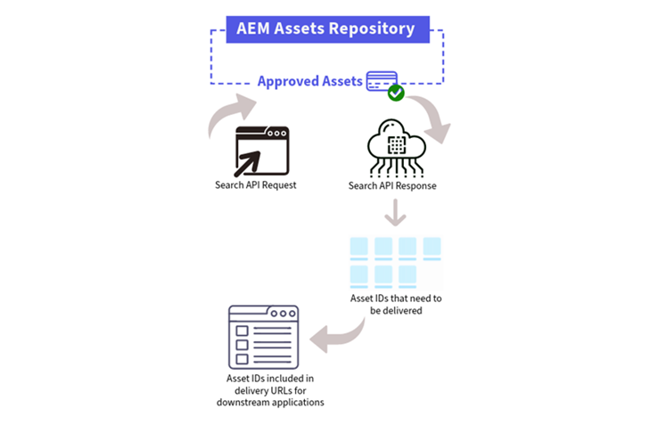

# Dynamic Media med OpenAPI-funktioner {#new-dynaminc-media-apis-overview}

I dagens snabba digitala värld är det avgörande att frigöra potentialen i ert varumärkes digitala resurser för att ligga steget före konkurrenterna. En helhetsbaserad DAM-lösning (Digital Assets Management) underlättar materialstyrningen, främjar varumärkets enhetlighet och snabbar upp innehållsleveransen samtidigt som varumärkesintegriteten och kundupplevelserna garanteras.

Dynamic Media med OpenAPI-funktioner sätter DAM i centrum för ett flexibelt och effektivt ekosystem av innehållsleverantörer för att säkerställa resursstyrning och leverans.

## Varför använda Dynamic Media med OpenAPI-funktioner? {#new-dynamic-media-api-features}

Dynamic Media med OpenAPI-funktioner har följande viktiga fördelar:

* **Smidiga integreringar**: Dynamic Media med OpenAPI-funktioner erbjuder en omfattande uppsättning API:er för sökning och leverans. Det gör att utvecklarna enkelt kan [integrera leverans av resurser med applikationerna](/help/assets/integrate-new-dynamic-media-apis.md). Programmen omfattar både Adobe och tredjepartsprogram. Dessutom innehåller det en [Användargränssnittet för resursväljaren i Micro Edge](/help/assets/asset-selector.md) för att söka efter och välja godkända resurser. Väljaren kan enkelt integreras med alla program som baseras på JavaScript-ramverk som React JS, Angular JS och Vanilla JS.

* **Centraliserad hantering av digitala resurser**: DAM är den enda källan till sanning för alla digitala resurser. Dina digitala resurser hanteras centralt i AEM Assets och levereras till de förbrukande programmen via referens via leverans-URL:er, utan att du behöver kopiera resurbinärfiler.

* **Uppdateringar i realtid**: Alla ändringar som görs i godkända resurser i DAM, inklusive versionsuppdateringar och metadataändringar, återspeglas automatiskt i leverans-URL:erna. Med ett kort TTL-värde (Time-to-Live) på 10 minuter konfigurerat för Dynamic Media med OpenAPI-funktioner via CDN blir uppdateringarna synliga i alla redigerings- och publiceringsgränssnitt på mindre än 10 minuter.

* **Enhetliga varumärken**: Endast [varumärkesgodkänt material](/help/assets/approved-assets.md) exponeras för nedströmstillämpningar. [Varumärkesansvariga och marknadsförare har strikt kontroll över varumärkestillgångar](/help/assets/restrict-assets-delivery.md). Det är bara en godkänd och den senaste versionen av resursen som är tillgänglig för användning, vilket garanterar ett enhetligt varumärke i alla kanaler och tillämpningar.

* **Webboptimerad leverans**: Digitalt material levereras i webboptimerade format för att förbättra de digitala upplevelsernas Core Web Vitals. Detta inkluderar stöd för WebP-återgivningar för bilder, adaptiv direktuppspelning via HLS- eller DASH-protokoll för videor och ursprungliga återgivningar för dokument.

* **Dynamisk omvandling av resurser**: I vårt system går det att omvandla bilder på en gång med hjälp av URL-parametrar som kallas bildmodifierare. [Till exempel bredd, höjd, rotering, vänd, kvalitet, beskärning och format](/help/assets/deliver-assets-apis.md). Dynamic Media med OpenAPI-funktioner har även stöd för bildsmarta beskärningsfunktioner. Omformade renderingar genereras dynamiskt och levereras smidigt via CDN.

* **Säker leverans av tillgångar**: Dynamic Media med OpenAPI-funktioner har en mekanism för att styra åtkomsten till dina digitala resurser. Du kan ange användarroller eller användargrupper som metadata för att skydda resurser och ange en fördefinierad tidsram under vilken [endast behöriga användare har åtkomst till dessa resurser](/help/assets/restrict-assets-delivery.md). Leverans-URL:erna för skyddade tillgångar kan inte matchas för obehöriga användare under den begränsade perioden.

* **Datainsikter för att fatta välgrundade beslut**: Utöver hantering och leverans av mediefiler samlar den in leveransdatainsikter om tillgångsleveranser hos CDN, vilket gör det möjligt för varumärkesansvariga att spåra leveransstatistik över olika kanaler. Det gör det möjligt för dem att fatta datadrivna beslut för kontinuerlig optimering av resursstyrnings- och leveransstrategier.

## Förutsättningar för att få tillgång till Dynamic Media med OpenAPI-funktioner {#prerequisites-new-dynaminc-media-apis}

För att få tillgång till Dynamic Media med OpenAPI-funktioner måste du ha licenser för:

* AEM Assets as a Cloud Service

* AEM Dynamic Media

## Hur aktiverar man Dynamic Media med OpenAPI-funktioner? {#enable-new-dynamic-media-apis}

Innan du skickar in en begäran om att aktivera Dynamic Media med OpenAPI-funktioner på AEM as a Cloud Service ska du kontrollera att det inte redan är aktiverat. Så här kontrollerar du om det är aktiverat:

1. Ska bekräftas från konstruktion och produkthantering

Om du vill aktivera Dynamic Media med OpenAPI-funktioner på AEM as a Cloud Service skickar du en supportanmälan för Adobe med följande information:

* Program- och miljö-ID för Cloud Service

* Information om hur man använder Dynamic Media med OpenAPI-funktioner

* Information om de program i senare led som ska integreras med Dynamic Media med OpenAPI-funktioner.

  >[!NOTE]
  >
  > Om du vill integrera med andra program än Adobe anger du domännamn i vitlistan där programmet finns.

* Information om viktiga kundkontakter i integrationsprojektet.

När du har skickat in supportanmälan aktiverar Adobe Dynamic Media med OpenAPI-funktioner i din Cloud Service-miljö och delar information, som IMS-klient-ID, så att du kan fortsätta med integreringen.

## Fördjupa dig i nyckelfunktionerna {#learn-more-key-capabilities}

<table>
<td>
   
   

      <a href="/help/assets/approved-assets.md">
      <strong>Godkänn resurser i Experience Manager Assets</strong>
      </a>
   

   

      <em>Godkänn resurser i AEM Assets för att effektivisera resurshanteringen och säkerställa en kontrollerad och effektiv process för hantering av resurser.</em>
   

</td>
<td>
   
   

      <a href="/help/assets/integrate-new-dynamic-media-apis.md">
      <strong>Integrera AEM Assets med program längre fram i kedjan</strong>
      </a>
   

   

      <em>Integrera ditt eget anpassade användargränssnitt med Experience Manager Assets-databasen med hjälp av API:erna för sökning och leverans eller använd Adobe Micro-Frontend Asset Selector.</em>
   

</td>
<td>
   
   

      <a href="/help/assets/asset-selector.md">
      <strong>Adobe Micro-Front Asset Selector</strong>
      </a>
   

   

      <em>Ett användargränssnitt som interagerar med AEM Assets-databasen för att söka efter resurser och sedan använda dem i programutvecklingen.</em>
   

</td>
</table>
<table>
<td>
   
   

      <a href="/help/assets/search-assets-api.md">
      <strong>Söka efter resurser i Experience Manager Assets-databasen</strong>
      </a>
   

   

      <em>Sök efter resurser i AEM Assets-databasen så att de kan levereras till program längre fram i kedjan.</em>
   

</td>
<td>
   
   

      <a href="/help/assets/deliver-assets-apis.md">
      <strong>Leverera resurser till program längre fram i kedjan</strong>
      </a>
   

   

      <em>Leverera material till integrerade program längre fram i kedjan med en leverans-URL.</em>
   

</td>
<td>
   
   

      <a href="/help/assets/restrict-assets-delivery.md">
      <strong>Begränsa åtkomst till resurser i Experience Manager</strong>
      </a>
   

   

      <em> DAM-administratör eller varumärkesansvariga begränsar åtkomsten genom att konfigurera roller för godkända resurser på den AEM as a Cloud Service författarinstansen.</em>
   

</td>
</table>

