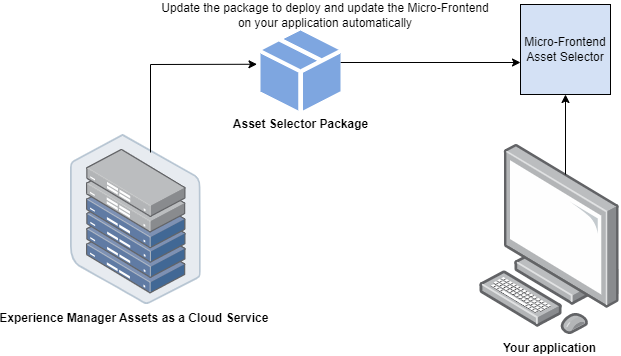
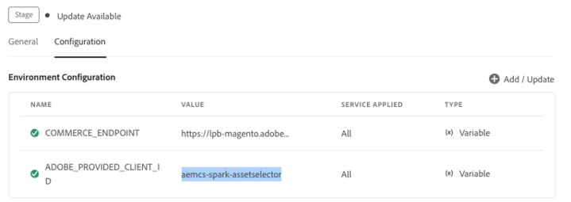
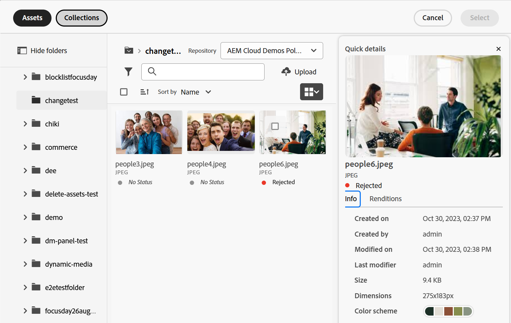

# Mikrofrontsväljare för mediefiler {#Overview}

Micro-Frontend Asset Selector har ett användargränssnitt som enkelt kan integreras med [!DNL Experience Manager Assets]-databasen så att du kan bläddra bland eller söka efter digitala resurser som är tillgängliga i databasen och använda dem i programutvecklingen.

Användargränssnittet Micro-FrontEnd är tillgängligt i ditt program med hjälp av paketet Resursväljare. Alla uppdateringar av paketet importeras automatiskt och den senaste distribuerade resursväljaren läses in automatiskt i programmet.



Resursväljaren har många fördelar, till exempel:

* Enkel integrering med något av [Adobe](/help/assets/integrate-asset-selector-adobe-app.md)- eller [icke-Adobe](/help/assets/integrate-asset-selector-non-adobe-app.md)-programmen som använder Vanilla JavaScript-biblioteket.
* Enkelt att underhålla när uppdateringar av Assets Selector-paketet automatiskt distribueras till resursväljaren som är tillgänglig för ditt program. Det finns inga uppdateringar som behövs i programmet för att läsa in de senaste ändringarna.
* Enkel anpassning eftersom det finns tillgängliga egenskaper som styr visningen av resursväljaren i programmet.
* Fulltextsökning, färdiga och anpassade filter för att snabbt navigera till material som ska användas i redigeringsmiljön.
* Möjlighet att växla databaser inom en IMS-organisation för val av resurser.
* Möjlighet att sortera resurser efter namn, dimensioner och storlek och visa dem i List-, Grid-, Gallery- eller Waterfall-vyn.

<!--Perform the following tasks to integrate and use Asset Selector with your [!DNL Experience Manager Assets] repository:

1. [Install Asset Selector](#installation)
2. [Integrate Asset Selector using Vanilla JS](#integration-using-vanilla-js)
3. [Use Asset Selector](#using-asset-selector)
-->

<!--
## Setting up Asset Selector {#asset-selector-setup}


-->

## Förutsättningar{#prereqs}

Du måste se till att följande kommunikationsmetoder används:

* Värdprogrammet körs på HTTPS.
* Du kan inte köra programmet på `localhost`. Om du vill integrera resursväljaren på den lokala datorn måste du skapa en anpassad domän, till exempel `[https://<your_campany>.localhost.com:<port_number>]`, och lägga till den anpassade domänen i `redirectUrl list`.
* Du kan konfigurera och lägga till clientID i AEM Cloud-tjänstmiljövariabeln med respektive `imsClientId`.
<!--* You can configure and add `ADOBE_PROVIDED_CLIENT_ID` into the AEM Cloud Service environment variable with the respective `imsClientId`.
-->
* Listan med IMS-scope måste definieras i miljökonfigurationen.
* Programmets URL finns i IMS-klientens tillåtelselista i omdirigerings-URL:er.
* Inloggningsflödet för IMS konfigureras och återges med hjälp av en popup-meny i webbläsaren. Därför bör popup-fönster vara aktiverade eller tillåtna i målwebbläsaren.

Använd ovanstående krav om du behöver arbetsflödet för IMS-autentisering för resursväljaren. Om du redan är autentiserad med IMS-arbetsflödet kan du lägga till IMS-informationen i stället.

**Se mer**

* [Integrera resursväljaren med en Adobe-app](/help/assets/integrate-asset-selector-adobe-app.md)
* [Integrera resursväljare med andra program än Adobe](/help/assets/integrate-asset-selector-non-adobe-app.md)
* [Integrera API:er för att öppna mediefiler med medieväljare](/help/assets/integrate-asset-selector-dynamic-media-open-api.md)


>[!IMPORTANT]
>
> Denna databas är avsedd att fungera som kompletterande dokumentation som beskriver tillgängliga API:er och användningsexempel för integrering av resursväljare. Innan du försöker installera eller använda resursväljaren måste du se till att din organisation har fått tillgång till resursväljaren som en del av Experience Manager Assets as a Cloud Service-profilen. Om du inte har etablerats kan du inte integrera eller använda dessa komponenter. För att begära etablering bör programadministratören skaffa en supportanmälan som är markerad som P2 från Admin Console och innehålla följande information:
>
>* Domännamn där det integrerande programmet finns.
>* Efter etableringen kommer din organisation att få `imsClientId`, `imsScope` och en `redirectUrl` som motsvarar de miljöer som efterfrågas och som är nödvändiga för konfigurationen av resursväljaren. Utan dessa giltiga egenskaper kan du inte köra installationsstegen.

## Installation {#installation}

Resursväljaren är tillgänglig via både ESM CDN (till exempel version [esm.sh](https://esm.sh/)/[skypack](https://www.skypack.dev/)) och version [UMD](https://github.com/umdjs/umd).

I webbläsare som använder **UMD-version** (rekommenderas):

```
<script src="https://experience.adobe.com/solutions/CQ-assets-selectors/static-assets/resources/assets-selectors.js"></script>

<script>
  const { renderAssetSelector } = PureJSSelectors;
</script>
```

I webbläsare med `import maps`-stöd och **ESM CDN-version**:

```
<script type="module">
  import { AssetSelector } from 'https://experience.adobe.com/solutions/CQ-assets-selectors/static-assets/resources/@assets/selectors/index.js'
</script>
```

I Deno/Webpack Module Federation med **ESM CDN version**:

```
import { AssetSelector } from 'https://experience.adobe.com/solutions/CQ-assets-selectors/static-assets/resources/@assets/selectors/index.js'
```

## Använda resursväljare {#using-asset-selector}

När resursväljaren har konfigurerats och du är autentiserad att använda resursväljaren med din [!DNL Adobe Experience Manager] som ett [!DNL Cloud Service]-program, kan du välja resurser eller utföra olika åtgärder för att söka efter dina resurser i databasen.


* **A**: [Visa/Göm panel](#hide-show-panel)
* **B**: [Databasväljare](#repository-switcher)
* **C**: [Assets](#repository)
* **D**: [Filter](#filters)
* **E**: [Sökfältet](#search-bar)
* **F**: [Sortering](#sorting)
* **G**: [Sortera i stigande eller fallande ordning](#sorting)
* **H**: [Visa](#types-of-view)

### Visa/dölj panelen {#hide-show-panel}

Om du vill dölja mappar i den vänstra navigeringen klickar du på ikonen **[!UICONTROL Hide folders]**. Om du vill ångra ändringarna klickar du på ikonen **[!UICONTROL Hide folders]** igen.

### Databasväxlare {#repository-switcher}

Med Resursväljaren kan du också växla databaser för val av resurser. Du kan välja vilken databas du vill använda i listrutan som finns i den vänstra panelen. De databasalternativ som är tillgängliga i listrutan baseras på egenskapen `repositoryId` som är definierad i filen `index.html`. Den baseras på miljön från den valda IMS-organisationen som den inloggade användaren har åtkomst till. Konsumenterna kan skicka en föredragen `repositoryID` och i så fall slutar resursväljaren att återge repomkopplaren och återge resurser endast från den angivna databasen.

### Assets-databas

Det är en samling resursmappar som du kan använda för att utföra åtgärder.

### Färdiga filter {#filters}

Resursväljaren innehåller även färdiga filteralternativ som kan förfina sökresultaten. Följande filter är tillgängliga:

* **[!UICONTROL Status]:** innehåller det aktuella tillståndet för resursen bland `all`, `approved`, `rejected` eller `no status`.
* **[!UICONTROL File type]:** innehåller `folder`, `file`, `images`, `documents` eller `video`.
* **[!UICONTROL Expiration status]:** omnämns resurserna baserat på dess förfallotid. Du kan antingen markera kryssrutan `[!UICONTROL Expired]` om du vill filtrera resurser som har gått ut eller ställa in `[!UICONTROL Expiration Duration]` för en resurs så att resurser visas baserat på deras förfallotid. När en resurs redan har gått ut eller snart går ut visas ett märke som avbildar detta. Dessutom kan du styra om du vill tillåta användning (eller dra och släpp) av en utgången resurs. Se mer om [anpassa utgångna resurser](/help/assets/asset-selector-customization.md#customize-expired-assets). Som standard visas märket **Förfaller snart** för resurser som förfaller inom 30 dagar. Du kan dock konfigurera förfallotiden med egenskapen `expirationDate`.

  >[!TIP]
  >
  > Om du vill visa eller filtrera resurser baserat på deras framtida förfallodatum anger du det framtida datumintervallet i fältet `[!UICONTROL Expiration Duration]`. Resurserna visas med märket **upphör snart** för dem.

* **[!UICONTROL MIME type]:** innehåller `JPG`, `GIF`, `PPTX`, `PNG`, `MP4`, `DOCX`, `TIFF`, `PDF`, `XLSX`.
* **[!UICONTROL Image Size]:** innehåller minsta/högsta bredd, lägsta/högsta höjd för bilden.

  

### Anpassad sökning

Förutom textsökningen kan du med Resursväljaren söka efter resurser i filer med hjälp av anpassad sökning. Du kan använda anpassade sökfilter både i den modulala vyn och i vyn Rail.


Du kan också skapa ett standardsökfilter för att spara de fält som du ofta söker efter och använda dem senare. Om du vill skapa en anpassad sökning efter dina resurser kan du använda egenskapen `filterSchema`.

### Sökfältet {#search-bar}

Med Resursväljaren kan du utföra en fullständig textsökning av resurser i den valda databasen. Om du till exempel skriver nyckelordet `wave` i sökfältet visas alla resurser med nyckelordet `wave` som nämns i någon av metadataegenskaperna.

### Sortering {#sorting}

Du kan sortera resurser i Resursväljaren efter namn, dimensioner eller storlek för en resurs. Du kan också sortera resurserna i stigande eller fallande ordning.

### Typer av vy {#types-of-view}

Med Resursväljaren kan du visa resursen i fyra olika vyer:

*  [!UICONTROL **Listvy**] I listvyn visas rullningsbara filer och mappar i en enda kolumn.
*  [!UICONTROL **Stödrastervy**] Stödrastervyn visar rullningsbara filer och mappar i ett stödraster med rader och kolumner.
*  [!UICONTROL **Gallerivy**] Gallerivyn visar filer eller mappar i en centrerad vågrät lista.
*  [!UICONTROL **Vattenfall** Visa] I vattenfallsvyn visas filer eller mappar i form av en Bridge.

### Resursinformation och metadata {#asset-details-and-metadata}

På sidan Resursinformation får du en heltäckande bild av en viss tillgång som samlar all viktig information på ett och samma ställe. Den innehåller en översikt med namn, filformat, status och en kort beskrivning samt en förhandsgranskning eller miniatyrbild för att underlätta visuell identifiering. Den innehåller också metadata för en resurs, t.ex. datum då den skapades, författare, storlek, färgschema osv. Dessa attribut hjälper till att effektivt söka efter, filtrera och klassificera en resurs. Panelen Resursinformation är tillgänglig i både vyn Rälar och modal för resursväljaren. I spårvyn måste egenskapen `onDrop` aktiveras och konfigureras för att returnera en resurs. I den modala vyn returnerar egenskapen `handleSelection` en resurs. Se [Egenskaper för resursväljare](asset-selector-properties.md).

Om du vill visa information om en resurs och metadata utför du stegen nedan:

1. Öppna resursväljaren MFE och navigera till en resurs.
1. Håll markören över resursen och klicka på .
1. Gå till fliken **[!UICONTROL Info]** om du vill visa information om resursen. <!--Otherwise, go to the **[Renditions](#asset-renditions)** tab to see renditions of an asset.-->

Mer information om hur du anpassar informationsvyn för en resurs finns i [Anpassa information i modal vy](asset-selector-customization.md#customize-info-in-modal-view).



<!--

#### Asset renditions {#asset-renditions}

Renditions in Adobe Experience Manager (AEM) are customized versions of digital assets, such as images, designed for different devices and platforms to ensure optimal performance. See [Dynamic Media renditions](/help/assets/renditions.md#dynamic-media-renditions).

>[!NOTE]
>
>* Prerequisites to [Dynamic Media with OpenAPI Capabilities renditions](/help/assets/renditions.md##prereqs-dm-with-openapi-renditions).
>* Renditions tab in the details panel of an asset shows up if `featureSet`  props is set to `['detail-panel', 'dm-renditions']`.
>* An asset should be approved to see Dynamic Media with OpenAPI renditions and/or ensure processing/publishing of the asset to Dynamic Media is complete (for images only).


For assets that are approved and have renditions enabled, you see the **Dynamic Media with Open API** badge. 


Additionally, see [Asset Selector user interface for Dynamic Media with OpenAPI capabilities](integrate-asset-selector-dynamic-media-open-api.md##interface-dynamic-media-open-api).

##### Add modifiers {#modifiers-dm-media-renditions}

Beyond the common image settings available in the UI, Dynamic Media supports numerous advanced image modifications that you can specify in the Image Modifiers field. See [Defining image preset options with Image Modifiers](https://experienceleague.adobe.com/sv/docs/experience-manager-65/content/assets/dynamic/managing-image-presets#defining-image-preset-options-with-image-modifiers).

-->

## Läs mer om de viktigaste funktionerna {#key-capabilities-asset-selector}

<table>
<tr>
    <td>
        <br/>
        <a href="integrate-asset-selector.md"> Integrera resursväljare </a>
        <p>
        <em>Lär dig olika funktioner för att integrera resursväljare med flera program.
        </p>
     </td>
    <td>
        <br/>
        <a href="integrate-asset-selector-adobe-app.md"> Integrera resursväljare med Adobe-program </a>
        <p>
        <em>Upptäck hur du integrerar resursväljare med olika Adobe-program.</em>
        </p>
    </td>
    <td>
        <br/>
        <a href="integrate-asset-selector-non-adobe-app.md"> Integrera resursväljare med program från tredje part </a>
        <p>
        <em>Öka möjligheterna att integrera resursväljare med andra program än Adobe.</em>
        </p>
    </td>
    <td>
        <br/>
        <a href="integrate-asset-selector-dynamic-media-open-api.md"> Integrera resursväljare med API:er för Dynamic Media Open </a>
        <p>
        <em>Förstå hur du integrerar resursväljare med API:er för dynamiska mediaöppningar.</em>
        </p>
     </td>
     <td>
        <br/>
        <a href="asset-selector-properties.md"> Egenskaper för resursväljare </a>
        <p>
        <em>Förstå användningen av egenskaper på ett praktiskt sätt. </em>
        </p>
    </td>
</tr>
<tr>
    <td>
        <br/>
        <a href="asset-selector-examples.md"> Exempel på resursväljare </a>
        <p>
        <em>Lär dig grunderna i att anpassa olika komponenter i resursväljaren, som filter, urval av resurser, utgångna resurser och mycket annat. </em>
        </p>
    </td>
    <td>
        <br/>
        <a href="asset-selector-customization.md"> Anpassningar av resursväljare </a>
        <p>
        <em>Konfigurera och anpassa olika komponenter i resursväljaren utifrån din användbarhet. </em>
        </p>
    </td>
    <td>
        <br/>
        <a href="asset-selector-upload.md"> Överföring av resursväljare </a>
        <p>
        <em>Lär dig hur du kan överföra filer eller mappar till resursväljaren från det lokala filsystemet eller tredjepartssystemet. </em>
        </p>
    </td>
     <td>
        <br/>
        <a href="asset-selector-collections.md"> Resursväljarsamlingar </a>
        <p>
        <em>Lär dig hur du använder samlingar i resursväljaren med hjälp av Experience Manager-databasen. </em>
        </p>
    </td>
    <td>
    </td>
</tr>
</table>

>[!MORELIKETHIS]
>
>* [Anpassningar av resursväljare](/help/assets/asset-selector-customization.md)
>* [Integrera resursväljare med olika program](/help/assets/integrate-asset-selector.md)
>* [Egenskaper för resursväljare](/help/assets/asset-selector-properties.md)
>* [Integrera resursväljare med dynamiska media med OpenAPI-funktioner](/help/assets/integrate-asset-selector-dynamic-media-open-api.md)
>* [Produktvisuella effekter som drivs av AEM Assets Integration för Commerce](https://experienceleague.adobe.com/sv/docs/commerce/product-visuals/overview)
