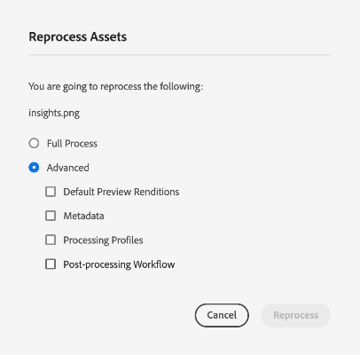

# Bearbetar digitala resurser {#reprocessing-digital-assets}

Du kan bearbeta resurser i en mapp som redan har en befintlig metadataprofil som du senare ändrade. Om du vill att den nyligen redigerade förinställningen ska tillämpas på de befintliga resurserna i mappen måste du bearbeta om mappen. Du kan bearbeta så många resurser som behövs.

Bearbeta resurser i en mapp på nytt om du upplever något av följande två scenarier:

* Du vill köra en gruppuppsättningsförinställning på en befintlig resursmapp som redan har resurser överförda till den.
* Du redigerar senare en befintlig gruppuppsättningsförinställning som tidigare använts på en mapp med resurser.

## Bearbeta resurser {#reprocessing-steps}

Så här bearbetar du resurser i en mapp:

1. I [!DNL Experience Manager]på sidan Resurser väljer du de resurser som du nyligen lagt till eller de resurser som du vill bearbeta om.
Om du väljer en mapp:

   * Arbetsflödet hanterar alla filer i den valda mappen rekursivt.
   * Om det finns en eller flera undermappar med resurser i den markerade huvudmappen, bearbetas alla resurser i mapphierarkin om i arbetsflödet.
   * Det är en god vana att undvika att köra det här arbetsflödet på en mapphierarki som har fler än 1 000 resurser.

1. Välj **[!UICONTROL Reprocess Assets]**. Välj mellan de två alternativen:

   

   * **[!UICONTROL Full Process]:** Välj det här alternativet om du vill köra den övergripande processen inklusive standardprofil, anpassad profil, dynamisk bearbetning (om den är konfigurerad) och arbetsflöden för efterbearbetning.
   * **[!UICONTROL Advanced]:** Välj det här alternativet om du vill välja avancerad ombearbetning.

     

     Välj bland följande avancerade alternativ:

      * **[!UICONTROL Default Preview Renditions]:** Välj det här alternativet om du vill bearbeta återgivningarna som förhandsvisas som standard.

      * **[!UICONTROL Metadata]:** Välj det här alternativet när du vill extrahera metadatainformation och smarta taggar för de valda resurserna.

      * **[!UICONTROL Processing Profiles]:** Välj det här alternativet när du vill bearbeta om en markerad profil. Du kan **[!UICONTROL Full Process]** om du vill ta med standardbearbetningen och den anpassade profilen som tilldelats på mappnivå.
        <!--When assets are uploaded to a folder, [!DNL Experience Manager] checks the containing folder's properties for a processing profile. If none is applied, a parent folder in the hierarchy is checked for a processing profile to apply.-->

      * **[!UICONTROL Post-processing Workflow]:** Välj det här alternativet där ytterligare bearbetning av resurser krävs som inte kan utföras med bearbetningsprofilerna. Ytterligare arbetsflöden för efterbearbetning kan läggas till i konfigurationen. Med efterbearbetning kan du lägga till helt anpassad bearbetning utöver den konfigurerbara bearbetningen med hjälp av objektmikrotjänster.

Se [använda mikrotjänster och bearbetningsprofiler](https://experienceleague.adobe.com/docs/experience-manager-cloud-service/content/assets/manage/asset-microservices-configure-and-use.html?lang=en) om du vill veta mer om hur du hanterar profiler och arbetsflöden för efterbearbetning.

När du har valt lämpliga alternativ klickar du på **[!UICONTROL Reprocess]**. Meddelandet om att åtgärden lyckades visas.

## Scenarier för ombearbetning av digitala resurser {#scenarios-reprocessing}

[!DNL Experience Manager] tillåter ombearbetning av digitala resurser för följande komponenter.

### Smarta taggar {#reprocessing-smart-tags}

Organisationer som hanterar digitalt material använder i allt högre grad taxonomistyrd vokabulär i metadata. Det innehåller i själva verket en lista med nyckelord som anställda, partners och kunder vanligtvis använder för att referera till och söka efter digitala resurser i en viss klass. Genom att tagga resurser med taxonomistyrd vokabulär ser du till att resurserna är lätta att identifiera och hämta.

Jämfört med naturtrogna språkordlistor kan taggning av digitala resurser baserat på företagsklonomi hjälpa dem att anpassa sig till företagets verksamhet och säkerställa att de mest relevanta resurserna visas i sökningar.

Läs mer om [Smarta taggar för videomaterial](https://experienceleague.adobe.com/docs/experience-manager-cloud-service/content/assets/manage/smart-tags-video-assets.html?lang=en).

Läs mer om [Bearbeta om färgtaggar för befintliga bilder i DAM](https://experienceleague.adobe.com/docs/experience-manager-cloud-service/content/assets/manage/color-tag-images.html?lang=en#color-tags-existing-images).

### Smart beskärning {#reprocessing-smart-crop}

Läs mer om [Dynamic Media smart beskärning](https://experienceleague.adobe.com/docs/experience-manager-cloud-service/content/assets/dynamicmedia/image-profiles.html?lang=en) som gör att du kan tillämpa en viss beskärning (**[!UICONTROL Smart Cropping]** och pixelbeskärning) och skärpekonfiguration för de överförda resurserna.

### Metadata {#reprocessing-metadata}

[!DNL Adobe Experience Manager Assets] sparar metadata för varje resurs. Det gör det enklare att kategorisera och ordna resurser och det hjälper personer som letar efter en viss resurs. Tack vare möjligheten att extrahera metadata från filer som överförts till Experience Manager Assets kan metadatahanteringen integreras med det kreativa arbetsflödet. Med möjligheten att behålla och hantera metadata med dina resurser kan du automatiskt ordna och bearbeta resurser baserat på deras metadata.

Läs mer om [Bearbetar metadataprofiler](https://experienceleague.adobe.com/docs/experience-manager-cloud-service/content/assets/manage/metadata-profiles.html?lang=en).

### Bearbeta Dynamic Media-resurser igen i en mapp {#reprocessing-dynamic-media}

Du kan bearbeta om resurser i en mapp som redan har en Dynamic Media Image Profile eller en Dynamic Media Video Profile som du senare har ändrat. Mer information finns på [bearbeta om Dynamic Media-resurser i en mapp.](https://experienceleague.adobe.com/docs/experience-manager-cloud-service/content/assets/admin/about-image-video-profiles.html?lang=en)

>[!NOTE]
>
>Du måste konfigurera [!DNL Dynamic Media] i miljön för att aktivera dialogrutan Dynamic Media.
>

### Arbetsflöden

Läs mer om [processprofiler och arbetsflöden för efterbearbetning](https://experienceleague.adobe.com/docs/experience-manager-cloud-service/content/assets/manage/asset-microservices-configure-and-use.html?lang=en).

