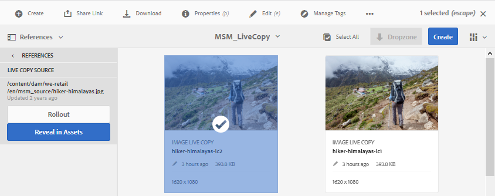

# Återanvänd resurser med MSM för Assets{#reuse-assets-using-msm-for-assets}

Med MSM-funktionaliteten (Multi Site Manager) i Adobe Experience Manager (AEM) kan användare återanvända innehåll som har skapats en gång och återanvänds på flera webbplatser. Samma sak gäller för digitala resurser som MSM för Assets-funktionalitet. Med MSM for Assets kan du

* Skapa resurser en gång och gör sedan kopior av dessa resurser för återanvändning i andra delar av webbplatsen.
* Håll flera kopior synkroniserade och uppdatera originaloriginalkopian en gång för att överföra ändringarna till de underordnade kopiorna.
* Gör lokala ändringar genom att tillfälligt eller permanent avbryta länkningen mellan överordnade och underordnade resurser.

## Förstå fördelarna och begreppen {#concepts}

### Så fungerar det och fördelarna {#how-it-works-and-the-benefits}

AEM upprätthåller en länk mellan den ursprungliga resursen och dess länkade kopior, så kallade live-kopior. Tack vare den bevarade länken kan centraliserade ändringar skickas till många aktiva kopior. Detta ger snabbare uppdateringar och eliminerar samtidigt begränsningarna med att hantera duplicerade kopior. Spridningen av ändringar är felfri och centraliserad. Funktionen ger utrymme för uppdateringar som är begränsade till valda kopior. Användare kan koppla loss länken, d.v.s. bryta arv, och göra lokala redigeringar som inte skrivs över nästa gång huvudkopian uppdateras och ändringarna introduceras. Frånkopplingen kan göras för ett fåtal metadatafält eller för en hel resurs. Det ger flexibilitet att lokalt uppdatera resurser som ursprungligen ärvts från en huvudkopia.

MSM upprätthåller en aktiv relation mellan källresursen och dess livekopior så att:

* Ändringar av källresurserna tillämpas (utlöses) även på live-kopior, det vill säga de live-kopior som synkroniseras med källan.
* Du kan uppdatera live-kopiorna genom att avbryta direktrelationen eller ta bort arvet för några få begränsade fält. Ändringarna i källan tillämpas inte längre på den aktiva kopian.

### Ordlista för villkoren för MSM for Assets {#glossary}

**Källa** De ursprungliga resurserna eller mapparna. Huvudkopia som live-kopior härleds från.

**Live-kopia** Kopian av källresurserna/källmapparna som är synkroniserad med källan. Live-kopior kan vara en källa till fler live-kopior. Se hur du skapar LC:er.

**Arv** En länk/referens mellan en live-kopia-resurs/mapp och dess källa som systemet använder för att komma ihåg var uppdateringarna ska skickas. Arv finns på detaljnivå för metadatafält. Arv kan tas bort för selektiva metadatafält samtidigt som den aktiva relationen mellan källan och dess aktiva kopia bevaras.

**Rollout** En åtgärd som knuffar ändringar som gjorts i källan nedåt till dess aktiva kopior. Det går att uppdatera en eller flera live-kopior på en gång med en utrullningsåtgärd. Se utrullning.

**Regler för utrullningskonfiguration** som avgör vilka egenskaper som synkroniseras, hur och när. Dessa konfigurationer används när live-kopior skapas. kan redigeras senare; och ett underordnat objekt kan ärva utrullningskonfigurationen från sin överordnade resurs. Använd bara standardkonfigurationen för utrullning för MSM for Assets. De andra rollout-konfigurationerna är inte tillgängliga för MSM för Assets.

**Synkronisera** en annan åtgärd, förutom utrullning, som skapar paritet mellan källan och dess live-kopia genom att skicka uppdateringarna från källan till live-kopiorna. En synkronisering initieras för en viss live-kopia och åtgärden hämtar ändringarna från källan. Om du använder den här åtgärden kan du bara uppdatera en av live-kopiorna. Se synkroniseringsåtgärd.

**Gör uppehåll** Ta tillfälligt bort den aktiva relationen mellan en livekopia och dess källresurs/mapp. Du kan återuppta relationen. Se göra uppehåll i åtgärd.

**Återuppta** Återuppta liverelationen så att en live-kopia får uppdateringarna från källan igen. Se åtgärd för att återuppta.

**Åtgärden Återställ** återställ gör live-kopian en gång till till en replik av källan genom att skriva över lokala ändringar. Den tar också bort arvsannulleringar och återställer arv i alla metadatafält. Om du vill göra lokala ändringar i framtiden måste du ångra arvet av specifika fält. Se lokala ändringar i LC.

**Koppla loss** Oåterkalleligt från en livekopia av en resurs/mapp. Efter att ha frigjort en åtgärd kan live-kopiorna aldrig få uppdateringar från källan och de slutar vara en live-kopia längre. Se Ta bort relation.

## Skapa en live-kopia av en resurs {#createlc}

Om du vill skapa en live-kopia av en eller flera källresurser eller mappar gör du något av följande:

* Metod 1: Markera källresurserna och klicka på **[!UICONTROL Skapa > Live-kopia]** från verktygsfältet överst.

* Metod 2: I AEM-användargränssnittet klickar du på **[!UICONTROL Skapa > Live-kopia]** i det övre högra hörnet av gränssnittet.

Du kan skapa live-kopior av en resurs eller en mapp åt gången. Du kan skapa live-kopior som är härledda från en resurs eller en mapp som är en live-kopia.  Content Fragments (CF) stöds inte för användningsfallet. När de försöker skapa sina live-kopior kopieras CF-filer som de är utan någon relation. De kopierade CF:erna är en ögonblicksbild i tid och uppdateras inte när ursprungliga CF:er uppdateras.

Så här skapar du live-kopior med den första metoden:

1. Välj källmaterial eller mappar. Klicka på **[!UICONTROL Skapa > Live-kopia]** i verktygsfältet.

   

   Skapa en live-kopia från AEM-gränssnittet

1. Välj en målmapp. Click **[!UICONTROL Next]**.
1. Ange titel och namn. Resurserna har inga underordnade. När du skapar en live-kopia av mappar kan du välja att ta med eller exkludera underordnade.
1. Välj en utrullningskonfiguration. Klicka på **[!UICONTROL Skapa]**.

Så här skapar du live-kopior med den andra metoden:

1. I AEM-gränssnittet klickar du på **[!UICONTROL Skapa > Live-kopia]** i det övre högra hörnet.

   

   Skapa en live-kopia från AEM-gränssnittet

1. Välj källresurs eller källmapp. Click **[!UICONTROL Next]**.
1. Välj målmapp. Click **[!UICONTROL Next]**.
1. Ange titel och namn. Resurserna har inga underordnade. När du skapar en live-kopia av mappar kan du välja att ta med eller exkludera underordnade.
1. Välj en utrullningskonfiguration. Klicka på **[!UICONTROL Skapa]**.

>[!NOTE]
>
>När en källa eller en live-kopia flyttas behålls relationerna. När en live-kopia tas bort tas relationerna bort.

## Visa olika egenskaper och statusvärden för käll- och livekopia {#properties}

Du kan visa information och MSM-relaterade statusar för live-kopior som relation, synkronisering, rollouts med mera från de olika områdena i AEM-användargränssnittet.

Följande två metoder fungerar för resurser och mappar:

* Välj en live-kopia och hitta informationen på sidan Egenskaper.
* Välj källmapp och sök efter detaljerad information om varje live-kopia på Live Copy-konsolen.

**Tips**: Om du vill kontrollera status för några separata live-kopior använder du den första metoden som finns på sidan Egenskaper. Om du vill kontrollera status för många live-kopior använder du den andra metoden, d.v.s. sidan **[!UICONTROL Relationsstatus]** .

### Information om och status för en live-kopia {#statuslcasset}

Följ de här stegen för att kontrollera information och status för en live-kopia-resurs eller en mapp.

1. Välj en live-kopia eller en mapp. Klicka på **[!UICONTROL Egenskaper]** i verktygsfältet. Du kan också använda kortkommandot `p`.
1. Klicka på **[!UICONTROL Live Copy]**. Du kan kontrollera sökvägen till källan, avbrottsstatus, synkroniseringsstatus, det senaste utrullningsdatumet och den användare som gjorde den senaste utrullningen.

   

   Live copy-information och status

1. Du kan aktivera eller inaktivera om underordnade resurser lånar konfigurationen för live-kopia.

1. Du kan välja att live-kopian ska ärva utrullningskonfigurationen från den överordnade kopian eller ändra konfigurationen.

### Information om och status för alla live-kopior av en mapp {#statuslcfolder}

AEM tillhandahåller en konsol för att kontrollera status för alla live-kopior av en källmapp. Den här konsolen visar status för alla underordnade resurser.

1. Välj en källmapp. Klicka på **[!UICONTROL Egenskaper]** i verktygsfältet. Du kan också använda kortkommandot `p`.
1. Klicka på **[!UICONTROL Live Copy Source]**. Klicka på **[!UICONTROL Live Copy Overview]** för att öppna konsolen. Den här instrumentpanelen ger status på den översta nivån för alla underordnade resurser.

   

   Visa status för live-kopior i Live Copy-konsolen

1. Om du vill visa detaljerad information om varje resurs i den aktiva kopiemappen markerar du en resurs och klickar på **[!UICONTROL Relationsstatus]** i verktygsfältet.

   

   Detaljerad information om och status för en underordnad live-kopia i en mapp

**Tips**: Du kan snabbt se status för live-kopior av andra mappar utan att behöva bläddra för mycket. Det är bara att ändra mappen i popup-listan i den övre mellersta delen av **[!UICONTROL Live Copy Overview]** .

### Snabbåtgärder från referensfältet för källan {#refrailsource}

För en källresurs eller källmapp kan du se följande information och utföra följande åtgärder direkt från referensfältet:

* Se sökvägarna för live-kopior.
* Öppna eller visa en specifik live-kopia i AEM-användargränssnittet.
* Synkronisera uppdateringarna till en specifik live-kopia.
* Pausa relationen eller ändra utrullningskonfiguration för en specifik live-kopia.
* Få åtkomst till översiktskonsolen för live-kopian.

Markera källresursen eller källmappen, öppna den vänstra listen och klicka på **[!UICONTROL Referenser]**. Du kan också markera en resurs eller mapp och använda kortkommandot `Alt + 4`.  

Åtgärder och information som är tillgänglig i referensfältet för den valda källan

Om det är en specifik live-kopia klickar du på **[!UICONTROL Redigera Live-kopia]** för att göra uppehåll i relationen eller ändra utrullningskonfigurationen.

Pausa relationen eller ändra utrullningskonfiguration för en specifik live-kopia

### Snabbåtgärder från referensfältet för live-kopia {#refraillc}

För en resurs eller mapp för en live-kopia kan du se följande information och utföra följande åtgärder direkt från referenslisten:

* Se källans sökväg.
* Öppna eller visa en specifik live-kopia i AEM-användargränssnittet.
* Fyll i uppdateringarna.

Välj en resurs eller mapp för en live-kopia, öppna den vänstra listen och klicka på **[!UICONTROL Referenser]**. Du kan också markera en resurs eller mapp och använda kortkommandot `Alt + 4`.  

Åtgärder som är tillgängliga i referensfältet för den valda live-kopian

## Sprid ändringar från källa till live-kopior {#rolloutsync}

När en källa har ändrats kan ändringarna spridas till live-kopiorna med antingen en synkroniseringsåtgärd eller en utrullningsåtgärd. Mer information om skillnaden mellan de båda åtgärderna finns i [ordlistan](#glossary).

### Åtgärd för utrullning {#rollout}

Du kan initiera en utrullningsåtgärd från källresursen och uppdatera alla eller några utvalda live-kopior.

1. Välj en live-kopia eller en mapp. Klicka på **[!UICONTROL Egenskaper]** i verktygsfältet. Du kan också använda kortkommandot `p`.
1. Klicka på **[!UICONTROL Live Copy Source]**. Klicka på **[!UICONTROL utrullning]** i verktygsfältet längst upp.

1. Markera de live-kopior som du vill uppdatera. Klicka på **[!UICONTROL Överrullning]**.

   Om du vill ta med uppdateringarna som gjorts för de underordnade resurserna väljer du **[!UICONTROL Utrullningskälla och Alla underordnade]**.

   

   Fyll ut ändringarna av källan till några eller alla live-kopior

>[!NOTE]
>
>Ändringar som görs i en källresurs rullas endast ut till direkt relaterade live-kopior. Om en live-kopia kommer från en annan live-kopia, rullas inte ändringarna ut till den härledda live-kopian.

Du kan också starta en utrullningsåtgärd från referenslinjen när du har valt en specifik live-kopia. Mer information finns i [Snabbåtgärder från referensfältet för live-kopia](#refraillc). I den här metoden för utrullning uppdateras endast den markerade live-kopian och eventuellt dess underordnade.

Rulla ut ändringarna av källan till den markerade live-kopian

### Om synkroniseringsåtgärd {#aboutsync}

Med en synkroniseringsåtgärd hämtas ändringarna från en källa endast till den markerade Live-kopian. Synkroniseringsåtgärden respekterar och underhåller lokala ändringar som gjorts efter att arv har annullerats. De lokala ändringarna skrivs inte över och arvet som avbryts återupprättas inte. Du kan initiera en synkroniseringsåtgärd på tre sätt.

<table>
 <tbody>
  <tr>
   <th><strong>Var i AEM-gränssnittet finns</strong>  </th>
   <th><strong>När och varför ska du använda</strong>  </th>
   <th><strong>Så här använder du</strong>  </th>
  </tr>
  <tr>
   <td>Referensspår</td>
   <td>Synkronisera snabbt när du redan har markerat källan.  </td>
   <td>Se <a href="#refrailsource">Snabbåtgärder från referensfältet för källa</a></td>
  </tr>
  <tr>
   <td>Verktygsfält på sidan Egenskaper  </td>
   <td>Starta en synkronisering när du redan har live-kopieringsegenskaperna öppna.  </td>
   <td>Se <a href="#synclc">Synkronisera en live-kopia</a></td>
  </tr>
  <tr>
   <td>Översiktskonsol för Live Copy</td>
   <td>Synkronisera snabbt flera resurser (inte nödvändigtvis alla) när källmappen är markerad eller när Live Copy Overview Console redan är öppen. Synkroniseringsåtgärden initieras för en resurs i taget men är ett snabbare sätt att synkronisera flera resurser på en gång.  </td>
   <td>Se <a href="#bulkactions">Åtgärder för många resurser i en mapp för live-kopior</a></td>
  </tr>
 </tbody>
</table>

### Synkronisera en live-kopia {#synclc}

Om du vill starta en synkroniseringsåtgärd öppnar du sidan **[!UICONTROL Egenskaper]** för en live-kopia, klickar på **[!UICONTROL Live-kopia]** och sedan på önskad åtgärd i verktygsfältet.

Om du vill se status och information om en synkroniseringsåtgärd läser du [Information om och status för en live-kopia](#statuslcasset) samt [Information och status för alla live-kopior av en mapp](#statuslcfolder).

Synkroniseringsåtgärden hämtar de ändringar som gjorts i källan

>[!NOTE]
>
>Om relationen är inaktiverad är synkroniseringsåtgärden inte tillgänglig i verktygsfältet. Synkroniseringsåtgärden är tillgänglig i referensfältet, men ändringarna sprids inte ens när en lyckad utrullning har slutförts.

## Pausa och återuppta relation {#suspendresume}

Du kan tillfälligt inaktivera relationen för att förhindra att en live-kopia tar emot ändringar som gjorts i källresursen eller källmappen. Relationen kan även återupptas för live-kopiering för att börja ta emot ändringarna från källan.

Om du vill göra uppehåll eller återuppta ett uppehåll öppnar du sidan **[!UICONTROL Egenskaper]** för en live-kopia, klickar på **[!UICONTROL Live-kopia]** och sedan på önskad åtgärd i verktygsfältet.

Du kan också snabbt pausa eller återuppta relationer för flera resurser i en direktkopieringsmapp från **[!UICONTROL Live Copy Overview]** Console. Se [Utför åtgärder på många resurser i mappar](#bulkactions)med live-kopior.

## Göra lokala ändringar i en live-kopia {#localmods}

En live-kopia är en kopia av den ursprungliga källan när den skapas. Metadatavärdena för en live-kopia ärvs från källan. Metadatafälten behåller enskilt arv med respektive fält i källresursen.

Du kan dock göra lokala ändringar i en live-kopia för att ändra några valda egenskaper. Om du vill göra lokala ändringar avbryter du arvet av den önskade egenskapen. När arvet av ett eller flera metadatafält avbryts behålls objektets aktiva relation och arvet av de andra metadatafälten. Synkronisering eller utrullning skriver inte över lokala ändringar. Om du vill göra det öppnar du sidan **[!UICONTROL Egenskaper]** för en live-kopia av en resurs och klickar på ikonen **[!UICONTROL avbryt arv]** bredvid ett metadatafält.

Du kan ångra alla lokala ändringar och återställa resursen till källans läge. Återställ åtgärd oåterkalleligt och omedelbart åsidosätter alla lokala ändringar och återupprättar arv på alla metadatafält. Om du vill återställa från sidan **[!UICONTROL Egenskaper]** för en live-kopia klickar du på **[!UICONTROL Återställ]** i verktygsfältet.

Återställ-åtgärden skriver över lokala redigeringar och delar av den aktiva kopian med källan.

## Ta bort direktrelation {#detach}

Du kan ta bort relationen mellan en källa och en live-kopia helt med åtgärden Koppla loss. Den aktiva kopian blir en fristående resurs eller mapp när den har kopplats loss. Den visas som en ny resurs i AEM-gränssnittet omedelbart efter att den kopplats loss. Följ de här stegen för att koppla loss en live-kopia från källan.

1. Välj en resurs eller mapp för en live-kopia. Klicka på **[!UICONTROL Egenskaper]** i verktygsfältet. Du kan också använda kortkommandot `p`.

1. Klicka på **[!UICONTROL Live Copy]**. Klicka på **[!UICONTROL Koppla loss]** i verktygsfältet. Klicka på **[!UICONTROL Koppla loss]** i den dialogruta som visas.

   

   Koppla loss-åtgärden tar helt bort relationen mellan källa och live-kopia

   >[!CAUTION]
   >
   >Relationen tas bort omedelbart när du klickar på **[!UICONTROL Koppla loss]** från dialogrutan. Du kan inte ångra den genom att klicka på **[!UICONTROL Avbryt]** på sidan Egenskaper.

Du kan också snabbt frigöra flera resurser i en live-kopiemapp från **[!UICONTROL Live Copy Overview]** Console. Se [Utför åtgärder på många resurser i mappar](#bulkactions)med live-kopior.

## Vidta åtgärder för många resurser i en mapp för live-kopior {#bulkactions}

Om du har flera resurser i en live-kopieringsmapp kan initieringsåtgärder för varje resurs vara långsamma. Du kan snabbt initiera grundläggande åtgärder för många resurser från Live Copy Console. Ovanstående metoder fortsätter att fungera för enskilda resurser.

1. Välj en källmapp. Klicka på **[!UICONTROL Egenskaper]** i verktygsfältet. Du kan också använda kortkommandot `p`.
1. Klicka på **[!UICONTROL Live Copy Source]**. Klicka på **[!UICONTROL Live Copy Overview]** för att öppna konsolen.

1. På den här instrumentpanelen väljer du en live-kopia av en live-kopiemapp. Klicka på önskade åtgärder i verktygsfältet. De tillgängliga åtgärderna är **[!UICONTROL Synkronisera]**, **[!UICONTROL Återställ]**, **[!UICONTROL Gör uppehåll]** och **[!UICONTROL Frigör]**.

   Du kan snabbt initiera dessa åtgärder för alla resurser i valfritt antal kopiamappar som finns i en direktrelation med den valda källmappen.

   

   Uppdatera enkelt många resurser i kopiemappar från Live Copy Overview-konsolen

<!--
## Extend MSM for Assets {#extendapi}

AEM allows you to extend the functionality using the MSM Java APIs. For Assets, the extending works just the same as it works with MSM for Site. For details, see [Extending the MSM](/help/sites-developing/extending-msm.md) and the following for information about specific tasks:

* [Overview of APIs](/help/sites-developing/extending-msm.md#overview-of-the-java-api)

* [Create a new synchronization action](/help/sites-developing/extending-msm.md#creating-a-new-synchronization-action)
* [Create a new rollout configuration](/help/sites-developing/extending-msm.md#creating-a-new-rollout-configuration)

* [Create and use a simple LiveActionFactory class](/help/sites-developing/extending-msm.md#creating-and-using-a-simple-liveactionfactory-class)

>[!NOTE]
>
>* Blueprint in MSM for Site is called Live Copy source in MSM for Assets.
>* Removing the chapters step in the create site wizard is not supported in MSM for Assets.
>* Configuring MSM locks on page properties (Touch-enabled UI) is not supported in MSM for Assets.

-->

## Effekter av tillgångshanteringsåtgärder på live-kopior {#manageassets}

Live-kopior och källor är resurser eller mappar som i viss utsträckning kan hanteras som digitala resurser. Vissa resurshanteringsåtgärder i AEM har en specifik effekt på livekopiorna.

* När du kopierar en live-kopia skapas en live-kopia med samma källa som den första live-kopian.
* När du flyttar en källa eller dess aktiva kopia behålls den aktiva relationen.
* Redigeringsåtgärden fungerar inte för live-kopieringsresurser. Om källan till en live-kopia är en live-kopia i sig, fungerar inte redigeringsåtgärden för den.
* Utcheckningsåtgärden är inte tillgänglig för livekopieringsresurser.
* För källmappen är alternativet att skapa granskningsåtgärder tillgängligt.
* När du visar resursexemplet i listvyn och kolumnvyn visas live-kopia av en resurs eller mapp. På så sätt kan du enkelt identifiera live-kopior i en mapp.

## Jämför MSM för resurser och platser {#comparison}

I fler scenarier matchar MSM for Assets beteendet hos MSM for Sites-funktionen. Några viktiga skillnader är:

* Blueprint in MSM for Site kallas Live Copy-källa i MSM for Assets.
* I Sites kan du jämföra en plan och dess live-kopia, men det är inte möjligt i Assets att jämföra en källa med dess live-kopia.
* Du kan inte redigera en live-kopia i Assets.
* Webbplatser har vanligtvis underordnade, men det har inte Assets. Alternativet att inkludera eller exkludera underordnade objekt finns inte när du skapar direktkopior av enskilda resurser.
* Det går inte att ta bort kapitelsteget i guiden Skapa plats i MSM for Assets.
* Det går inte att konfigurera MSM-lås för sidegenskaper (Touch-aktiverat gränssnitt) i MSM för Assets.
* För MSM for Assets använder du bara **[!UICONTROL standardkonfigurationen]**. De andra rollout-konfigurationerna är inte tillgängliga för MSM för Assets.

## God praxis {#bestpractices}

Några av de bästa sätten att använda MSM är:

* Planera relationer mellan överordnade och underordnade för resurser och innehåll innan implementeringen startas.
* 

## Begränsningar och kända problem med MSM för Assets {#limitations}

Här följer en begränsning för MSM för Assets.

* Content Fragments (CF) stöds inte för användningsfallet. När de försöker skapa sina live-kopior kopieras CF-filer som de är utan någon relation. De kopierade CF:erna är en ögonblicksbild i tid och uppdateras inte när ursprungliga CF:er uppdateras.

