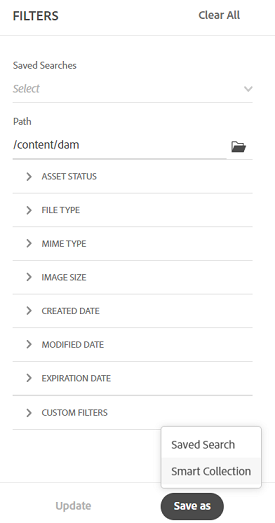

# Sök efter resurser i [!DNL Assets view] {#search-assets}

>[!CONTEXTUALHELP]
>id="assets_search"
>title="Sök i Assets"
>abstract="Sök efter resurser genom att ange ett nyckelord i sökfältet eller genom att filtrera resurser baserat på status, filtyp, MIME-typ, storlek, skapande, ändring och förfallodatum. Du kan också använda egna filter förutom standardfiltren. Du kan spara de filtrerade resultaten som en sparad sökning eller som en smart samling."
>additional-url="https://experienceleague.adobe.com/docs/experience-manager-assets-essentials/help/manage-collections.html?lang=en#manage-smart-collection" text="Skapa smarta samlingar"

[!DNL Assets view] innehåller en effektiv sökning som bara fungerar som standard. Sökningen är omfattande eftersom den är en fulltextsökning. Med de kraftfulla sökfunktionerna kan du snabbt hitta rätt resurs och hjälpa dig att förbättra innehållets hastighet. [!DNL Assets view] innehåller fulltextsökning och även sökningar via metadata som smarta taggar, titel, skapad den och copyright.

Så här söker du efter resurser:

* Klicka i sökrutan högst upp på sidan. Som standard söker programmet i den mapp som du just nu bläddrar i. Gör något av följande:

  

   * Sök med ett nyckelord och ändra mappen om du vill. Tryck på Retur.

   * Börja arbeta med en nyligen visad resurs genom att söka direkt efter den. Klicka i sökrutan och välj en nyligen visade resurs bland förslagen.

## Filtrera sökresultaten {#refine-search-results}

Du kan förfina sökresultaten för att hitta relevanta resurser genom att använda flera filter. Dessa filter, som konfigureras av en administratör, baseras på filer, mappar och samlingar. Se [Anpassa sökfilter](custom-search-filters.md).

Du kan filtrera sökresultaten baserat på följande parametrar.

* Resursstatus: Filtrera sökresultaten med en `Approved`-, `Rejected`- eller `No Status`-resursstatus.
* Filtyp: Filtrera sökresultaten efter de filtyper som stöds, `Images`, `Documents` och `Videos`.
* MIME-typ: Filtrera efter ett eller flera av de filformat som stöds. <!-- TBD:  [supported file formats](/help/using/supported-file-formats.md). -->
* Bildstorlek: Ange en av flera av de minsta och högsta måtten för att filtrera bilder. Storleken anges i pixeldimensioner och är inte bildens filstorlek.
* Skapad: Datum när resursen skapades enligt metadatan. Standarddatumformatet som används är `yyyy-mm-dd`.
* Ändrad: Senaste ändringsdatum för resurserna. Standarddatumformatet som används är `yyyy-mm-dd`.
* Förfallodatum: Filtrera sökresultaten baserat på en `Expired`-resursstatus. Du kan dessutom ange ett förfallodatumintervall för resurser för att ytterligare filtrera sökresultaten.
* Egna filter: [Lägg till anpassade filter](#custom-filters) i användargränssnittet i vyn Assets. Använd de anpassade filtren utöver standardfiltren för att förfina sökresultaten.

Du kan sortera de sökda resurserna i stigande eller fallande ordning `Name`, `Relevance`, `Size`, `Modified` och `Created`. De sökda resurserna sorteras som standard baserat på `Relevance`.

## Hantera anpassade filter {#custom-filters}

**Behörigheter krävs:** `Can Edit`, `Owner` eller administratör.

I Assets-vyn kan du även lägga till egna filter i användargränssnittet. Du kan sedan använda dessa anpassade filter utöver [standardfiltren](#refine-search-results) för att förfina sökresultaten.

I Assets-vyn finns följande anpassade filter:

<table>
    <tbody>
     <tr>
      <th><strong>Eget filternamn</strong></th>
      <th><strong>Beskrivning</strong></th>
     </tr>
     <tr>
      <td>Titel</td>
      <td>Filtrera resurser med resursens titel. Titeln som du anger i det skiftlägeskänsliga sökvillkoret måste matcha den exakta titeln för resursen som ska visas i resultatet.</td>
     </tr>
     <tr>
      <td>Namn</td>
      <td>Filtrera resurser med resursfilens namn. Namnet som du anger i det skiftlägeskänsliga sökvillkoret måste matcha det exakta filnamnet på resursen som ska visas i resultatet.</td>
     </tr>
     <tr>
      <td>Resursstorlek</td>
      <td>Filtrera resurser genom att definiera ett storleksintervall, i byte, i sökvillkoren för en resurs som ska visas i resultaten.</td>
     </tr>
     <tr>
      <td>Förutsedda taggar</td>
      <td>Filtrera resurser med den smarta resurstaggen. Det smarta taggnamn som du anger i de skiftlägeskänsliga sökvillkoren måste matcha det exakta smarta taggnamnet för resursen som ska visas i resultatet. Du kan inte ange flera smarta taggar i sökvillkoren.</td>
     </tr>    
    </tbody>
   </table>

<!--
   You can use a wildcard operator (*) to enable Assets view to display assets in the results that partially match the search criteria. For example, if you define <b>ma*</b> as the search criteria, Assets view displays assets with title, such as, market, marketing, man, manchester, and so on in the results.

   You can use a wildcard operator (*) to enable Assets view to display assets in the results that partially match the search criteria.

   You can use a wildcard operator (*) to enable Assets view to display assets in the results that partially match the search criteria. You can specify multiple smart tags separated by a comma in the search criteria.

   -->

### Lägga till egna filter {#add-custom-filters}

Så här lägger du till anpassade filter:

1. Klicka på **[!UICONTROL Filters]**.

1. Klicka på **[!UICONTROL Custom Filters]** eller **[!UICONTROL Edit]** i avsnittet **[!UICONTROL Add Filters]**.

   

1. I dialogrutan **[!UICONTROL Custom filters management]** väljer du de filter som du vill lägga till i den befintliga filterlistan. Välj **[!UICONTROL Custom Filters]** om du vill välja alla filter.

1. Klicka på **[!UICONTROL Confirm]** för att lägga till filtren i användargränssnittet.

### Ta bort egna filter {#remove-custom-filters}

Så här tar du bort anpassade filter:

1. Klicka på **[!UICONTROL Filters]**.

1. Klicka på **[!UICONTROL Custom Filters]** i avsnittet **[!UICONTROL Edit]**.

1. I dialogrutan **[!UICONTROL Custom filters management]** avmarkerar du de filter som du vill ta bort från den befintliga filterlistan.

1. Klicka på **[!UICONTROL Confirm]** om du vill ta bort filtren från användargränssnittet.

## Semantisk sökning {#semantic-search}

Semantisk sökning är en avancerad sökfunktion som förstår innebörden och avsikten bakom en användarfråga i stället för att förlita sig på exakta nyckelordsmatchningar. Det använder artificiell intelligens (AI), naturlig språkbearbetning (NLP) och maskininlärning för att leverera mer korrekta och kontextmedvetna resultat.

Till skillnad från traditionell nyckelordsbaserad sökning, som söker efter exakta termer, tolkas relationerna mellan ord, begrepp och användarmetod i Semantic Search. Detta gör att användarna hittar det de söker efter, även om deras fråga är formulerad på ett annat sätt, innehåller stavfel eller är på ett annat språk.

Några av fördelarna med den:

* **Flerspråksstöd**: Sök på flera språk utan att exakta översättningar krävs. Användarna kan hitta relevant innehåll oavsett frågespråk.

* **Hanterar felstavningar**: Korrigerar eller tolkar automatiskt stavfel och säkerställer korrekta resultat även om indata är felaktiga.

* **Förstå synonymer**: Ger resultat för relaterade termer och fraser, så användarna behöver inte gissa rätt nyckelord.

* **Kontextmedveten sökning**: Identifierar avsikten bakom en fråga, inte bara orden.

>[!IMPORTANT]
>
> Ange tre eller fler än tre ord för den semantiska sökningen för att visa lämpliga resultat.

### Exempel på semantisk sökning {#examples-semantic-search}

**Exempelfråga**: *Kvinna som dricker kaffe*

Den traditionella nyckelordsbaserade sökningen söker efter exakta matchningar av metadata för resurser, t.ex. kvinna, kaffe osv., och returnerar resurser som innehåller dessa nyckelord.

Semantisk sökning söker dock efter liknande ord som `Girl`, `Lady` för `Woman` och kaffealternativ, som `Cappuccino` och `Latte` för `Coffee`.

På samma sätt kan du ange den här uppmaningen på spanska eller felstava `Woman` som `Wman` och ändå få samma resultat.

## Sök efter resurser med [!DNL Adobe Firefly] {#search-firefly}

Du kan söka efter en resurs som inte är tillgänglig i någon av resursmapparna genom att använda sökfunktionen [!DNL Adobe Firefly] i [!DNL Experience Manager Assets]. På så sätt kan du effektivt generera resurser i realtid som inte lagras i resursmapparna.

### Innan du börjar {#search-assets-firefly-prereqs}

Du måste ha en aktiv [!DNL Adobe Express]-prenumeration.

### Generera resurser {#generate-assets-firefly}

Så här skapar du nya resurser med [!DNL Adobe Firefly]:

1. Navigera till arbetsytan [!DNL AEM Assets].

1. Skriv resursnamnet i sökfältet. Du kan till exempel söka efter en resurs med nyckelordet `Bugatti Type 57`. När du söker efter resursen hittas inga resultat eftersom resursen inte finns i någon av resursmapparna. Klicka på **[!UICONTROL Generate with Firefly]** om du vill generera resurser med hjälp av AI. Skärmen [!DNL Adobe Firefly] visas.

   

   De nya resurserna har genererats. Du kan dessutom ändra bildbeskrivningen genom att skriva den nya textrutan i beskrivningsrutan. [Lär dig hur du skriver en bra AI-uppmaning för att generera extraordinärt och relevant innehåll](https://helpx.adobe.com/in/firefly/using/tips-and-tricks.html). Du kan även [redigera bilden med olika andra funktioner, som att ändra format, bilddimensioner och mer](https://helpx.adobe.com/in/firefly/using/text-to-image.html).

   

1. Markera en bild som du vill spara. Klicka på **[!UICONTROL Save]** om du vill spara resurserna i den mapp du föredrar så att du enkelt kommer åt dem.

1. Formuläret Spara resurs visas. Ange följande fält:

   * Ange ett namn för filen i fältet **Spara som**.
   * Välj en målmapp.
   * Ange detaljer som projektnamn eller kampanjnamn, nyckelord, kanaler, tidsram och region.

   

1. Klicka på **Spara som ny resurs** för att spara resursen/resurserna.

### Överför resurser {#upload-assets-firefly}

Så här överför du den genererade resursen till resurskatalogen:

1. Klicka på **[!UICONTROL Upload]**.
1. Markera resursmappen som du vill överföra resursen till och klicka på **[!UICONTROL Select Folder]**.
   

## Sparade sökningar {#saved-search}

Sökfunktionen är ganska enkel att använda i [!DNL Assets view]. I sökrutan kan du inte bara skriva ett nyckelord och trycka på Retur för att se resultatet. Du kan också snabbt söka igen efter dina nyligen sökta nyckelord med ett enda klick.

Du kan också filtrera sökresultaten baserat på specifika villkor runt metadata och resurstyp. För filter som används ofta kan du spara sökparametrarna i [!DNL Assets view] för att förbättra sökupplevelsen. Du kan sedan markera den sparade sökningen och använda filtret med bara ett klick.

Om du vill skapa en sparad sökning söker du efter en resurs, använder ett eller flera filter och klickar på **[!UICONTROL Save as]** > **[!UICONTROL Saved Search]** på panelen [!UICONTROL Filters]. Du kan också klicka på **[!UICONTROL Save as]** och välja **[!UICONTROL Smart Collection]** för att spara resultatet som en smart samling. Mer information finns i [Skapa en smart samling](manage-collections.md#create-a-smart-collection).

<!-- TBD: Search behavior. Full-text search. Ranking and rank boosts. Hidden assets.
Report poor UX that users can only save a filtered search and not a simple search.
.
Are other supported files fully indexed and support full-text search? Eg. audio/videos files can at best have metadata indexed.
Anything about ranking of assets displayed in search results?

What about temporarily hiding an asset (suspending search on it) from the search results? If an asset is undergoing review collaboration, should it be used by others? Should it be hidden in search?

When userA is searching and userB add an asset that matches search results, will the asset display in search as soon as userA refreshes the page? Assuming indexing is near real-time. May not be so for bulk uploads.
-->

## Arbeta med sökresultat {#work-with-search-results}

Du kan markera de resurser som visas i sökresultaten och göra följande:

* **Hitta liknande bild**: Hitta en liknande bildresurs i Assets-gränssnittet baserat på metadata och smarta taggar.

* **Information**: Visa och redigera resursegenskaper.

* **Hämta**: Hämta en resurs.

* **Lägg till i samling**: Lägg till den valda resursen i en samling.

* **Fäst i snabbåtkomst**: [Fäst en resurs](my-workspace-assets-view.md) för snabbare åtkomst när du behöver den senare. Alla fästa objekt visas i avsnittet **Snabbåtkomst** i Min Workspace.

* **Öppna i Adobe Express**: Redigera en bild i den integrerade Adobe Express-bilden från Experience Manager Assets-skärmen.

* **Redigera**: Redigera bilden med Adobe Express.

* **Dela länk**: [Dela länkar](share-links-for-assets-view.md) för en resurs med andra användare så att de kan komma åt och hämta den.

* **Ta bort**: Ta bort en resurs.

* **Kopiera**: Kopiera en resurs till en annan mapplats.

* **Flytta**: Flytta en resurs till en annan mapplats.

* **Byt namn på**: Byt namn på en resurs.

* **Kopiera till bibliotek**: Lägg till en resurs i biblioteket.

* **Tilldela uppgifter**: Tilldela uppgifter till användare för en resurs.

* **Titta**: [Övervaka de åtgärder](https://experienceleague.adobe.com/en/docs/experience-manager-cloud-service/content/assets/manage/search-assets) som utförs på en resurs.

## Konfigurera den första startsidan för sökning {#configuring-search-first-homepage}

I Assets-vyn kan du välja standardlandningssida för din organisation. När du använder Sök först som startsida har du också möjlighet att anpassa sidans varumärke genom att konfigurera bakgrunds- och logotypbilderna så att de passar ert varumärke.

Så här konfigurerar du den första startsidan för sökningen:

1. Navigera till **[!UICONTROL Settings]** > **[!UICONTROL General Settings]**.
1. Välj **[!UICONTROL Search first]**. Sökningskonfigurationen öppnas sedan. Du kan ange [justering](#setting-alignment-search-bar) eller [ange bakgrunds- och logotypbilden](#setting-background-image-and-logo) för din hemsida.

### Ange justering för sökfältet {#setting-alignment-search-bar}

Med [!DNL Assets view] kan du ändra justeringen av sökfältet. Du kan ange att sökfältet ska visas antingen i mitten eller högst upp. Välj lämplig justering och klicka på **[!UICONTROL Save]**.

### Ställa in bakgrunds- och logotypbild för hemsidan {#setting-background-image-and-logo}

Du kan lägga till en logotyp och en bakgrundsbild på din första söksida. Utför följande steg:

1. Navigera till avsnittet **[!UICONTROL Background and Logo image]** under **[!UICONTROL Homepage]**.
1. Klicka på **[!UICONTROL Replace]** om du vill bläddra bland bilder från den befintliga resurskatalogen.
1. Klicka på **[!UICONTROL Save]**. [Förhandsgranska](#preview-configured-homepage) ändringarna för att granska ändringarna.

### Förgranska konfigurerad startsida {#preview-configured-homepage}

Du kan förhandsgranska om du vill kontrollera layout och formatering för den första söksidan. Med hjälp av **[!UICONTROL Preview]** kan du korrigera layouten eller göra ändringar efter behov. Om du vill förhandsgranska den konfigurerade startsidan följer du stegen nedan:

1. Klicka på **[!UICONTROL General Settings]** och välj **[!UICONTROL Search first]**.
1. Navigera till **[!UICONTROL Customize search first homepage]** och klicka på **[!UICONTROL Preview]**. Växla genom knappen **[!UICONTROL Dark theme]** om du vill förhandsgranska hemsidan i mörkt eller ljust tema.
1. Klicka på **[!UICONTROL Close]** för att stänga förhandsgranskningsskärmen.

   

## Sammanhangsbaserad sökning {#contextual-search}

Du kan också söka efter resurser som är tillgängliga i databasen genom att definiera textmeddelanden. Experience Manager Assets omvandlar automatiskt dessa textmeddelanden till sökfilter och visar sökresultaten. Du kan visa och ändra automatiska filter med hjälp av filterpanelen för att begränsa sökresultaten ytterligare.

### Åtkomst till sammanhangsbaserad sökning {#access-contextual-search}

Så här kommer du åt sammanhangsbaserad sökning i Experience Manager Assets:

1. Klicka på **[!UICONTROL Search]** i den vänstra rutan.

   

1. Definiera textprompten i söktextrutan och klicka på **[!UICONTROL Contextual Search]**.

   

   [!DNL Experience Manager Assets] visar sökresultaten.

### Filter som stöds {#supported-filters}

Sammanhangsbaserad sökning stöder följande färdiga filter. Basera dina textmeddelanden på dessa filter för att se rätt sökresultat.

* Bildhöjd

* Bildbredd

* Filtyp: bild, dokument, video eller mapp.

* MIME-typ: JPG, PNG, TIFF, GIF, MP4, PDF, PPTX, DOCX eller XLSX

* Skapad den

* Ändrat den

* Utgångsdatum

* Resursstatus: Godkänd, Avvisad eller alla

* Utgångna resurser

### Exempel på textmeddelanden {#text-prompts-examples}

**Exempel 1**

**Textfråga**: Bilder skapade den här månaden.

[!DNL Experience Manager Assets] använder följande filter automatiskt och visar sökresultaten:

**Exempel 2**

**Textprompt**: Bilder som är minst 200 pixlar höga och 100 pixlar breda med strand och klar himmel.

[!DNL Experience Manager Assets] använder följande filter automatiskt och visar sökresultaten:

**Exempel 3**

**Textfråga**: Jag behöver bilder med blå himmel som är 1 500 och 2 500 pixlar höga och som har skapats den senaste månaden och som inte har gått ut och godkänts.

[!DNL Experience Manager Assets] använder följande filter automatiskt och visar sökresultaten:

I följande video visas hela processen, från att komma åt det kontextuella sökanvändargränssnittet till att definiera textmeddelanden och visa sökresultaten.

>[!VIDEO](https://video.tv.adobe.com/v/3428407)

### Inaktivera sammanhangsbaserad sökning {#disable-contextual-search}

Administratörer kan även inaktivera sammanhangsbaserad sökning för användare i din organisation. Gör så här:

1. Navigera till **[!UICONTROL Settings]** > **[!UICONTROL General Settings]**.

1. I avsnittet [!UICONTROL Contextual Search] stänger du av växeln **[!UICONTROL Enable Contextual Search for your organization]** för att inaktivera funktionen för sammanhangsbaserad sökning för alla användare i organisationen.

### Sammanhangsbaserad sökfeedback {#contextual-search-feedback}

Om du behöver ge feedback på funktionen för sammanhangsbaserad sökning klickar du på ikonen  och sedan på ikonen för feedback. Välj typ av feedback, ange ämne och beskrivning och klicka på **[!UICONTROL Submit]**.

## Nästa steg {#next-steps}

* [Titta på en video om du vill söka efter resurser i Assets-vyn](https://experienceleague.adobe.com/docs/experience-manager-learn/assets-essentials/basics/using.html)

* Ge produktfeedback med alternativet [!UICONTROL Feedback] som finns i användargränssnittet i Assets-vyn

* Ge feedback genom att [!UICONTROL Edit this page]  eller [!UICONTROL Log an issue]  som är tillgängligt på den högra sidopanelen.

* Kontakta [kundtjänst](https://experienceleague.adobe.com/?support-solution=General#support)

