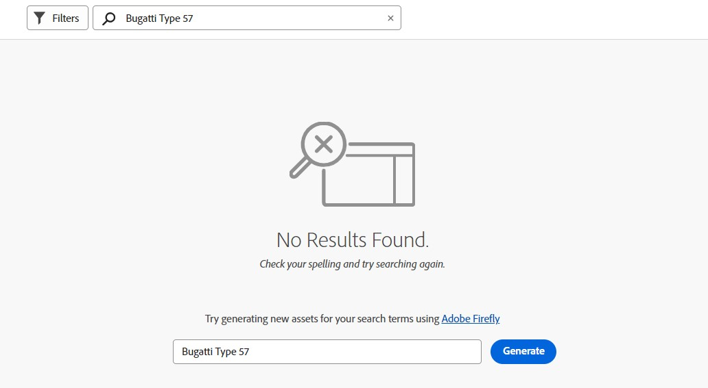
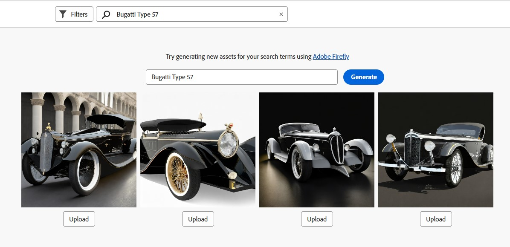

# Sök efter resurser i [!DNL Assets view] {#search-assets}

>[!CONTEXTUALHELP]
>id="assets_search"
>title="Sök resurser"
>abstract="Sök efter resurser genom att ange ett nyckelord i sökfältet eller genom att filtrera resurser baserat på status, filtyp, MIME-typ, storlek, skapande, ändring och förfallodatum. Du kan också använda egna filter förutom standardfiltren. Du kan spara de filtrerade resultaten som en sparad sökning eller som en smart samling."
>additional-url="https://experienceleague.adobe.com/docs/experience-manager-assets-essentials/help/manage-collections.html?lang=en#manage-smart-collection" text="Skapa smarta samlingar"

[!DNL Assets view] innehåller effektiva sökfunktioner som bara fungerar som standard. Sökningen är omfattande eftersom den består av fulltextsökning. Med de kraftfulla sökfunktionerna kan du snabbt hitta rätt resurs och hjälpa dig att förbättra innehållets hastighet. [!DNL Assets view] innehåller fulltextsökning och till och med sökningar via metadata som smarta taggar, titel, skapad den och copyright.

Om du vill söka efter resurser

* Klicka i sökrutan högst upp på sidan. Som standard söker programmet i den mapp som du just nu bläddrar i. Gör något av följande:

  

   * Sök med nyckelord och ändra mapp om det behövs. Tryck på Retur.

   * Börja arbeta med en nyligen visad resurs genom att söka direkt efter den. Klicka i sökrutan och välj en nyligen visade resurs bland förslagen.

## Filtrera sökresultaten {#refine-search-results}

Du kan filtrera sökresultaten baserat på följande parametrar.

*Bild: Filtrera sökningar efter resurser baserat på olika parametrar.*

* Resursstatus: Filtrera sökresultaten med en `Approved`, `Rejected`, eller `No Status` status.

* Filtyp: Filtrera sökresultaten efter de filtyper som stöds, det vill säga `Images`, `Documents`och `Videos`.
* MIME-typ: Filtrera efter ett eller flera av de filformat som stöds. <!-- TBD:  [supported file formats](/help/assets/supported-file-formats-assets-view.md). -->
* Bildstorlek: Ange en av flera av de minsta och högsta måtten för att filtrera bilder. Storleken anges i pixeldimensioner och är inte bildens filstorlek.
* Skapad: Datum när resursen skapades enligt metadatan. Standarddatumformatet som används är `yyyy-mm-dd`.
* Ändrad: Senaste ändringsdatum för resurserna. Standarddatumformatet som används är `yyyy-mm-dd`.

* Förfallodatum: Filtrera sökresultaten baserat på en `Expired` status. Du kan dessutom ange ett förfallodatumintervall för resurser för att ytterligare filtrera sökresultaten.

* Egna filter: [Lägga till egna filter](#custom-filters) till användargränssnittet i resursvyn. Använd de anpassade filtren utöver standardfiltren för att förfina sökresultaten.

Du kan sortera de sökda resurserna i stigande eller fallande ordning efter `Name`, `Relevancy`, `Size`, `Modified`och `Created`.

## Hantera anpassade filter {#custom-filters}

**Behörigheter krävs:**  `Can Edit`, `Owner`eller Administratör.

I resursvyn kan du även lägga till anpassade filter i användargränssnittet. Du kan sedan använda dessa anpassade filter utöver [standardfilter](#refine-search-results) för att förfina sökresultaten.

Resursvyn innehåller följande anpassade filter:

<table>
    <tbody>
     <tr>
      <th><strong>Eget filternamn</strong></th>
      <th><strong>Beskrivning</strong></th>
     </tr>
     <tr>
      <td>Titel</td>
      <td>Filtrera resurser med resursens titel. Titeln som du anger i det skiftlägeskänsliga sökvillkoret måste matcha den exakta titeln för resursen som ska visas i resultatet.</td>
     </tr>
     <tr>
      <td>Namn</td>
      <td>Filtrera resurser med resursfilens namn. Namnet som du anger i det skiftlägeskänsliga sökvillkoret måste matcha det exakta filnamnet på resursen som ska visas i resultatet.</td>
     </tr>
     <tr>
      <td>Resursstorlek</td>
      <td>Filtrera resurser genom att definiera ett storleksintervall, i byte, i sökvillkoren för en resurs som ska visas i resultaten.</td>
     </tr>
     <tr>
      <td>Förutsedda taggar</td>
      <td>Filtrera resurser med den smarta resurstaggen. Det smarta taggnamn som du anger i de skiftlägeskänsliga sökvillkoren måste matcha det exakta smarta taggnamnet för resursen som ska visas i resultatet. Du kan inte ange flera smarta taggar i sökvillkoren.</td>
     </tr>    
    </tbody>
   </table>

<!--
   You can use a wildcard operator (*) to enable Assets view to display assets in the results that partially match the search criteria. For example, if you define <b>ma*</b> as the search criteria, Assets view displays assets with title, such as, market, marketing, man, manchester, and so on in the results.

   You can use a wildcard operator (*) to enable Assets view to display assets in the results that partially match the search criteria.

   You can use a wildcard operator (*) to enable Assets view to display assets in the results that partially match the search criteria. You can specify multiple smart tags separated by a comma in the search criteria.

   -->

### Lägga till egna filter {#add-custom-filters}

Så här lägger du till anpassade filter:

1. Klicka på **[!UICONTROL Filters]**.

1. I **[!UICONTROL Custom Filters]** avsnitt, klicka **[!UICONTROL Edit]** eller **[!UICONTROL Add Filters]**.

   

1. På **[!UICONTROL Custom filters management]** väljer du de filter som du vill lägga till i den befintliga filterlistan. Välj **[!UICONTROL Custom Filters]** om du vill markera alla filter.

1. Klicka **[!UICONTROL Confirm]** för att lägga till filter i användargränssnittet.

### Ta bort egna filter {#remove-custom-filters}

Så här tar du bort anpassade filter:

1. Klicka på **[!UICONTROL Filters]**.

1. I **[!UICONTROL Custom Filters]** avsnitt, klicka **[!UICONTROL Edit]**.

1. På **[!UICONTROL Custom filters management]** avmarkerar du de filter som du vill ta bort från den befintliga filterlistan.

1. Klicka **[!UICONTROL Confirm]** för att ta bort filtren från användargränssnittet.

## Söka efter resurser med [!DNL Adobe Firefly] {#search-firefly}

Du kan söka efter en resurs som inte är tillgänglig i någon av resursmapparna genom att använda [!DNL Adobe Firefly] sökfunktion för resurser i [!DNL Experience Manager Assets]. På så sätt kan du effektivt generera resurser i realtid som inte lagras i resursmapparna.

### Innan du börjar

Du måste ha en aktiv [!DNL Adobe Express] prenumeration.

### Generera resurser

Generera nya resurser med [!DNL Adobe Firefly]:

1. Navigera till [!DNL AEM Assets] arbetsyta.
1. Ange resursnamnet i sökfältet högst upp på sidan. 
Du kan till exempel söka efter en resurs med nyckelordet `Bugatti Type 57`. När du söker efter resursen hittas inga resultat eftersom resursen inte finns i någon av resursmapparna.
1. Skriv resursnamnet i sökfältet mitt på sidan och klicka på **[!UICONTROL Generate]**.
   
   *Bild: Inga resultat hittades för Bugatti Type 57 i resursmappen.*  
De nya resurserna har genererats.
   
   *Bild: Referera till resurser som sökts med [!DNL Adobe Firefly] funktion för resurssökning.*  
Du kan överföra dessa resurser till den mapp du föredrar för enkel åtkomst.

### Överför resurser

Så här överför du den genererade resursen till resurskatalogen:

1. Klicka på **[!UICONTROL Upload]**.
1. Markera resursmappen som du vill överföra resursen till och klicka på **[!UICONTROL Select Folder]**.
   
   *Bild: Välj den mapp som resursen ska överföras till.*

## Sparade sökningar {#saved-search}

Sökfunktionen är mycket enkel att använda i [!DNL Assets view]. I sökrutan kan du bara skriva ett nyckelord och trycka på Retur för att se resultatet. Du kan också snabbt söka efter dina nyligen sökta nyckelord igen med ett enda klick.

Du kan också filtrera sökresultaten baserat på specifika villkor runt metadata och resurstyp. För filter som används ofta, för att förbättra sökupplevelsen, [!DNL Assets view] I kan du spara sökparametrarna. Du kan sedan markera den sparade sökningen och använda filtret med bara ett klick.

Om du vill skapa en sparad sökning söker du efter en resurs, använder ett eller flera filter och klickar på **[!UICONTROL Save as]** > **[!UICONTROL Saved Search]** i [!UICONTROL Filters] -panelen. Du kan också klicka **[!UICONTROL Save as]** och markera **[!UICONTROL Smart Collection]** om du vill spara resultatet som en smart samling. Se [Skapa en smart samling](manage-collections-assets-view.md#create-a-smart-collection) för mer information.

<!-- TBD: Search behavior. Full-text search. Ranking and rank boosts. Hidden assets.
Report poor UX that users can only save a filtered search and not a simple search.
.
Are other supported files fully indexed and support full-text search? Eg. audio/videos files can at best have metadata indexed.
Anything about ranking of assets displayed in search results?

What about temporarily hiding an asset (suspending search on it) from the search results? If an asset is undergoing review collaboration, should it be used by others? Should it be hidden in search?

When userA is searching and userB add an asset that matches search results, will the asset display in search as soon as userA refreshes the page? Assuming indexing is near real-time. May not be so for bulk uploads.
-->

## Arbeta med sökresultat {#work-with-search-results}

Du kan markera de resurser som visas i sökresultaten och göra följande:

* **Sök efter liknande bild**: Hitta liknande bildresurser i resursgränssnittet baserat på metadata och smarta taggar.

* **Information**: Visa och redigera resursegenskaper.

* **Ladda ned**: Hämta en resurs.

* **Lägg till i samling**: Lägg till den valda resursen i en samling.

* **Fäst i snabbåtkomst**: [Fäst en resurs](my-workspace-assets-view.md) för snabbare åtkomst när du behöver det senare. Alla fästa objekt visas i **Snabb åtkomst** i Min arbetsyta.

* **Öppna i Adobe Express**: Redigera en bild i den integrerade Adobe Expressen från Experience Manager Assets-skärmen.

* **Redigera**: Redigera bilden med Adobe Express.

* **Dela länk**: [Dela länkar](share-links-for-assets-view.md) för en resurs med andra användare så att de kan komma åt och hämta den.

* **Ta bort**: Ta bort en resurs.

* **Kopiera**: Kopiera en resurs till en annan mapplats.

* **Flytta**: Flytta en resurs till en annan mapplats.

* **Byt namn**: Byt namn på en resurs.

* **Kopiera till bibliotek**: Lägg till en resurs i biblioteket.

* **Tilldela uppgifter**: Tilldela användare uppgifter för en resurs.

* **Titta**: [Övervaka åtgärderna](manage-notifications-assets-view.md) som utförs på en tillgång.

## Konfigurera första sökhemsida {#configuring-search-first-homepage}

Med Experience Manager Assets kan du välja standardlandningssida för din organisation. När du använder Sök först som startsida har du också möjlighet att anpassa sidans varumärke genom att konfigurera bakgrunds- och logotypbilderna så att de passar ert varumärke.

Så här konfigurerar du den första startsidan för sökningen:

1. Navigera till **[!UICONTROL Settings]** > **[!UICONTROL General Settings]**.
1. Välj **[!UICONTROL Search first]**. Sökningen öppnas sedan i den första relaterade konfigurationen. Du kan ange [justering](#setting-alignment-search-bar) eller [ange bakgrund och logotypbild](#setting-background-image-and-logo) på din hemsida.

### Ange justering för sökfältet {#setting-alignment-search-bar}

[!DNL Assets view] använder du för att ändra justeringen i sökfältet. Du kan ange att sökfältet ska visas antingen i mitten eller högst upp. Välj lämplig justering och klicka på **[!UICONTROL Save]**.

### Ställa in bakgrunds- och logotypbild för hemsidan {#setting-background-image-and-logo}

Du kan lägga till logotyp och bakgrundsbild på din första söksida. Utför följande steg:

1. Navigera till **[!UICONTROL Background and Logo image]** avsnitt under **[!UICONTROL Homepage]**.
1. Klicka **[!UICONTROL Replace]** om du vill bläddra bland bilder från befintliga resurslager.
1. Klicka på **[!UICONTROL Save]**. [Förhandsgranska](#preview-configured-homepage) ändringarna för att granska ändringarna.

### Förgranska konfigurerad startsida {#preview-configured-homepage}

Du kan förhandsgranska om du vill kontrollera layout och formatering för den första söksidan. Använda **[!UICONTROL Preview]** kan du korrigera layouten eller göra ändringar efter behov. Om du vill förhandsgranska den konfigurerade startsidan följer du stegen nedan:

1. Klicka **[!UICONTROL General Settings]** och markera **[!UICONTROL Search first]**.
1. Navigera till **[!UICONTROL Customize search first homepage]** och klicka **[!UICONTROL Preview]**. Växla mellan **[!UICONTROL Dark theme]** för att förhandsgranska hemsidan i mörkt eller ljust tema.
1. Klicka **[!UICONTROL Close]** för att stänga förhandsvisningsskärmen.

   

## Nästa steg {#next-steps}

* [Titta på en video där du kan söka efter resurser i resursvyn](https://experienceleague.adobe.com/docs/experience-manager-learn/assets-essentials/basics/using.html)

* Ge produktfeedback med [!UICONTROL Feedback] alternativ som finns i användargränssnittet i resursvyn

* Ge feedback på dokumentationen med [!UICONTROL Edit this page]  eller [!UICONTROL Log an issue]  som finns till höger

* Kontakt [Kundtjänst](https://experienceleague.adobe.com/?support-solution=General#support)
