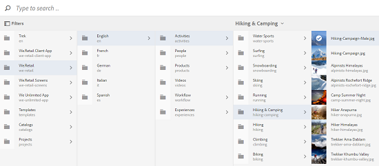

# Sök efter resurser i AEM {#search-assets-in-aem}

Du kan uppnå högre innehållshastighet med användarvänliga alternativ för tillgångsidentifiering i Experience Manager. Teamen kan korta time-to-market med smidiga, intelligenta sökfunktioner som är körklara och anpassade metoder. Att söka resurser är centralt för användningen av ett digitalt resurshanteringssystem - oavsett om det är avsett för kreativa användare, för robust hantering av resurser av företagsanvändare och marknadsförare eller för administration av DAM-administratörer. Enkla, avancerade och anpassade sökningar som du kan utföra via AEM Assets användargränssnitt eller andra appar och ytor hjälper dig att klara dessa användningar.

AEM stöder följande användningsfall och den här artikeln beskriver användning, begrepp, konfigurationer, begränsningar och felsökning för dessa användningsområden.

| Söka efter resurser | Konfiguration och administration | Arbeta med sökresultat |
|--- |--- |--- |
| [Grundläggande sökningar](#searchbasics) | [Sökindex](#searchindex) | [Sortera resultat](#sort) |
| [Förstå sökgränssnittet](#searchui) |  | [Kontrollera egenskaper och metadata för en resurs](#checkinfo) |
| [Sökförslag](#searchsuggestions) | [Obligatoriska metadata](#mandatorymetadata) | [Hämta](#download) |
| [Förstå sökresultat och beteenden](#searchbehavior) | [Ändra sökfaktorer](#searchfacets) | [Massmetadatauppdateringar](#metadataupdates) |
| [Sökrankning och förstärkning](#searchrank) | [Textextrahering](#extracttextupload) | [Smarta samlingar](#collections) |
| [Avancerad sökning: filtrering och sökningens omfattning](#scope) | [Anpassade predikat](#custompredicates) | [Förstå oväntade resultat](#unexpectedresults) och [felsökning](#troubleshoot) |
| [Sök bland andra lösningar och appar](#beyondomnisearch):       [Tillgångslänk](#aal)  för [skrivbord](#desktopapp)       [Adobe Stock-bilder](#adobestock)       [Dynamiska medieresurser](#dynamicmedia) |  |  |
| [Resursväljare/väljare](#assetselector) |  |  |
| [Begränsningar](#tips) och [tips](#limitations) |  |  |
| [Illustrerade exempel](#samples) |  |  |

Sök efter resurser med hjälp av Omnissearch-fältet högst upp i AEM webbgränssnitt. Gå till **[!UICONTROL Assets]** > **[!UICONTROL Files]** i AEM, klicka på  i det övre fältet, ange söknyckelord och tryck på Retur. Du kan också använda kortkommandot för nyckelord `/` (snedstreck) för att öppna omsökningsfältet. `Location:Assets` är förvalt för att begränsa sökningarna till DAM-resurser. Du kan göra avancerade sökningar för att öka eller begränsa [sökningens](#scope)omfattning.

Använd panelen för att **[!UICONTROL Filters]** söka efter resurser, mappar, taggar och metadata. Du kan filtrera sökresultaten baserat på de olika alternativen (predikaten), t.ex. filtyp, filstorlek, datum då filen senast ändrades, status för resursen, information om insikter och Adobe Stock-licensiering. Du kan anpassa panelen Filter och lägga till/ta bort sökpredikatorer med [sökfaktorer](/help/assets/search-facets.md).

AEM kan söka efter samlingar och söka efter resurser i en samling. Se [söksamlingar](/help/assets/manage-collections.md).

## Förstå sökgränssnittet {#searchui}

Bekanta dig med sökgränssnittet och de tillgängliga åtgärderna.

för sökresultat för Assets-*bilder:* Förstå delar av gränssnittet för resurssökningsresultat

**A.** Spara sökningen som en smart samling. **B.** Filter (predikat) för att begränsa sökresultatet. **C.** Visa filer, mappar eller båda i sökresultatet. **D.** Klicka på Filter för att öppna eller stänga den vänstra rutan. **E.** Sökplatsen är DAM. **F.** Fält för omnisökning med användardefinierat söknyckelord **G.** Kryssruta för att markera alla sökresultat **H.** Antal visade sökresultat av totalt antal sökresultat **I.** Stäng sökningen **J.** Växla mellan kortvyn och listvyn

### Dynamiska sökfaktorer {#dynamicfacets}

Du kan identifiera önskade resurser snabbare från sökresultatsidan med det dynamiskt uppdaterade antalet förväntade sökresultat i sökmetoderna. Det förväntade antalet resurser uppdateras även innan sökfiltret används. Genom att se det förväntade antalet mot filtret kan du snabbt och effektivt navigera bland sökresultaten. Mer information finns i [Söka efter resurser i AEM](/help/assets/search-assets.md).

Se det ungefärliga antalet resurser utan att filtrera sökresultaten i sökfaktorer.

## Sök efter förslag medan du skriver {#searchsuggestions}

När du börjar skriva ett nyckelord föreslår AEM möjliga söknyckelord eller fraser. Förslagen baseras på resurserna i AEM. AEM indexerar alla metadatafält som ska vara till hjälp vid sökning. Systemet använder värdena från följande metadatafält för att ge sökförslag. Om du vill ge sökförslag bör du överväga att fylla i följande fält med lämpliga nyckelord:

* Resurstaggar. (kartor till `jcr:content/metadata/cq:tags`)
* Resursrubrik. (kartor till `jcr:content/metadata/dc:title`)
* Resursbeskrivning. (kartor till `jcr:content/metadata/dc:description`)
* Titel i JCR-databasen. Värdet kan mappas till Resursrubrik. (kartor till `jcr:content/jcr:title`)
* Beskrivning i JCR-databasen. Värdet kan mappas till tillgångsbeskrivningen. (kartor till `jcr:content/jcr:description`)

## Förstå sökresultat och beteenden {#searchbehavior}

### Grundläggande söktermer och sökresultat {#searchbasics}

Du kan köra nyckelordssökningar från OmniSearch-fältet. Nyckelordssökningen är inte skiftlägeskänslig och är en fulltextsökning (i alla vanliga metadatafält). Om mer än ett nyckelord används är `AND` standardoperatorn mellan nyckelorden. Resultatet sorteras efter relevans, med början med närmast matchande. För flera nyckelord är mer relevanta resultat de resurser som innehåller båda termerna i sina metadata. I metadata rangordnas nyckelord som visas som smarta taggar högre än nyckelord som visas i andra metadatafält.

AEM gör det möjligt att ge ett visst sökord högre vikt. Det är också möjligt att höja rankningen för ett antal målinriktade resurser för specifika söktermer. AEM administratörer kan göra dessa konfigurationer enligt beskrivningen nedan.

För att snabbt hitta relevanta resurser innehåller det avancerade gränssnittet funktioner för filtrering, sortering och markering. Du kan filtrera resultat baserat på flera villkor och se antalet sökningar efter olika filter. Du kan också köra sökningen igen genom att ändra frågan i fältet Omnissearch. När du ändrar söktermer eller filter används de andra filtren för att bevara sökkontexten.

Ibland kan du se oväntade resurser i sökresultaten. Mer information finns i [oväntade resultat](#unexpectedresults).

AEM kan söka i många filformat och sökfiltren kan anpassas efter företagets behov. Kontakta dina administratörer för att få veta vilka sökalternativ som är tillgängliga för din DAM-databas och vilka begränsningar din inloggning kan ha.

<!-- 
### Results with and without Enhanced Smart Tags {#withsmarttags}

By default, AEM search combines the search terms with an AND clause. For example, consider searching for keywords woman running. Only the assets with both woman and running keywords in the metadata appear in the search results by default. The same behavior is retained when special characters (periods, underscores, or dashes) are used with the keywords. The following search queries return the same results:

* `woman running`
* `woman.running`
* `woman-running`

However, the query `woman -running` returns assets without `running` in their metadata.
Using smart tags adds an extra `OR` clause to find any of the search terms as the applied smart tags. An asset tagged with either `woman` or `running` using Smart Tags also appear in such a search query. So the search results are a combination of,

* Assets with `woman` and `running` keywords in the metadata (default behavior).

* Assets smart tagged with either of the keywords (Smart Tags behavior).
-->

### Sök efter rankning och förstärkning {#searchrank}

Sökresultaten som matchar alla söktermer i metadatafält visas först, följt av sökresultaten som matchar någon av söktermerna i de smarta taggarna. I ovanstående exempel är den ungefärliga visningsordningen för sökresultat:

1. Matchningar av `woman running` i de olika metadatafälten.
1. Matchar `woman running` i smarta taggar.
1. Matchar `woman` eller matchar `running` i smarta taggar.

Du kan förbättra nyckelordens relevans för vissa resurser för att öka sökningen baserat på nyckelorden. Det innebär att de bilder som du befordrar särskilda nyckelord för visas högst upp i sökresultatet när du söker baserat på dessa nyckelord.

1. Öppna egenskapssidan för resursen i Assets-gränssnittet. Klicka på **[!UICONTROL Advanced]** och klicka/tryck på **[!UICONTROL Add]** under **[!UICONTROL Elevate for search keywords]**.
1. I **[!UICONTROL Search Promote]** rutan anger du ett nyckelord som du vill öka sökningen efter bilden för och klickar/trycker sedan på **[!UICONTROL Add]**. Du kan ange flera nyckelord på samma sätt.
1. Klicka på **[!UICONTROL Save & Close]**. Den resurs som du befordrade för det här nyckelordet visas bland de översta sökresultaten.

Du kan använda detta till din fördel genom att öka rankningen för vissa resurser i sökresultaten för nyckelordet target. Se exempelvideon nedan. Mer information finns i [Söka i AEM](https://docs.adobe.com/content/help/en/experience-manager-learn/assets/search-and-discovery/search-boost.html).

>[!VIDEO](https://video.tv.adobe.com/v/16766/?quality=6)

*Video: Förstå hur sökresultaten rangordnas och hur rangordningen kan påverkas.*

## Avancerad sökning {#scope}

AEM innehåller olika metoder, som filter som används för de sökda resurserna, så att du snabbare kan hitta de önskade resurserna. Nedan beskrivs några vanliga metoder. Några [illustrerade exempel](#samples) visas nedan.

**Sök efter filer eller mappar**: Se antingen filer, mappar eller båda i sökresultaten. På **[!UICONTROL Filters]** panelen kan du välja rätt alternativ. Se [sökgränssnitt](#searchui).

**Sök efter resurser i en mapp**: Du kan begränsa sökningen till en viss mapp. Lägg till en mappsökväg på **[!UICONTROL Filters]** panelen. Du kan bara markera en mapp i taget.

Begränsa sökresultaten till en mapp genom att lägga till en mappsökväg i panelen Filter

<!--
### Find similar images {#visualsearch}

To find images that are visually similar to a user-selected image, click **[!UICONTROL Find Similar]** option from the card view of an image or from the toolbar. AEM displays the smart tagged images from the DAM repository that are similar to a user-selected image. See [how to configure similarity search](#configvisualsearch).

*Figure: Find similar images using the option in the card view*
-->

### Adobe Stock-bilder {#adobestock}

I det AEM användargränssnittet kan användare söka efter [Adobe Stock-resurser](/help/assets/aem-assets-adobe-stock.md) och licensiera de nödvändiga resurserna. Lägg till `Location: Adobe Stock` i omsökningsfältet. Du kan också använda panelen Filter för att hitta alla licensierade eller olicensierade mediefiler eller söka efter en viss mediefil med hjälp av Adobe Stock filnummer.

### Dynamiska medieresurser {#dmassets}

You can filter for Dynamic Media images by selecting **[!UICONTROL Dynamic Media > Sets]** from the **[!UICONTROL Filters]** panel. Den filtrerar och visar resurser som bilduppsättningar, karuseller, blandade medieuppsättningar och rotationsuppsättningar.

### Söka med specifika värden i metadatafält {#gqlsearch}

Du kan söka efter resurser baserat på exakta värden för specifika metadatafält, som titel, beskrivning och författare. Funktionen för fulltextsökning i GQL hämtar endast resurser vars metadatavärde exakt matchar din sökfråga. Namnen på egenskaperna (till exempel författare, titel och så vidare) och värdena är skiftlägeskänsliga.

| Metadatafält | Fasettvärde och -användning |
|---|---|
| Titel | title:John |
| Originalformat | skapare:John |
| Plats | plats:NA |
| Beskrivning | description:&quot;Sample Image&quot; |
| Skapare | creatortool:&quot;Adobe Photoshop CC 2015&quot; |
| Copyright-ägare | copyrightowner:&quot;Adobe Systems&quot; |
| Medarbetare | medarbetare:John |
| Användningsvillkor | usageterms:&quot;CopyRights Reserved&quot; |
| Skapad | skapad:YYY-MM-DDTHH |
| Utgångsdatum | förfaller:ÅÅÅ-MM-DDTHH |
| I tid | ontime:YYY-MM-DDTHH |
| Fråntid | offtime:YYY-MM-DDTHH |
| Tidsintervall (förfaller dateontime, offtime) | faktafält: nedsänkt..upperbound |
| Bana | /content/dam/&lt;mappnamn> |
| PDF-titel | pdftitle:&quot;Adobe-dokument&quot; |
| Ämne | ämne:&quot;Utbildning&quot; |
| Taggar | taggar:&quot;Plats och resa&quot; |
| Typ | type:&quot;image\png&quot; |
| Bildens bredd | width:lowerbound..upperbound |
| Bildens höjd | height:lowerbound..upperbound |
| Person | person:John |

Egenskapernas sökväg, gräns, storlek och sorteringsordning kan inte vara ORed med någon annan egenskap.

Nyckelordet för en användargenererad egenskap är dess fältetikett i egenskapsredigeraren i gemener, med borttagna blanksteg.

Här är några exempel på sökformat för komplexa frågor:

* Så här visar du alla resurser med flera facets-fält (till exempel: title=John Doe and creator tool = Adobe Photoshop): `title:"John Doe" creatortool : Adobe*`
* Så här visar du alla resurser när värdet för facets inte är ett enda ord utan en mening (till exempel: title=Scott Reynolds): `title:"Scott Reynolds"`
* Så här visar du resurser med flera värden för en enda egenskap (till exempel: title=Scott Reynolds eller John Doe): `title:"Scott Reynolds" OR "John Doe"`
* Så här visar du resurser med egenskapsvärden som börjar med en viss sträng (till exempel: heter Scott Reynolds): `title:Scott*`
* Så här visar du resurser med egenskapsvärden som slutar med en viss sträng (till exempel: heter Scott Reynolds): `title:*Reynolds`
* Så här visar du resurser med ett egenskapsvärde som innehåller en viss sträng (till exempel: title = Basel Meeting Room): `title:*Meeting*`
* Så här visar du resurser som innehåller en viss sträng och har ett specifikt egenskapsvärde (till exempel: sök efter strängen Adobe i resurser med rubriken=John Doe): `*Adobe* title:"John Doe"`

## Sök efter resurser från andra AEM eller gränssnitt {#beyondomnisearch}

Adobe Experience Manager (AEM) kopplar DAM-databasen till olika andra AEM lösningar för att ge snabbare åtkomst till digitalt material och effektivisera de kreativa arbetsflödena. Alla resursidentifieringar börjar med bläddring eller sökning. Sökfunktionen är i stort sett densamma på de olika ytorna och lösningarna. Vissa sökmetoder ändras när målgruppen, användningsexemplen och användargränssnittet varierar mellan olika AEM. De specifika metoderna beskrivs för de enskilda lösningarna på länkarna nedan. De universellt tillämpliga tipsen och beteendena beskrivs i den här artikeln.

### Söka efter resurser från panelen Resurslänk i Adobe {#aal}

Med Adobe Asset Link kan formgivare nu komma åt innehåll som lagras i AEM Assets utan att lämna de Adobe Creative Cloud-program som stöds. Med hjälp av panelen i appen i Creative Cloud-apparna kan du smidigt bläddra bland, söka efter, checka ut och checka in resurser: Photoshop, Illustrator och InDesign. Med Asset Link kan du också söka visuellt liknande resultat. Visuella sökresultat bygger på Adobe Sensei maskininlärningsalgoritmer och hjälper användarna att hitta estetiskt liknande bilder. Se [söka efter och bläddra bland resurser](https://helpx.adobe.com/enterprise/using/manage-assets-using-adobe-asset-link.html#UseAdobeAssetLink) med Adobe Asset Link.

### Söka efter resurser i AEM datorprogram {#desktopapp}

Kreatörer använder datorprogrammet för att göra AEM Assets enkelt sökbart och tillgängligt på sin lokala dator (Win eller Mac). Det är enkelt att visa de önskade resurserna i Finder eller Utforskaren i Windows, som har öppnats i skrivbordsprogram och ändrats lokalt. Ändringarna sparas sedan i AEM med en ny version som har skapats i databasen. Programmet stöder enkla sökningar med ett eller flera nyckelord, * och ? jokertecken och operatorn AND. Se [Bläddra bland, söka efter och förhandsgranska resurser](https://docs.adobe.com/content/help/en/experience-manager-desktop-app/using/using.html#browse-search-preview-assets) i skrivbordsappen.

### Sök efter resurser i varumärkesportalen {#brandportal}

Affärsanvändare och marknadsförare använder Brand Portal för att effektivt och säkert dela godkänt digitalt material med interna team, partners och återförsäljare. Se [Sök resurser på varumärkesportalen](https://docs.adobe.com/content/help/en/experience-manager-brand-portal/using/search-capabilities/brand-portal-searching.html).

### Sök i Adobe Stock-bilder {#adobestock-1}

I det AEM användargränssnittet kan användare söka efter Adobe Stock-resurser och licensiera de nödvändiga resurserna. Lägg till `Location: Adobe Stock` i Omnissearch-fältet. Du kan också använda **[!UICONTROL Filters]** panelen för att hitta alla licensierade eller olicensierade mediefiler eller söka efter en viss mediefil med hjälp av Adobe Stock filnummer. Se [Hantera Adobe Stock-bilder i AEM](/help/assets/aem-assets-adobe-stock.md#usemanage).

### Sök efter Dynamic Media-resurser {#dynamicmedia}

Du kan filtrera efter dynamiska mediebilder genom att välja **[!UICONTROL Dynamic Media]** > **[!UICONTROL Sets]** på panelen **[!UICONTROL Filters]**. Den filtrerar och visar resurser som bilduppsättningar, karuseller, blandade medieuppsättningar och rotationsuppsättningar. När författarna redigerar webbsidor kan de söka efter uppsättningar inifrån Content Finder. Det finns ett filter för uppsättningar på en snabbmeny.

### Söka efter resurser i Content Finder vid redigering av webbsidor {#contentfinder}

Författare kan använda Content Finder för att söka i DAM-databasen efter relevanta resurser och använda resurserna på de webbsidor de skapar.

<!-- Authors can also use the Connected Assets functionality to search for assets that are available on a remote AEM deployment. Authors can then use these assets in web pages on a local AEM deployment. See [use remote assets](use-assets-across-connected-assets-instances.md#use-remote-assets).
-->

### Sök i samlingar {#collections}

AEM kan söka efter samlingar och söka efter resurser i en samling. Se [söksamlingar](/help/assets/manage-collections.md).

## Resursväljare {#assetselector}

Med resursväljaren kan du söka efter, filtrera och bläddra bland DAM-resurser på ett speciellt sätt. Resursväljaren finns på `https://[aem_server]:[port]/aem/assetpicker.html`. Du kan hämta metadata för resurser som du väljer med resursväljaren. Du kan starta det med begärandeparametrar som stöds, till exempel resurstyp (bild, video, text) och markeringsläge (enstaka eller flera markeringar). Dessa parametrar anger kontexten för resursväljaren för en viss sökinstans och förblir intakta genom hela markeringen.

Resursväljaren använder HTML5- `Window.postMessage` meddelandet för att skicka data för den valda resursen till mottagaren. Resursväljaren baseras på Granites vokabulär för att välja bas. Som standard arbetar resursväljaren i bläddringsläge.

Du kan skicka följande frågeparametrar i en URL för att starta resursväljaren i ett visst sammanhang:

| Namn | Värden | Exempel | Syfte |
|---|---|---|---|
| resurssuffix (B) | Mappsökväg som resurssuffix i URL:[https://localhost:4502/aem/assetpicker.html/&lt;mappsökväg>](https://localhost:4502/aem/assetpicker.html) | Om du vill starta resursväljaren med en viss mapp markerad, till exempel med mappen /content/dam/we-retail/en/tasks markerad, ska URL:en ha formatet: [https://localhost:4502/aem/assetpicker.html/content/dam/we-retail/en/activities?assettype=images](https://localhost:4502/aem/assetpicker.html/content/dam/we-retail/en/activities?assettype=images) | Om du vill att en viss mapp ska väljas när resursväljaren startas, skickar du den som ett resurssuffix. |
| läge | en, flera | [https://localhost:4502/aem/assetpicker.html?mode=multiplehttps://localhost:4502/aem/assetpicker.html?mode=single](https://localhost:4502/aem/assetpicker.html?mode=multiplehttps://localhost:4502/aem/assetpicker.html?mode=single) | I flera lägen kan du markera flera resurser samtidigt med resursväljaren. |
| mimeType | mimtyp(er) (`/jcr:content/metadata/dc:format`) av en resurs (jokertecken stöds också) | <ul><li>[https://localhost:4502/aem/assetpicker.html?mimetype=image/png](https://localhost:4502/aem/assetpicker.html?mimetype=image/png)</li><li>[https://localhost:4502/aem/assetpicker.html?mimetype=*png](https://localhost:4502/aem/assetpicker.html?mimetype=*png)</li><li>[https://localhost:4502/aem/assetpicker.html?mimetype=*presentation](https://localhost:4502/aem/assetpicker.html?mimetype=*presentation)</li><li>[https://localhost:4502/aem/assetpicker.html?mimetype=*presentation&amp;mimetype=*png](https://localhost:4502/aem/assetpicker.html?mimetype=*presentation&amp;mimetype=*png)</li></ul> | Använd det för att filtrera resurser baserat på MIME-typ(er) |
| dialog | true, false | [https://localhost:4502/aem/assetpicker.html?dialog=true](https://localhost:4502/aem/assetpicker.html?dialog=true) | Använd de här parametrarna för att öppna resursväljaren som Granite-dialogrutan. Det här alternativet kan bara användas när du startar resursväljaren via fältet Bevilja sökväg och konfigurerar den som URL för pickerSrc. |
| assettype (S) | bilder, dokument, multimedia, arkiv | <ul><li>[https://localhost:4502/aem/assetpicker.html?assettype=images](https://localhost:4502/aem/assetpicker.html?assettype=images)</li><li>[https://localhost:4502/aem/assetpicker.html?assettype=documents](https://localhost:4502/aem/assetpicker.html?assettype=documents)</li><li>[https://localhost:4502/aem/assetpicker.html?assettype=multimedia](https://localhost:4502/aem/assetpicker.html?assettype=multimedia)</li><li>[https://localhost:4502/aem/assetpicker.html?assettype=archives](https://localhost:4502/aem/assetpicker.html?assettype=archives)</li></ul> | Använd det här alternativet om du vill filtrera resurstyper baserat på det skickade värdet. |
| root | &lt;mappsökväg> | [https://localhost:4502/aem/assetpicker.html?assettype=images&amp;root=/content/dam/we-retail/en/activities](https://localhost:4502/aem/assetpicker.html?assettype=images&amp;root=/content/dam/we-retail/en/activities) | Använd det här alternativet om du vill ange rotmappen för resursväljaren. I det här fallet kan du bara välja underordnade resurser (direkt/indirekt) under rotmappen. |

Om du vill komma åt resursväljargränssnittet går du till `https://[AEM server]:[port]/aem/assetpicker`. Navigera till önskad mapp och markera en eller flera resurser. Du kan också söka efter den önskade resursen i rutan Sök, tillämpa det filter som behövs och sedan markera den.

*Bild: Bläddra och välj resurs i resursväljaren.*

## Begränsningar {#limitations}

Sökfunktionen i AEM Assets har följande begränsningar:

* Ange inget radavståndsutrymme i sökfrågan, annars fungerar inte sökningen.
* AEM kan fortsätta att visa söktermen efter att du har valt egenskaper för en resurs bland sökresultaten och sedan avbryta sökningen (CQ-4273540).
* När du söker efter mappar, filer och mappar kan sökresultaten inte sorteras efter någon parameter.
* Om du trycker på retur utan att skriva något i omsökningsfältet, returnerar AEM en lista med bara filer och inte mappar. Om du söker specifikt efter mappar utan att använda ett nyckelord returnerar AEM inga resultat.

Visuell sökning eller likhetssökning har följande begränsningar:

* Visuell sökning fungerar bäst med större databaser. Även om det inte finns något minsta antal bilder som krävs för bra resultat, kanske inte matchningskvaliteten för ett fåtal bilder är lika bra som matchningarna från en stor databas.
* Du kan inte ändra modell eller AEM för att hitta liknande bilder. Modellen ändras inte om du till exempel lägger till eller tar bort smarta taggar för ett fåtal resurser. Resurserna tas inte med i de visuellt liknande sökresultaten.

## Söktips {#tips}

* När du övervakar granskningsstatusen för resurser ska du använda lämpligt alternativ för att hitta vilka resurser som är godkända eller vilka resurser som väntar på godkännande.
* Använd Insights-predikatet för att söka efter resurser som stöds baserat på användningsstatistik från olika Creative-program. Användningsdata grupperas under Användningspoäng, Impressions, Clicks och Media-kanaler där resurserna visas i kategorier.
* Använd kryssrutan för att välja alla sökresultat eller filtrerade sökresultat för att arbeta med markeringen. Den väljer alla sökda resurser oavsett hur många resurser som visas i den aktuella användarvyn. Du kan till exempel hämta alla markerade resurser, uppdatera metadataegenskaper gruppvis för alla markerade resurser eller lägga till markerade resurser i en samling.
* Mer information om hur du söker efter resurser som inte innehåller de obligatoriska metadata finns i [obligatoriska metadata](#mandatorymetadata).
* Alla metadatafält används för sökningen. En allmän sökning, som att söka efter 12, ger vanligtvis många resultat. Du får bättre resultat om du använder dubbla (inte enkla) citattecken eller ser till att talet ligger intill ett ord utan specialtecken (till exempel `shoe12`).
* Fulltextsökning stöder operatorer som `-` och `^`. Om du vill söka efter de här bokstäverna som stränglitteraler omger du sökuttrycket med citattecken. Använd till exempel `"Notebook - Beauty"` istället för `Notebook - Beauty`.
* Om sökresultaten är för många kan du begränsa [sökningen](#scope) till noll för de önskade resurserna. Det fungerar bäst om du har en aning om hur du ska söka efter de önskade resurserna, till exempel en viss filtyp, en viss plats, specifika metadata och så vidare.

* **Taggning**: Taggar hjälper dig att kategorisera resurser som du kan bläddra bland och söka efter mer effektivt. Taggning hjälper till att sprida rätt taxonomi till andra användare och arbetsflöden. AEM erbjuder metoder för att automatiskt tagga resurser med hjälp av Adobe Sensei artificiellt intelligenta tjänster som hela tiden blir bättre på att tagga materialet med användning och utbildning. När du söker efter resurser tas smarta taggar med i beräkningen om funktionen är aktiverad på ditt konto. Det fungerar tillsammans med de inbyggda sökfunktionerna. Se [sökbeteende](#searchbehavior). Om du vill optimera den ordning i vilken sökresultaten visas kan du [öka sökrankningen](#searchrank) för några utvalda resurser.

* **Indexering**: Endast indexerade metadata och resurser returneras i sökresultatet. För bättre täckning och prestanda bör du se till att indexeringen är korrekt och följa bästa praxis. Se [indexering](#searchindex).

## Några exempel som illustrerar sökning {#samples}

Använd citattecken runt nyckelord för att hitta resurser som innehåller den exakta frasen i exakt den ordning som anges av användaren.

*Bild: Sökbeteende med och utan citattecken.*

**Sök med asterisk som jokertecken**: Om du vill bredda sökningen använder du en asterisk före eller efter sökordet för att matcha ett valfritt antal tecken. Om du till exempel söker efter en körning utan asterisk returneras inga resurser som innehåller någon variant av ordet (inklusive i metadata). En asterisk ersätter ett valfritt antal tecken. Till exempel,

* `run` returnerar resurser med nyckelordet exakt run
* `run*` returnerar resurser som körs, körs, körs och så vidare.
* `*run` returnerar utfall, kör igen och så vidare.
* `*run*` returnerar alla möjliga kombinationer.

*Bild: Illustration use of asterisk wildcard in Asset search using a example.*

**Sök med frågetecken**: Om du vill bredda sökningen använder du en eller flera ? tecken som matchar det exakta antalet tecken. I följande bild

* `run???` frågan matchar inte någon resurs.

* `run????` frågan matchar ordet `running` med fyra tecken efter `run`.

* `??run` frågan matchar ordet `rerun` med två tecken före `run`.

*Bild: Illustration use of question mark wildcard in Asset search using an example.*

**Exkludera ett nyckelord**: Använd streck för att söka efter resurser som inte innehåller något nyckelord. Frågan returnerar till exempel resurser som innehåller `running -shoe` men inte `running``shoe`. På samma sätt returnerar frågan resurser som innehåller `camp -night` men inte `camp` `night`. Observera att `camp-night` frågan returnerar resurser som innehåller både `camp` och `night`.

*: Användning av bindestreck för att söka efter resurser som inte innehåller ett exkluderat nyckelord*

<!--
## Configuration and administration tasks related to search functionality {#configadmin}

### Search index configurations {#searchindex}

Asset discovery relies on indexing of DAM contents, including the metadata. Faster and accurate asset discovery relies on optimized indexing and appropriate configurations. See [indexing](/help/operations/indexing.md).
-->

<!--
### Visual or similarity search {#configvisualsearch}

Visual search uses smart tagging and requires AEM 6.5.2.0 or later. After configuring smart tagging functionality, follow these steps.

1. In AEM CRXDE, in `/oak:index/lucene` node, add the following properties and values and save the changes.

    * `costPerEntry` property of type `Double` with the value `10`.

    * `costPerExecution` property of type `Double` with the value `2`.

    * `refresh` property of type `Boolean` with the value `true`.

   This configuration allows searches from the appropriate index.

1. To create Lucene index, in CRXDE, at `/oak:index/damAssetLucene/indexRules/dam:Asset/properties`, create node named `imageFeatures` of type `nt-unstructured`. In `imageFeatures` node,

    * Add `name` property of type `String` with the value `jcr:content/metadata/imageFeatures/haystack0`.

    * Add `nodeScopeIndex` property of type `Boolean` with the value of `true`.

    * Add `propertyIndex` property of type `Boolean` with the value of `true`.

    * Add `useInSimilarity` property of type `Boolean` with the value `true`.

   Save the changes.

1. Access `/oak:index/damAssetLucene/indexRules/dam:Asset/properties/predictedTags` and add `similarityTags` property of type `Boolean` with the value of `true`.
1. Apply Smart Tags to the assets in your AEM repository. See [how to configure smart tags](https://docs.adobe.com/content/help/en/experience-manager-learn/assets/metadata/smart-tags-technical-video-setup.html).
1. In CRXDE, in `/oak-index/damAssetLucene` node, set the `reindex` property to `true`. Save the changes.
1. (Optional) If you have customized search form then copy the `/libs/settings/dam/search/facets/assets/jcr%3Acontent/items/similaritysearch` node to `/conf/global/settings/dam/search/facets/assets/jcr:content/items`. Save all the changes.

For related information, see [understand smart tags in AEM](https://helpx.adobe.com/experience-manager/kt/help/assets/smart-tags-feature-video-understand.html) and [how to manage smart tags](/help/assets/smart-tags.md).
-->

<!--
### Mandatory metadata {#mandatorymetadata}

Business users, administrators, or DAM librarians can define some metadata as mandatory metadata that is a must for the business processes to work. For various reasons, some assets may be missing this metadata, such as legacy assets or assets migrated in bulk. Assets with missing or invalid metadata are detected and reported based on the indexed metadata property. To configure it, see [mandatory metadata](/help/assets/metadata-schemas.md#defining-mandatory-metadata).

### Modify search facets {#searchfacets}

To improve the speed of discovery, AEM Assets offers search facets using which you can filter the search results. The Filters panel includes a few standard facets by default. Administrators can customize the Filters panel to modify the default facets using the in-built predicates. AEM provides a good collection of in-built predicates and an editor to customize the facets. See [search facets](/help/assets/search-facets.md).

### Extract text when uploading assets {#extracttextupload}

You can configure AEM to extract the text from the assets when users upload assets, such as PSD or PDF files. AEM indexes the extracted text and helps users search these assets based on the extracted text. See [upload assets](/help/assets/manage-digital-assets.md#uploading-assets).
-->

<!-- TBD: Check with gklebus and engineering if these customization are possible in CS.

### Custom predicates to filter search results {#custompredicates}

Predicates are used to create facets. Administrators can customize the search facets in the Filters panel using pre-configured predicates. These predicates can be customized using overlays. See [create custom predicates](/help/assets/searchx.md).

You can search for digital assets based on one or more of the following properties. Filters that apply on some of these properties are available by default and some other filters can be custom-created to apply on the other properties.

| Search field | Search property values |
|---|---|
| Approved Status | Approved or Rejected. |
| Audio Bitrate | Specified as a minimum and maximum value. Value is stored in the metadata of video renditions only. |
| Audio Codec | Libvorbis, Lame MP3, AAC Encoding. Value is stored in the metadata of video renditions only. |
| File Size | Small, Medium, or Large. |
| Last Modified | Hour, Day, Week, Month, or Year. |
| MIME Types | Images, Documents, Multimedia, Archives, or Other. |
| Orientation | Horizontal, Vertical, or Square. |
| Publish Status | Published or Unpublished. |
| Style | Color, or Black & White. |
| Video Bitrate | Specified as a minimum and maximum value. Value is stored in the metadata of video renditions only. |
| Video Codec | x264. Value is stored in the metadata of video renditions only. |
| Video Format | DVI, Flash, MPEG4, MPEG, OGG Theora, QuickTime, Windows Media. Value is stored in the metadata of the source video and any renditions. |
| Video Height | Specified as a minimum and maximum value. Value is stored in the metadata of video renditions only. |
| Video Width | Specified as a minimum and maximum value. Value is stored in the metadata of video renditions only. |

-->

## Arbeta med resurssökningsresultat {#aftersearch}

När du ser sökningar efter resurser som matchar dina villkor kan du utföra följande vanliga uppgifter med eller utföra följande åtgärder på sökresultaten:

* Visa metadataegenskaper och annan information.
* Hämta en eller flera resurser.
* Använd Skrivbordsåtgärder för att öppna resurserna i skrivbordsappen.
* Skapa smarta samlingar.

### Sortera sökresultat {#sort}

Om du sorterar sökresultatet hittar du snabbare den resurs du behöver. Sorting search results works in list view and only when you select **[[!UICONTROL Files]](#searchui)** from the **[!UICONTROL Filters]** panel. [!DNL Assets]I används serversortering för att snabbt sortera alla resurser (oavsett hur många) i en mapp eller i resultatet av en sökfråga. Sortering på serversidan ger snabbare och exaktare resultat än sortering på klientsidan.

I listvyn kan du sortera sökresultaten på samma sätt som du kan sortera resurser i valfri mapp. Sortering fungerar för de här kolumnerna - Namn, Titel, Status, Dimensioner, Storlek, Klassificering, Användning, Skapat (Datum), Ändrat (Datum), Publicerat (Datum), Arbetsflöde och Utcheckat.

Begränsningar av sorteringsfunktioner finns i [Begränsningar](#limitations).

### Kontrollera detaljerad information om en resurs {#checkinfo}

Du kan kontrollera detaljerad information om en sökresurs från sökresultatsidan.

Om du vill visa alla metadata för en resurs markerar du resursen och klickar på **[!UICONTROL properties]** i verktygsfältet.

Om du vill kontrollera kommentarerna för en resurs eller versionshistoriken för en resurs klickar du på resursen för att öppna en stor förhandsvisning. Öppna tidslinjen i den vänstra rutan och välj **[!UICONTROL Comments]** eller **[!UICONTROL Versions]**. Du kan också sortera tidslinjeaktiviteter, som kommentarer eller versioner, i kronologisk ordning.

Sortera tidslinjeposter för en sökresurs

### Hämta sökbara resurser {#download}

Du kan hämta de sökda resurserna och deras återgivningar på samma sätt som du hämtar vanliga resurser från mappar. Välj en eller flera resurser från sökresultaten och klicka på **[!UICONTROL Download]** i verktygsfältet.

### Uppdatera metadataegenskaper gruppvis {#metadataupdates}

Det går att göra satsvisa uppdateringar av de gemensamma metadatafälten för flera resurser. Välj en eller flera resurser från sökresultaten. Klicka **[!UICONTROL Properties]** i verktygsfältet och uppdatera metadata efter behov. Klicka **[!UICONTROL Save and Close]** när du är klar. De befintliga metadata i de uppdaterade fälten skrivs över.

För resurser som är tillgängliga i en enda mapp eller en samling är det enklare att [uppdatera metadata gruppvis](/help/assets/manage-metadata.md#manage-assets-metadata). För resurser som är tillgängliga i olika mappar eller matchar ett gemensamt villkor är det snabbare att uppdatera metadata i grupp via sökning.

### Smarta samlingar {#collections-1}

En samling är en ordnad uppsättning resurser som kan innehålla resurser från olika platser, eftersom samlingar bara innehåller referenser till dessa resurser. Samlingar är av följande två typer:

* En statisk referenslista med resurser, mappar och andra samlingar.
* En dynamisk lista (smart samling) som fyller i resurser i samlingen baserat på sökvillkor.

Du kan skapa smarta samlingar baserat på sökvillkoren. På panelen **[!UICONTROL Filters]** väljer du **[!UICONTROL Files]** och klickar på **[!UICONTROL Save Smart Collection]**. Läs mer i [Hantera samlingar](/help/assets/manage-collections.md).

## Oväntade sökresultat {#unexpectedresults}

**Sök efter saknade metadata**: När du söker efter resurser som saknar obligatoriska metadata kan AEM visa resurser som har giltiga metadata. Saknade metadata identifieras och rapporteras baserat på indexerad metadataegenskap. Även om metadata för resursen är fasta fortsätter den att visas som saknade metadata tills indexeringen görs om. Se [obligatoriska metadata](/help/assets/metadata-schemas.md#defining-mandatory-metadata).

**För många sökresultat**: Om du vill undvika att få för många sökresultat bör du begränsa sökresultaten. Om du t.ex. vill söka efter resurser i DAM väljer du `Location:Assets` i omsökningsfältet. Mer information om sökfilter finns i [sökningens](#scope)omfång.

<!-- Another reason to get more than expected search results can be use of smarts tags. See [search behavior with smart tags](#withsmarttags). 
-->

<!--
**Partially related or unrelated search results**: AEM may display seemingly partially related or unrelated assets, alongside the desired assets in the search results. If you enable Enhanced Smart Tags, the search behavior changes slightly. See how it changes [after smart tagging](#withsmarttags).
-->

**Inga förslag för automatisk komplettering av nyligen överförda resurser**: Metadata (titlar, taggar o.s.v.) för de nyligen överförda resurserna är inte omedelbart tillgängliga som förslag när du börjar skriva ett söknyckelord i omsökningsfältet. AEM Assets väntar tills en timeout-period har gått ut (en timme som standard) innan ett bakgrundsjobb körs för att indexera metadata för alla nyligen överförda eller uppdaterade resurser och lägger sedan till metadata i listan med förslag.

**Inga sökresultat**: Om AEM och visar en tom sida för en sökfråga kan det bero på följande:

* Det finns inga resurser som matchar din fråga.
* Du lägger till ett mellanrum före sökfrågan. Det är en [känd begränsning](#limitations).

* Ett metadatafält som inte stöds innehåller nyckelordet som du söker efter. Alla metadatafält beaktas inte vid sökningar. Se [omfång](#scope).
* I tid och offline konfigureras resursen och sökningen gjordes när resursen var ledig.

**Sökfilter/predikat är inte tillgängligt**: Om det inte finns någon förväntad anpassning för sökfilter i användargränssnittet kontaktar du administratören för att kontrollera om anpassningen har implementerats för alla författare och på den produktionsserver som du använder. Det är möjligt att konfigurationen var felaktig.

## Felsöka sökningsrelaterade problem {#troubleshoot}

<!-- TBD: Expand this section.
-->

Se problemen och ett möjligt tillvägagångssätt nedan:

* Om ett förväntat sökfilter eller predikat inte visas kontaktar du administratören.
* När du söker efter bilder som är visuellt lika kan det hända att en förväntad bild saknas i sökresultatet. Kontrollera om sådana resurser är indexerade och smarta taggade.
* När du söker efter bilder som är visuellt lika kan ibland en bild som verkar irrelevant visas i sökresultaten. AEM visar så många resurser som möjligt av betydelse. Mindre relevanta bilder, om sådana finns, läggs till i resultatet men med en lägre sökrankning. Kvaliteten på matchningarna och relevansen hos de sökda resurserna minskar när du bläddrar nedåt i sökresultaten.
