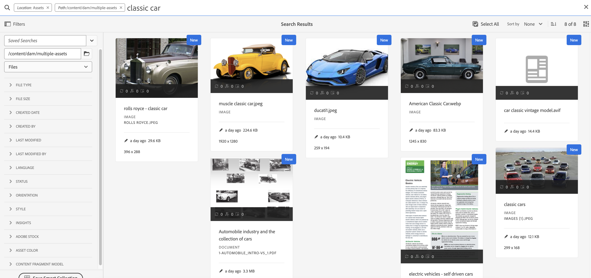
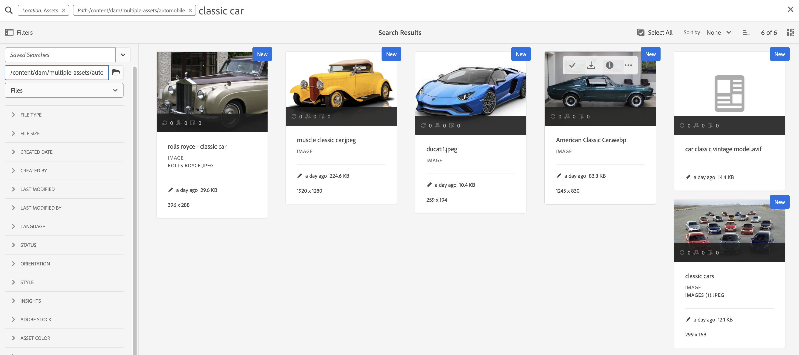
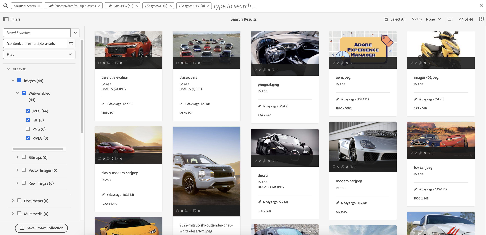

# AEM Assets Search - metodtips

[!DNL Adobe Experience Manager Assets] har robusta metoder för resurssökning som hjälper dig att få högre innehållshastighet. Ibland kan det vara besvärligt och tidskrävande att hitta rätt mediefil. Därför kan du söka efter resurser i [!DNL Adobe Experience Manager Assets] är en central del i användningen av ett digitalt resurshanteringssystem - vare sig det är till för kreativa användare eller företagsanvändare och marknadsförare, eller för administration av DAM-administratörer.

Det här hjälpdokumentet innehåller AEM bästa praxis för sökning med hjälp av olika scenarier för att hjälpa AEM att utföra grundläggande till avancerad sökning.

## Åtkomst till Experience Manager Search {#access-experience-manager-search}

Här följer några grundläggande steg som du kan utföra i Experience Manager innan du börjar söka:

* I **Administratörsvy**, går till Resurser > Filer i Experience Manager och klickar på sökikonen i det övre fältet. Du kan också använda ett snedstreck (/) för att öppna Omni Search-fältet.
I **Resursvy**, visas sökfältet högst upp och du kommer åt det direkt.
* `Location:Assets` och `Path:/content/dam` är förmarkerade för att begränsa sökningen till din Experience Manager Assets-databas. Om du navigerar till en annan mapp `Path:/content/dam/<folder name>` visas i Omni Search-fältet för att begränsa sökningen till den aktuella mappen.

## Grundläggande sökning {#basic-search}

**Scenario 1: Utför en grundläggande sökning med en `classic car` som söknyckelord.**

Nyckelordssökningen är inte skiftlägeskänslig och är en fulltextsökning över metadatafälten som ingår i resursen *fulltextsökning* index (konfigurerbart i indexdefinitionen). Om mer än ett nyckelord används, **AND är standardoperator mellan nyckelorden, och anser därför att en sökning efter&quot;klassisk bil&quot; är&quot;klassisk AND car&quot;**.

Sökresultaten som matchar alla söktermer i metadatafält visas först, följt av sökresultaten som matchar någon av söktermerna i de smarta taggarna. Den ungefärliga visningsordningen för sökresultat är:

1. Matchar med `Classic Car` i de olika metadatafälten.
2. Matchar med `Classic Car` i smarta taggar.
3. Matchar med `Classic` eller `Car` i smarta taggar.

Ange `classic car` som söknyckelord och klicka på Sök. Du kan visa sökförslagen i en nedrullningsbar lista medan du skriver nyckelordet. Sökförslagen baseras på innehållet i sökindexet i din Experience Manager-distribution. Om du inte kan visa rätt resurser på den nedrullningsbara menyn kan du visa resultatlistan genom att trycka på Retur. Resultaten sorteras efter relevans, med början från närmaste träffar.

<!---->

Du kan göra sökningen mer specifik genom att lägga till nyckelordet för sökning inom dubbla citattecken (&quot; &quot;). Den här sökningen innehåller bara resurser som innehåller de angivna villkoren tillsammans. Sökvillkoren ser ut som - `"classic car"`. Därför resulterar sökresultaten med båda termerna `classic` och `car` visas.

<!---->

Om du arbetar i **[!UICONTROL Assets view]** också.

>[!VIDEO](https://video.tv.adobe.com/v/3425489)

## Filer och mappar {#files-folders}

**Scenario 2: Sök efter alla filer med `classic car` nyckelord i `automobile` mapp.**

Filtret Filer och mappar hjälper dig att begränsa sökningen. Använd alternativen Filer, Mappar eller Filer och Mappar i listrutan beroende på dina behov. Alternativet att välja mellan Filer, Mappar eller Filer och mappar finns i **[!UICONTROL Admin view]** endast. I **[!UICONTROL Assets view]**, gå till [!UICONTROL Path] och bläddra i mappen där du vill göra en sökning.

* Använd **[!UICONTROL Files]** när du behöver söka efter filer på en viss sökväg i databasen. Du behöver inte söka efter mappar i den definierade sökvägen.
* Använd **[!UICONTROL Folders]** när du behöver begränsa sökningen till mappar med en viss sökväg.
* Använd **[!UICONTROL Files and Folders]** om du behöver söka igenom alla resurser som finns på den angivna sökvägen i databasen.

Så här uppnår du detta scenario:

1. Ange `classic car` som söknyckelord och klicka på Sök.
2. Klicka på Filter och ange mappsökvägen för `automobile` mapp. Till exempel: `/content/dam/multiple-assets/automobile`
Markera mappen i sökvägen och navigera till den önskade mappen om du vill söka i den specifika mappen.
3. Välj Filer i listrutan om du vill visa alla filer med nyckelordet `classic car`.

<!---->

>[!VIDEO](https://video.tv.adobe.com/v/3425487)

## Operatorer {#operators}

**Scenario 3: Sök efter `Classic Car` eller `Car` nyckelord som använder olika operatorkombinationer för att begränsa sökningen.**

Så här kör du ovanstående scenario i **[!UICONTROL Admin view]** kan du använda en kombination av olika operatorer för att förbättra sökupplevelsen. Operatorer som stöds är:

### AND-operator {#and-operator}

AND-operatorn är standardoperatorn mellan två nyckelord i Omni Search. När du skriver till exempel `classic car` i sökfältet, resultatet med `classic` och `car` nyckelord visas som standard i sökresultaten.

### OR-operator {#or-operator}

När du vill vara specifik med sökresultaten och vill ha ett alternativ i sökresultaten kan du använda operatorn OR. Till exempel `classic OR car` nyckelordet innehåller sökresultat med något av nyckelorden i deras metadata.

### NOT, operator {#not-operator}

När du vill hämta resultat utan vissa nyckelord kan du använda operatorn NOT. Operatorn NOT använder bindestreck (-) för att styra AEM söka efter det som ska uteslutas från sökresultatet. Till exempel `car - classic` sökfråga som anger metadata som innehåller `car` men exkluderar `classic`.

På samma sätt kan du söka efter alla bilar men inte jeep. Frågan ser ut så här: `car - jeep`. Här visas alla resurser med metadata `car` men exkluderar resurser med metadata `jeep`.

**[!UICONTROL Assets view]** stöder inte användning av operatorer.

## Jokertecken {#wildcards}

Jokertecken används för att ersätta ett eller flera tecken i sökningen. Så här kör du ovanstående scenario i **[!UICONTROL Admin view]** kan du använda en kombination av olika jokertecken för att förbättra sökupplevelsen. Det finns två jokertecken som används för sökningen - frågetecken (?) och Asterisk (*). Frågeteckensymbolen används för att söka efter ett enda tecken, medan asterisksymbolen används för att söka efter flera tecken.

### Frågetecken (?) {#question-mark}

Frågeteckensymbolen kan användas som villkorsoperator för att underlätta sökningen i Experience Manager.

* `car?` frågan matchar ordet med ett tecken efter bilen. Exempel: kundvagn.
* `?car` frågan matchar ordet med ett tecken före car. Till exempel ärr.
* `car????` frågan matchar ordet med fyra tecken efter car. Till exempel tvättas.

### Asterisk (*) {#asterisk}

Asterisk är en jokeroperator som används för att bredda sökningen genom att skriva färre tecken. När du känner till de inledande tecknen i resursen som du söker efter, men inte känner till resten, kan du använda asteriskoperatorn i sökningen. Till exempel `*car` returnerar alla resurser med postfix-bil som finns i deras metadata. Resultatet kan vara klassisk bil, sportbil, klassisk bil och sportbil osv. Nedan följer några exempel på hur du använder asteriskoperatorn på olika sätt:

* `*car*` returnerar alla möjliga kombinationer.
* `car*` returnerar tillgångar med tvätt, bärare, transport osv.
* `*car` returnerar resurser med modern bil, sportbil och så vidare.

>[!VIDEO](https://video.tv.adobe.com/v/3425488)

**[!UICONTROL Assets view]** stöder inte användning av jokertecken.

## Filter {#filters}

I Adobe Experience Manager finns olika sökfilter som du kan använda för att förfina och segmentera sökningen med hjälp av en fråga med omfång. När du är osäker på titeln eller metabeskrivningen för en resurs kan du använda olika sökfilter för att göra sökningen mer relevant. Du kan använda sökfilter med eller utan att skriva ett nyckelord. Så här öppnar du filterpanelen i **[!UICONTROL Admin view]** klickar du på **GlobalNav** ikon och markera **[!UICONTROL Filters]**. För att öppna filterpanelen i **[!UICONTROL Assets view]**, klicka [!UICONTROL Filters] bredvid sökfältet.

Du kan markera ett eller flera filter för att begränsa sökningen i Adobe Experience Manager.
<!--The following filters are available out of the box for all the users of Experience Manager:

* File Type Search Filters  
* File Size Search Filters 
* Date of Creation 
* Created by 
* Last Modified date 
* Last Modified by 
* Search by Language 
* Search by Status 
* Search based on Orientation 
* Search by Style 
* Search based on insights 
* Search by Adobe Stock 
* Color specific Asset search 
* Content fragment model 
 -->

<!--**Scenario 5: Search for an Asset named 'classic car' in Black color which has either meta description or a similar asset in Japanese language.**  
 
To perform a search on such a requirement, type 'classic car' in the search bar.  Navigate to the filters panel and expand the language search filter drop-down. Type "ja-jp", which represents the Japanese language. Expand the 'Asset Color' filter and select black color or add the hexadecimal code for the black color (#000000).

-->

**Scenario 4: Sök efter opublicerade PDF-dokument med `classic car` nyckelord i den.**

Utför följande steg i **[!UICONTROL Admin view]**:

1. Typ `classic car` i sökfältet.
1. Gå till Filter. Under [!UICONTROL File Type], expandera [!UICONTROL Documents], utöka ytterligare [!UICONTROL Word Processing].
1. Välj [!UICONTROL PDF].
1. Gå till [!UICONTROL Status] > [!UICONTROL Publish] > [!UICONTROL Unpublished].

<!---->

Utför följande steg i **[!UICONTROL Assets view]**:

1. Typ `classic car` i sökfältet.
1. Gå till Filter. Under [!UICONTROL MIME Type], markera [!UICONTROL PDF].
1. Gå till [!UICONTROL Asset Status], markera [!UICONTROL All] för att inkludera alla publicerade och opublicerade resurser.

**Scenario 5: Sök efter alla bilder utom PNG**

När du är osäker på titeln eller metabeskrivningen för en resurs kan du använda olika sökfilter för att göra sökningen mer relevant. Om du till exempel vill söka efter resurser i **[!UICONTROL Admin view]** följer du stegen nedan:

1. Gå till sökfilter.
1. Gå till Filter. Under [!UICONTROL File Type], expandera [!UICONTROL Images] och markera [!UICONTROL Web enabled]
1. Avmarkera PNG.

<!---->

Så här söker du efter resurser med hjälp av det nämnda scenariot i **[!UICONTROL Assets view]** följer du stegen nedan:

1. Gå till sökfilter.
1. Gå till Filter. Under [!UICONTROL MIME Type]markerar du alla angivna MIME-typer, men avmarkerar PNG.

>[!VIDEO](https://video.tv.adobe.com/v/3425486)

## Avancerad sökning {#advanced-search}

Med AEM sökning kan du enklare skapa komplexa sökfrågor. Här följer de olika exemplen som hjälper dig att skapa komplexa sökfrågor:

**Scenario 6: Sök efter alla dokument i Experience Manager-databasen med `classic car` i sina metadata. Dokumentets innehåll måste innehålla `classic car` nyckelord i den.**

Med Adobe Experience Manager kan du lägga till flera villkor i sökningen. Du kan använda en kombination av nyckelord, operatorer och filter för att begränsa sökresultaten.

Så här söker du efter scenario 6:

1. Skriv `classic car` i sökfältet.
2. Navigera till filterpanelen och välj Dokument under Filtyp.
3. Förfina sökningen med jokertecknet asterisk. Typ `"classic car"` om du vill söka efter alla resurser som innehåller `classic car` nyckelord.

<!---->

Scenario 6 kan inte köras i **[!UICONTROL Assets view]** eftersom det inte stöder användningen av jokertecken.

**Scenario 7: Sök efter alla dokument i databasen Experience Manager där dokumentinnehållet måste innehålla `car` exkludera `classic`. Samma villkor gäller för metadata för en resurs.**

Så här söker du efter scenario 7:

Skriv `car - classic` i sökfältet. Navigera till filterpanelen och välj Dokument under Filtyp. Sökordningen baseras på följande: Prioritet 1: Metadataprioritet 2: Smarta taggar

<!---->

Scenario 7 kan inte köras i **[!UICONTROL Assets view]** eftersom det inte stöder användningen av jokertecken.

<!--
**Scenario 9: Search for all images except PNG**

When you are unsure about the title or meta description of an asset, you can use various search filters to make your search more relevant. Follow the steps below:

1. Go to search filters. 
1. Under [!UICONTROL File Type], expand [!UICONTROL Images] and select [!UICONTROL Web enabled]
1. Deselect PNG.

**Method 1:** Go to search bar and type `images - PNG`. All the images appear excluding PNG.

**Method 2:** Go to search filters. Under [!UICONTROL File Type], expand [!UICONTROL Images] > select [!UICONTROL Web enabled] > deselect PNG.

-->

**Scenario 8: Sök efter metadatataggar med metadatajeep**

Du kan hämta specifika villkor med olika sökfilter. Tagg är ett nyckelord som tilldelas till en resurs för att göra den identifierbar bland ett stort antal resurser. I det här scenariot söker du efter resurser med *jeep* -taggar i den. Skriv `tags:jeep` i sökfältet. Endast resurser som uppfyller det här villkoret visas i sökresultatet.

<!---->

Om du arbetar i **[!UICONTROL Assets view]** också.

>[!VIDEO](https://video.tv.adobe.com/v/3425490)

**Scenario 9: Hitta liknande matchningar för röd färgbil**

När du gör en sökning på AEM kan du filtrera resultatet genom att visa resurser som liknar de valda. Du kan använda **Sök liknande** om du vill begränsa sökningen till exakt eller liknande matchning av den sökta resursen. Det gör det lättare att hitta resurser som har liknande smarta taggar som den valda resursen. Om du till exempel vill söka efter lika resurser utför du följande steg:

1. Sök efter resursen efter dina behov.
1. Hovra över resursen > klicka på ellips > välj [!UICONTROL Find Similar].
eller välj resursen > navigera till ellipsen längst upp till höger > välj [!UICONTROL Find Similar].

   

1. Lägg märke till sökfältet. Miniatyrbilden för den valda resursen visas i sökfältet som anger ditt sökkrav. Resultatet blir att resurser med liknande smarta taggar returneras.

Utför följande steg i **[!UICONTROL Assets view]**:

1. Sök efter resursen efter dina behov.
1. Välj bilden > navigera till [!UICONTROL Find Similar Image] i navigeringsfältet högst upp.
Det tar dig till samlingen med resurser med liknande färg och metadata.

## Anpassade sökfaktorer {#custom-search-facets}

Med sökfaktorer i Adobe Experience Manager kan du söka efter resurser på flera olika sätt i stället för i en enda, förbestämd eller taxonisk ordning. Du kan anpassa sökfaktorer och lägga till predikat utifrån dina behov. Läs [Sök efter ansikten](https://experienceleague.adobe.com/docs/experience-manager-cloud-service/content/assets/admin/search-facets.html?lang=en#) för steg-för-steg-guiden om hur du lägger till ett anpassat predikat.

<!--**Scenario 10: Search assets based on Sku ID**
to be added later
-->

**Scenario 10: Sök efter specifika resurser baserat på deras senaste ändringsdatum eller förfallodatum**

Med datumbegränsningar kan du begränsa din anpassade sökning till en viss punkt, till exempel med hjälp av sökfiltren för tidsperioden. Om du vill söka efter ovanstående krav skriver du `classic car` i sökfältet. Välj datumintervall i dialogrutan [!UICONTROL Created Date] och [!UICONTROL Last Modified] datumfilter.

Om du arbetar i [!UICONTROL Assets view] också.

## Öka nyckelordens relevans {#boosting-keywords}

Du kan förbättra nyckelordens relevans för vissa resurser för att öka sökningen baserat på nyckelorden. Det innebär att de bilder som du befordrar särskilda nyckelord för visas högst upp i sökresultatet när du söker baserat på dessa nyckelord.

1. Öppna egenskapssidan för resursen i Assets-gränssnittet. Klicka [!UICONTROL Advanced] och klicka [!UICONTROL Add] under [!UICONTROL Elevate for search keywords].
2. Ange ett nyckelord som du vill öka sökningen efter bilden för i rutan Sök efter upphöjd och klicka sedan på [!UICONTROL Add]. Du kan ange flera nyckelord på samma sätt.
3. Klicka på [!UICONTROL Save & Close]. Den resurs som du befordrade för det här nyckelordet visas bland de översta sökresultaten.

## Betydelbara saker när du gör en sökning i Experience Manager {#notable-things}

* Ange metadatainformation om resursen för att förbereda resursen så att den kan sökas med Omni Search-algoritmen. Se till att metadatainformationen för resursen uppdateras.
* Använd dubbla citattecken (&quot; &quot;) för att göra sökningen exakt och exakt.
* Kontrollera sökvägen som du letar efter. Välj lämplig mapp, fil eller fil och mapp för att köra sökfrågan på rätt plats.
* Du kan kontrollera de filter som du använder i sökfältet för Omni Search.
* Om du inte får några resultat ska du kontrollera sökvägen du letar efter. Kontrollera även den mapp som du utför sökningen från. Om du till exempel gör en sökning i mappen &quot;Mobilt&quot; men nyckelordet som du använder är relaterat till &quot;Kläder&quot;, är sökresultaten inte lämpliga.
* Checka in om du har lagt till tomt utrymme före nyckelordet som du söker efter.
* Om du använder en blandning av nyckelord, operatorer och filter blir sökningen enklare och jämnare.

<!--
* Use stemming search approach while searching for the asset. It means using an exact keyword that you are looking for.
* Specify Smart tags to the asset properties to boost the ranking of the search results.
The newly added assets are not indexed.
-->

## Skillnader mellan [!UICONTROL Admin view] och [!UICONTROL Assets view] Sök {#differences-asset-and-admin-view}

<table>
    <tr>
        <th> Parametrar </th>
        <th> Administratörsvy </th>
        <th> Resursvy </th>
    </tr>
    <tr>
        <td> Anpassade aspekter </td>
        <td> Du kan lägga till <a href="https://experienceleague.adobe.com/docs/experience-manager-cloud-service/content/assets/admin/search-facets.html?lang=en">anpassade sökfaktorer efter behov.</td>
        <td> De anpassade faktorerna stöds delvis i resursvyn. De aspekter som stöds är:
            <ul>
            <li> Förutsedda taggar
            <li> Namn
            <li> Förutsedd taggsäkerhet
            <li> Resursstorlek
            <li> Titel
            </ul>
        </td>
    </tr>
    <tr>
        <td> Operatorer </td>
        <td> Stöder AND, OR och NOT </td>
        <td> Stöds inte </td>
    </tr>
    <tr>
        <td> Jokertecken </td>
        <td> Stöder frågetecken (?) och asterisk (*).</td>
        <td> Stöds inte </td>
    </tr>
    <tr>
        <td> Öka sökresultat </td>
        <td> Stöds </td>
        <td> Stöds inte </td>
    </tr>
     <tr>
        <td> Rensa alla filter samtidigt </td>
        <td> Stöds inte </td>
        <td> Stöds</td>
    </tr>
     <tr>
        <td> Filer/mappar/Filer och mappar </td>
        <td> Stöds </td>
        <td> Det finns ett alternativ för att välja en mapp under Filtyp </td>
    </tr>
     <tr>
        <td> Resursstatus </td>
        <td> 
            Följande alternativ stöds:
            <ul>
            <li> Publicera
            <li> Publiceringsdatum
            <li> Senast publicerad av
            <li> Godkännande 
            <li> Utcheckning
            <li> Förfaller
            <li> Dynamic Media
            </ul>
        </td>
        <td>
        Följande alternativ stöds:
            <ul>
            <li> Alla
            <li> Godkänd
            <li> Avvisad
            <li> Ingen status
            </ul> 
        </td>
    </tr>
     <tr>
        <td> Filtyp </td>
        <td>
        Följande alternativ stöds:
            <ul>
            <li> Bilder
            <li> Dokument
            <li> Multimedia
            <li> Arkiv 
            </ul>
            Dessa har ytterligare hierarkiska alternativ.
        </td>
        <td>
        Följande alternativ stöds:
            <ul>
            <li> Bilder
            <li> Dokument
            <li> Video
            <li> Mapp 
            </ul> 
        Fler alternativ visas under MIME-typ.
        </td>
    </tr>
     <tr>
        <td> Filstorlek </td>
        <td>
        Följande alternativ stöds:
            <ul>
            <li> Från - Till
            <li> Storlek (byte, kB, MB, GB)
            </ul> 
        </td>
        <td> Stöds inte </td>
    </tr>
     <tr>
        <td> Andra filter </td>
        <td>
            <ul>
            <li> Språk
            <li> Status
            <li> Orientering
            <li> Stil 
            <li> Insikter
            <li> Stock
            <li> Resursfärg
            <li> Innehållsfragmentmodell
            </ul> 
        </td>
        <td> Stöds inte </td>
    </tr>
</table>

>[!MORELIKETHIS]
>
>* [Söka efter resurser](https://experienceleague.adobe.com/docs/experience-manager-cloud-service/content/assets/manage/search-assets.html?lang=en)
>* [Söka efter fasetter](https://experienceleague.adobe.com/docs/experience-manager-cloud-service/content/assets/admin/search-facets.html?lang=en)
