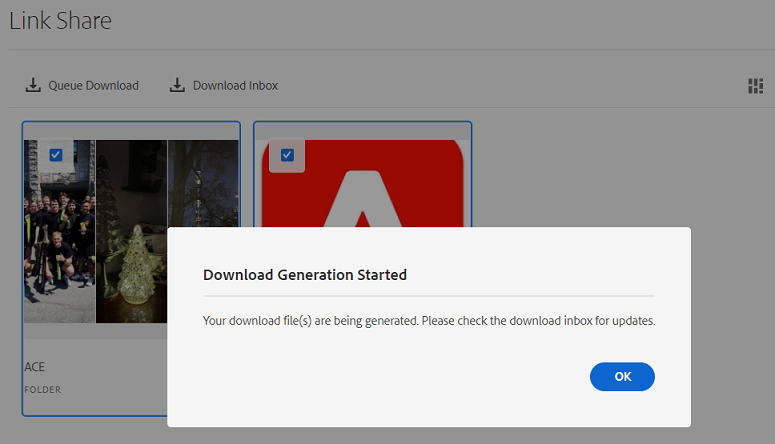

# Dela och distribuera resurser som hanteras i [!DNL Experience Manager] {#share-assets-from-aem}

| Version | Artikellänk |
| -------- | ---------------------------- |
| AEM 6.5 | [Klicka här](https://experienceleague.adobe.com/docs/experience-manager-65/assets/administer/link-sharing.html?lang=en) |
| AEM as a Cloud Service | Den här artikeln |

[!DNL Adobe Experience Manager Assets] Med kan du dela resurser, mappar och samlingar med medlemmar i din organisation och externa enheter, inklusive partners och leverantörer. Använd följande metoder för att dela resurser från [!DNL Experience Manager Assets] som [!DNL Cloud Service]:

* [Dela som länk](#sharelink).
* [Hämta resurser](/help/assets/download-assets-from-aem.md) och dela separat.
* Dela med [[!DNL Experience Manager] datorprogram](https://experienceleague.adobe.com/docs/experience-manager-desktop-app/using/introduction.html).
* Dela med [[!DNL Adobe Asset Link]](https://www.adobe.com/creativecloud/business/enterprise/adobe-asset-link.html).
* Dela med [[!DNL Brand Portal]](https://experienceleague.adobe.com/docs/experience-manager-brand-portal/using/introduction/brand-portal.html).

## Dela resurser som en länk {#sharelink}

Att dela resurser via en länk är ett bekvämt sätt att göra resurserna tillgängliga för externa parter, marknadsförare och andra [!DNL Experience Manager] -användare. Med den här funktionen kan anonyma användare få åtkomst till och hämta de resurser som delas med dem. När du hämtar resurser från en delad länk, [!DNL Experience Manager Assets] använder en asynkron tjänst som ger snabbare och oavbruten nedladdning. De resurser som ska laddas ned står i kö i bakgrunden i ZIP-arkiv med hanterbar filstorlek. Vid stora nedladdningar paketeras nedladdningen i flera filer på 100 GB per filstorlek.

<!--
Users with administrator privileges or with read permissions at `/var/dam/share` location are able to view the links shared with them. 
-->

>[!NOTE]
>
>* Du behöver behörigheten Redigera åtkomstkontrollista för mappen eller resursen som du vill dela som en länk.
>* [Aktivera utgående e-post](/help/implementing/developing/introduction/development-guidelines.md#sending-email) innan du delar en länk med användarna.

Det finns två sätt att dela resurserna med hjälp av länkdelningsfunktionen:

1. Skapa en delad länk, [kopiera och dela resurslänken](#copy-and-share-assets-link) med andra användare. Länkens standardförfallotid är en dag. Du kan inte ändra förfallotiden när du delar den kopierade länken med andra användare.

1. Generera en delad länk och [dela resurslänken via e-post](#share-assets-link-through-email). I det här fallet kan du ändra standardvärdena, t.ex. utgångsdatum och -tid, och tillåta hämtning av originalresurserna och dess återgivningar. Du kan skicka e-post till flera användare genom att lägga till deras e-postadresser.

### Kopiera och dela resurslänken{#copy-and-share-asset-link}

Så här delar du resurser som en offentlig URL:

1. Logga in på [!DNL Experience Manager Assets] och navigera till **[!UICONTROL Files]**.
1. Markera de resurser eller den mapp som innehåller resurser. Klicka på **[!UICONTROL Share Link]** i verktygsfältet.
1. The **[!UICONTROL Link Sharing]** som innehåller en autogenererad resurslänk i dialogrutan **[!UICONTROL Share Link]** fält.
1. Kopiera resurslänken och dela den med användarna.

### Dela resurslänk via e-postmeddelande {#share-assets-link-through-email}

Så här delar du resurser via e-post:

1. Markera de resurser eller den mapp som innehåller resurser. Klicka på **[!UICONTROL Share Link]** i verktygsfältet.
1. The **[!UICONTROL Link Sharing]** som innehåller en autogenererad resurslänk i dialogrutan **[!UICONTROL Share Link]** fält.

   * I rutan E-postadress skriver du e-post-ID för den användare som du vill dela länken med. Du kan dela länken med flera användare. Om användaren är medlem i din organisation väljer du användarens e-post-ID bland förslagen som visas i listrutan. Om användaren är extern skriver du det fullständiga e-post-ID:t och trycker på **[!UICONTROL Enter]**; e-post-ID:t läggs till i listan över användare.

   * I **[!UICONTROL Subject]** anger du ett ämne för att ange syftet med de delade resurserna.
   * I **[!UICONTROL Message]** skriver du ett meddelande om det behövs.
   * I **[!UICONTROL Expiration]** använder du datumväljaren för att ange ett förfallodatum och en förfallotid för länken.
   * Aktivera **[!UICONTROL Allow download of original file]** för att mottagarna ska kunna hämta den ursprungliga återgivningen.

1. Klicka på **[!UICONTROL Share]**. Ett meddelande bekräftar att länken delas med användarna. Användarna får ett e-postmeddelande med den delade länken.

### Hämta resurser via resurslänken

Alla användare som har tillgång till länken för delade resurser kan hämta de resurser som paketerats i en zip-mapp. Hämtningsprocessen är densamma oavsett om en användare använder länken för det kopierade objektet eller resurslänken som delas via e-postmeddelandet.

* Klicka på resurslänken eller klistra in URL-adressen i webbläsaren. The [!UICONTROL Link Share] öppnas där du kan växla till [!UICONTROL Card View] eller [!UICONTROL List View].

* I [!UICONTROL Card View]kan du föra musen över den delade resursen eller delade resursmappen för att antingen välja resurser eller placera dem i kö för hämtning.

* Som standard visas **[!UICONTROL Download Inbox]** alternativ. Den visar en lista över alla delade resurser eller mappar som är köade för hämtning tillsammans med deras status.

* När du väljer resurser eller mapp visas en **[!UICONTROL Queue Download]** visas på skärmen. Klicka på **[!UICONTROL Queue Download]** för att starta nedladdningsprocessen.

   

* Klicka på **[!UICONTROL Download Inbox]** om du vill visa status för nedladdningen. För stora nedladdningar klickar du på **[!UICONTROL Refresh]** för att uppdatera statusen.

   

* När bearbetningen är klar klickar du på **[!UICONTROL Download]** för att ladda ned zip-filen.

<!--
You can also copy the auto-generated link and share it with the users. The default expiration time for the link is one day.
-->

>[!NOTE]
>
>Om en delad resurs flyttas till en annan plats slutar länken att fungera. Återskapa länken och dela den på nytt med användarna.

<!--
## Share assets as a link {#sharelink}

To generate the URL for assets you want to share with users, use the Link Sharing dialog. Users with administrator privileges or with read permissions at `/var/dam/share` location are able to view the links shared with them. Sharing assets through a link is a convenient way of making resources available to external parties without them having to first log in to Experience Manager Assets.

>[!NOTE]
>
>* You need Edit ACL permission on the folder or the asset that you want to share as a link.
>* Before you share a link with users, ensure that Day CQ Mail Service is configured. Otherwise, an error occurs.

1. In the Assets user interface, select the asset to share as a link.
1. From the toolbar, click/tap the **[!UICONTROL Share Link]**.

   An asset link is auto-created in the **[!UICONTROL Share Link]** field. Copy this link and share it with the users. The default expiration time for the link is one day.

   Alternatively, proceed to perform steps 3-7 of this procedure to add email recipients, configure the expiration time for the link, and send it from the dialog.

   >[!NOTE]
   >
   >If a shared asset is moved to a different location, its link stops working. Re-create the link and re-share with the users.

1. From the web console, open the **[!UICONTROL Day CQ Link Externalizer]** configuration and modify the following properties in the **[!UICONTROL Domains]** field with the values mentioned against each:

    * local
    * author
    * publish

   For the local and author properties, provide the URL for the local and author instance respectively. Both local and author properties have the same value if you run a single Experience Manager author instance. For publish, provide the URL for the publish instance.

1. In the email address box of the **[!UICONTROL Link Sharing]** dialog, type the email ID of the user you want to share the link with. You can also share the link with multiple users.

   If the user is a member of your organization, select the user's email ID from the suggested email IDs that appear in the list below the typing area. For an external user, type the complete email ID and then select it from the list.

   To enable emails to be sent out to users, configure the SMTP server details in [Day CQ Mail Service](/help/assets/configure-asset-sharing.md#configmailservice).

   >[!NOTE]
   >
   >If you enter an email ID of a user that is not a member of your organization, the words "External User" are prefixed with the email ID of the user.

1. In the **[!UICONTROL Subject]** box, enter a subject for the asset you want to share.
1. In the **[!UICONTROL Message]** box, enter an optional message.
1. In the **[!UICONTROL Expiration]** field, specify an expiration date and time for the link using the date picker. By default, the expiration date is set for a week from the date you share the link.
1. To let users download the original image along with the renditions, select **[!UICONTROL Allow download of original file]**.

   >[!NOTE]
   >
   >By default, users can only download the renditions of the asset that you share as a link.

1. Click **[!UICONTROL Share]**. A message confirms that the link is shared with the users through an email.
1. To view the shared asset, click/tap the link in the email that is sent to the user. The shared asset is displayed in the **[!UICONTROL Adobe Marketing Cloud]** page.

   To toggle to the list view, click/tap the layout icon in the toolbar.

1. To generate a preview of the asset, click/tap the shared asset. To close the preview and return to the **[!UICONTROL Marketing Cloud]** page, click/tap **[!UICONTROL Back]** in the toolbar. If you have shared a folder, click/tap **[!UICONTROL Parent Folder]** to return to the parent folder.

   >[!NOTE]
   >
   >Experience Manager supports generating the preview of assets of these MIME types: JPG, PNG, GIF, BMP, INDD, PDF, and PPT. You can only download the assets of the other MIME types.

1. To download the shared asset, click/tap **[!UICONTROL Select]** from the toolbar, click/tap the asset, and then click/tap **[!UICONTROL Download]** from the toolbar.
1. To view the assets you shared as links, go to the Assets user interface and click/tap the GlobalNav icon. Choose **[!UICONTROL Navigation]** from the list to display the Navigation pane.
1. From the Navigation pane, choose **[!UICONTROL Shared Links]** to display a list of shared assets.
1. To un-share an asset, select it and tap/click **[!UICONTROL Unshare]** from the toolbar.

A message confirms that you unshared the asset. In addition, the entry for the asset is removed from the list.
-->

## Hämta resurser och dela separat {#download-and-share-assets}

Användarna kan hämta de nödvändiga resurserna och dela dem utanför [!DNL Experience Manager]. Mer information finns i [söka efter resurser](/help/assets/search-assets.md), [hur du hämtar resurser](/help/assets/download-assets-from-aem.md)och [ladda ned samlingar](manage-collections.md#download-a-collection)

## Dela material med kreatörer {#share-with-creatives}

Marknadsförare och andra användare kan enkelt dela godkänt material med sina kreatörer genom att

* **Experience Manager**: Appen fungerar i Windows och Mac. Se [översikt över datorprogram](https://experienceleague.adobe.com/docs/experience-manager-desktop-app/using/introduction.html). Om du vill veta hur en auktoriserad skrivbordsanvändare enkelt kan komma åt de delade resurserna kan du gå till [bläddra bland, söka efter och förhandsgranska resurser](https://experienceleague.adobe.com/docs/experience-manager-desktop-app/using/using.html#browse-search-preview-assets). Skrivbordsanvändare kan skapa resurser och dela dem med sina motsvarigheter som är Experience Manager, till exempel genom att överföra nya bilder. Se [överföra resurser med datorprogrammet](https://experienceleague.adobe.com/docs/experience-manager-desktop-app/using/using.html#upload-and-add-new-assets-to-aem).

* **Adobe Asset Link**: Kreatörer kan söka efter och använda resurser direkt inifrån [!DNL Adobe InDesign], [!DNL Adobe Illustrator]och [!DNL Adobe Photoshop].

## Konfigurera materialdelning {#configure-sharing}

De olika alternativen för att dela resurserna kräver specifik konfiguration och har särskilda krav.

### Konfigurera delning av resurslänkar {#asset-link-sharing}

<!-- TBD: Web Console is not there so how to configure Day CQ email service? Or is it not required now? -->

Använd dialogrutan Länkdelning för att generera URL:en för resurser som du vill dela med användare. Användare med administratörsbehörighet eller läsbehörighet på `/var/dam/share` platsen kan visa de länkar som delas med dem. Att dela resurser via en länk är ett bekvämt sätt att göra resurser tillgängliga för externa parter utan att de först behöver logga in på [!DNL Assets].

>[!NOTE]
>
>Om du vill dela länkar från författarinstansen till externa entiteter måste du se till att du bara visar följande URL:er för `GET` förfrågningar. Blockera andra URL:er för att säkerställa att din författarinstans är säker.
>
>* `[aem_server]:[port]/linkshare.html`
>* `[aem_server]:[port]/linksharepreview.html`
>* `[aem_server]:[port]/linkexpired.html`

<!--
## Configure Day CQ mail service {#configmailservice}

Before you can share assets as links, configure the email service.

1. Click or tap the Experience Manager logo, and then navigate to **[!UICONTROL Tools]** &gt; **[!UICONTROL Operations]** &gt; **[!UICONTROL Web Console]**.
1. From the list of services, locate **[!UICONTROL Day CQ Mail Service]**.
1. Click the **[!UICONTROL Edit]** icon beside the service, and configure the following parameters for **Day CQ Mail Service]** with the details mentioned against their names:

    * SMTP server host name: email server host name
    * SMTP server port: email server port
    * SMTP user: email server user name
    * SMTP password: email server password

1. Click/tap **[!UICONTROL Save]**.
-->

<!-- TBD: Commenting as Web Console is not available. Document the appropriate OSGi config method if available in CS.
### Configure maximum data size {#maxdatasize}

When you download assets from the link shared using the Link Sharing feature, Experience Manager compresses the asset hierarchy from the repository and then returns the asset in a ZIP file. However, in the absence of limits to the amount of data that can be compressed in a ZIP file, huge amounts of data is subjected to compression, which causes out of memory errors in JVM. To secure the system from a potential denial of service attack due to this situation, you can configure the maximum size of the downloaded files. If uncompressed size of the asset exceeds the configured value, asset download requests are rejected. The default value is 100 MB.

1. Click/Tap the Experience Manager logo and then go to **[!UICONTROL Tools]** &gt; **[!UICONTROL Operations]** &gt; **[!UICONTROL Web Console]**.
1. From the web console, locate the **[!UICONTROL Day CQ DAM Adhoc Asset Share Proxy Servlet]** configuration.
1. Open the configuration in edit mode, and modify the value of the **[!UICONTROL Max Content Size (uncompressed)]** parameter.
1. Save the changes.
-->

<!--
Add content or link about how to configure sharing via BP, DA, AAL, etc.
-->

### Aktivera skrivbordsåtgärder som ska användas med skrivbordsappen {#desktop-actions}

Från [!DNL Assets] -användargränssnittet i en webbläsare kan du utforska resursplatserna eller checka ut och öppna resursen för redigering i datorprogrammet. De här alternativen kallas skrivbordsåtgärder och för att aktivera dem går du till [aktivera skrivbordsåtgärder i [!DNL Assets] webbgränssnitt](https://experienceleague.adobe.com/docs/experience-manager-desktop-app/using/using.html#desktopactions-v2).

### Konfigurationer som ska användas [!DNL Adobe Asset Link] {#configure-asset-link}

Adobe Asset Link effektiviserar samarbetet mellan kreatörer och marknadsförare när det gäller att skapa innehåll. Den ansluts [!DNL Adobe Experience Manager Assets] med [!DNL Creative Cloud] datorprogram [!DNL Adobe InDesign], [!DNL Adobe Photoshop]och [!DNL Adobe Illustrator]. The [!DNL Adobe Asset Link] ger kreatörerna tillgång till och kan ändra innehåll som lagras i [!DNL Assets] utan att lämna de kreativa program de är mest bekanta med.

Se [konfigurera [!DNL Assets] för att använda den med [!DNL Adobe Asset Link]](https://helpx.adobe.com/enterprise/using/configure-aem-assets-for-asset-link.html).

## Bästa praxis och felsökning {#bestpractices}

* Resursmappar eller samlingar som innehåller ett tomt utrymme i namnet kanske inte delas.
* Om användarna inte kan hämta de delade resurserna, bör du fråga Experience Manager-administratören om hämtningsgränserna. Standardvärdet är 100 MB.
* För att en användare ska kunna förhandsgranska en video som delas via länkdelning måste videon ha en statisk videoåtergivning tillgänglig på `/jcr:content/renditions` plats i videons nod i databasen. Förhandsgranskningen är inte beroende av om en [!DNL Dynamic Media] återgivning.
* När du hämtar en videoresurs via en länkresurs visas [!DNL Dynamic Media] renderingar ingår inte i det hämtade arkivet.

<!--
* If you cannot send email with links to shared assets or if the other users cannot receive your email, check with your Experience Manager administrator if the [email service](/help/assets/configure-asset-sharing.md#configmailservice) is configured or not. 
* If you cannot share assets using link sharing functionality, ensure that you have the appropriate permissions. See [share assets](#sharelink).
-->

<!-- TBD: Add content or link about how to share using Brand Portal when it is available on [!DNL Cloud Service].
-->

**Se även**

* [Översätt resurser](translate-assets.md)
* [HTTP API för Assets](mac-api-assets.md)
* [Resurser som stöds i filformat](file-format-support.md)
* [Söka efter resurser](search-assets.md)
* [Anslutna resurser](use-assets-across-connected-assets-instances.md)
* [Materialrapporter](asset-reports.md)
* [Metadata-scheman](metadata-schemas.md)
* [Hämta resurser](download-assets-from-aem.md)
* [Hantera metadata](manage-metadata.md)
* [Söka efter fasetter](search-facets.md)
* [Hantera samlingar](manage-collections.md)
* [Import av massmetadata](metadata-import-export.md)
