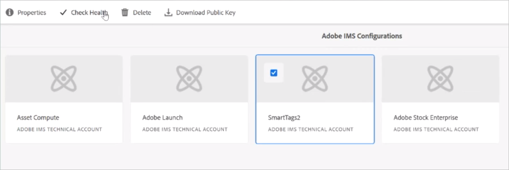

# Konfigurera Experience Manager för smart taggning av resurser {#configure-aem-for-smart-tagging}

Genom att tagga resurser med taxonomistyrd vokabulär kan du enkelt identifiera och hämta dem genom taggbaserade sökningar. Adobe tillhandahåller Smart Tags som använder algoritmer för artificiell intelligens och maskininlärning för att lära in bilder. Smart Tags använder ett AI-ramverk från [Adobe Sensei](https://www.adobe.com/sensei/experience-cloud-artificial-intelligence.html) för att träna bildigenkänningsalgoritmen i er taggstruktur och er affärstaxonomi.

Smart Tags-funktionen kan köpas som tillägg till [!DNL Experience Manager]. När du har köpt funktionen skickas ett e-postmeddelande till administratören för organisationen med en länk till Adobe Developer Console. Administratören använder länken för att integrera Smart Tags med [!DNL Experience Manager] via Adobe Developer Console.

<!-- TBD: 
1. Can a similar flowchart be created about how training works in CS? 
2. Is there a link to buy SCS or initiate a sales call.
3. Keystroke all steps and check all screenshots.
-->

>[!IMPORTANT]
>
>De nya [!DNL Experience Manager Assets] distributionerna är integrerade med [!DNL Adobe Developer Console] som standard. Det hjälper till att konfigurera smarta taggar snabbare. I befintliga distributioner följer administratörer de här stegen för att konfigurera den.

## Integrera med Adobe Developer Console {#aio-integration}

Innan du kan tagga bilderna med SCS måste du integrera [!DNL Adobe Experience Manager] med Smart Tags-tjänsten med Adobe Developer Console. I backend-funktionerna autentiserar [!DNL Experience Manager]-servern dina inloggningsuppgifter med Adobe Developer Console-gatewayen innan din begäran vidarebefordras till tjänsten.

* Skapa en konfiguration i [!DNL Experience Manager] för att generera en offentlig nyckel. [Hämta ett offentligt certifikat](#obtain-public-certificate) för OAuth-integrering.
* [Skapa en integrering i Adobe Developer Console](#create-aio-integration) och överför den genererade offentliga nyckeln.
* [Konfigurera Smart Tags](#configure-smart-content-service) i din [!DNL Experience Manager]-instans med API-nyckeln och andra autentiseringsuppgifter från Adobe Developer Console.
* [Testa konfigurationen](#validate-the-configuration).
* [Konfigurera om när certifikatet upphör att gälla](#certrenew).

### Förutsättningar för Adobe Developer Console-integrering {#prerequisite-for-aio-integration}

Innan du kan använda Smart Tags måste du ha/se till att/göra följande för att kunna integrera med Adobe Developer Console:

* Ett Adobe ID-konto som har administratörsbehörighet för organisationen.
* Smart Tags är aktiverat för din organisation.

### Hämta ett offentligt certifikat {#obtain-public-certificate}

Med ett offentligt certifikat kan du autentisera din profil på Adobe Developer Console. Du skapar ett certifikat i [!DNL Experience Manager].

1. I användargränssnittet för [!DNL Experience Manager] går du till **[!UICONTROL Tools]** > **[!UICONTROL Security]** > **[!UICONTROL Adobe IMS Configurations]**.

1. På sidan [!UICONTROL Adobe IMS Configurations] klickar du på **[!UICONTROL Create]**. På menyn **[!UICONTROL Cloud Solution]** väljer du **[!UICONTROL Smart Tags]**.

1. Välj **[!UICONTROL Create new certificate]**. Ange ett namn och klicka på **[!UICONTROL Create certificate]**. Klicka på **[!UICONTROL OK]**.

1. Klicka på **[!UICONTROL Download Public Key]**.

   

### Skapa en integrering {#create-aio-integration}

Om du vill använda Smart Tags skapar du en integrering i Adobe Developer Console för att generera API-nyckel, ID för tekniskt konto, organisations-ID och klienthemlighet.

1. Öppna [https://console.adobe.io](https://console.adobe.io/) i en webbläsare. Välj lämpligt konto och kontrollera att den associerade organisationsrollen är systemadministratör.
1. Skapa ett projekt med valfritt namn. Klicka på **[!UICONTROL Add API]**.
1. På sidan **[!UICONTROL Add an API]** markerar du **[!UICONTROL Experience Cloud]** och väljer **[!UICONTROL Smart Content]**. Klicka på **[!UICONTROL Next]**.
1. Välj **[!UICONTROL Upload your public key]**. Ange certifikatfilen som hämtats från [!DNL Experience Manager]. Ett meddelande [!UICONTROL Public key(s) uploaded successfully] visas. Klicka på **[!UICONTROL Next]**.
1. Sidan [!UICONTROL Create a new Service Account (JWT) credential] visar den offentliga nyckeln för det tjänstekonto som just konfigurerats. Klicka på **[!UICONTROL Next]**.
1. På sidan **[!UICONTROL Select product profiles]** markerar du **[!UICONTROL Smart Content Services]**. Klicka på **[!UICONTROL Save configured API]**. En sida visar mer information om konfigurationen. Håll den sidan öppen för att kopiera och lägga till dessa värden i Experience Manager när du konfigurerar Smart Tags i [!DNL Experience Manager].

   

### Konfigurera Smart Tags {#configure-smart-content-service}

Om du vill konfigurera integreringen använder du värdena för fälten Payload, Client Secret, Authorization Server och API Key från Adobe Developer Console-integreringen.

1. I användargränssnittet för [!DNL Experience Manager] går du till **[!UICONTROL Tools]** > **[!UICONTROL Security]** > **[!UICONTROL Adobe IMS Configurations]**.
1. Öppna sidan **[!UICONTROL Adobe IMS Technical Account Configuration]** och ange **[!UICONTROL Title]**.
1. I fältet **[!UICONTROL Authorization Server]** anger du URL till `https://ims-na1.adobelogin.com`.
1. I fältet **[!UICONTROL API Key]** anger du **[!UICONTROL Client ID]** från [!DNL Adobe Developer Console].
1. I fältet **[!UICONTROL Client Secret]** anger du **[!UICONTROL Client Secret]** från [!DNL Adobe Developer Console]. Klicka på alternativet **[!UICONTROL Retrieve Client Secret]** om du vill se det.
1. I [!DNL Adobe Developer Console] i ditt projekt klickar du på **[!UICONTROL Service Account (JWT)]** från den vänstra marginalen. Klicka på fliken **[!UICONTROL Generate JWT]**. Klicka på **[!UICONTROL Copy]** för att kopiera **[!UICONTROL JWT Payload]** som visas. Ange det här värdet i fältet **[!UICONTROL Payload]** i [!DNL Experience Manager]. Klicka på **[!UICONTROL Create]**.

### Validera konfigurationen {#validate-the-configuration}

När du har slutfört konfigurationen följer du dessa steg för att validera den.

1. I användargränssnittet för [!DNL Experience Manager] går du till **[!UICONTROL Tools]** > **[!UICONTROL Security]** > **[!UICONTROL Adobe IMS Configurations]**.

1. Välj konfigurationen för Smart Tags. Klicka på **[!UICONTROL Check Health]** i verktygsfältet. Klicka på **[!UICONTROL Check]**. En dialogruta med meddelandet [!UICONTROL Healthy configuration] bekräftar att konfigurationen fungerar.

### Konfigurera om när ett certifikat upphör att gälla {#certrenew}

När certifikatet upphör att gälla är det inte längre tillförlitligt. Följ de här stegen för att lägga till ett nytt certifikat. Du kan inte förnya ett certifikat som har upphört att gälla.

1. Logga in på [!DNL Experience Manager]-driftsättningen som administratör. Klicka på **[!UICONTROL Tools]** > **[!UICONTROL Security]** > **[!UICONTROL Users]**.

1. Leta reda på och klicka på **[!UICONTROL dam-update-service]**-användaren. Klicka på fliken **[!UICONTROL Keystore]**.
1. Ta bort den befintliga **[!UICONTROL similaritysearch]**-nyckelbehållaren med det certifikat som upphört att gälla. Klicka på **[!UICONTROL Save & Close]**.

   

   *Bild: Ta bort den befintliga`similaritysearch`-posten i nyckelbehållaren om du vill lägga till ett nytt säkerhetscertifikat.*

1. I användargränssnittet för [!DNL Experience Manager] går du till **[!UICONTROL Tools]** > **[!UICONTROL Security]** > **[!UICONTROL Adobe IMS Configurations]**. Öppna den tillgängliga konfigurationen för Smart Tags. Om du vill hämta ett offentligt certifikat klickar du på **[!UICONTROL Download Public Certificate]**.

1. Gå till [https://console.adobe.io](https://console.adobe.io) och navigera till den befintliga tjänsten i projektet. Överför det nya certifikatet och konfigurera det. Mer information om konfiguration finns i anvisningarna i [Integrering med Adobe Developer Console](#create-aio-integration).

## Aktivera smart taggning för nyligen överförda resurser (valfritt) {#enable-smart-tagging-for-uploaded-assets}

1. I [!DNL Experience Manager] går du till **[!UICONTROL Tools > Workflow > Models]**.
1. Välj arbetsflödesmodellen **[!UICONTROL DAM Update Asset]** på sidan **[!UICONTROL Workflow Models]**.
1. Klicka på **[!UICONTROL Edit]** i verktygsfältet.
1. Expandera sidopanelen för att visa stegen. Dra steget **[!UICONTROL Smart Tag Asset]** som finns i avsnittet med DAM-arbetsflöden och placera det efter steget **[!UICONTROL Process Thumbnails]**.

   

   *Bild: Lägg till resurssteget för smarta taggar efter steget med processminiatyrer i arbetsflödet för DAM-uppdatering av resurser.*

1. Öppna steget som ska konfigureras. Under **[!UICONTROL Advanced Settings]** kontrollerar du att alternativet **[!UICONTROL Handler Advance]** är markerat.

   

1. På fliken **[!UICONTROL Arguments]** markerar du **[!UICONTROL Ignore Errors]** om du vill att fel ska ignoreras i arbetsflödet när taggar beräknas. Om du vill tagga resurser när de överförs, oavsett om smart taggning är aktiverat för mappar eller inte, markerar du **[!UICONTROL Ignore Smart Tag Flag]**.

1. Klicka på **[!UICONTROL OK]** för att stänga processsteget och spara sedan arbetsflödet. Klicka på **[!UICONTROL Sync]**.

>[!MORELIKETHIS]
>
>* [Tagga resurser med smarta tjänster](smart-tags.md)

