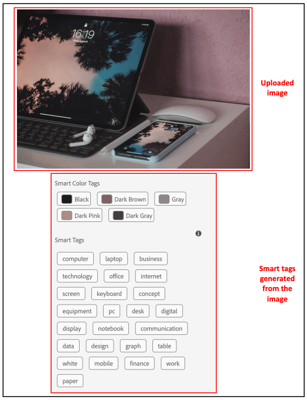

# Smarta taggar för AEM Assets {#using-smart-tags}

Organisationer har ett stort antal digitala resurser och antalet fortsätter att öka snabbt. Att söka efter en viss resurs i en så stor mängd data utgör en stor utmaning. För att åtgärda detta används `metadata` och `tags` för att förbättra sökbarheten för digitala resurser. Organisationer använder taxonomistyrda vokabulärer i metadata för resurser. Dessa består vanligtvis av nyckelordslistor som anställda, partners och kunder vanligtvis använder för att referera till och hitta digitala resurser.

Smarta taggar är nyckelord som inte bara visas i texten utan också bäst beskriver resursen. Genom att tagga resurser med taxonomistyrd vokabulär kan de enkelt identifieras och hämtas via sökning.

Ord som ordnas i bokstavsordning är till exempel enklare att hitta än de som är slumpmässigt spridda. Taggning har ett liknande syfte. Den organiserar resurser efter affärsklonomi och ser till att de mest relevanta visas i sökresultaten. En biltillverkare kan till exempel märka bilderna med modellnamn så att endast relevanta bilder visas när de utformar en kampanjkampanj. Vare sig man lägger in märkord i &quot;runners&quot; eller &quot;löpskor&quot; behöver man inte bekymra sig om typografi, stavningsvariationer eller alternativa söktermer - Smarta taggar känner igen dem alla.

I bakgrunden använder funktionen det artificiellt intelligenta ramverket i [Adobe AI](https://business.adobe.com/ai/adobe-genai.html) automatiskt smarta taggar för överförda resurser (som standard) tillsammans med text som justeras efter företagsklonomin.

## Krav och konfiguration {#smart-tags-prereqs-config}

Smarta taggar etableras automatiskt för [!DNL Adobe Experience Manager] som [!DNL Cloud Service] och därför krävs ingen konfiguration.

## Arbetsflöde för smarta taggar {#smart-tags-workflow}

[!DNL Adobe AI] använder artificiell smart taggning för att analysera innehåll och lägga till taggar i resurserna. Detta minskar tiden för DAM-användare att leverera avancerade upplevelser till sina kunder. Smarta taggar visas i fallande ordning efter deras [konfidensgrad](#confidence-score) i resursegenskaper.

* **Bildbaserade resurser**
För bilder baseras smarta taggar på vissa visuella proportioner. Bilder i många format taggas med smarta innehållstjänster. Smarta taggar används för de [filtyper](#supported-file-formats) som stöds och som genererar återgivningar i JPG- och PNG-format.

  <!-- -->

* **Videobaserade resurser**
För videobaserade resurser är taggning aktiverat som standard i [!DNL Adobe Experience Manager] som en [!DNL Cloud Service] . På samma sätt som bild- och textbaserade taggar, taggas videoklipp även automatiskt när du överför nya videoklipp eller bearbetar om befintliga. [!DNL Adobe AI] genererar två uppsättningar taggar för en video: Den ena uppsättningen motsvarar objekt, scener och attribut i den videon, medan den andra uppsättningen gäller åtgärder som att dricka, köra och jogga. Kontrollera även [avanmäl dig från smart taggning för video](#opt-out-video-smart-tagging).

* **Textbaserade resurser**
För resurser som stöds extraherar [!DNL Experience Manager] redan texten, som sedan indexeras och används för att söka efter resurserna. Smarta taggar baserade på nyckelord i texten ger dock en dedikerad, strukturerad och prioriterad sökfaktor. Den senare hjälper till att förbättra tillgångsidentifiering jämfört med ett sökindex.
För textbaserade resurser beror effekten av smarta taggar inte på mängden text i resursen utan på relevanta nyckelord eller enheter som finns i resursens text.

  

Smarta taggar implementeras i AEM Assets med följande arbetsflöde:

1. Skapa eller överföra en resurs i AEM. Slut på taggar genereras för bild-, video- och textbaserade Assets.

1. Om du upptäcker att specifika taggar inte genereras kan du träna dina bildtypstaggar i enlighet med detta. Mer information finns i [Utbildning om smarta taggar](/help/assets/smart-tags-training.md).

## Filformat som stöds för smarta taggar {#supported-file-formats}

| Bilder (MIME-typer) | Textbaserade resurser (filformat) | Videomaterial (filformat och kodekar) |
|----|-----|------|
| image/jpeg | CSV | MP4 (H264/AVC) |
| bild/tiff | DOC | MKV (H264/AVC) |
| bild/png | DOCX | MOV (H264/AVC, Motion JPEG) |
| image/bmp | HTML | AVI (indeo4) |
| image/gif | PDF | FLV (H264/AVC, vp6f) |
| image/pjpeg | PPT | WMV (WMV2) |
| image/x-portable-anymap | PPTX |  |
| image/x-portable-bitmap | RTF |  |
| image/x-portable-graymap | SRT |  |
| image/x-portable-pixmap | TXT |  |
| image/x-rgb | VTT |  |
| image/x-xbitmap | |  |
| image/x-xpixmap | |  |
| image/x-icon |  |  |
| image/photoshop |  |  |
| image/x-photoshop |  |  |
| image/psd |  |  |
| image/vnd.adobe.photoshop |  |  |

## Förbereda en resurs för smart taggning utanför paketet

När du [överför resurser](add-assets.md#upload-assets) till [!DNL Adobe Experience Manager] som [!DNL Cloud Service] bearbetas de överförda resurserna. När bearbetningen är klar går du till fliken [!UICONTROL Basic] på sidan för resursen [!UICONTROL Properties]. Smarta taggar läggs automatiskt till i resurserna under [!UICONTROL Smart Tags]. Resursmikrotjänsterna använder [!DNL Adobe AI] för att skapa dessa smarta taggar.


<!--
The applied smart tags are sorted in descending order of [confidence score](#confidence-score), combined for object and action tags, within [!UICONTROL Smart Tags].
-->

>[!IMPORTANT]
>
>Du rekommenderas att granska dessa automatiskt genererade taggar för att säkerställa att de överensstämmer med ditt varumärke och dess värden.

## Otaggad Assets i DAM {#smart-tag-existing-assets}

Befintliga eller äldre resurser i DAM är inte automatiskt smarta taggar. Du måste [bearbeta om ](https://experienceleague.adobe.com/docs/experience-manager-cloud-service/content/assets/admin/about-image-video-profiles.html?lang=en#adjusting-load) Assets manuellt för att skapa smarta taggar för dem. När processen har slutförts går du till sidan [!UICONTROL Properties] för en resurs i mappen. De automatiskt tillagda taggarna visas i avsnittet [!UICONTROL Smart Tags] på fliken [!UICONTROL Basic]. De använda smarta taggarna sorteras i fallande ordning efter [konfidensgrad](#confidence-score).

<!--
To smart tag assets, or folders (including subfolders) of assets that exist in assets repository, follow these steps:

1. Select the [!DNL Adobe Experience Manager] logo and then select assets from the [!UICONTROL Navigation] page.

1. Select [!UICONTROL Files] to display the Assets interface.

1. Navigate to the folder to which you want to apply Smart Tags.

1. Select the assets and click  [!UICONTROL Reprocess Assets] icon and select the [!UICONTROL Full Process] option.

-->

## Konfidenspoäng {#confidence-score}

Sökresultaten för dina resurser rangordnas baserat på konfidensintervallet, som i allmänhet förbättrar sökresultaten utöver vad en inspektion av de tilldelade taggarna för en resurs antyder. Felaktiga taggar har ofta låga konfidensvärden, så de visas sällan överst i listan Smarta taggar för resurser.
<!--
[!DNL Adobe Experience Manager] as a [!DNL Cloud Service] applies a minimum confidence threshold for object and action-smart tags to avoid having too many tags for each asset, which slows down indexing. 

The default threshold for action and object tags in [!DNL Adobe Experience Manager] for an image is 0.5 and for video it is 0.7 (should be value from 0 through 1). If some assets are not tagged by a specific tag, then it indicates that the algorithm is less than 70% confident in the predicted tags. The default threshold might not always be optimal for all the users. You can, therefore, change the confidence score value in OSGI configuration.

To add the confidence score OSGI configuration to the project deployed to [!DNL Adobe Experience Manager] as a [!DNL Cloud Service] through [!DNL Cloud Manager]:

In the [!DNL Adobe Experience Manager] project (`ui.config` since Archetype 24, or previously `ui.apps`) the `config.author` OSGi configuration, include a config file named `com.adobe.cq.assetcompute.impl.aisdk.AISdkImpl.cfg.json` with the following contents:

```json
{
  "minVideoActionConfidenceScore":0.5,
  "minVideoObjectConfidenceScore":0.5,
}
```
-->

>[!NOTE]
>
>Manuella taggar tilldelas en konfidensgrad på 100 % (maximal konfidensgrad). Om det finns resurser med manuella taggar som matchar sökfrågan visas de därför före smarta taggar som matchar sökfrågan.

## Måttliga smarta taggar {#moderate-smart-tags}

Med [!DNL Adobe Experience Manager] som [!DNL Cloud Service] kan du strukturera smarta taggar till:

* ta bort felaktiga taggar som tilldelats ert varumärkeskonto.

* förfina taggbaserade sökningar efter resurser genom att se till att dina resurser visas i sökresultaten för de mest relevanta taggarna. Det eliminerar därför risken för att orelaterade resurser visas i sökresultaten.

* tilldelar en högre rankning till en tagg för att öka dess relevans med avseende på en tillgång. Om du befordrar en tagg för en resurs ökar risken för att den aktuella resursen visas i sökresultaten när en sökning utförs baserat på den taggen.

Mer information om hur du modererar smarta taggar för resurser finns i [Hantera smarta taggar](smart-tags.md#manage-smart-tags-and-searches).


>[!NOTE]
>
>Eventuella taggar som modereras med stegen i [Hantera smarta taggar](smart-tags.md#manage-smart-tags-and-searches) sparas inte när resursen bearbetas om. De ursprungliga tagguppsättningarna visas igen.

## Hantera smarta taggar och resurssökningar {#manage-smart-tags-and-searches}

Du kan strukturera smarta taggar om du vill ta bort felaktiga taggar som kan ha tilldelats till ert varumärkesmaterial, så att endast de mest relevanta taggarna visas.

Genom att moderera smarta taggar kan du också förbättra taggbaserade sökningar efter resurser genom att se till att dina resurser visas i sökresultaten för de mest relevanta taggarna. I grund och botten hjälper det till att eliminera riskerna för att orelaterade resurser visas i sökresultaten.

Du kan också tilldela en högre rankning till en tagg för att öka taggens relevans för resursen. Om du befordrar en tagg för en resurs ökar risken för att resursen visas i sökresultaten när en sökning utförs baserat på den aktuella taggen.

Så här modererar du smarta taggar för dina digitala resurser:

1. I sökfältet söker du efter digitala resurser baserat på en tagg.

1. Om du vill identifiera de digitala resurser som du inte tycker är relevanta för sökningen kontrollerar du sökresultaten.

1. Markera en resurs och välj sedan  i verktygsfältet.

1. Granska taggarna från sidan **[!UICONTROL Manage Tags]**. Om du inte vill att resursen ska genomsökas baserat på en viss tagg markerar du taggen och väljer  i verktygsfältet. Du kan också välja  bredvid etiketten.

1. Om du vill tilldela en högre rankning till en tagg markerar du taggen och väljer  i verktygsfältet. Taggen som du höjer upp flyttas till avsnittet **[!UICONTROL Tags]**.

1. Välj **[!UICONTROL Save]** och sedan **[!UICONTROL OK]** för att stänga dialogrutan [!UICONTROL Success].

1. Navigera till sidan [!UICONTROL Properties] för resursen. Observera att taggen som du befordrade har hög relevans och därför visas högre i sökresultaten.

### Förstå [!DNL Experience Manager]-sökresultat med smarta taggar {#understand-search}

Som standard kombinerar [!DNL Experience Manager] söktermerna med en `AND` - eller `OR` -sats för att hitta något av söktermerna i de använda smarta taggarna. Om du använder smarta taggar ändras inte standardbeteendet. Du kan till exempel söka efter `woman running`. Assets med bara `woman` eller bara `running` nyckelord i metadata visas inte som standard i sökresultaten. En resurs som taggats med antingen `woman` eller `running` med smarta taggar visas dock i en sådan sökfråga. Sökresultaten är en kombination av

* Assets med nyckelorden `woman` och `running` i metadata.

* Assets smart taggad med något av nyckelorden.

Sökresultaten som matchar alla söktermer i metadatafält visas först, följt av sökresultaten som matchar någon av söktermerna i Smarta taggar. I ovanstående exempel är den ungefärliga visningsordningen för sökresultat:

1. matchar `woman running` i de olika metadatafälten.
1. matchar `woman running` i smarta taggar.
1. matchar `woman` eller `running` i smarta taggar.

## Avanmäl dig från smart taggning {#opt-out-smart-tagging}

När den automatiska taggningen av resurser körs parallellt med andra bearbetningsuppgifter som att skapa miniatyrbilder och extrahera metadata kan det vara tidskrävande. Du kan avanmäla dig från smart taggning vid överföring på mappnivå för att påskynda resursbearbetningen. Så här avanmäler du dig från generering av automatiska smarta taggar för resurser som överförts till en viss mapp:

1. Öppna fliken [!UICONTROL Asset Processing] i mappen [!UICONTROL Properties].
1. I [!UICONTROL Smart Tags for Videos]-menyn är till exempel alternativet [!UICONTROL Inherited] valt som standard och smart tagg för video är aktiverat.

   När alternativet [!UICONTROL Inherited] är markerat visas även den ärvda mappsökvägen tillsammans med informationen om den är inställd på [!UICONTROL Enable] eller [!UICONTROL Disable].

   

1. Välj [!UICONTROL Disable] om du vill avanmäla dig från smart taggning som överförts till mappen.

1. På samma sätt kan du välja bort smart taggning för [!UICONTROL Smart Tags for Text], [!UICONTROL Smart Tags for Image] och [!UICONTROL Color Tags for Images].

>[!IMPORTANT]
>
>Om du har valt att inte tagga en mapp vid överföringen och vill att taggen ska vara smart efter överföringen, **[!UICONTROL Enable Smart Tags]** från fliken [!UICONTROL Asset Processing] i mappen [!UICONTROL Properties] och använder [[!UICONTROL Reprocess Asset] option ](#smart-tag-existing-assets) för att lägga till smarta taggar i resurserna.

<!--
## Benefits of Smart Tags to your assets {#benefits-of-smart-tags}

Following are the benefits of using Smart Tags in your AEM Assets:
*  Makes an asset searchable.
*  Smart Tags are generated automatically to your assets, thus, it minimizes your effort to perform tagging manually.
*  It allows the usage of the same vocabulary, tag structure, and taxonomy so that you need not to worry about tagging if by chance you miss tagging at first.
*  Whether you are tagging "runners" or "running" shoes, you do not need to worry about typos, wrong spellings, or alternative search terms as Smart Tags know it already!
*  Helps your assets to become organized and categorized.
-->

## Begränsningar och bästa metoder för smarta taggar {#limitations-best-practices-smart-tags}

Dessa modeller är inte alltid perfekta när det gäller att identifiera taggar. Den aktuella versionen av smarta taggar har följande begränsningar:

* Oförmåga att identifiera små skillnader i bilder. Exempel: skjortor som inte passar lika bra som skjortor med normal passning.
* Oförmåga att identifiera taggar baserat på små mönster eller delar av en bild. Till exempel logotyper på skjortor.
* De taggar som inte hanteras gäller:

   * Ej visuella, abstrakta aspekter. Exempel: år eller säsong då en produkt, stämning eller känslor släpps upp som en bild orsakar samt en subjektiv nyans av en video.
   * Fina visuella skillnader mellan produkter som skjortor med och utan färg eller små logotyper som är inbäddade i produkter.

* Endast videoklipp som är mindre än 300 MB i filstorlek taggas automatiskt. Tjänsten [!DNL Adobe AI] hoppar över videofiler som är större.
* Om du vill söka efter filer med smarta taggar (vanliga eller förbättrade) använder du sökningen [!DNL Assets] (fulltextsökning). Det finns inget separat sökpredikat för smarta taggar.
* Jämfört med allmänna taggar är det lättare att identifiera och hämta resurser som taggats med hjälp av företagtaxonomi genom taggbaserade sökningar.

## Frågor och svar{#faq-smart-tags}

+++**Hur förbättrar smarta taggar sökfunktionen för en resurs?**

[!DNL Adobe] AI taggar resurserna automatiskt när du överför dem. Den automatiserade processen går så snabbt att du ser taggar som läggs till i dina resurser efter några sekunder när överföringen är klar.

+++

+++**Vad händer om listan med smarta taggar är felaktig eller visar en oönskad tagg?**

En felaktig eller oönskad tagg kan tas bort från listan. Som bilhandlare kanske du vill ta bort&quot;skadad&quot; tagg från listan.

+++

+++**Hur kan du prioritera resurser som innehåller samma taggar?**

Ja, du kan prioritera resurser som innehåller samma taggar. Du kan höja upp en tagg i listan Smarta taggar för en resurs för att utföra prioriteringen. Om du befordrar en tagg kan du prioritera bilderna som visas i sökresultaten för den aktuella taggen.

+++

+++**Är tillämpningen av smarta taggar begränsad till en viss mapp?**

Smarta taggar kan konfigureras och användas i alla mappar i DAM.

+++

+++**Hur vet jag att taggningen behöver tränas?**

Mer information finns i [Bestämma kraven för utbildning för smarta taggar](/help/assets/smart-tags-training.md#smart-tag-training-requirement).

+++

+++**Vilka filformat stöds för taggning av en resurs?**

Se [Filformat som stöds](#supported-file-formats).

+++

+++**I vilket språk genereras smarta taggar?**

Smarta taggar genereras endast på engelska. De kan översättas till andra språk genom att översätta hela resursen inklusive metadata.

+++

+++**Jag vill inte använda smarta taggar längre.**

Du kan [avanmäla dig från smarta taggar](#opt-out-smart-tagging) när du vill avbryta.

+++
