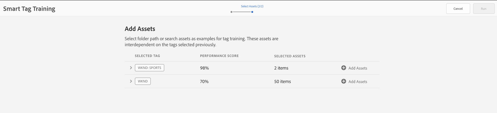

# Lägg till smarta taggar i dina resurser för att förbättra sökupplevelsen {#smart-tag-assets-for-faster-search}

Organisationer som hanterar digitalt material använder i allt högre grad taxonomistyrd vokabulär i metadata. Det innehåller i själva verket en lista med nyckelord som anställda, partners och kunder vanligtvis använder för att referera till och söka efter sina digitala resurser. Genom att tagga resurser med taxonomistyrd vokabulär ser du till att resurserna är lätta att identifiera och hämta i sökningar.

Jämfört med naturliga språkordsuttryck hjälper taggning som baseras på företagstaxonomi till att anpassa tillgångarna till företagets verksamhet och säkerställer att de mest relevanta resurserna visas i sökningar. En biltillverkare kan t.ex. märka bilderna med modellnamn så att endast relevanta bilder visas när de genomsöks för att utforma en kampanj.

I bakgrunden använder funktionen det artificiellt intelligenta ramverket i [Adobe Sensei](https://www.adobe.com/sensei/experience-cloud-artificial-intelligence.html) för att träna sin bildigenkänningsalgoritm i din taggstruktur och din företagsklonomi. Den här innehållsintelligensen används sedan för att tillämpa relevanta taggar på en annan uppsättning resurser. De nya [!DNL Experience Manager Assets]-distributionerna är som standard integrerade med [!DNL Adobe Developer Console]. Det hjälper till att konfigurera smarta taggar snabbare. I de äldre distributionerna kan administratörer manuellt [konfigurera integrering av smarta taggar](/help/assets/smart-tags-configuration.md#aio-integration).

<!-- TBD: Create a flowchart for how training works in CS.
 
-->

## Resurstyper som stöds {#smart-tags-supported-file-formats}

Du kan tagga följande typer av resurser:

* **Bilder**: Bilder i många format taggas med Adobe Sensei smarta innehållstjänster. Du [skapar en utbildningsmodell](#train-model) och [använder smarta taggar](#tag-assets) på bilder. Smarta taggar används på de filtyper som stöds och som genererar återgivningar i JPG- och PNG-format.
* **Textbaserade resurser**:  [!DNL Experience Manager Assets] taggar automatiskt de textbaserade resurserna som stöds när de överförs. Läs mer om [taggning av textbaserade resurser](#smart-tag-text-based-assets).
* **Videomaterial**: Videotaggning är aktiverat som standard i  [!DNL Adobe Experience Manager] som  [!DNL Cloud Service]en. [Videor ](/help/assets/smart-tags-video-assets.md) taggas automatiskt när du överför nya videoklipp eller bearbetar om befintliga.

| Bilder (MIME-typer) | Textbaserade resurser (filformat) | Videomaterial (filformat och kodekar) |
|----|-----|------|
| image/jpeg | CSV | MP4 (H264/AVC) |
| bild/tiff | DOC | MKV (H264/AVC) |
| bild/png | DOCX | MOV (H264/AVC, Motion JPEG) |
| image/bmp | HTML | AVI (indeo4) |
| image/gif | PDF | FLV (H264/AVC, vp6f) |
| image/pjpeg | PPT | WMV (WMV2) |
| image/x-portable-anymap | PPTX |  |
| image/x-portable-bitmap | RTF |  |
| image/x-portable-graymap | SRT |  |
| image/x-portable-pixmap | TXT |  |
| image/x-rgb | VTT |  |
| image/x-xbitmap |  |  |
| image/x-xpixmap |  |  |
| image/x-icon |  |  |
| image/photoshop |  |  |
| image/x-photoshop |  |  |
| image/psd |  |  |
| image/vnd.adobe.photoshop |  |  |

[!DNL Experience Manager] lägger automatiskt till smarta taggar i textbaserade resurser och i videoklipp som standard. Om du vill lägga till smarta taggar automatiskt till bilder utför du följande åtgärder.

* [Förstå taggmodeller och riktlinjer](#understand-tag-models-guidelines).
* [Tåla modellen](#train-model).
* [Tagga dina digitala resurser](#tag-assets).
* [Hantera taggar och sökningar](#manage-smart-tags-and-searches).

<!-- TBD: Is there a link to buy SCS or initiate a sales call. How are AIO services sold? Provide a CTA here to buy or contacts Sales team. -->

## Tagga textbaserade resurser med smarta taggar {#smart-tag-text-based-assets}

De textbaserade resurserna som stöds taggas automatiskt av [!DNL Experience Manager Assets] när de överförs. Den är aktiverad som standard. Hur effektiva smarta taggar är beror inte på mängden text i resursen utan på relevanta nyckelord eller enheter som finns i resursens text. För textbaserade resurser är smarta taggar nyckelorden som visas i texten men de som bäst beskriver resursen. För resurser som stöds extraherar [!DNL Experience Manager] redan texten, som sedan indexeras och används för att söka efter resurserna. Smarta taggar baserade på nyckelord i texten ger emellertid en dedikerad, strukturerad och prioriterad sökfaktor som används för att förbättra resursidentifieringen jämfört med ett fullständigt sökindex.

För bilder och videoklipp baseras de smarta taggarna på vissa visuella proportioner.

## Förstå taggmodeller och riktlinjer {#understand-tag-models-guidelines}

En taggmodell är en grupp relaterade taggar som är kopplade till olika visuella aspekter av bilder som taggas. Taggar är kopplade till de olika visuella aspekterna av bilder så att taggarna när de används hjälper dig att söka efter särskilda typer av bilder. En skosamling kan till exempel ha olika taggar, men alla taggar är relaterade till skor och kan tillhöra samma taggmodell. När märkorden används kan de hjälpa dig att hitta olika typer av skor, till exempel efter färg, design eller användning. Om du vill förstå hur en utbildningsmodell i [!DNL Experience Manager] ser ut visar du en utbildningsmodell som en enhet på den översta nivån som består av en grupp med manuellt tillagda taggar och exempelbilder för varje tagg. Varje tagg kan användas exklusivt på en bild.

Innan du skapar en taggmodell och utbildar tjänsten bör du identifiera en uppsättning unika taggar som bäst beskriver objekten i bilderna i ditt företags sammanhang. Kontrollera att resurserna i din kuraterade uppsättning överensstämmer med [riktlinjerna för utbildning](#training-guidelines).

### Utbildningsriktlinjer {#training-guidelines}

Kontrollera att bilderna i kursuppsättningen överensstämmer med följande riktlinjer:

**Kvantitet och storlek:** Minst 10 bilder och högst 50 bilder per tagg.

**Samstämmighet**: Se till att bilderna för en tagg är visuellt lika. Det är bäst att lägga samman märkorden om samma visuella aspekter (till exempel samma typ av objekt i en bild) till en enda taggmodell. Det är till exempel ingen bra idé att tagga alla dessa bilder som `my-party` (för utbildning) eftersom de inte är visuellt lika.

**Täckning**: Det ska finnas tillräckligt med variation i bilderna i utbildningen. Tanken är att ge några men relativt olika exempel så att AEM lär sig att fokusera på rätt saker. Om du använder samma tagg på bilder som ser olika ut bör du ta med minst fem exempel av varje typ. För taggen *model-down-pose* kan du t.ex. inkludera fler utbildningsbilder som liknar den markerade bilden nedan för att tjänsten ska kunna identifiera liknande bilder mer exakt under taggningen.

**Distraktion/obstruktion**: Tjänsten tränar bättre på bilder som inte är så distraherande (framträdande bakgrunder, icke-relaterade komponenter, t.ex. objekt/personer med huvudmotivet). För taggen *casual-shoe* är den andra bilden till exempel inte en bra träningskandidat.

**Fullständighet:** Om en bild kvalificerar sig för mer än en tagg lägger du till alla tillämpliga taggar innan du inkluderar bilden för träning. För taggar som *regnrock* och *modellvy* lägger du till båda taggarna i den kvalificerade resursen innan du inkluderar den för träning.

**Antal taggar**: Adobe rekommenderar att du utbildar en modell med minst två distinkta taggar och minst tio olika bilder för varje tagg. Lägg inte till fler än 50 taggar i en enda taggmodell.

**Antal exempel**: Lägg till minst tio exempel för varje tagg. Adobe rekommenderar dock cirka 30 exempel. Högst 50 exempel per tagg stöds.

**Förhindra falska positiva element och konflikter**: Adobe rekommenderar att du skapar en enda taggmodell för en enda visuell aspekt. Strukturera taggmodellerna på ett sätt som undviker överlappande taggar mellan modellerna. Använd till exempel inte vanliga taggar som `sneakers` i två olika taggmodellnamn `shoes` och `footwear`. Utbildningsprocessen skriver över en tränad taggmodell med den andra för ett vanligt nyckelord.

**Exempel**: Några fler exempel på vägledning är:

* Skapa en taggmodell som innehåller
   * endast de taggar som avser bilmodeller.
   * endast de taggar som hör till skjortfärger.
   * endast taggarna för schaket för kvinnor och män.
* Skapa inte
   * en taggmodell som innehåller bilmodeller som släpptes 2019 och 2020.
   * flera taggmodeller som innehåller samma få bilmodeller.

**Bilder som används för utbildning**: Du kan använda samma bilder för att utbilda olika taggmodeller. Koppla emellertid inte en bild till mer än en tagg i en taggmodell. Du kan lägga till märkord i samma bild med olika märkord som tillhör olika taggmodeller.

Du kan inte ångra kursen. Riktlinjerna ovan bör hjälpa dig att välja bra bilder att utbilda.

## Visa modellen för dina anpassade taggar {#train-model}

Följ de här stegen för att skapa och utbilda en modell för dina företagsspecifika taggar:

1. Skapa nödvändiga taggar och rätt taggstruktur. Överför relevanta bilder i DAM-databasen.
1. Gå till **[!UICONTROL Assets]** > **[!UICONTROL Smart Tag Training]** i [!DNL Experience Manager]-användargränssnittet.
1. Klicka på **[!UICONTROL Create]**. Ange en **[!UICONTROL Title]**, **[!UICONTROL Description]**.
1. Bläddra och välj taggarna från de befintliga taggarna i `cq:tags` som du vill utbilda modellen för. Klicka på **[!UICONTROL Next]**.
1. Klicka på **[!UICONTROL Add Assets]** mot varje tagg i dialogrutan **[!UICONTROL Select Assets]**. Sök i DAM-databasen eller bläddra i databasen för att välja minst 10 och högst 50 bilder. Välj resurser och inte mappen. När du har valt bilderna klickar du på **[!UICONTROL Select]**.

   

1. Om du vill förhandsvisa miniatyrbilderna för de markerade bilderna klickar du på dragspelet framför en tagg. Du kan ändra markeringen genom att klicka på **[!UICONTROL Add Assets]**. När du är nöjd med markeringen klickar du på **[!UICONTROL Submit]**. Användargränssnittet visar ett meddelande längst ned på sidan om att kursen har startats.
1. Kontrollera utbildningsstatusen i kolumnen **[!UICONTROL Status]** för varje taggmodell. Möjliga statusvärden är [!UICONTROL Pending], [!UICONTROL Trained] och [!UICONTROL Failed].

*Bild: Steg i utbildningsarbetsflödet för att ta fram en tågmärkesmodell.*

### Visa utbildningsstatus och rapport {#training-status}

Om du vill kontrollera om smarta taggar-tjänsten är utbildad i dina taggar i utbildningsuppsättningen med resurser kan du läsa rapporten om utbildningsarbetsflödet i rapportkonsolen.

1. I gränssnittet [!DNL Experience Manager] går du till **[!UICONTROL Tools]** > **[!UICONTROL Assets]** > **[!UICONTROL Reports]**.
1. Klicka på **[!UICONTROL Create]** på sidan **[!UICONTROL Asset Reports]**.
1. Välj **[!UICONTROL Smart Tags Training]**-rapporten och klicka sedan på **[!UICONTROL Next]** i verktygsfältet.
1. Ange en titel och beskrivning för rapporten. Under **[!UICONTROL Schedule Report]** låter du alternativet **[!UICONTROL Now]** vara markerat. Om du vill schemalägga rapporten till ett senare tillfälle väljer du **[!UICONTROL Later]** och anger ett datum och en tid. Klicka sedan på **[!UICONTROL Create]** i verktygsfältet.
1. På sidan **[!UICONTROL Asset Reports]** markerar du rapporten som du skapat. Om du vill visa rapporten klickar du på **[!UICONTROL View]** i verktygsfältet.
1. Granska informationen i rapporten. Rapporten visar träningsstatusen för de taggar du har tränat. Den gröna färgen i kolumnen **[!UICONTROL Training Status]** anger att tjänsten Smarta taggar har tränats för taggen. Gul färg anger att tjänsten inte är helt tränad för en viss tagg. I det här fallet lägger du till fler bilder med just den taggen och kör träningsarbetsflödet för att träna tjänsten helt för taggen. Om du inte ser dina taggar i den här rapporten kör du utbildningsarbetsflödet igen för de här taggarna.Taggar
1. Om du vill hämta rapporten markerar du den i listan och klickar på **[!UICONTROL Download]** i verktygsfältet. Rapporten hämtas som ett [!DNL Microsoft Excel]-kalkylblad.

## Tagga resurser {#tag-assets}

När du har utbildat tjänsten Smarta taggar kan du utlösa taggningsarbetsflödet för att automatiskt tillämpa taggar på en annan uppsättning resurser. Du kan tillämpa taggningsarbetsflödet på begäran eller schemalägga det att köras periodiskt. Arbetsflödet för taggning gäller både resurser och mappar.

### Tagga resurser från arbetsflödeskonsolen {#tagging-assets-from-the-workflow-console}

1. I gränssnittet [!DNL Experience Manager] går du till **[!UICONTROL Tools]** > **[!UICONTROL Workflow]** > **[!UICONTROL Models]**.
1. På sidan **[!UICONTROL Workflow Models]** väljer du arbetsflödet för **[!UICONTROL DAM Smart Tags Assets]** och klickar sedan på **[!UICONTROL Start Workflow]** i verktygsfältet.

   

1. I dialogrutan **[!UICONTROL Run Workflow]** bläddrar du till nyttolastmappen som innehåller resurser som du vill använda dina taggar på automatiskt.
1. Ange en rubrik för arbetsflödet och en valfri kommentar. Klicka på **[!UICONTROL Run]**.

   

   *Bild: Navigera till resursmappen och granska taggarna för att kontrollera om dina resurser är taggade på rätt sätt. Mer information finns i [hantera smarta taggar](#manage-smart-tags-and-searches).*

### Tagga resurser från tidslinjen {#tagging-assets-from-the-timeline}

1. I [!DNL Assets]-användargränssnittet väljer du den mapp som innehåller resurser eller specifika resurser som du vill använda smarta taggar på.
1. Öppna **[!UICONTROL Timeline]** i det övre vänstra hörnet.
1. Öppna funktionsmakron längst ned i den vänstra sidopanelen och klicka på **[!UICONTROL Start Workflow]**.

   

1. Välj arbetsflödet **[!UICONTROL DAM Smart Tag Assets]** och ange en rubrik för arbetsflödet.
1. Klicka på **[!UICONTROL Start]**. Arbetsflödet använder dina taggar på resurser. Navigera till resursmappen och granska taggarna för att kontrollera att dina resurser är taggade på rätt sätt. Mer information finns i [hantera smarta taggar](#manage-smart-tags-and-searches).

>[!NOTE]
>
>I de efterföljande taggningscyklerna är det bara de ändrade resurserna som taggas igen med nyligen tränade taggar. Även oförändrade resurser taggas om mellanrummet mellan den sista och den aktuella taggningscykeln för taggningsarbetsflödet överstiger 24 timmar. För periodiska taggningsarbetsflöden taggas oförändrade resurser när tidsintervallet överskrider sex månader.

### Tagga överförda resurser {#tag-uploaded-assets}

[!DNL Experience Manager] kan automatiskt tagga resurser som användare överför till DAM. För att göra det konfigurerar administratörer ett arbetsflöde för att lägga till ett tillgängligt steg som taggar resurser. Se [hur du aktiverar smarta taggar för överförda resurser](/help/assets/smart-tags-configuration.md#enable-smart-tagging-for-uploaded-assets).

## Hantera smarta taggar och resurssökningar {#manage-smart-tags-and-searches}

Du kan strukturera smarta taggar om du vill ta bort felaktiga taggar som kan ha tilldelats ert varumärkesobjekt, så att endast de mest relevanta taggarna visas.

Genom att moderera smarta taggar kan du också förbättra taggbaserade sökningar efter resurser genom att se till att dina resurser visas i sökresultaten för de mest relevanta taggarna. I grund och botten kan det hjälpa till att eliminera risken för att orelaterade resurser visas i sökresultaten.

Du kan också tilldela en högre rankning till en tagg för att öka taggens relevans för resursen. Om du befordrar en tagg för en resurs ökar risken för att resursen visas i sökresultaten när en sökning utförs baserat på den aktuella taggen.

Så här modererar du smarta taggar för dina resurser:

1. I sökfältet söker du efter resurser baserat på en tagg.

1. Inspect sökresultaten för att identifiera de resurser som du inte tycker är relevanta för sökningen.

1. Markera resursen och välj sedan  i verktygsfältet.

1. Granska taggarna på sidan **[!UICONTROL Manage Tags]**. Om du inte vill att resursen ska genomsökas baserat på en viss tagg markerar du taggen och väljer  i verktygsfältet. Du kan också välja `X`-symbolen bredvid etiketten.

1. Om du vill tilldela en högre rankning till en tagg markerar du taggen och väljer  i verktygsfältet. Taggen som du befordrar flyttas till avsnittet **[!UICONTROL Tags]**.

1. Välj **[!UICONTROL Save]** och sedan **[!UICONTROL OK]** för att stänga dialogrutan [!UICONTROL Success].

1. Navigera till sidan [!UICONTROL Properties] för resursen. Observera att taggen som du befordrade har hög relevans och därför visas högre i sökresultaten.

### Förstå AEM sökresultat med smarta taggar {#understand-search}

Som standard kombineras söktermerna AEM en `AND`-sats. Om du använder smarta taggar ändras inte standardbeteendet. Om du använder smarta taggar läggs en `OR`-sats till för att hitta någon av söktermerna i de använda smarta taggarna. Du kan till exempel söka efter `woman running`. Resurser med bara `woman` eller bara `running` nyckelord i metadata visas inte som standard i sökresultaten. En resurs som är taggad med antingen `woman` eller `running` med smarta taggar visas i en sådan sökfråga. Sökresultaten är en kombination av

* resurser med `woman` och `running` nyckelord i metadata.

* resurser som är smarta taggade med något av nyckelorden.

Sökresultaten som matchar alla söktermer i metadatafält visas först, följt av sökresultaten som matchar någon av söktermerna i de smarta taggarna. I ovanstående exempel är den ungefärliga visningsordningen för sökresultat:

1. matchar `woman running` i de olika metadatafälten.
1. matchar `woman running` i smarta taggar.
1. matchar `woman` eller `running` i smarta taggar.

## Taggningsbegränsningar och metodtips {#limitations}

Förbättrad smart taggning bygger på inlärningsmodeller för bilder och taggar för dessa. Dessa modeller är inte alltid perfekta när det gäller att identifiera taggar. Den aktuella versionen av smarta taggar har följande begränsningar:

* Oförmåga att identifiera små skillnader i bilder. Till exempel tunna eller jämna skjortor.
* Oförmåga att identifiera taggar baserat på små mönster/delar av en bild. Till exempel logotyper på T-shirts.
* Taggning stöds på de språk som stöds av [!DNL Experience Manager]. En lista över språk finns i [Versionsinformation för tjänsten Smart Content.](https://experienceleague.adobe.com/docs/experience-manager-64/release-notes/smart-content-service-release-notes.html#languages).
* Taggar som inte hanteras realistiskt är relaterade till:

   * Icke-visuella, abstrakta aspekter. Exempel: år eller årstid för en produkts release, stämning eller känslor som en bild orsakar, subjektiv sammanfogning av en video osv.
   * Fina visuella skillnader mellan produkter som skjortor med och utan färg eller små logotyper som är inbäddade i produkter.

<!-- TBD: Add limitations related to text-based assets. -->

Om du vill söka efter resurser med smarta taggar (vanliga eller förbättrade) använder du [!DNL Assets]-sökningen (fulltextsökning). Det finns inget separat sökpredikat för smarta taggar.

>[!NOTE]
>
>Möjligheten att använda smarta taggar för att utbilda dig på dina taggar och använda dem på andra bilder beror på kvaliteten på de bilder du använder i utbildningen.
>För bästa resultat rekommenderar Adobe att du använder visuellt liknande bilder för att utbilda tjänsten för varje tagg.

>[!MORELIKETHIS]
>
>* [Konfigurera  [!DNL Experience Manager] för smart taggning](smart-tags-configuration.md)
>* [Förstå hur smarta taggar hjälper till att hantera resurser](https://medium.com/adobetech/efficient-asset-management-with-enhanced-smart-tags-887bd47dbb3f)
>* [Smart taggning av videomaterial](smart-tags-video-assets.md)

