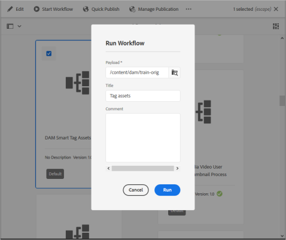

# Utbilda Smart Content Service och tagga dina bilder automatiskt {#train-service-tag-assets}

Organisationer som hanterar digitalt material använder i allt högre grad taxonomistyrd vokabulär i metadata. Det innehåller i själva verket en lista med nyckelord som anställda, partners och kunder vanligtvis använder för att referera till och söka efter sina digitala resurser. Genom att tagga resurser med taxonomistyrd vokabulär kan du enkelt identifiera och hämta dem genom taggbaserade sökningar.

Jämfört med naturliga språkordsuttryck hjälper taggning som baseras på företagstaxonomi till att anpassa tillgångarna till företagets verksamhet och säkerställer att de mest relevanta resurserna visas i sökningar. En biltillverkare kan t.ex. märka bilderna med modellnamn så att endast relevanta bilder visas när de genomsöks för att utforma en kampanj.

In the background, the Smart Tags uses an artificial intelligence framework of [Adobe Sensei](https://www.adobe.com/sensei/experience-cloud-artificial-intelligence.html) to train its image recognition algorithm on your tag structure and business taxonomy. Den här innehållsintelligensen används sedan för att tillämpa relevanta taggar på en annan uppsättning resurser.

<!-- TBD: Create a flowchart for how training works in CS.
 
-->

Utför följande uppgifter om du vill använda smart taggning:

* [Integrera Experience Manager med Adobe Developer Console](#integrate-aem-with-aio).
* [Förstå taggmodeller och riktlinjer](#understand-tag-models-guidelines).
* [Tåla modellen](#train-model).
* [Tagga dina digitala resurser](#tag-assets).
* [Hantera taggar och sökningar](#manage-smart-tags-and-searches).

Smarta taggar gäller endast för [!DNL Adobe Experience Manager Assets] kunder. The Smart Tags is available for purchase as an add-on to [!DNL Experience Manager].

<!-- TBD: Is there a link to buy SCS or initiate a sales call. How are AIO services sold? Provide a CTA here to buy or contacts Sales team. -->

## Integrate [!DNL Experience Manager] with Adobe Developer Console {#integrate-aem-with-aio}

>[!IMPORTANT]
>
>De nya [!DNL Experience Manager Assets] distributionerna är integrerade med [!DNL Adobe Developer Console] som standard. Det hjälper till att konfigurera smarta taggar snabbare. I äldre distributioner kan administratörer manuellt [konfigurera integrering](/help/assets/smart-tags-configuration.md#aio-integration)med smarta taggar.

Du kan integrera [!DNL Adobe Experience Manager] med smarta taggar med [!DNL Adobe Developer Console]. Använd den här konfigurationen för att komma åt tjänsten Smarta taggar inifrån [!DNL Experience Manager]. Se [Konfigurera Experience Manager för smart taggning av resurser](smart-tags-configuration.md) för uppgifter för att konfigurera smarta taggar. At the back end, the [!DNL Experience Manager] server authenticates your service credentials with the Adobe Developer Console gateway before forwarding your request to the Smart Tags service.

## Förstå taggmodeller och riktlinjer {#understand-tag-models-guidelines}

En taggmodell är en grupp relaterade taggar som är en visuell aspekt av bilden. En skosamling kan till exempel ha olika taggar, men alla taggar är relaterade till skor och kan tillhöra samma taggmodell. Taggar kan bara relateras till de olika visuella aspekterna av bilder. Om du vill förstå hur en utbildningsmodell i [!DNL Experience Manager]ser ut som innehåll, ska du visualisera en utbildningsmodell som en enhet på den översta nivån som består av en grupp med manuellt tillagda taggar och exempelbilder för varje tagg. Varje tagg kan användas exklusivt på en bild.

Taggar som inte kan hanteras på ett realistiskt sätt är relaterade till:

* Icke-visuella, abstrakta aspekter som år eller årstid för en produkts release, stämning eller känslor som en bild ger upphov till.
* Fina visuella skillnader mellan produkter som skjortor med och utan färg eller små logotyper som är inbäddade i produkter.

Innan du skapar en taggmodell och utbildar tjänsten bör du identifiera en uppsättning unika taggar som bäst beskriver objekten i bilderna i ditt företags sammanhang. Se till att resurserna i din kuraterade uppsättning följer [riktlinjerna](#training-guidelines)för utbildning.

### Utbildningsriktlinjer {#training-guidelines}

Bilderna i din utbildningssamling ska följa följande riktlinjer:

**Kvantitet och storlek:** Minst 10 bilder och högst 50 bilder per tagg.

**Samstämmighet**: Bilderna för en tagg bör vara visuellt lika. Det är bäst att lägga samman märkorden om samma visuella aspekter (till exempel samma typ av objekt i en bild) till en enda taggmodell. Det är till exempel ingen bra idé att tagga alla dessa bilder som `my-party` (för utbildning) eftersom de inte är visuellt lika.

**Täckning**: Det ska finnas tillräckligt med variation i bilderna i utbildningen. Tanken är att ge några men relativt olika exempel så att AEM lär sig att fokusera på rätt saker. Om du använder samma tagg på bilder som ser olika ut bör du ta med minst fem exempel av varje typ. För taggen *model-down* kan du t.ex. inkludera fler utbildningsbilder som liknar den markerade bilden nedan för tjänsten för att identifiera liknande bilder mer exakt under taggningen.

**Distraktion/obstruktion**: Tjänsten tränar bättre på bilder som inte är så distraherande (framträdande bakgrunder, icke-relaterade komponenter, t.ex. objekt/personer med huvudmotivet). För taggen *casual-shoe*&#x200B;är den andra bilden till exempel inte en bra träningskandidat.

**Fullständighet:** Om en bild kvalificerar sig för mer än en tagg lägger du till alla tillämpliga taggar innan du inkluderar bilden för träning. För taggar som *regnrock* och *modellvy* lägger du till båda taggarna i den kvalificerade resursen innan du inkluderar den för träning.

**Antal taggar**: Adobe rekommenderar att du utbildar en modell med minst två distinkta taggar och minst tio olika bilder för varje tagg. Lägg inte till fler än 50 taggar i en enda taggmodell.

**Antal exempel**: Lägg till minst 10 exempel för varje tagg. Adobe rekommenderar dock cirka 30 exempel. Högst 50 exempel per tagg stöds.

**Förhindra falska positiva element och konflikter**: Adobe rekommenderar att du skapar en enda taggmodell för en enda visuell aspekt. Strukturera taggmodellerna på ett sätt som undviker överlappande taggar mellan modellerna. Använd till exempel inte vanliga taggar som `sneakers` i två olika taggmodellnamn `shoes` och `footwear`. Utbildningsprocessen skriver över en tränad taggmodell med den andra för ett vanligt nyckelord.

**Exempel**: Några fler exempel på vägledning är:

* Skapa en taggmodell som innehåller
   * endast de taggar som avser bilmodeller.
   * endast de taggar som hör till skjortfärger.
   * endast taggarna för schaket för kvinnor och män.
* Skapa inte
   * en taggmodell som innehåller bilmodeller som släpptes 2019 och 2020.
   * flera taggmodeller som innehåller samma få bilmodeller.

**Bilder som används för utbildning**: Du kan använda samma bilder för att utbilda olika taggmodeller. Däremot ska du inte associera en bild med mer än en tagg i en taggmodell. Det är därför möjligt att tagga samma bild med olika taggar som tillhör olika taggmodeller.

Du kan inte ångra kursen. Riktlinjerna ovan bör hjälpa dig att välja bra bilder att utbilda.

## Ange modell för anpassade taggar {#train-model}

Följ de här stegen för att skapa och utbilda en modell för dina företagsspecifika taggar:

1. Skapa nödvändiga taggar och rätt taggstruktur. Överför relevanta bilder i DAM-databasen.
1. In [!DNL Experience Manager] user interface, access **[!UICONTROL Assets]** > **[!UICONTROL Smart Tag Training]**.
1. Klicka på **[!UICONTROL Create]**. Ange en **[!UICONTROL Title]**, **[!UICONTROL Description]**.
1. Bläddra och välj taggarna från de befintliga taggarna i `cq:tags` som du vill utbilda modellen för. Klicka på **[!UICONTROL Next]**.
1. Klicka **[!UICONTROL Select Assets]** mot varje tagg i **[!UICONTROL Add Assets]** dialogrutan. Sök i DAM-databasen eller bläddra i databasen för att välja minst 10 och högst 50 bilder. Välj resurser och inte mappen. När du har markerat bilderna klickar du på **[!UICONTROL Select]**.
1. Om du vill förhandsvisa miniatyrbilderna för de markerade bilderna klickar du på dragspelet framför en tagg. Du kan ändra markeringen genom att klicka **[!UICONTROL Add Assets]**. När du är nöjd med markeringen klickar du på **[!UICONTROL Submit]**. Användargränssnittet visar ett meddelande längst ned på sidan om att kursen har startats.
1. Kontrollera utbildningsstatus i kolumnen för **[!UICONTROL Status]** varje taggmodell. Möjliga statusar är [!UICONTROL Pending], [!UICONTROL Trained]och [!UICONTROL Failed].

*Bild: Steg i utbildningsarbetsflödet för att ta fram en tågmärkesmodell.*

### Visa utbildningsstatus och rapport {#training-status}

Om du vill kontrollera om smarta taggar-tjänsten är utbildad i dina taggar i utbildningsuppsättningen med resurser kan du läsa rapporten om utbildningsarbetsflödet i rapportkonsolen.

1. In [!DNL Experience Manager] interface, go to **[!UICONTROL Tools > Assets > Reports]**.
1. In the **[!UICONTROL Asset Reports]** page, click **[!UICONTROL Create]**.
1. Select the **[!UICONTROL Smart Tags Training]** report, and then click **[!UICONTROL Next]** from the toolbar.
1. Ange en titel och beskrivning för rapporten. Under **[!UICONTROL Schedule Report]** låter du alternativet **[!UICONTROL Now]** vara markerat. Om du vill schemalägga rapporten till ett senare tillfälle väljer du **[!UICONTROL Later]** och anger ett datum och en tid. Then, click **[!UICONTROL Create]** from the toolbar.
1. På sidan **[!UICONTROL Asset Reports]** markerar du rapporten som du skapat. Om du vill visa rapporten klickar du **[!UICONTROL View]** i verktygsfältet.
1. Granska informationen i rapporten. Rapporten visar träningsstatusen för de taggar du har tränat. The green color in the **[!UICONTROL Training Status]** column indicates that the Smart Tags service is trained for the tag. Gul färg anger att tjänsten inte är helt tränad för en viss tagg. I det här fallet lägger du till fler bilder med just den taggen och kör träningsarbetsflödet för att träna tjänsten helt för taggen. Om du inte ser dina taggar i den här rapporten kör du utbildningsarbetsflödet igen för de här taggarna.Taggar
1. Om du vill hämta rapporten markerar du den i listan och klickar på **[!UICONTROL Download]** i verktygsfältet. Rapporten hämtas som ett Microsoft Excel-kalkylblad.

## Tagga resurser {#tag-assets}

När du har utbildat tjänsten Smarta taggar kan du utlösa taggningsarbetsflödet för att automatiskt tillämpa lämpliga taggar på en annan uppsättning med liknande resurser. Du kan använda taggningsarbetsflödet periodiskt eller när det behövs. Arbetsflödet för taggning gäller både resurser och mappar.

### Tagga resurser från arbetsflödeskonsolen {#tagging-assets-from-the-workflow-console}

1. Gå till Experience Manager **[!UICONTROL Tools > Workflow > Models]**.
1. From the **[!UICONTROL Workflow Models]** page, select the **[!UICONTROL DAM Smart Tags Assets]** workflow and then click **[!UICONTROL Start Workflow]** from the toolbar.

   

1. I **[!UICONTROL Run Workflow]** dialogrutan bläddrar du till nyttolastmappen som innehåller resurser som du vill använda dina taggar på automatiskt.
1. Ange en rubrik för arbetsflödet och en valfri kommentar. Klicka på **[!UICONTROL Run]**.

   

   Navigera till resursmappen och granska taggarna för att kontrollera om dina resurser är taggade på rätt sätt. Mer information finns i [Hantera smarta taggar](#manage-smart-tags-and-searches).

### Tagga resurser från tidslinjen {#tagging-assets-from-the-timeline}

1. I Assets-användargränssnittet väljer du den mapp som innehåller resurser eller specifika resurser som du vill använda smarta taggar på.
1. I det övre vänstra hörnet öppnar du **[!UICONTROL Timeline]**.
1. Öppna funktionsmakron längst ned i den vänstra sidopanelen och klicka på **[!UICONTROL Start Workflow]**.

   

1. Markera **[!UICONTROL DAM Smart Tag Assets]** arbetsflödet och ange en rubrik för arbetsflödet.
1. Klicka på **[!UICONTROL Start]**. Arbetsflödet använder dina taggar på resurser. Navigera till resursmappen och granska taggarna för att kontrollera om dina resurser är taggade på rätt sätt. Mer information finns i [Hantera smarta taggar](#manage-smart-tags-and-searches).

>[!NOTE]

>I de efterföljande taggningscyklerna märks bara de ändrade resurserna igen med nyligen tränade taggar. Även oförändrade resurser taggas om mellanrummet mellan den sista och den aktuella taggningscykeln för taggningsarbetsflödet överstiger 24 timmar. För periodiska taggningsarbetsflöden taggas oförändrade resurser när tidsintervallet överskrider sex månader.

### Tagga överförda resurser {#tag-uploaded-assets}

Experience Manager kan automatiskt tagga resurser som användare överför till DAM. För att göra det konfigurerar administratörer ett arbetsflöde för att lägga till ett tillgängligt steg i resurser för smarta taggar. Se [hur du aktiverar smart taggning för överförda resurser](/help/assets/smart-tags-configuration.md#enable-smart-tagging-for-uploaded-assets).

## Hantera smarta taggar och resurssökningar {#manage-smart-tags-and-searches}

Du kan strukturera smarta taggar om du vill ta bort felaktiga taggar som kan ha tilldelats ert varumärkesobjekt, så att endast de mest relevanta taggarna visas.

Genom att moderera smarta taggar kan du också förbättra taggbaserade sökningar efter resurser genom att se till att dina resurser visas i sökresultaten för de mest relevanta taggarna. I grund och botten kan det hjälpa till att eliminera risken för att orelaterade resurser visas i sökresultaten.

Du kan också tilldela en högre rankning till en tagg för att öka dess relevans i förhållande till en resurs. Om du befordrar en tagg för en resurs ökar risken för att resursen visas i sökresultaten när en sökning utförs baserat på den aktuella taggen.

Så här modererar du smarta taggar för dina resurser:

1. I Omnissearch-fältet söker du efter resurser baserat på en tagg.

1. Inspect sökresultaten för att identifiera de resurser som du inte tycker är relevanta för sökningen.

1. Markera resursen och välj sedan ikonen  Hantera taggar i verktygsfältet.

1. Granska taggarna från **[!UICONTROL Manage Tags]** sidan. Om du inte vill att resursen ska genomsökas baserat på en viss tagg markerar du taggen och väljer  i verktygsfältet. Du kan också välja `X` en symbol bredvid etiketten.

1. Om du vill tilldela en högre rankning till en tagg markerar du taggen och väljer  Höj upp i verktygsfältet. Taggen som du höjer upp flyttas till **[!UICONTROL Tags]** avsnittet.

1. Markera **[!UICONTROL Save]** och välj sedan **[!UICONTROL OK]** för att stänga [!UICONTROL Success] dialogrutan.

1. Navigera till [!UICONTROL Properties] sidan för resursen. Observera att taggen som du befordrade har hög relevans och därför visas högre i sökresultaten.

### Förstå AEM sökresultat med smarta taggar {#understandsearch}

Som standard kombineras söktermerna med en `AND` sats AEM sökningen. Om du använder smarta taggar ändras inte standardbeteendet. Om du använder smarta taggar läggs ytterligare en `OR` sats till för att hitta någon av söktermerna i de använda smarta taggarna. For example, consider searching for `woman running`. Resurser med bara `woman` eller bara `running` nyckelord i metadata visas inte som standard i sökresultaten. En resurs som du taggar med antingen `woman` eller `running` med smarta taggar visas i en sådan sökfråga. Sökresultaten är en kombination av

* resurser med `woman` och `running` nyckelord i metadata.

* resurser som är smarta taggade med något av nyckelorden.

Sökresultaten som matchar alla söktermer i metadatafält visas först, följt av sökresultaten som matchar någon av söktermerna i de smarta taggarna. I ovanstående exempel är den ungefärliga visningsordningen för sökresultat:

1. matchningar av `woman running` i de olika metadatafälten.
1. matchar `woman running` i smarta taggar.
1. matchar `woman` eller i `running` smarta taggar.

### Begränsningar för märkord {#limitations}

Förbättrade smarta taggar bygger på utbildningsmodeller för varumärkesbilder och deras taggar. Dessa modeller är inte alltid perfekta när det gäller att identifiera taggar. Den aktuella versionen av smarta taggar har följande begränsningar:

* Oförmåga att identifiera små skillnader i bilder. Till exempel tunna eller jämna skjortor.
* Oförmåga att identifiera taggar baserat på små mönster/delar av en bild. Till exempel logotyper på T-shirts.
* Taggning stöds på de språk som Experience Manager stöder. En lista över språk finns i Versionsinformation för [Smart Content Service](https://experienceleague.adobe.com/docs/experience-manager-64/release-notes/smart-content-service-release-notes.html#languages).

Om du vill söka efter resurser med smarta taggar (vanliga eller förbättrade) använder du Resursmomenten (fulltextsökning). Det finns inget separat sökpredikat för smarta taggar.

>[!NOTE]
>
>Möjligheten att använda smarta taggar för att utbilda dig på dina taggar och använda dem på andra bilder beror på kvaliteten på de bilder du använder i utbildningen.
>För bästa resultat rekommenderar Adobe att du använder visuellt liknande bilder för att utbilda tjänsten för varje tagg.

>[!MORELIKETHIS]
>
>* [Konfigurera Experience Manager för smart taggning](smart-tags-configuration.md)
>* [Förstå hur smarta taggar hjälper till att hantera resurser](https://medium.com/adobetech/efficient-asset-management-with-enhanced-smart-tags-887bd47dbb3f)
>* [Smart taggning av videomaterial](smart-tags-video-assets.md)

