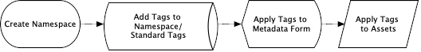
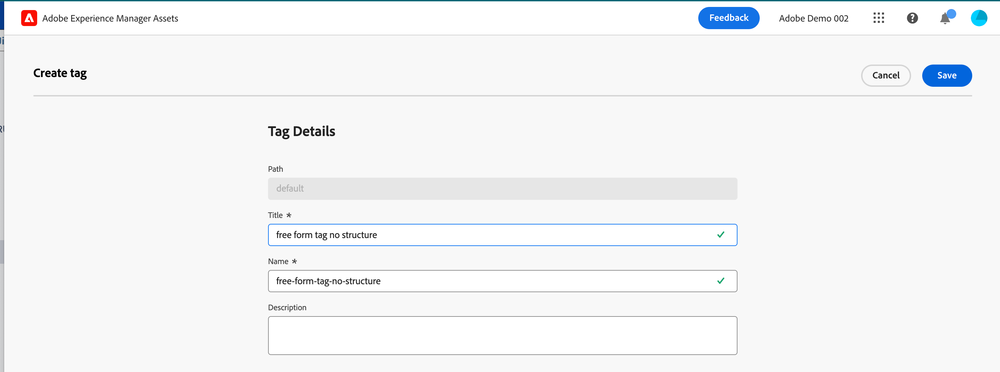

# Hantera taggar i vyn Assets {#view-assets-and-details}

| [Sök efter bästa praxis](/help/assets/search-best-practices.md) | [Metadata - bästa praxis](/help/assets/metadata-best-practices.md) | [Content Hub](/help/assets/product-overview.md) | [Dynamic Media med OpenAPI-funktioner](/help/assets/dynamic-media-open-apis-overview.md) | [AEM Assets-dokumentation för utvecklare](https://developer.adobe.com/experience-cloud/experience-manager-apis/) |
| ------------- | --------------------------- |---------|----|-----|

>[!CONTEXTUALHELP]
>id="assets_taxonomy_management"
>title="Hantera taggar"
>abstract="Taggar hjälper dig att kategorisera resurser som kan bläddras och sökas effektivare. Administratörer kan använda den hierarkiska taggningsstrukturen, som gör det lättare att använda relevanta metadata, kategorisera resurser, stödja sökning, återanvända taggar, förbättra upptäckbarheten och så vidare."

Taggar hjälper dig att kategorisera resurser som kan bläddras och sökas effektivare. Taggning hjälper till att sprida rätt taxonomi till andra användare och arbetsflöden.

Platta listor med kontrollerade vokabulärer kan bli ohanterliga över tid. Administratörer kan använda den hierarkiska taggningsstrukturen, som gör det lättare att använda relevanta metadata, kategorisera resurser, stödja sökning, återanvända taggar, förbättra upptäckbarheten och så vidare.

Du kan skapa ett namnutrymme på rotnivå och skapa en hierarkisk struktur med undertaggar i namnutrymmet. Du kan till exempel skapa ett `Activities`-namnutrymme på rotnivå och ha `Cycling`-, `Hiking`- och `Running`-taggar i namnutrymmet. Du kan ha ytterligare undertaggar `Clothing` och `Shoes` inom `Running`.

Taggning ger många fördelar, till exempel:

* Med taggning kan författare enkelt ordna olika resurser via en gemensam taxonomi. Författare kan snabbt söka efter och ordna resurser med hjälp av gemensamma taggar.

* Hierarkiska taggar är extremt flexibla och är ett utmärkt sätt att organisera termer på ett logiskt sätt. Genom namnutrymmen, taggar och undertaggar kan hela taxonomiska system representeras.

* Taggar kan utvecklas över tid när ett organisatoriska språk ändras.

* Taggar som hanteras i administrationsvyn är synkroniserade med taggar som hanteras i Assets-vyn, vilket garanterar metadatastyrning och integritet.

Om du vill kunna använda taggar på resurser måste du först skapa ett namnutrymme och sedan skapa och lägga till taggar i det. Du kan också skapa taggar och lägga till dem i ett befintligt namnutrymme. Alla taggar som du skapar på rotnivå läggs automatiskt till i namnutrymmet Standardtaggar. Du kan sedan lägga till fältet Taggar i metadataformuläret så att det visas på sidan Resursinformation. När du har konfigurerat de här inställningarna kan du börja använda taggar på resurser.

>[!NOTE]
>
>Du behöver bara lägga till fältet Taggar i metadataformuläret om du inte använder standardformuläret för metadata.

Ytterligare funktioner utöver det som nämns i den här artikeln, inklusive taggar för att sammanfoga, byta namn, lokalisera och publicera, finns tillgängliga i administrationsvyn.

## Skapa ett namnutrymme {#create-a-namespace}

Ett namnutrymme är en behållare för taggar som bara kan finnas på rotnivån. Du kan börja konfigurera den hierarkiska strukturen för taggar genom att först definiera ett logiskt namn för namnutrymmet. Om du inte lägger till någon tagg i något av de befintliga namnutrymmena, flyttas taggen automatiskt till standardtaggar.

Så här skapar du ett namnutrymme:

1. Gå till `Taxonomy Management` under `Settings` om du vill visa listan över befintliga namnutrymmen. Du kan också visa det senaste ändringsdatumet, den användare som ändrade namnutrymmet eller taggarna under det och det antal gånger som taggen används i en resurs.
1. Klicka på `Create Namespace`.
1. Lägg till `Title`, `Name` och `Description` för namnutrymmet. Indata som du anger i fältet `Title` visas högst upp i hierarkin. I följande bild refererar till exempel **Aktiviteter** till namnutrymmets namn.

   

1. Klicka på `Save`.

## Lägga till taggar i ett namnutrymme {#add-tags-to-namespace}

Utför följande steg för att lägga till taggar i ett namnutrymme:

1. Gå till **[!UICONTROL Taxonomy Management]**.
1. Markera namnutrymmet och klicka på `Create` för att skapa taggen på den översta nivån under namnutrymmet. Om du behöver skapa en undertagg under en tagg som finns i ett namnutrymme, markerar du taggen och klickar sedan på `Create`.
   

   I det här exemplet representerar bilden till vänster taggen direkt under namnutrymmet `automobile-four-wheeler` som visas i fältet `Path`. Bilden till höger är ett exempel på undertaggar som lagts till i en tagg, eftersom det finns fler taggnamn, `jeep` och `jeep-meridian`, som visas i fältet `Path` förutom namnutrymmet.
1. Ange taggens titel, namn och beskrivning och klicka på `Save`.

   >[!NOTE]
   >
   >* Fälten `Title` och `Name` är obligatoriska medan fältet `Description` är valfritt.
   >* Som standard kopierar verktyget den text du skriver i fältet Titel och tar bort blanksteg eller specialtecken (. &amp; / \ : * ? [ ] | &quot; %) och lagrar det som namn.
   >* Du kan uppdatera fältet `Title` senare, men fältet `Name` är skrivskyddat.

## Lägg till taggar i standardtaggar {#add-tags-to-standard-tags}

Ostrukturerade taggar eller taggar som inte har någon hierarki lagras under namnområdet `Standard Tags`. Om du dessutom vill lägga till ytterligare beskrivande termer utan att påverka styrd taxonomi kan du lagra det värdet under `Standard Tags`. Du kan flytta dessa värden under strukturerade namnutrymmen över tiden. Dessutom kan du använda namnutrymmet `Standard Tags` som en fri formulärpost för nyckelord.

Om du vill skapa en standardtagg klickar du på `Create Tag` på rotnivån. Ange titel, namn och beskrivning och klicka sedan på `Save`.

>[!NOTE]
>
>Om du tar bort namnområdet `Standard Tags` med Assets as a Cloud Service visas inte de taggar som skapats på rotnivån i listan med tillgängliga taggar.

## Flytta taggar {#move-tags}

Om du lagrar taggarna i fel hierarki eller om taxonomin ändras över tiden kan du flytta de markerade taggarna för att bevara dataintegriteten. Följande villkor måste beaktas när taggar flyttas:

* Taggar kan bara flyttas under befintliga namnutrymmen eller inom en befintlig tagghierarki.
* Det går inte att flytta taggar till roten för att bli ett namnområde.
* Om du flyttar en överordnad tagg flyttas även alla underordnade taggar som lagras i hierarkin.

Så här flyttar du taggar från en plats till en annan:

1. Markera taggen eller hela hierarkin med taggar under rätt namnområde och klicka på `Move`.
1. I dialogrutan Flytta väljer du den nya måltaggen eller det nya namnutrymmet med hjälp av avsnittet `Select Tag`.
1. Klicka på `Save`. Taggen visas på sin nya plats.

## Redigera taggar {#edit-tags}

Om du vill redigera taggens titel markerar du taggen och klickar på `Edit`. Ange den nya titeln och klicka på `Save`.

>[!NOTE]
>
>* Det går inte att uppdatera `Name` för en tagg. Rotsökvägen för en tagg baseras också på taggens namn. Sökvägen är densamma även om du uppdaterar fältet `Title`.
>* Ytterligare åtgärder som sammanfogning, lokalisering och publicering är tillgängliga i Assets as a Cloud Service.

## Ta bort taggar {#delete-tags}

Du kan ta bort flera namnutrymmen eller taggar samtidigt. Det går inte att ångra borttagningsåtgärden.

Så här tar du bort taggar:

1. Markera namnområdet eller taggen och klicka på `Delete`.
1. Klicka på `Confirm`.

>[!NOTE]
>
>* Om du tar bort den överordnade taggen eller namnutrymmet tas även de undertaggar som finns lagrade i hierarkin bort. Om du behöver ta bort eller uppdatera det överordnade namnutrymmet rekommenderar vi att [flytta dina taggar](#moving-tags) till det nya målet innan du tar bort den överordnade hierarkin.
>* Om du tar bort en tagg tas även alla referenser till den bort från resurser.
>* Du kan inte ta bort standardtaggar som finns på rotnivån.

## Lägg till taggar i metadataformuläret {#add-tags-to-metadata-form}

Taggkomponenten läggs automatiskt till i metadataformuläret `default`. Du kan utforma ett [metadataformulär](https://experienceleague.adobe.com/docs/experience-manager-assets-essentials/help/metadata.html?lang=en#metadata-forms) antingen med en mall eller från början. Om du inte använder någon befintlig metadatamall kan du ändra metadataformuläret och lägga till taggkomponenten. Mappningen av metadataegenskaper fylls i automatiskt och kan inte ändras just nu. [!DNL Assets as a Cloud Service]-användare kan uppdatera mappningen för att lagra taggvärden med anpassade namnutrymmen och endast visa deluppsättningar av hierarkier med hjälp av rotsökvägar.

I den här snabbvideon ser du hur du lägger till taggkomponenten i metadataformuläret:

>[!VIDEO](https://video.tv.adobe.com/v/3420452)

### Lägg till taggar i Assets {#add-tags-to-assets}

1. Gå till sidan Resursinformation och navigera till avsnittet `Tags` i metadataformuläret.
1. Välj taggväljarikonen som finns bredvid fältet Taggar eller börja skriva ett taggnamn för att se föreslagna resultat.

   

1. Markera en eller flera taggar. Undertaggen markeras automatiskt tillsammans med den överordnade taggen eller namnutrymmet.
Taggar som ändras i Assets Essentials används även i Assets as a Cloud Service.

## Lägg till taggar i blockeringslista {#blocklist-essentials}

Med [!DNL Assets view] kan du konfigurera ett blockeringslista som innehåller ord som inte ska läggas till som smarta taggar till resurser när de överförs till databasen. Med den här funktionen kan ni upprätthålla varumärkets efterlevnad och minska arbetet med att moderera smarta taggar.
<!--
### Block smart tags for single asset {#block-smart-tags-for-single-asset}

-->

### Blockera smarta taggar för alla resurser {#block-smart-tags-for-all-assets}

[!DNL Assets view] tillåter en administratör att blockera smarta taggar för befintliga och nyligen tillagda resurser. Så här blockerar du taggar:

1. Navigera till **[!UICONTROL Blocked Tags]** under **[!UICONTROL Settings]**.
1. Klicka på **[!UICONTROL Add blocked tag]**.
1. Skriv taggarna i textrutan som du vill blockera och klicka på **[!UICONTROL Enter]**.
1. När du är klar med att lägga till taggar klickar du på **[!UICONTROL Add]**. De angivna taggarna visas i listan Blockerade taggar.

   >[!NOTE]
   >
   >Du kan lägga till högst 25 taggar i listan samtidigt. Upprepa stegen för att lägga till fler taggar i blockeringslista.

Du kan också blockera smarta taggar för en enskild resurs. Navigera till information om en resurs. Ta bort de oönskade smarta taggarna under fliken **[!UICONTROL Tags]** och klicka på **[!UICONTROL Save]**. Taggarna visas i blockeringslista för den markerade resursen.

### Åtgärder som utförs på blockeringslista {#blocklist-actions}

* **Ta bort taggar:** Du kan också ta bort taggarna från blockeringslista. Markera en eller flera taggar som du vill ta bort. Klicka på **[!UICONTROL Remove]**. Du kan ta bort högst 25 taggar från listan samtidigt.
* **Markera alla:** Markera kryssrutan intill **Taggnamn** för att markera alla taggar i blockeringslista.
* **Sortering:** Du kan sortera blockeringslista i stigande eller fallande ordning. Om du vill göra det klickar du på pilen bredvid **Taggnamn**.

  

  >[!NOTE]
  >
  >Använd inte specialtecken när du lägger till en tagg i blockeringslista. Tecken som a-z, A-Z, 0-9 och - kan användas.

### Exportera blockeringslista{#export-blocklist}

I Assets-vyn kan du exportera de blockerade taggarna i listan till CSV-format. Om du vill exportera blockeringslista följer du stegen nedan:

1. Klicka på **[!UICONTROL Export as CSV]**.
1. Välj en plats där du vill spara CSV-filen. Du kan också byta namn på filen efter behov.
1. Klicka på **[!UICONTROL Save]**. Den exporterade listan i CSV-format hämtas på den valda platsen.

### Importera blockeringslista{#import-blocklist}

I Assets-vyn kan du importera blockerade taggar från en datakälla (CSV). Om du vill importera blockeringslista följer du stegen nedan:

1. Klicka på **[!UICONTROL Import as CSV]**.
1. Välj CSV-filen på enheten. Klicka på **[!UICONTROL select a file]** för att navigera till filen från din enhet. Du kan också dra och släppa CSV-filen från enheten.
1. Klicka på **[!UICONTROL Upload]**. Taggarna från CSV-filen visas i listan över blockerade taggar.

   

Om du vill hämta en blockerad taggmall följer du stegen nedan:

1. Klicka på **[!UICONTROL Download Template]**.
1. Välj en plats där du vill spara CSV-filen. Du kan också byta namn på filen efter behov.
1. Klicka på **[!UICONTROL Save]**. Mallen för blocktaggar i CSV-format hämtas på den valda platsen.
