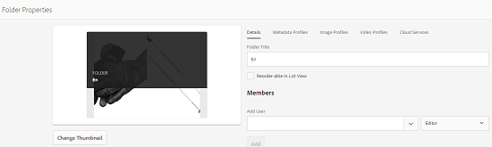
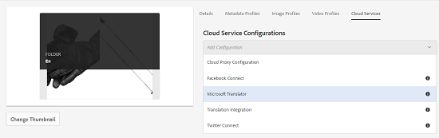
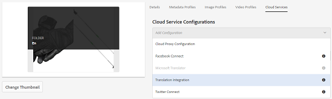
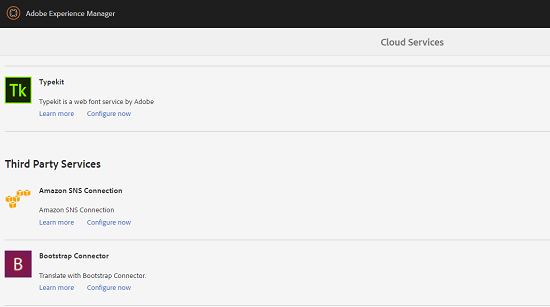
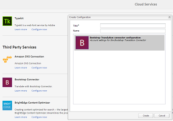
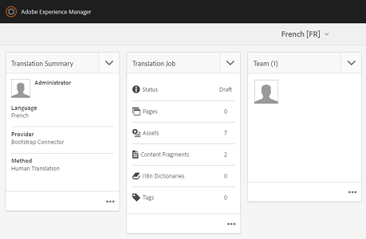

# Översätt resurser i AEM {#multilingual-assets}

| Version | Artikellänk |
| -------- | ---------------------------- |
| AEM 6.5 | [Klicka här](https://experienceleague.adobe.com/docs/experience-manager-65/assets/using/multilingual-assets.html?lang=en) |
| AEM as a Cloud Service | Den här artikeln |

Flerspråkiga resurser innebär resurser med binärfiler, metadata och taggar på flera språk. I allmänhet finns binära filer, metadata och taggar för resurser på ett språk, som sedan översätts till andra språk för användning i flerspråkiga projekt. Med Adobe Experience Manager Assets kan du automatisera arbetsflöden för att översätta resurser (inklusive binärfiler, metadata och taggar) och generera resurser på andra språk för användning i flerspråkiga projekt.

Om du vill automatisera översättningen av AEM-resurser integrerar du översättningstjänster med Experience Manager och skapar projekt för översättning av resurser till flera språk. Experience Manager har stöd för arbetsflöden för översättning till människor och datorer.

Översättning av mänskliga tillgångar i AEM: De översatta resurserna returneras och importeras till Experience Manager. När översättningsleverantören är integrerad med Experience Manager skickas resurser automatiskt mellan Experience Manager och översättningsleverantören.

Maskinresursöversättning i AEM: Maskinöversättningstjänsten översätter omedelbart metadata och taggar för resurser.

<!--
We have multiple articles around translation of assets. For now, dumping all content in this article to remove others and create only ONE UBER article.

https://experienceleague.adobe.com/docs/experience-manager-65/assets/managing/translation-projects.html
https://experienceleague.adobe.com/docs/experience-manager-65/assets/managing/preparing-assets-for-translation.html
[Apply translation cloud services to folders](https://experienceleague.adobe.com/docs/experience-manager-65/assets/managing/transition-cloud-services.html)

One of these articles is a copy of [Preparing Content for Translation](https://experienceleague.adobe.com/docs/experience-manager-65/administering/introduction/tc-prep.html

-->

<!-- 
Translating assets includes the following:

1. [Connecting Experience Manager with the translation service provider](/help/sites-administering/tc-tic.md#connecting-to-a-translation-service-provider)
1. [Creating translation integration framework configurations](/help/sites-administering/tc-tic.md)
1. [Preparing assets for translation](prepare-assets-for-translation.md)
1. [Applying translation cloud services to folders](transition-cloud-services.md)
1. [Create translation projects](translation-projects.md)

If your translation service provider does not provide a connector to integrate with Experience Manager, use an [alternative process](/help/sites-administering/tc-manage.md#exporting-a-translation-job).

Also see, [Creating translation projects for content fragments](creating-translation-projects-for-content-fragments.md).

-->

## Förbered för att översätta resurser {#prepare-to-translate-assets}

Flerspråkiga resurser innebär resurser med binärfiler, metadata och taggar på flera språk. I allmänhet finns binära filer, metadata och taggar för resurser på ett språk, som sedan översätts till andra språk för användning i flerspråkiga projekt.

I Adobe Experience Manager Assets inkluderas flerspråkiga resurser i mappar, där varje mapp innehåller resurserna på ett annat språk.

Varje språkmapp kallas för en språkkopia. Rotmappen för en språkkopia, som kallas språkrot, identifierar språket för innehållet i språkkopian. `/content/dam/it` är till exempel den italienska språkroten för den italienska språkkopian. Språkkopior måste använda en [korrekt konfigurerad språkrot](#create-a-language-root) så att rätt språk används när översättningar av källresurser utförs.

Språkkopian som du ursprungligen lade till resurser för är det primära språket. Språkets primära språk är källan som översätts till andra språk. En exempelmapphierarki innehåller flera språkrötter:

```shell
/content
    /- dam
        |- en
        |- fr
        |- de
        |- es
        |- it
        |- ja
        |- zh
```

Utför följande steg för att förbereda översättning av resurser:

1. Skapa språkroten för din primära språkversion. Språkroten för den engelska språkkopian i exempelmapphierarkin är till exempel `/content/dam/en`. Kontrollera att språkroten är korrekt konfigurerad enligt informationen i [Skapa en språkrot](#create-a-language-root).

1. Lägg till resurser i ditt primära språk.
1. Skapa språkroten för varje målspråk som du behöver en språkkopia för.

### Skapa en språkrot {#create-a-language-root}

Om du vill skapa språkroten skapar du en mapp och använder en ISO-språkkod som värde för egenskapen Namn. När du har skapat språkroten kan du skapa en språkkopia på valfri nivå i språkroten.

Rotsidan för den italienska språkkopian av exempelhierarkin har till exempel `it` som namnegenskap. Egenskapen Namn används som namn på objektnoden i databasen och avgör därför sökvägen till resurserna. (*&lt;server>:&lt;port>/assets.html/content/dam/it/*)

1. I Assets-konsolen väljer du **[!UICONTROL Create]** och sedan **[!UICONTROL Folder]** på menyn.
1. I fältet Namn skriver du landskoden i formatet `<language-code>`.
1. Välj **[!UICONTROL Create]**. Språkroten skapas i Assets-konsolen.

### Visa språkrötter {#view-language-roots}

Det pekoptimerade användargränssnittet innehåller en referenspanel som visar en lista över språkrötter som har skapats i [!DNL Assets].

1. I Assets-konsolen väljer du det språk som du vill skapa språkkopior för.
1. Markera ikonen GlobalNav och välj **[!UICONTROL References]** för att öppna referensrutan.
1. Välj **[!UICONTROL Language Copies]** i rutan Referenser. På panelen Språkkopior visas språkkopiorna för resurserna.

### Skapa ett nytt översättningsprojekt {#create-a-new-translation-project}

Om du använder det här alternativet kopieras resurser som ska översättas till språkroten för det språk som du vill översätta till. Beroende på vilka alternativ du väljer skapas ett översättningsprojekt för resurserna i projektkonsolen. Beroende på inställningarna kan översättningsprojektet startas manuellt eller automatiskt så snart översättningsprojektet skapas.

1. I Assets-användargränssnittet väljer du den källmapp som du vill skapa en språkkopia för.
1. Öppna rutan **[!UICONTROL References]** och välj **[!UICONTROL Language Copies]** under **[!UICONTROL Copies]**.
1. Välj **[!UICONTROL Create & Translate]** längst ned.
1. I listan **[!UICONTROL Target Languages]** väljer du de språk som du vill skapa en mappstruktur för.
1. Välj **[!UICONTROL Project]** i listan **[!UICONTROL Create a new translation project]**.
1. Ange en titel för projektet i fältet **[!UICONTROL Project Title]**.
1. Välj på **[!UICONTROL Create]**. Assets från källmappen kopieras till målmapparna för de språkinställningar du valde i steg 4.
1. Om du vill navigera till mappen markerar du språkkopian och klickar på **[!UICONTROL Reveal in Assets]**.
1. Navigera till projektkonsolen. Översättningsmappen kopieras till projektkonsolen.
1. Öppna mappen för att visa översättningsprojektet.
1. Välj projektet för att öppna informationssidan.
1. Om du vill visa översättningsjobbets status klickar du på ellipsen längst ned i rutan **[!UICONTROL Translation Job]**. <!-- For more details around job statuses, see [Monitoring the Status of a Translation Job](/help/sites-administering/tc-manage.md#monitoring-the-status-of-a-translation-job). -->
1. I Assets-användargränssnittet öppnar du egenskapssidan för var och en av de översatta resurserna för att visa översatta metadata.

>[!NOTE]
>
>Den här funktionen är tillgänglig både för resurser och mappar. När en resurs väljs i stället för en mapp kopieras hela mapphierarkin upp till språkroten för att skapa en språkkopia för resursen.

### Lägg till i ett befintligt översättningsprojekt {#add-to-existing-translation-project}

Om du använder det här alternativet körs översättningsarbetsflödet för resurser som du lägger till i källmappen efter att ha kört ett tidigare arbetsflöde för översättning. Endast resurser som nyligen lagts till kopieras till målmappen som innehåller tidigare översatta resurser. Inget nytt översättningsprojekt skapas i det här fallet.

1. Navigera till källmappen som innehåller oöversatta resurser i Assets-användargränssnittet.
1. Markera en resurs som du vill översätta och öppna **[!UICONTROL Reference pane]**. I avsnittet **[!UICONTROL Language Copies]** visas antalet översättningskopior som är tillgängliga.
1. Välj **[!UICONTROL Language Copies]** under **[!UICONTROL Copies]**. En lista över tillgängliga översättningskopior visas.
1. Välj **[!UICONTROL Create & Translate]** längst ned.
1. I listan **[!UICONTROL Target Languages]** väljer du de språk som du vill skapa en mappstruktur för.
1. I listan **[!UICONTROL Project]** väljer du **[!UICONTROL Add to existing translation project]** för att köra översättningsarbetsflödet för mappen.

   >[!NOTE]
   >
   >Om du väljer alternativet **[!UICONTROL Add to existing translation project]** läggs ditt översättningsprojekt till i ett befintligt projekt endast om dina projektinställningar exakt matchar inställningarna för det befintliga projektet. Annars skapas ett nytt projekt.

1. Välj ett projekt i listan **[!UICONTROL Existing translation project]** som du vill lägga till resursen för översättning.
1. Välj **[!UICONTROL Create]**. Resurserna som ska översättas läggs till i målmappen. Den uppdaterade mappen listas i avsnittet **[!UICONTROL Language Copies]**.
1. Navigera till projektkonsolen och öppna det befintliga översättningsprojektet som du har lagt till i.
1. Välj översättningsprojektvyn på sidan med projektinformation.
1. Markera ellipsen längst ned i rutan **Översättningsjobb** för att visa resurserna i översättningsarbetsflödet. I översättningsjobblistan visas även poster för metadata och taggar för resurser. Dessa poster anger att metadata och taggar för resurserna också översätts.

   >[!NOTE]
   >
   >* Om du tar bort posten för taggar eller metadata översätts inga taggar eller metadata för resurserna.
   >* Om du använder maskinöversättning översätts inte resursens binärfiler.
   >* Om den resurs som du lägger till i översättningsjobbet innehåller delresurser, markerar du delresurserna och tar bort dem för översättningen för att fortsätta utan några fel.

1. Om du vill starta översättningen för resurserna markerar du pilen på **[!UICONTROL Translation Job]**-panelen och väljer **[!UICONTROL Start]** i listan. Ett meddelande meddelar när översättningsjobbet påbörjas.
1. Om du vill visa översättningsjobbets status väljer du ellipsen längst ned i rutan **[!UICONTROL Translation Job]**. <!-- For more details, see [Monitoring the Status of a Translation Job](/help/sites-administering/tc-manage.md#monitoring-the-status-of-a-translation-job). -->
1. När översättningen är klar ändras statusen till Klart för granskning. Navigera till användargränssnittet i Assets och öppna sidan Egenskaper för vart och ett av de översatta resurserna för att visa översatta metadata.

### Uppdatera språkkopior {#update-language-copies}

Kör det här arbetsflödet för att översätta alla ytterligare resurser och inkludera dem i en språkkopia för en viss språkinställning. I det här fallet läggs de översatta resurserna till i målmappen som redan innehåller översatta resurser. Beroende på vilka alternativ du väljer skapas ett översättningsprojekt eller så uppdateras ett befintligt översättningsprojekt för de nya resurserna. Arbetsflödet för att uppdatera språkkopior innehåller följande alternativ:

* Skapa ett nytt översättningsprojekt
* Lägg till i befintligt översättningsprojekt

### Lägg till i befintligt översättningsprojekt {#add-to-existing-translation-project-1}

Om du använder det här alternativet läggs resursuppsättningen till i ett befintligt översättningsprojekt för att uppdatera språkkopian för det språkområde du väljer.

1. I Assets-gränssnittet väljer du den källmapp där du lade till en resursmapp.
1. Öppna **[!UICONTROL References pane]** och välj **[!UICONTROL Language Copies]** under **[!UICONTROL Copies]** för att visa listan med språkkopior.
1. Markera kryssrutan före **[!UICONTROL Language Copies]**, så markeras alla språkversioner. Avmarkera andra kopior än den språkkopia (kopior) som motsvarar det eller de språk som du vill översätta till.
1. Välj **[!UICONTROL Update language copies]** längst ned.
1. Välj **[!UICONTROL Add to existing translation project]** i listan **[!UICONTROL Project]**.
1. Välj ett projekt i listan **[!UICONTROL Existing translation project]** som du vill lägga till resursen för översättning.
1. Välj **[!UICONTROL Start]**.
1. Se steg 9-14 i [Lägg till i det befintliga översättningsprojektet](#add-to-existing-translation-project) för att slutföra resten av proceduren.

### Skapa tillfälliga språkkopior {#creating-temporary-language-copies}

När du kör ett översättningsarbetsflöde för att uppdatera en språkkopia med redigerade versioner av originalresurser bevaras den befintliga språkkopian tills du godkänner de översatta resurserna. [!DNL Assets] lagrar de nyligen översatta resurserna på en tillfällig plats och uppdaterar den befintliga språkkopian när du har godkänt resurserna explicit. Om du refuserar resurserna ändras inte språkkopian.

1. Markera källrotmappen under **[!UICONTROL Language Copies]** som du redan har skapat en språkkopia för och välj sedan **[!UICONTROL Reveal in Assets]** för att öppna mappen i [!DNL Assets].
1. I Assets-användargränssnittet väljer du en resurs som du redan har översatt och väljer ikonen **[!UICONTROL Edit]** i verktygsfältet för att öppna resursen i redigeringsläge.
1. Redigera resursen och spara sedan ändringarna.
1. Utför steg 2-14 i proceduren [Lägg till i befintligt översättningsprojekt](#add-to-existing-translation-project) för att uppdatera språkkopian.
1. Markera ellipsen längst ned i rutan **[!UICONTROL Translation Job]**. Från listan med resurser på sidan **[!UICONTROL Translation Job]** kan du tydligt visa den tillfälliga plats där den översatta versionen av resursen lagras.
1. Markera kryssrutan bredvid **[!UICONTROL Title]**.
1. Välj **[!UICONTROL Accept Translation]** i verktygsfältet och välj sedan **[!UICONTROL Accept]** i dialogrutan för att skriva över den översatta resursen i målmappen med den översatta versionen av den redigerade resursen.

   >[!NOTE]
   >
   >Om du vill att översättningsarbetsflödet ska kunna uppdatera målresurserna, godkänner du både resursen och metadata.

   Välj **[!UICONTROL Reject Translation]** om du vill behålla den ursprungligen översatta versionen av resursen i målspråkets rot och avvisa den redigerade versionen.

1. Navigera till Assets-konsolen och öppna sidan Egenskaper för vart och ett av de översatta resurserna för att visa översatta metadata.

<!-- TBD: Possibly this blog was not migrated. Still try to find from the author. Old one is archived at https://web.archive.org/web/20180423042713/https://blogs.adobe.com/experiencedelivers/experience-management/translate_aemassets_metadata/

For tips on translating metadata for assets efficiently, see [5 Steps to efficiently translate metadata](https://blogs.adobe.com/experiencedelivers/experience-management/translate_aemassets_metadata/). 
-->

## Skapa översättningsprojekt {#creating-translation-projects}

Om du vill skapa en språkkopia aktiverar du ett av följande språkkopieringsarbetsflöden som finns under referenspunkterna i Assets-gränssnittet:

**Skapa och översätt**

I det här arbetsflödet kopieras resurser som ska översättas till språkroten för det språk som du vill översätta till. Beroende på vilka alternativ du väljer skapas dessutom ett översättningsprojekt för resurserna i projektkonsolen. Beroende på inställningarna kan översättningsprojektet startas manuellt eller köras automatiskt så fort översättningsprojektet skapas.

**Uppdatera språkkopior**

Du kör det här arbetsflödet för att översätta ytterligare en grupp resurser och inkludera den i en språkkopia för en viss språkinställning. I det här fallet läggs de översatta resurserna till i målmappen som redan innehåller översatta resurser.

>[!NOTE]
>
>Resursbinärfiler översätts bara om översättningstjänsten stöder översättning av binärfiler.

>[!NOTE]
>
>Om du startar ett översättningsarbetsflöde för komplexa resurser, t.ex. PDF-filer och Adobe InDesign-filer, skickas inte delresurserna eller återgivningarna (om sådana finns) för översättning.

### Skapa och översätta arbetsflöde {#create-and-translate-workflow}

Du använder arbetsflödet för att skapa och översätta för att generera språkkopior för ett visst språk för första gången. Arbetsflödet innehåller följande alternativ:

* Skapa endast struktur
* Skapa ett nytt översättningsprojekt
* Lägg till i befintligt översättningsprojekt

### Skapa endast struktur {#create-structure-only}

Använd alternativet **Skapa endast struktur** om du vill skapa en målmappshierarki i målspråkets rot för att matcha källmappens hierarki i källspråkets rot. I det här fallet kopieras källresurserna till målmappen. Inget översättningsprojekt genereras emellertid.

1. I Assets-gränssnittet väljer du den källmapp som du vill skapa en struktur för i målspråkets rot.
1. Öppna rutan **[!UICONTROL References]** och välj **[!UICONTROL Language Copies]** under **[!UICONTROL Copies]**.
1. Välj **[!UICONTROL Create & Translate]** längst ned.
1. I listan **[!UICONTROL Target Languages]** väljer du det språk som du vill skapa en mappstruktur för.
1. Välj **[!UICONTROL Create structure only]** i listan **[!UICONTROL Project]**.
1. Välj **[!UICONTROL Create]**. Den nya strukturen för målspråket listas under **[!UICONTROL Language Copies]**.
1. Välj strukturen i listan och välj sedan **[!UICONTROL Reveal in Assets]** för att navigera till mappstrukturen inom målspråket.

## Tillämpa översättningsmolntjänster på mappar {#applying-translation-cloud-services-to-folders}

Med Adobe Experience Manager kan du använda molnbaserade översättningstjänster från den översättningsleverantör du väljer för att se till att dina resurser översätts baserat på dina behov.

Du kan använda översättningsmolntjänsten direkt i resursmappen så att den kan användas under översättningsarbetsflöden.

### Använda översättningstjänster {#applying-the-translation-services}

Genom att använda översättningsmolntjänster direkt i resursmappen behöver du inte konfigurera översättningstjänster när du skapar eller uppdaterar översättningsarbetsflöden.

1. I Assets-användargränssnittet väljer du den mapp som du vill använda översättningstjänster på.
1. I verktygsfältet väljer du ikonen **[!UICONTROL Properties]** för att visa sidan **[!UICONTROL Folder Properties]**.

   

1. Navigera till fliken **[!UICONTROL Cloud Services]**.
1. Välj önskad översättningsleverantör i listan Cloud Service Configurations. Om du till exempel vill använda översättningstjänster från Microsoft väljer du **[!UICONTROL Microsoft Translator]**.

   

1. Välj koppling för översättningsprovidern.

   

1. Välj **[!UICONTROL Save]** i verktygsfältet och klicka sedan på **[!UICONTROL OK]** för att stänga dialogrutan. Översättningstjänsten används i mappen.

### Använd anpassad översättningskoppling {#applying-custom-translation-connector}

Du kan använda en anpassad koppling för de översättningstjänster som du vill använda i översättningsarbetsflöden. Installera först kopplingen från [pakethanteraren](/help/implementing/developing/tools/package-manager.md) om du vill använda en anpassad koppling. Konfigurera sedan kopplingen från Cloud Services-konsolen. När du har konfigurerat kopplingen är den tillgänglig i listan över kopplingar på fliken Cloud Services som beskrivs i [Använda översättningstjänsterna](#applying-the-translation-services). När du har använt den anpassade kopplingen och kört översättningsarbetsflödena visas kopplingsinformationen under rubrikerna **[!UICONTROL Provider]** och **[!UICONTROL Method]** i rutan **[!UICONTROL Translation Summary]** för översättningsprojektet.

1. Installera kopplingen från [pakethanteraren](/help/implementing/developing/tools/package-manager.md).
1. Välj Experience Manager logotyp och gå till **[!UICONTROL Tools > Deployment > Cloud Services]**.
1. Leta upp den koppling du installerade under **[!UICONTROL Third Party Services]** på sidan **[!UICONTROL Cloud Services]**.

   

1. Klicka på länken **[!UICONTROL Configure now]** för att öppna dialogrutan **[!UICONTROL Create Configuration]**.

   

1. Ange en titel och ett namn för kopplingen och välj sedan **[!UICONTROL Create]**. Den anpassade kopplingen finns i listan över kopplingar på fliken **[!UICONTROL Cloud Services]** som beskrivs i steg 5 i [Använda översättningstjänsterna](#applying-the-translation-services).
1. Kör ett översättningsarbetsflöde som beskrivs i Skapa översättningsprojekt när du har använt den anpassade kopplingen. Kontrollera informationen om kopplingen i rutan **[!UICONTROL Translation Summary]** för översättningsprojektets på konsolen **[!UICONTROL Projects]**.

   

**Se även**

* [ASSETS HTTP API](mac-api-assets.md)
* [Filformat som stöds av Assets](file-format-support.md)
* [Sök resurser](search-assets.md)
* [Anslutna resurser](use-assets-across-connected-assets-instances.md)
* [Resursrapporter](asset-reports.md)
* [Metadata-scheman](metadata-schemas.md)
* [Hämta resurser](download-assets-from-aem.md)
* [Hantera metadata](manage-metadata.md)
* [Sök efter ansikten](search-facets.md)
* [Hantera samlingar](manage-collections.md)
* [Import av massmetadata](metadata-import-export.md)
* [Publicera Assets till AEM och Dynamic Media](/help/assets/publish-assets-to-aem-and-dm.md)
