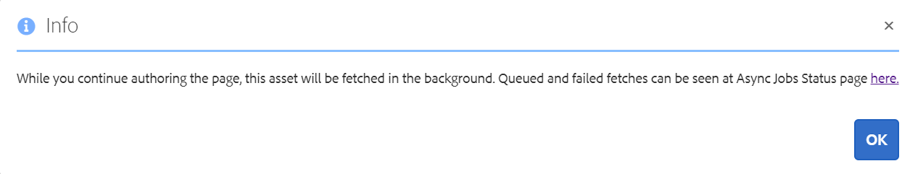

# Använd Connected Assets när du vill dela DAM-resurser i [!DNL Experience Manager Sites] {#use-connected-assets-to-share-dam-assets-in-aem-sites}

I stora företag kan den infrastruktur som krävs för att skapa webbplatser vara distribuerad. Ibland kan funktionerna för att skapa webbplatser och de digitala resurser som används för att skapa webbplatserna finnas i olika distributioner. En orsak kan vara att befintliga distributioner som behövs för att fungera tillsammans distribueras geografiskt. En annan orsak kan vara förvärv som leder till heterogen infrastruktur som moderbolaget vill använda tillsammans.

Användare kan skapa webbsidor i [!DNL Experience Manager Sites]. [!DNL Experience Manager Assets] är det DAM-system (Digital Asset Management) som tillhandahåller de resurser som krävs för webbplatser. [!DNL Experience Manager] har nu stöd för ovanstående användningsexempel genom integrering  [!DNL Sites] och  [!DNL Assets].

## Översikt över Connected Assets {#overview-of-connected-assets}

När du redigerar sidor i [!UICONTROL Page Editor] som målmål kan författarna sömlöst söka efter, bläddra bland och bädda in resurser från en annan [!DNL Assets]-distribution som fungerar som en källa för resurser. Administratörerna skapar en engångsintegrering av en distribution av [!DNL Experience Manager] med [!DNL Sites]-funktioner med en annan distribution av [!DNL Experience Manager] med [!DNL Assets]-funktioner.

För [!DNL Sites]-författare är fjärrresurserna tillgängliga som skrivskyddade lokala resurser. Funktionen stöder enkel sökning och användning av ett fåtal fjärresurser i taget. Om du vill göra många fjärrresurser tillgängliga för en [!DNL Sites]-distribution på en gång bör du överväga att migrera resurserna samtidigt.

### Förutsättningar och distributioner som stöds {#prerequisites}

Innan du använder eller konfigurerar den här funktionen bör du kontrollera följande:

* Användarna ingår i rätt användargrupper för varje distribution.
* För [!DNL Adobe Experience Manager]-distributionstyper uppfylls ett av villkoren. [!DNL Experience Manager] som en Cloud Service  [!DNL Assets] fungerar med  [!DNL Experience Manager] 6.5. Mer information om hur den här funktionen fungerar i  [!DNL Experience Manager] 6.5 finns i  [Anslutna resurser i [!DNL Experience Manager] 6.5 [!DNL Assets]](https://experienceleague.adobe.com/docs/experience-manager-65/assets/using/use-assets-across-connected-assets-instances.html).

   |  | [!DNL Sites] som  [!DNL Cloud Service] | [!DNL Experience Manager] 6.5  [!DNL Sites] på AMS | [!DNL Experience Manager] 6.5  [!DNL Sites] på plats |
   |---|---|---|---|
   | **[!DNL Experience Manager Assets]som[!DNL Cloud Service]** | Stöds | Stöds | Stöds |
   | **[!DNL Experience Manager]6.5  [!DNL Assets] på AMS** | Stöds | Stöds | Stöds |
   | **[!DNL Experience Manager]6.5  [!DNL Assets] på plats** | Stöds ej | Stöds ej | Stöds ej |

### Filformat som stöds {#mimetypes}

Författare söker efter bilder och följande typer av dokument i Content Finder och använder de sökbara resurserna i Page Editor. Dokument läggs till i `Download`-komponenten och bilder till `Image`-komponenten. Författare lägger också till fjärrresurserna i valfri anpassad [!DNL Experience Manager]-komponent som utökar standardkomponenterna för `Download` eller `Image`. De format som stöds är:

* **Bildformat**: De format som  [Image-](https://www.aemcomponents.dev/content/core-components-examples/library/page-authoring/image.html) komponenten stöder.
* **Dokumentformat**: Se vilka  [dokumentformat](file-format-support.md#document-formats) som stöds.

### Användare och grupper som krävs {#users-and-groups-involved}

De olika roller som krävs för att konfigurera och använda funktionen och motsvarande användargrupper beskrivs nedan. Lokalt omfång används för de fall där en författare skapar en webbsida. Fjärromfång används för DAM-distributionen som är värd för de nödvändiga resurserna. [!DNL Sites]-författaren hämtar dessa fjärrresurser.

| Roll | Omfång | Användargrupp | Användarnamn i genomgång | Krav |
|------|--------|-----------|-----|----------|
| [!DNL Sites] administratör | Lokalt | [!DNL Experience Manager] `administrators` | `admin` | Konfigurera [!DNL Experience Manager] och konfigurera integrering med fjärrdistributionen [!DNL Assets]. |
| DAM-användare | Lokalt | `Authors` | `ksaner` | Används för att visa och duplicera de hämtade resurserna i `/content/DAM/connectedassets/`. |
| [!DNL Sites] author | Lokalt | <ul><li>`Authors` (med läsåtkomst på fjärr-DAM och författaråtkomst lokalt  [!DNL Sites]) </li> <li>`dam-users` på lokal  [!DNL Sites]</li></ul> | `ksaner` | Slutanvändaren är [!DNL Sites]-författare som använder den här integreringen för att förbättra innehållets hastighet. Författarna söker efter och bläddrar bland resurser i fjärr-DAM med [!UICONTROL Content Finder] och använder de bilder som krävs på lokala webbsidor. Autentiseringsuppgifterna för `ksaner` DAM-användaren används. |
| [!DNL Assets] administratör | Fjärr | [!DNL Experience Manager] `administrators` | `admin` på fjärrkontrollen  [!DNL Experience Manager] | Konfigurerar CORS (Cross-Origin Resource Sharing). |
| DAM-användare | Fjärr | `Authors` | `ksaner` på fjärrkontrollen  [!DNL Experience Manager] | Författarrollen på fjärrdistributionen [!DNL Experience Manager]. Söker efter och bläddrar bland resurser i Connected Assets med hjälp av [!UICONTROL Content Finder]. |
| DAM-distributör (teknisk användare) | Fjärr | <ul> <li> [!DNL Sites] `Authors`</li> <li> `connectedassets-assets-techaccts` </li> </ul> | `ksaner` på fjärrkontrollen  [!DNL Experience Manager] | Den här användaren som finns på fjärrdistributionen används av den lokala servern [!DNL Experience Manager] (inte författarrollen [!DNL Sites]) för att hämta fjärrresurserna, för författaren [!DNL Sites]. Den här rollen är inte densamma som de två `ksaner`-rollerna ovan och den tillhör en annan användargrupp. |
| [!DNL Sites] teknisk användare | Lokalt | `connectedassets-sites-techaccts` | - | Tillåter [!DNL Assets]-distribution att söka efter referenser till resurser på [!DNL Sites]-webbsidorna. |

## Konfigurera en anslutning mellan [!DNL Sites] och [!DNL Assets] distributioner {#configure-a-connection-between-sites-and-assets-deployments}

En [!DNL Experience Manager]-administratör kan skapa den här integreringen. Behörigheterna som krävs för att använda det skapas via användargrupper när de har skapats. Användargrupperna definieras i [!DNL Sites]-distributionen och i DAM-distributionen.

Så här konfigurerar du anslutna resurser och lokal [!DNL Sites]-anslutning:

1. Åtkomst till en befintlig [!DNL Sites]-distribution. Den här [!DNL Sites]-distributionen används för att skapa webbsidor, till exempel `https://[sites_servername]:port`. När sidutvecklingen sker vid [!DNL Sites]-distributionen anropar vi [!DNL Sites]-distributionen som lokal från sidredigeringsperspektivet.

1. Åtkomst till en befintlig [!DNL Assets]-distribution. Den här [!DNL Assets]-distributionen används för att hantera digitala resurser, till exempel `https://[assets_servername]:port`.

1. Kontrollera att användare och roller med rätt omfång finns i [!DNL Sites]-distributionen och i [!DNL Assets]-distributionen på AMS. Skapa en teknisk användare av [!DNL Assets]-distributionen och lägg till i användargruppen som nämns i [användare och grupper som är inblandade](/help/assets/use-assets-across-connected-assets-instances.md#users-and-groups-involved).

1. Åtkomst till den lokala [!DNL Sites]-distributionen på `https://[sites_servername]:port`. Klicka på **[!UICONTROL Tools]** > **[!UICONTROL Assets]** > **[!UICONTROL Connected Assets Configuration]** och ange följande värden:

   1. En **[!UICONTROL Title]** av konfigurationen.
   1. **[!UICONTROL Remote DAM URL]** är URL:en för  [!DNL Assets] platsen i formatet  `https://[assets_servername]:[port]`.
   1. Autentiseringsuppgifter för en DAM-distributör (teknisk användare).
   1. I fältet **[!UICONTROL Mount Point]** anger du den lokala [!DNL Experience Manager]-sökvägen där [!DNL Experience Manager] hämtar resurserna. Till exempel, mappen `connectedassets`. Resurserna som hämtas från DAM lagras i den här mappen i [!DNL Sites]-distributionen.
   1. **[!UICONTROL Local Sites URL]** är platsen för  [!DNL Sites] distributionen. [!DNL Assets] för distribution används det här värdet för att behålla referenser till de digitala resurser som hämtas av den här  [!DNL Sites] distributionen.
   1. Autentiseringsuppgifter för den tekniska användaren [!DNL Sites].
   1. Värdet i fältet **[!UICONTROL Original Binary transfer optimization Threshold]** anger om de ursprungliga resurserna (inklusive återgivningarna) överförs synkront eller inte. Resurser med mindre filstorlek kan enkelt hämtas medan resurser med relativt större filstorlek är bäst synkroniserade asynkront. Värdet beror på dina nätverksfunktioner.
   1. Välj **[!UICONTROL Datastore Shared with Connected Assets]** om du använder ett datalager för att lagra dina resurser och datalagret är den gemensamma lagringsplatsen mellan båda distributionerna. I det här fallet spelar tröskelvärdet ingen roll eftersom faktiska tillgångsbinärfiler är tillgängliga i datalagret och inte överförs.

   

   *Bild: En typisk konfiguration för funktionen Anslutna resurser.*

1. De befintliga digitala resurserna för [!DNL Assets]-distributionen har redan bearbetats och återgivningarna genereras. Dessa återgivningar hämtas med den här funktionen så du behöver inte generera om återgivningarna. Inaktivera arbetsflödets startprogram för att förhindra återgivning av återgivningar. Justera startkonfigurationerna för ([!DNL Sites])-distributionen för att exkludera mappen `connectedassets` (resurserna hämtas i den här mappen).

   1. Vid [!DNL Sites]-distribution klickar du på **[!UICONTROL Tools]** > **[!UICONTROL Workflow]** > **[!UICONTROL Launchers]**.

   1. Sök efter startprogram med arbetsflöden som **[!UICONTROL DAM Update Asset]** och **[!UICONTROL DAM Metadata Writeback]**.

   1. Välj startprogrammet för arbetsflödet och klicka på **[!UICONTROL Properties]** i åtgärdsfältet.

   1. I guiden [!UICONTROL Properties] ändrar du fälten **[!UICONTROL Path]** som följande mappningar för att uppdatera deras reguljära uttryck så att den inte omfattar monteringspunkten **[!UICONTROL connectedassets]**.

   | Före | Efter |
   | ------ | ------------ |
   | `/content/dam(/((?!/subassets).)*/)renditions/original` | `/content/dam(/((?!/subassets)(?!connectedassets).)*/)renditions/original` |
   | `/content/dam(/.*/)renditions/original` | `/content/dam(/((?!connectedassets).)*/)renditions/original` |
   | `/content/dam(/.*)/jcr:content/metadata` | `/content/dam(/((?!connectedassets).)*/)jcr:content/metadata` |

   >[!NOTE]
   >
   >Alla återgivningar som är tillgängliga på fjärrdistributionen hämtas när författare hämtar en resurs. Om du vill skapa fler återgivningar av en hämtad resurs hoppar du över det här konfigurationssteget. Arbetsflödet [!UICONTROL DAM Update Asset] aktiveras och skapar fler återgivningar. Dessa återgivningar är bara tillgängliga på den lokala distributionen av [!DNL Sites] och inte på den fjärranslutna DAM-distributionen.

1. Lägg till [!DNL Sites]-distributionen som ett tillåtet ursprung i CORS-konfigurationen i [!DNL Assets]-distributionen. Mer information finns i [förstå CORS](https://experienceleague.adobe.com/docs/experience-manager-learn/foundation/security/understand-cross-origin-resource-sharing.html).

1. Konfigurera [stöd för samma webbplats-cookie](/help/security/same-site-cookie-support.md).

Du kan kontrollera anslutningen mellan de konfigurerade [!DNL Sites]-distributionerna och [!DNL Assets]-distributionen.

![Anslutningstest för konfigurerade  [!DNL Sites]](assets/connected-assets-multiple-config.png)
*resurser: Anslutningstest för konfigurerade anslutna resurser  [!DNL Sites].*

<!-- TBD: Check if Launchers are to be disabled on CS instances. Is this option even available to the users on CS? -->

## Konfigurera en anslutning mellan [!DNL Sites] och [!DNL Dynamic Media] distributioner {#sites-dynamic-media-connected-assets}

Du kan konfigurera en anslutning mellan [!DNL Sites]-distribution och [!DNL Dynamic Media]-distribution som tillåter webbsideförfattare att använda [!DNL Dynamic Media]-bilder på sina webbsidor. När du skapar webbsidor är upplevelsen av att använda fjärrresurser och fjärdistributioner av [!DNL Dynamic Media] densamma. Detta gör att du kan använda funktionen [!DNL Dynamic Media] via funktionen Anslutna resurser, till exempel smarta beskärnings- och bildförinställningar.

Följ de här stegen för att konfigurera anslutningen.

1. Skapa konfiguration för anslutna resurser enligt beskrivningen ovan. Välj alternativet **[!UICONTROL Fetch original rendition for Dynamic Media Connected Assets]** när du konfigurerar funktionen.

1. Konfigurera [!DNL Dynamic Media] på lokala [!DNL Sites]- och fjärdistributioner av [!DNL Assets]. Följ instruktionerna för att [konfigurera [!DNL Dynamic Media]](/help/assets/dynamic-media/config-dm.md#configuring-dynamic-media-cloud-services).

   * Använd samma företagsnamn i alla konfigurationer.
   * På lokal [!DNL Sites] i [!UICONTROL Dynamic Media sync mode] väljer du **[!UICONTROL Disabled by default]**. Platsdistributionen behöver bara skrivskyddad åtkomst till [!DNL Dynamic Media]-kontot.
   * Välj **[!UICONTROL Selective Publish]** i alternativet **[!UICONTROL Publish Assets]** på lokal [!DNL Sites]. Välj inte **[!UICONTROL Sync All Content]**.
   * På fjärrdistributionen [!DNL Assets] i [!UICONTROL Dynamic Media sync mode] väljer du **[!UICONTROL Enabled by default]**.

1. Aktivera [[!DNL Dynamic Media] stöd i Image Core Component](https://experienceleague.adobe.com/docs/experience-manager-core-components/using/components/image.html#dynamic-media). Med den här funktionen aktiveras [Image component](https://www.aemcomponents.dev/content/core-components-examples/library/page-authoring/image.html) som standard att visa [!DNL Dynamic Media]-bilder när [!DNL Dynamic Media]-bilder används av författare på webbsidor i lokal [!DNL Sites]-distribution.

## Använda fjärresurser {#use-remote-assets}

Webbplatsens författare använder Content Finder för att ansluta till DAM-distributionen. Författarna kan bläddra bland, söka efter och dra fjärresurserna till en komponent. Om du vill autentisera med DAM-fjärrdistributionen bör du ha DAM-användarens autentiseringsuppgifter som du fått av administratören till hands.

Författare kan använda resurserna som finns på den lokala DAM-resursen och den fjärranslutna DAM-distributionen på en enda webbsida. Använd Content Finder för att växla mellan att söka i det lokala DAM-systemet eller söka i det fjärranslutna DAM-systemet.

Endast de taggar för fjärrresurser som har en exakt motsvarande tagg tillsammans med samma taxonomihierarki, som är tillgängliga för den lokala [!DNL Sites]-distributionen, hämtas. Alla andra taggar tas bort. Författare kan söka efter fjärrresurser med hjälp av alla taggar som finns i fjärrdistributionen [!DNL Experience Manager], eftersom det ger en fulltextsökning.

### Genomgång av användningen {#walk-through-of-usage}

Använd konfigurationen ovan när du vill prova redigeringsfunktionen och se hur den fungerar. Använd de dokument eller bilder du vill ha på den fjärranslutna DAM-distributionen.

1. Navigera till gränssnittet [!DNL Assets] i fjärrdistributionen genom att gå till **[!UICONTROL Assets]** > **[!UICONTROL Files]** från arbetsytan [!DNL Experience Manager]. Du kan även få åtkomst till `https://[assets_servername_ams]:[port]/assets.html/content/dam` i en webbläsare. Ladda upp de resurser du vill ha.
1. I [!DNL Sites]-distributionen klickar du på **[!UICONTROL Impersonate as]** i profilaktiveraren i det övre högra hörnet. Ange `ksaner` som användarnamn, markera det angivna alternativet och klicka på **[!UICONTROL OK]**.
1. Öppna en We.Retail-webbsida på **[!UICONTROL Sites]** > **[!UICONTROL We.Retail]** > **[!UICONTROL us]** > **[!UICONTROL en]**. Redigera sidan. Du kan även öppna `https://[aem_server]:[port]/editor.html/content/we-retail/us/en/men.html` i en webbläsare när du vill redigera en sida.

   Klicka på **[!UICONTROL Toggle Side Panel]** överst till vänster på sidan.

1. Öppna fliken [!UICONTROL Assets] och klicka på **[!UICONTROL Log in to Connected Assets]**.
1. Ange inloggningsuppgifterna, `ksaner` som användarnamn och `password` som lösenord. Den här användaren har redigeringsbehörighet för båda [!DNL Experience Manager]-distributionerna.
1. Sök efter resursen som du har lagt till i DAM. Fjärresurserna visas i den vänstra panelen. Filtrera efter bilder eller dokument och filtrera efter olika typer av dokument som stöds. Dra bilderna till en `Image`-komponent och dokument till en `Download`-komponent.

   De hämtade resurserna är skrivskyddade i den lokala [!DNL Sites]-distributionen. Du kan fortfarande använda alternativen i dina [!DNL Sites]-komponenter för att redigera den hämtade resursen. Redigering med komponenter är icke-destruktiv.

   

   *Bild: Alternativ för att filtrera dokumenttyper och bilder vid sökning efter resurser på DAM-fjärrdistribution.*

1. En Sites-författare meddelas om en resurs hämtas asynkront och om en hämtningsåtgärd misslyckas. Under utvecklingen eller även efter redigeringen kan författarna se detaljerad information om hämtningsuppgifter och fel i användargränssnittet [asynkrona jobb](/help/operations/asynchronous-jobs.md).

   

   *Bild: Meddelande om asynkron hämtning av resurser som sker i bakgrunden.*

1. När du publicerar en sida visar [!DNL Experience Manager] en fullständig lista över resurser som används på sidan. Kontrollera att fjärresurserna har hämtats vid publiceringen. Om du vill kontrollera statusen för varje hämtad resurs läser du [asynkrona jobb](/help/operations/asynchronous-jobs.md) användargränssnitt.

   >[!NOTE]
   >
   >Sidan publiceras även om en eller flera fjärresurser inte hämtats. Komponenten som använder fjärresursen publiceras tom. I meddelandefältet [!DNL Experience Manager] visas ett meddelande om fel som visas på sidan för asynkrona jobb.

>[!CAUTION]
>
>När de hämtade fjärrresurserna har använts på en webbsida är de sökbara och användbara för alla som har behörighet att komma åt den lokala mappen. De hämtade resurserna lagras i den lokala mappen (`connectedassets` i ovanstående genomgång). Resurserna är också sökbara och synliga i det lokala datalagret via [!UICONTROL Content Finder].

De hämtade resurserna kan användas som andra lokala resurser, förutom att associerade metadata inte kan redigeras.

### Kontrollera användning av en resurs på webbsidor {#asset-usage-references}

[!DNL Experience Manager] gör att DAM-användare kan kontrollera alla referenser till en resurs. Det hjälper till att förstå och hantera användningen av en resurs i fjärr-[!DNL Sites] och i sammansatta resurser. Många som skapar webbsidor på [!DNL Experience Manager Sites]-distributioner kan använda en resurs på en [!DNL Assets]-fjärrplats på olika webbsidor. För att förenkla resurshanteringen och inte leda till brutna referenser är det viktigt för DAM-användarna att kontrollera användningen av en resurs på lokala webbplatser och fjärrwebbsidor. På fliken [!UICONTROL References] på sidan [!UICONTROL Properties] för en resurs visas lokala referenser och fjärrreferenser för resursen.

Följ de här stegen för att visa och hantera referenser i [!DNL Assets]-distributionen:

1. Välj en resurs i [!DNL Assets]-konsolen och klicka på **[!UICONTROL Properties]** i verktygsfältet.
1. Klicka på fliken **[!UICONTROL References]**. Se **[!UICONTROL Local References]** om du vill använda resursen i [!DNL Assets]-distributionen. Se **[!UICONTROL Remote References] om du vill använda resursen i [!DNL Sites]-distributionen där resursen hämtades med hjälp av funktionen Anslutna resurser.

   

1. Referenserna för [!DNL Sites]-sidor visar totalt antal referenser för varje lokal [!DNL Sites]. Det kan ta en stund att hitta alla referenser och visa det totala antalet referenser.
1. Listan med referenser är interaktiv och DAM-användare kan klicka på en referens för att öppna referenssidan. Om fjärrreferenser av någon anledning inte kan hämtas visas ett meddelande som informerar användaren om felet.
1. Användare kan flytta eller ta bort resursen. När du flyttar eller tar bort en resurs visas det totala antalet referenser för alla markerade resurser/mappar i en varningsdialogruta. När du tar bort en resurs för vilken referenser ännu inte visas visas en varningsdialogruta.

   

## Begränsningar och bästa praxis {#tip-and-limitations}

* Konfigurera funktionen [Asset Insight](/help/assets/assets-insights.md) i [!DNL Sites]-instansen för att få information om resursanvändning.

### Behörigheter och resurshantering {#permissions-and-managing-assets}

* Lokala resurser synkroniseras inte med de ursprungliga resurserna i fjärrdistributionen. Ändringar, borttagningar eller återkallande av behörigheter i DAM-distributionen sprids inte längre ned i kedjan.
* Lokala resurser är skrivskyddade kopior. [!DNL Experience Manager] -komponenter gör icke-förstörande redigeringar av resurser. Inga andra redigeringar tillåts.
* Lokalt hämtade resurser är endast tillgängliga för redigeringsändamål. Det går inte att använda arbetsflöden för resursuppdatering och metadata kan inte redigeras.
* Endast bilder och dokumentformaten i listan stöds. Innehållsfragment och Experience Fragments stöds inte.
* [!DNL Experience Manager] hämtar inte metadatamatcheman. Det innebär att alla hämtade metadata inte visas. Om schemat uppdateras separat visas alla egenskaper.
* Alla [!DNL Sites]-författare har läsbehörighet för de hämtade kopiorna, även om författare inte har åtkomst till fjärr-DAM-distributionen.
* Det finns inte API-stöd för att anpassa integreringen.
* Funktionen stöder smidig sökning och användning av fjärresurser. Om du vill göra många fjärresurser tillgängliga i den lokala distributionen på en gång bör du överväga att migrera resurserna.
* Det går inte att använda en fjärrresurs som sidminiatyr i [!UICONTROL Page Properties]-användargränssnittet. Du kan ange en miniatyrbild för en webbsida i [!UICONTROL Page Properties]-användargränssnittet från [!UICONTROL Thumbnail] genom att klicka på [!UICONTROL Select Image].

### Konfigurera och licensiera {#setup-licensing}

* [!DNL Assets] det  [!DNL Adobe Managed Services] finns stöd för distribution på.
* [!DNL Sites] kan ansluta till en enda  [!DNL Assets] databas åt gången.
* En licens för [!DNL Assets] som fungerar som fjärrdatabas.
* En eller flera licenser av [!DNL Sites] fungerar som lokal redigeringsdistribution.

### Användning {#usage}

* Användare kan söka efter fjärrresurser och dra dem på den lokala sidan när de redigerar. Inga andra funktioner stöds.
* Tidsgränsen för hämtning är 5 sekunder. Författare kan ha problem med att hämta resurser, till exempel om det råder nätverksproblem. Författare kan försöka igen genom att dra fjärrresursen från [!UICONTROL Content Finder] till [!UICONTROL Page Editor].
* Enkla redigeringar som är icke-destruktiva och redigering som stöds via `Image`-komponenten kan tillämpas på hämtade resurser. Resurserna är skrivskyddade.
* Det enda sättet att hämta resursen på nytt är att dra den till en sida. Det finns inget API-stöd eller andra metoder för att hämta om en resurs för att uppdatera den.
* Om resurser tas bort från DAM används de fortfarande på [!DNL Sites]-sidor.
* Fjärrreferensposterna för en resurs hämtas asynkront. Referenserna och det totala antalet är inte i realtid och det kan vara en skillnad om en webbplatsförfattare använder resursen medan en DAM-användare visar referensen. DAM-användare kan uppdatera sidan och försöka igen om några minuter för att få fram det totala antalet.

## Felsöka problem {#troubleshoot}

Följ de här stegen för att felsöka vanliga fel:

* Om du inte kan söka efter fjärrresurser från [!UICONTROL Content Finder] kontrollerar du att de roller och behörigheter som krävs finns på plats.

* En resurs som hämtats från fjärr-DAM kanske inte publiceras på en webbsida av en eller flera orsaker. Den finns inte på fjärrservern, saknar behörighet att hämta den eller så kan nätverksfel vara orsaken. Se till att resursen inte tas bort från fjärr-DAM. Se till att rätt behörigheter finns och att kraven är uppfyllda. Försök lägga till resursen på sidan igen och publicera den på nytt. Kontrollera i [listan över asynkrona jobb](/help/operations/asynchronous-jobs.md) om fel uppstod vid hämtning av resurser.

* Om du inte kan komma åt fjärr-DAM-distributionen från den lokala [!DNL Sites]-distributionen kontrollerar du att cookies mellan platser tillåts och att [stöd för samma webbplats-cookies](/help/security/same-site-cookie-support.md) är konfigurerat. Om cookies mellan platser blockeras kanske inte distributionerna av [!DNL Experience Manager] autentiseras. [!DNL Google Chrome] i Incognito-läge kan till exempel blockera cookies från tredje part. Om du vill tillåta cookies i [!DNL Chrome]-webbläsaren klickar du på ögonikonen i adressfältet, navigerar till **Webbplatsen fungerar inte** > **Blockerad**, väljer fjärr-DAM-URL:en och tillåter inloggningstokcookie. Du kan även läsa [om hur du aktiverar cookies](https://support.google.com/chrome/answer/95647) från tredje part.

   

* Om fjärrreferenser inte hämtas och leder till ett felmeddelande, kontrollerar du om [!DNL Sites]-distributionen är tillgänglig och söker efter nätverksanslutningsproblem. Försök igen senare för att kontrollera. [!DNL Assets] Två försök görs att upprätta en anslutning till  [!DNL Sites] distributionen och ett fel rapporteras sedan.

   
