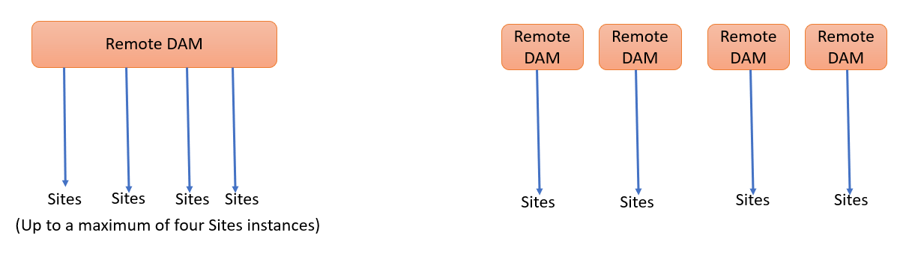

# Använd Connected Assets när du vill dela DAM-resurser i [!DNL Experience Manager Sites] {#use-connected-assets-to-share-dam-assets-in-aem-sites}

I stora företag kan den infrastruktur som krävs för att skapa webbplatser vara distribuerad. Ibland kan funktionerna för att skapa webbplatser och de digitala resurser som används för att skapa webbplatserna finnas i olika distributioner. En orsak kan vara att befintliga distributioner som krävs för att fungera tillsammans distribueras geografiskt. En annan orsak kan vara förvärv som leder till heterogen infrastruktur, inklusive olika [!DNL Experience Manager] versioner som huvudföretaget vill använda tillsammans.

Funktionen för anslutna resurser har stöd för ovanstående användningsfall genom att integrera [!DNL Experience Manager Sites] och [!DNL Experience Manager Assets]. Användare kan skapa webbsidor i [!DNL Sites] som använder digitala resurser från en separat [!DNL Assets] distributioner.

## Översikt över Connected Assets {#overview-of-connected-assets}

Vid redigering av sidor i [!UICONTROL Page Editor] som målmål kan författarna söka, bläddra bland och bädda in resurser från ett annat [!DNL Assets] driftsättning som fungerar som en källa till resurser. Administratörerna skapar en engångsintegrering av en distribution av [!DNL Experience Manager] med [!DNL Sites] med en annan driftsättning av [!DNL Experience Manager] med [!DNL Assets] funktioner. Du kan också använda Dynamic Media-bilder på webbplatsens webbsidor med hjälp av Anslutna resurser och använda Dynamic Media-funktionerna, till exempel smarta beskärnings- och bildförinställningar.

För [!DNL Sites] författare är fjärrresurserna tillgängliga som skrivskyddade lokala resurser. Funktionen stöder enkel sökning och användning av ett fåtal fjärresurser i taget. Göra många fjärrresurser tillgängliga på en [!DNL Sites] -distribution i en enda gång, överväg att migrera resurser i flera steg.

### Förutsättningar och distributioner som stöds {#prerequisites}

Innan du använder eller konfigurerar den här funktionen bör du kontrollera följande:

* Användarna ingår i rätt användargrupper för varje distribution.
* För [!DNL Adobe Experience Manager] distributionstyper, ett av villkoren är uppfyllt. [!DNL Experience Manager] as a Cloud Service [!DNL Assets] fungerar med [!DNL Experience Manager] 6.5. Mer information om hur den här funktionen fungerar i [!DNL Experience Manager] 6.5, se [Anslutna resurser i [!DNL Experience Manager] 6.5 [!DNL Assets]](https://experienceleague.adobe.com/docs/experience-manager-65/assets/using/use-assets-across-connected-assets-instances.html).

   |  | [!DNL Sites] som [!DNL Cloud Service] | [!DNL Experience Manager] 6.5 [!DNL Sites] på AMS | [!DNL Experience Manager] 6.5 [!DNL Sites] lokal |
   |---|---|---|---|
   | **[!DNL Experience Manager Assets]som[!DNL Cloud Service]** | Stöds | Stöds | Stöds |
   | **[!DNL Experience Manager]6.5 [!DNL Assets] på AMS** | Stöds | Stöds | Stöds |
   | **[!DNL Experience Manager]6.5 [!DNL Assets] lokal** | Stöds ej | Stöds ej | Stöds ej |

### Filformat som stöds {#mimetypes}

Författare söker efter bilder och följande typer av dokument i Content Finder och använder de sökbara resurserna i Page Editor. Dokument läggs till i `Download` och bilder till `Image` -komponenten. Författare lägger även till fjärrresurserna i alla anpassade [!DNL Experience Manager] som utökar standardkomponenten `Download` eller `Image` -komponenter. De format som stöds är:

* **Bildformat**: Formaten som [Bildkomponent](https://www.aemcomponents.dev/content/core-components-examples/library/page-authoring/image.html) stöder.
* **Dokumentformat**: Se [dokumentformat som stöds](file-format-support.md#document-formats).

### Användare och grupper som krävs {#users-and-groups-involved}

De olika roller som krävs för att konfigurera och använda funktionen och motsvarande användargrupper beskrivs nedan. Lokalt omfång används för de fall där en författare skapar en webbsida. Fjärromfång används för DAM-distributionen som är värd för de nödvändiga resurserna. The [!DNL Sites] författaren hämtar dessa fjärrresurser.

| Roll | Omfång | Användargrupp | Användarnamn i genomgång | Krav |
|------|--------|-----------|-----|----------|
| [!DNL Sites] administratör | Lokalt | [!DNL Experience Manager] `administrators` | `admin` | Konfigurera [!DNL Experience Manager] och konfigurera integrering med fjärrkontrollen [!DNL Assets] distribution. |
| DAM-användare | Lokalt | `Authors` | `ksaner` | Används för att visa och duplicera de hämtade resurserna i `/content/DAM/connectedassets/`. |
| [!DNL Sites] author | Lokalt | <ul><li>`Authors` (med läsåtkomst på fjärr-DAM och författaråtkomst på lokal [!DNL Sites]) </li> <li>`dam-users` på lokal [!DNL Sites]</li></ul> | `ksaner` | Slutanvändarna är [!DNL Sites] författare som använder den här integreringen för att förbättra innehållets hastighet. Författare kan söka efter och bläddra bland resurser i fjärr-DAM med [!UICONTROL Content Finder] och använda de bilder som behövs på lokala webbsidor. Autentiseringsuppgifterna för `ksaner` DAM-användaren används. |
| [!DNL Assets] administratör | Fjärr | [!DNL Experience Manager] `administrators` | `admin` på fjärrkontrollen [!DNL Experience Manager] | Konfigurerar CORS (Cross-Origin Resource Sharing). |
| DAM-användare | Fjärr | `Authors` | `ksaner` på fjärrkontrollen [!DNL Experience Manager] | Författarroll på fjärrkontrollen [!DNL Experience Manager] distribution. Söker efter och bläddrar bland resurser i Connected Assets med hjälp av [!UICONTROL Content Finder]. |
| DAM-distributör (teknisk användare) | Fjärr | <ul> <li> [!DNL Sites] `Authors`</li> <li> `connectedassets-assets-techaccts` </li> </ul> | `ksaner` på fjärrkontrollen [!DNL Experience Manager] | Den här användaren som finns på fjärrdistributionen används av [!DNL Experience Manager] lokal server (inte [!DNL Sites] författarroll) för att hämta fjärrresurserna, för [!DNL Sites] författare. Den här rollen är inte densamma som de två `ksaner`-rollerna ovan och den tillhör en annan användargrupp. |
| [!DNL Sites] teknisk användare | Lokalt | `connectedassets-sites-techaccts` | - | Tillåter [!DNL Assets] distribution för att söka efter referenser till resurser i [!DNL Sites] webbsidor. |

### Arkitektur för anslutna resurser {#connected-assets-architecture}

Med Experience Manager kan du ansluta en fjärrdistribution av DAM som en källa till flera Experience Manager Sites-distributioner. Du kan ansluta högst fyra Sites-distributioner till en källfjärransluten DAM. Du kan dock ansluta en platsdistribution med endast en fjärr-DAM-distribution.

Följande diagram visar vilka scenarier som stöds:

I följande diagram visas ett scenario som inte stöds:

## Konfigurera en anslutning mellan [!DNL Sites] och [!DNL Assets] distributioner {#configure-a-connection-between-sites-and-assets-deployments}

An [!DNL Experience Manager] administratören kan skapa den här integreringen. Behörigheterna som krävs för att använda det skapas via användargrupper när de har skapats. Användargrupperna definieras på [!DNL Sites] driftsättning och driftsättning av DAM.

Konfigurera anslutna resurser och lokala [!DNL Sites] anslutning, följ dessa steg:

1. Åtkomst till en befintlig [!DNL Sites] distribution. Detta [!DNL Sites] används för att skapa webbsidor, till exempel på `https://[sites_servername]:port`. Under utvecklingen [!DNL Sites] distribution, låt oss ringa [!DNL Sites] som lokal från sidutvecklingsperspektivet.

1. Åtkomst till en befintlig [!DNL Assets] distribution. Detta [!DNL Assets] används för att hantera digitala resurser, till exempel `https://[assets_servername]:port`.

1. Se till att användare och roller med rätt omfång finns på [!DNL Sites] distribution och [!DNL Assets] driftsättning på AMS. Skapa en teknisk användare på [!DNL Assets] distribution och tillägg till användargruppen som anges i [berörda användare och grupper](/help/assets/use-assets-across-connected-assets-instances.md#users-and-groups-involved).

1. Åtkomst till lokala [!DNL Sites] distribution på `https://[sites_servername]:port`. Klicka på **[!UICONTROL Tools]** > **[!UICONTROL Assets]** > **[!UICONTROL Connected Assets Configuration]** och ange följande värden:

   1. A **[!UICONTROL Title]** av konfigurationen.
   1. **[!UICONTROL Remote DAM URL]** är URL:en för [!DNL Assets] plats i formatet `https://[assets_servername]:[port]`.
   1. Autentiseringsuppgifter för en DAM-distributör (teknisk användare).
   1. I **[!UICONTROL Mount Point]** anger du lokala [!DNL Experience Manager] sökväg där [!DNL Experience Manager] hämtar resurserna. Till exempel, mappen `connectedassets`. Resurserna som hämtas från DAM lagras i den här mappen på [!DNL Sites] distribution.
   1. **[!UICONTROL Local Sites URL]** är platsen för [!DNL Sites] distribution. [!DNL Assets] för distribution används det här värdet för att behålla referenser till de digitala resurserna som hämtas av det här [!DNL Sites] distribution.
   1. Autentiseringsuppgifter för [!DNL Sites] teknisk användare.
   1. Värdet för **[!UICONTROL Original Binary transfer optimization Threshold]** anges om de ursprungliga resurserna (inklusive återgivningarna) överförs synkront eller inte. Resurser med mindre filstorlek kan enkelt hämtas medan resurser med relativt större filstorlek är bäst synkroniserade asynkront. Värdet beror på dina nätverksfunktioner.
   1. Välj **[!UICONTROL Datastore Shared with Connected Assets]**, om du använder ett datalager för att lagra dina resurser och datalagret är den gemensamma lagringsplatsen mellan båda distributionerna. I det här fallet spelar tröskelvärdet ingen roll eftersom faktiska tillgångsbinärfiler är tillgängliga i datalagret och inte överförs.

   

   *Bild: En typisk konfiguration för funktionen Anslutna resurser.*

1. Befintliga digitala resurser på [!DNL Assets] distributionen har redan bearbetats och återgivningarna genereras. Dessa återgivningar hämtas med den här funktionen så du behöver inte generera om återgivningarna. Inaktivera arbetsflödets startprogram för att förhindra återgivning av återgivningar. Justera startkonfigurationerna på ([!DNL Sites]) distribution för att exkludera `connectedassets` (resurserna hämtas i den här mappen).

   1. På [!DNL Sites] distribution, klicka **[!UICONTROL Tools]** > **[!UICONTROL Workflow]** > **[!UICONTROL Launchers]**.

   1. Sök efter startprogram med arbetsflöden som **[!UICONTROL DAM Update Asset]** och **[!UICONTROL DAM Metadata Writeback]**.

   1. Välj startprogrammet för arbetsflödet och klicka på **[!UICONTROL Properties]** i åtgärdsfältet.

   1. I [!UICONTROL Properties] guide, ändra **[!UICONTROL Path]** fält som följande mappningar för att uppdatera deras reguljära uttryck för att utesluta monteringspunkten **[!UICONTROL connectedassets]**.

   | Före | Efter |
   | ------ | ------------ |
   | `/content/dam(/((?!/subassets).)*/)renditions/original` | `/content/dam(/((?!/subassets)(?!connectedassets).)*/)renditions/original` |
   | `/content/dam(/.*/)renditions/original` | `/content/dam(/((?!connectedassets).)*/)renditions/original` |
   | `/content/dam(/.*)/jcr:content/metadata` | `/content/dam(/((?!connectedassets).)*/)jcr:content/metadata` |

   >[!NOTE]
   >
   >Alla återgivningar som är tillgängliga på fjärrdistributionen hämtas när författare hämtar en resurs. Om du vill skapa fler återgivningar av en hämtad resurs hoppar du över det här konfigurationssteget. The [!UICONTROL DAM Update Asset] arbetsflödet aktiveras och skapar fler återgivningar. Dessa återgivningar är bara tillgängliga på den lokala [!DNL Sites] och inte på fjärrdistributionen av DAM.

1. Lägg till [!DNL Sites] distribution som ett tillåtet ursprung i CORS-konfigurationen på [!DNL Assets] distribution. Mer information finns i [förstå CORS](https://experienceleague.adobe.com/docs/experience-manager-learn/foundation/security/understand-cross-origin-resource-sharing.html).

1. Konfigurera [Stöd för samma webbplats-cookie](/help/security/same-site-cookie-support.md).

Du kan kontrollera anslutningen mellan de konfigurerade [!DNL Sites] driftsättning och [!DNL Assets] distribution.

![Anslutningstest för konfigurerade anslutna resurser [!DNL Sites]](assets/connected-assets-multiple-config.png)
*Bild: Anslutningstest för konfigurerade anslutna resurser [!DNL Sites].*

<!-- TBD: Check if Launchers are to be disabled on CS instances. Is this option even available to the users on CS? -->

## Konfigurera en anslutning mellan [!DNL Sites] och [!DNL Dynamic Media] distributioner {#sites-dynamic-media-connected-assets}

Du kan konfigurera en anslutning mellan [!DNL Sites] driftsättning och [!DNL Dynamic Media] distribution som tillåter webbsideskonstruktörer att använda [!DNL Dynamic Media] bilder på sina webbsidor. När du skapar webbsidor är upplevelsen av att använda fjärrresurser och fjärranslutna resurser [!DNL Dynamic Media] distributioner förblir desamma. På så sätt kan du utnyttja [!DNL Dynamic Media] via funktionen Anslutna resurser, till exempel smarta beskärnings- och bildförinställningar.

Så här konfigurerar du anslutningen:

1. Skapa konfiguration för anslutna resurser enligt beskrivningen ovan, förutom när du konfigurerar funktionen, välj **[!UICONTROL Fetch original rendition for Dynamic Media Connected Assets]** alternativ.

1. Konfigurera [!DNL Dynamic Media] på lokal [!DNL Sites] och fjärranslutning [!DNL Assets] distributioner. Följ instruktionerna för att [konfigurera [!DNL Dynamic Media]](/help/assets/dynamic-media/config-dm.md#configuring-dynamic-media-cloud-services).

   * Använd samma företagsnamn i alla konfigurationer.
   * På lokal [!DNL Sites], in [!UICONTROL Dynamic Media sync mode], markera **[!UICONTROL Disabled by default]**. The [!DNL Sites] distributionen endast behöver skrivskyddad åtkomst till [!DNL Dynamic Media] konto.
   * På lokal [!DNL Sites], i **[!UICONTROL Publish Assets]** alternativ, markera **[!UICONTROL Selective Publish]**. Markera inte **[!UICONTROL Sync All Content]**.
   * På fjärrkontrollen [!DNL Assets] distribution, in [!UICONTROL Dynamic Media sync mode], markera **[!UICONTROL Enabled by default]**.

1. Aktivera [[!DNL Dynamic Media] stöd i Image Core Component](https://experienceleague.adobe.com/docs/experience-manager-core-components/using/components/image.html#dynamic-media). Den här funktionen aktiverar standardinställningen [Bildkomponent](https://www.aemcomponents.dev/content/core-components-examples/library/page-authoring/image.html) att visa [!DNL Dynamic Media] bilder när [!DNL Dynamic Media] bilder används av författare på webbsidor på lokala [!DNL Sites] distribution.

## Använda fjärresurser {#use-remote-assets}

Webbplatsens författare använder Content Finder för att ansluta till DAM-distributionen. Författarna kan bläddra bland, söka efter och dra fjärresurserna till en komponent. Om du vill autentisera med DAM-fjärrdistributionen bör du ha DAM-användarens autentiseringsuppgifter som du fått av administratören till hands.

Författare kan använda resurserna som finns på den lokala DAM-resursen och den fjärranslutna DAM-distributionen på en enda webbsida. Använd Content Finder för att växla mellan att söka i det lokala DAM-systemet eller söka i det fjärranslutna DAM-systemet.

Endast de taggar för fjärrresurser som har en exakt motsvarande tagg tillsammans med samma taxonomihierarki, som finns på den lokala [!DNL Sites] distribution. Alla andra taggar tas bort. Författare kan söka efter fjärrresurser med hjälp av alla taggar som finns på fjärrkontrollen [!DNL Experience Manager] driftsättning eftersom den erbjuder fulltextsökning.

### Genomgång av användningen {#walk-through-of-usage}

Använd konfigurationen ovan när du vill prova redigeringsfunktionen och se hur den fungerar. Använd de dokument eller bilder du vill ha på den fjärranslutna DAM-distributionen.

1. Navigera till [!DNL Assets] -gränssnittet på fjärrdistributionen genom åtkomst **[!UICONTROL Assets]** > **[!UICONTROL Files]** från [!DNL Experience Manager] arbetsyta. Du kan även få åtkomst till `https://[assets_servername_ams]:[port]/assets.html/content/dam` i en webbläsare. Ladda upp de resurser du vill ha.

1. På [!DNL Sites] distribution, i profilaktiveraren i det övre högra hörnet, klicka på **[!UICONTROL Impersonate as]**. Ange `ksaner` som användarnamn, markera det angivna alternativet och klicka på **[!UICONTROL OK]**.

1. Öppna en `We.Retail` webbplats på **[!UICONTROL Sites]** > **[!UICONTROL We.Retail]** > **[!UICONTROL us]** > **[!UICONTROL en]**. Redigera sidan. Du kan även öppna `https://[aem_server]:[port]/editor.html/content/we-retail/us/en/men.html` i en webbläsare när du vill redigera en sida.

   Klicka på **[!UICONTROL Toggle Side Panel]** överst till vänster på sidan.

1. Öppna [!UICONTROL Assets] och klicka **[!UICONTROL Log in to Connected Assets]**.

1. Ange inloggningsuppgifterna, `ksaner` som användarnamn och `password` som lösenord. Den här användaren har redigeringsbehörighet för båda [!DNL Experience Manager] distributioner.

1. Sök efter resursen som du har lagt till i DAM. Fjärresurserna visas i den vänstra panelen. Filtrera efter bilder eller dokument och filtrera efter olika typer av dokument som stöds. Dra bilderna till en `Image`-komponent och dokument till en `Download`-komponent.

   De hämtade resurserna är skrivskyddade på den lokala [!DNL Sites] distribution. Du kan fortfarande använda alternativen som finns i [!DNL Sites] -komponenter för att redigera den hämtade resursen. Redigering med komponenter är icke-destruktiv.

   

   *Bild: Alternativ för att filtrera dokumenttyper och bilder vid sökning efter resurser på DAM-fjärrdistribution.*

1. En Sites-författare meddelas om en resurs hämtas asynkront och om en hämtningsåtgärd misslyckas. Under utvecklingen eller till och med efter redigeringen kan författarna se detaljerad information om hämtningsuppgifter och fel i [asynkrona jobb](/help/operations/asynchronous-jobs.md) användargränssnitt.

   

   *Bild: Meddelande om asynkron hämtning av resurser som sker i bakgrunden.*

1. När en sida publiceras [!DNL Experience Manager] visar en fullständig lista över resurser som används på sidan. Kontrollera att fjärresurserna har hämtats vid publiceringen. Information om hur du kontrollerar statusen för varje hämtad resurs finns i [asynkrona jobb](/help/operations/asynchronous-jobs.md) användargränssnitt.

   >[!NOTE]
   >
   >Sidan publiceras även om en eller flera fjärresurser inte hämtats. Komponenten som använder fjärresursen publiceras tom. The [!DNL Experience Manager] I meddelandeområdet visas ett meddelande om fel som visas på sidan för asynkrona jobb.

>[!CAUTION]
>
>När de hämtade fjärrresurserna har använts på en webbsida är de sökbara och användbara för alla som har behörighet att komma åt den lokala mappen. De hämtade resurserna lagras i den lokala mappen (`connectedassets` i ovanstående genomgång). Resurserna är också sökbara och synliga i det lokala datalagret via [!UICONTROL Content Finder].

De hämtade resurserna kan användas som andra lokala resurser, förutom att associerade metadata inte kan redigeras.

### Kontrollera hur en resurs används på olika webbsidor {#asset-usage-references}

[!DNL Experience Manager] gör att DAM-användare kan kontrollera alla referenser till en resurs. Det hjälper till att förstå och hantera användningen av en resurs på en fjärransluten dator [!DNL Sites] och i sammansatta resurser. Många som skapar webbsidor på [!DNL Experience Manager Sites] kan använda en resurs på en fjärransluten DAM på olika webbsidor. För att förenkla resurshanteringen och inte leda till brutna referenser är det viktigt för DAM-användarna att kontrollera användningen av en resurs på lokala webbplatser och fjärrwebbsidor. The [!UICONTROL References] i en resurs [!UICONTROL Properties] visas lokala referenser och fjärrreferenser för resursen.

Så här visar och hanterar du referenser på [!DNL Assets] -distribution, följ dessa steg:

1. Välj en resurs i [!DNL Assets] Konsol och klicka **[!UICONTROL Properties]** i verktygsfältet.
1. Klicka på fliken **[!UICONTROL References]**. Se **[!UICONTROL Local References]** för användning av tillgången på [!DNL Assets] distribution. Se **[!UICONTROL Remote References] för användning av tillgången på [!DNL Sites] distribution där resursen hämtades med funktionen för anslutna resurser.

   

1. Referenserna för [!DNL Sites] sidor visar totalt antal referenser för varje lokal [!DNL Sites]. Det kan ta en stund att hitta alla referenser och visa det totala antalet referenser.
1. Listan med referenser är interaktiv och DAM-användare kan klicka på en referens för att öppna referenssidan. Om fjärrreferenser av någon anledning inte kan hämtas visas ett meddelande som informerar användaren om felet.
1. Användare kan flytta eller ta bort resursen. När du flyttar eller tar bort en resurs visas det totala antalet referenser för alla markerade resurser/mappar i en varningsdialogruta. När du tar bort en resurs för vilken referenser ännu inte visas visas en varningsdialogruta.

   

### Hantera uppdateringar av resurser i fjärr-DAM {#handling-updates-to-remote-assets}

>[!NOTE]
>
>Den här funktionen är tillgänglig i betaversionskanalen. Se [Dokumentation för prerelease Channel](https://experienceleague.adobe.com/docs/experience-manager-cloud-service/content/release-notes/prerelease.html?lang=en#enable-prerelease) om du vill ha information om hur du aktiverar funktionen för din miljö.

Efter [konfigurera en anslutning](#configure-a-connection-between-sites-and-assets-deployments) mellan distributioner av fjärranslutna DAM och platser är resurserna på fjärr-DAM tillgängliga i Sites-distributionen. Du kan sedan uppdatera, ta bort, byta namn på och flytta åtgärder på fjärr-DAM-resurser eller -mappar. Uppdateringarna, med viss fördröjning, är automatiskt tillgängliga i Sites-distributionen. Om en resurs på en fjärransluten DAM används på en lokal Experience Manager Sites-sida visas dessutom uppdateringarna av resursen på fjärr-DAM på sidan Platser.

När du flyttar en resurs från en plats till en annan bör du se till att du [justera referenser](manage-digital-assets.md) så att resursen visas på sidan Platser. Om du flyttar en resurs till en plats som inte är tillgänglig från den lokala webbplatsdistributionen visas inte resursen i webbplatsdistributionen.

Du kan också uppdatera metadataegenskaperna för en resurs på en fjärr-DAM och ändringarna är tillgängliga i den lokala platsdistributionen.

Webbplatsförfattare kan förhandsgranska de tillgängliga uppdateringarna i webbplatsdistributionen och sedan publicera ändringarna igen för att göra dem tillgängliga på den AEM publiceringsinstansen.

Experience Manager visar en `expired` statusindikator på resurser i innehållets sökare för fjärrresurser för att hindra webbplatsförfattare från att använda resursen på en platssida. Om du använder en resurs med en `expired` på en Sites-sida visas inte resursen i Experience Manager-publiceringsinstansen.

>[!NOTE]
>
>Uppdateringarna av resurser i fjärr-DAM är bara tillgängliga för Sites-distributionen om fjärr-DAM- och Sites-distributioner är på Experience Manager-as a Cloud Service.

## Begränsningar och bästa metoder {#tip-and-limitations}

* Konfigurera [Assets Insight](/help/assets/assets-insights.md) på [!DNL Sites] -instans.

### Tillstånd och resurshantering {#permissions-and-managing-assets}

* Lokala resurser synkroniseras inte med de ursprungliga resurserna i fjärrdistributionen. Ändringar, borttagningar eller återkallande av behörigheter i DAM-distributionen sprids inte längre ned i kedjan.
* Lokala resurser är skrivskyddade kopior. [!DNL Experience Manager] -komponenter gör icke-förstörande redigeringar av resurser. Inga andra redigeringar tillåts.
* Lokalt hämtade resurser är endast tillgängliga för redigeringsändamål. Det går inte att använda arbetsflöden för resursuppdatering och metadata kan inte redigeras.
* När du använder [!DNL Dynamic Media] in [!DNL Sites] sidor som den ursprungliga resursen inte hämtas och lagras på den lokala distributionen. The `dam:Asset` nod, metadata och återgivningar som genereras av [!DNL Assets] distributionen hämtas på [!DNL Sites] distribution.
* Endast bilder och dokumentformaten i listan stöds. [!DNL Content Fragments] och [!DNL Experience Fragments] stöds inte.
* [!DNL Experience Manager] hämtar inte metadatamatcheman. Det innebär att alla hämtade metadata inte visas. Om schemat uppdateras separat på [!DNL Sites] distributionen visas alla metadataegenskaper.
* Alla [!DNL Sites] författare har läsbehörighet för de hämtade kopiorna, även om författare inte har åtkomst till den fjärranslutna DAM-distributionen.
* Det finns inte API-stöd för att anpassa integreringen.
* Funktionen stöder smidig sökning och användning av fjärresurser. Om du vill göra många fjärresurser tillgängliga i den lokala distributionen på en gång bör du överväga att migrera resurserna.
* Det går inte att använda en fjärrresurs som sidminiatyr på [!UICONTROL Page Properties] användargränssnitt. Du kan ange en miniatyrbild för en webbsida i [!UICONTROL Page Properties] användargränssnittet från [!UICONTROL Thumbnail] genom att klicka [!UICONTROL Select Image].

### Konfigurera och licensiera {#setup-licensing}

* [!DNL Assets] distribution på [!DNL Adobe Managed Services] stöds.
* [!DNL Sites] kan ansluta till en enda [!DNL Assets] databas åt gången.
* En licens för [!DNL Assets] du måste arbeta som fjärrdatabas.
* En eller flera licenser av [!DNL Sites] måste fungera som lokal redigeringsdistribution.

### Användning {#usage}

* Användare kan söka efter fjärrresurser och dra dem på den lokala sidan när de redigerar. Inga andra funktioner stöds.
* Tidsgränsen för hämtning är 5 sekunder. Författare kan ha problem med att hämta resurser, till exempel om det råder nätverksproblem. Författare kan försöka igen genom att dra fjärrresursen från [!UICONTROL Content Finder] till [!UICONTROL Page Editor].
* Enkla redigeringar som är icke-destruktiva och redigering som stöds via `Image`-komponenten kan tillämpas på hämtade resurser. Resurserna är skrivskyddade.
* Det enda sättet att hämta resursen på nytt är att dra den till en sida. Det finns inget API-stöd eller andra metoder för att hämta om en resurs för att uppdatera den.
* Om tillgångarna tas ur bruk från DAM används de fortfarande [!DNL Sites] sidor.
* Fjärrreferensposterna för en resurs hämtas asynkront. Referenserna och det totala antalet är inte i realtid och det kan finnas vissa skillnader om en [!DNL Sites] författaren använder resursen medan en DAM-användare visar referensen. DAM-användare kan uppdatera sidan och försöka igen om några minuter för att få fram det totala antalet.

## Felsöka problem {#troubleshoot}

Följ de här stegen för att felsöka vanliga fel:

* Om du inte kan söka efter fjärrresurser från [!UICONTROL Content Finder]kontrollerar du att de roller och behörigheter som krävs finns på plats.

* En resurs som hämtats från fjärr-DAM kanske inte publiceras på en webbsida av en eller flera orsaker. Den finns inte på fjärrservern, saknar behörighet att hämta den eller så kan nätverksfel vara orsaken. Se till att resursen inte tas bort från fjärr-DAM. Se till att rätt behörigheter finns och att kraven är uppfyllda. Försök lägga till resursen på sidan igen och publicera den på nytt. Kontrollera i [listan över asynkrona jobb](/help/operations/asynchronous-jobs.md) om fel uppstod vid hämtning av resurser.

* Om du inte har åtkomst till fjärr-DAM-distributionen från den lokala [!DNL Sites] ska du se till att cookies mellan webbplatser tillåts och [Stöd för samma webbplats-cookie](/help/security/same-site-cookie-support.md) är konfigurerad. Om cookies mellan webbplatser blockeras kan du distribuera [!DNL Experience Manager] kan inte autentiseras. Till exempel: [!DNL Google Chrome] i Incognito-läge kan blockera cookies från tredje part. Tillåt cookies i [!DNL Chrome] klickar du på ögonikonen i adressfältet, navigerar till **Webbplatsen fungerar inte** > **Blockerad** markerar du fjärr-DAM-URL:en och tillåter inloggningstokencookie. Alternativt, se [aktivera cookies från tredje part](https://support.google.com/chrome/answer/95647).

   

* Om fjärrreferenser inte hämtas och leder till ett felmeddelande, kontrollerar du om [!DNL Sites] är tillgänglig och kontrollerar om det finns problem med nätverksanslutningen. Försök igen senare för att kontrollera. [!DNL Assets] distributionsförsök två gånger för att upprätta en anslutning med [!DNL Sites] och rapporterar sedan ett fel.

   
