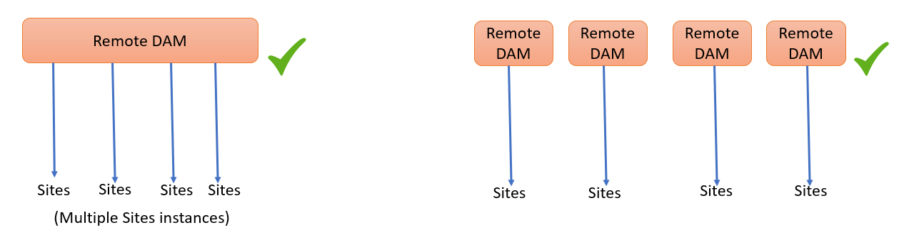

# Använd ansluten Assets för att dela DAM-resurser i [!DNL Experience Manager Sites] {#use-connected-assets-to-share-dam-assets-in-aem-sites}

| Version | Artikellänk |
| -------- | ---------------------------- |
| AEM 6.5 | [Klicka här](https://experienceleague.adobe.com/docs/experience-manager-65/assets/using/use-assets-across-connected-assets-instances.html?lang=sv-SE) |
| AEM as a Cloud Service | Den här artikeln |

I stora företag kan den infrastruktur som krävs för att skapa webbplatser vara distribuerad. Ibland kan funktionerna för att skapa webbplatser och de digitala resurser som används för att skapa webbplatserna finnas i olika distributioner. En orsak kan vara att befintliga distributioner som krävs för att fungera tillsammans distribueras geografiskt. En annan orsak kan vara förvärv som leder till heterogen infrastruktur, inklusive olika [!DNL Experience Manager]-versioner, som huvudföretaget vill använda tillsammans.

>[!NOTE]
>
>Adobe rekommenderar att du utnyttjar Dynamic Media med OpenAPI-funktioner för att ansluta AEM Assets as a Cloud Service och AEM Sites. Se [Integrera fjärr-AEM Assets med AEM Sites](/help/assets/integrate-remote-approved-assets-with-sites.md).

Ansluten Assets-funktionalitet stöder ovanstående användningsfall genom integrering av [!DNL Experience Manager Sites] och [!DNL Experience Manager Assets]. Användare kan skapa webbsidor i [!DNL Sites] som använder digitala resurser från separata [!DNL Assets]-distributioner.

>[!NOTE]
>
>Konfigurera bara anslutna Assets när du behöver använda resurserna som finns på en fjärrdistribution av DAM på en separat Sites-distribution för att skapa webbsidor.

## Översikt över uppkopplade Assets {#overview-of-connected-assets}

När du redigerar sidor i [!UICONTROL Page Editor] som målmål kan författarna enkelt söka efter, bläddra bland och bädda in resurser från en annan [!DNL Assets]-distribution som fungerar som en källa för resurser. Administratörerna skapar en engångsintegrering av en distribution av [!DNL Experience Manager] med [!DNL Sites]-funktioner med en annan distribution av [!DNL Experience Manager] med [!DNL Assets]-funktioner. Du kan också använda Dynamic Media-bilder på webbplatsens webbsidor via anslutna Assets och använda Dynamic Media-funktionerna, till exempel smarta beskärnings- och bildförinställningar.

För författarna till [!DNL Sites] är fjärrresurserna tillgängliga som skrivskyddade lokala resurser. Funktionen stöder smidig sökning och åtkomst till fjärrresurser i Site Editor. För andra användningsområden där det kan krävas att hela resursen är tillgänglig på Sites bör du överväga att migrera resurserna satsvis i stället för att använda anslutna Assets.

### Förutsättningar och driftsättningar som stöds {#prerequisites}

Innan du använder eller konfigurerar den här funktionen bör du kontrollera följande:

* Användarna ingår i rätt användargrupper för varje distribution.
* Ett av villkoren som stöds är uppfyllt för [!DNL Adobe Experience Manager]-distributionstyper. [!DNL Experience Manager] as a Cloud Service [!DNL Assets] fungerar med [!DNL Experience Manager] 6.5. Mer information om hur den här funktionen fungerar i [!DNL Experience Manager] 6.5 finns i [Ansluten Assets i [!DNL Experience Manager] 6.5 [!DNL Assets]](https://experienceleague.adobe.com/docs/experience-manager-65/assets/using/use-assets-across-connected-assets-instances.html?lang=sv-SE).

  | | [!DNL Sites] som en [!DNL Cloud Service] | [!DNL Experience Manager] 6.5 [!DNL Sites] på AMS | [!DNL Experience Manager] 6.5 [!DNL Sites] lokalt |
  |---|---|---|---|
  | **[!DNL Experience Manager Assets]som en[!DNL Cloud Service]** | Stöds | Stöds | Stöds |
  | **[!DNL Experience Manager]6.5 [!DNL Assets] i AMS** | Stöds | Stöds | Stöds |
  | **[!DNL Experience Manager]6.5 [!DNL Assets] lokal** | Stöds ej | Stöds ej | Stöds ej |

### Filformat som stöds {#mimetypes}

Författare söker efter bilder och följande typer av dokument i Content Finder och drar de sökbara resurserna i Page Editor. Dokument läggs till i komponenten `Download` och bilder i komponenten `Image`. Författare kan också lägga till fjärrresurserna i alla anpassade [!DNL Experience Manager]-komponenter som utökar standardkomponenterna `Download` eller `Image`. De format som stöds är:

* **Bildformat**: De format som stöds av [bildkomponenten](file-format-support.md#image-formats).
* **Dokumentformat**: Se de [dokumentformat som stöds](file-format-support.md#document-formats).

### Användare och grupper {#users-and-groups-involved}

De olika roller som är involverade i konfigureringen och funktionen och deras motsvarande användargrupper beskrivs nedan. Lokalt omfång används för de fall där en författare skapar en webbsida. Fjärromfång används för DAM-distributionen som är värd för de nödvändiga resurserna. Författaren [!DNL Sites] hämtar dessa fjärrresurser.

| Roll | Omfång | Användargrupp | Beskrivning |
|------|--------|-----------|----------|
| [!DNL Sites]-administratör | Lokalt | [!DNL Experience Manager] `administrators` | Konfigurera [!DNL Experience Manager] och konfigurera integrering med fjärrdistributionen [!DNL Assets]. |
| DAM-användare | Lokalt | `Authors` | Används för att visa och duplicera de hämtade resurserna i `/content/DAM/connectedassets/`. |
| [!DNL Sites]-författare | Lokalt | <ul><li>`Authors` (med läsåtkomst på fjärr-DAM och författaråtkomst på lokal [!DNL Sites]) </li> <li>`dam-users` på lokal [!DNL Sites]</li></ul> | Slutanvändare är [!DNL Sites] författare som använder den här integreringen för att förbättra innehållets hastighet. Författare kan söka efter och bläddra bland resurser i fjärr-DAM med hjälp av [!UICONTROL Content Finder] och använda de nödvändiga bilderna på lokala webbsidor. |
| [!DNL Assets]-administratör | Fjärr | [!DNL Experience Manager] `administrators` | Konfigurerar CORS (Cross-Origin Resource Sharing). |
| DAM-användare | Fjärr | `Authors` | Författarrollen på fjärrdistributionen [!DNL Experience Manager]. Sök efter och bläddra bland resurser i anslutna Assets med hjälp av [!UICONTROL Content Finder]. |
| DAM-distributör (teknisk användare) | Fjärr | <ul> <li> [!DNL Sites] `Authors`</li> <li> `connectedassets-assets-techaccts` </li> </ul> | Den här användaren som finns på fjärrdistributionen används av den lokala servern [!DNL Experience Manager] (inte författarrollen [!DNL Sites]) för att hämta fjärrresurserna för författaren [!DNL Sites]. |
| [!DNL Sites] teknisk användare | Lokalt | `connectedassets-sites-techaccts` | Tillåter [!DNL Assets]-distribution att söka efter referenser till resurser på [!DNL Sites]-webbsidorna. |

### Uppkopplad Assets-arkitektur {#connected-assets-architecture}

Med Experience Manager kan du ansluta en fjärr-DAM-distribution som en källa till flera Experience Manager [!DNL Sites]-distributioner. Du kan dock ansluta en [!DNL Sites]-distribution med endast en fjärr-DAM-distribution.

Utvärdera det optimala antalet Sites-instanser som ska anslutas till en fjärr-DAM-distribution. Adobe rekommenderar att du stegvis ansluter platsinstanser till distributionen och testar att det inte påverkar prestandan på fjärr-DAM, eftersom varje ansluten Sites-instans bidrar till datatrafiken på fjärr-DAM.

Följande diagram visar vilka scenarier som stöds:

I följande diagram visas ett scenario som inte stöds:

## Konfigurera en anslutning mellan [!DNL Sites] och [!DNL Assets] distributioner {#configure-a-connection-between-sites-and-assets-deployments}

En [!DNL Experience Manager]-administratör kan skapa den här integreringen. Behörigheterna som krävs för att använda det skapas via användargrupper när de har skapats. Användargrupperna definieras för distributionen [!DNL Sites] och för DAM-distributionen.

Följ de här stegen för att konfigurera anslutningsmöjligheter för anslutna Assets och lokala [!DNL Sites]-anslutningar:

1. Åtkomst till en befintlig [!DNL Sites]-distribution. Den här [!DNL Sites]-distributionen används för webbsidesredigering, till exempel `https://<sites_server_fqdn>:[port]`. När sidredigeringen sker vid distributionen av [!DNL Sites] kan vi anropa distributionen av [!DNL Sites] som lokal från sidredigeringsperspektivet.

1. Åtkomst till en befintlig [!DNL Assets]-distribution. Den här [!DNL Assets]-distributionen används för att hantera digitala resurser, till exempel `https://[assets_servername]:port`.

1. Kontrollera att användare och roller med rätt omfång finns i distributionen [!DNL Sites] och i distributionen [!DNL Assets] i AMS. Skapa en teknisk användare för distributionen av [!DNL Assets] och lägg till i användargruppen som nämns i [användare och grupper som deltar](/help/assets/use-assets-across-connected-assets-instances.md#users-and-groups-involved).

1. Åtkomst till den lokala [!DNL Sites]-distributionen på `https://[sites_servername]:port`. Klicka på **[!UICONTROL Tools]** > **[!UICONTROL Assets]** > **[!UICONTROL Connected Assets Configuration]** och ange följande värden:

   1. A **[!UICONTROL Title]** of the configuration.
   1. **[!UICONTROL Remote DAM URL]** är URL:en för platsen [!DNL Assets] i formatet `https://[assets_servername]:[port]`.
   1. Autentiseringsuppgifter för en DAM-distributör (teknisk användare).
   1. I fältet **[!UICONTROL Mount Point]** anger du den lokala [!DNL Experience Manager]-sökvägen där [!DNL Experience Manager] hämtar resurserna. Till exempel mappen `connectedassets`. Resurserna som hämtas från DAM lagras i den här mappen i distributionen [!DNL Sites].
   1. **[!UICONTROL Local Sites URL]** är platsen för [!DNL Sites]-distributionen. Distributionen av [!DNL Assets] använder det här värdet för att behålla referenser till de digitala resurserna som hämtas av den här [!DNL Sites]-distributionen.
   1. Autentiseringsuppgifter för den tekniska användaren [!DNL Sites].
   1. Värdet i fältet **[!UICONTROL Original Binary transfer optimization Threshold]** anger om de ursprungliga resurserna (inklusive återgivningarna) överförs synkront eller inte. Assets med mindre filstorlek kan enkelt hämtas medan resurser med relativt större filstorlek är bäst att synkronisera asynkront. Värdet beror på dina nätverksfunktioner.
   1. Välj **[!UICONTROL Datastore Shared with Connected Assets]** om du använder ett datalager för att lagra dina resurser och datalagret delas mellan båda distributionerna. I det här fallet spelar tröskelvärdet ingen roll eftersom faktiska tillgångsbinärfiler är tillgängliga i datalagret och inte överförs.

   

   *Bild: En typisk konfiguration för funktionerna i anslutna Assets.*

1. De befintliga digitala resurserna i distributionen [!DNL Assets] har redan bearbetats och återgivningarna genereras. Dessa återgivningar hämtas med den här funktionen så du behöver inte generera om återgivningarna. Inaktivera arbetsflödets startprogram för att förhindra återgivning av återgivningar. Justera startkonfigurationerna för distributionen ([!DNL Sites]) så att mappen `connectedassets` exkluderas (resurserna hämtas i den här mappen).

   1. Vid distributionen av [!DNL Sites] klickar du på **[!UICONTROL Tools]** > **[!UICONTROL Workflow]** > **[!UICONTROL Launchers]**.

   1. Sök efter startprogram med arbetsflöden som **[!UICONTROL DAM Update Asset]** och **[!UICONTROL DAM Metadata Writeback]**.

   1. Välj startprogrammet för arbetsflödet och klicka på **[!UICONTROL Properties]** i åtgärdsfältet.

   1. I guiden [!UICONTROL Properties] ändrar du **[!UICONTROL Path]**-fälten som följande mappningar för att uppdatera deras reguljära uttryck så att monteringspunkten **[!UICONTROL connectedassets]** utesluts.

   | Före | Efter |
   | ------ | ------------ |
   | `/content/dam(/((?!/subassets).)*/)renditions/original` | `/content/dam(/((?!/subassets)(?!connectedassets).)*/)renditions/original` |
   | `/content/dam(/.*/)renditions/original` | `/content/dam(/((?!connectedassets).)*/)renditions/original` |
   | `/content/dam(/.*)/jcr:content/metadata` | `/content/dam(/((?!connectedassets).)*/)jcr:content/metadata` |

   >[!NOTE]
   >
   >Alla återgivningar som är tillgängliga på fjärrdistributionen hämtas när författare hämtar en resurs. Om du vill skapa fler återgivningar av en hämtad resurs hoppar du över det här konfigurationssteget. Arbetsflödet [!UICONTROL DAM Update Asset] aktiveras och skapar fler återgivningar. Dessa återgivningar är bara tillgängliga på den lokala distributionen av [!DNL Sites] och inte på den fjärranslutna DAM-distributionen.

1. Lägg till distributionen [!DNL Sites] som ett tillåtet ursprung i CORS-konfigurationen i distributionen [!DNL Assets]. Mer information finns i [förstå CORS](https://experienceleague.adobe.com/docs/experience-manager-learn/foundation/security/understand-cross-origin-resource-sharing.html?lang=sv-SE).

1. Konfigurera [stöd för samma webbplats-cookie](/help/security/same-site-cookie-support.md).

Du kan kontrollera anslutningen mellan de konfigurerade [!DNL Sites]-distributionerna och [!DNL Assets]-distributionen.

![Anslutningstest för anslutet Assets konfigurerat [!DNL Sites]](assets/connected-assets-multiple-config.png)
*Bild: Anslutningstestet för ansluten Assets har konfigurerats [!DNL Sites].*

<!-- TBD: Check if Launchers are to be disabled on CS instances. Is this option even available to the users on CS? -->

## Använd dynamiska medieresurser {#dynamic-media-assets}

Med Connected Assets kan du använda bildresurser som bearbetats av [!DNL Dynamic Media] från fjärr-DAM-distributionen på Sites-sidor och använda Dynamic Media-funktioner, som smarta beskärnings- och bildförinställningar.

Så här använder du [!DNL Dynamic Media] med anslutna Assets:

1. Konfigurera [!DNL Dynamic Media] på fjärr-DAM-distribution med synkroniseringsläge aktiverat.
1. Konfigurera [anslutna Assets](#configure-a-connection-between-sites-and-assets-deployments).
1. Konfigurera [!DNL Dynamic Media] på Sites-instansen med samma företagsnamn som konfigurerats på fjärr-DAM. Webbplatsdistributionen måste ha skrivskyddad åtkomst till det dynamiska mediekontot för att kunna arbeta med anslutna resurser. Se därför till att inaktivera synkroniseringsläget i Dynamic Media-konfigurationen på platsinstansen.

>[!CAUTION]
>
>Med konfigurationen för ansluten Assets och [!DNL Dynamic Media] kan du inte använda [!DNL Dynamic Media] för att bearbeta lokala resurser som är tillgängliga i distributionen [!DNL Sites].

## Konfigurera [!DNL Dynamic Media] {#configure-dynamic-media}

Så här konfigurerar du [!DNL Dynamic Media] för [!DNL Assets]- och [!DNL Sites]-distributioner:

1. Skapa ansluten Assets-konfiguration enligt beskrivningen ovan, förutom när du konfigurerar funktionen, välj alternativet **[!UICONTROL Fetch original rendition for Dynamic Media Connected Assets]**.

1. Konfigurera [!DNL Dynamic Media] på lokala [!DNL Sites]- och fjärrdistributioner [!DNL Assets]. Följ instruktionerna för att [konfigurera [!DNL Dynamic Media]](/help/assets/dynamic-media/config-dm.md#configuring-dynamic-media-cloud-services).

   * Använd samma företagsnamn i alla konfigurationer.
   * På lokal [!DNL Sites] väljer du [!UICONTROL Dynamic Media sync mode] i **[!UICONTROL Disabled by default]**. Distributionen [!DNL Sites] måste ha skrivskyddad åtkomst till kontot [!DNL Dynamic Media].
   * På lokal [!DNL Sites] väljer du **[!UICONTROL Publish Assets]** i alternativet **[!UICONTROL Selective Publish]**. Välj inte **[!UICONTROL Sync All Content]**.
   * På fjärrdistribution av [!DNL Assets] i [!UICONTROL Dynamic Media sync mode] väljer du **[!UICONTROL Enabled by default]**.

1. Aktivera [[!DNL Dynamic Media] stöd i Image Core Component](https://experienceleague.adobe.com/docs/experience-manager-core-components/using/components/image.html?lang=sv-SE#dynamic-media). Med den här funktionen aktiveras [Image-komponenten](https://www.aemcomponents.dev/content/core-components-examples/library/core-content/image.html) som standard för att visa [!DNL Dynamic Media] bilder när [!DNL Dynamic Media] bilder används av författare på webbsidor i lokal [!DNL Sites]-distribution.

## Använd fjärrresurser {#use-remote-assets}

Webbplatsens författare använder Content Finder för att ansluta till DAM-distributionen. Författarna kan bläddra bland, söka efter och dra fjärresurserna till en komponent. Om du vill autentisera till fjärr-DAM ska du se till att de autentiseringsuppgifter som administratören har angett är tillgängliga.

Författare kan använda resurserna som finns på den lokala DAM-resursen och den fjärranslutna DAM-distributionen på en enda webbsida. Använd Content Finder för att växla mellan att söka i det lokala DAM-systemet eller söka i det fjärranslutna DAM-systemet.

Endast taggar för fjärrresurser hämtas som har en exakt motsvarande tagg tillsammans med samma taxonomi-hierarki, som är tillgänglig på den lokala [!DNL Sites]-distributionen. Alla andra taggar tas bort. Författare kan söka efter fjärrresurser med hjälp av alla taggar som finns i fjärrdistributionen [!DNL Experience Manager], eftersom det ger en fulltextsökning.

### Genomgång av användningen {#walk-through-of-usage}

Använd konfigurationen ovan när du vill prova redigeringsfunktionen och se hur den fungerar. Använd de dokument eller bilder du vill ha på den fjärranslutna DAM-distributionen.

1. Navigera till gränssnittet [!DNL Assets] i fjärrdistributionen genom att gå till **[!UICONTROL Assets]** > **[!UICONTROL Files]** från arbetsytan [!DNL Experience Manager]. Du kan även få åtkomst till `https://[assets_servername_ams]:[port]/assets.html/content/dam` i en webbläsare. Ladda upp de resurser du vill ha.

1. Klicka på [!DNL Sites] i profilaktiveraren i det övre högra hörnet i distributionen **[!UICONTROL Impersonate as]**. Ange användarnamnet, markera det angivna alternativet och klicka på **[!UICONTROL OK]**.

1. Öppna en [!DNL Sites]-sida och redigera sidan.

   Klicka på **[!UICONTROL Toggle Side Panel]** överst till vänster på sidan.

1. Öppna fliken [!UICONTROL Assets] (Remote Content Finder) och klicka på **[!UICONTROL Log in to Connected Assets]**.

1. Ange autentiseringsuppgifter för inloggning på ansluten Assets. Den här användaren har redigeringsbehörighet för båda [!DNL Experience Manager]-distributionerna.

1. Sök efter resursen som du har lagt till i DAM. Fjärresurserna visas i den vänstra panelen. Filtrera efter bilder eller dokument och filtrera efter olika typer av dokument som stöds. Dra bilderna till en `Image`-komponent och dokument till en `Download`-komponent.

   De hämtade resurserna är skrivskyddade i den lokala [!DNL Sites]-distributionen. Du kan fortfarande använda alternativen som tillhandahålls av dina [!DNL Sites]-komponenter för att redigera den hämtade resursen. Redigering med komponenter är icke-destruktiv.

   

   *Bild: Alternativ för att filtrera dokumenttyper och bilder när du söker efter resurser på fjärr-DAM.*

1. En webbplatsförfattare får ett meddelande om en resurs original hämtas asynkront och om någon hämtningsåtgärd misslyckas. Vid redigering eller även efter redigering kan författarna se detaljerad information om hämtningsuppgifter och fel i användargränssnittet för [asynkrona jobb](/help/operations/asynchronous-jobs.md).

   

   *Bild: Meddelande om asynkron hämtning av resurser som sker i bakgrunden.*

1. När du publicerar en sida visar [!DNL Experience Manager] en fullständig lista över resurser som används på sidan. Kontrollera att fjärresurserna har hämtats vid publiceringen. Om du vill kontrollera statusen för varje hämtad resurs läser du [användargränssnittet för asynkrona jobb](/help/operations/asynchronous-jobs.md).

   >[!NOTE]
   >
   >Sidan publiceras även om en eller flera fjärrresurser inte hämtas helt. I meddelandeområdet [!DNL Experience Manager] visas ett meddelande om fel som visas på sidan för asynkrona jobb.

>[!CAUTION]
>
>När de hämtade fjärrresurserna har använts på en webbsida är de sökbara och användbara för alla som har behörighet att komma åt den lokala mappen. De hämtade resurserna lagras i den lokala mappen (`connectedassets` i ovanstående genomgång). Resurserna är också sökbara och synliga i det lokala datalagret via [!UICONTROL Content Finder].

De hämtade resurserna kan användas som andra lokala resurser, förutom att associerade metadata inte kan redigeras.

### Kontrollera hur en resurs används på olika webbsidor {#asset-usage-references}

Med [!DNL Experience Manager] kan DAM-användare kontrollera alla referenser till en resurs. Det hjälper till att förstå och hantera användningen av en resurs på fjärrkontrollen [!DNL Sites] och i sammansatta resurser. Många författare av webbsidor i distributionen [!DNL Experience Manager Sites] kan använda en resurs på en fjärr-DAM på olika webbsidor. För att förenkla resurshanteringen och inte leda till brutna referenser är det viktigt för DAM-användarna att kontrollera användningen av en resurs på lokala webbplatser och fjärrwebbsidor. Fliken [!UICONTROL References] på sidan [!UICONTROL Properties] för en resurs visar lokala referenser och fjärrreferenser för resursen.

Följ de här stegen för att visa och hantera referenser för distributionen [!DNL Assets]:

1. Välj en resurs i [!DNL Assets] Console och klicka på **[!UICONTROL Properties]** i verktygsfältet.
1. Klicka på fliken **[!UICONTROL References]**. Se **[!UICONTROL Local References]** för användning av resursen i distributionen [!DNL Assets]. Se **[!UICONTROL Remote References] om du vill använda resursen i [!DNL Sites]-distributionen där resursen hämtades med hjälp av funktionen för anslutna Assets.

   

1. Referenserna för [!DNL Sites] sidor visar totalt antal referenser för varje lokal [!DNL Sites]. Det kan ta en stund att hitta alla referenser och visa det totala antalet referenser.
1. Listan med referenser är interaktiv och DAM-användare kan klicka på en referens för att öppna referenssidan. Om fjärrreferenser av någon anledning inte kan hämtas visas ett meddelande som informerar användaren om felet.
1. Användare kan flytta eller ta bort resursen. När du flyttar eller tar bort en resurs visas det totala antalet referenser för alla markerade resurser/mappar i en varningsdialogruta. När du tar bort en resurs för vilken referenserna ännu inte har hämtats visas en varningsdialogruta.

   

### Hantera uppdateringar av resurser i fjärr-DAM {#handling-updates-to-remote-assets}

När [har konfigurerat en anslutning](#configure-a-connection-between-sites-and-assets-deployments) mellan fjärr-DAM- och platsdistributioner blir resurserna på fjärr-DAM tillgängliga i platsdistributionen. Du kan sedan uppdatera, ta bort, byta namn på och flytta resurser eller mappar i fjärr-DAM. Uppdateringarna, med viss fördröjning, är automatiskt tillgängliga i Sites-distributionen. Om en resurs på en fjärransluten DAM används på en lokal Experience Manager Sites-sida visas dessutom uppdateringarna av resursen på fjärr-DAM på sidan Platser.

När du flyttar en resurs från en plats till en annan måste du [justera referenser](manage-digital-assets.md) så att resursen visas på sidan Platser. Om du flyttar en resurs till en plats som inte är tillgänglig från den lokala webbplatsdistributionen visas inte resursen i webbplatsdistributionen.

Du kan också uppdatera metadataegenskaperna för en resurs på en fjärr-DAM och ändringarna är tillgängliga i den lokala platsdistributionen.

Webbplatsförfattare kan förhandsgranska de tillgängliga uppdateringarna i webbplatsdistributionen och sedan publicera ändringarna igen för att göra dem tillgängliga i AEM publiceringsinstans.

Experience Manager visar en `expired`-statusindikator för resurser i Assets Content Finder för fjärrhantering så att webbplatsförfattare inte kan använda resursen på en webbplatssida. Om du använder en resurs med statusen `expired` på en Sites-sida visas inte resursen i Experience Manager publiceringsinstans.

## Vanliga frågor {#frequently-asked-questions}

+++**Ska du konfigurera anslutna Assets om du behöver använda resurser som är tillgängliga i din [!DNL Sites]-distribution?**

Du behöver inte konfigurera Connected Assets i så fall. Du kan använda resurser som är tillgängliga i distributionen [!DNL Sites].

+++

+++**När behöver du konfigurera den anslutna Assets-funktionen?**

Konfigurera bara den anslutna Assets-funktionen när du behöver använda resurserna som är tillgängliga i en fjärr-DAM-distribution på en [!DNL Sites]-distribution.

+++

+++**Kan du ansluta flera [!DNL Sites]-distributioner till en fjärr-DAM-distribution efter att du har konfigurerat anslutna Assets?**

Ja, du kan ansluta flera [!DNL Sites]-distributioner till en fjärr-DAM-distribution efter att ha konfigurerat ansluten Assets. Mer information finns i [Ansluten Assets-arkitektur](#connected-assets-architecture).

+++

+++**Hur många fjärr-DAM-distributioner kan du ansluta till en [!DNL Sites]-distribution efter konfigurering av ansluten Assets?**

Du kan ansluta en fjärr-DAM-distribution till en [!DNL Sites]-distribution efter att du har konfigurerat anslutna Assets. Mer information finns i [Ansluten Assets-arkitektur](#connected-assets-architecture).

+++

+++**Kan du använda dynamiska medieresurser från din [!DNL Sites]-distribution efter att du har konfigurerat anslutna Assets?**

När du har konfigurerat anslutna Assets är [!DNL Dynamic Media] resurser tillgängliga för [!DNL Sites]-distributionen i skrivskyddat läge. Därför kan du inte använda [!DNL Dynamic Media] för att bearbeta resurser i distributionen [!DNL Sites]. Mer information finns i [Konfigurera en anslutning mellan platser och distributioner av dynamiska media](#dynamic-media-assets).

+++

+++**Kan du använda resurser i formaten för bild och dokument från fjärr-DAM-distributionen i distributionen [!DNL Sites] efter att du har konfigurerat anslutna Assets?**

Ja, du kan använda resurser för formaten Image och Document från fjärr-DAM-distributionen på distributionen [!DNL Sites] efter att du har konfigurerat Connected Assets.

+++

+++**Kan du använda innehållsfragment och videomaterial från fjärr-DAM-distributionen på distributionen [!DNL Sites] efter att ha konfigurerat anslutna Assets?**

Nej, du kan inte använda innehållsfragment och videoresurser från fjärr-DAM-distributionen på distributionen [!DNL Sites] efter att ha konfigurerat ansluten Assets.

+++

+++**Kan du använda dynamiska medieresurser från fjärr-DAM-distributionen på distributionen [!DNL Sites] efter att du har konfigurerat anslutna Assets?**

Ja, du kan konfigurera och använda Dynamic Media-bildresurser från fjärr-DAM-distributionen på distributionen [!DNL Sites] efter att du har konfigurerat anslutna Assets. Mer information finns i [Konfigurera en anslutning mellan platser och distributioner av dynamiska media](#dynamic-media-assets).

+++

+++**När du har konfigurerat ansluten Assets, kan du uppdatera, ta bort, byta namn på och flytta åtgärder på fjärr-DAM-resurser eller -mappar?**

Ja, när du har konfigurerat Connected Assets kan du uppdatera, ta bort, byta namn på och flytta resurser eller mappar i fjärr-DAM. Uppdateringarna, med viss fördröjning, är automatiskt tillgängliga i Sites-distributionen. Mer information finns i [Hantera uppdateringar av resurser i fjärr-DAM](#handling-updates-to-remote-assets).

+++

+++**När du har konfigurerat ansluten Assets, kan du lägga till eller ändra resurser i din [!DNL Sites]-distribution och göra dem tillgängliga på fjärr-DAM-distribution?**

Du kan lägga till resurser i distributionen [!DNL Sites], men dessa resurser kan inte göras tillgängliga för fjärr-DAM-distributionen.

+++

## Begränsningar och bästa metoder {#tip-and-limitations}

* Konfigurera [Assets Insight](/help/assets/assets-insights.md)-funktionen för instansen [!DNL Sites] om du vill få information om resursanvändning.
* Användning av sökvägsläsare i redigeringskomponenter stöds inte i anslutna resurser.

* Du kan inte dra fjärrresursen till dialogrutan [Konfigurera bildkomponent](https://experienceleague.adobe.com/docs/experience-manager-core-components/using/wcm-components/image.html?lang=sv-SE#configure-dialog). Du kan dock dra fjärrresursen direkt till bildkomponenten på sidan Platser utan att klicka på **[!UICONTROL Configure]**.

### Tillstånd och resurshantering {#permissions-and-managing-assets}

* Lokala resurser är skrivskyddade kopior. [!DNL Experience Manager]-komponenter utför icke-förstörande redigering av resurser. Inga andra redigeringar tillåts.
* Lokalt hämtade resurser är endast tillgängliga för redigeringsändamål. Det går inte att använda arbetsflöden för resursuppdatering och metadata kan inte redigeras.
* När du använder [!DNL Dynamic Media] på [!DNL Sites] sidor hämtas inte den ursprungliga resursen och lagras på den lokala distributionen. Noden `dam:Asset`, metadata och återgivningar som genereras av distributionen [!DNL Assets] hämtas alla i distributionen [!DNL Sites].
* Endast bilder och dokumentformaten i listan stöds. [!DNL Content Fragments] och [!DNL Experience Fragments] stöds inte.
* [!DNL Experience Manager] hämtar inte metadatamcheman. Det innebär att alla hämtade metadata inte visas. Om schemat uppdateras separat för distributionen [!DNL Sites] visas alla metadataegenskaper.
* Alla [!DNL Sites]-författare har läsbehörighet för de hämtade kopiorna, även om författare inte har åtkomst till fjärr-DAM-distributionen.
* Det finns inte API-stöd för att anpassa integreringen.
* Funktionen stöder smidig sökning och användning av fjärresurser. Om du vill göra många fjärresurser tillgängliga i den lokala distributionen på en gång bör du överväga att migrera resurserna.
* Det går inte att använda en fjärrresurs som sidminiatyr i användargränssnittet för [!UICONTROL Page Properties]. Du kan ange en miniatyrbild för en webbsida i användargränssnittet för [!UICONTROL Page Properties] från [!UICONTROL Thumbnail] genom att klicka på [!UICONTROL Select Image].

### Konfigurera och licensiera {#setup-licensing}

* [!DNL Assets]-distribution på [!DNL Adobe Managed Services] stöds.
* [!DNL Sites] kan ansluta till en enskild [!DNL Assets]-distribution åt gången.
* En licens för [!DNL Assets] som fungerar som fjärrdatabas krävs.
* En eller flera licenser av [!DNL Sites] som fungerar som lokal redigeringsdistribution krävs.

### Användning {#usage}

* Användare kan söka efter fjärrresurser och dra dem på den lokala sidan när de redigerar. Inga andra funktioner stöds.
* Tidsgränsen för hämtning är 5 sekunder. Författare kan ha problem med att hämta resurser, till exempel om det råder nätverksproblem. Författare kan försöka igen genom att dra fjärrresursen från [!UICONTROL Content Finder] till [!UICONTROL Page Editor].
* Enkla redigeringar som inte är förstörande och redigeringen som stöds via komponenten `Image` kan göras på hämtade resurser. Resurserna är skrivskyddade.
* Det enda sättet att hämta resursen på nytt är att dra den till en sida. Det finns inget API-stöd eller andra metoder för att hämta om en resurs för att uppdatera den.
* Om resurser tas bort från DAM används de fortfarande på [!DNL Sites] sidor.
* Fjärrreferensposterna för en resurs hämtas asynkront. Referenserna och det totala antalet är inte i realtid och det kan finnas vissa skillnader om en [!DNL Sites]-författare använder resursen medan en DAM-användare visar referensen. DAM-användare kan uppdatera sidan och försöka igen om några minuter för att få fram det totala antalet.

## Felsöka problem {#troubleshoot}

Följ de här stegen för att felsöka vanliga fel:

* Om du inte kan söka efter fjärrresurser från [!UICONTROL Content Finder] kontrollerar du att de roller och behörigheter som krävs finns på plats.

* En resurs som hämtats från fjärr-DAM kanske inte publiceras på en webbsida av en eller flera orsaker. Den finns inte på fjärrservern, saknar tillräcklig behörighet för att hämta den eller så kan nätverksfel vara orsaken. Se till att resursen inte tas bort från fjärr-DAM. Se till att rätt behörigheter finns och att kraven är uppfyllda. Försök lägga till resursen på sidan igen och publicera den på nytt. Kontrollera i [listan över asynkrona jobb](/help/operations/asynchronous-jobs.md) om fel uppstod vid hämtning av resurser.

* Om du inte kan komma åt fjärr-DAM-distributionen från den lokala [!DNL Sites]-distributionen kontrollerar du att cookies mellan platser tillåts och att [samma stöd för webbplatsens cookies](/help/security/same-site-cookie-support.md) har konfigurerats. Om cookies mellan platser blockeras kanske inte distributionerna av [!DNL Experience Manager] autentiseras. [!DNL Google Chrome] i Incognito-läge kan till exempel blockera cookies från tredje part. Om du vill tillåta cookies i webbläsaren [!DNL Chrome] klickar du på ögonikonen i adressfältet, går till **Webbplatsen fungerar inte** > **Blockerad**, väljer fjärr-DAM-URL och tillåter inloggningstokcookie. Se även [hur du aktiverar cookies från tredje part](https://support.google.com/chrome/answer/95647).

  

* Om fjärrreferenser inte hämtas och leder till ett felmeddelande, kontrollerar du om distributionen av [!DNL Sites] är tillgänglig och söker efter nätverksanslutningsproblem. Försök igen senare för att kontrollera. [!DNL Assets]-distribution försöker upprätta en anslutning med [!DNL Sites]-distributionen två gånger och rapporterar sedan ett fel.

  

**Se även**

* [Översätt Assets](translate-assets.md)
* [ASSETS HTTP API](mac-api-assets.md)
* [Filformat som stöds av Assets](file-format-support.md)
* [Sök resurser](search-assets.md)
* [Resursrapporter](asset-reports.md)
* [Metadata-scheman](metadata-schemas.md)
* [Hämta resurser](download-assets-from-aem.md)
* [Hantera metadata](manage-metadata.md)
* [Sök efter ansikten](search-facets.md)
* [Hantera samlingar](manage-collections.md)
* [Import av massmetadata](metadata-import-export.md)
* [Publicera Assets till AEM och Dynamic Media](/help/assets/publish-assets-to-aem-and-dm.md)
