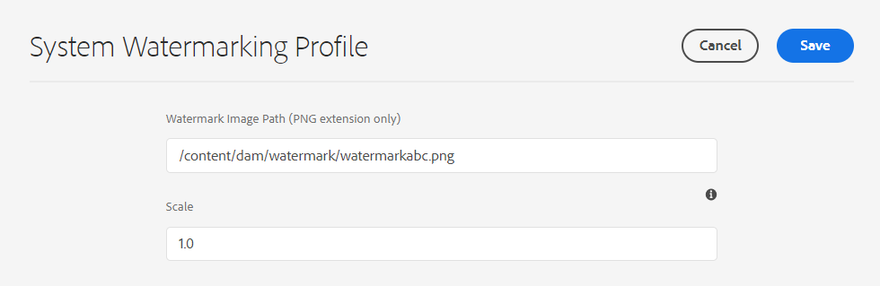

# Vattenstämpla dina resurser {#watermark-assets}

[!DNL Adobe Experience Manager Assets] Med kan du lägga till en digital vattenstämpel i bilder. [!DNL Assets] har stöd för att använda en bild som vattenstämpel på andra bildfiler. Vattenstämplar kan hjälpa användare att verifiera autenticitet och upphovsrättsskydd för resurserna. En vattenstämpel kan också användas för att ange ett dokuments status, t.ex. konfidentiellt, utkast, giltighet.

Konfigurera [!DNL Experience Manager] till vattenstämpelresurser:

1. En PNG-fil används som en vattenstämpel. Överför den här filen till DAM-databasen.

1. Navigera till **[!UICONTROL Tools > Assets > Assets Configurations]**.

1. Klicka på **[!UICONTROL System Watermarking Profile]**.

1. På [!UICONTROL System Watermarking Profile page]anger du bildsökvägen som ska överföras till DAM-databasen i steg 1.

1. Ange vattenstämpelskalan (från 0,0 till 1,0) i förhållande till återgivningsbredden i dialogrutan **[!UICONTROL Scale]** fält.

1. Klicka på **[!UICONTROL Save]**.

   

   >[!NOTE]
   >
   >Om du har konfigurerat systemprofilen för vattenstämplar med `com.adobe.cq.assetcompute.impl.profile.WatermarkingProfileServiceImpl.cfg.json` konfigurationsfilen (OSGi-konfiguration) kan du fortsätta att använda den, men Adobe rekommenderar att du använder den nya metoden.

1. [Skapa en bearbetningsprofil](/help/assets/asset-microservices-configure-and-use.md#create-custom-profile) för att utnyttja tillgångsmikrotjänster för att använda vattenstämpeln.

   

   Se till att du aktiverar **[!UICONTROL Watermark]** växla när du skapar bearbetningsprofilen.

1. [Använda bearbetningsprofilerna på en mapp](/help/assets/asset-microservices-configure-and-use.md#use-profiles) för att skapa material med vattenstämpel.

## Tips och begränsningar {#tips-limitations-bestpractices}

* Du kan använda en enda konfiguration för att vattenstämpla alla resurser. Endast en bild används för vattenstämplar och dess bredd är fast.
* Du kan placera vattenstämpeln i mitten utan att skriva ut.
* Textbaserade vattenstämplar stöds inte.

>[!MORELIKETHIS]
>
>* [Resursmikrotjänster - översikt](/help/assets/asset-microservices-overview.md).
>* [Använda resursmikrotjänster med bearbetningsprofiler](/help/assets/asset-microservices-configure-and-use.md).

