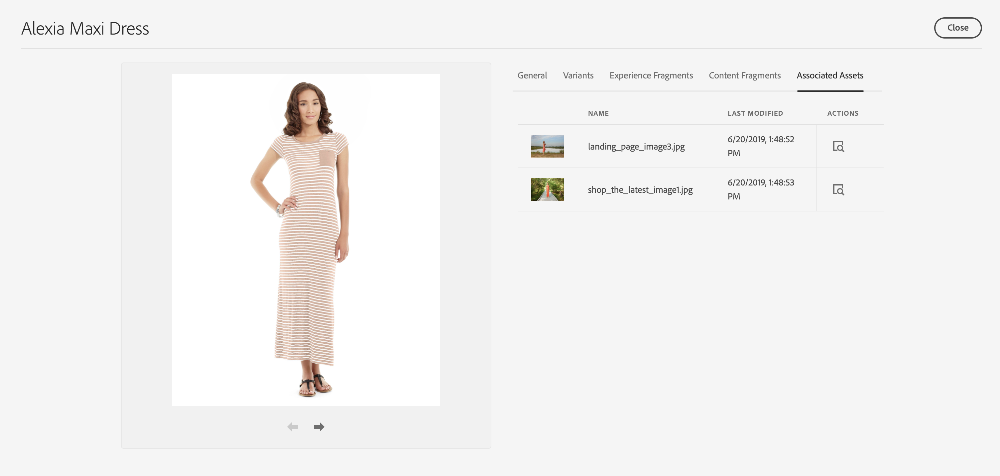

# Product Cockpit {#product-cockpit}

## Översikt {#overview}

I Product Cockpit finns en enhetlig översikt över länkade produktkataloger och tillhörande innehåll. Allt associerat innehåll har länkar som snabbt kommer åt det från cockpit.

Mellanlagrade produktdata inkluderar eventuell mutation i framtiden, t.ex. nya kategorier, produkter eller uppdaterade egenskaper.

>[!NOTE]
>
>Termen produktkatalog är utbytbar med e-handelsbutiker, butiksvy och liknande uttryck.

## Konfiguration {#configuration}

Produktkataloger måste konfigureras i AEM. Se [konfigurera butik och kataloger](https://experienceleague.adobe.com/docs/experience-manager-cloud-service/content-and-commerce/storefront/getting-started.html?#catalog) för mer information.

Aktivering av mellanlagrade katalogfunktioner kräver autentisering. Se [Komma igång](https://experienceleague.adobe.com/docs/experience-manager-cloud-service/content-and-commerce/storefront/getting-started.html) för mer information.

>[!NOTE]
>
>Mellanlagrade katalogfunktioner är bara tillgängliga med Adobe Commerce- och tredjepartsanslutningar som stöder tokenbaserad autentisering.

## Öppna produktdockan {#opening-product-cockpit}

Det enklaste sättet att komma åt produktdockan är via menyn&quot;Handel&quot; AEM huvudmenyn. Det går också att använda Omnissearch (sök efter handel) eller att öppna `https://<yourAEMInstance>/commerce.html`.

## Bläddra i produktkataloger {#browsing-product-catalogs}

Produktkatalogen ordnas hierarkiskt efter produktkatalogstrukturen. Den första nivån visar katalogrotnivån för alla konfigurerade produktkataloger, inklusive metainformation om e-handelsserverdelen.

Om du klickar på en kategori läses de underordnade objekten för den valda kategorin in.

Om du klickar på en produkt läses produktvariationer in om sådana finns.

>[!NOTE]
>
>Produktkatalogdata i AEM är data som hämtas i realtid via den konfigurerade slutpunkten för e-handel. Inga produktkatalogdata lagras i AEM.

## Söker produktkataloger {#searching-product-catalog}

En textsökning i hela produktkatalogen finns på den vänstra filterfliken för att snabbt hitta produkter.

## Bläddrar i den mellanlagrade produktkatalogen {#staged-product-catalogs}

Som standard visas data i produktkatalogen i produktcockpit. Om du använder&quot;STAGED CATALOG&quot; på den vänstra filterfliken läses produktkatalogen in för ett valt datum.

## Egenskaper för produktkatalog {#catalog-properties}

Om du klickar på egenskapsikonen för en produkt eller kategori öppnas egenskapsvyn för det valda objektet. Öppna egenskaper för en produktvariant är lika med öppna de huvudsakliga produktegenskaperna.

### Flikar {#tabs}

På flikarna Allmänt och Variant visas fördefinierade handelsegenskaper som kommer från e-handelsservern. Denna information (inkl. varianter) är skrivskyddade data i AEM eftersom arkivsystemet är e-handelsserverdelen. Variantfliken visas bara för produkter med varianter och visar en lista med alla varianter.

### AEM innehållsflikar {#content-tabs}

Dessa flikar, grupperade efter AEM (Experience Fragments, Content Fragments, Associated Assets), visar AEM innehåll som är associerat med handelsobjektet. Åtgärden Visa detaljer öppnar en ny webbläsarflik med det valda innehållet.

